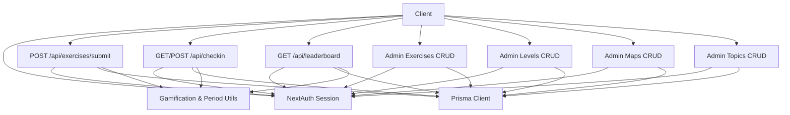
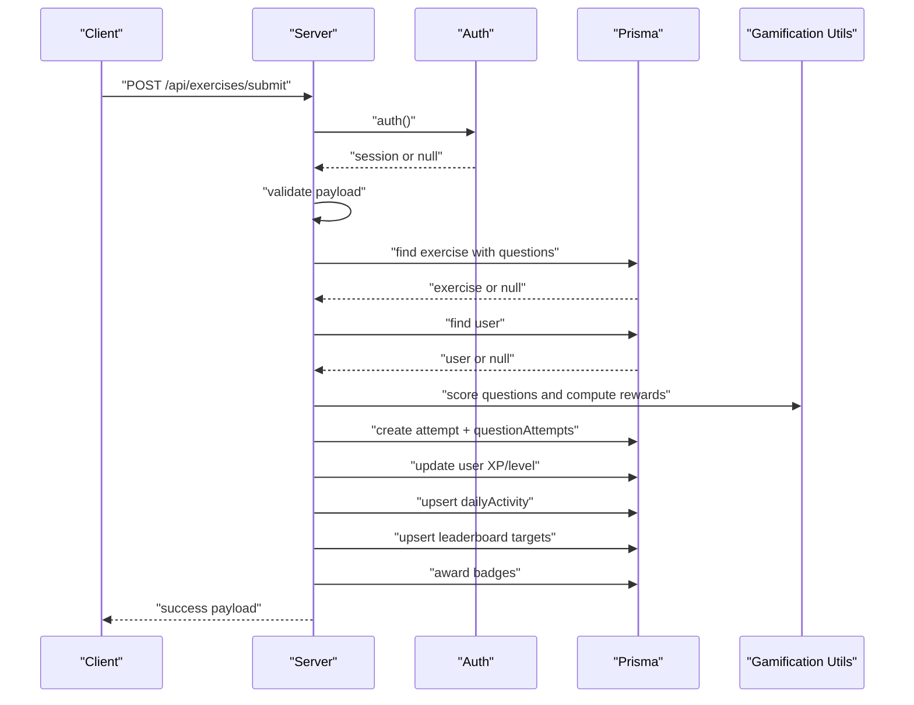
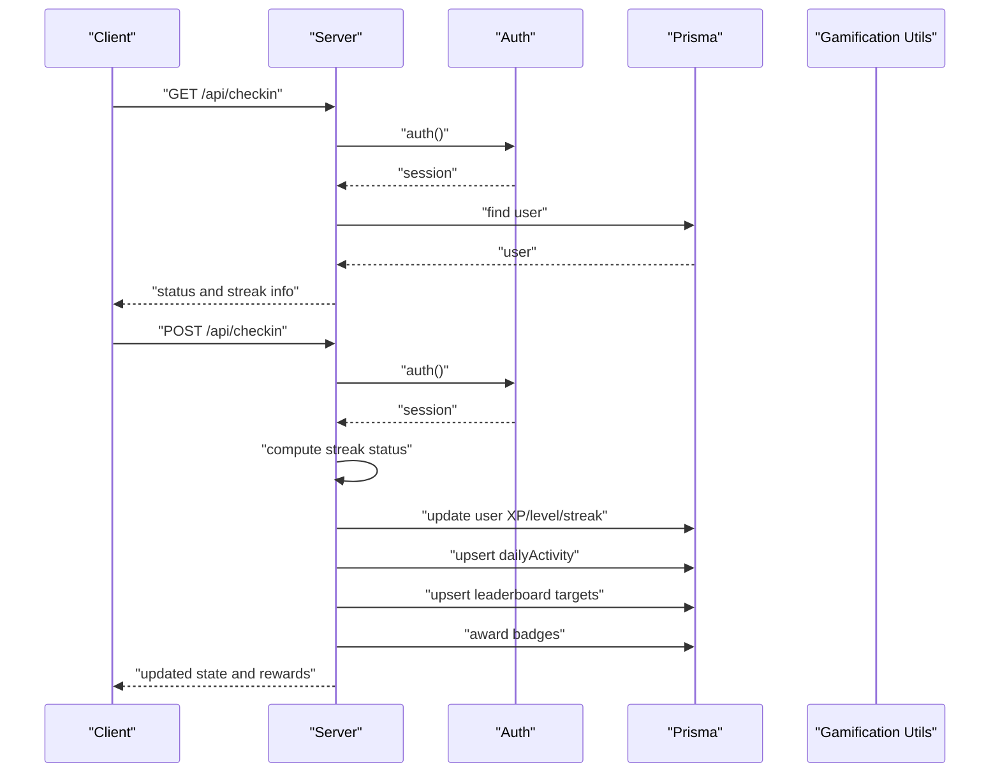
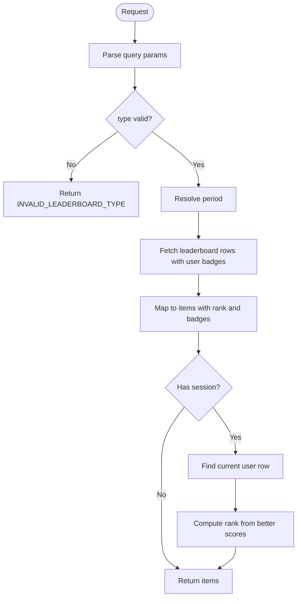
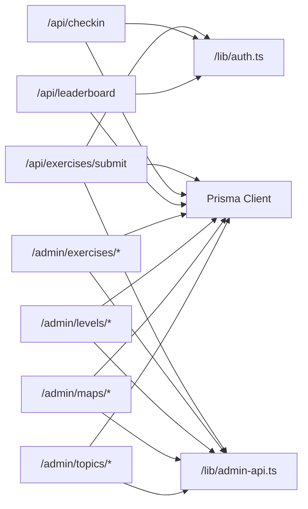

# API Reference

<cite>
**Referenced Files in This Document**
- [route.ts](file://english_pronunciation_app/frontend/src/app/api/exercises/submit/route.ts)
- [route.ts](file://english_pronunciation_app/frontend/src/app/api/checkin/route.ts)
- [route.ts](file://english_pronunciation_app/frontend/src/app/api/leaderboard/route.ts)
- [route.ts](file://english_pronunciation_app/frontend/src/app/api/admin/exercises/[id]/route.ts)
- [route.ts](file://english_pronunciation_app/frontend/src/app/api/admin/exercises/route.ts)
- [route.ts](file://english_pronunciation_app/frontend/src/app/api/admin/levels/[id]/route.ts)
- [route.ts](file://english_pronunciation_app/frontend/src/app/api/admin/levels/route.ts)
- [route.ts](file://english_pronunciation_app/frontend/src/app/api/admin/maps/[id]/route.ts)
- [route.ts](file://english_pronunciation_app/frontend/src/app/api/admin/maps/route.ts)
- [route.ts](file://english_pronunciation_app/frontend/src/app/api/admin/topics/[id]/route.ts)
- [route.ts](file://english_pronunciation_app/frontend/src/app/api/admin/topics/route.ts)
- [admin-api.ts](file://english_pronunciation_app/frontend/src/lib/admin-api.ts)
- [auth.ts](file://english_pronunciation_app/frontend/src/lib/auth.ts)
</cite>

## Table of Contents
1. [Introduction](#introduction)
2. [Project Structure](#project-structure)
3. [Core Components](#core-components)
4. [Architecture Overview](#architecture-overview)
5. [Detailed Component Analysis](#detailed-component-analysis)
6. [Dependency Analysis](#dependency-analysis)
7. [Performance Considerations](#performance-considerations)
8. [Troubleshooting Guide](#troubleshooting-guide)
9. [Conclusion](#conclusion)
10. [Appendices](#appendices)

## Introduction
This document provides comprehensive API documentation for the English pronunciation application’s public and administrative endpoints. It covers:
- RESTful endpoint definitions (HTTP methods, URL patterns, request/response schemas)
- Authentication and authorization requirements
- Exercise submission and scoring workflows
- Daily check-in and streak tracking
- Leaderboard ranking and progress aggregation
- Administrative content management endpoints for exercises, topics, levels, and learning maps
- Rate limiting, API versioning, and backwards compatibility considerations
- Client integration guidelines, debugging tools, testing approaches, and performance optimization tips

## Project Structure
The API surface is implemented as Next.js App Router pages under the frontend application. Public endpoints are located under `/api/*`, while administrative endpoints are under `/api/admin/*`. Shared utilities for authentication and admin request parsing live under `/lib`.

```mermaid
graph TB
subgraph "Public API"
EX_SUBMIT["POST /api/exercises/submit"]
CHECKIN["GET /api/checkin<br/>POST /api/checkin"]
LEADERBOARD["GET /api/leaderboard"]
end
subgraph "Admin API"
ADM_EX_LIST["GET /api/admin/exercises"]
ADM_EX_DETAIL["GET /api/admin/exercises/[id]"]
ADM_EX_PATCH["PATCH /api/admin/exercises/[id]"]
ADM_EX_DELETE["DELETE /api/admin/exercises/[id]"]
ADM_LVL_LIST["GET /api/admin/levels"]
ADM_LVL_DETAIL["PATCH /api/admin/levels/[id]"]
ADM_LVL_DELETE["DELETE /api/admin/levels/[id]"]
ADM_MAP_LIST["GET /api/admin/maps"]
ADM_MAP_DETAIL["PATCH /api/admin/maps/[id]"]
ADM_MAP_DELETE["DELETE /api/admin/maps/[id]"]
ADM_TOPIC_LIST["GET /api/admin/topics"]
ADM_TOPIC_DETAIL["PATCH /api/admin/topics/[id]"]
ADM_TOPIC_DELETE["DELETE /api/admin/topics/[id]"]
end
EX_SUBMIT --> ADM_EX_DETAIL
CHECKIN --> LEADERBOARD
```

**Diagram sources**
- [route.ts:47-331](file://english_pronunciation_app/frontend/src/app/api/exercises/submit/route.ts#L47-L331)
- [route.ts:33-215](file://english_pronunciation_app/frontend/src/app/api/checkin/route.ts#L33-L215)
- [route.ts:41-152](file://english_pronunciation_app/frontend/src/app/api/leaderboard/route.ts#L41-L152)
- [route.ts:86-211](file://english_pronunciation_app/frontend/src/app/api/admin/exercises/[id]/route.ts#L86-L211)
- [route.ts:42-123](file://english_pronunciation_app/frontend/src/app/api/admin/exercises/route.ts#L42-L123)
- [route.ts:27-105](file://english_pronunciation_app/frontend/src/app/api/admin/levels/[id]/route.ts#L27-L105)
- [route.ts:23-84](file://english_pronunciation_app/frontend/src/app/api/admin/levels/route.ts#L23-L84)
- [route.ts:29-108](file://english_pronunciation_app/frontend/src/app/api/admin/maps/[id]/route.ts#L29-L108)
- [route.ts:25-88](file://english_pronunciation_app/frontend/src/app/api/admin/maps/route.ts#L25-L88)
- [route.ts:27-105](file://english_pronunciation_app/frontend/src/app/api/admin/topics/[id]/route.ts#L27-L105)
- [route.ts:23-84](file://english_pronunciation_app/frontend/src/app/api/admin/topics/route.ts#L23-L84)

**Section sources**
- [route.ts:1-332](file://english_pronunciation_app/frontend/src/app/api/exercises/submit/route.ts#L1-L332)
- [route.ts:1-216](file://english_pronunciation_app/frontend/src/app/api/checkin/route.ts#L1-L216)
- [route.ts:1-153](file://english_pronunciation_app/frontend/src/app/api/leaderboard/route.ts#L1-L153)
- [route.ts:1-212](file://english_pronunciation_app/frontend/src/app/api/admin/exercises/[id]/route.ts#L1-L212)
- [route.ts:1-124](file://english_pronunciation_app/frontend/src/app/api/admin/exercises/route.ts#L1-L124)
- [route.ts:1-106](file://english_pronunciation_app/frontend/src/app/api/admin/levels/[id]/route.ts#L1-L106)
- [route.ts:1-85](file://english_pronunciation_app/frontend/src/app/api/admin/levels/route.ts#L1-L85)
- [route.ts:1-109](file://english_pronunciation_app/frontend/src/app/api/admin/maps/[id]/route.ts#L1-L109)
- [route.ts:1-89](file://english_pronunciation_app/frontend/src/app/api/admin/maps/route.ts#L1-L89)
- [route.ts:1-106](file://english_pronunciation_app/frontend/src/app/api/admin/topics/[id]/route.ts#L1-L106)
- [route.ts:1-85](file://english_pronunciation_app/frontend/src/app/api/admin/topics/route.ts#L1-L85)

## Core Components
- Authentication and Authorization
  - Session-based JWT via NextAuth with support for Google OAuth and Credentials provider.
  - Public endpoints require a valid session; admin endpoints additionally require role “Admin”.
- Data Access
  - All endpoints use Prisma client for database operations.
- Response Format
  - Standardized success wrapper with a top-level boolean flag and data payload.
  - Errors include a machine-readable code and human-readable message; admin endpoints may include contextual data.

Key shared utilities:
- [auth.ts:76-151](file://english_pronunciation_app/frontend/src/lib/auth.ts#L76-L151) defines NextAuth configuration and session callbacks.
- [admin-api.ts:26-48](file://english_pronunciation_app/frontend/src/lib/admin-api.ts#L26-L48) enforces admin session checks and provides request parsing helpers.

**Section sources**
- [auth.ts:1-151](file://english_pronunciation_app/frontend/src/lib/auth.ts#L1-L151)
- [admin-api.ts:1-137](file://english_pronunciation_app/frontend/src/lib/admin-api.ts#L1-L137)

## Architecture Overview
The API follows a layered design:
- Presentation layer: Next.js App Router pages under /api and /api/admin
- Domain logic: Scoring, gamification, and period utilities invoked by endpoints
- Persistence layer: Prisma ORM queries against PostgreSQL

**Diagram sources**
- [route.ts:47-331](file://english_pronunciation_app/frontend/src/app/api/exercises/submit/route.ts#L47-L331)
- [route.ts:33-215](file://english_pronunciation_app/frontend/src/app/api/checkin/route.ts#L33-L215)
- [route.ts:41-152](file://english_pronunciation_app/frontend/src/app/api/leaderboard/route.ts#L41-L152)
- [route.ts:86-211](file://english_pronunciation_app/frontend/src/app/api/admin/exercises/[id]/route.ts#L86-L211)
- [route.ts:27-105](file://english_pronunciation_app/frontend/src/app/api/admin/levels/[id]/route.ts#L27-L105)
- [route.ts:29-108](file://english_pronunciation_app/frontend/src/app/api/admin/maps/[id]/route.ts#L29-L108)
- [route.ts:27-105](file://english_pronunciation_app/frontend/src/app/api/admin/topics/[id]/route.ts#L27-L105)
- [auth.ts:76-151](file://english_pronunciation_app/frontend/src/lib/auth.ts#L76-L151)
- [admin-api.ts:26-48](file://english_pronunciation_app/frontend/src/lib/admin-api.ts#L26-L48)

## Detailed Component Analysis

### Exercise Submission API
- Endpoint: POST /api/exercises/submit
- Purpose: Accept a set of answers for an exercise, compute scores, update user XP, streaks, daily activity, leaderboard targets, and badges.
- Authentication: Required (valid session)
- Request Body
  - exerciseId: string (required)
  - startedAt: string (ISO date-time, optional)
  - completedAt: string (ISO date-time, optional)
  - answers: array of answer objects (required, non-empty)
    - questionId: string (required)
    - transcript: string (optional)
    - selectedOptionId: string (optional)
    - timeSpent: number (optional, seconds)
- Response
  - exerciseAttemptId: string
  - exerciseScore: number (0–100)
  - maxScore: 100
  - isCompleted: boolean
  - rating: string
  - summary: object with counts and totals
  - rewards: XP and ranking deltas
  - progress: current XP, level, next level threshold
  - dailyActivity: date, completedExercises, xpEarned
  - badgesAwarded: array of awarded badge identifiers
  - previousBestScore: number|null
  - streak: current and longest streak
  - questionResults: per-question correctness, scores, feedback
- Error Codes
  - UNAUTHENTICATED, VALIDATION_ERROR, EMPTY_ANSWERS, EXERCISE_NOT_FOUND, QUESTION_NOT_IN_EXERCISE, INTERNAL_ERROR

**Diagram sources**
- [route.ts:47-331](file://english_pronunciation_app/frontend/src/app/api/exercises/submit/route.ts#L47-L331)

**Section sources**
- [route.ts:20-331](file://english_pronunciation_app/frontend/src/app/api/exercises/submit/route.ts#L20-L331)

### Daily Check-In API
- Endpoint: GET /api/checkin
  - Purpose: Retrieve current streak, longest streak, total check-ins, last check-in date, eligibility to check-in today, and today’s reward.
  - Authentication: Required
- Endpoint: POST /api/checkin
  - Purpose: Perform daily check-in, award XP, update streaks, daily activity, leaderboard targets, and badges.
  - Authentication: Required
- Response Fields
  - GET: currentStreak, longestStreak, totalCheckIns, lastCheckInDate, canCheckIn, todayReward, progress
  - POST: message, currentStreak, longestStreak, totalCheckIns, lastCheckInDate, reward, progress, dailyActivity, badgesAwarded, canCheckIn=false
- Error Codes
  - UNAUTHENTICATED, USER_NOT_FOUND, ALREADY_CHECKED_IN, INTERNAL_ERROR

**Diagram sources**
- [route.ts:33-215](file://english_pronunciation_app/frontend/src/app/api/checkin/route.ts#L33-L215)

**Section sources**
- [route.ts:33-215](file://english_pronunciation_app/frontend/src/app/api/checkin/route.ts#L33-L215)

### Leaderboard API
- Endpoint: GET /api/leaderboard
- Query Parameters
  - type: "tuan" or "thang" (default "tuan")
  - period: string (optional, derived if omitted)
  - limit: integer (min 1, default 10, capped at 50)
- Authentication: Optional (public)
- Response
  - type: "tuan"|"thang"
  - period: string
  - items: array of leaderboard entries with rank, user info, score, stats, and top badges
  - currentUser: rank and score if authenticated and present in the leaderboard
- Error Codes
  - INVALID_LEADERBOARD_TYPE, INTERNAL_ERROR

**Diagram sources**
- [route.ts:41-152](file://english_pronunciation_app/frontend/src/app/api/leaderboard/route.ts#L41-L152)

**Section sources**
- [route.ts:20-152](file://english_pronunciation_app/frontend/src/app/api/leaderboard/route.ts#L20-L152)

### Admin APIs

#### Exercises Management
- GET /api/admin/exercises
  - List exercises with associated topic, level, map, and counts.
- POST /api/admin/exercises
  - Create a new exercise with validations for name, references, status, and optional timeLimit.
- GET /api/admin/exercises/[id]
  - Retrieve exercise detail with questions and counts.
- PATCH /api/admin/exercises/[id]
  - Partially update name, description, topicId, levelId, mapId, status, timeLimit with validations.
- DELETE /api/admin/exercises/[id]
  - Archive an exercise by setting status to ARCHIVED.

Validation and serialization helpers are provided by [admin-api.ts:54-137](file://english_pronunciation_app/frontend/src/lib/admin-api.ts#L54-L137).

**Section sources**
- [route.ts:42-123](file://english_pronunciation_app/frontend/src/app/api/admin/exercises/route.ts#L42-L123)
- [route.ts:86-211](file://english_pronunciation_app/frontend/src/app/api/admin/exercises/[id]/route.ts#L86-L211)
- [admin-api.ts:1-137](file://english_pronunciation_app/frontend/src/lib/admin-api.ts#L1-L137)

#### Levels Management
- GET /api/admin/levels
  - List levels with counts of exercises and sound groups.
- POST /api/admin/levels
  - Create a level with validated name and optional description.
- PATCH /api/admin/levels/[id]
  - Update name/description with validations.
- DELETE /api/admin/levels/[id]
  - Delete a level only if unused; otherwise return 409 with counts.

**Section sources**
- [route.ts:23-84](file://english_pronunciation_app/frontend/src/app/api/admin/levels/route.ts#L23-L84)
- [route.ts:27-105](file://english_pronunciation_app/frontend/src/app/api/admin/levels/[id]/route.ts#L27-L105)

#### Learning Maps Management
- GET /api/admin/maps
  - List maps with counts of exercises and progress records.
- POST /api/admin/maps
  - Create a map with validated name, optional requirement, and status.
- PATCH /api/admin/maps/[id]
  - Update name, requirement, and status with validations.
- DELETE /api/admin/maps/[id]
  - Archive a map by setting status to ARCHIVED.

**Section sources**
- [route.ts:25-88](file://english_pronunciation_app/frontend/src/app/api/admin/maps/route.ts#L25-L88)
- [route.ts:29-108](file://english_pronunciation_app/frontend/src/app/api/admin/maps/[id]/route.ts#L29-L108)

#### Topics Management
- GET /api/admin/topics
  - List topics with counts of exercises and sound groups.
- POST /api/admin/topics
  - Create a topic with validated name and optional description.
- PATCH /api/admin/topics/[id]
  - Update name/description with validations.
- DELETE /api/admin/topics/[id]
  - Delete a topic only if unused; otherwise return 409 with counts.

**Section sources**
- [route.ts:23-84](file://english_pronunciation_app/frontend/src/app/api/admin/topics/route.ts#L23-L84)
- [route.ts:27-105](file://english_pronunciation_app/frontend/src/app/api/admin/topics/[id]/route.ts#L27-L105)

## Dependency Analysis
- Authentication
  - Public endpoints depend on [auth.ts:76-151](file://english_pronunciation_app/frontend/src/lib/auth.ts#L76-L151) for session retrieval.
  - Admin endpoints depend on [admin-api.ts:26-48](file://english_pronunciation_app/frontend/src/lib/admin-api.ts#L26-L48) for admin session enforcement.
- Data Access
  - All endpoints use Prisma client configured in [auth.ts](file://english_pronunciation_app/frontend/src/lib/auth.ts#L4) and [admin-api.ts](file://english_pronunciation_app/frontend/src/lib/admin-api.ts#L3).
- Utility Dependencies
  - Exercise submission relies on scoring and gamification utilities (referenced in submit route).
  - Check-in and leaderboard rely on period utilities and leaderboard target computation (referenced in respective routes).

**Diagram sources**
- [route.ts:1-12](file://english_pronunciation_app/frontend/src/app/api/exercises/submit/route.ts#L1-L12)
- [route.ts:1-11](file://english_pronunciation_app/frontend/src/app/api/checkin/route.ts#L1-L11)
- [route.ts:1-4](file://english_pronunciation_app/frontend/src/app/api/leaderboard/route.ts#L1-L4)
- [route.ts:1-15](file://english_pronunciation_app/frontend/src/app/api/admin/exercises/[id]/route.ts#L1-L15)
- [route.ts:1-3](file://english_pronunciation_app/frontend/src/app/api/admin/levels/[id]/route.ts#L1-L3)
- [route.ts:1-3](file://english_pronunciation_app/frontend/src/app/api/admin/maps/[id]/route.ts#L1-L3)
- [route.ts:1-3](file://english_pronunciation_app/frontend/src/app/api/admin/topics/[id]/route.ts#L1-L3)
- [auth.ts:1-8](file://english_pronunciation_app/frontend/src/lib/auth.ts#L1-L8)
- [admin-api.ts:1-13](file://english_pronunciation_app/frontend/src/lib/admin-api.ts#L1-L13)

**Section sources**
- [auth.ts:1-151](file://english_pronunciation_app/frontend/src/lib/auth.ts#L1-L151)
- [admin-api.ts:1-137](file://english_pronunciation_app/frontend/src/lib/admin-api.ts#L1-L137)

## Performance Considerations
- Batch Queries
  - Prefer fetching related data in a single query (e.g., leaderboard includes user badges) to minimize round-trips.
- Transactional Updates
  - Exercise submission and check-in use database transactions to maintain consistency; avoid long-running work inside transactions.
- Indexing
  - Ensure database indexes exist on frequently queried fields (e.g., user leaderboard keys, daily activity composite keys).
- Pagination and Limits
  - Leaderboard limits are enforced client-side and server-side; keep limit reasonable to prevent heavy sorts.
- Caching
  - Consider caching static admin lists (topics, levels, maps) and daily aggregates where appropriate.
- Payload Size
  - Trim and validate strings server-side to reduce storage overhead and improve query performance.

[No sources needed since this section provides general guidance]

## Troubleshooting Guide
Common Issues and Resolutions
- Authentication Failures
  - Symptom: 401 UNAUTHENTICATED on public/admin endpoints.
  - Cause: Missing or invalid session cookie/JWT.
  - Resolution: Ensure client sends session cookies; re-authenticate if needed.
- Authorization Failures
  - Symptom: 403 FORBIDDEN on admin endpoints.
  - Cause: Non-admin user attempting admin action.
  - Resolution: Verify user role via session; only Admin accounts can call admin endpoints.
- Validation Errors
  - Symptom: 400 VALIDATION_ERROR on admin endpoints.
  - Causes: Incorrect payload shape, out-of-range integers, invalid status values, missing references.
  - Resolution: Review request body against documented constraints; confirm referenced IDs exist.
- Resource Not Found
  - Symptom: 404 EXERCISE_NOT_FOUND, LEVEL_NOT_FOUND, MAP_NOT_FOUND, TOPIC_NOT_FOUND.
  - Resolution: Confirm resource ID exists and is not archived; verify foreign keys.
- Duplicate or Missing Answers
  - Symptom: 400 errors during submission for repeated or missing question IDs.
  - Resolution: Ensure each question appears once and belongs to the submitted exercise.
- Already Checked In
  - Symptom: 409 ALREADY_CHECKED_IN.
  - Resolution: Respect canCheckIn flag returned by GET /api/checkin.

Debugging Tips
- Enable server logs for endpoints to capture detailed error traces.
- Use minimal requests to reproduce issues (e.g., GET /api/checkin before POST).
- Validate payloads with the schema provided below before sending.

**Section sources**
- [route.ts:53-118](file://english_pronunciation_app/frontend/src/app/api/exercises/submit/route.ts#L53-L118)
- [route.ts:37-116](file://english_pronunciation_app/frontend/src/app/api/checkin/route.ts#L37-L116)
- [route.ts:48-50](file://english_pronunciation_app/frontend/src/app/api/leaderboard/route.ts#L48-L50)
- [route.ts:115-148](file://english_pronunciation_app/frontend/src/app/api/admin/exercises/[id]/route.ts#L115-L148)
- [route.ts:95-97](file://english_pronunciation_app/frontend/src/app/api/admin/levels/[id]/route.ts#L95-L97)
- [route.ts:87-92](file://english_pronunciation_app/frontend/src/app/api/admin/maps/[id]/route.ts#L87-L92)
- [route.ts:91-97](file://english_pronunciation_app/frontend/src/app/api/admin/topics/[id]/route.ts#L91-L97)

## Conclusion
This API reference documents the public and administrative surfaces of the English pronunciation platform. By adhering to the provided schemas, authentication requirements, and error handling patterns, clients can integrate reliably with exercise submission, daily check-in, leaderboard ranking, and content management workflows. Follow the performance and troubleshooting guidance to ensure robust operation.

[No sources needed since this section summarizes without analyzing specific files]

## Appendices

### Authentication Methods
- Session Strategy: JWT via NextAuth
- Providers:
  - Google OAuth (conditional)
  - Credentials provider (email/password)
- Role-Based Access:
  - Admin endpoints require role “Admin”
- Client Guidance:
  - Persist session cookies securely
  - Refresh tokens as needed; handle 401 gracefully

**Section sources**
- [auth.ts:76-151](file://english_pronunciation_app/frontend/src/lib/auth.ts#L76-L151)
- [admin-api.ts:26-48](file://english_pronunciation_app/frontend/src/lib/admin-api.ts#L26-L48)

### Rate Limiting and API Versioning
- Rate Limiting
  - Not implemented at the API layer in the current codebase.
  - Recommendation: Apply per-route limits using middleware or CDN-level policies.
- API Versioning
  - No explicit versioning scheme detected.
  - Recommendation: Add a version prefix (e.g., /api/v1) to enable future breaking changes without disrupting clients.

[No sources needed since this section provides general guidance]

### Request/Response Examples

- Submit Exercise
  - Method: POST
  - URL: /api/exercises/submit
  - Request Body Schema
    - exerciseId: string
    - startedAt: string (ISO date-time)
    - completedAt: string (ISO date-time)
    - answers: array
      - questionId: string
      - transcript: string
      - selectedOptionId: string
      - timeSpent: number
  - Success Response Keys
    - exerciseAttemptId, exerciseScore, maxScore, isCompleted, rating, summary, rewards, progress, dailyActivity, badgesAwarded, previousBestScore, streak, questionResults

- Check-In
  - GET /api/checkin
    - Response Keys: currentStreak, longestStreak, totalCheckIns, lastCheckInDate, canCheckIn, todayReward, progress
  - POST /api/checkin
    - Response Keys: message, currentStreak, longestStreak, totalCheckIns, lastCheckInDate, reward, progress, dailyActivity, badgesAwarded, canCheckIn

- Leaderboard
  - GET /api/leaderboard?type=tuan&period=YYYY-Www&limit=10
    - Response Keys: type, period, items[], currentUser

- Admin Exercises
  - GET /api/admin/exercises
    - Response Keys: exercises[]
  - POST /api/admin/exercises
    - Request Body Keys: name, description, topicId, levelId, mapId, status, timeLimit
    - Response Keys: exercise
  - GET /api/admin/exercises/[id]
    - Response Keys: exercise
  - PATCH /api/admin/exercises/[id]
    - Request Body Keys: name, description, topicId, levelId, mapId, status, timeLimit
    - Response Keys: exercise
  - DELETE /api/admin/exercises/[id]
    - Response Keys: exercise

- Admin Levels
  - GET /api/admin/levels
    - Response Keys: levels[]
  - POST /api/admin/levels
    - Request Body Keys: name, description
    - Response Keys: level
  - PATCH /api/admin/levels/[id]
    - Request Body Keys: name, description
    - Response Keys: level
  - DELETE /api/admin/levels/[id]
    - Response Keys: deletedId or level (with counts)

- Admin Maps
  - GET /api/admin/maps
    - Response Keys: maps[]
  - POST /api/admin/maps
    - Request Body Keys: name, requirement, status
    - Response Keys: map
  - PATCH /api/admin/maps/[id]
    - Request Body Keys: name, requirement, status
    - Response Keys: map
  - DELETE /api/admin/maps/[id]
    - Response Keys: map

- Admin Topics
  - GET /api/admin/topics
    - Response Keys: topics[]
  - POST /api/admin/topics
    - Request Body Keys: name, description
    - Response Keys: topic
  - PATCH /api/admin/topics/[id]
    - Request Body Keys: name, description
    - Response Keys: topic
  - DELETE /api/admin/topics/[id]
    - Response Keys: deletedId or topic

**Section sources**
- [route.ts:20-331](file://english_pronunciation_app/frontend/src/app/api/exercises/submit/route.ts#L20-L331)
- [route.ts:33-215](file://english_pronunciation_app/frontend/src/app/api/checkin/route.ts#L33-L215)
- [route.ts:41-152](file://english_pronunciation_app/frontend/src/app/api/leaderboard/route.ts#L41-L152)
- [route.ts:64-123](file://english_pronunciation_app/frontend/src/app/api/admin/exercises/route.ts#L64-L123)
- [route.ts:104-168](file://english_pronunciation_app/frontend/src/app/api/admin/exercises/[id]/route.ts#L104-L168)
- [route.ts:47-84](file://english_pronunciation_app/frontend/src/app/api/admin/levels/route.ts#L47-L84)
- [route.ts:27-66](file://english_pronunciation_app/frontend/src/app/api/admin/levels/[id]/route.ts#L27-L66)
- [route.ts:49-88](file://english_pronunciation_app/frontend/src/app/api/admin/maps/route.ts#L49-L88)
- [route.ts:29-70](file://english_pronunciation_app/frontend/src/app/api/admin/maps/[id]/route.ts#L29-L70)
- [route.ts:47-84](file://english_pronunciation_app/frontend/src/app/api/admin/topics/route.ts#L47-L84)
- [route.ts:27-66](file://english_pronunciation_app/frontend/src/app/api/admin/topics/[id]/route.ts#L27-L66)

### Testing Approaches
- Unit Tests for Utilities
  - Validate admin request parsers and status validators.
- Integration Tests
  - Simulate full flows: submit exercise, check-in, leaderboard fetch.
- Load Tests
  - Benchmark leaderboard queries with large datasets; adjust limit and pagination.
- Security Tests
  - Verify admin endpoints reject non-admin users and enforce payload constraints.

[No sources needed since this section provides general guidance]

### Migration and Backwards Compatibility
- Schema Changes
  - Introduce nullable fields and default values to preserve compatibility.
- Version Prefix
  - Adopt /api/v1 to isolate breaking changes; keep v1 endpoints operational during transition.
- Deprecation Policy
  - Announce deprecations with timelines; provide migration scripts for data transformations.

[No sources needed since this section provides general guidance]