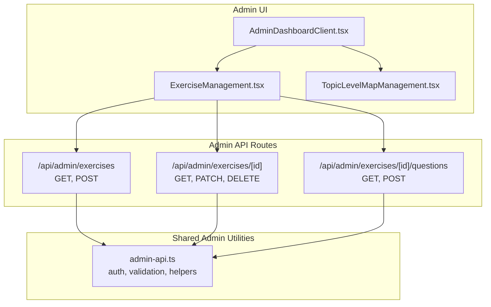
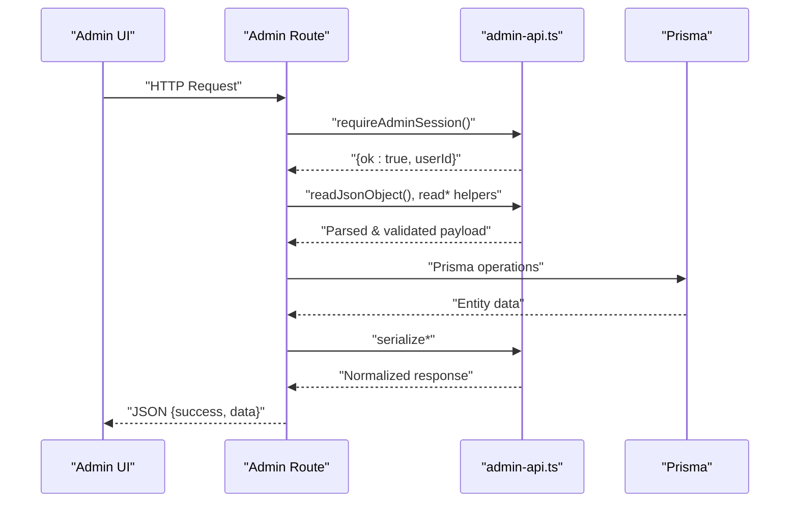
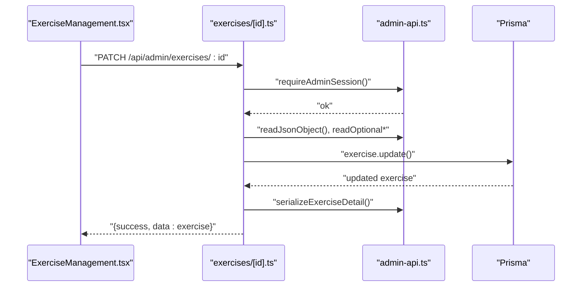
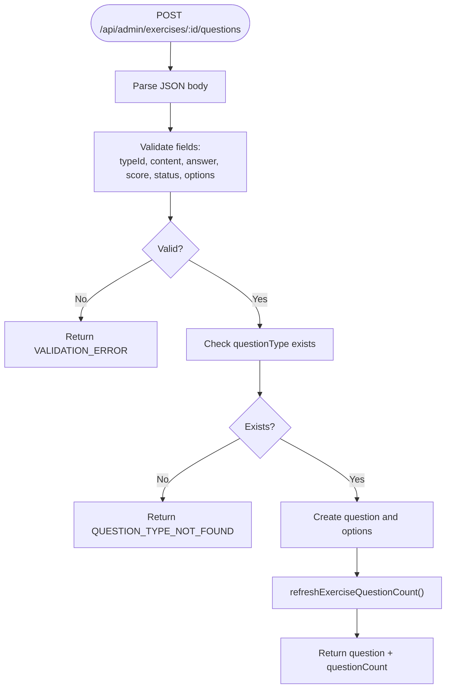
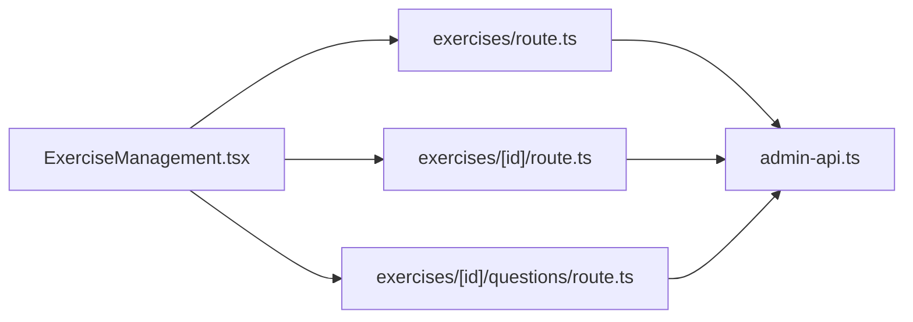

# Admin and Management APIs

<cite>
**Referenced Files in This Document**
- [admin-api.ts](file://english_pronunciation_app/frontend/src/lib/admin-api.ts)
- [route.ts](file://english_pronunciation_app/frontend/src/app/api/admin/exercises/route.ts)
- [route.ts](file://english_pronunciation_app/frontend/src/app/api/admin/exercises/[id]/route.ts)
- [route.ts](file://english_pronunciation_app/frontend/src/app/api/admin/exercises/[id]/questions/route.ts)
- [AdminDashboardClient.tsx](file://english_pronunciation_app/frontend/src/components/admin/AdminDashboardClient.tsx)
- [ExerciseManagement.tsx](file://english_pronunciation_app/frontend/src/components/admin/ExerciseManagement.tsx)
- [TopicLevelMapManagement.tsx](file://english_pronunciation_app/frontend/src/components/admin/TopicLevelMapManagement.tsx)
</cite>

## Table of Contents
1. [Introduction](#introduction)
2. [Project Structure](#project-structure)
3. [Core Components](#core-components)
4. [Architecture Overview](#architecture-overview)
5. [Detailed Component Analysis](#detailed-component-analysis)
6. [Dependency Analysis](#dependency-analysis)
7. [Performance Considerations](#performance-considerations)
8. [Troubleshooting Guide](#troubleshooting-guide)
9. [Conclusion](#conclusion)

## Introduction
This document provides comprehensive API documentation for administrative management endpoints. It covers:
- Exercise management APIs for CRUD operations on pronunciation exercises
- Question management APIs for editing exercise content
- Level and topic management APIs for curriculum organization
- Learning map management APIs for difficulty progression control
- Admin workflows, content validation, role-based access control, and bulk operation patterns
- Examples of exercise creation, question editing, level/topic configuration, and topic structuring

The APIs are implemented as Next.js App Router handlers under the admin namespace and validated and authorized via shared admin utilities.

## Project Structure
The admin-facing backend endpoints are located under the frontend’s Next.js API routes. The admin UI components orchestrate requests to these endpoints.

**Diagram sources**
- [AdminDashboardClient.tsx:70-196](file://english_pronunciation_app/frontend/src/components/admin/AdminDashboardClient.tsx#L70-L196)
- [ExerciseManagement.tsx:322-509](file://english_pronunciation_app/frontend/src/components/admin/ExerciseManagement.tsx#L322-L509)
- [TopicLevelMapManagement.tsx:139-260](file://english_pronunciation_app/frontend/src/components/admin/TopicLevelMapManagement.tsx#L139-L260)
- [admin-api.ts:26-48](file://english_pronunciation_app/frontend/src/lib/admin-api.ts#L26-L48)

**Section sources**
- [AdminDashboardClient.tsx:70-196](file://english_pronunciation_app/frontend/src/components/admin/AdminDashboardClient.tsx#L70-L196)
- [ExerciseManagement.tsx:322-509](file://english_pronunciation_app/frontend/src/components/admin/ExerciseManagement.tsx#L322-L509)
- [TopicLevelMapManagement.tsx:139-260](file://english_pronunciation_app/frontend/src/components/admin/TopicLevelMapManagement.tsx#L139-L260)
- [admin-api.ts:26-48](file://english_pronunciation_app/frontend/src/lib/admin-api.ts#L26-L48)

## Core Components
- Role-based access control: Admin session enforcement ensures only Admin users can call admin endpoints.
- Validation helpers: Centralized parsing and validation for request bodies and status fields.
- Exercise question count maintenance: Automatic recalculation after question creation.

Key responsibilities:
- Enforce admin-only access
- Validate inputs and references
- Serialize responses consistently
- Maintain referential integrity and derived counts

**Section sources**
- [admin-api.ts:5-137](file://english_pronunciation_app/frontend/src/lib/admin-api.ts#L5-L137)

## Architecture Overview
The admin API follows a layered pattern:
- UI components send HTTP requests to admin routes
- Routes validate session and request payloads
- Routes resolve references (topics, levels, maps)
- Routes perform database operations via Prisma
- Responses are serialized and returned

**Diagram sources**
- [admin-api.ts:26-48](file://english_pronunciation_app/frontend/src/lib/admin-api.ts#L26-L48)
- [route.ts:64-123](file://english_pronunciation_app/frontend/src/app/api/admin/exercises/route.ts#L64-L123)
- [route.ts:104-173](file://english_pronunciation_app/frontend/src/app/api/admin/exercises/[id]/route.ts#L104-L173)
- [route.ts:129-208](file://english_pronunciation_app/frontend/src/app/api/admin/exercises/[id]/questions/route.ts#L129-L208)

## Detailed Component Analysis

### Exercise Management APIs
Endpoints for CRUD operations on pronunciation exercises.

- List exercises
  - Method: GET
  - Path: /api/admin/exercises
  - Purpose: Retrieve all exercises with related metadata
  - Response: Array of exercises with topic, level, map, counts

- Create exercise
  - Method: POST
  - Path: /api/admin/exercises
  - Required fields: name, topicId, levelId, mapId, status (optional)
  - Optional fields: description, timeLimit
  - Validation: name length, status enum, references existence
  - Response: Created exercise with counts

- Get exercise detail
  - Method: GET
  - Path: /api/admin/exercises/[id]
  - Response: Exercise with nested questions and counts

- Update exercise
  - Method: PATCH
  - Path: /api/admin/exercises/[id]
  - Writable fields: name, description, topicId, levelId, mapId, status, timeLimit
  - Validation: optional fields, reference checks
  - Response: Updated exercise with counts

- Archive exercise
  - Method: DELETE
  - Path: /api/admin/exercises/[id]
  - Behavior: Sets status to ARCHIVED
  - Response: Archived exercise with counts

Example workflows:
- Create a new exercise with DRAFT status, then add questions, then activate
- Bulk update statuses for a batch of exercises
- Archive exercises that are outdated

**Diagram sources**
- [route.ts:104-173](file://english_pronunciation_app/frontend/src/app/api/admin/exercises/[id]/route.ts#L104-L173)
- [admin-api.ts:26-48](file://english_pronunciation_app/frontend/src/lib/admin-api.ts#L26-L48)

**Section sources**
- [route.ts:42-62](file://english_pronunciation_app/frontend/src/app/api/admin/exercises/route.ts#L42-L62)
- [route.ts:64-123](file://english_pronunciation_app/frontend/src/app/api/admin/exercises/route.ts#L64-L123)
- [route.ts:86-102](file://english_pronunciation_app/frontend/src/app/api/admin/exercises/[id]/route.ts#L86-L102)
- [route.ts:104-173](file://english_pronunciation_app/frontend/src/app/api/admin/exercises/[id]/route.ts#L104-L173)
- [route.ts:175-211](file://english_pronunciation_app/frontend/src/app/api/admin/exercises/[id]/route.ts#L175-L211)

### Question Management APIs
Endpoints for managing questions within an exercise.

- List questions for an exercise
  - Method: GET
  - Path: /api/admin/exercises/[id]/questions
  - Response: Array of questions with type and options

- Create question
  - Method: POST
  - Path: /api/admin/exercises/[id]/questions
  - Required fields: typeId, content, answer, status
  - Optional fields: name, score, options
  - Validation: content length, options uniqueness and count, answer presence in options
  - Side effect: updates exercise questionCount via refreshExerciseQuestionCount
  - Response: Created question and updated count

- Update question
  - Method: PATCH
  - Path: /api/admin/questions/[id]
  - Writable fields: name, content, answer, score, status, options
  - Validation: similar to create
  - Response: Updated question and updated count

- Archive question
  - Method: DELETE
  - Path: /api/admin/questions/[id]
  - Behavior: Sets status to ARCHIVED
  - Response: Archived question and updated count

Validation highlights:
- Content accepts either a plain string or a JSON object serialized to string
- Options must be unique, non-empty, and within count limits
- Score defaults to 10 if omitted

**Diagram sources**
- [route.ts:129-208](file://english_pronunciation_app/frontend/src/app/api/admin/exercises/[id]/questions/route.ts#L129-L208)
- [admin-api.ts:120-136](file://english_pronunciation_app/frontend/src/lib/admin-api.ts#L120-L136)

**Section sources**
- [route.ts:98-127](file://english_pronunciation_app/frontend/src/app/api/admin/exercises/[id]/questions/route.ts#L98-L127)
- [route.ts:129-208](file://english_pronunciation_app/frontend/src/app/api/admin/exercises/[id]/questions/route.ts#L129-L208)

### Level and Topic Management APIs
Endpoints for managing foundational curriculum entities.

- Topics
  - Create: POST /api/admin/topics
  - Update: PATCH /api/admin/topics/[id]
  - Delete: DELETE /api/admin/topics/[id] (removes item)
  - Fields: name, description

- Levels
  - Create: POST /api/admin/levels
  - Update: PATCH /api/admin/levels/[id]
  - Delete: DELETE /api/admin/levels/[id] (removes item)
  - Fields: name, description

- Learning Maps
  - Create: POST /api/admin/maps
  - Update: PATCH /api/admin/maps/[id]
  - Delete: DELETE /api/admin/maps/[id] (archives map)
  - Fields: name, requirement, status (ACTIVE, LOCKED, DRAFT, ARCHIVED)

These endpoints are orchestrated by the TopicLevelMapManagement UI component.

**Section sources**
- [TopicLevelMapManagement.tsx:139-260](file://english_pronunciation_app/frontend/src/components/admin/TopicLevelMapManagement.tsx#L139-L260)

### Admin Workflows and UI Integration
- AdminDashboardClient orchestrates tabs for overview, users, exercises, topics, audio, badges, and reports.
- ExerciseManagement coordinates exercise CRUD and question CRUD for a selected exercise.
- TopicLevelMapManagement manages topics, levels, and maps.

Common admin tasks:
- Bulk operations: Update statuses in bulk by iterating over lists and issuing PATCH requests
- Content approval: Move questions from NEEDS_REVIEW to ACTIVE after validation
- Curriculum structuring: Create topics → levels → maps → exercises → questions

**Section sources**
- [AdminDashboardClient.tsx:70-196](file://english_pronunciation_app/frontend/src/components/admin/AdminDashboardClient.tsx#L70-L196)
- [ExerciseManagement.tsx:322-509](file://english_pronunciation_app/frontend/src/components/admin/ExerciseManagement.tsx#L322-L509)
- [TopicLevelMapManagement.tsx:139-260](file://english_pronunciation_app/frontend/src/components/admin/TopicLevelMapManagement.tsx#L139-L260)

## Dependency Analysis
- UI components depend on Next.js fetch to admin routes
- Admin routes depend on admin-api utilities for:
  - Session validation (requireAdminSession)
  - JSON parsing and field extraction (readJsonObject, readRequiredString, readOptionalString, readNullableString, readOptionalInt, readNullableInt, readStatus, readOptionalStatus)
  - Serialization helpers (serializeExercise, serializeExerciseDetail, serializeQuestion)
  - Derived count maintenance (refreshExerciseQuestionCount)

**Diagram sources**
- [ExerciseManagement.tsx:322-509](file://english_pronunciation_app/frontend/src/components/admin/ExerciseManagement.tsx#L322-L509)
- [route.ts:64-123](file://english_pronunciation_app/frontend/src/app/api/admin/exercises/route.ts#L64-L123)
- [route.ts:104-173](file://english_pronunciation_app/frontend/src/app/api/admin/exercises/[id]/route.ts#L104-L173)
- [route.ts:129-208](file://english_pronunciation_app/frontend/src/app/api/admin/exercises/[id]/questions/route.ts#L129-L208)
- [admin-api.ts:26-48](file://english_pronunciation_app/frontend/src/lib/admin-api.ts#L26-L48)

**Section sources**
- [admin-api.ts:26-48](file://english_pronunciation_app/frontend/src/lib/admin-api.ts#L26-L48)

## Performance Considerations
- Prefer filtering and ordering on the server side to limit payload sizes
- Batch updates for large-scale content management by iterating lists and sending PATCH requests
- Use transactional creation for question creation to maintain consistency and derive counts atomically
- Cache frequently accessed reference lists (topics, levels, maps) in the UI to reduce redundant network calls

## Troubleshooting Guide
Common errors and resolutions:
- UNAUTHENTICATED: Ensure the admin user is logged in and has Admin role
- FORBIDDEN: Verify the session user role is Admin
- VALIDATION_ERROR: Check payload shape and constraints (lengths, enums, presence)
- REFERENCE_NOT_FOUND: Confirm referenced entities (topic, level, map, questionType) exist
- INTERNAL_ERROR: Inspect server logs for database or serialization issues

Operational tips:
- Use the admin UI’s feedback messages to diagnose failures
- For question creation, ensure options include the correct answer when options are provided
- After bulk operations, verify derived counts (questionCount) are accurate

**Section sources**
- [admin-api.ts:15-24](file://english_pronunciation_app/frontend/src/lib/admin-api.ts#L15-L24)
- [route.ts:74-84](file://english_pronunciation_app/frontend/src/app/api/admin/exercises/route.ts#L74-L84)
- [route.ts:128-138](file://english_pronunciation_app/frontend/src/app/api/admin/exercises/[id]/route.ts#L128-L138)
- [route.ts:154-169](file://english_pronunciation_app/frontend/src/app/api/admin/exercises/[id]/questions/route.ts#L154-L169)

## Conclusion
The admin APIs provide a robust foundation for managing pronunciation exercises, questions, and curriculum structures. They enforce role-based access, apply strict validation, and maintain referential integrity. The UI components streamline common workflows, enabling efficient content curation, approval, and large-scale updates.