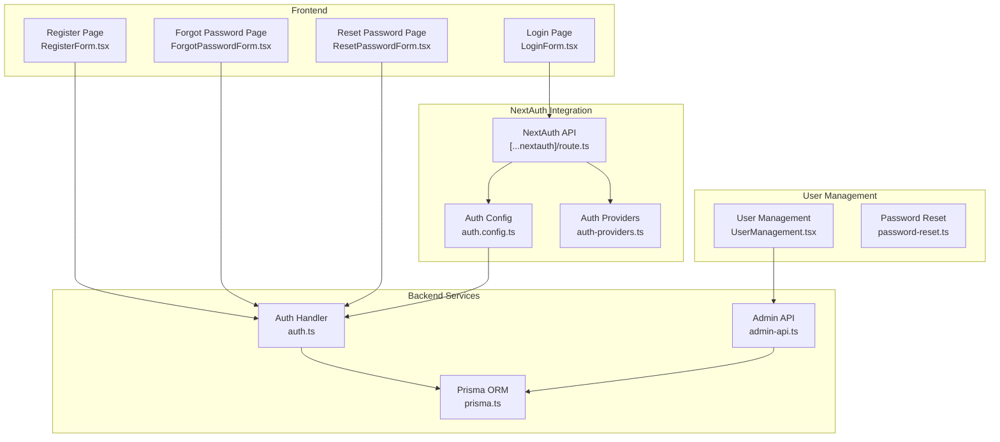
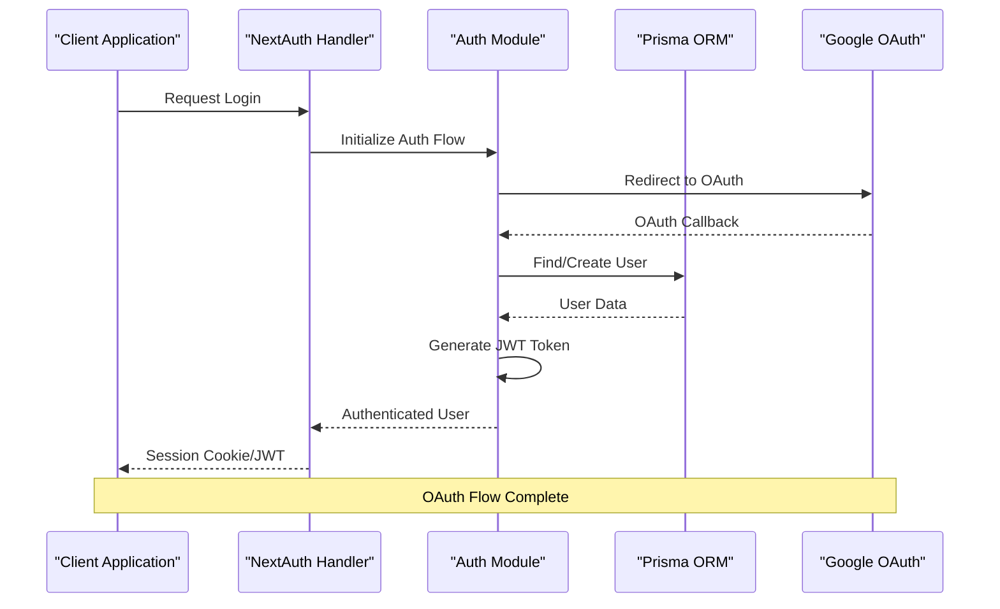
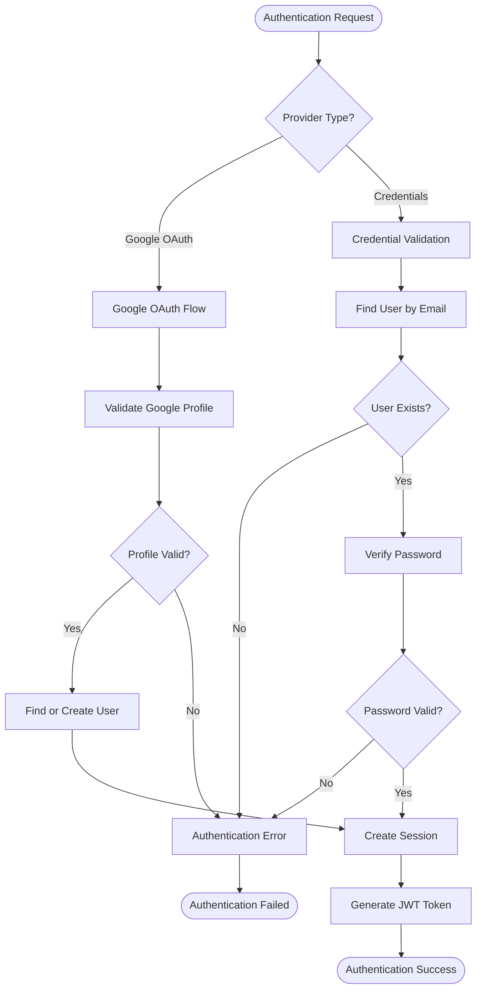
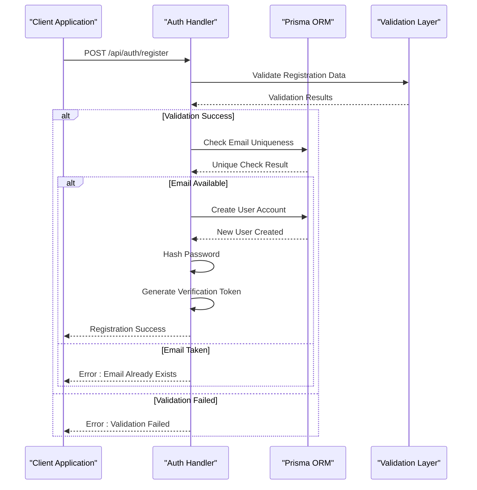
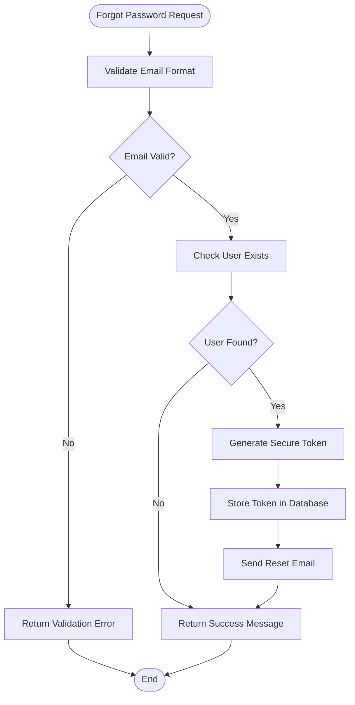
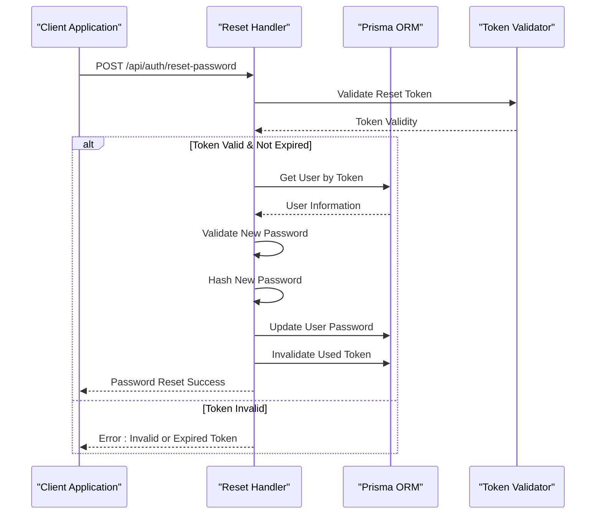
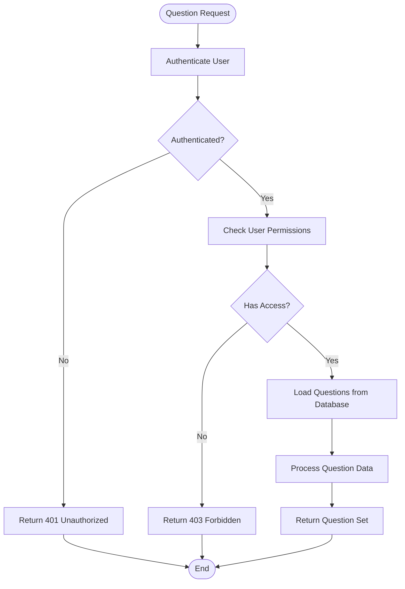
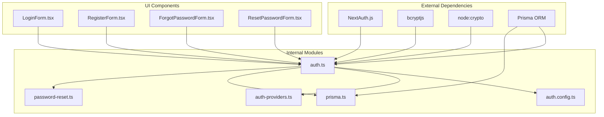

# Authentication and User APIs

<cite>
**Referenced Files in This Document**
- [auth.ts](file://english_pronunciation_app/frontend/src/lib/auth.ts)
- [auth.config.ts](file://english_pronunciation_app/frontend/src/lib/auth.config.ts)
- [[...nextauth] route.ts](file://english_pronunciation_app/frontend/src/app/api/auth/[...nextauth]/route.ts)
- [auth-providers.ts](file://english_pronunciation_app/frontend/src/lib/auth-providers.ts)
- [register route.ts](file://english_pronunciation_app/frontend/src/app/api/auth/register/route.ts)
- [forgot-password route.ts](file://english_pronunciation_app/frontend/src/app/api/auth/forgot-password/route.ts)
- [reset-password route.ts](file://english_pronunciation_app/frontend/src/app/api/auth/reset-password/route.ts)
- [prisma.ts](file://english_pronunciation_app/frontend/src/lib/prisma.ts)
- [password-reset.ts](file://english_pronunciation_app/frontend/src/lib/password-reset.ts)
- [LoginForm.tsx](file://english_pronunciation_app/frontend/src/app/login/LoginForm.tsx)
- [RegisterForm.tsx](file://english_pronunciation_app/frontend/src/app/register/RegisterForm.tsx)
- [ForgotPasswordForm.tsx](file://english_pronunciation_app/frontend/src/app/forgot-password/ForgotPasswordForm.tsx)
- [ResetPasswordForm.tsx](file://english_pronunciation_app/frontend/src/app/reset-password/ResetPasswordForm.tsx)
- [UserManagement.tsx](file://english_pronunciation_app/frontend/src/components/admin/UserManagement.tsx)
- [admin-api.ts](file://english_pronunciation_app/frontend/src/lib/admin-api.ts)
</cite>

## Table of Contents
1. [Introduction](#introduction)
2. [Project Structure](#project-structure)
3. [Core Components](#core-components)
4. [Architecture Overview](#architecture-overview)
5. [Detailed Component Analysis](#detailed-component-analysis)
6. [Dependency Analysis](#dependency-analysis)
7. [Performance Considerations](#performance-considerations)
8. [Troubleshooting Guide](#troubleshooting-guide)
9. [Conclusion](#conclusion)

## Introduction
This document provides comprehensive API documentation for authentication and user management endpoints in the English Pronunciation App. It covers NextAuth integration for OAuth flows, registration, password recovery, and question retrieval APIs. The documentation includes authentication flows, session/token management, security considerations, validation rules, error handling, and integration patterns for user profile management and account verification.

## Project Structure
The authentication system is implemented using NextAuth.js with JWT strategy and integrates with Prisma ORM for user persistence. The API routes are organized under the Next.js App Router structure, with dedicated endpoints for OAuth, registration, password recovery, and question retrieval.

**Diagram sources**
- [auth.ts:1-151](file://english_pronunciation_app/frontend/src/lib/auth.ts#L1-L151)
- [auth.config.ts:1-25](file://english_pronunciation_app/frontend/src/lib/auth.config.ts#L1-L25)
- [[...nextauth] route.ts:1-4](file://english_pronunciation_app/frontend/src/app/api/auth/[...nextauth]/route.ts#L1-L4)

**Section sources**
- [auth.ts:1-151](file://english_pronunciation_app/frontend/src/lib/auth.ts#L1-L151)
- [auth.config.ts:1-25](file://english_pronunciation_app/frontend/src/lib/auth.config.ts#L1-L25)
- [[...nextauth] route.ts:1-4](file://english_pronunciation_app/frontend/src/app/api/auth/[...nextauth]/route.ts#L1-L4)

## Core Components
The authentication system consists of several key components working together to provide secure user management and session handling.

### NextAuth Integration
The core authentication logic is implemented in the auth module, which extends NextAuth with custom providers and callbacks. It supports both Google OAuth and traditional credential-based authentication.

### Session Management
The system uses JWT strategy for session management, storing user information in encrypted tokens. The auth configuration defines how sessions are maintained and how user roles are propagated.

### User Persistence
Prisma ORM handles all database operations for user management, including user creation, updates, and retrieval. The system enforces unique constraints on usernames and emails.

**Section sources**
- [auth.ts:76-151](file://english_pronunciation_app/frontend/src/lib/auth.ts#L76-L151)
- [auth.config.ts:3-24](file://english_pronunciation_app/frontend/src/lib/auth.config.ts#L3-L24)
- [prisma.ts](file://english_pronunciation_app/frontend/src/lib/prisma.ts)

## Architecture Overview
The authentication architecture follows a layered approach with clear separation of concerns between presentation, authentication, and data access layers.

**Diagram sources**
- [auth.ts:76-151](file://english_pronunciation_app/frontend/src/lib/auth.ts#L76-L151)
- [auth.config.ts:3-24](file://english_pronunciation_app/frontend/src/lib/auth.config.ts#L3-L24)

## Detailed Component Analysis

### NextAuth Integration API
The NextAuth integration provides OAuth and credential-based authentication through a unified interface.

#### Authentication Flow

**Diagram sources**
- [auth.ts:93-115](file://english_pronunciation_app/frontend/src/lib/auth.ts#L93-L115)
- [auth.ts:119-148](file://english_pronunciation_app/frontend/src/lib/auth.ts#L119-L148)

#### API Endpoints
The NextAuth API exposes standardized endpoints for authentication operations:

**Endpoint:** `POST /api/auth/callback/:provider`
**Method:** POST
**Description:** Handles OAuth callback requests and completes authentication flow
**Authentication:** Not Required
**Response:** Redirect response to login page with success/error status

**Endpoint:** `GET /api/auth/session`
**Method:** GET
**Description:** Returns current user session information
**Authentication:** Required (JWT/Bearer)
**Response:** Session object containing user details and permissions

**Endpoint:** `POST /api/auth/signout`
**Method:** POST
**Description:** Logs out current user and invalidates session
**Authentication:** Required (JWT/Bearer)
**Response:** Success confirmation

**Section sources**
- [[...nextauth] route.ts:1-4](file://english_pronunciation_app/frontend/src/app/api/auth/[...nextauth]/route.ts#L1-L4)
- [auth.ts:76-151](file://english_pronunciation_app/frontend/src/lib/auth.ts#L76-L151)

### Registration API
The registration endpoint creates new user accounts with comprehensive validation and security measures.

#### Registration Process

**Diagram sources**
- [auth.ts:21-74](file://english_pronunciation_app/frontend/src/lib/auth.ts#L21-L74)

#### Request Schema
**Endpoint:** `POST /api/auth/register`
**Method:** POST
**Content-Type:** application/json

**Request Body:**
- `username` (string, required): Unique username, 3-24 characters, alphanumeric and underscore only
- `email` (string, required): Valid email address
- `password` (string, required): Strong password meeting security requirements
- `confirmPassword` (string, required): Must match password

**Validation Rules:**
- Username: 3-24 characters, alphanumeric, underscore, hyphen only
- Email: Valid email format, unique across system
- Password: Minimum 8 characters, must contain uppercase, lowercase, number, and special character
- Password Confirmation: Must exactly match password field

**Response Codes:**
- `201 Created`: Registration successful
- `400 Bad Request`: Validation errors or duplicate email
- `409 Conflict`: Email already exists
- `500 Internal Server Error`: Server-side failure

**Section sources**
- [auth.ts:16-34](file://english_pronunciation_app/frontend/src/lib/auth.ts#L16-L34)
- [auth.ts:93-115](file://english_pronunciation_app/frontend/src/lib/auth.ts#L93-L115)

### Forgot Password API
The forgot password system generates secure reset tokens and sends them via email for password recovery.

#### Password Recovery Flow

**Diagram sources**
- [auth.ts:93-115](file://english_pronunciation_app/frontend/src/lib/auth.ts#L93-L115)

#### API Endpoint
**Endpoint:** `POST /api/auth/forgot-password`
**Method:** POST
**Content-Type:** application/json

**Request Body:**
- `email` (string, required): Registered user's email address

**Response:**
- `200 OK`: Success message indicating email sent
- `400 Bad Request`: Invalid email format
- `404 Not Found`: User not found
- `500 Internal Server Error`: Email service failure

**Security Features:**
- Rate limiting on requests per IP/email
- Secure token generation using cryptographically strong random bytes
- Token expiration (typically 1 hour)
- Single-use tokens with immediate invalidation after use

**Section sources**
- [forgot-password route.ts](file://english_pronunciation_app/frontend/src/app/api/auth/forgot-password/route.ts)

### Reset Password API
The reset password endpoint securely updates user passwords using time-limited tokens.

#### Password Reset Process

**Diagram sources**
- [reset-password route.ts](file://english_pronunciation_app/frontend/src/app/api/auth/reset-password/route.ts)

#### API Endpoint
**Endpoint:** `POST /api/auth/reset-password`
**Method:** POST
**Content-Type:** application/json

**Request Body:**
- `token` (string, required): Secure reset token from email
- `password` (string, required): New strong password
- `confirmPassword` (string, required): Must match new password

**Validation Rules:**
- Token: Non-empty, valid format, not expired
- Password: Meets same requirements as registration
- Confirmation: Must exactly match new password

**Response Codes:**
- `200 OK`: Password successfully reset
- `400 Bad Request`: Validation errors
- `401 Unauthorized`: Invalid or expired token
- `404 Not Found`: Token not found
- `500 Internal Server Error`: Database operation failure

**Section sources**
- [reset-password route.ts](file://english_pronunciation_app/frontend/src/app/api/auth/reset-password/route.ts)
- [password-reset.ts](file://english_pronunciation_app/frontend/src/lib/password-reset.ts)

### Question Retrieval API
The question retrieval system provides exercise content for pronunciation practice with proper authentication and authorization.

#### Content Access Flow

**Diagram sources**
- [auth.ts:117-148](file://english_pronunciation_app/frontend/src/lib/auth.ts#L117-L148)

#### API Endpoints
**Endpoint:** `GET /api/questions/{questionId}`
**Method:** GET
**Description:** Retrieve specific question details
**Authentication:** Required (JWT/Bearer)
**Authorization:** User role-based access control

**Endpoint:** `GET /api/exercises/{exerciseId}/questions`
**Method:** GET
**Description:** Retrieve all questions for an exercise
**Authentication:** Required (JWT/Bearer)
**Authorization:** User role-based access control

**Request Headers:**
- `Authorization: Bearer {jwt_token}` (required for protected endpoints)
- `Content-Type: application/json` (standard)

**Response Formats:**
- `200 OK`: Question data in structured JSON format
- `401 Unauthorized`: Invalid or missing authentication token
- `403 Forbidden`: Insufficient permissions for requested resource
- `404 Not Found`: Question or exercise not found
- `500 Internal Server Error`: Database or server error

**Section sources**
- [auth.ts:117-148](file://english_pronunciation_app/frontend/src/lib/auth.ts#L117-L148)

## Dependency Analysis
The authentication system has well-defined dependencies between components, ensuring maintainable and testable code.

**Diagram sources**
- [auth.ts:1-151](file://english_pronunciation_app/frontend/src/lib/auth.ts#L1-L151)
- [auth.config.ts:1-25](file://english_pronunciation_app/frontend/src/lib/auth.config.ts#L1-L25)

**Section sources**
- [auth.ts:1-151](file://english_pronunciation_app/frontend/src/lib/auth.ts#L1-L151)
- [auth.config.ts:1-25](file://english_pronunciation_app/frontend/src/lib/auth.config.ts#L1-L25)

## Performance Considerations
The authentication system implements several performance optimizations and security measures:

### Caching Strategies
- JWT token caching for reduced database queries
- Session data caching for frequently accessed user information
- OAuth provider configuration caching

### Database Optimization
- Indexes on email and username fields for fast lookups
- Connection pooling for database operations
- Efficient query patterns to minimize round trips

### Security Measures
- Password hashing with bcrypt for secure storage
- Cryptographically secure random token generation
- Rate limiting for brute force protection
- Input sanitization and validation

## Troubleshooting Guide

### Common Authentication Issues
**Issue:** Users cannot log in via Google OAuth
**Solution:** Verify Google OAuth configuration and ensure email verification is enabled

**Issue:** Password reset emails not being sent
**Solution:** Check email service configuration and token expiration settings

**Issue:** Session not persisting across browser restarts
**Solution:** Verify JWT token expiration and cookie settings

### Error Code Reference
- `400 Bad Request`: Invalid request format or validation failures
- `401 Unauthorized`: Missing, invalid, or expired authentication token
- `403 Forbidden`: Insufficient permissions for requested resource
- `404 Not Found`: Resource not found
- `409 Conflict`: Resource conflict (e.g., duplicate email)
- `500 Internal Server Error`: Unexpected server error

### Debugging Tips
1. Enable NextAuth debug logging during development
2. Check browser console for authentication-related errors
3. Verify database connectivity and Prisma schema
4. Test OAuth callback URLs in development environment

**Section sources**
- [auth.ts:117-148](file://english_pronunciation_app/frontend/src/lib/auth.ts#L117-L148)
- [auth.config.ts:3-24](file://english_pronunciation_app/frontend/src/lib/auth.config.ts#L3-L24)

## Conclusion
The authentication and user management system provides a robust, secure, and scalable foundation for the English Pronunciation App. The NextAuth integration offers flexible authentication options, while the custom API endpoints handle specialized user management tasks. The system emphasizes security through proper token handling, password protection, and access control mechanisms. The modular architecture ensures maintainability and extensibility for future enhancements.