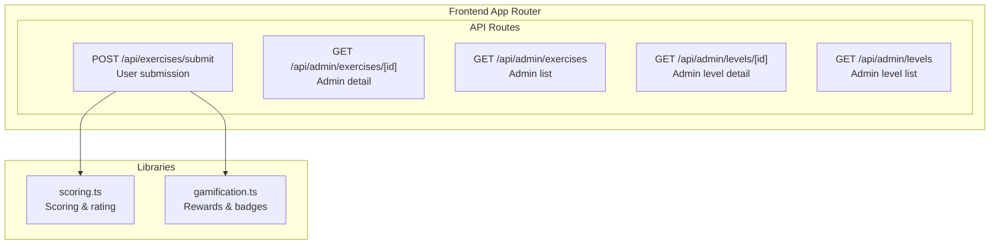
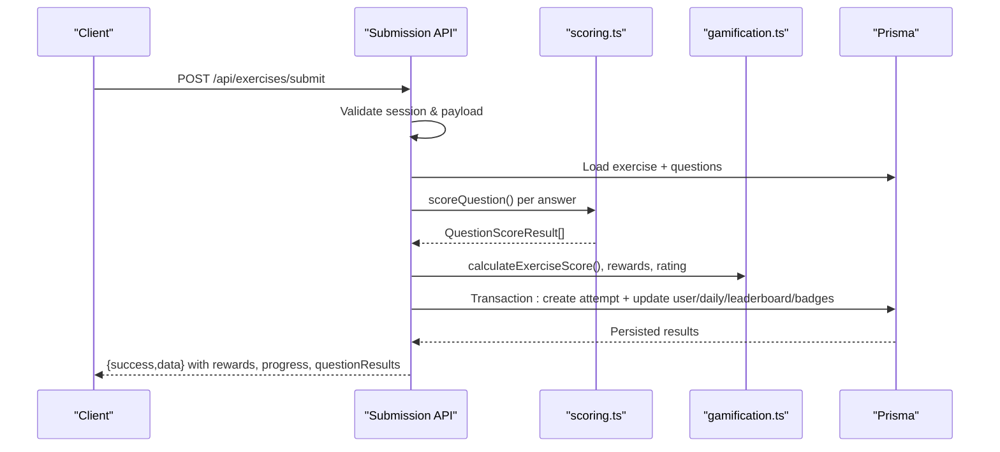
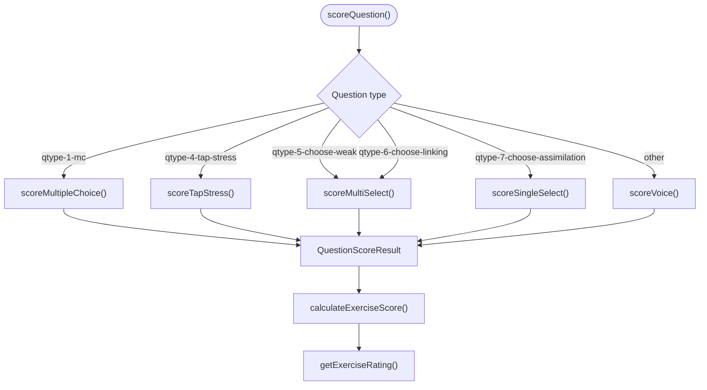
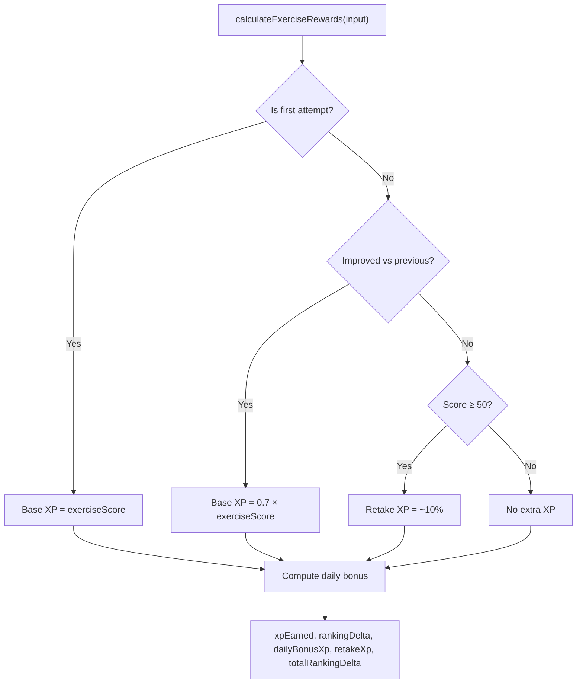
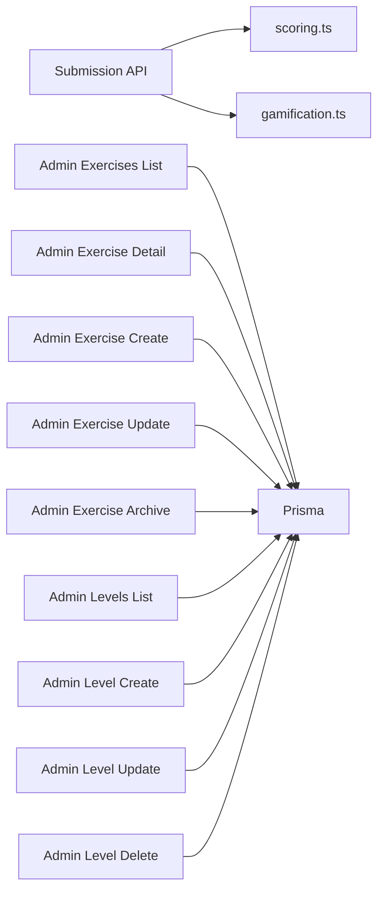

# Exercise and Content APIs

<cite>
**Referenced Files in This Document**
- [route.ts](file://english_pronunciation_app/frontend/src/app/api/exercises/submit/route.ts)
- [scoring.ts](file://english_pronunciation_app/frontend/src/lib/scoring.ts)
- [gamification.ts](file://english_pronunciation_app/frontend/src/lib/gamification.ts)
- [route.ts](file://english_pronunciation_app/frontend/src/app/api/admin/exercises/[id]/route.ts)
- [route.ts](file://english_pronunciation_app/frontend/src/app/api/admin/exercises/route.ts)
- [route.ts](file://english_pronunciation_app/frontend/src/app/api/admin/levels/[id]/route.ts)
- [route.ts](file://english_pronunciation_app/frontend/src/app/api/admin/levels/route.ts)
</cite>

## Table of Contents
1. [Introduction](#introduction)
2. [Project Structure](#project-structure)
3. [Core Components](#core-components)
4. [Architecture Overview](#architecture-overview)
5. [Detailed Component Analysis](#detailed-component-analysis)
6. [Dependency Analysis](#dependency-analysis)
7. [Performance Considerations](#performance-considerations)
8. [Troubleshooting Guide](#troubleshooting-guide)
9. [Conclusion](#conclusion)

## Introduction
This document provides comprehensive API documentation for exercise and content management endpoints in the English pronunciation training application. It covers:
- Exercise retrieval API for administrators
- Exercise submission API for processing user responses and scoring
- Topic-based content APIs for curriculum organization
- Learning map APIs for progress tracking
- Level APIs for difficulty progression

The documentation includes request/response schemas, parameter specifications, authentication requirements, error handling patterns, practical examples, and performance considerations.

## Project Structure
The APIs are implemented as Next.js App Router API routes under the frontend application. The exercise submission endpoint is user-facing, while exercise and level management endpoints are admin-only.

**Diagram sources**
- [route.ts:47-331](file://english_pronunciation_app/frontend/src/app/api/exercises/submit/route.ts#L47-L331)
- [scoring.ts:1-227](file://english_pronunciation_app/frontend/src/lib/scoring.ts#L1-L227)
- [gamification.ts:1-575](file://english_pronunciation_app/frontend/src/lib/gamification.ts#L1-L575)
- [route.ts:86-102](file://english_pronunciation_app/frontend/src/app/api/admin/exercises/[id]/route.ts#L86-L102)
- [route.ts:42-62](file://english_pronunciation_app/frontend/src/app/api/admin/exercises/route.ts#L42-L62)
- [route.ts:27-71](file://english_pronunciation_app/frontend/src/app/api/admin/levels/[id]/route.ts#L27-L71)
- [route.ts:23-45](file://english_pronunciation_app/frontend/src/app/api/admin/levels/route.ts#L23-L45)

**Section sources**
- [route.ts:1-332](file://english_pronunciation_app/frontend/src/app/api/exercises/submit/route.ts#L1-L332)
- [scoring.ts:1-227](file://english_pronunciation_app/frontend/src/lib/scoring.ts#L1-L227)
- [gamification.ts:1-575](file://english_pronunciation_app/frontend/src/lib/gamification.ts#L1-L575)
- [route.ts:1-212](file://english_pronunciation_app/frontend/src/app/api/admin/exercises/[id]/route.ts#L1-L212)
- [route.ts:1-124](file://english_pronunciation_app/frontend/src/app/api/admin/exercises/route.ts#L1-L124)
- [route.ts:1-106](file://english_pronunciation_app/frontend/src/app/api/admin/levels/[id]/route.ts#L1-L106)
- [route.ts:1-85](file://english_pronunciation_app/frontend/src/app/api/admin/levels/route.ts#L1-L85)

## Core Components
- Exercise Submission API: Validates payload, scores answers, computes rewards, updates user progress, and persists attempt records.
- Scoring Library: Implements question-type-specific scoring and exercise-level aggregation.
- Gamification Library: Computes XP rewards, ranking deltas, and badge checks.
- Admin Exercise API: CRUD operations for exercises with validation and reference checks.
- Admin Level API: CRUD operations for levels with validation and usage checks.

**Section sources**
- [route.ts:47-331](file://english_pronunciation_app/frontend/src/app/api/exercises/submit/route.ts#L47-L331)
- [scoring.ts:191-227](file://english_pronunciation_app/frontend/src/lib/scoring.ts#L191-L227)
- [gamification.ts:195-234](file://english_pronunciation_app/frontend/src/lib/gamification.ts#L195-L234)
- [route.ts:104-173](file://english_pronunciation_app/frontend/src/app/api/admin/exercises/[id]/route.ts#L104-L173)
- [route.ts:27-105](file://english_pronunciation_app/frontend/src/app/api/admin/levels/[id]/route.ts#L27-L105)

## Architecture Overview
The exercise submission pipeline integrates client-side audio/text answers with server-side scoring and gamification logic. It ensures transactional consistency for user XP, daily activity, leaderboard entries, and badge awards.

**Diagram sources**
- [route.ts:47-331](file://english_pronunciation_app/frontend/src/app/api/exercises/submit/route.ts#L47-L331)
- [scoring.ts:191-227](file://english_pronunciation_app/frontend/src/lib/scoring.ts#L191-L227)
- [gamification.ts:195-234](file://english_pronunciation_app/frontend/src/lib/gamification.ts#L195-L234)

## Detailed Component Analysis

### Exercise Submission API
- Endpoint: POST /api/exercises/submit
- Authentication: Required (session-based)
- Purpose: Accepts user answers, validates against exercise questions, scores, computes rewards, and persists attempt.

Request schema
- Body fields
  - exerciseId: string (required)
  - startedAt: string (ISO 8601, optional)
  - completedAt: string (ISO 8601, optional)
  - answers: array of SubmitAnswerInput (required, non-empty)
    - questionId: string (required)
    - selectedOptionId: string|null (optional)
    - selectedText: string|null (optional)
    - transcript: string|null (optional)
    - audioUrl: string|null (optional)
    - timeSpent: number|null (optional)

Validation rules
- exerciseId must be a non-empty string and correspond to an ACTIVE exercise.
- answers must be a non-empty array; each answer must include a valid questionId present in the exercise.
- Duplicate question submissions are rejected.
- User must be authenticated.

Processing steps
- Load exercise with ACTIVE questions and types/options.
- For each answer, map to the corresponding question and score using scoring.ts.
- Aggregate scores to compute exerciseScore, rating, and completion status.
- Compute rewards via gamification.ts (XP, ranking deltas, daily bonuses).
- Persist attempt with questionAttempts; update user XP/level, daily activity, leaderboard entries, and check for badges.

Response schema
- Fields
  - exerciseAttemptId: string
  - exerciseScore: number (0–100)
  - maxScore: number (constant 100)
  - isCompleted: boolean
  - rating: "NEEDS_PRACTICE"|"PASS"|"GOOD"|"EXCELLENT"
  - summary: object
    - totalQuestions: number
    - answeredQuestions: number
    - correctAnswers: number
    - rawScore: number
    - maxRawScore: number
    - timeSpent: number
  - rewards: object
    - xpEarned: number
    - dailyBonusXp: number
    - retakeXp: number
    - totalXpEarned: number
    - rankingDelta: number
    - dailyBonusRanking: number
    - retakeRanking: number
    - totalRankingDelta: number
  - progress: object
    - currentXp: number
    - level: number
    - nextLevelXp: number
  - dailyActivity: object
    - date: string (local date)
    - completedExercises: number
    - xpEarned: number
  - badgesAwarded: array of awarded badge objects
  - previousBestScore: number|null
  - streak: object
    - count: number
    - longest: number
  - questionResults: array of
    - questionId: string
    - isCorrect: boolean
    - score: number
    - accuracyScore: number|null
    - feedback: string

Error responses
- 400 Validation errors (invalid payload, empty answers, invalid answers)
- 401 Unauthenticated
- 404 Exercise not found or user not found
- 500 Internal server error

Example usage
- Client collects answers for visible questions in the exercise.
- Client posts JSON with exerciseId and answers[]. Each answer includes questionId and appropriate fields depending on question type (selectedOptionId, selectedText, transcript/audioUrl, timeSpent).
- Server responds with scoring summary, rewards, progress, and per-question results.

**Section sources**
- [route.ts:20-39](file://english_pronunciation_app/frontend/src/app/api/exercises/submit/route.ts#L20-L39)
- [route.ts:47-331](file://english_pronunciation_app/frontend/src/app/api/exercises/submit/route.ts#L47-L331)
- [scoring.ts:1-36](file://english_pronunciation_app/frontend/src/lib/scoring.ts#L1-L36)
- [scoring.ts:191-227](file://english_pronunciation_app/frontend/src/lib/scoring.ts#L191-L227)
- [gamification.ts:6-22](file://english_pronunciation_app/frontend/src/lib/gamification.ts#L6-L22)
- [gamification.ts:195-234](file://english_pronunciation_app/frontend/src/lib/gamification.ts#L195-L234)

### Scoring Logic
ScoringQuestion and SubmitAnswerInput define the scoring model. Supported question types:
- Multiple choice (qtype-1-mc)
- Tap stress (qtype-4-tap-stress)
- Multi-select choose-weak/choose-linking (qtype-5/qtype-6)
- Single-select choose-assimilation (qtype-7-choose-assimilation)
- Voice/speak/minimal pairs (default)

Key behaviors
- Normalize answers for textual comparisons; exact match fallback for IPA-like inputs.
- Voice scoring supports multiple accepted answers (Mode B) and computes accuracy percentage.
- Multi-select requires exact set match after normalization.
- Exercise score computed as percentage of raw score over max score.

**Diagram sources**
- [scoring.ts:191-227](file://english_pronunciation_app/frontend/src/lib/scoring.ts#L191-L227)
- [scoring.ts:74-131](file://english_pronunciation_app/frontend/src/lib/scoring.ts#L74-L131)
- [scoring.ts:157-189](file://english_pronunciation_app/frontend/src/lib/scoring.ts#L157-L189)

**Section sources**
- [scoring.ts:10-36](file://english_pronunciation_app/frontend/src/lib/scoring.ts#L10-L36)
- [scoring.ts:74-131](file://english_pronunciation_app/frontend/src/lib/scoring.ts#L74-L131)
- [scoring.ts:157-189](file://english_pronunciation_app/frontend/src/lib/scoring.ts#L157-L189)
- [scoring.ts:203-227](file://english_pronunciation_app/frontend/src/lib/scoring.ts#L203-L227)

### Gamification and Rewards
Reward computation considers:
- First attempt bonus
- Improvement bonus
- Retake bonus for scores ≥ 50
- Daily bonus thresholds based on completed exercises per day
- Ranking deltas for leaderboards

Leaderboard targets include weekly and monthly periods derived from local date.

**Diagram sources**
- [gamification.ts:195-234](file://english_pronunciation_app/frontend/src/lib/gamification.ts#L195-L234)
- [gamification.ts:186-193](file://english_pronunciation_app/frontend/src/lib/gamification.ts#L186-L193)
- [gamification.ts:236-244](file://english_pronunciation_app/frontend/src/lib/gamification.ts#L236-L244)

**Section sources**
- [gamification.ts:6-22](file://english_pronunciation_app/frontend/src/lib/gamification.ts#L6-L22)
- [gamification.ts:186-193](file://english_pronunciation_app/frontend/src/lib/gamification.ts#L186-L193)
- [gamification.ts:195-234](file://english_pronunciation_app/frontend/src/lib/gamification.ts#L195-L234)
- [gamification.ts:236-244](file://english_pronunciation_app/frontend/src/lib/gamification.ts#L236-L244)

### Admin Exercise APIs
- GET /api/admin/exercises
  - Returns paginated list of exercises with counts and references.
- POST /api/admin/exercises
  - Creates a new exercise with validations for topicId, levelId, mapId, status, and optional timeLimit.
- GET /api/admin/exercises/[id]
  - Returns detailed exercise with topic, level, map, questions, and attempt count.
- PATCH /api/admin/exercises/[id]
  - Updates exercise fields with reference checks.
- DELETE /api/admin/exercises/[id]
  - Archives exercise by setting status to ARCHIVED.

Request/response highlights
- Validation enforces required lengths/types and reference existence.
- Serialization excludes internal fields and includes counts.

**Section sources**
- [route.ts:42-62](file://english_pronunciation_app/frontend/src/app/api/admin/exercises/route.ts#L42-L62)
- [route.ts:64-123](file://english_pronunciation_app/frontend/src/app/api/admin/exercises/route.ts#L64-L123)
- [route.ts:86-102](file://english_pronunciation_app/frontend/src/app/api/admin/exercises/[id]/route.ts#L86-L102)
- [route.ts:104-173](file://english_pronunciation_app/frontend/src/app/api/admin/exercises/[id]/route.ts#L104-L173)
- [route.ts:175-211](file://english_pronunciation_app/frontend/src/app/api/admin/exercises/[id]/route.ts#L175-L211)

### Admin Level APIs
- GET /api/admin/levels
  - Lists levels ordered by name with exercise and sound group counts.
- POST /api/admin/levels
  - Creates a level with validated name and optional description.
- GET /api/admin/levels/[id]
  - Returns level details with counts.
- PATCH /api/admin/levels/[id]
  - Updates name/description with validation.
- DELETE /api/admin/levels/[id]
  - Deletes level only if unused by exercises or sound groups.

**Section sources**
- [route.ts:23-45](file://english_pronunciation_app/frontend/src/app/api/admin/levels/route.ts#L23-L45)
- [route.ts:47-84](file://english_pronunciation_app/frontend/src/app/api/admin/levels/route.ts#L47-L84)
- [route.ts:27-71](file://english_pronunciation_app/frontend/src/app/api/admin/levels/[id]/route.ts#L27-L71)
- [route.ts:73-105](file://english_pronunciation_app/frontend/src/app/api/admin/levels/[id]/route.ts#L73-L105)

## Dependency Analysis
The submission API depends on scoring and gamification utilities. Admin endpoints depend on Prisma for persistence and validation helpers.

**Diagram sources**
- [route.ts:47-331](file://english_pronunciation_app/frontend/src/app/api/exercises/submit/route.ts#L47-L331)
- [scoring.ts:1-227](file://english_pronunciation_app/frontend/src/lib/scoring.ts#L1-L227)
- [gamification.ts:1-575](file://english_pronunciation_app/frontend/src/lib/gamification.ts#L1-L575)
- [route.ts:47-116](file://english_pronunciation_app/frontend/src/app/api/admin/exercises/route.ts#L47-L116)
- [route.ts:67-204](file://english_pronunciation_app/frontend/src/app/api/admin/exercises/[id]/route.ts#L67-L204)
- [route.ts:64-77](file://english_pronunciation_app/frontend/src/app/api/admin/levels/route.ts#L64-L77)
- [route.ts:50-99](file://english_pronunciation_app/frontend/src/app/api/admin/levels/[id]/route.ts#L50-L99)

**Section sources**
- [route.ts:1-20](file://english_pronunciation_app/frontend/src/app/api/exercises/submit/route.ts#L1-L20)
- [route.ts:1-13](file://english_pronunciation_app/frontend/src/app/api/admin/exercises/route.ts#L1-L13)
- [route.ts:1-3](file://english_pronunciation_app/frontend/src/app/api/admin/levels/route.ts#L1-L3)

## Performance Considerations
- Database queries
  - Use selective field projections (select/include) to minimize payload sizes.
  - Batch reads/writes within transactions to reduce round-trips.
- Scoring
  - Keep answer normalization lightweight; avoid excessive allocations.
  - Voice scoring with multiple accepted answers scales with candidate count; limit candidates per question.
- Caching
  - Cache frequently accessed static content (e.g., question types, level/topic metadata) at CDN edge or application cache.
  - Cache leaderboard snapshots periodically to reduce hot-path queries.
- Rate limiting
  - Apply per-user rate limits on submission endpoint to prevent abuse.
  - Enforce per-minute limits on admin endpoints for bulk operations.
- Concurrency
  - Use database transactions for reward updates to maintain consistency.
  - Serialize leaderboard updates per-period to avoid race conditions.

## Troubleshooting Guide
Common issues and resolutions
- Authentication failures
  - Ensure session cookie is present and valid. Verify auth middleware is configured.
- Validation errors
  - Confirm exerciseId exists and is ACTIVE.
  - Ensure answers array is non-empty and each answer contains a valid questionId present in the exercise.
  - Avoid duplicate question submissions.
- Reference errors
  - For admin endpoints, verify topicId/levelId/mapId exist before create/update.
- Internal errors
  - Inspect server logs for detailed stack traces during scoring or gamification computations.

Error response pattern
- success: boolean
- error: { code: string, message: string } (on failure)
- On success, data contains operation-specific fields (see schemas above)

**Section sources**
- [route.ts:31-39](file://english_pronunciation_app/frontend/src/app/api/exercises/submit/route.ts#L31-L39)
- [route.ts:53-67](file://english_pronunciation_app/frontend/src/app/api/exercises/submit/route.ts#L53-L67)
- [route.ts:120-138](file://english_pronunciation_app/frontend/src/app/api/admin/exercises/[id]/route.ts#L120-L138)
- [route.ts:95-97](file://english_pronunciation_app/frontend/src/app/api/admin/levels/[id]/route.ts#L95-L97)

## Conclusion
The exercise and content APIs provide a robust foundation for pronunciation training with strong validation, flexible scoring, and integrated gamification. Administrators can manage exercises and levels efficiently, while learners receive immediate feedback and meaningful progress indicators. Following the documented schemas, authentication requirements, and performance recommendations will ensure reliable client-server interactions.