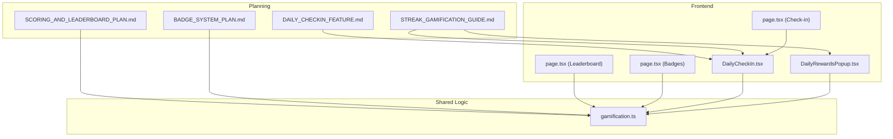
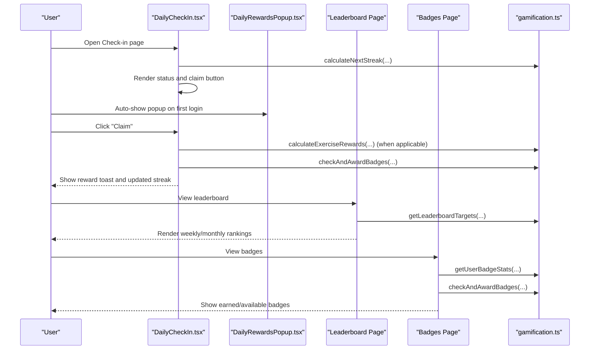
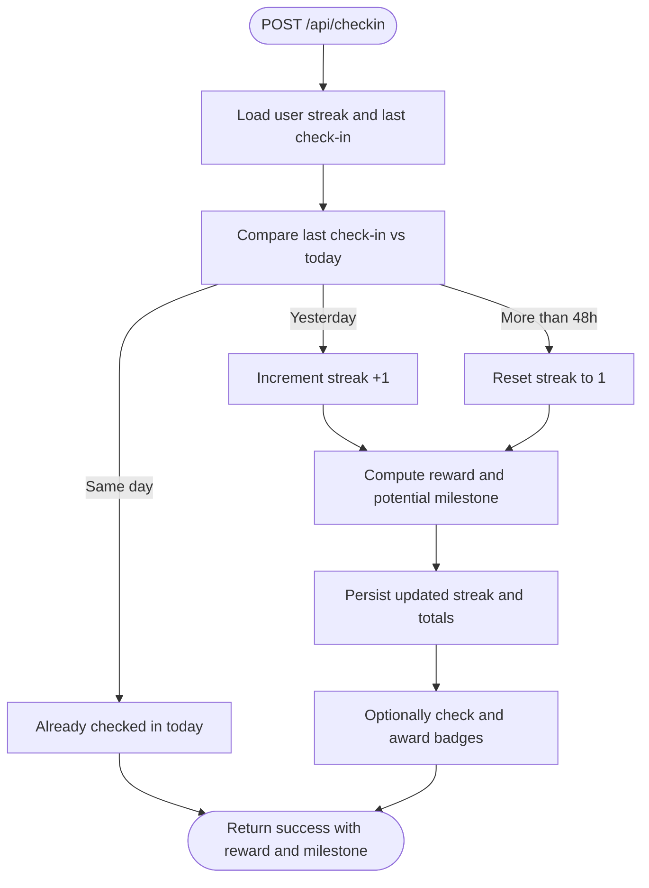
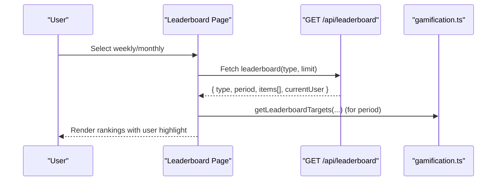
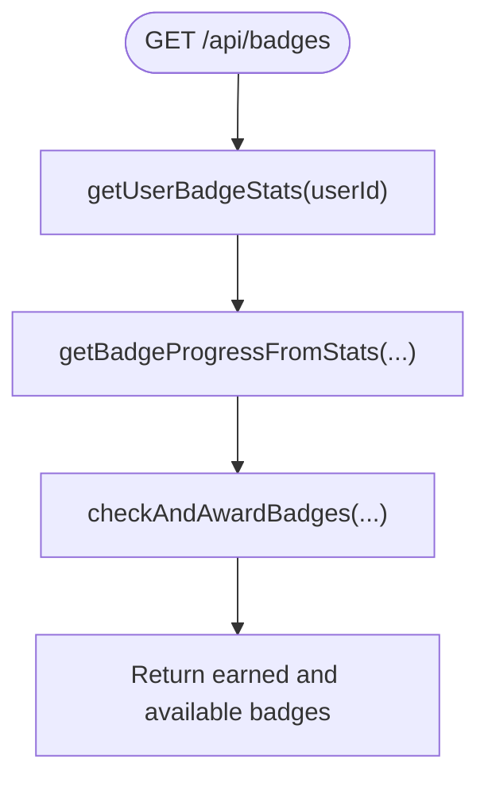
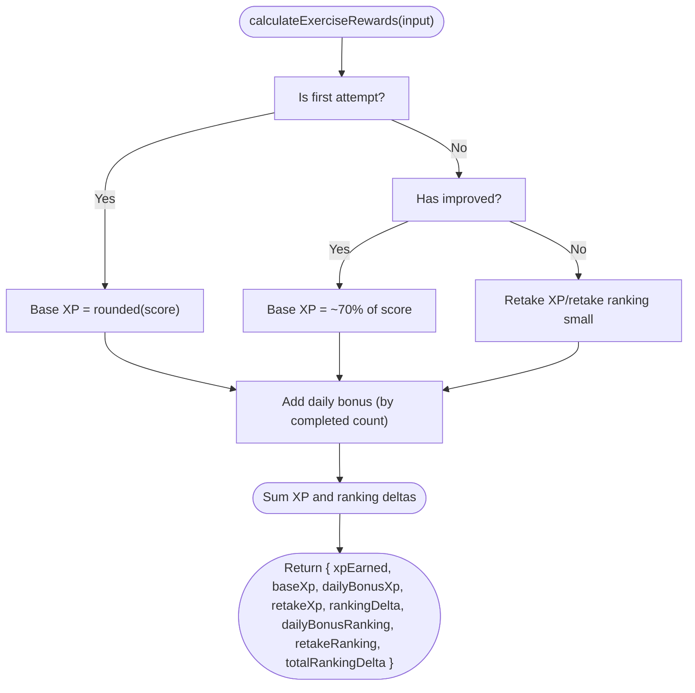
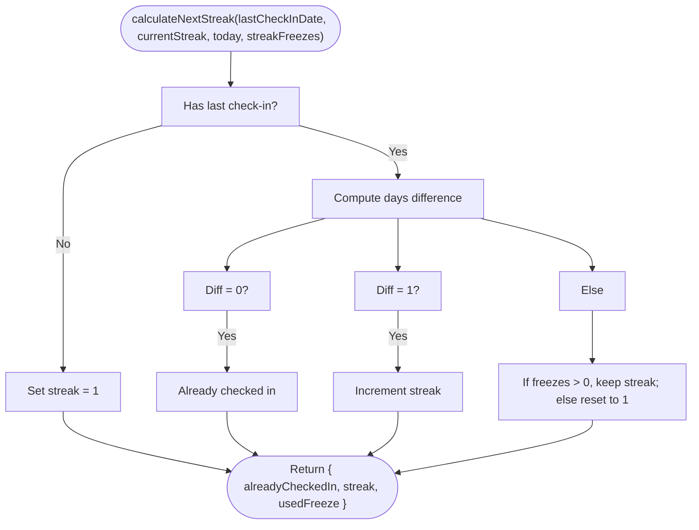
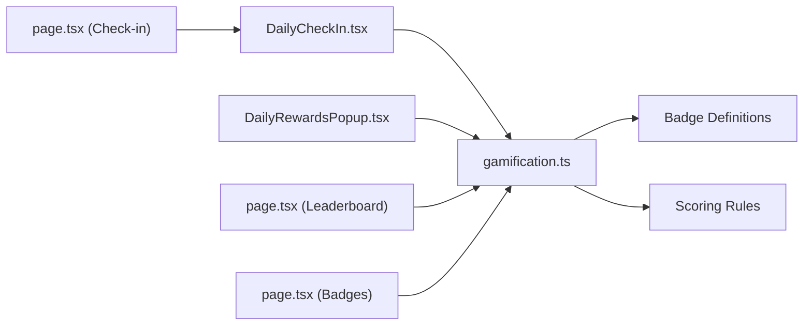

# Gamification and Leaderboard APIs

<cite>
**Referenced Files in This Document**
- [DAILY_CHECKIN_FEATURE.md](file://PLAN/04_Features/DAILY_CHECKIN_FEATURE.md)
- [STREAK_GAMIFICATION_GUIDE.md](file://PLAN/04_Features/STREAK_GAMIFICATION_GUIDE.md)
- [SCORING_AND_LEADERBOARD_PLAN.md](file://PLAN/04_Features/SCORING_AND_LEADERBOARD_PLAN.md)
- [BADGE_SYSTEM_PLAN.md](file://PLAN/04_Features/BADGE_SYSTEM_PLAN.md)
- [gamification.ts](file://english_pronunciation_app/frontend/src/lib/gamification.ts)
- [DailyCheckIn.tsx](file://english_pronunciation_app/frontend/src/components/gamification/DailyCheckIn.tsx)
- [DailyRewardsPopup.tsx](file://english_pronunciation_app/frontend/src/components/gamification/DailyRewardsPopup.tsx)
- [page.tsx (Check-in)](file://english_pronunciation_app/frontend/src/app/checkin/page.tsx)
- [page.tsx (Leaderboard)](file://english_pronunciation_app/frontend/src/app/leaderboard/page.tsx)
- [page.tsx (Badges)](file://english_pronunciation_app/frontend/src/app/badges/page.tsx)
</cite>

## Table of Contents
1. [Introduction](#introduction)
2. [Project Structure](#project-structure)
3. [Core Components](#core-components)
4. [Architecture Overview](#architecture-overview)
5. [Detailed Component Analysis](#detailed-component-analysis)
6. [Dependency Analysis](#dependency-analysis)
7. [Performance Considerations](#performance-considerations)
8. [Troubleshooting Guide](#troubleshooting-guide)
9. [Conclusion](#conclusion)
10. [Appendices](#appendices)

## Introduction
This document provides comprehensive API documentation for gamification and social features, focusing on:
- Daily check-in and streak tracking with reward collection
- Leaderboard ranking and progress display
- Badge collection and achievement management
- Badge validation and progress computation

It also documents gamification mechanics, XP calculation algorithms, streak persistence, reward systems, real-time updates, caching strategies, and performance optimizations for high-traffic scenarios.

## Project Structure
The gamification features are implemented in the frontend Next.js application under the English Pronunciation App. Key areas:
- Planning documents define the gamification mechanics, scoring, and leaderboard policies
- Frontend components implement the daily check-in widget, rewards popup, leaderboard page, and badges page
- Shared logic for XP, rewards, badges, and streak computations resides in a centralized library module

**Diagram sources**
- [DAILY_CHECKIN_FEATURE.md:164-221](file://PLAN/04_Features/DAILY_CHECKIN_FEATURE.md#L164-L221)
- [STREAK_GAMIFICATION_GUIDE.md:48-104](file://PLAN/04_Features/STREAK_GAMIFICATION_GUIDE.md#L48-L104)
- [SCORING_AND_LEADERBOARD_PLAN.md:132-152](file://PLAN/04_Features/SCORING_AND_LEADERBOARD_PLAN.md#L132-L152)
- [BADGE_SYSTEM_PLAN.md:31-36](file://PLAN/04_Features/BADGE_SYSTEM_PLAN.md#L31-L36)
- [DailyCheckIn.tsx:1-234](file://english_pronunciation_app/frontend/src/components/gamification/DailyCheckIn.tsx#L1-L234)
- [DailyRewardsPopup.tsx:1-239](file://english_pronunciation_app/frontend/src/components/gamification/DailyRewardsPopup.tsx#L1-L239)
- [page.tsx (Check-in):1-146](file://english_pronunciation_app/frontend/src/app/checkin/page.tsx#L1-L146)
- [page.tsx (Leaderboard):1-224](file://english_pronunciation_app/frontend/src/app/leaderboard/page.tsx#L1-L224)
- [page.tsx (Badges):1-253](file://english_pronunciation_app/frontend/src/app/badges/page.tsx#L1-L253)
- [gamification.ts:1-575](file://english_pronunciation_app/frontend/src/lib/gamification.ts#L1-L575)

**Section sources**
- [DAILY_CHECKIN_FEATURE.md:1-371](file://PLAN/04_Features/DAILY_CHECKIN_FEATURE.md#L1-L371)
- [STREAK_GAMIFICATION_GUIDE.md:1-569](file://PLAN/04_Features/STREAK_GAMIFICATION_GUIDE.md#L1-L569)
- [SCORING_AND_LEADERBOARD_PLAN.md:1-280](file://PLAN/04_Features/SCORING_AND_LEADERBOARD_PLAN.md#L1-L280)
- [BADGE_SYSTEM_PLAN.md:1-156](file://PLAN/04_Features/BADGE_SYSTEM_PLAN.md#L1-L156)
- [DailyCheckIn.tsx:1-234](file://english_pronunciation_app/frontend/src/components/gamification/DailyCheckIn.tsx#L1-L234)
- [DailyRewardsPopup.tsx:1-239](file://english_pronunciation_app/frontend/src/components/gamification/DailyRewardsPopup.tsx#L1-L239)
- [page.tsx (Check-in):1-146](file://english_pronunciation_app/frontend/src/app/checkin/page.tsx#L1-L146)
- [page.tsx (Leaderboard):1-224](file://english_pronunciation_app/frontend/src/app/leaderboard/page.tsx#L1-L224)
- [page.tsx (Badges):1-253](file://english_pronunciation_app/frontend/src/app/badges/page.tsx#L1-L253)
- [gamification.ts:1-575](file://english_pronunciation_app/frontend/src/lib/gamification.ts#L1-L575)

## Core Components
- Daily Check-in Widget and Popup
  - Widget displays current streak, longest streak, total check-ins, and a claim button
  - Popup presents a weekly chest grid with increasing daily rewards and milestone badges
- Leaderboard Page
  - Renders weekly and monthly rankings with user highlights and badges
- Badges Page
  - Lists earned and available badges with progress bars and category filtering
- Shared Gamification Library
  - Computes XP, daily bonuses, ranking deltas, streak progression, and badge checks

Key API surfaces:
- GET /api/checkin (status and eligibility)
- POST /api/checkin (claim daily reward and update streak)
- GET /api/leaderboard (weekly/monthly rankings)
- GET /api/badges (earned and available badges with progress)

**Section sources**
- [DAILY_CHECKIN_FEATURE.md:164-221](file://PLAN/04_Features/DAILY_CHECKIN_FEATURE.md#L164-L221)
- [STREAK_GAMIFICATION_GUIDE.md:48-104](file://PLAN/04_Features/STREAK_GAMIFICATION_GUIDE.md#L48-L104)
- [page.tsx (Check-in):38-146](file://english_pronunciation_app/frontend/src/app/checkin/page.tsx#L38-L146)
- [page.tsx (Leaderboard):60-224](file://english_pronunciation_app/frontend/src/app/leaderboard/page.tsx#L60-L224)
- [page.tsx (Badges):133-253](file://english_pronunciation_app/frontend/src/app/badges/page.tsx#L133-L253)
- [gamification.ts:13-53](file://english_pronunciation_app/frontend/src/lib/gamification.ts#L13-L53)

## Architecture Overview
The frontend pages orchestrate user actions and fetch data from backend APIs. The shared library encapsulates gamification logic for XP, rewards, streaks, and badges.

**Diagram sources**
- [DailyCheckIn.tsx:69-161](file://english_pronunciation_app/frontend/src/components/gamification/DailyCheckIn.tsx#L69-L161)
- [DailyRewardsPopup.tsx:52-58](file://english_pronunciation_app/frontend/src/components/gamification/DailyRewardsPopup.tsx#L52-L58)
- [page.tsx (Leaderboard):66-95](file://english_pronunciation_app/frontend/src/app/leaderboard/page.tsx#L66-L95)
- [page.tsx (Badges):139-173](file://english_pronunciation_app/frontend/src/app/badges/page.tsx#L139-L173)
- [gamification.ts:186-234](file://english_pronunciation_app/frontend/src/lib/gamification.ts#L186-L234)
- [gamification.ts:236-244](file://english_pronunciation_app/frontend/src/lib/gamification.ts#L236-L244)
- [gamification.ts:380-488](file://english_pronunciation_app/frontend/src/lib/gamification.ts#L380-L488)
- [gamification.ts:490-531](file://english_pronunciation_app/frontend/src/lib/gamification.ts#L490-L531)

## Detailed Component Analysis

### Daily Check-in API
Endpoints:
- GET /api/checkin
  - Purpose: Retrieve current streak, longest streak, total check-ins, last check-in date, and eligibility to claim
  - Typical response fields: currentStreak, longestStreak, totalCheckIns, lastCheckInDate, canCheckIn
- POST /api/checkin
  - Purpose: Claim daily reward and update streak; optionally triggers badge checks
  - Request body: empty or contains optional metadata (e.g., userId)
  - Typical response fields: success flag, updated streak, reward details, milestone/badge notifications

Streak logic:
- If last check-in was yesterday: increment streak
- If last check-in was today: prevent double claim
- If last check-in was more than 48 hours ago: reset streak to 1
- Optional freeze mechanism can preserve streak when configured

Weekly rewards:
- Increasing coin rewards per day in the weekly cycle
- Day 7 unlocks a milestone badge

**Diagram sources**
- [STREAK_GAMIFICATION_GUIDE.md:84-91](file://PLAN/04_Features/STREAK_GAMIFICATION_GUIDE.md#L84-L91)
- [DAILY_CHECKIN_FEATURE.md:168-199](file://PLAN/04_Features/DAILY_CHECKIN_FEATURE.md#L168-L199)
- [gamification.ts:553-574](file://english_pronunciation_app/frontend/src/lib/gamification.ts#L553-L574)

**Section sources**
- [DAILY_CHECKIN_FEATURE.md:164-221](file://PLAN/04_Features/DAILY_CHECKIN_FEATURE.md#L164-L221)
- [STREAK_GAMIFICATION_GUIDE.md:48-104](file://PLAN/04_Features/STREAK_GAMIFICATION_GUIDE.md#L48-L104)
- [STREAK_GAMIFICATION_GUIDE.md:181-192](file://PLAN/04_Features/STREAK_GAMIFICATION_GUIDE.md#L181-L192)
- [gamification.ts:553-574](file://english_pronunciation_app/frontend/src/lib/gamification.ts#L553-L574)

### Leaderboard API
Endpoint:
- GET /api/leaderboard
  - Query params: type (tuan or thang), limit (e.g., 20)
  - Response: type, period, items[], currentUser { rank, score }
  - Items include rank, user identity, level, streak, score, correct answers, completed exercises, and badges

Leaderboard policy:
- Separate weekly and monthly periods
- Scores reset at the start of each period to maintain fairness
- Ranking derived from exercise attempts and daily check-in contributions

**Diagram sources**
- [page.tsx (Leaderboard):66-95](file://english_pronunciation_app/frontend/src/app/leaderboard/page.tsx#L66-L95)
- [SCORING_AND_LEADERBOARD_PLAN.md:132-152](file://PLAN/04_Features/SCORING_AND_LEADERBOARD_PLAN.md#L132-L152)
- [gamification.ts:236-244](file://english_pronunciation_app/frontend/src/lib/gamification.ts#L236-L244)

**Section sources**
- [page.tsx (Leaderboard):60-224](file://english_pronunciation_app/frontend/src/app/leaderboard/page.tsx#L60-L224)
- [SCORING_AND_LEADERBOARD_PLAN.md:132-152](file://PLAN/04_Features/SCORING_AND_LEADERBOARD_PLAN.md#L132-L152)
- [gamification.ts:236-244](file://english_pronunciation_app/frontend/src/lib/gamification.ts#L236-L244)

### Badge Collection and Validation API
Endpoints:
- GET /api/badges
  - Response: earned[], available[], summary { earnedCount, totalCount }
  - Available items include progress bars and conditions

Badge mechanics:
- Definitions enumerate criteria by category (progress, skill, streak, improvement, ranking)
- Progress computed via user statistics (completed exercises, high-score counts, streak, best improvement, weekly rank)
- Awards are idempotent per badge per user; periodic badges tied to weekly period

**Diagram sources**
- [page.tsx (Badges):139-173](file://english_pronunciation_app/frontend/src/app/badges/page.tsx#L139-L173)
- [BADGE_SYSTEM_PLAN.md:31-36](file://PLAN/04_Features/BADGE_SYSTEM_PLAN.md#L31-L36)
- [gamification.ts:380-488](file://english_pronunciation_app/frontend/src/lib/gamification.ts#L380-L488)
- [gamification.ts:490-531](file://english_pronunciation_app/frontend/src/lib/gamification.ts#L490-L531)

**Section sources**
- [page.tsx (Badges):133-253](file://english_pronunciation_app/frontend/src/app/badges/page.tsx#L133-L253)
- [BADGE_SYSTEM_PLAN.md:191-209](file://PLAN/04_Features/BADGE_SYSTEM_PLAN.md#L191-L209)
- [gamification.ts:380-531](file://english_pronunciation_app/frontend/src/lib/gamification.ts#L380-L531)

### XP Calculation and Daily Bonuses
XP and ranking delta computation:
- Base XP from exercise score with difficulty multipliers
- First attempt: full score contributes to XP and ranking
- Improved attempts: partial XP and ranking delta based on score improvement
- Retake attempts below threshold: small XP and ranking for effort
- Daily completion bonus: capped XP and ranking based on completed exercises in a day

**Diagram sources**
- [SCORING_AND_LEADERBOARD_PLAN.md:73-131](file://PLAN/04_Features/SCORING_AND_LEADERBOARD_PLAN.md#L73-L131)
- [gamification.ts:195-234](file://english_pronunciation_app/frontend/src/lib/gamification.ts#L195-L234)

**Section sources**
- [SCORING_AND_LEADERBOARD_PLAN.md:73-131](file://PLAN/04_Features/SCORING_AND_LEADERBOARD_PLAN.md#L73-L131)
- [gamification.ts:186-234](file://english_pronunciation_app/frontend/src/lib/gamification.ts#L186-L234)

### Streak Persistence and Freeze Mechanics
Streak computation:
- Uses local-day comparison to detect consecutive days
- Resets to 1 when gaps exceed 48 hours
- Optional freeze usage preserves streak when configured

**Diagram sources**
- [gamification.ts:553-574](file://english_pronunciation_app/frontend/src/lib/gamification.ts#L553-L574)

**Section sources**
- [gamification.ts:553-574](file://english_pronunciation_app/frontend/src/lib/gamification.ts#L553-L574)

### Real-time Updates and UI Integration
- Daily check-in widget auto-fetches status on mount and updates immediately with optimistic UI
- Rewards popup appears on first login of the day and closes after claiming
- Leaderboard and badges pages fetch on mount and selection changes
- Toast notifications surface reward and milestone events

**Section sources**
- [DailyCheckIn.tsx:69-161](file://english_pronunciation_app/frontend/src/components/gamification/DailyCheckIn.tsx#L69-L161)
- [DailyRewardsPopup.tsx:52-58](file://english_pronunciation_app/frontend/src/components/gamification/DailyRewardsPopup.tsx#L52-L58)
- [page.tsx (Leaderboard):66-95](file://english_pronunciation_app/frontend/src/app/leaderboard/page.tsx#L66-L95)
- [page.tsx (Badges):139-173](file://english_pronunciation_app/frontend/src/app/badges/page.tsx#L139-L173)

## Dependency Analysis
Gamification logic is centralized in the shared library and consumed by frontend pages and components.

**Diagram sources**
- [DailyCheckIn.tsx:1-234](file://english_pronunciation_app/frontend/src/components/gamification/DailyCheckIn.tsx#L1-L234)
- [DailyRewardsPopup.tsx:1-239](file://english_pronunciation_app/frontend/src/components/gamification/DailyRewardsPopup.tsx#L1-L239)
- [page.tsx (Check-in):1-146](file://english_pronunciation_app/frontend/src/app/checkin/page.tsx#L1-L146)
- [page.tsx (Leaderboard):1-224](file://english_pronunciation_app/frontend/src/app/leaderboard/page.tsx#L1-L224)
- [page.tsx (Badges):1-253](file://english_pronunciation_app/frontend/src/app/badges/page.tsx#L1-L253)
- [gamification.ts:65-176](file://english_pronunciation_app/frontend/src/lib/gamification.ts#L65-L176)
- [SCORING_AND_LEADERBOARD_PLAN.md:73-131](file://PLAN/04_Features/SCORING_AND_LEADERBOARD_PLAN.md#L73-L131)

**Section sources**
- [gamification.ts:1-575](file://english_pronunciation_app/frontend/src/lib/gamification.ts#L1-L575)
- [SCORING_AND_LEADERBOARD_PLAN.md:73-131](file://PLAN/04_Features/SCORING_AND_LEADERBOARD_PLAN.md#L73-L131)

## Performance Considerations
- Caching strategies
  - Leaderboard: cache weekly/monthly results keyed by period; invalidate on period boundary or after significant score changes
  - Badges: cache computed progress per user; refresh on attempt submission or leaderboard updates
  - Check-in: cache daily status for the session; refresh on first login of the day
- Rate limiting
  - Enforce per-user daily claim limits to prevent abuse
- Pagination and limits
  - Apply reasonable limits on leaderboard queries (e.g., top 50–100)
- Asynchronous updates
  - Use optimistic UI for immediate feedback; reconcile with server responses
- Database indexing
  - Ensure indexes on user streak, leaderboard period/type, and badge ownership

[No sources needed since this section provides general guidance]

## Troubleshooting Guide
Common issues and resolutions:
- Double claim prevention
  - Ensure the widget disables the claim button when canCheckIn is false
  - On API errors with specific codes, update UI state accordingly
- Timezone handling
  - Use UTC-based date comparisons to avoid off-by-one errors across regions
- Streak reset behavior
  - Verify gap thresholds and freeze usage logic
- Leaderboard stale data
  - Confirm period boundaries and cache invalidation
- Badge award duplication
  - Ensure uniqueness constraints per user-badge and periodic badge validity windows

**Section sources**
- [DailyCheckIn.tsx:106-161](file://english_pronunciation_app/frontend/src/components/gamification/DailyCheckIn.tsx#L106-L161)
- [STREAK_GAMIFICATION_GUIDE.md:506-553](file://PLAN/04_Features/STREAK_GAMIFICATION_GUIDE.md#L506-L553)
- [gamification.ts:553-574](file://english_pronunciation_app/frontend/src/lib/gamification.ts#L553-L574)

## Conclusion
The gamification and social features are implemented with clear separation of concerns: frontend pages and components handle UI and user interactions, while the shared library centralizes XP, rewards, streak, and badge logic. The APIs expose straightforward endpoints for daily check-in, leaderboard, and badges, enabling scalable and maintainable gameplay mechanics.

[No sources needed since this section summarizes without analyzing specific files]

## Appendices

### API Reference Summary
- GET /api/checkin
  - Purpose: Retrieve streak status and eligibility
  - Response: currentStreak, longestStreak, totalCheckIns, lastCheckInDate, canCheckIn
- POST /api/checkin
  - Purpose: Claim daily reward and update streak
  - Response: success flag, updated streak, reward details, milestone/badge notifications
- GET /api/leaderboard?type=tuan|thang&limit=N
  - Purpose: Fetch weekly or monthly leaderboard
  - Response: type, period, items[], currentUser { rank, score }
- GET /api/badges
  - Purpose: List earned and available badges with progress
  - Response: earned[], available[], summary { earnedCount, totalCount }

**Section sources**
- [DAILY_CHECKIN_FEATURE.md:168-221](file://PLAN/04_Features/DAILY_CHECKIN_FEATURE.md#L168-L221)
- [STREAK_GAMIFICATION_GUIDE.md:92-104](file://PLAN/04_Features/STREAK_GAMIFICATION_GUIDE.md#L92-L104)
- [page.tsx (Leaderboard):74-75](file://english_pronunciation_app/frontend/src/app/leaderboard/page.tsx#L74-L75)
- [page.tsx (Badges):147-147](file://english_pronunciation_app/frontend/src/app/badges/page.tsx#L147-L147)

### Examples and Scenarios
- Daily check-in flow
  - User completes an exercise → automatic check-in → receive reward and potential milestone
- Leaderboard queries
  - Weekly: type=tuan, limit=20
  - Monthly: type=thang, limit=20
- Badge criteria
  - Streak milestones: 3 days, 7 days, 14 days
  - Skill badges: achieving high scores in listening/speaking exercises
  - Ranking badge: top 10 in weekly leaderboard
- Streak calculations
  - Consecutive day detection with 48-hour tolerance and optional freeze usage

**Section sources**
- [STREAK_GAMIFICATION_GUIDE.md:167-192](file://PLAN/04_Features/STREAK_GAMIFICATION_GUIDE.md#L167-L192)
- [SCORING_AND_LEADERBOARD_PLAN.md:132-152](file://PLAN/04_Features/SCORING_AND_LEADERBOARD_PLAN.md#L132-L152)
- [BADGE_SYSTEM_PLAN.md:70-92](file://PLAN/04_Features/BADGE_SYSTEM_PLAN.md#L70-L92)
- [gamification.ts:553-574](file://english_pronunciation_app/frontend/src/lib/gamification.ts#L553-L574)