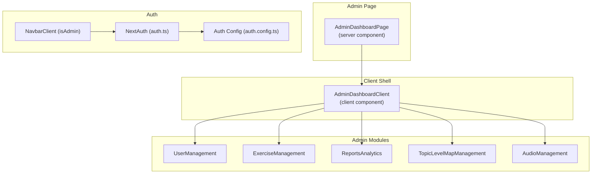
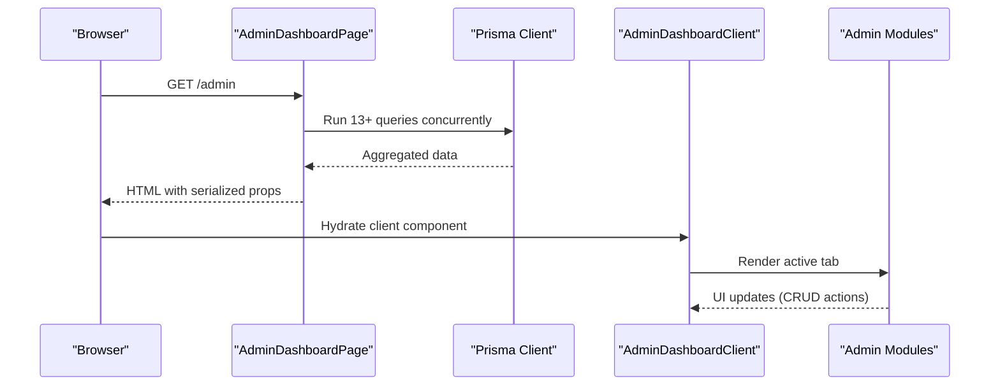
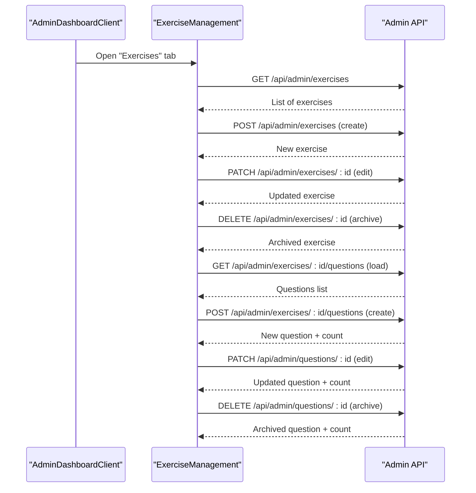
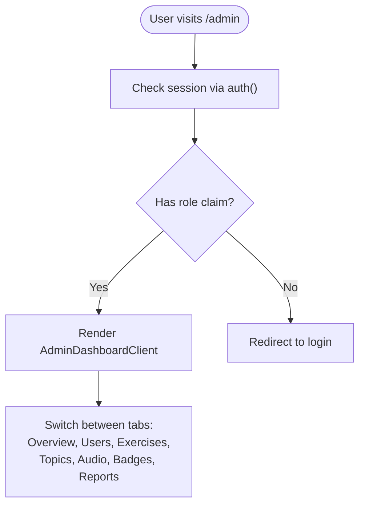
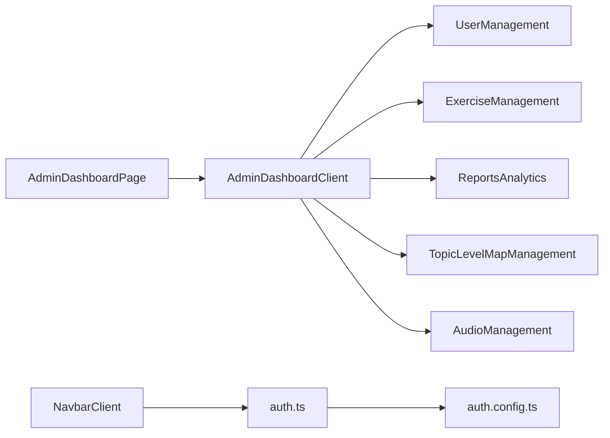

# Admin Dashboard

<cite>
**Referenced Files in This Document**
- [page.tsx](file://english_pronunciation_app/frontend/src/app/admin/page.tsx)
- [AdminDashboardClient.tsx](file://english_pronunciation_app/frontend/src/components/admin/AdminDashboardClient.tsx)
- [UserManagement.tsx](file://english_pronunciation_app/frontend/src/components/admin/UserManagement.tsx)
- [ExerciseManagement.tsx](file://english_pronunciation_app/frontend/src/components/admin/ExerciseManagement.tsx)
- [ReportsAnalytics.tsx](file://english_pronunciation_app/frontend/src/components/admin/ReportsAnalytics.tsx)
- [TopicLevelMapManagement.tsx](file://english_pronunciation_app/frontend/src/components/admin/TopicLevelMapManagement.tsx)
- [AudioManagement.tsx](file://english_pronunciation_app/frontend/src/components/admin/AudioManagement.tsx)
- [auth.ts](file://english_pronunciation_app/frontend/src/lib/auth.ts)
- [auth.config.ts](file://english_pronunciation_app/frontend/src/lib/auth.config.ts)
- [NavbarClient.tsx](file://english_pronunciation_app/frontend/src/components/layout/NavbarClient.tsx)
</cite>

## Table of Contents
1. [Introduction](#introduction)
2. [Project Structure](#project-structure)
3. [Core Components](#core-components)
4. [Architecture Overview](#architecture-overview)
5. [Detailed Component Analysis](#detailed-component-analysis)
6. [Dependency Analysis](#dependency-analysis)
7. [Performance Considerations](#performance-considerations)
8. [Troubleshooting Guide](#troubleshooting-guide)
9. [Conclusion](#conclusion)
10. [Appendices](#appendices)

## Introduction
This document describes the administrative dashboard and content management system for the pronunciation training platform. It covers the admin interface architecture, user management, content administration tools, analytics and reporting, exercise and topic/level administration, audio asset management, and the integration with the authentication system. It also outlines admin-only routes, permission systems, and operational procedures for onboarding administrators.

## Project Structure
The admin dashboard is implemented as a Next.js App Router page that preloads aggregated statistics and lists from the database, then delegates rendering to modular client-side admin components. Authentication integrates via NextAuth with JWT-based sessions and role propagation.

**Diagram sources**
- [page.tsx:1-249](file://english_pronunciation_app/frontend/src/app/admin/page.tsx#L1-L249)
- [AdminDashboardClient.tsx:1-197](file://english_pronunciation_app/frontend/src/components/admin/AdminDashboardClient.tsx#L1-L197)
- [UserManagement.tsx:1-100](file://english_pronunciation_app/frontend/src/components/admin/UserManagement.tsx#L1-L100)
- [ExerciseManagement.tsx:1-886](file://english_pronunciation_app/frontend/src/components/admin/ExerciseManagement.tsx#L1-L886)
- [ReportsAnalytics.tsx:1-71](file://english_pronunciation_app/frontend/src/components/admin/ReportsAnalytics.tsx#L1-L71)
- [TopicLevelMapManagement.tsx:1-433](file://english_pronunciation_app/frontend/src/components/admin/TopicLevelMapManagement.tsx#L1-L433)
- [AudioManagement.tsx:1-85](file://english_pronunciation_app/frontend/src/components/admin/AudioManagement.tsx#L1-L85)
- [auth.ts:1-151](file://english_pronunciation_app/frontend/src/lib/auth.ts#L1-L151)
- [auth.config.ts:1-25](file://english_pronunciation_app/frontend/src/lib/auth.config.ts#L1-L25)
- [NavbarClient.tsx:1-234](file://english_pronunciation_app/frontend/src/components/layout/NavbarClient.tsx#L1-L234)

**Section sources**
- [page.tsx:1-249](file://english_pronunciation_app/frontend/src/app/admin/page.tsx#L1-L249)
- [AdminDashboardClient.tsx:1-197](file://english_pronunciation_app/frontend/src/components/admin/AdminDashboardClient.tsx#L1-L197)

## Core Components
- AdminDashboardPage (server component): Aggregates system-wide metrics, recent activity, and reference data (topics, levels, maps, question types). Passes typed props to the client shell.
- AdminDashboardClient (client component): Hosts the admin UI shell with tabbed navigation and renders specialized modules.
- UserManagement: Lists users with search and status badges; serves as the user administration hub.
- ExerciseManagement: CRUD for exercises and questions; manages statuses, time limits, and question options; integrates with question types.
- ReportsAnalytics: Displays weekly KPIs (new users, completed attempts, average scores) and top exercises.
- TopicLevelMapManagement: CRUD for topics, levels, and learning maps; supports status transitions and archival.
- AudioManagement: Browses audio assets with filtering and metadata.

**Section sources**
- [page.tsx:10-139](file://english_pronunciation_app/frontend/src/app/admin/page.tsx#L10-L139)
- [AdminDashboardClient.tsx:15-56](file://english_pronunciation_app/frontend/src/components/admin/AdminDashboardClient.tsx#L15-L56)
- [UserManagement.tsx:1-100](file://english_pronunciation_app/frontend/src/components/admin/UserManagement.tsx#L1-L100)
- [ExerciseManagement.tsx:29-104](file://english_pronunciation_app/frontend/src/components/admin/ExerciseManagement.tsx#L29-L104)
- [ReportsAnalytics.tsx:3-13](file://english_pronunciation_app/frontend/src/components/admin/ReportsAnalytics.tsx#L3-L13)
- [TopicLevelMapManagement.tsx:8-58](file://english_pronunciation_app/frontend/src/components/admin/TopicLevelMapManagement.tsx#L8-L58)
- [AudioManagement.tsx:6-16](file://english_pronunciation_app/frontend/src/components/admin/AudioManagement.tsx#L6-L16)

## Architecture Overview
The admin UI is structured as a server-rendered page that performs multiple concurrent Prisma queries to gather dashboard data. The client shell then orchestrates tabbed views and mounts specialized admin panels. Authentication is handled centrally via NextAuth with JWT, exposing role information to the UI.

**Diagram sources**
- [page.tsx:25-139](file://english_pronunciation_app/frontend/src/app/admin/page.tsx#L25-L139)
- [AdminDashboardClient.tsx:70-196](file://english_pronunciation_app/frontend/src/components/admin/AdminDashboardClient.tsx#L70-L196)

## Detailed Component Analysis

### AdminDashboardPage (Server Component)
Responsibilities:
- Computes date boundaries for recent activity.
- Executes parallel Prisma queries for counts, lists, and summaries.
- Builds typed AdminDashboardData for client hydration.
- Calculates top exercises by completion and average score.

Key behaviors:
- Uses force-dynamic rendering to bypass caching for live metrics.
- Aggregates recent attempts and computes derived metrics (average score, top exercises).
- Normalizes database records into client-friendly shapes.

Operational notes:
- The 13+ queries include counts, paginated lists, and computed summaries.
- Derived stats (e.g., average score) are computed client-side for responsiveness.

**Section sources**
- [page.tsx:4-168](file://english_pronunciation_app/frontend/src/app/admin/page.tsx#L4-L168)
- [page.tsx:170-245](file://english_pronunciation_app/frontend/src/app/admin/page.tsx#L170-L245)

### AdminDashboardClient (Client Shell)
Responsibilities:
- Manages active tab state and renders the appropriate admin panel.
- Provides quick action cards linking to major admin areas.
- Exposes localized labels and keyboard navigation for tabs.

UI/UX highlights:
- Tab navigation with arrow-key support.
- Responsive card-based layout for stats and controls.

**Section sources**
- [AdminDashboardClient.tsx:48-196](file://english_pronunciation_app/frontend/src/components/admin/AdminDashboardClient.tsx#L48-L196)

### User Management
Capabilities:
- Search users by username or email.
- View roles and statuses with color-coded badges.
- Local filtering without server round-trips.

Data model:
- AdminUser: id, username, email, role, status, createdAt.

**Section sources**
- [UserManagement.tsx:7-27](file://english_pronunciation_app/frontend/src/components/admin/UserManagement.tsx#L7-L27)
- [UserManagement.tsx:29-99](file://english_pronunciation_app/frontend/src/components/admin/UserManagement.tsx#L29-L99)

### Exercise Management
Capabilities:
- Create/edit exercises with topic, level, learning map, status, and optional time limit.
- Archive exercises.
- Load, create, edit, and archive questions per exercise.
- Manage question options via newline-separated input.
- Enforces prerequisites: topics, levels, and maps must exist before creating exercises; question types must exist before adding questions.

Data models:
- AdminExercise: id, name, description, topic/level/map references, timing, counts, status.
- AdminQuestion: id, name/content, type, answer, score, options.

API interactions:
- Exercises: POST/PATCH/DELETE against /api/admin/exercises and /api/admin/exercises/:id.
- Questions: POST/PATCH/DELETE against /api/admin/exercises/:id/questions and /api/admin/questions/:id.
- Bulk question load: GET /api/admin/exercises/:id/questions.

**Diagram sources**
- [ExerciseManagement.tsx:321-385](file://english_pronunciation_app/frontend/src/components/admin/ExerciseManagement.tsx#L321-L385)
- [ExerciseManagement.tsx:405-423](file://english_pronunciation_app/frontend/src/components/admin/ExerciseManagement.tsx#L405-L423)
- [ExerciseManagement.tsx:474-509](file://english_pronunciation_app/frontend/src/components/admin/ExerciseManagement.tsx#L474-L509)
- [ExerciseManagement.tsx:521-549](file://english_pronunciation_app/frontend/src/components/admin/ExerciseManagement.tsx#L521-L549)

**Section sources**
- [ExerciseManagement.tsx:29-104](file://english_pronunciation_app/frontend/src/components/admin/ExerciseManagement.tsx#L29-L104)
- [ExerciseManagement.tsx:235-273](file://english_pronunciation_app/frontend/src/components/admin/ExerciseManagement.tsx#L235-L273)
- [ExerciseManagement.tsx:300-351](file://english_pronunciation_app/frontend/src/components/admin/ExerciseManagement.tsx#L300-L351)
- [ExerciseManagement.tsx:353-385](file://english_pronunciation_app/frontend/src/components/admin/ExerciseManagement.tsx#L353-L385)
- [ExerciseManagement.tsx:395-423](file://english_pronunciation_app/frontend/src/components/admin/ExerciseManagement.tsx#L395-L423)
- [ExerciseManagement.tsx:446-509](file://english_pronunciation_app/frontend/src/components/admin/ExerciseManagement.tsx#L446-L509)
- [ExerciseManagement.tsx:511-549](file://english_pronunciation_app/frontend/src/components/admin/ExerciseManagement.tsx#L511-L549)

### Reports and Analytics
Capabilities:
- Displays new users last 7 days, completed attempts last 7 days, and average score.
- Ranks top exercises by completion count and average score.

Data model:
- AdminReportsData: KPIs and top exercises list.

**Section sources**
- [ReportsAnalytics.tsx:3-13](file://english_pronunciation_app/frontend/src/components/admin/ReportsAnalytics.tsx#L3-L13)
- [page.tsx:141-168](file://english_pronunciation_app/frontend/src/app/admin/page.tsx#L141-L168)

### Topic, Level, and Learning Map Management
Capabilities:
- Create/edit topics and levels with name/description.
- Create/edit learning maps with name, requirement, and status.
- Archive or delete entries depending on constraints.
- Switch between managing topics, levels, or maps via tabs.

API interactions:
- POST/PATCH/DELETE against /api/admin/topics, /api/admin/levels, and /api/admin/maps.

**Section sources**
- [TopicLevelMapManagement.tsx:94-260](file://english_pronunciation_app/frontend/src/components/admin/TopicLevelMapManagement.tsx#L94-L260)
- [TopicLevelMapManagement.tsx:139-211](file://english_pronunciation_app/frontend/src/components/admin/TopicLevelMapManagement.tsx#L139-L211)
- [TopicLevelMapManagement.tsx:213-260](file://english_pronunciation_app/frontend/src/components/admin/TopicLevelMapManagement.tsx#L213-L260)

### Audio Asset Management
Capabilities:
- Browse audio files with filtering by filename/path.
- View metadata: duration, play limit, and usage count across exercises.

**Section sources**
- [AudioManagement.tsx:18-84](file://english_pronunciation_app/frontend/src/components/admin/AudioManagement.tsx#L18-L84)

### Permission System and Admin Routes
- Admin-only route: /admin is gated by the presence of an authenticated user with a role claim propagated via JWT.
- Navigation: The navbar conditionally renders an Admin link when the user is identified as an administrator.
- Authentication flow: NextAuth handles OAuth and credential-based login, normalizes emails, assigns default roles, and stores role in the JWT session.

**Diagram sources**
- [auth.ts:76-151](file://english_pronunciation_app/frontend/src/lib/auth.ts#L76-L151)
- [auth.config.ts:8-23](file://english_pronunciation_app/frontend/src/lib/auth.config.ts#L8-L23)
- [NavbarClient.tsx:97-105](file://english_pronunciation_app/frontend/src/components/layout/NavbarClient.tsx#L97-L105)

**Section sources**
- [auth.ts:76-151](file://english_pronunciation_app/frontend/src/lib/auth.ts#L76-L151)
- [auth.config.ts:8-23](file://english_pronunciation_app/frontend/src/lib/auth.config.ts#L8-L23)
- [NavbarClient.tsx:97-105](file://english_pronunciation_app/frontend/src/components/layout/NavbarClient.tsx#L97-L105)

## Dependency Analysis
High-level dependencies:
- AdminDashboardPage depends on Prisma for data fetching and passes typed data to AdminDashboardClient.
- AdminDashboardClient depends on child components for modularity.
- ExerciseManagement and TopicLevelMapManagement depend on local state and API endpoints.
- Authentication is centralized in auth.ts and auth.config.ts, influencing navbar visibility and admin access.

**Diagram sources**
- [page.tsx:1-249](file://english_pronunciation_app/frontend/src/app/admin/page.tsx#L1-L249)
- [AdminDashboardClient.tsx:1-197](file://english_pronunciation_app/frontend/src/components/admin/AdminDashboardClient.tsx#L1-L197)
- [auth.ts:1-151](file://english_pronunciation_app/frontend/src/lib/auth.ts#L1-L151)
- [auth.config.ts:1-25](file://english_pronunciation_app/frontend/src/lib/auth.config.ts#L1-L25)
- [NavbarClient.tsx:1-234](file://english_pronunciation_app/frontend/src/components/layout/NavbarClient.tsx#L1-L234)

**Section sources**
- [page.tsx:1-249](file://english_pronunciation_app/frontend/src/app/admin/page.tsx#L1-L249)
- [AdminDashboardClient.tsx:1-197](file://english_pronunciation_app/frontend/src/components/admin/AdminDashboardClient.tsx#L1-L197)
- [auth.ts:1-151](file://english_pronunciation_app/frontend/src/lib/auth.ts#L1-L151)
- [auth.config.ts:1-25](file://english_pronunciation_app/frontend/src/lib/auth.config.ts#L1-L25)
- [NavbarClient.tsx:1-234](file://english_pronunciation_app/frontend/src/components/layout/NavbarClient.tsx#L1-L234)

## Performance Considerations
- Server-side aggregation: AdminDashboardPage runs multiple Prisma queries concurrently to minimize client work and reduce latency.
- Client-side filtering: Components like UserManagement and AudioManagement filter locally to avoid unnecessary network requests.
- Minimal re-renders: Client components use memoization and controlled forms to keep UI responsive during CRUD operations.
- Recommendations:
  - Add pagination for large datasets (users, exercises, audio).
  - Implement debounced search for improved UX under heavy typing.
  - Cache frequently accessed reference data (topics, levels, maps) in memory on the client.

## Troubleshooting Guide
Common issues and resolutions:
- Admin page fails to render:
  - Verify Prisma connectivity and that required entities (topics, levels, maps, question types) exist.
  - Confirm that the server component executes without throwing unhandled exceptions.
- Exercise creation blocked:
  - Ensure prerequisite reference data exists; the UI enforces this before enabling the save button.
- Question creation errors:
  - Confirm that question types exist in the database; the UI prevents saving until ready.
- API connectivity failures:
  - Check network tab for 5xx responses; confirm API endpoints exist (/api/admin/exercises, /api/admin/exercises/:id/questions, /api/admin/questions/:id, /api/admin/topics, /api/admin/levels, /api/admin/maps).
- Authentication problems:
  - Verify NextAuth callbacks populate role in the JWT; ensure the navbar conditionally shows Admin link when isAdmin is true.

**Section sources**
- [ExerciseManagement.tsx:303-306](file://english_pronunciation_app/frontend/src/components/admin/ExerciseManagement.tsx#L303-L306)
- [ExerciseManagement.tsx:454-457](file://english_pronunciation_app/frontend/src/components/admin/ExerciseManagement.tsx#L454-L457)
- [auth.ts:117-151](file://english_pronunciation_app/frontend/src/lib/auth.ts#L117-L151)
- [NavbarClient.tsx:97-105](file://english_pronunciation_app/frontend/src/components/layout/NavbarClient.tsx#L97-L105)

## Conclusion
The admin dashboard combines server-side data aggregation with modular client components to deliver a comprehensive content and user management experience. It leverages NextAuth for secure, role-aware access and provides intuitive workflows for exercises, questions, topics, levels, learning maps, and audio assets. The architecture supports future enhancements such as bulk operations, advanced analytics, and export capabilities.

## Appendices

### Admin Workflows
- Onboarding administrators:
  - Create a user with the appropriate role in the database.
  - Log in via NextAuth (OAuth or credentials); the role is stored in the JWT session.
  - Access /admin; the navbar shows Admin when isAdmin is true.
- Managing exercises:
  - Create prerequisite topics, levels, and maps.
  - Create exercises; set status to DRAFT initially.
  - Add questions with proper question types; manage options via newline input.
  - Publish by changing status to ACTIVE after review.
- Monitoring progress:
  - Use ReportsAnalytics for weekly KPIs and top exercises.
- Curating content:
  - Use TopicLevelMapManagement to define learning pathways.
  - Use AudioManagement to locate and audit audio assets.

[No sources needed since this section summarizes workflows without analyzing specific files]