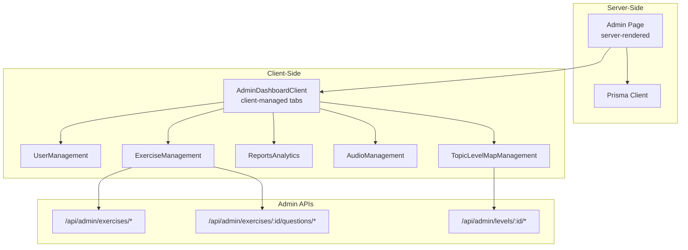
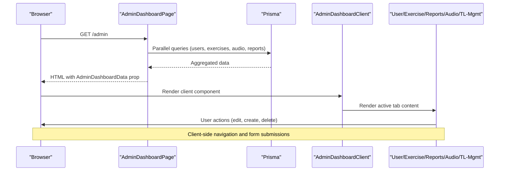
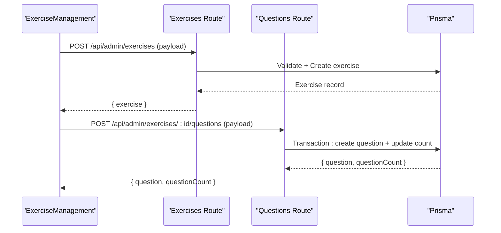
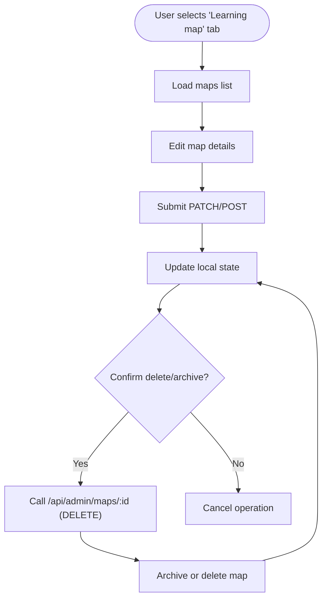
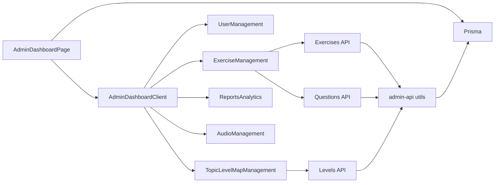

# Admin Interface and Navigation

<cite>
**Referenced Files in This Document**
- [page.tsx](file://english_pronunciation_app/frontend/src/app/admin/page.tsx)
- [AdminDashboardClient.tsx](file://english_pronunciation_app/frontend/src/components/admin/AdminDashboardClient.tsx)
- [admin-api.ts](file://english_pronunciation_app/frontend/src/lib/admin-api.ts)
- [layout.tsx](file://english_pronunciation_app/frontend/src/app/layout.tsx)
- [Navbar.tsx](file://english_pronunciation_app/frontend/src/components/layout/Navbar.tsx)
- [route.ts](file://english_pronunciation_app/frontend/src/app/api/admin/exercises/[id]/route.ts)
- [route.ts](file://english_pronunciation_app/frontend/src/app/api/admin/exercises/[id]/questions/route.ts)
- [route.ts](file://english_pronunciation_app/frontend/src/app/api/admin/exercises/route.ts)
- [UserManagement.tsx](file://english_pronunciation_app/frontend/src/components/admin/UserManagement.tsx)
- [ExerciseManagement.tsx](file://english_pronunciation_app/frontend/src/components/admin/ExerciseManagement.tsx)
- [ReportsAnalytics.tsx](file://english_pronunciation_app/frontend/src/components/admin/ReportsAnalytics.tsx)
- [AudioManagement.tsx](file://english_pronunciation_app/frontend/src/components/admin/AudioManagement.tsx)
- [TopicLevelMapManagement.tsx](file://english_pronunciation_app/frontend/src/components/admin/TopicLevelMapManagement.tsx)
- [auth.ts](file://english_pronunciation_app/frontend/src/lib/auth.ts)
- [route.ts](file://english_pronunciation_app/frontend/src/app/api/admin/levels/[id]/route.ts)
</cite>

## Table of Contents
1. [Introduction](#introduction)
2. [Project Structure](#project-structure)
3. [Core Components](#core-components)
4. [Architecture Overview](#architecture-overview)
5. [Detailed Component Analysis](#detailed-component-analysis)
6. [Dependency Analysis](#dependency-analysis)
7. [Performance Considerations](#performance-considerations)
8. [Troubleshooting Guide](#troubleshooting-guide)
9. [Conclusion](#conclusion)

## Introduction
This document describes the admin interface architecture and navigation system for the English pronunciation application. It covers the admin dashboard layout, sidebar-less navigation via tabbed interface, main content areas, client-side implementation, data fetching patterns, real-time update considerations, admin-only routing and permissions, security measures, dashboard data structures, prop passing, component composition, responsive design, accessibility, and integration with Next.js App Router and server-side rendering.

## Project Structure
The admin system is organized around:
- A server-rendered admin dashboard page that preloads analytics and entity data
- A client-side dashboard shell that renders tabbed views and delegates CRUD operations to admin APIs
- Dedicated admin API routes enforcing admin-only access and validation
- Shared UI components for managing users, exercises, audio, reports, and topic/level/map configurations

**Diagram sources**
- [page.tsx:1-249](file://english_pronunciation_app/frontend/src/app/admin/page.tsx#L1-L249)
- [AdminDashboardClient.tsx:1-197](file://english_pronunciation_app/frontend/src/components/admin/AdminDashboardClient.tsx#L1-L197)
- [route.ts:1-212](file://english_pronunciation_app/frontend/src/app/api/admin/exercises/[id]/route.ts#L1-L212)
- [route.ts:1-209](file://english_pronunciation_app/frontend/src/app/api/admin/exercises/[id]/questions/route.ts#L1-L209)
- [route.ts:1-106](file://english_pronunciation_app/frontend/src/app/api/admin/levels/[id]/route.ts#L1-L106)

**Section sources**
- [page.tsx:1-249](file://english_pronunciation_app/frontend/src/app/admin/page.tsx#L1-L249)
- [AdminDashboardClient.tsx:1-197](file://english_pronunciation_app/frontend/src/components/admin/AdminDashboardClient.tsx#L1-L197)

## Core Components
- AdminDashboardPage (server): Preloads dashboard metrics and entity lists, computes aggregates, and passes typed props to the client.
- AdminDashboardClient (client): Renders header, tabbed navigation, and switches between management panels.
- Admin API utilities: Centralized admin session checks, response helpers, and request validators.
- Admin API routes: Exercise/topic/level/map CRUD with admin-only enforcement and validation.
- Management components: UserManagement, ExerciseManagement, ReportsAnalytics, AudioManagement, TopicLevelMapManagement.

Key data structures:
- AdminDashboardData: Typed container for stats, users, exercises, topics, levels, maps, audio files, and reports.
- AdminUser, AdminExercise, AdminReportsData, AdminAudioFile, AdminTopicItem, AdminLevelItem, AdminMapItem: Props for respective components.

Prop passing pattern:
- Server-to-client via AdminDashboardPage props
- Client-to-API via ExerciseManagement and TopicLevelMapManagement forms
- Client-to-components via typed props

**Section sources**
- [page.tsx:170-245](file://english_pronunciation_app/frontend/src/app/admin/page.tsx#L170-L245)
- [AdminDashboardClient.tsx:17-41](file://english_pronunciation_app/frontend/src/components/admin/AdminDashboardClient.tsx#L17-L41)
- [admin-api.ts:26-48](file://english_pronunciation_app/frontend/src/lib/admin-api.ts#L26-L48)
- [UserManagement.tsx:7-14](file://english_pronunciation_app/frontend/src/components/admin/UserManagement.tsx#L7-L14)
- [ReportsAnalytics.tsx:3-13](file://english_pronunciation_app/frontend/src/components/admin/ReportsAnalytics.tsx#L3-L13)
- [AudioManagement.tsx:6-12](file://english_pronunciation_app/frontend/src/components/admin/AudioManagement.tsx#L6-L12)
- [TopicLevelMapManagement.tsx:8-31](file://english_pronunciation_app/frontend/src/components/admin/TopicLevelMapManagement.tsx#L8-L31)

## Architecture Overview
The admin architecture follows a server-rendered entry with client-managed UX:
- AdminDashboardPage performs SSR data aggregation and passes a single AdminDashboardData prop to AdminDashboardClient.
- AdminDashboardClient manages local state for active tab and renders the appropriate panel.
- Panels delegate write operations to admin API routes behind requireAdminSession checks.

**Diagram sources**
- [page.tsx:10-139](file://english_pronunciation_app/frontend/src/app/admin/page.tsx#L10-L139)
- [AdminDashboardClient.tsx:70-196](file://english_pronunciation_app/frontend/src/components/admin/AdminDashboardClient.tsx#L70-L196)

## Detailed Component Analysis

### AdminDashboardPage (Server)
Responsibilities:
- Computes date range for last 7 days
- Executes parallel Prisma queries for counts, recent attempts, and entity lists
- Builds AdminDashboardData with computed stats and normalized entities
- Returns AdminDashboardClient with data prop

Data aggregation highlights:
- Stats: totals, active counts, new users, attempts, average scores
- Entities: users, exercises, audio files, topics, levels, maps, question types
- Reports: top exercises by completion and average score

Rendering:
- Uses force-dynamic to bypass caching for fresh analytics

**Section sources**
- [page.tsx:4-249](file://english_pronunciation_app/frontend/src/app/admin/page.tsx#L4-L249)

### AdminDashboardClient (Client)
Responsibilities:
- Header with branding and description
- Tabbed navigation with keyboard support and ARIA attributes
- Conditional rendering of panels: overview, users, exercises, topics, audio, badges, reports
- Overview quick actions to navigate to relevant panels

Accessibility:
- Proper role attributes (tablist, tab, tabpanel)
- Keyboard navigation (arrow keys change tabs)
- Focus management and visible focus rings

Responsive design:
- Grid layouts adapt to screen sizes
- Horizontal scrolling for tabs and cards

**Section sources**
- [AdminDashboardClient.tsx:70-196](file://english_pronunciation_app/frontend/src/components/admin/AdminDashboardClient.tsx#L70-L196)

### Admin API Utilities
Responsibilities:
- requireAdminSession: Enforces authentication and admin role
- Response helpers: apiSuccess, apiFailure
- Validation helpers: readJsonObject, readRequiredString, readOptionalString, readNullableString, readOptionalInt, readNullableInt, readStatus, readOptionalStatus
- Utility: refreshExerciseQuestionCount

Security:
- All admin routes call requireAdminSession before processing requests
- Strict input validation for create/update operations

**Section sources**
- [admin-api.ts:26-48](file://english_pronunciation_app/frontend/src/lib/admin-api.ts#L26-L48)
- [admin-api.ts:54-118](file://english_pronunciation_app/frontend/src/lib/admin-api.ts#L54-L118)
- [admin-api.ts:120-136](file://english_pronunciation_app/frontend/src/lib/admin-api.ts#L120-L136)

### Exercise Management (Client and Server)
Client component (ExerciseManagement):
- Maintains form state for exercise and question creation/editing
- Fetches and posts to admin APIs for exercises and questions
- Normalizes API responses to internal types
- Provides filtering, search, and bulk operations

Server routes:
- GET /api/admin/exercises: List exercises with counts
- POST /api/admin/exercises: Create exercise with validations
- GET/PUT/PATCH /api/admin/exercises/[id]: Get/update/archive exercise
- GET/POST /api/admin/exercises/[id]/questions: List/create questions
- PUT/PATCH/DELETE /api/admin/questions/[id]: Update/delete question

Validation and normalization:
- Status enums enforced per domain
- Options deduplication and sanitization for questions
- Transactional updates to keep question counts consistent

**Diagram sources**
- [ExerciseManagement.tsx:300-351](file://english_pronunciation_app/frontend/src/components/admin/ExerciseManagement.tsx#L300-L351)
- [route.ts:64-123](file://english_pronunciation_app/frontend/src/app/api/admin/exercises/route.ts#L64-L123)
- [route.ts:129-208](file://english_pronunciation_app/frontend/src/app/api/admin/exercises/[id]/questions/route.ts#L129-L208)

**Section sources**
- [ExerciseManagement.tsx:235-550](file://english_pronunciation_app/frontend/src/components/admin/ExerciseManagement.tsx#L235-L550)
- [route.ts:86-173](file://english_pronunciation_app/frontend/src/app/api/admin/exercises/[id]/route.ts#L86-L173)
- [route.ts:98-208](file://english_pronunciation_app/frontend/src/app/api/admin/exercises/[id]/questions/route.ts#L98-L208)

### Topic/Level/Map Management (Client and Server)
Client component (TopicLevelMapManagement):
- Switchable tabs for topics, levels, maps
- Unified form for create/update with kind-specific fields
- Delete/archive operations with confirmations
- Displays counts and status badges

Server routes:
- POST/PATCH/DELETE for topics and levels
- POST/PATCH/DELETE for maps (archive semantics)

**Diagram sources**
- [TopicLevelMapManagement.tsx:94-260](file://english_pronunciation_app/frontend/src/components/admin/TopicLevelMapManagement.tsx#L94-L260)
- [route.ts:27-105](file://english_pronunciation_app/frontend/src/app/api/admin/levels/[id]/route.ts#L27-L105)

**Section sources**
- [TopicLevelMapManagement.tsx:94-433](file://english_pronunciation_app/frontend/src/components/admin/TopicLevelMapManagement.tsx#L94-L433)
- [route.ts:1-106](file://english_pronunciation_app/frontend/src/app/api/admin/levels/[id]/route.ts#L1-L106)

### Other Admin Panels
- UserManagement: Searchable table with status badges and localized labels
- ReportsAnalytics: Summary cards and top exercises list
- AudioManagement: Grid of audio files with metadata and usage counts

**Section sources**
- [UserManagement.tsx:29-99](file://english_pronunciation_app/frontend/src/components/admin/UserManagement.tsx#L29-L99)
- [ReportsAnalytics.tsx:15-70](file://english_pronunciation_app/frontend/src/components/admin/ReportsAnalytics.tsx#L15-L70)
- [AudioManagement.tsx:18-84](file://english_pronunciation_app/frontend/src/components/admin/AudioManagement.tsx#L18-L84)

## Dependency Analysis
High-level dependencies:
- AdminDashboardPage depends on Prisma for data loading
- AdminDashboardClient depends on management components
- Management components depend on admin API routes
- Admin API routes depend on admin-api utilities and Prisma
- Authentication relies on NextAuth with custom JWT callbacks

**Diagram sources**
- [page.tsx:1-249](file://english_pronunciation_app/frontend/src/app/admin/page.tsx#L1-L249)
- [AdminDashboardClient.tsx:1-197](file://english_pronunciation_app/frontend/src/components/admin/AdminDashboardClient.tsx#L1-L197)
- [admin-api.ts:1-137](file://english_pronunciation_app/frontend/src/lib/admin-api.ts#L1-L137)
- [route.ts:1-212](file://english_pronunciation_app/frontend/src/app/api/admin/exercises/[id]/route.ts#L1-L212)
- [route.ts:1-209](file://english_pronunciation_app/frontend/src/app/api/admin/exercises/[id]/questions/route.ts#L1-L209)
- [route.ts:1-106](file://english_pronunciation_app/frontend/src/app/api/admin/levels/[id]/route.ts#L1-L106)

**Section sources**
- [auth.ts:76-151](file://english_pronunciation_app/frontend/src/lib/auth.ts#L76-L151)

## Performance Considerations
- Server-side batching: AdminDashboardPage uses Promise.all to minimize round-trips during SSR data loading.
- Client-side filtering: Components like UserManagement and AudioManagement filter locally after receiving server data.
- Minimal re-renders: Client components use memoization and controlled forms to reduce unnecessary updates.
- API transactions: Exercise question creation updates counts atomically to avoid stale counters.

Recommendations:
- Consider pagination for large lists (users, exercises) if growth continues.
- Debounce search inputs in management panels.
- Lazy-load heavy panels only when activated.

[No sources needed since this section provides general guidance]

## Troubleshooting Guide
Common issues and resolutions:
- Unauthenticated or unauthorized access to admin routes:
  - Ensure user is logged in and has Admin role; server routes return explicit failure responses.
- Validation errors on create/update:
  - Payload must match expected shapes; server returns structured error messages with codes.
- Reference integrity:
  - Creating exercises requires valid topic/level/map IDs; server validates references.
- Transaction failures:
  - Question creation uses transactions to maintain consistency; failures revert partial changes.

Debugging tips:
- Inspect network responses from admin APIs for error codes and messages.
- Verify session state and role claims via authentication utilities.
- Use browser devtools to inspect client-side state transitions and API calls.

**Section sources**
- [admin-api.ts:11-24](file://english_pronunciation_app/frontend/src/lib/admin-api.ts#L11-L24)
- [route.ts:104-138](file://english_pronunciation_app/frontend/src/app/api/admin/exercises/[id]/route.ts#L104-L138)
- [route.ts:130-170](file://english_pronunciation_app/frontend/src/app/api/admin/exercises/[id]/questions/route.ts#L130-L170)

## Conclusion
The admin interface combines server-rendered analytics with client-managed navigation and CRUD operations. Strong admin-only enforcement, centralized validation, and typed props ensure robustness. The modular component architecture supports extensibility for future admin features while maintaining a consistent UX across panels.