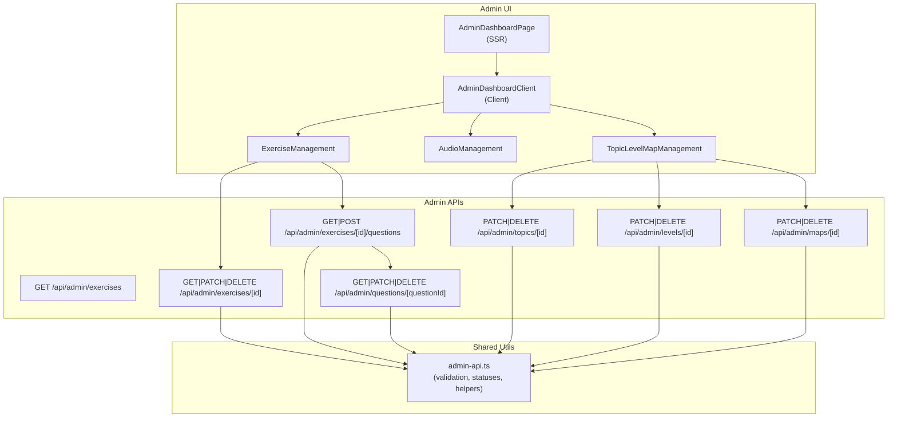
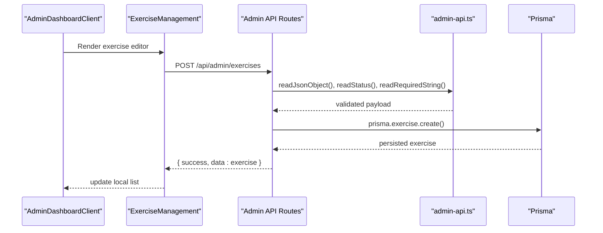
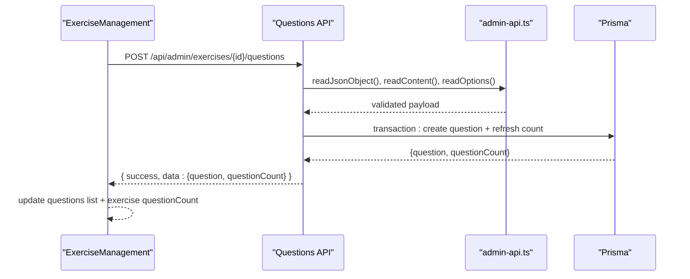
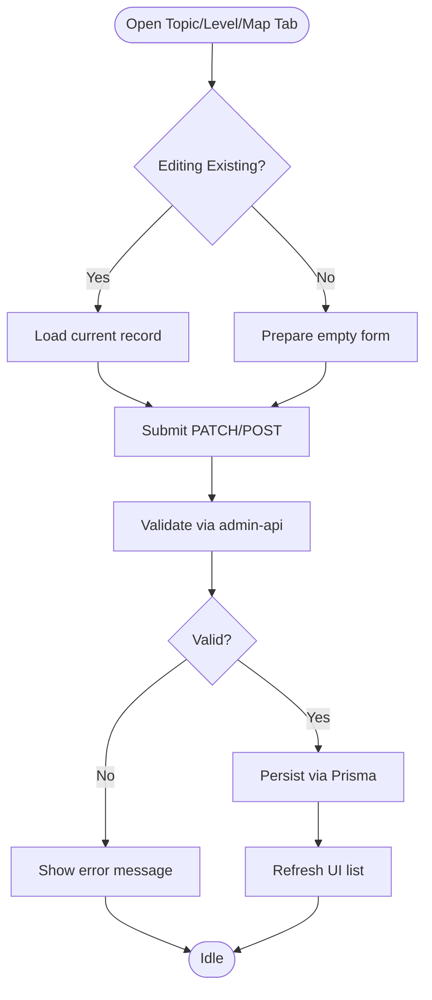
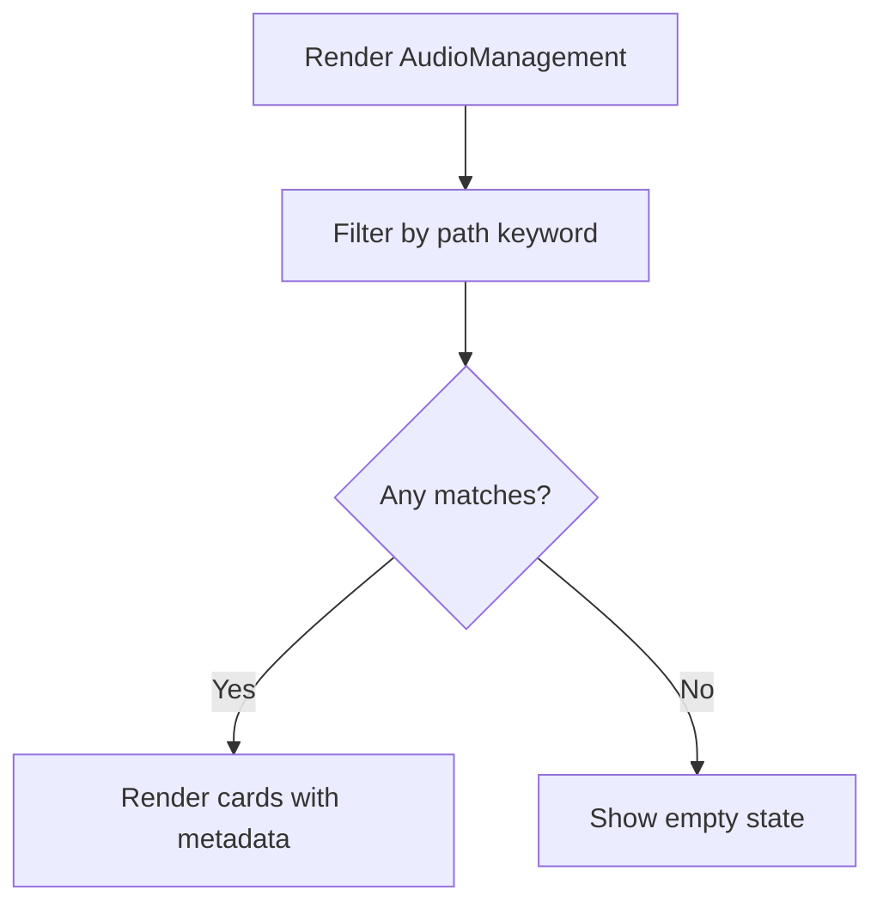
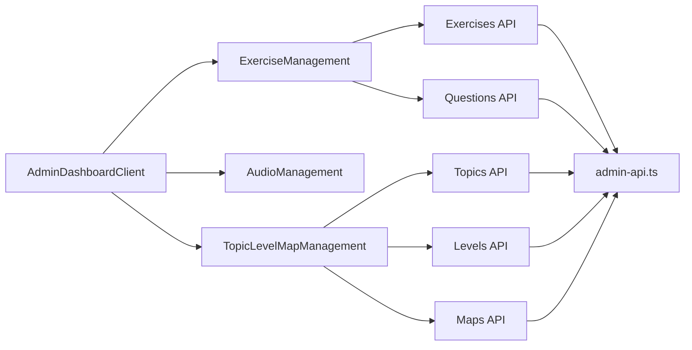

# Content Administration Tools

<cite>
**Referenced Files in This Document**
- [AdminDashboardPage](file://english_pronunciation_app/frontend/src/app/admin/page.tsx)
- [AdminDashboardClient](file://english_pronunciation_app/frontend/src/components/admin/AdminDashboardClient.tsx)
- [ExerciseManagement](file://english_pronunciation_app/frontend/src/components/admin/ExerciseManagement.tsx)
- [AudioManagement](file://english_pronunciation_app/frontend/src/components/admin/AudioManagement.tsx)
- [TopicLevelMapManagement](file://english_pronunciation_app/frontend/src/components/admin/TopicLevelMapManagement.tsx)
- [Exercises API GET](file://english_pronunciation_app/frontend/src/app/api/admin/exercises/route.ts)
- [Exercise API GET/PATCH/DELETE](file://english_pronunciation_app/frontend/src/app/api/admin/exercises/[id]/route.ts)
- [Questions API GET/POST](file://english_pronunciation_app/frontend/src/app/api/admin/exercises/[id]/questions/route.ts)
- [Question API GET/PATCH/DELETE](file://english_pronunciation_app/frontend/src/app/api/admin/questions/[questionId]/route.ts)
- [Topics API PATCH/DELETE](file://english_pronunciation_app/frontend/src/app/api/admin/topics/[id]/route.ts)
- [Levels API PATCH/DELETE](file://english_pronunciation_app/frontend/src/app/api/admin/levels/[id]/route.ts)
- [Maps API PATCH/DELETE](file://english_pronunciation_app/frontend/src/app/api/admin/maps/[id]/route.ts)
- [Admin Utilities](file://english_pronunciation_app/frontend/src/lib/admin-api.ts)
</cite>

## Table of Contents
1. [Introduction](#introduction)
2. [Project Structure](#project-structure)
3. [Core Components](#core-components)
4. [Architecture Overview](#architecture-overview)
5. [Detailed Component Analysis](#detailed-component-analysis)
6. [Dependency Analysis](#dependency-analysis)
7. [Performance Considerations](#performance-considerations)
8. [Troubleshooting Guide](#troubleshooting-guide)
9. [Conclusion](#conclusion)
10. [Appendices](#appendices)

## Introduction
This document describes the content administration tools for managing exercises, questions, topics, levels, learning maps, and audio assets. It covers the administrative UI, backend APIs, validation rules, status management, and workflows for content curation, approval, and publishing. It also outlines integration points with the exercise engine and media processing pipeline.

## Project Structure
The admin experience is split into:
- Server-side dashboard rendering and data preloading
- Client-side admin UI with tabbed navigation
- REST-like API routes under /api/admin for CRUD operations
- Shared admin utilities for validation, status enums, and DB helpers

**Diagram sources**
- [AdminDashboardPage:1-249](file://english_pronunciation_app/frontend/src/app/admin/page.tsx#L1-L249)
- [AdminDashboardClient:1-197](file://english_pronunciation_app/frontend/src/components/admin/AdminDashboardClient.tsx#L1-L197)
- [ExerciseManagement:1-886](file://english_pronunciation_app/frontend/src/components/admin/ExerciseManagement.tsx#L1-L886)
- [AudioManagement:1-85](file://english_pronunciation_app/frontend/src/components/admin/AudioManagement.tsx#L1-L85)
- [TopicLevelMapManagement:1-433](file://english_pronunciation_app/frontend/src/components/admin/TopicLevelMapManagement.tsx#L1-L433)
- [Exercises API GET:1-124](file://english_pronunciation_app/frontend/src/app/api/admin/exercises/route.ts#L1-L124)
- [Exercise API GET/PATCH/DELETE:1-212](file://english_pronunciation_app/frontend/src/app/api/admin/exercises/[id]/route.ts#L1-L212)
- [Questions API GET/POST:1-209](file://english_pronunciation_app/frontend/src/app/api/admin/exercises/[id]/questions/route.ts#L1-L209)
- [Question API GET/PATCH/DELETE:1-287](file://english_pronunciation_app/frontend/src/app/api/admin/questions/[questionId]/route.ts#L1-L287)
- [Topics API PATCH/DELETE:1-106](file://english_pronunciation_app/frontend/src/app/api/admin/topics/[id]/route.ts#L1-L106)
- [Levels API PATCH/DELETE:1-106](file://english_pronunciation_app/frontend/src/app/api/admin/levels/[id]/route.ts#L1-L106)
- [Maps API PATCH/DELETE:1-109](file://english_pronunciation_app/frontend/src/app/api/admin/maps/[id]/route.ts#L1-L109)
- [Admin Utilities:1-137](file://english_pronunciation_app/frontend/src/lib/admin-api.ts#L1-L137)

**Section sources**
- [AdminDashboardPage:1-249](file://english_pronunciation_app/frontend/src/app/admin/page.tsx#L1-L249)
- [AdminDashboardClient:1-197](file://english_pronunciation_app/frontend/src/components/admin/AdminDashboardClient.tsx#L1-L197)

## Core Components
- AdminDashboardPage: Server-rendered dashboard that preloads statistics and lists for users, exercises, audio files, topics, levels, learning maps, and question types. Passes data to AdminDashboardClient.
- AdminDashboardClient: Client-side tabbed UI hosting:
  - ExerciseManagement: CRUD for exercises and questions, filtering, and batch-like question operations
  - AudioManagement: Searchable grid of audio assets with metadata
  - TopicLevelMapManagement: CRUD for topics, levels, and learning maps with status controls
  - ReportsAnalytics: Placeholder for analytics panel
- Admin APIs: Strongly typed REST-like endpoints enforcing validation and status transitions
- Admin Utilities: Centralized validation helpers, status enumerations, and DB helpers (e.g., question count refresh)

**Section sources**
- [AdminDashboardPage:1-249](file://english_pronunciation_app/frontend/src/app/admin/page.tsx#L1-L249)
- [AdminDashboardClient:1-197](file://english_pronunciation_app/frontend/src/components/admin/AdminDashboardClient.tsx#L1-L197)
- [ExerciseManagement:1-886](file://english_pronunciation_app/frontend/src/components/admin/ExerciseManagement.tsx#L1-L886)
- [AudioManagement:1-85](file://english_pronunciation_app/frontend/src/components/admin/AudioManagement.tsx#L1-L85)
- [TopicLevelMapManagement:1-433](file://english_pronunciation_app/frontend/src/components/admin/TopicLevelMapManagement.tsx#L1-L433)
- [Admin Utilities:1-137](file://english_pronunciation_app/frontend/src/lib/admin-api.ts#L1-L137)

## Architecture Overview
The admin architecture follows a clear separation of concerns:
- UI: React components with client-side state and controlled forms
- Data fetching: Client components call /api/admin endpoints
- Validation: Shared admin-api utilities enforce payload shape and constraints
- Persistence: Prisma-backed routes handle transactions and cascading updates
- Status management: Centralized enums define allowed transitions

**Diagram sources**
- [AdminDashboardClient:1-197](file://english_pronunciation_app/frontend/src/components/admin/AdminDashboardClient.tsx#L1-L197)
- [ExerciseManagement:1-886](file://english_pronunciation_app/frontend/src/components/admin/ExerciseManagement.tsx#L1-L886)
- [Exercises API GET:1-124](file://english_pronunciation_app/frontend/src/app/api/admin/exercises/route.ts#L1-L124)
- [Admin Utilities:1-137](file://english_pronunciation_app/frontend/src/lib/admin-api.ts#L1-L137)

## Detailed Component Analysis

### Exercise Management Interface
ExerciseManagement provides:
- Exercise CRUD: Create, update, delete (archive) exercises with topic, level, learning map, status, and time limit
- Question CRUD: Create, update, delete (archive) questions per exercise; supports options parsing and validation
- Filtering and quick actions: Filter by status, load questions for an exercise, and inline editing
- Validation and feedback: Inline messages and loading states

**Diagram sources**
- [ExerciseManagement:1-886](file://english_pronunciation_app/frontend/src/components/admin/ExerciseManagement.tsx#L1-L886)
- [Questions API GET/POST:1-209](file://english_pronunciation_app/frontend/src/app/api/admin/exercises/[id]/questions/route.ts#L1-L209)
- [Admin Utilities:1-137](file://english_pronunciation_app/frontend/src/lib/admin-api.ts#L1-L137)

**Section sources**
- [ExerciseManagement:1-886](file://english_pronunciation_app/frontend/src/components/admin/ExerciseManagement.tsx#L1-L886)
- [Questions API GET/POST:1-209](file://english_pronunciation_app/frontend/src/app/api/admin/exercises/[id]/questions/route.ts#L1-L209)
- [Question API GET/PATCH/DELETE:1-287](file://english_pronunciation_app/frontend/src/app/api/admin/questions/[questionId]/route.ts#L1-L287)

### Topic, Level, and Learning Map Management
TopicLevelMapManagement supports:
- Unified CRUD for topics, levels, and learning maps
- Status-aware operations: delete for topics/levels, archive for maps
- Bulk-friendly editing with shared form logic and endpoints

**Diagram sources**
- [TopicLevelMapManagement:1-433](file://english_pronunciation_app/frontend/src/components/admin/TopicLevelMapManagement.tsx#L1-L433)
- [Topics API PATCH/DELETE:1-106](file://english_pronunciation_app/frontend/src/app/api/admin/topics/[id]/route.ts#L1-L106)
- [Levels API PATCH/DELETE:1-106](file://english_pronunciation_app/frontend/src/app/api/admin/levels/[id]/route.ts#L1-L106)
- [Maps API PATCH/DELETE:1-109](file://english_pronunciation_app/frontend/src/app/api/admin/maps/[id]/route.ts#L1-L109)
- [Admin Utilities:1-137](file://english_pronunciation_app/frontend/src/lib/admin-api.ts#L1-L137)

**Section sources**
- [TopicLevelMapManagement:1-433](file://english_pronunciation_app/frontend/src/components/admin/TopicLevelMapManagement.tsx#L1-L433)
- [Topics API PATCH/DELETE:1-106](file://english_pronunciation_app/frontend/src/app/api/admin/topics/[id]/route.ts#L1-L106)
- [Levels API PATCH/DELETE:1-106](file://english_pronunciation_app/frontend/src/app/api/admin/levels/[id]/route.ts#L1-L106)
- [Maps API PATCH/DELETE:1-109](file://english_pronunciation_app/frontend/src/app/api/admin/maps/[id]/route.ts#L1-L109)

### Audio File Management Interface
AudioManagement provides:
- Searchable grid of audio assets
- Metadata display: duration, play limit, and usage count
- Lightweight client-side filtering

**Diagram sources**
- [AudioManagement:1-85](file://english_pronunciation_app/frontend/src/components/admin/AudioManagement.tsx#L1-L85)

**Section sources**
- [AudioManagement:1-85](file://english_pronunciation_app/frontend/src/components/admin/AudioManagement.tsx#L1-L85)

### Status Management and Publishing Workflows
Statuses are centrally defined and enforced:
- Exercise statuses: ACTIVE, LOCKED, DRAFT, ARCHIVED
- Question statuses: ACTIVE, DRAFT, NEEDS_REVIEW, ARCHIVED
- Learning map statuses: ACTIVE, LOCKED, DRAFT, ARCHIVED

Workflows:
- Exercises start as DRAFT until ready; promote to ACTIVE after QA
- Questions can be marked NEEDS_REVIEW during curation
- Maps support LOCKED for maintenance and ARCHIVED for deprecation
- Archive/delete semantics differ by entity to preserve referential integrity

**Section sources**
- [Admin Utilities:1-137](file://english_pronunciation_app/frontend/src/lib/admin-api.ts#L1-L137)
- [Exercise API GET/PATCH/DELETE:1-212](file://english_pronunciation_app/frontend/src/app/api/admin/exercises/[id]/route.ts#L1-L212)
- [Question API GET/PATCH/DELETE:1-287](file://english_pronunciation_app/frontend/src/app/api/admin/questions/[questionId]/route.ts#L1-L287)
- [Maps API PATCH/DELETE:1-109](file://english_pronunciation_app/frontend/src/app/api/admin/maps/[id]/route.ts#L1-L109)

### Content Validation Processes
Validation is centralized in admin-api.ts:
- Type-safe payload parsing
- Length and range checks
- Enum enforcement for statuses
- Options deduplication and cardinality checks for questions
- Transactional updates to maintain consistency (e.g., question counts)

**Section sources**
- [Admin Utilities:1-137](file://english_pronunciation_app/frontend/src/lib/admin-api.ts#L1-L137)
- [Questions API GET/POST:1-209](file://english_pronunciation_app/frontend/src/app/api/admin/exercises/[id]/questions/route.ts#L1-L209)
- [Question API GET/PATCH/DELETE:1-287](file://english_pronunciation_app/frontend/src/app/api/admin/questions/[questionId]/route.ts#L1-L287)

### Integration with Exercise Engines and Media Pipelines
- Exercise engine: Exercises and questions are modeled to feed the client-side exercise engine; status gating prevents learners from seeing unapproved content
- Media pipeline: AudioManagement surfaces audio assets; the UI displays metadata useful for downstream processing (duration, play limits); integration with CDN is supported by storing canonical paths

**Section sources**
- [AdminDashboardPage:1-249](file://english_pronunciation_app/frontend/src/app/admin/page.tsx#L1-L249)
- [AudioManagement:1-85](file://english_pronunciation_app/frontend/src/components/admin/AudioManagement.tsx#L1-L85)

## Dependency Analysis
Key dependencies and coupling:
- UI components depend on admin-api.ts for validation and status enums
- API routes depend on Prisma for persistence and transactions
- ExerciseManagement depends on Question API for question operations
- TopicLevelMapManagement depends on Topics/Levels/Maps APIs for base data management

**Diagram sources**
- [AdminDashboardClient:1-197](file://english_pronunciation_app/frontend/src/components/admin/AdminDashboardClient.tsx#L1-L197)
- [ExerciseManagement:1-886](file://english_pronunciation_app/frontend/src/components/admin/ExerciseManagement.tsx#L1-L886)
- [AudioManagement:1-85](file://english_pronunciation_app/frontend/src/components/admin/AudioManagement.tsx#L1-L85)
- [TopicLevelMapManagement:1-433](file://english_pronunciation_app/frontend/src/components/admin/TopicLevelMapManagement.tsx#L1-L433)
- [Exercises API GET:1-124](file://english_pronunciation_app/frontend/src/app/api/admin/exercises/route.ts#L1-L124)
- [Questions API GET/POST:1-209](file://english_pronunciation_app/frontend/src/app/api/admin/exercises/[id]/questions/route.ts#L1-L209)
- [Topics API PATCH/DELETE:1-106](file://english_pronunciation_app/frontend/src/app/api/admin/topics/[id]/route.ts#L1-L106)
- [Levels API PATCH/DELETE:1-106](file://english_pronunciation_app/frontend/src/app/api/admin/levels/[id]/route.ts#L1-L106)
- [Maps API PATCH/DELETE:1-109](file://english_pronunciation_app/frontend/src/app/api/admin/maps/[id]/route.ts#L1-L109)
- [Admin Utilities:1-137](file://english_pronunciation_app/frontend/src/lib/admin-api.ts#L1-L137)

**Section sources**
- [AdminDashboardClient:1-197](file://english_pronunciation_app/frontend/src/components/admin/AdminDashboardClient.tsx#L1-L197)
- [Admin Utilities:1-137](file://english_pronunciation_app/frontend/src/lib/admin-api.ts#L1-L137)

## Performance Considerations
- Server-side preloading: AdminDashboardPage uses concurrent queries to minimize client wait times
- Client-side filtering: AudioManagement performs lightweight client-side filtering; consider server-side pagination for very large datasets
- Transactions: Question creation/update uses transactions to keep data consistent; avoid excessive writes in rapid succession
- Status refresh: refreshExerciseQuestionCount ensures accurate counts; cache or debounce frequent updates

## Troubleshooting Guide
Common issues and resolutions:
- Authentication errors: requireAdminSession enforces admin role; ensure session is present and role is Admin
- Validation failures: readRequiredString/readOptionalInt/readStatus return null on invalid input; check payload shapes and lengths
- Reference not found: Creating/updating exercises requires valid topic/level/map IDs; verify base data exists
- In-use constraints: Deleting topics/levels fails if still referenced by exercises or sound groups; archive or reassign first
- Question options mismatch: Answer must match one of the options; ensure normalization and deduplication

**Section sources**
- [Admin Utilities:1-137](file://english_pronunciation_app/frontend/src/lib/admin-api.ts#L1-L137)
- [Exercise API GET/PATCH/DELETE:1-212](file://english_pronunciation_app/frontend/src/app/api/admin/exercises/[id]/route.ts#L1-L212)
- [Questions API GET/POST:1-209](file://english_pronunciation_app/frontend/src/app/api/admin/exercises/[id]/questions/route.ts#L1-L209)
- [Question API GET/PATCH/DELETE:1-287](file://english_pronunciation_app/frontend/src/app/api/admin/questions/[questionId]/route.ts#L1-L287)
- [Topics API PATCH/DELETE:1-106](file://english_pronunciation_app/frontend/src/app/api/admin/topics/[id]/route.ts#L1-L106)
- [Levels API PATCH/DELETE:1-106](file://english_pronunciation_app/frontend/src/app/api/admin/levels/[id]/route.ts#L1-L106)

## Conclusion
The content administration tools provide a cohesive, validated, and status-aware system for curating exercises, questions, topics, levels, and learning maps, alongside audio asset oversight. The modular UI and robust backend APIs enable efficient content workflows, quality assurance, and safe publishing practices.

## Appendices

### API Definitions

- Exercises
  - GET /api/admin/exercises
  - POST /api/admin/exercises
  - GET /api/admin/exercises/[id]
  - PATCH /api/admin/exercises/[id]
  - DELETE /api/admin/exercises/[id]

- Questions
  - GET /api/admin/exercises/[id]/questions
  - POST /api/admin/exercises/[id]/questions
  - GET /api/admin/questions/[questionId]
  - PATCH /api/admin/questions/[questionId]
  - DELETE /api/admin/questions/[questionId]

- Base Entities
  - PATCH|DELETE /api/admin/topics/[id]
  - PATCH|DELETE /api/admin/levels/[id]
  - PATCH|DELETE /api/admin/maps/[id]

**Section sources**
- [Exercises API GET:1-124](file://english_pronunciation_app/frontend/src/app/api/admin/exercises/route.ts#L1-L124)
- [Exercise API GET/PATCH/DELETE:1-212](file://english_pronunciation_app/frontend/src/app/api/admin/exercises/[id]/route.ts#L1-L212)
- [Questions API GET/POST:1-209](file://english_pronunciation_app/frontend/src/app/api/admin/exercises/[id]/questions/route.ts#L1-L209)
- [Question API GET/PATCH/DELETE:1-287](file://english_pronunciation_app/frontend/src/app/api/admin/questions/[questionId]/route.ts#L1-L287)
- [Topics API PATCH/DELETE:1-106](file://english_pronunciation_app/frontend/src/app/api/admin/topics/[id]/route.ts#L1-L106)
- [Levels API PATCH/DELETE:1-106](file://english_pronunciation_app/frontend/src/app/api/admin/levels/[id]/route.ts#L1-L106)
- [Maps API PATCH/DELETE:1-109](file://english_pronunciation_app/frontend/src/app/api/admin/maps/[id]/route.ts#L1-L109)