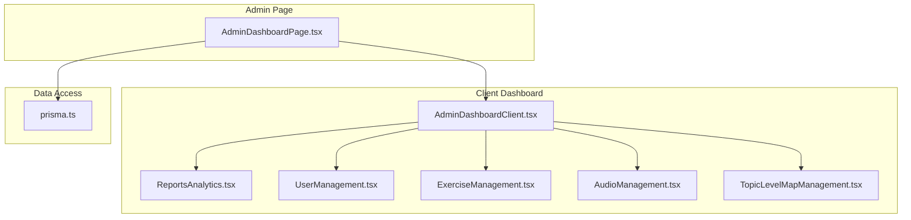
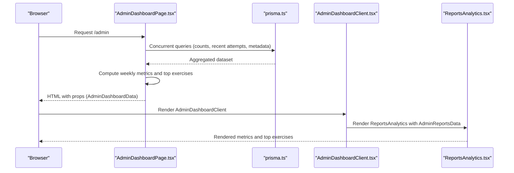
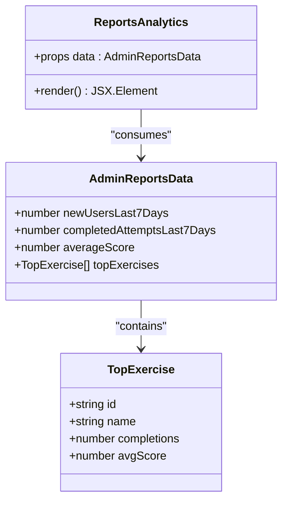
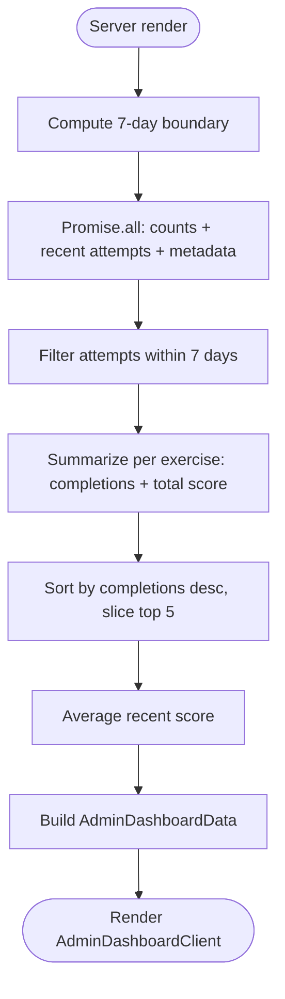
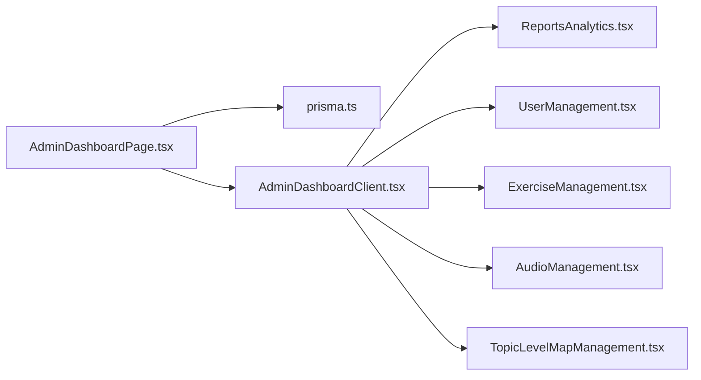

# Reports and Insights

<cite>
**Referenced Files in This Document**
- [ReportsAnalytics.tsx](file://english_pronunciation_app/frontend/src/components/admin/ReportsAnalytics.tsx)
- [AdminDashboardClient.tsx](file://english_pronunciation_app/frontend/src/components/admin/AdminDashboardClient.tsx)
- [AdminDashboardPage.tsx](file://english_pronunciation_app/frontend/src/app/admin/page.tsx)
- [prisma.ts](file://english_pronunciation_app/frontend/src/lib/prisma.ts)
- [UserManagement.tsx](file://english_pronunciation_app/frontend/src/components/admin/UserManagement.tsx)
- [ExerciseManagement.tsx](file://english_pronunciation_app/frontend/src/components/admin/ExerciseManagement.tsx)
- [AudioManagement.tsx](file://english_pronunciation_app/frontend/src/components/admin/AudioManagement.tsx)
- [TopicLevelMapManagement.tsx](file://english_pronunciation_app/frontend/src/components/admin/TopicLevelMapManagement.tsx)
</cite>

## Table of Contents
1. [Introduction](#introduction)
2. [Project Structure](#project-structure)
3. [Core Components](#core-components)
4. [Architecture Overview](#architecture-overview)
5. [Detailed Component Analysis](#detailed-component-analysis)
6. [Dependency Analysis](#dependency-analysis)
7. [Performance Considerations](#performance-considerations)
8. [Troubleshooting Guide](#troubleshooting-guide)
9. [Conclusion](#conclusion)
10. [Appendices](#appendices)

## Introduction
This document describes the reporting and insights generation capabilities within the admin system. It focuses on the analytics dashboard components, data visualization surfaces, and reporting interfaces. It documents exercise completion analytics, user progress tracking, and performance metrics exposed via the admin dashboard. It also explains data aggregation patterns, time-series analysis, and trend identification features, along with implementation details for report generation, export capabilities, and custom reporting filters. Real-time data updates, caching strategies, and performance optimization for large datasets are addressed, as well as integration with external analytics platforms and supported data export formats.

## Project Structure
The admin reporting surface is implemented as a client-side dashboard that renders aggregated statistics and lists derived from server-side queries. The admin page orchestrates data fetching and computation, while dedicated client components render cards, lists, and analytics.

**Diagram sources**
- [AdminDashboardPage.tsx:1-249](file://english_pronunciation_app/frontend/src/app/admin/page.tsx#L1-L249)
- [AdminDashboardClient.tsx:1-197](file://english_pronunciation_app/frontend/src/components/admin/AdminDashboardClient.tsx#L1-L197)
- [ReportsAnalytics.tsx:1-71](file://english_pronunciation_app/frontend/src/components/admin/ReportsAnalytics.tsx#L1-L71)
- [UserManagement.tsx:1-100](file://english_pronunciation_app/frontend/src/components/admin/UserManagement.tsx#L1-L100)
- [ExerciseManagement.tsx:1-886](file://english_pronunciation_app/frontend/src/components/admin/ExerciseManagement.tsx#L1-L886)
- [AudioManagement.tsx:1-85](file://english_pronunciation_app/frontend/src/components/admin/AudioManagement.tsx#L1-L85)
- [TopicLevelMapManagement.tsx:1-433](file://english_pronunciation_app/frontend/src/components/admin/TopicLevelMapManagement.tsx#L1-L433)
- [prisma.ts:1-13](file://english_pronunciation_app/frontend/src/lib/prisma.ts#L1-L13)

**Section sources**
- [AdminDashboardPage.tsx:1-249](file://english_pronunciation_app/frontend/src/app/admin/page.tsx#L1-L249)
- [AdminDashboardClient.tsx:1-197](file://english_pronunciation_app/frontend/src/components/admin/AdminDashboardClient.tsx#L1-L197)
- [ReportsAnalytics.tsx:1-71](file://english_pronunciation_app/frontend/src/components/admin/ReportsAnalytics.tsx#L1-L71)
- [prisma.ts:1-13](file://english_pronunciation_app/frontend/src/lib/prisma.ts#L1-L13)

## Core Components
- AdminDashboardPage: Orchestrates server-side data fetching, computes weekly aggregates, and passes typed data to the client dashboard.
- AdminDashboardClient: Renders the admin UI with tabs, including a “Reports” tab that displays analytics.
- ReportsAnalytics: Presents high-level metrics and top exercises for the last 7 days.
- Supporting management panels: UserManagement, ExerciseManagement, AudioManagement, TopicLevelMapManagement provide complementary operational insights.

Key data flows:
- AdminDashboardPage executes multiple Prisma queries concurrently, computes weekly counts and averages, and builds a typed AdminDashboardData object.
- AdminDashboardClient receives AdminDashboardData and renders ReportsAnalytics with AdminReportsData.
- ReportsAnalytics consumes AdminReportsData to show new users, completed attempts, average scores, and top exercises.

**Section sources**
- [AdminDashboardPage.tsx:10-245](file://english_pronunciation_app/frontend/src/app/admin/page.tsx#L10-L245)
- [AdminDashboardClient.tsx:17-41](file://english_pronunciation_app/frontend/src/components/admin/AdminDashboardClient.tsx#L17-L41)
- [ReportsAnalytics.tsx:3-13](file://english_pronunciation_app/frontend/src/components/admin/ReportsAnalytics.tsx#L3-L13)

## Architecture Overview
The admin analytics pipeline follows a server-rendered data-fetching model with client-side rendering for dashboards and management views.

**Diagram sources**
- [AdminDashboardPage.tsx:6-245](file://english_pronunciation_app/frontend/src/app/admin/page.tsx#L6-L245)
- [prisma.ts:1-13](file://english_pronunciation_app/frontend/src/lib/prisma.ts#L1-L13)
- [AdminDashboardClient.tsx:70-178](file://english_pronunciation_app/frontend/src/components/admin/AdminDashboardClient.tsx#L70-L178)
- [ReportsAnalytics.tsx:15-71](file://english_pronunciation_app/frontend/src/components/admin/ReportsAnalytics.tsx#L15-L71)

## Detailed Component Analysis

### ReportsAnalytics Component
Purpose:
- Display high-level weekly metrics and popular exercises.
- Present a compact, accessible card-based layout with semantic labels.

Data model:
- AdminReportsData includes:
  - newUsersLast7Days: number
  - completedAttemptsLast7Days: number
  - averageScore: number
  - topExercises: array of { id, name, completions, avgScore }

Rendering behavior:
- Three metric cards for new users, completed attempts, and average score.
- A list of top exercises ranked by completions, showing average scores.

Accessibility:
- Uses definition list semantics for metric presentation.
- Localized labels and percentages for readability.

**Diagram sources**
- [ReportsAnalytics.tsx:3-13](file://english_pronunciation_app/frontend/src/components/admin/ReportsAnalytics.tsx#L3-L13)

**Section sources**
- [ReportsAnalytics.tsx:1-71](file://english_pronunciation_app/frontend/src/components/admin/ReportsAnalytics.tsx#L1-L71)

### AdminDashboardPage: Data Aggregation and Computation
Responsibilities:
- Fetches counts and recent activity using Prisma.
- Computes weekly metrics:
  - New users in the last 7 days.
  - Completed attempts in the last 7 days.
  - Average score across recent attempts.
  - Top exercises by completion count with average scores.

Concurrency:
- Uses Promise.all to parallelize multiple Prisma queries for performance.

Data shaping:
- Transforms Prisma results into AdminDashboardData with nested typed sections (stats, users, exercises, topics, levels, maps, audioFiles, reports).

**Diagram sources**
- [AdminDashboardPage.tsx:7-245](file://english_pronunciation_app/frontend/src/app/admin/page.tsx#L7-L245)

**Section sources**
- [AdminDashboardPage.tsx:10-245](file://english_pronunciation_app/frontend/src/app/admin/page.tsx#L10-L245)

### AdminDashboardClient: Navigation and Panels
Responsibilities:
- Provides tabbed navigation for overview, users, exercises, topics, audio, badges, and reports.
- Renders ReportsAnalytics under the “Reports” tab.
- Exposes quick actions from the overview panel.

Integration:
- Receives AdminDashboardData and passes AdminReportsData to ReportsAnalytics.

**Section sources**
- [AdminDashboardClient.tsx:48-178](file://english_pronunciation_app/frontend/src/components/admin/AdminDashboardClient.tsx#L48-L178)

### Supporting Management Panels
While not part of the analytics dashboard, these panels complement reporting by exposing operational data:

- UserManagement: Lists users with filtering and status badges.
- ExerciseManagement: Manages exercises and questions; exposes counts and statuses.
- AudioManagement: Displays audio files with usage counts.
- TopicLevelMapManagement: Manages foundational taxonomy used to categorize content.

These panels rely on client-side filtering and state, and integrate with admin APIs for CRUD operations.

**Section sources**
- [UserManagement.tsx:1-100](file://english_pronunciation_app/frontend/src/components/admin/UserManagement.tsx#L1-L100)
- [ExerciseManagement.tsx:1-886](file://english_pronunciation_app/frontend/src/components/admin/ExerciseManagement.tsx#L1-L886)
- [AudioManagement.tsx:1-85](file://english_pronunciation_app/frontend/src/components/admin/AudioManagement.tsx#L1-L85)
- [TopicLevelMapManagement.tsx:1-433](file://english_pronunciation_app/frontend/src/components/admin/TopicLevelMapManagement.tsx#L1-L433)

## Dependency Analysis
- AdminDashboardPage depends on Prisma for data access and computes analytics server-side.
- AdminDashboardClient composes child components and routes tab content.
- ReportsAnalytics is a pure presentational component consuming typed props.

**Diagram sources**
- [AdminDashboardPage.tsx:1-249](file://english_pronunciation_app/frontend/src/app/admin/page.tsx#L1-L249)
- [AdminDashboardClient.tsx:1-197](file://english_pronunciation_app/frontend/src/components/admin/AdminDashboardClient.tsx#L1-L197)
- [ReportsAnalytics.tsx:1-71](file://english_pronunciation_app/frontend/src/components/admin/ReportsAnalytics.tsx#L1-L71)
- [prisma.ts:1-13](file://english_pronunciation_app/frontend/src/lib/prisma.ts#L1-L13)

**Section sources**
- [AdminDashboardPage.tsx:1-249](file://english_pronunciation_app/frontend/src/app/admin/page.tsx#L1-L249)
- [AdminDashboardClient.tsx:1-197](file://english_pronunciation_app/frontend/src/components/admin/AdminDashboardClient.tsx#L1-L197)
- [ReportsAnalytics.tsx:1-71](file://english_pronunciation_app/frontend/src/components/admin/ReportsAnalytics.tsx#L1-L71)
- [prisma.ts:1-13](file://english_pronunciation_app/frontend/src/lib/prisma.ts#L1-L13)

## Performance Considerations
- Concurrency: AdminDashboardPage uses Promise.all to parallelize database queries, reducing total render latency.
- Aggregation: Weekly metrics are computed server-side to minimize client work and avoid large in-memory transformations.
- Pagination and limits: The admin page retrieves capped lists (e.g., recent users, exercises) to keep payloads manageable.
- Client-side filtering: Management panels (UserManagement, ExerciseManagement, AudioManagement) apply lightweight client-side filtering to reduce network requests.
- Caching: No explicit caching layer is implemented in the current code. For production, consider:
  - Edge caching for read-heavy admin dashboards.
  - Database-level materialized summaries for frequent aggregations.
  - Client-side cache invalidation on admin actions.

[No sources needed since this section provides general guidance]

## Troubleshooting Guide
Common issues and resolutions:
- Empty or stale analytics:
  - Verify Prisma queries execute and recent attempts exist within the 7-day window.
  - Confirm AdminDashboardPage’s date boundary calculation and time zone assumptions.
- Missing top exercises:
  - Ensure recent attempts exist and exercise relations are populated.
  - Check that exerciseAttempt records have valid scores and timestamps.
- Rendering anomalies:
  - Confirm AdminReportsData prop shape matches the component’s expectations.
  - Validate localized labels and percentage formatting.

**Section sources**
- [AdminDashboardPage.tsx:7-245](file://english_pronunciation_app/frontend/src/app/admin/page.tsx#L7-L245)
- [ReportsAnalytics.tsx:15-71](file://english_pronunciation_app/frontend/src/components/admin/ReportsAnalytics.tsx#L15-L71)

## Conclusion
The admin reporting and insights system centers on a concise, server-rendered dashboard that aggregates recent activity into digestible metrics and top-performing content. ReportsAnalytics presents weekly new users, completed attempts, average scores, and top exercises. Supporting management panels provide operational context. While the current implementation emphasizes simplicity and clarity, future enhancements can introduce caching, export capabilities, and richer visualizations to support deeper analytical workflows.

[No sources needed since this section summarizes without analyzing specific files]

## Appendices

### Data Model Reference
AdminDashboardData (server-to-client contract):
- stats: totals and weekly metrics
- users: paginated user list with roles and statuses
- exercises: exercise catalog with counts and relations
- topics/levels/maps: taxonomy metadata
- audioFiles: media inventory
- reports: AdminReportsData for analytics

AdminReportsData (analytics payload):
- newUsersLast7Days: number
- completedAttemptsLast7Days: number
- averageScore: number
- topExercises: array of { id, name, completions, avgScore }

**Section sources**
- [AdminDashboardClient.tsx:17-41](file://english_pronunciation_app/frontend/src/components/admin/AdminDashboardClient.tsx#L17-L41)
- [ReportsAnalytics.tsx:3-13](file://english_pronunciation_app/frontend/src/components/admin/ReportsAnalytics.tsx#L3-L13)

### Implementation Notes
- Data visualization libraries: Not currently used; metrics are presented via semantic cards and lists.
- Export capabilities: Not implemented; could be added via client-side CSV generation or server-side exports.
- Custom reporting filters: Not implemented; could extend AdminDashboardPage to accept date ranges and filters, then recompute aggregates.
- Real-time updates: Not implemented; could leverage polling or WebSocket updates to refresh metrics.
- External analytics integration: Not implemented; could be layered on top of existing metrics for cohort or funnel analysis.

[No sources needed since this section provides general guidance]