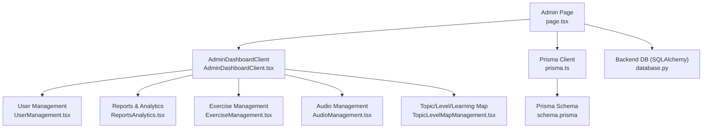
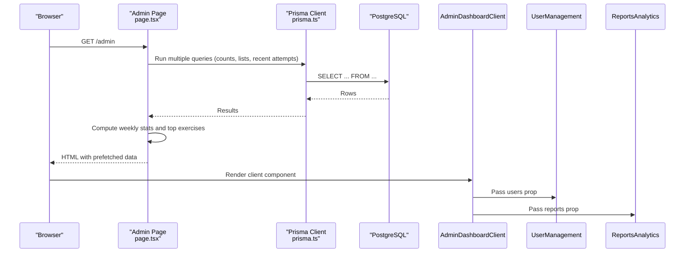
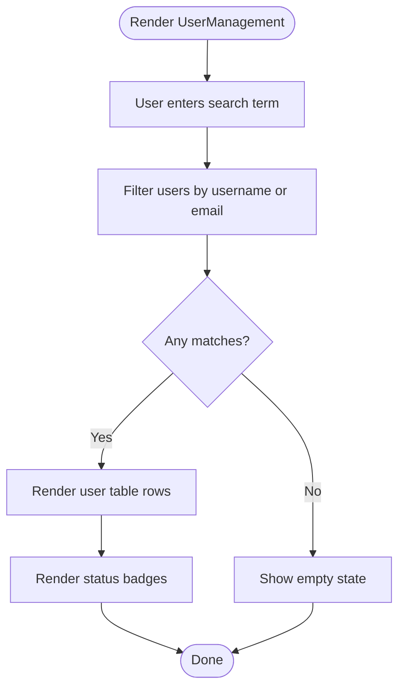
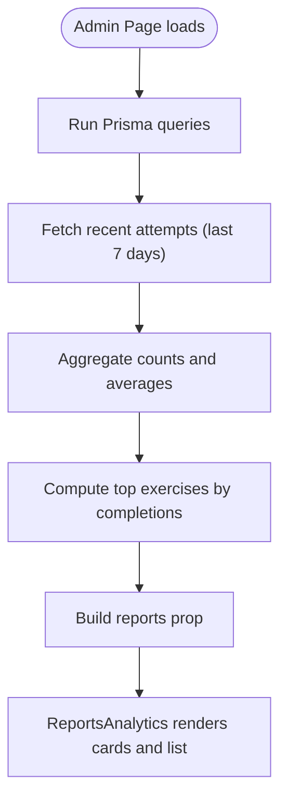
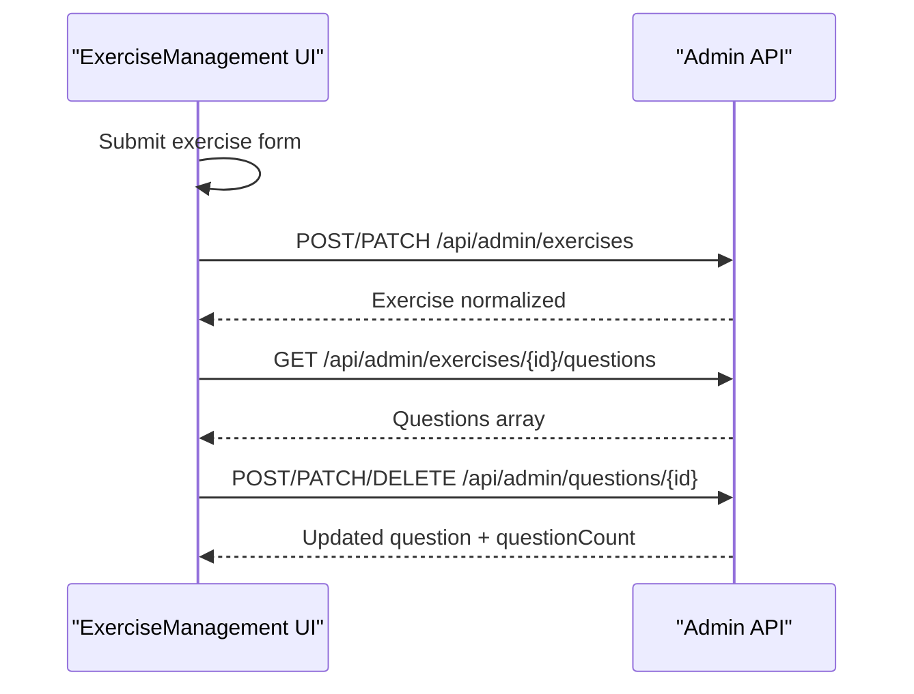
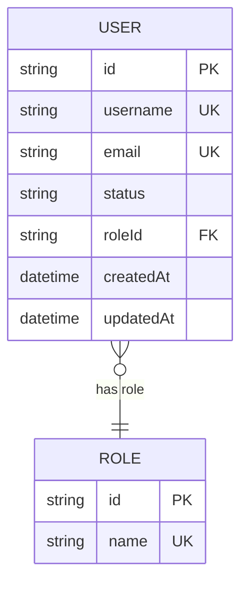
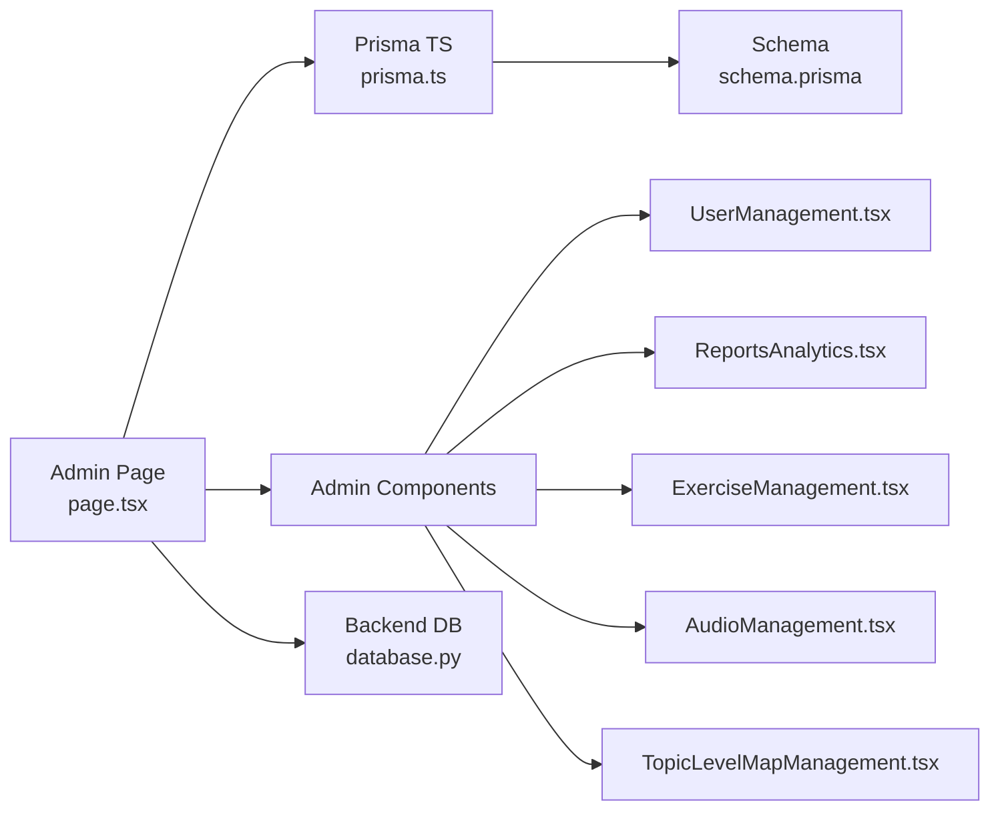

# User Management and Analytics

<cite>
**Referenced Files in This Document**
- [UserManagement.tsx](file://english_pronunciation_app/frontend/src/components/admin/UserManagement.tsx)
- [AdminDashboardClient.tsx](file://english_pronunciation_app/frontend/src/components/admin/AdminDashboardClient.tsx)
- [ReportsAnalytics.tsx](file://english_pronunciation_app/frontend/src/components/admin/ReportsAnalytics.tsx)
- [page.tsx](file://english_pronunciation_app/frontend/src/app/admin/page.tsx)
- [prisma.ts](file://english_pronunciation_app/frontend/src/lib/prisma.ts)
- [schema.prisma](file://english_pronunciation_app/frontend/prisma/schema.prisma)
- [ExerciseManagement.tsx](file://english_pronunciation_app/frontend/src/components/admin/ExerciseManagement.tsx)
- [AudioManagement.tsx](file://english_pronunciation_app/frontend/src/components/admin/AudioManagement.tsx)
- [TopicLevelMapManagement.tsx](file://english_pronunciation_app/frontend/src/components/admin/TopicLevelMapManagement.tsx)
- [database.py](file://english_pronunciation_app/backend/app/core/database.py)
</cite>

## Table of Contents
1. [Introduction](#introduction)
2. [Project Structure](#project-structure)
3. [Core Components](#core-components)
4. [Architecture Overview](#architecture-overview)
5. [Detailed Component Analysis](#detailed-component-analysis)
6. [Dependency Analysis](#dependency-analysis)
7. [Performance Considerations](#performance-considerations)
8. [Troubleshooting Guide](#troubleshooting-guide)
9. [Conclusion](#conclusion)
10. [Appendices](#appendices)

## Introduction
This document explains the user management and analytics capabilities within the admin dashboard. It covers:
- User listing, filtering, sorting, and status management
- Analytics dashboard with user statistics, activity metrics, and performance indicators
- User data models, roles, and administrative actions
- Implementation details for user search, bulk operations, and profile management
- Data visualization components, chart integrations, and reporting features
- Integration with Prisma ORM for user data operations and real-time analytics updates

## Project Structure
The admin dashboard is implemented in the Next.js frontend under the app router. The admin page aggregates data from Prisma queries and renders modular admin components for users, exercises, audio, topic/level/map, and reports/analytics.

**Diagram sources**
- [page.tsx:1-249](file://english_pronunciation_app/frontend/src/app/admin/page.tsx#L1-L249)
- [AdminDashboardClient.tsx:1-197](file://english_pronunciation_app/frontend/src/components/admin/AdminDashboardClient.tsx#L1-L197)
- [UserManagement.tsx:1-100](file://english_pronunciation_app/frontend/src/components/admin/UserManagement.tsx#L1-L100)
- [ReportsAnalytics.tsx:1-71](file://english_pronunciation_app/frontend/src/components/admin/ReportsAnalytics.tsx#L1-L71)
- [ExerciseManagement.tsx:1-886](file://english_pronunciation_app/frontend/src/components/admin/ExerciseManagement.tsx#L1-L886)
- [AudioManagement.tsx:1-85](file://english_pronunciation_app/frontend/src/components/admin/AudioManagement.tsx#L1-L85)
- [TopicLevelMapManagement.tsx:1-433](file://english_pronunciation_app/frontend/src/components/admin/TopicLevelMapManagement.tsx#L1-L433)
- [prisma.ts:1-13](file://english_pronunciation_app/frontend/src/lib/prisma.ts#L1-L13)
- [schema.prisma:1-501](file://english_pronunciation_app/frontend/prisma/schema.prisma#L1-L501)
- [database.py:1-51](file://english_pronunciation_app/backend/app/core/database.py#L1-L51)

**Section sources**
- [page.tsx:1-249](file://english_pronunciation_app/frontend/src/app/admin/page.tsx#L1-L249)
- [AdminDashboardClient.tsx:1-197](file://english_pronunciation_app/frontend/src/components/admin/AdminDashboardClient.tsx#L1-L197)

## Core Components
- AdminDashboardClient: orchestrates tabs and renders the active panel (users, exercises, audio, reports).
- UserManagement: displays user table with search, status badges, and counts.
- ReportsAnalytics: shows aggregated stats and top exercises.
- ExerciseManagement: CRUD for exercises and questions; integrates with admin API endpoints.
- AudioManagement: lists audio files with metadata and search.
- TopicLevelMapManagement: manages base learning constructs (topics, levels, learning maps).
- Data source: Admin page performs Prisma queries and computes analytics.

**Section sources**
- [AdminDashboardClient.tsx:15-197](file://english_pronunciation_app/frontend/src/components/admin/AdminDashboardClient.tsx#L15-L197)
- [UserManagement.tsx:29-100](file://english_pronunciation_app/frontend/src/components/admin/UserManagement.tsx#L29-L100)
- [ReportsAnalytics.tsx:3-71](file://english_pronunciation_app/frontend/src/components/admin/ReportsAnalytics.tsx#L3-L71)
- [ExerciseManagement.tsx:235-886](file://english_pronunciation_app/frontend/src/components/admin/ExerciseManagement.tsx#L235-L886)
- [AudioManagement.tsx:18-85](file://english_pronunciation_app/frontend/src/components/admin/AudioManagement.tsx#L18-L85)
- [TopicLevelMapManagement.tsx:94-433](file://english_pronunciation_app/frontend/src/components/admin/TopicLevelMapManagement.tsx#L94-L433)
- [page.tsx:6-249](file://english_pronunciation_app/frontend/src/app/admin/page.tsx#L6-L249)

## Architecture Overview
The admin dashboard is a server-rendered page that preloads data via Prisma. It computes weekly metrics and passes typed props to client-side components. The components are modular and self-contained, enabling easy extension.

**Diagram sources**
- [page.tsx:6-249](file://english_pronunciation_app/frontend/src/app/admin/page.tsx#L6-L249)
- [prisma.ts:1-13](file://english_pronunciation_app/frontend/src/lib/prisma.ts#L1-L13)
- [schema.prisma:1-501](file://english_pronunciation_app/frontend/prisma/schema.prisma#L1-L501)

## Detailed Component Analysis

### User Management
- Purpose: List users with search, status badges, and counts.
- Features:
  - Search by username or email (client-side filter).
  - Status variants mapped to localized labels.
  - Pagination-like limit in backend query (take: 50).
- Data model: AdminUser type derived from Prisma User query with role name resolved.

**Diagram sources**
- [UserManagement.tsx:29-100](file://english_pronunciation_app/frontend/src/components/admin/UserManagement.tsx#L29-L100)

**Section sources**
- [UserManagement.tsx:7-27](file://english_pronunciation_app/frontend/src/components/admin/UserManagement.tsx#L7-L27)
- [UserManagement.tsx:29-100](file://english_pronunciation_app/frontend/src/components/admin/UserManagement.tsx#L29-L100)
- [page.tsx:31-46](file://english_pronunciation_app/frontend/src/app/admin/page.tsx#L31-L46)

### Analytics Dashboard
- Purpose: Present high-level metrics and popular exercises.
- Metrics computed server-side:
  - New users last 7 days
  - Completed attempts last 7 days
  - Average score last 7 days
  - Top exercises by completion count
- Presentation: Cards and ranked list.

**Diagram sources**
- [page.tsx:10-169](file://english_pronunciation_app/frontend/src/app/admin/page.tsx#L10-L169)
- [ReportsAnalytics.tsx:15-71](file://english_pronunciation_app/frontend/src/components/admin/ReportsAnalytics.tsx#L15-L71)

**Section sources**
- [ReportsAnalytics.tsx:3-71](file://english_pronunciation_app/frontend/src/components/admin/ReportsAnalytics.tsx#L3-L71)
- [page.tsx:141-168](file://english_pronunciation_app/frontend/src/app/admin/page.tsx#L141-L168)

### Exercise Management
- Purpose: Manage exercises and questions; supports CRUD and status transitions.
- Client-side behavior:
  - Filters exercises by status.
  - Loads questions per exercise via API endpoints.
  - Edits or archives items with confirmation dialogs.
- API usage:
  - POST/PATCH/DELETE to admin endpoints for exercises and questions.
  - Updates local state after successful responses.

**Diagram sources**
- [ExerciseManagement.tsx:322-385](file://english_pronunciation_app/frontend/src/components/admin/ExerciseManagement.tsx#L322-L385)
- [ExerciseManagement.tsx:405-423](file://english_pronunciation_app/frontend/src/components/admin/ExerciseManagement.tsx#L405-L423)
- [ExerciseManagement.tsx:474-549](file://english_pronunciation_app/frontend/src/components/admin/ExerciseManagement.tsx#L474-L549)

**Section sources**
- [ExerciseManagement.tsx:235-886](file://english_pronunciation_app/frontend/src/components/admin/ExerciseManagement.tsx#L235-L886)

### Audio Management
- Purpose: Browse and filter audio files by path.
- Features:
  - Search by filename/path.
  - Grid display with metadata (duration, play limit, usage count).

**Section sources**
- [AudioManagement.tsx:18-85](file://english_pronunciation_app/frontend/src/components/admin/AudioManagement.tsx#L18-L85)

### Topic/Level/Learning Map Management
- Purpose: Manage foundational learning constructs and their statuses.
- Features:
  - Switch between topics, levels, and maps.
  - Create/update items and archive maps.
  - Validation messages and loading states.

**Section sources**
- [TopicLevelMapManagement.tsx:94-433](file://english_pronunciation_app/frontend/src/components/admin/TopicLevelMapManagement.tsx#L94-L433)

### Data Models and Permissions
- User model includes role relation and status field.
- Role model defines user roles.
- Permissions are inferred from the role relationship attached to users.

**Diagram sources**
- [schema.prisma:14-59](file://english_pronunciation_app/frontend/prisma/schema.prisma#L14-L59)

**Section sources**
- [schema.prisma:14-59](file://english_pronunciation_app/frontend/prisma/schema.prisma#L14-L59)

### Administrative Actions
- User listing supports search and status display.
- Exercise management supports create, edit, and archive.
- Audio management supports search and metadata display.
- Topic/Level/Map management supports create, edit, delete/archive.

**Section sources**
- [UserManagement.tsx:29-100](file://english_pronunciation_app/frontend/src/components/admin/UserManagement.tsx#L29-L100)
- [ExerciseManagement.tsx:322-385](file://english_pronunciation_app/frontend/src/components/admin/ExerciseManagement.tsx#L322-L385)
- [AudioManagement.tsx:18-85](file://english_pronunciation_app/frontend/src/components/admin/AudioManagement.tsx#L18-L85)
- [TopicLevelMapManagement.tsx:143-260](file://english_pronunciation_app/frontend/src/components/admin/TopicLevelMapManagement.tsx#L143-L260)

## Dependency Analysis
- Admin page depends on Prisma client to fetch counts, lists, and recent attempts.
- Client components depend on typed props passed from the admin page.
- Backend database connectivity is handled by SQLAlchemy for Python services.

**Diagram sources**
- [page.tsx:1-249](file://english_pronunciation_app/frontend/src/app/admin/page.tsx#L1-L249)
- [prisma.ts:1-13](file://english_pronunciation_app/frontend/src/lib/prisma.ts#L1-L13)
- [schema.prisma:1-501](file://english_pronunciation_app/frontend/prisma/schema.prisma#L1-L501)
- [database.py:1-51](file://english_pronunciation_app/backend/app/core/database.py#L1-L51)

**Section sources**
- [page.tsx:1-249](file://english_pronunciation_app/frontend/src/app/admin/page.tsx#L1-L249)
- [prisma.ts:1-13](file://english_pronunciation_app/frontend/src/lib/prisma.ts#L1-L13)
- [database.py:1-51](file://english_pronunciation_app/backend/app/core/database.py#L1-L51)

## Performance Considerations
- Preloading data server-side reduces client-side latency and improves UX.
- Client-side filtering is efficient for small to medium datasets; consider pagination for larger user sets.
- Aggregation for weekly metrics occurs server-side to minimize repeated computations.
- Prisma client is initialized as a singleton to avoid multiple instances during development.

[No sources needed since this section provides general guidance]

## Troubleshooting Guide
- Database connectivity:
  - Backend database health check raises runtime errors if DATABASE_URL is missing.
- Prisma client initialization:
  - Singleton pattern prevents multiple clients; logs queries/warnings in development.
- Admin page rendering:
  - Uses dynamic rendering to bypass caching and ensure fresh data.

**Section sources**
- [database.py:20-51](file://english_pronunciation_app/backend/app/core/database.py#L20-L51)
- [prisma.ts:3-13](file://english_pronunciation_app/frontend/src/lib/prisma.ts#L3-L13)
- [page.tsx:4](file://english_pronunciation_app/frontend/src/app/admin/page.tsx#L4)

## Conclusion
The admin dashboard provides a cohesive set of tools for managing users, exercises, audio assets, and foundational learning constructs, backed by robust analytics. Prisma powers data retrieval and aggregation, while modular React components deliver responsive UIs for administration tasks. The architecture supports future enhancements such as bulk operations, advanced filtering/sorting, and richer visualizations.

[No sources needed since this section summarizes without analyzing specific files]

## Appendices

### API Surface for Admin Operations
- Exercise CRUD and question management:
  - POST/PATCH/DELETE to admin endpoints for exercises and questions.
- Topic/Level/Map CRUD:
  - POST/PATCH/DELETE to admin endpoints for base constructs.
- These endpoints are consumed by client components for live updates.

**Section sources**
- [ExerciseManagement.tsx:322-385](file://english_pronunciation_app/frontend/src/components/admin/ExerciseManagement.tsx#L322-L385)
- [ExerciseManagement.tsx:474-549](file://english_pronunciation_app/frontend/src/components/admin/ExerciseManagement.tsx#L474-L549)
- [TopicLevelMapManagement.tsx:143-260](file://english_pronunciation_app/frontend/src/components/admin/TopicLevelMapManagement.tsx#L143-L260)