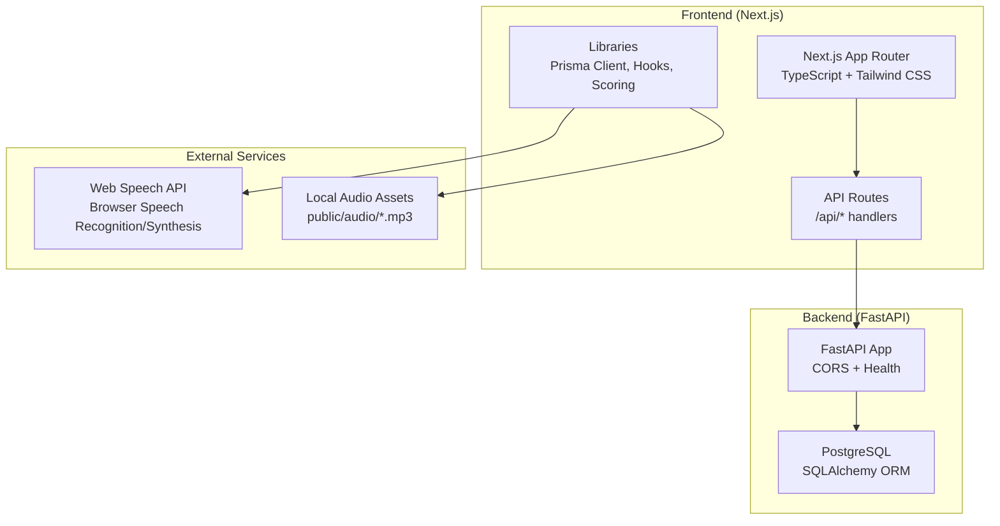
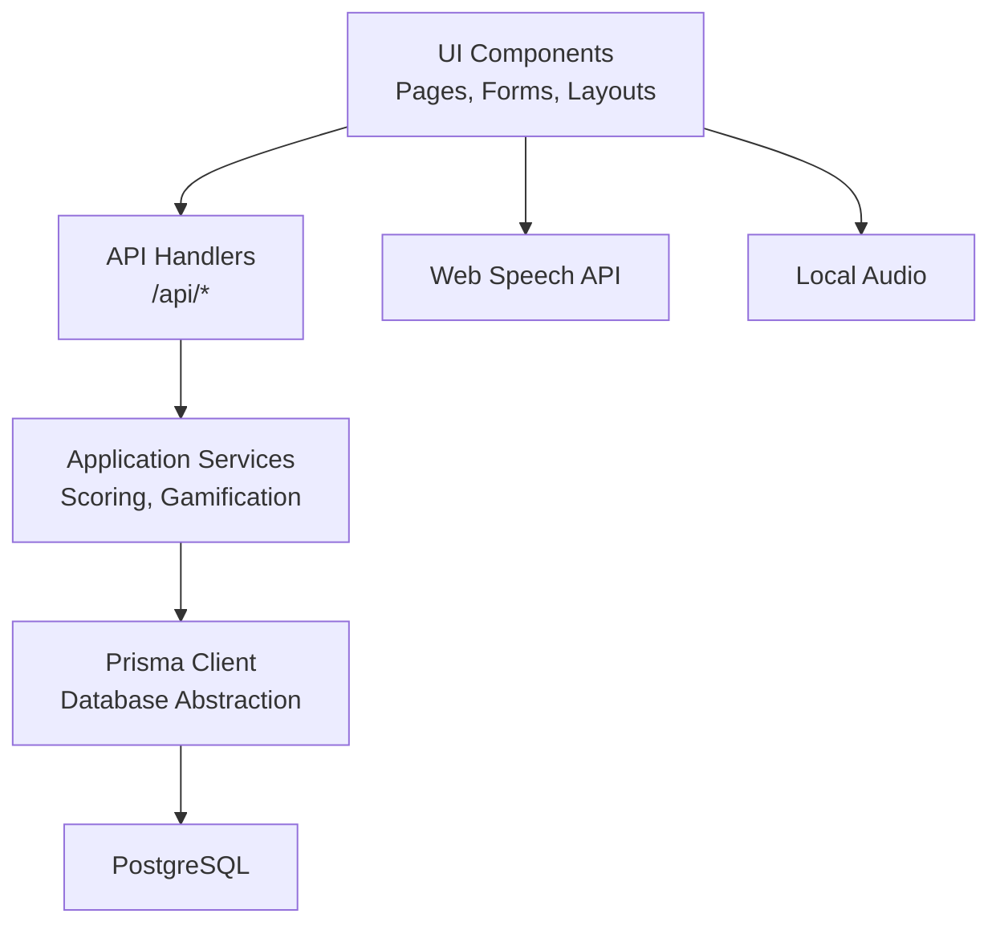
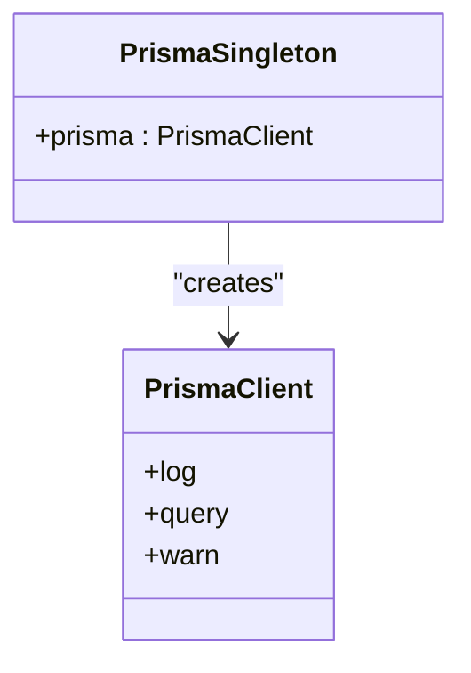
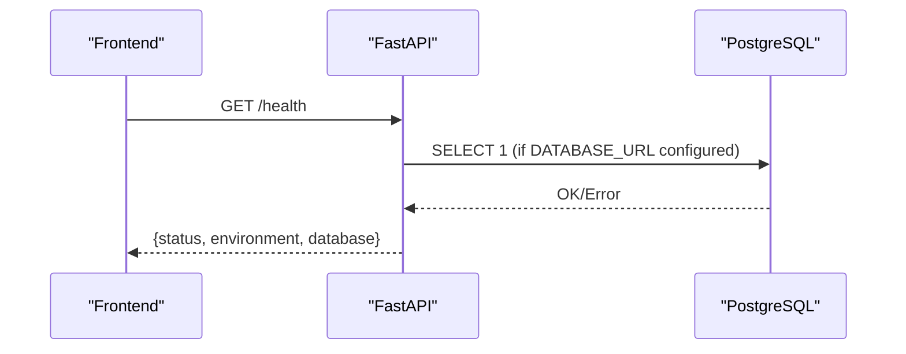
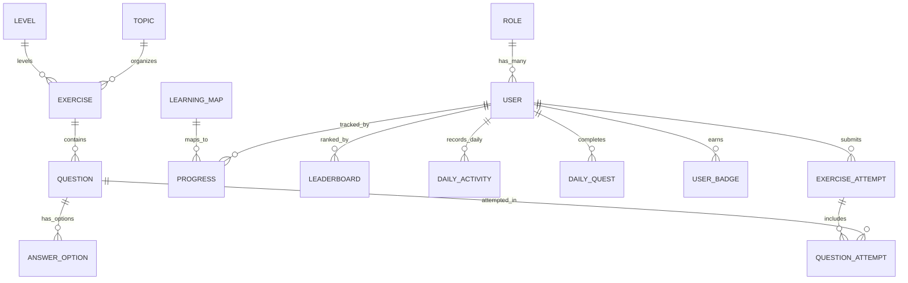
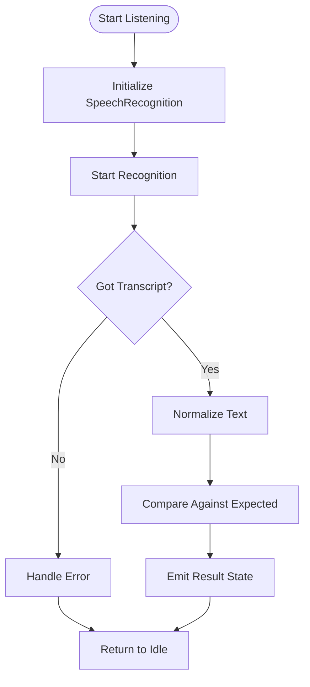
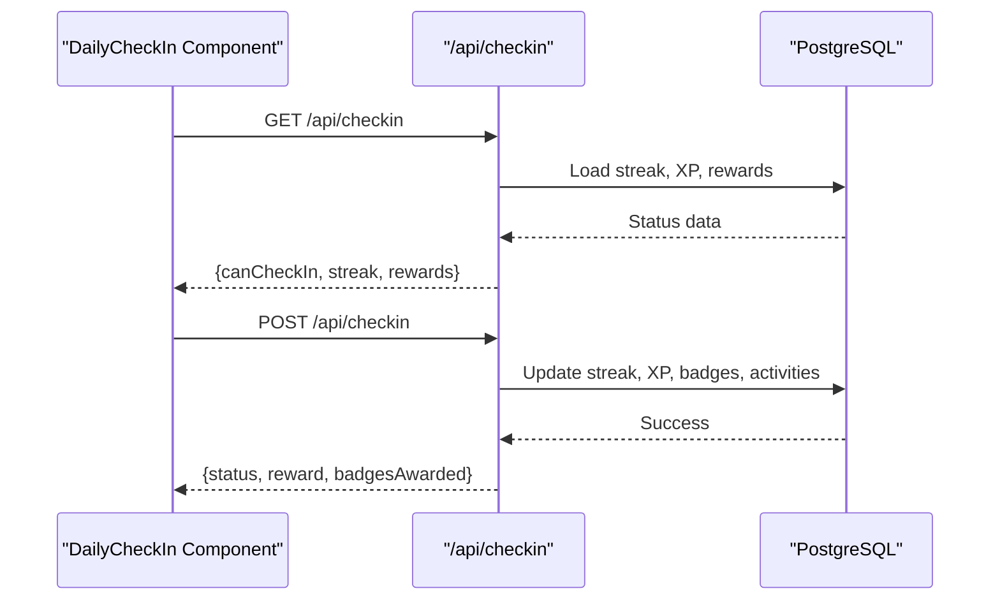
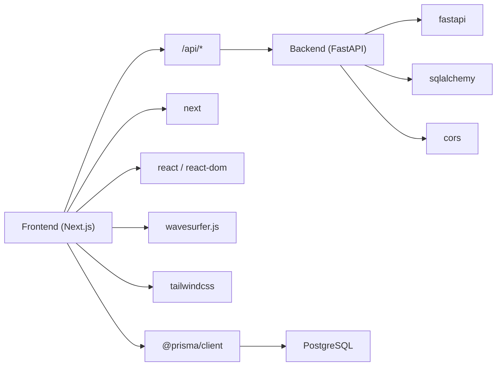

# Architecture Overview

<cite>
**Referenced Files in This Document**
- [package.json](file://english_pronunciation_app/frontend/package.json)
- [README.md](file://english_pronunciation_app/frontend/README.md)
- [schema.prisma](file://english_pronunciation_app/frontend/prisma/schema.prisma)
- [prisma.ts](file://english_pronunciation_app/frontend/src/lib/prisma.ts)
- [layout.tsx](file://english_pronunciation_app/frontend/src/app/layout.tsx)
- [tsconfig.json](file://english_pronunciation_app/frontend/tsconfig.json)
- [next.config.mjs](file://english_pronunciation_app/frontend/next.config.mjs)
- [README.md](file://english_pronunciation_app/backend/README.md)
- [main.py](file://english_pronunciation_app/backend/app/main.py)
- [config.py](file://english_pronunciation_app/backend/app/core/config.py)
- [database.py](file://english_pronunciation_app/backend/app/core/database.py)
- [useSpeechRecognition.ts](file://english_pronunciation_app/frontend/src/hooks/useSpeechRecognition.ts)
- [useWaveformRecorder.ts](file://english_pronunciation_app/frontend/src/hooks/useWaveformRecorder.ts)
- [DailyCheckIn.tsx](file://english_pronunciation_app/frontend/src/components/gamification/DailyCheckIn.tsx)
- [gamification.ts](file://english_pronunciation_app/frontend/src/lib/gamification.ts)
- [scoring.ts](file://english_pronunciation_app/frontend/src/lib/scoring.ts)
</cite>

## Table of Contents
1. [Introduction](#introduction)
2. [Project Structure](#project-structure)
3. [Core Components](#core-components)
4. [Architecture Overview](#architecture-overview)
5. [Detailed Component Analysis](#detailed-component-analysis)
6. [Dependency Analysis](#dependency-analysis)
7. [Performance Considerations](#performance-considerations)
8. [Troubleshooting Guide](#troubleshooting-guide)
9. [Conclusion](#conclusion)

## Introduction
This document describes the architecture of the Web_HoTroPhatAmEN pronunciation learning platform. The system follows a layered architecture with a Next.js frontend (TypeScript, Tailwind CSS), a FastAPI backend service, a PostgreSQL database managed by Prisma ORM, and Web Speech API integration for speech-driven exercises. It also integrates gamification features such as streak tracking, XP, rewards, and badges. The document explains technology choices, architectural patterns, component interactions, data flows, system boundaries, infrastructure requirements, scalability considerations, and deployment topology.

## Project Structure
The repository is organized into:
- Frontend: Next.js application with TypeScript, Prisma client, and Tailwind CSS
- Backend: Minimal FastAPI service exposing health and placeholder endpoints
- Shared assets and seeds under frontend/prisma
- Documentation and planning artifacts under PLAN and docs/superpowers

**Diagram sources**
- [layout.tsx:29-50](file://english_pronunciation_app/frontend/src/app/layout.tsx#L29-L50)
- [main.py:1-43](file://english_pronunciation_app/backend/app/main.py#L1-L43)
- [schema.prisma:1-501](file://english_pronunciation_app/frontend/prisma/schema.prisma#L1-L501)

**Section sources**
- [package.json:1-45](file://english_pronunciation_app/frontend/package.json#L1-L45)
- [README.md:1-33](file://english_pronunciation_app/frontend/README.md#L1-L33)
- [README.md:1-52](file://english_pronunciation_app/backend/README.md#L1-L52)

## Core Components
- Next.js Frontend
  - App Router pages and API routes under src/app
  - Prisma client singleton for database access
  - Tailwind CSS for styling
  - TypeScript configuration and Next.js config
- FastAPI Backend
  - Minimal service with CORS middleware and health endpoint
  - Optional SQLAlchemy-based database connectivity checker
- Database
  - PostgreSQL schema via Prisma ORM
  - Rich domain model covering users, exercises, questions, gamification, and leaderboards
- Web Speech API Integration
  - Browser-based speech recognition hook for voice exercises
  - Waveform recorder hook for dynamic audio feedback
- Gamification Library
  - XP/level calculation, streak management, daily bonus, badge system, shop mechanics

**Section sources**
- [prisma.ts:1-13](file://english_pronunciation_app/frontend/src/lib/prisma.ts#L1-L13)
- [schema.prisma:1-501](file://english_pronunciation_app/frontend/prisma/schema.prisma#L1-L501)
- [useSpeechRecognition.ts:1-111](file://english_pronunciation_app/frontend/src/hooks/useSpeechRecognition.ts#L1-L111)
- [useWaveformRecorder.ts:1-140](file://english_pronunciation_app/frontend/src/hooks/useWaveformRecorder.ts#L1-L140)
- [gamification.ts:1-575](file://english_pronunciation_app/frontend/src/lib/gamification.ts#L1-L575)

## Architecture Overview
The system employs a layered architecture:
- Presentation Layer: Next.js App Router pages and UI components
- Application Layer: API routes and shared libraries (scoring, gamification)
- Domain/Data Access Layer: Prisma ORM client and database models
- External Integrations: Web Speech API and local audio assets

**Diagram sources**
- [layout.tsx:29-50](file://english_pronunciation_app/frontend/src/app/layout.tsx#L29-L50)
- [scoring.ts:1-227](file://english_pronunciation_app/frontend/src/lib/scoring.ts#L1-L227)
- [gamification.ts:1-575](file://english_pronunciation_app/frontend/src/lib/gamification.ts#L1-L575)
- [prisma.ts:1-13](file://english_pronunciation_app/frontend/src/lib/prisma.ts#L1-L13)
- [schema.prisma:1-501](file://english_pronunciation_app/frontend/prisma/schema.prisma#L1-L501)

## Detailed Component Analysis

### Frontend Layer
- App Router and Pages
  - Root layout initializes fonts and theme
  - Pages under src/app define routes and UI shells
- Prisma Client
  - Singleton client with logging enabled
  - Used by API routes and server-side logic
- TypeScript and Tailwind
  - Strict compiler options and path aliases
  - Tailwind CSS configured via next.config.mjs

**Diagram sources**
- [prisma.ts:1-13](file://english_pronunciation_app/frontend/src/lib/prisma.ts#L1-L13)

**Section sources**
- [layout.tsx:1-51](file://english_pronunciation_app/frontend/src/app/layout.tsx#L1-L51)
- [prisma.ts:1-13](file://english_pronunciation_app/frontend/src/lib/prisma.ts#L1-L13)
- [tsconfig.json:1-42](file://english_pronunciation_app/frontend/tsconfig.json#L1-L42)
- [next.config.mjs:1-5](file://english_pronunciation_app/frontend/next.config.mjs#L1-L5)

### Backend Layer
- FastAPI Service
  - CORS middleware configured from environment
  - Health endpoint reports status and database connectivity
- Database Connectivity
  - Optional SQLAlchemy engine and session factory
  - Health check executes a simple SELECT 1

**Diagram sources**
- [main.py:1-43](file://english_pronunciation_app/backend/app/main.py#L1-L43)
- [database.py:31-51](file://english_pronunciation_app/backend/app/core/database.py#L31-L51)

**Section sources**
- [README.md:1-52](file://english_pronunciation_app/backend/README.md#L1-L52)
- [main.py:1-43](file://english_pronunciation_app/backend/app/main.py#L1-L43)
- [config.py:1-34](file://english_pronunciation_app/backend/app/core/config.py#L1-L34)
- [database.py:1-51](file://english_pronunciation_app/backend/app/core/database.py#L1-L51)

### Database and Data Model
- Prisma Schema
  - Comprehensive domain model including Users, Roles, Exercises, Questions, Topics, Levels, Sound Groups, Phonemes, Word Items, Minimal Pairs, Sentence Items, Question Bank Items, Attempts, Progress, Leaderboards, Badges, User Badges, Daily Activities, and Daily Quests
  - Indexes and relations designed for efficient querying and referential integrity
- Prisma Client
  - Singleton pattern prevents multiple instances during development
  - Logging enabled for queries, errors, and warnings

**Diagram sources**
- [schema.prisma:1-501](file://english_pronunciation_app/frontend/prisma/schema.prisma#L1-L501)

**Section sources**
- [schema.prisma:1-501](file://english_pronunciation_app/frontend/prisma/schema.prisma#L1-L501)
- [prisma.ts:1-13](file://english_pronunciation_app/frontend/src/lib/prisma.ts#L1-L13)

### Speech Recognition and Audio Feedback
- Speech Recognition Hook
  - Initializes browser SpeechRecognition (Chrome/Edge)
  - Normalizes transcripts for comparison against expected answers
  - Emits state transitions: idle/listening/processing/result
- Waveform Recorder Hook
  - Uses wavesurfer.js with record plugin
  - Real-time RMS-based audio level monitoring with dynamic color feedback
  - Robust clearing of waveform buffers to avoid stale data

**Diagram sources**
- [useSpeechRecognition.ts:1-111](file://english_pronunciation_app/frontend/src/hooks/useSpeechRecognition.ts#L1-L111)

**Section sources**
- [useSpeechRecognition.ts:1-111](file://english_pronunciation_app/frontend/src/hooks/useSpeechRecognition.ts#L1-L111)
- [useWaveformRecorder.ts:1-140](file://english_pronunciation_app/frontend/src/hooks/useWaveformRecorder.ts#L1-L140)

### Gamification and Scoring
- Daily Check-In
  - Fetches and posts to /api/checkin
  - Manages streaks, XP, and reward badges
- Scoring Engine
  - Normalizes answers, computes word overlap accuracy for voice tasks
  - Supports multiple question types (MC, tap stress, choose weak/linking, choose assimilation, voice)
  - Calculates exercise scores and ratings
- Gamification Rules
  - XP-to-level mapping, daily bonuses, retake bonuses
  - Badge definitions and award logic
  - Shop mechanics (gems, streak freeze, IPA reveal, slow audio)

**Diagram sources**
- [DailyCheckIn.tsx:1-234](file://english_pronunciation_app/frontend/src/components/gamification/DailyCheckIn.tsx#L1-L234)
- [gamification.ts:1-575](file://english_pronunciation_app/frontend/src/lib/gamification.ts#L1-L575)

**Section sources**
- [DailyCheckIn.tsx:1-234](file://english_pronunciation_app/frontend/src/components/gamification/DailyCheckIn.tsx#L1-L234)
- [scoring.ts:1-227](file://english_pronunciation_app/frontend/src/lib/scoring.ts#L1-L227)
- [gamification.ts:1-575](file://english_pronunciation_app/frontend/src/lib/gamification.ts#L1-L575)

## Dependency Analysis
- Frontend Dependencies
  - Next.js, React, Prisma Client, bcryptjs, wavesurfer.js, tailwindcss
  - Development: TypeScript, PostCSS, Tailwind, Prisma CLI
- Backend Dependencies
  - FastAPI, SQLAlchemy, environment-driven CORS and DB configuration
- Internal Coupling
  - Frontend API routes depend on backend endpoints
  - Frontend scoring and gamification libraries are self-contained but rely on backend APIs for persistence
  - Database schema defines strong relations between entities

**Diagram sources**
- [package.json:17-40](file://english_pronunciation_app/frontend/package.json#L17-L40)
- [main.py:1-22](file://english_pronunciation_app/backend/app/main.py#L1-L22)

**Section sources**
- [package.json:1-45](file://english_pronunciation_app/frontend/package.json#L1-L45)
- [main.py:1-43](file://english_pronunciation_app/backend/app/main.py#L1-L43)

## Performance Considerations
- Frontend
  - Use of a Prisma singleton avoids repeated client instantiation
  - Strict TypeScript configuration improves reliability and reduces runtime errors
  - Tailwind CSS enables rapid UI iteration; ensure purge configuration excludes unused styles
- Backend
  - Health endpoint performs a lightweight database ping; disable or gate expensive checks in production
  - CORS origins configurable via environment to minimize cross-origin overhead
- Speech Processing
  - Normalize text carefully to avoid empty comparisons for IPA tokens
  - Limit continuous recognition and interim results to reduce processing overhead
- Database
  - Leverage Prisma-generated indexes and relations for efficient queries
  - Batch writes for daily activities and leaderboard updates

## Troubleshooting Guide
- Database Connectivity
  - Backend health reports “not_configured” when DATABASE_URL is missing
  - Health reports error messages when connection fails
- Speech Recognition
  - Unsupported browsers show explicit error messages
  - Ensure HTTPS or localhost for microphone and speech APIs
- Local Audio
  - Audio assets are downloaded once via seed script; ensure public/audio exists and is writable
- CORS Issues
  - Verify CORS_ORIGINS environment variable includes frontend origins

**Section sources**
- [database.py:31-51](file://english_pronunciation_app/backend/app/core/database.py#L31-L51)
- [useSpeechRecognition.ts:25-41](file://english_pronunciation_app/frontend/src/hooks/useSpeechRecognition.ts#L25-L41)
- [README.md:15-33](file://english_pronunciation_app/frontend/README.md#L15-L33)
- [config.py:23-34](file://english_pronunciation_app/backend/app/core/config.py#L23-L34)

## Conclusion
The Web_HoTroPhatAmEN platform combines a modern Next.js frontend with a pragmatic FastAPI backend, robust PostgreSQL modeling via Prisma, and browser-native speech capabilities. The layered architecture cleanly separates presentation, application logic, and data concerns, while gamification and speech-driven exercises form the core learning loop. Scalability can be achieved by externalizing audio storage, adding caching layers, and sharding the database by user or period. Deployment should separate frontend and backend services behind a reverse proxy, with environment-specific CORS and database configurations.