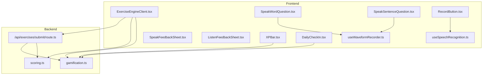
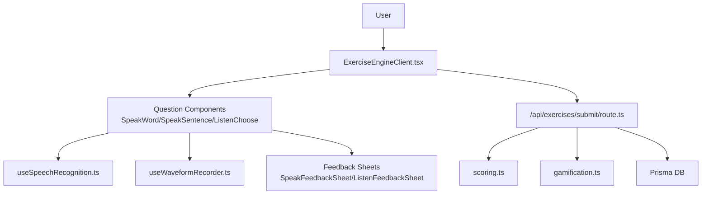
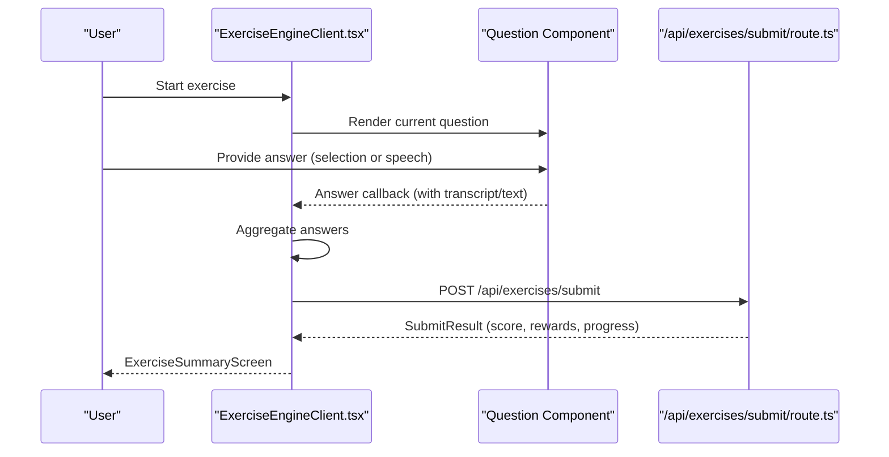
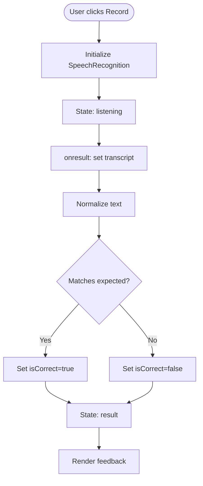
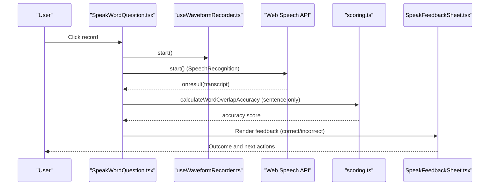
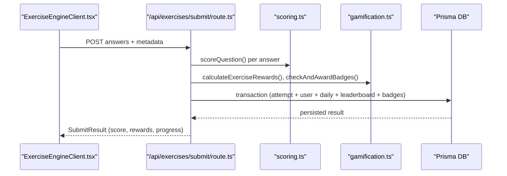
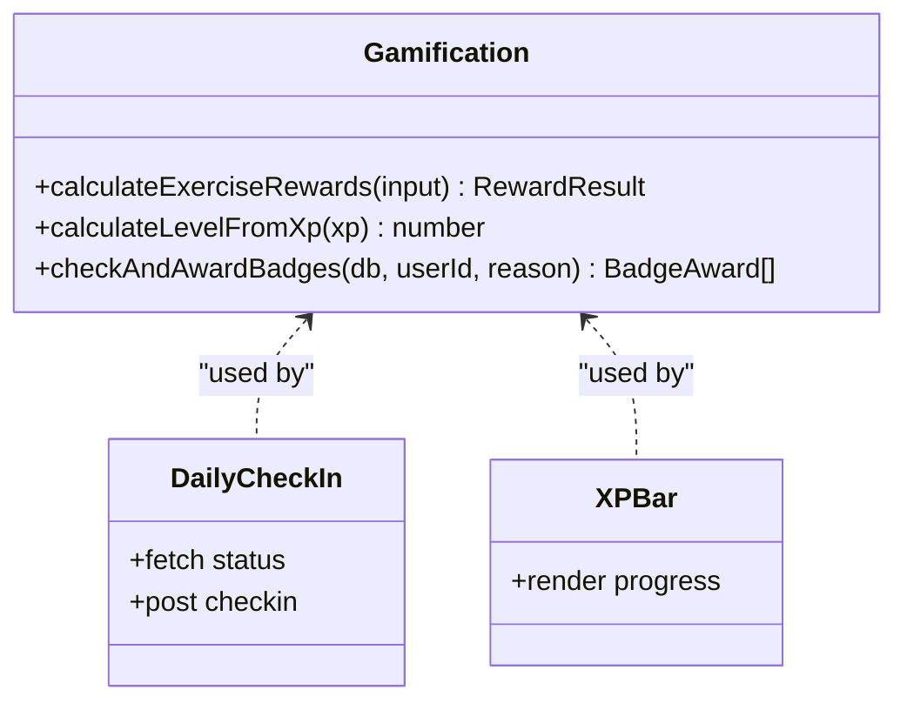
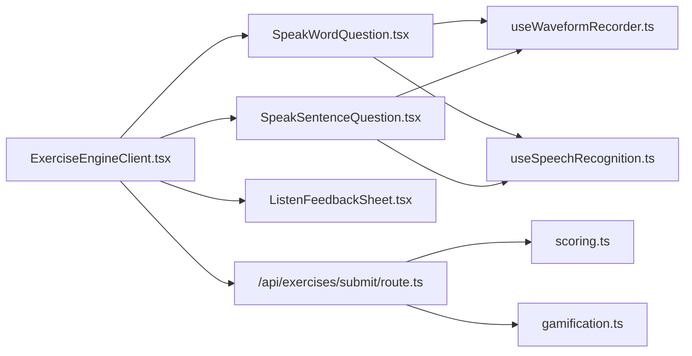

# Component Interactions

<cite>
**Referenced Files in This Document**
- [ExerciseEngineClient.tsx](file://english_pronunciation_app/frontend/src/app/exercises/[id]/ExerciseEngineClient.tsx)
- [useSpeechRecognition.ts](file://english_pronunciation_app/frontend/src/hooks/useSpeechRecognition.ts)
- [RecordButton.tsx](file://english_pronunciation_app/frontend/src/components/audio/RecordButton.tsx)
- [SpeakWordQuestion.tsx](file://english_pronunciation_app/frontend/src/app/exercises/[id]/SpeakWordQuestion.tsx)
- [SpeakSentenceQuestion.tsx](file://english_pronunciation_app/frontend/src/app/exercises/[id]/SpeakSentenceQuestion.tsx)
- [SpeakFeedbackSheet.tsx](file://english_pronunciation_app/frontend/src/app/exercises/[id]/SpeakFeedbackSheet.tsx)
- [ListenFeedbackSheet.tsx](file://english_pronunciation_app/frontend/src/app/exercises/[id]/ListenFeedbackSheet.tsx)
- [useWaveformRecorder.ts](file://english_pronunciation_app/frontend/src/hooks/useWaveformRecorder.ts)
- [scoring.ts](file://english_pronunciation_app/frontend/src/lib/scoring.ts)
- [gamification.ts](file://english_pronunciation_app/frontend/src/lib/gamification.ts)
- [route.ts](file://english_pronunciation_app/frontend/src/app/api/exercises/submit/route.ts)
- [DailyCheckIn.tsx](file://english_pronunciation_app/frontend/src/components/gamification/DailyCheckIn.tsx)
- [XPBar.tsx](file://english_pronunciation_app/frontend/src/components/gamification/XPBar.tsx)
</cite>

## Table of Contents
1. [Introduction](#introduction)
2. [Project Structure](#project-structure)
3. [Core Components](#core-components)
4. [Architecture Overview](#architecture-overview)
5. [Detailed Component Analysis](#detailed-component-analysis)
6. [Dependency Analysis](#dependency-analysis)
7. [Performance Considerations](#performance-considerations)
8. [Troubleshooting Guide](#troubleshooting-guide)
9. [Conclusion](#conclusion)

## Introduction
This document explains how the Web_HoTroPhatAmEN system orchestrates user input, speech recognition, AI-like scoring, and gamification feedback. It focuses on:
- How ExerciseEngineClient.tsx coordinates speech tasks and integrates with speech recognition hooks
- Real-time feedback loops for pronunciation assessment via waveform and transcript analysis
- State management across components and the communication between frontend and backend APIs
- Integration between the gamification engine and user progress tracking

## Project Structure
The system centers around a Next.js frontend with client-side hooks and pages, and a backend API route that validates submissions, computes scores, and updates gamification metrics.

**Diagram sources**
- [ExerciseEngineClient.tsx:323-645](file://english_pronunciation_app/frontend/src/app/exercises/[id]/ExerciseEngineClient.tsx#L323-L645)
- [SpeakWordQuestion.tsx:57-222](file://english_pronunciation_app/frontend/src/app/exercises/[id]/SpeakWordQuestion.tsx#L57-L222)
- [SpeakSentenceQuestion.tsx:48-225](file://english_pronunciation_app/frontend/src/app/exercises/[id]/SpeakSentenceQuestion.tsx#L48-L225)
- [RecordButton.tsx:10-130](file://english_pronunciation_app/frontend/src/components/audio/RecordButton.tsx#L10-L130)
- [useWaveformRecorder.ts:29-140](file://english_pronunciation_app/frontend/src/hooks/useWaveformRecorder.ts#L29-L140)
- [useSpeechRecognition.ts:15-111](file://english_pronunciation_app/frontend/src/hooks/useSpeechRecognition.ts#L15-L111)
- [/api/exercises/submit/route.ts:47-332](file://english_pronunciation_app/frontend/src/app/api/exercises/submit/route.ts#L47-L332)
- [gamification.ts:195-234](file://english_pronunciation_app/frontend/src/lib/gamification.ts#L195-L234)
- [scoring.ts:191-227](file://english_pronunciation_app/frontend/src/lib/scoring.ts#L191-L227)
- [DailyCheckIn.tsx:48-234](file://english_pronunciation_app/frontend/src/components/gamification/DailyCheckIn.tsx#L48-L234)
- [XPBar.tsx:15-50](file://english_pronunciation_app/frontend/src/components/gamification/XPBar.tsx#L15-L50)

**Section sources**
- [ExerciseEngineClient.tsx:323-645](file://english_pronunciation_app/frontend/src/app/exercises/[id]/ExerciseEngineClient.tsx#L323-L645)
- [/api/exercises/submit/route.ts:47-332](file://english_pronunciation_app/frontend/src/app/api/exercises/submit/route.ts#L47-L332)

## Core Components
- ExerciseEngineClient.tsx: Orchestrates exercise navigation, collects answers, triggers submission, and renders feedback overlays. It also manages combo streak feedback and SFX.
- useSpeechRecognition.ts: Provides a reusable hook for browser Web Speech API-based speech-to-text with state transitions and normalization logic.
- RecordButton.tsx: UI wrapper around the speech recognition hook, rendering state-specific buttons and results.
- SpeakWordQuestion.tsx and SpeakSentenceQuestion.tsx: Specialized speech tasks that integrate waveform monitoring and transcript evaluation.
- useWaveformRecorder.ts: Manages real-time audio level visualization and RMS-based feedback.
- scoring.ts: Implements scoring logic for voice and non-voice question types, including word overlap accuracy for sentences.
- gamification.ts: Computes XP rewards, levels, streaks, and badge checks; integrates with leaderboard targets.
- route.ts (/api/exercises/submit): Validates requests, scores answers, persists attempts, updates user XP/level, daily activity, leaderboards, and badges.
- DailyCheckIn.tsx and XPBar.tsx: Gamification UI components that reflect streaks and XP progression.

**Section sources**
- [ExerciseEngineClient.tsx:20-102](file://english_pronunciation_app/frontend/src/app/exercises/[id]/ExerciseEngineClient.tsx#L20-L102)
- [useSpeechRecognition.ts:13-111](file://english_pronunciation_app/frontend/src/hooks/useSpeechRecognition.ts#L13-L111)
- [RecordButton.tsx:10-130](file://english_pronunciation_app/frontend/src/components/audio/RecordButton.tsx#L10-L130)
- [SpeakWordQuestion.tsx:57-222](file://english_pronunciation_app/frontend/src/app/exercises/[id]/SpeakWordQuestion.tsx#L57-L222)
- [SpeakSentenceQuestion.tsx:48-225](file://english_pronunciation_app/frontend/src/app/exercises/[id]/SpeakSentenceQuestion.tsx#L48-L225)
- [useWaveformRecorder.ts:29-140](file://english_pronunciation_app/frontend/src/hooks/useWaveformRecorder.ts#L29-L140)
- [scoring.ts:191-227](file://english_pronunciation_app/frontend/src/lib/scoring.ts#L191-L227)
- [gamification.ts:195-234](file://english_pronunciation_app/frontend/src/lib/gamification.ts#L195-L234)
- [/api/exercises/submit/route.ts:47-332](file://english_pronunciation_app/frontend/src/app/api/exercises/submit/route.ts#L47-L332)
- [DailyCheckIn.tsx:48-234](file://english_pronunciation_app/frontend/src/components/gamification/DailyCheckIn.tsx#L48-L234)
- [XPBar.tsx:15-50](file://english_pronunciation_app/frontend/src/components/gamification/XPBar.tsx#L15-L50)

## Architecture Overview
The system follows a client-driven exercise engine with optional speech tasks and a backend API for persistence and scoring. The frontend components share state and coordinate through props and callbacks, while the backend performs scoring, reward computation, and gamification updates.

**Diagram sources**
- [ExerciseEngineClient.tsx:323-645](file://english_pronunciation_app/frontend/src/app/exercises/[id]/ExerciseEngineClient.tsx#L323-L645)
- [SpeakWordQuestion.tsx:57-222](file://english_pronunciation_app/frontend/src/app/exercises/[id]/SpeakWordQuestion.tsx#L57-L222)
- [SpeakSentenceQuestion.tsx:48-225](file://english_pronunciation_app/frontend/src/app/exercises/[id]/SpeakSentenceQuestion.tsx#L48-L225)
- [useSpeechRecognition.ts:15-111](file://english_pronunciation_app/frontend/src/hooks/useSpeechRecognition.ts#L15-L111)
- [useWaveformRecorder.ts:29-140](file://english_pronunciation_app/frontend/src/hooks/useWaveformRecorder.ts#L29-L140)
- [SpeakFeedbackSheet.tsx:18-96](file://english_pronunciation_app/frontend/src/app/exercises/[id]/SpeakFeedbackSheet.tsx#L18-L96)
- [ListenFeedbackSheet.tsx:34-151](file://english_pronunciation_app/frontend/src/app/exercises/[id]/ListenFeedbackSheet.tsx#L34-L151)
- [/api/exercises/submit/route.ts:47-332](file://english_pronunciation_app/frontend/src/app/api/exercises/submit/route.ts#L47-L332)
- [gamification.ts:195-234](file://english_pronunciation_app/frontend/src/lib/gamification.ts#L195-L234)
- [scoring.ts:191-227](file://english_pronunciation_app/frontend/src/lib/scoring.ts#L191-L227)

## Detailed Component Analysis

### ExerciseEngineClient.tsx: Orchestration and Submission Loop
- Maintains exercise state: current index, score, answers, submit status, and results.
- Routes to question-specific components based on question type.
- Records answers and submits them to the backend endpoint.
- Renders feedback overlays and handles retries and progression.

**Diagram sources**
- [ExerciseEngineClient.tsx:367-403](file://english_pronunciation_app/frontend/src/app/exercises/[id]/ExerciseEngineClient.tsx#L367-L403)
- [/api/exercises/submit/route.ts:47-332](file://english_pronunciation_app/frontend/src/app/api/exercises/submit/route.ts#L47-L332)

**Section sources**
- [ExerciseEngineClient.tsx:323-645](file://english_pronunciation_app/frontend/src/app/exercises/[id]/ExerciseEngineClient.tsx#L323-L645)

### Speech Recognition Hooks and UI Integration
- useSpeechRecognition.ts: Provides state machine for speech recognition with support detection, normalization, and result handling.
- RecordButton.tsx: Consumes the hook to render actionable UI states and announce outcomes to assistive technologies.

**Diagram sources**
- [useSpeechRecognition.ts:15-111](file://english_pronunciation_app/frontend/src/hooks/useSpeechRecognition.ts#L15-L111)
- [RecordButton.tsx:10-130](file://english_pronunciation_app/frontend/src/components/audio/RecordButton.tsx#L10-L130)

**Section sources**
- [useSpeechRecognition.ts:15-111](file://english_pronunciation_app/frontend/src/hooks/useSpeechRecognition.ts#L15-L111)
- [RecordButton.tsx:10-130](file://english_pronunciation_app/frontend/src/components/audio/RecordButton.tsx#L10-L130)

### SpeakWordQuestion.tsx and SpeakSentenceQuestion.tsx: Real-Time Pronunciation Assessment
- Both components integrate:
  - Web Speech API for transcription
  - useWaveformRecorder.ts for dynamic audio level feedback
  - SpeakFeedbackSheet.tsx for contextual feedback
- Sentence variant uses word overlap accuracy scoring from scoring.ts.

**Diagram sources**
- [SpeakWordQuestion.tsx:57-222](file://english_pronunciation_app/frontend/src/app/exercises/[id]/SpeakWordQuestion.tsx#L57-L222)
- [SpeakSentenceQuestion.tsx:48-225](file://english_pronunciation_app/frontend/src/app/exercises/[id]/SpeakSentenceQuestion.tsx#L48-L225)
- [useWaveformRecorder.ts:29-140](file://english_pronunciation_app/frontend/src/hooks/useWaveformRecorder.ts#L29-L140)
- [scoring.ts:52-72](file://english_pronunciation_app/frontend/src/lib/scoring.ts#L52-L72)
- [SpeakFeedbackSheet.tsx:18-96](file://english_pronunciation_app/frontend/src/app/exercises/[id]/SpeakFeedbackSheet.tsx#L18-L96)

**Section sources**
- [SpeakWordQuestion.tsx:57-222](file://english_pronunciation_app/frontend/src/app/exercises/[id]/SpeakWordQuestion.tsx#L57-L222)
- [SpeakSentenceQuestion.tsx:48-225](file://english_pronunciation_app/frontend/src/app/exercises/[id]/SpeakSentenceQuestion.tsx#L48-L225)
- [useWaveformRecorder.ts:29-140](file://english_pronunciation_app/frontend/src/hooks/useWaveformRecorder.ts#L29-L140)
- [scoring.ts:52-72](file://english_pronunciation_app/frontend/src/lib/scoring.ts#L52-L72)
- [SpeakFeedbackSheet.tsx:18-96](file://english_pronunciation_app/frontend/src/app/exercises/[id]/SpeakFeedbackSheet.tsx#L18-L96)

### Backend API: Validation, Scoring, Rewards, and Persistence
- Validates session, exercise existence, and answer completeness.
- Scores each question using scoring.ts helpers.
- Computes XP rewards and level progression using gamification.ts.
- Persists attempt, updates user XP/level, daily activity, leaderboards, and badges atomically.

**Diagram sources**
- [/api/exercises/submit/route.ts:47-332](file://english_pronunciation_app/frontend/src/app/api/exercises/submit/route.ts#L47-L332)
- [scoring.ts:191-227](file://english_pronunciation_app/frontend/src/lib/scoring.ts#L191-L227)
- [gamification.ts:195-234](file://english_pronunciation_app/frontend/src/lib/gamification.ts#L195-L234)

**Section sources**
- [/api/exercises/submit/route.ts:47-332](file://english_pronunciation_app/frontend/src/app/api/exercises/submit/route.ts#L47-L332)
- [scoring.ts:191-227](file://english_pronunciation_app/frontend/src/lib/scoring.ts#L191-L227)
- [gamification.ts:195-234](file://english_pronunciation_app/frontend/src/lib/gamification.ts#L195-L234)

### Gamification Engine and Progress Tracking
- XP rewards and level calculation are computed in gamification.ts and applied in the backend transaction.
- DailyCheckIn.tsx and XPBar.tsx reflect streaks and XP progression in the UI.
- Badges are evaluated post-submission and can be awarded during the same transaction.

**Diagram sources**
- [gamification.ts:195-234](file://english_pronunciation_app/frontend/src/lib/gamification.ts#L195-L234)
- [DailyCheckIn.tsx:48-234](file://english_pronunciation_app/frontend/src/components/gamification/DailyCheckIn.tsx#L48-L234)
- [XPBar.tsx:15-50](file://english_pronunciation_app/frontend/src/components/gamification/XPBar.tsx#L15-L50)

**Section sources**
- [gamification.ts:195-234](file://english_pronunciation_app/frontend/src/lib/gamification.ts#L195-L234)
- [DailyCheckIn.tsx:48-234](file://english_pronunciation_app/frontend/src/components/gamification/DailyCheckIn.tsx#L48-L234)
- [XPBar.tsx:15-50](file://english_pronunciation_app/frontend/src/components/gamification/XPBar.tsx#L15-L50)

## Dependency Analysis
- ExerciseEngineClient.tsx depends on:
  - Question components (SpeakWordQuestion, SpeakSentenceQuestion, ListenFeedbackSheet)
  - Scoring helpers for voice accuracy
  - Gamification helpers for XP and rewards
  - Backend API for submission and persistence
- Question components depend on:
  - Web Speech API (via hooks)
  - Waveform recorder for audio level feedback
  - Scoring helpers for accuracy thresholds
- Backend API depends on:
  - Scoring helpers for correctness and scores
  - Gamification helpers for XP and badges
  - Prisma for atomic writes

**Diagram sources**
- [ExerciseEngineClient.tsx:323-645](file://english_pronunciation_app/frontend/src/app/exercises/[id]/ExerciseEngineClient.tsx#L323-L645)
- [SpeakWordQuestion.tsx:57-222](file://english_pronunciation_app/frontend/src/app/exercises/[id]/SpeakWordQuestion.tsx#L57-L222)
- [SpeakSentenceQuestion.tsx:48-225](file://english_pronunciation_app/frontend/src/app/exercises/[id]/SpeakSentenceQuestion.tsx#L48-L225)
- [useWaveformRecorder.ts:29-140](file://english_pronunciation_app/frontend/src/hooks/useWaveformRecorder.ts#L29-L140)
- [useSpeechRecognition.ts:15-111](file://english_pronunciation_app/frontend/src/hooks/useSpeechRecognition.ts#L15-L111)
- [/api/exercises/submit/route.ts:47-332](file://english_pronunciation_app/frontend/src/app/api/exercises/submit/route.ts#L47-L332)
- [scoring.ts:191-227](file://english_pronunciation_app/frontend/src/lib/scoring.ts#L191-L227)
- [gamification.ts:195-234](file://english_pronunciation_app/frontend/src/lib/gamification.ts#L195-L234)

**Section sources**
- [ExerciseEngineClient.tsx:323-645](file://english_pronunciation_app/frontend/src/app/exercises/[id]/ExerciseEngineClient.tsx#L323-L645)
- [/api/exercises/submit/route.ts:47-332](file://english_pronunciation_app/frontend/src/app/api/exercises/submit/route.ts#L47-L332)

## Performance Considerations
- Minimize repeated computations:
  - Normalize and compare logic should avoid redundant work; memoize derived values like word prompts.
- Efficient audio processing:
  - Use requestAnimationFrame judiciously in waveform monitoring; cancel timers on unmount.
- Network resilience:
  - Implement retry and optimistic UI for submission to reduce perceived latency.
- Accessibility:
  - Keep screen reader announcements concise and up-to-date with state changes.

## Troubleshooting Guide
Common issues and remedies:
- Browser speech API unsupported:
  - Ensure Chrome/Edge; display a clear error and disable controls.
- Microphone permission denied:
  - Guide users to enable permissions in browser settings and reload.
- No speech detected:
  - Prompt users to speak louder or closer to the mic; adjust thresholds if needed.
- Submission failures:
  - Validate exercise ID and answers; ensure user is authenticated; handle network errors gracefully.

**Section sources**
- [useSpeechRecognition.ts:25-41](file://english_pronunciation_app/frontend/src/hooks/useSpeechRecognition.ts#L25-L41)
- [SpeakWordQuestion.tsx:88-111](file://english_pronunciation_app/frontend/src/app/exercises/[id]/SpeakWordQuestion.tsx#L88-L111)
- [SpeakSentenceQuestion.tsx:84-104](file://english_pronunciation_app/frontend/src/app/exercises/[id]/SpeakSentenceQuestion.tsx#L84-L104)
- [/api/exercises/submit/route.ts:53-67](file://english_pronunciation_app/frontend/src/app/api/exercises/submit/route.ts#L53-L67)

## Conclusion
The Web_HoTroPhatAmEN system integrates a robust exercise engine with real-time speech feedback and a comprehensive gamification pipeline. Frontend components manage user interactions and state, while the backend ensures accurate scoring, persistent records, and meaningful XP/reward progression. The documented flows and diagrams provide a blueprint for extending features, optimizing performance, and maintaining accessibility.