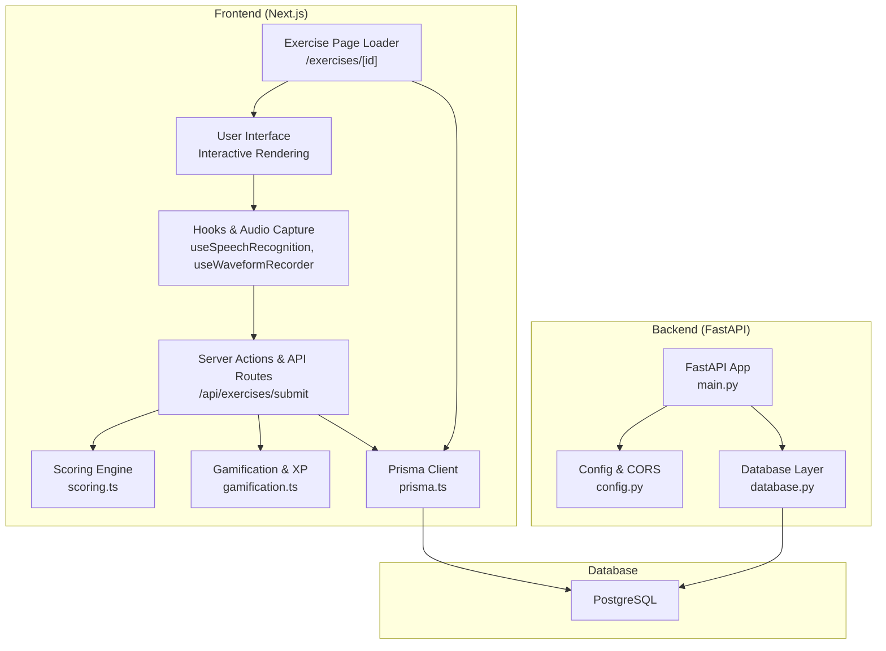
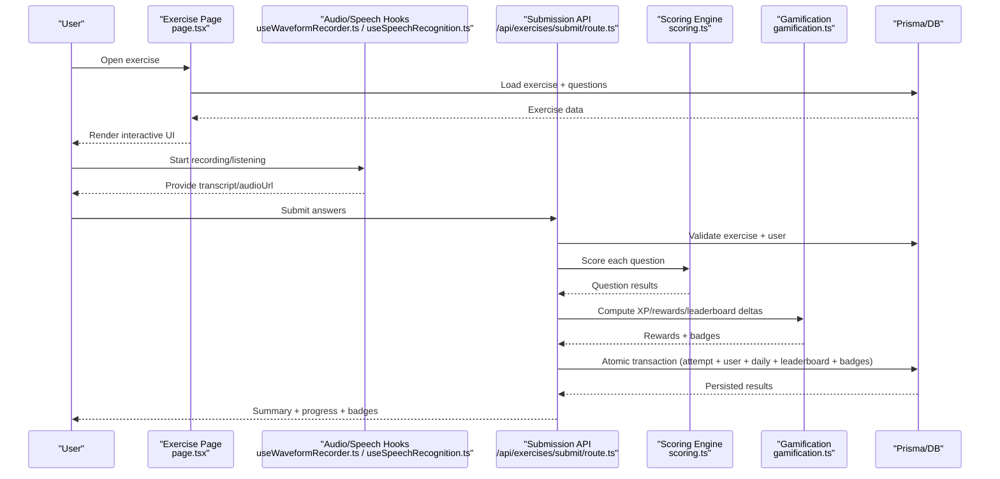
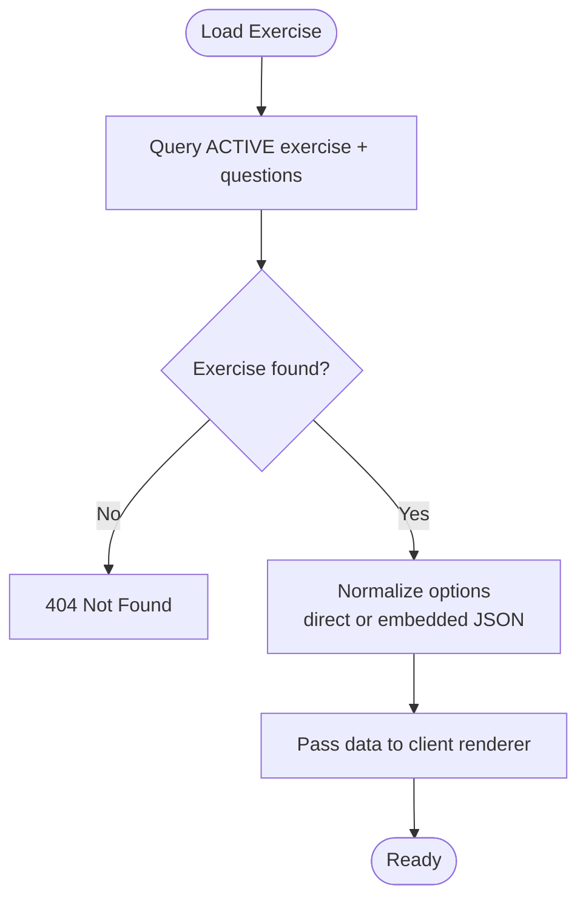
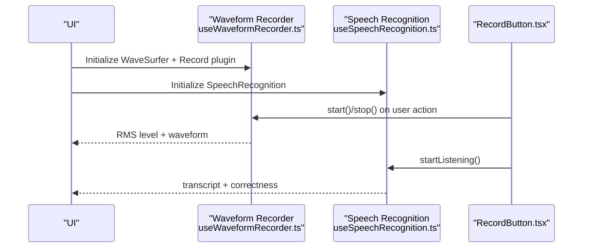
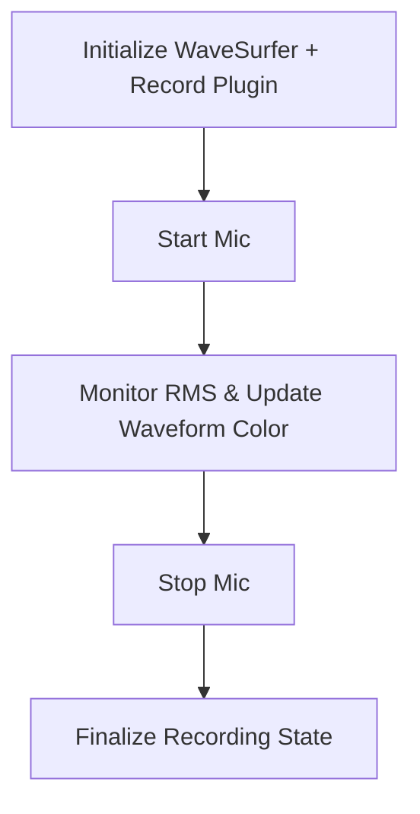
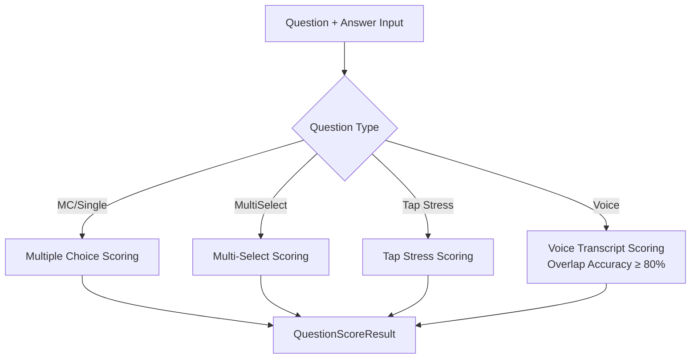
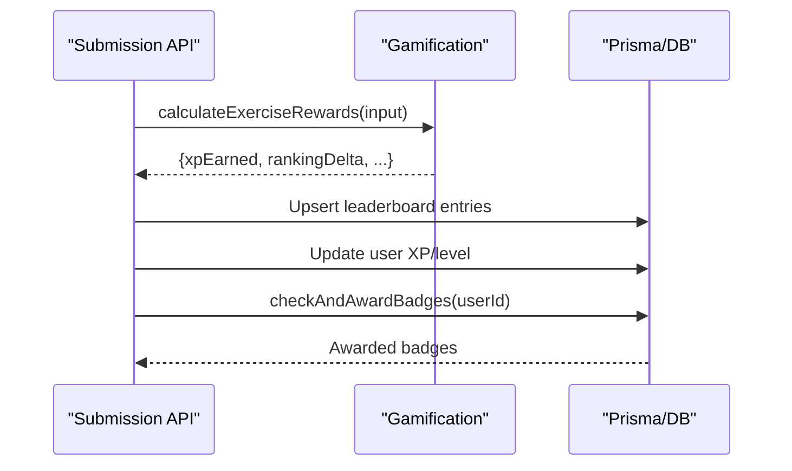
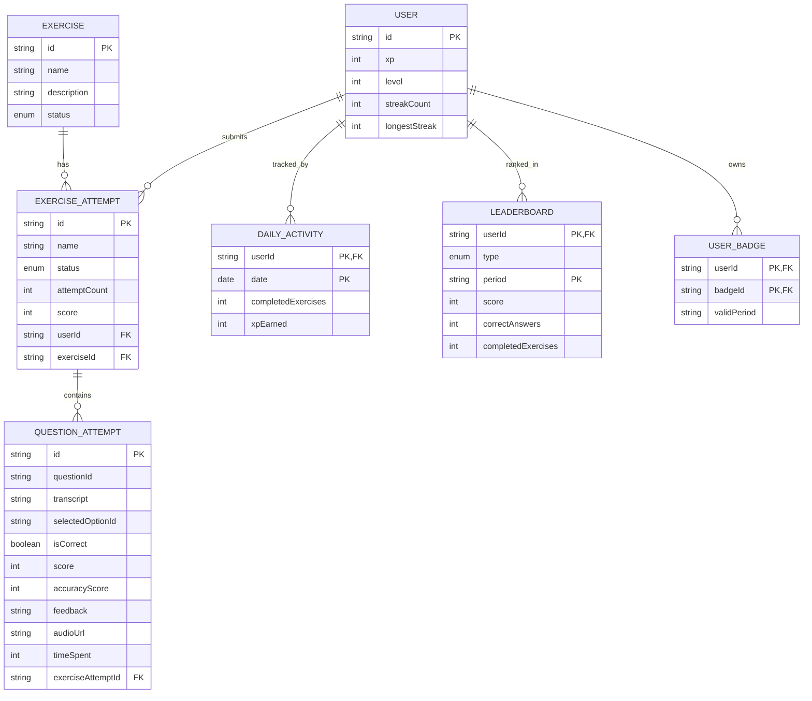
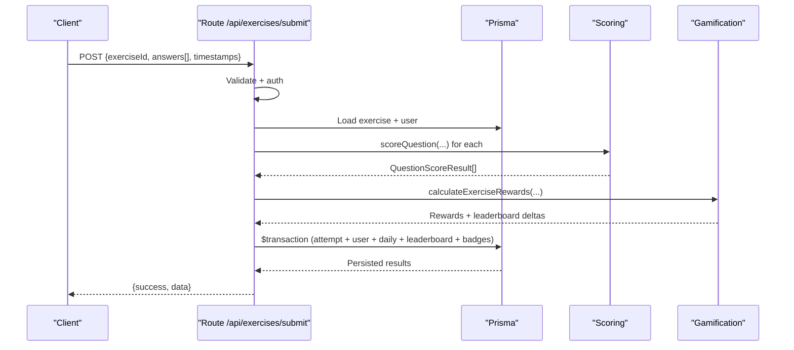
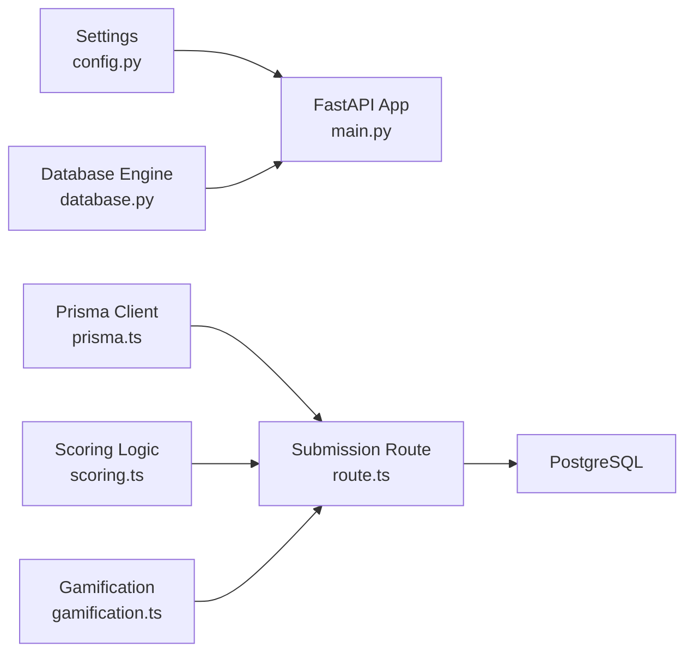

# Data Flow Architecture

<cite>
**Referenced Files in This Document**
- [main.py](file://english_pronunciation_app/backend/app/main.py)
- [config.py](file://english_pronunciation_app/backend/app/core/config.py)
- [database.py](file://english_pronunciation_app/backend/app/core/database.py)
- [prisma.ts](file://english_pronunciation_app/frontend/src/lib/prisma.ts)
- [scoring.ts](file://english_pronunciation_app/frontend/src/lib/scoring.ts)
- [gamification.ts](file://english_pronunciation_app/frontend/src/lib/gamification.ts)
- [page.tsx](file://english_pronunciation_app/frontend/src/app/exercises/[id]/page.tsx)
- [route.ts](file://english_pronunciation_app/frontend/src/app/api/exercises/submit/route.ts)
- [useSpeechRecognition.ts](file://english_pronunciation_app/frontend/src/hooks/useSpeechRecognition.ts)
- [useWaveformRecorder.ts](file://english_pronunciation_app/frontend/src/hooks/useWaveformRecorder.ts)
- [RecordButton.tsx](file://english_pronunciation_app/frontend/src/components/audio/RecordButton.tsx)
- [layout.tsx](file://english_pronunciation_app/frontend/src/app/layout.tsx)
</cite>

## Table of Contents
1. [Introduction](#introduction)
2. [Project Structure](#project-structure)
3. [Core Components](#core-components)
4. [Architecture Overview](#architecture-overview)
5. [Detailed Component Analysis](#detailed-component-analysis)
6. [Dependency Analysis](#dependency-analysis)
7. [Performance Considerations](#performance-considerations)
8. [Troubleshooting Guide](#troubleshooting-guide)
9. [Conclusion](#conclusion)

## Introduction
This document describes the end-to-end data flow architecture for Web_HoTroPhatAmEN, focusing on how user input progresses through speech recording, AI-like assessment, scoring engine, gamification, and database persistence. It also covers exercise selection, content retrieval, interactive rendering, result processing, leaderboard updates, and real-time-like progression indicators. The goal is to provide a comprehensive, accessible guide for developers and stakeholders to understand how user data moves across the system.

## Project Structure
The system follows a modern full-stack architecture:
- Frontend (Next.js App Router) handles UI, user interactions, speech/audio capture, and API orchestration.
- Backend (FastAPI) exposes health and minimal endpoints; most business logic resides in the frontend via server actions and API routes.
- Database (via Prisma) stores exercises, user attempts, leaderboards, and user profiles.
- Real-time-like updates occur through periodic client-side polling and optimistic UI updates.

**Diagram sources**
- [main.py:10-42](file://english_pronunciation_app/backend/app/main.py#L10-L42)
- [config.py:9-33](file://english_pronunciation_app/backend/app/core/config.py#L9-L33)
- [database.py:10-50](file://english_pronunciation_app/backend/app/core/database.py#L10-L50)
- [prisma.ts:1-13](file://english_pronunciation_app/frontend/src/lib/prisma.ts#L1-L13)
- [scoring.ts:191-226](file://english_pronunciation_app/frontend/src/lib/scoring.ts#L191-L226)
- [gamification.ts:195-234](file://english_pronunciation_app/frontend/src/lib/gamification.ts#L195-L234)
- [route.ts:47-331](file://english_pronunciation_app/frontend/src/app/api/exercises/submit/route.ts#L47-L331)
- [page.tsx:47-91](file://english_pronunciation_app/frontend/src/app/exercises/[id]/page.tsx#L47-L91)

**Section sources**
- [main.py:1-43](file://english_pronunciation_app/backend/app/main.py#L1-L43)
- [config.py:1-34](file://english_pronunciation_app/backend/app/core/config.py#L1-L34)
- [database.py:1-51](file://english_pronunciation_app/backend/app/core/database.py#L1-L51)
- [prisma.ts:1-13](file://english_pronunciation_app/frontend/src/lib/prisma.ts#L1-L13)
- [layout.tsx:1-51](file://english_pronunciation_app/frontend/src/app/layout.tsx#L1-L51)

## Core Components
- Exercise Content Loader: Fetches and normalizes exercise content and questions from the database for rendering.
- Speech/Audio Capture: Provides microphone recording and speech recognition state machine for voice tasks.
- Scoring Engine: Implements question-type-specific scoring, normalization, and accuracy computation.
- Gamification & XP System: Computes XP rewards, streaks, and leaderboard deltas; manages badges.
- Submission Pipeline: Validates input, computes scores, persists attempts, updates user and leaderboard data atomically.

**Section sources**
- [page.tsx:47-91](file://english_pronunciation_app/frontend/src/app/exercises/[id]/page.tsx#L47-L91)
- [useSpeechRecognition.ts:15-110](file://english_pronunciation_app/frontend/src/hooks/useSpeechRecognition.ts#L15-L110)
- [useWaveformRecorder.ts:29-139](file://english_pronunciation_app/frontend/src/hooks/useWaveformRecorder.ts#L29-L139)
- [scoring.ts:191-226](file://english_pronunciation_app/frontend/src/lib/scoring.ts#L191-L226)
- [gamification.ts:195-234](file://english_pronunciation_app/frontend/src/lib/gamification.ts#L195-L234)
- [route.ts:47-331](file://english_pronunciation_app/frontend/src/app/api/exercises/submit/route.ts#L47-L331)

## Architecture Overview
The system separates concerns across layers:
- Presentation: Next.js pages and components render exercises and collect user input.
- Interaction: Hooks manage speech and waveform recording; components trigger submission.
- Processing: API route orchestrates scoring, gamification, and database transactions.
- Persistence: Prisma connects to PostgreSQL for all data operations.

**Diagram sources**
- [page.tsx:47-91](file://english_pronunciation_app/frontend/src/app/exercises/[id]/page.tsx#L47-L91)
- [useWaveformRecorder.ts:99-139](file://english_pronunciation_app/frontend/src/hooks/useWaveformRecorder.ts#L99-L139)
- [useSpeechRecognition.ts:50-84](file://english_pronunciation_app/frontend/src/hooks/useSpeechRecognition.ts#L50-L84)
- [route.ts:47-331](file://english_pronunciation_app/frontend/src/app/api/exercises/submit/route.ts#L47-L331)
- [scoring.ts:191-226](file://english_pronunciation_app/frontend/src/lib/scoring.ts#L191-L226)
- [gamification.ts:195-234](file://english_pronunciation_app/frontend/src/lib/gamification.ts#L195-L234)

## Detailed Component Analysis

### Exercise Selection and Content Retrieval
- The exercise loader fetches an ACTIVE exercise with its ACTIVE questions and types/options.
- It normalizes question options whether stored directly or embedded in content.
- The normalized data is passed to the client-side exercise engine for rendering.

**Diagram sources**
- [page.tsx:47-91](file://english_pronunciation_app/frontend/src/app/exercises/[id]/page.tsx#L47-L91)

**Section sources**
- [page.tsx:47-91](file://english_pronunciation_app/frontend/src/app/exercises/[id]/page.tsx#L47-L91)

### Interactive Rendering Pipeline
- The UI renders question types and interactive controls.
- For voice tasks, the waveform recorder captures audio and provides real-time RMS-based feedback.
- For speech tasks, the speech recognition hook provides transcript and correctness hints.

**Diagram sources**
- [useWaveformRecorder.ts:29-139](file://english_pronunciation_app/frontend/src/hooks/useWaveformRecorder.ts#L29-L139)
- [useSpeechRecognition.ts:15-110](file://english_pronunciation_app/frontend/src/hooks/useSpeechRecognition.ts#L15-L110)
- [RecordButton.tsx:10-129](file://english_pronunciation_app/frontend/src/components/audio/RecordButton.tsx#L10-L129)

**Section sources**
- [useWaveformRecorder.ts:29-139](file://english_pronunciation_app/frontend/src/hooks/useWaveformRecorder.ts#L29-L139)
- [useSpeechRecognition.ts:15-110](file://english_pronunciation_app/frontend/src/hooks/useSpeechRecognition.ts#L15-L110)
- [RecordButton.tsx:10-129](file://english_pronunciation_app/frontend/src/components/audio/RecordButton.tsx#L10-L129)

### Speech Recording and Audio Capture
- Microphone access is requested and managed by the recorder hook.
- Real-time RMS analysis drives waveform color feedback to guide pronunciation effort.
- On stop, the recording state is finalized for submission.

**Diagram sources**
- [useWaveformRecorder.ts:99-139](file://english_pronunciation_app/frontend/src/hooks/useWaveformRecorder.ts#L99-L139)

**Section sources**
- [useWaveformRecorder.ts:29-139](file://english_pronunciation_app/frontend/src/hooks/useWaveformRecorder.ts#L29-L139)

### AI-Assisted Assessment and Scoring Engine
- The scoring engine evaluates each question according to type:
  - Multiple choice and single-select variants
  - Multi-select (comma-separated answers)
  - Tap stress (index-based selection)
  - Voice/transcript scoring with word overlap accuracy and thresholds
- Results include correctness, score, accuracy, feedback, and timing.

**Diagram sources**
- [scoring.ts:74-201](file://english_pronunciation_app/frontend/src/lib/scoring.ts#L74-L201)

**Section sources**
- [scoring.ts:191-226](file://english_pronunciation_app/frontend/src/lib/scoring.ts#L191-L226)

### Gamification Data Flow (XP, Streaks, Leaderboard)
- XP rewards are computed based on exercise score, attempt history, and daily completion bonuses.
- Leaderboard entries are upserted per period (weekly/monthly) with score deltas.
- Badges are checked and awarded based on user statistics and targets.

**Diagram sources**
- [route.ts:172-266](file://english_pronunciation_app/frontend/src/app/api/exercises/submit/route.ts#L172-L266)
- [gamification.ts:195-234](file://english_pronunciation_app/frontend/src/lib/gamification.ts#L195-L234)

**Section sources**
- [gamification.ts:195-234](file://english_pronunciation_app/frontend/src/lib/gamification.ts#L195-L234)
- [route.ts:172-266](file://english_pronunciation_app/frontend/src/app/api/exercises/submit/route.ts#L172-L266)

### Database Transaction Flow
- The submission endpoint wraps all writes in a single Prisma transaction:
  - Creates exercise attempt with nested question attempts
  - Updates user XP and level
  - Upserts daily activity metrics
  - Upserts leaderboard entries for applicable periods
  - Awards badges if conditions are met

**Diagram sources**
- [route.ts:182-274](file://english_pronunciation_app/frontend/src/app/api/exercises/submit/route.ts#L182-L274)

**Section sources**
- [route.ts:182-274](file://english_pronunciation_app/frontend/src/app/api/exercises/submit/route.ts#L182-L274)

### API Request-Response Cycle
- The submission endpoint validates the payload, authenticates the user, loads the exercise, scores answers, computes rewards, and persists results in a transaction.
- Returns a structured response with attempt summary, rewards, progress, and badges.

**Diagram sources**
- [route.ts:47-331](file://english_pronunciation_app/frontend/src/app/api/exercises/submit/route.ts#L47-L331)

**Section sources**
- [route.ts:47-331](file://english_pronunciation_app/frontend/src/app/api/exercises/submit/route.ts#L47-L331)

### Real-Time Data Synchronization Patterns
- The frontend uses optimistic UI updates during recording and submission.
- Leaderboard and progress indicators are refreshed after successful submission.
- Periodic client-side refresh can be used to keep daily totals and rankings current.

[No sources needed since this section provides general guidance]

## Dependency Analysis
- Frontend depends on Prisma for database access and on local libraries for scoring and gamification.
- Backend provides minimal endpoints; most logic is client-driven.
- Database connectivity is configured via environment variables and validated at runtime.

**Diagram sources**
- [config.py:9-33](file://english_pronunciation_app/backend/app/core/config.py#L9-L33)
- [database.py:10-50](file://english_pronunciation_app/backend/app/core/database.py#L10-L50)
- [main.py:10-42](file://english_pronunciation_app/backend/app/main.py#L10-L42)
- [prisma.ts:1-13](file://english_pronunciation_app/frontend/src/lib/prisma.ts#L1-L13)
- [route.ts:47-331](file://english_pronunciation_app/frontend/src/app/api/exercises/submit/route.ts#L47-L331)
- [scoring.ts:191-226](file://english_pronunciation_app/frontend/src/lib/scoring.ts#L191-L226)
- [gamification.ts:195-234](file://english_pronunciation_app/frontend/src/lib/gamification.ts#L195-L234)

**Section sources**
- [config.py:9-33](file://english_pronunciation_app/backend/app/core/config.py#L9-L33)
- [database.py:10-50](file://english_pronunciation_app/backend/app/core/database.py#L10-L50)
- [main.py:10-42](file://english_pronunciation_app/backend/app/main.py#L10-L42)
- [prisma.ts:1-13](file://english_pronunciation_app/frontend/src/lib/prisma.ts#L1-L13)
- [route.ts:47-331](file://english_pronunciation_app/frontend/src/app/api/exercises/submit/route.ts#L47-L331)
- [scoring.ts:191-226](file://english_pronunciation_app/frontend/src/lib/scoring.ts#L191-L226)
- [gamification.ts:195-234](file://english_pronunciation_app/frontend/src/lib/gamification.ts#L195-L234)

## Performance Considerations
- Minimize database round-trips by batching reads/writes within transactions.
- Use client-side caching for static exercise content to reduce load times.
- Optimize waveform rendering by limiting DOM updates and canceling animation frames on unmount.
- Apply debounced submission to avoid rapid retries and reduce server load.

[No sources needed since this section provides general guidance]

## Troubleshooting Guide
- Authentication failures: Ensure the user session exists and the request includes proper credentials.
- Validation errors: Verify exerciseId, answers array, and each answer’s questionId belong to the exercise.
- Database connectivity: Confirm DATABASE_URL and environment configuration; use the health endpoint to validate.
- Speech recognition unsupported: Check browser support and permissions; fallback UI should inform users.
- Transaction failures: Inspect the transaction block for constraint violations or missing relations.

**Section sources**
- [route.ts:53-118](file://english_pronunciation_app/frontend/src/app/api/exercises/submit/route.ts#L53-L118)
- [main.py:34-42](file://english_pronunciation_app/backend/app/main.py#L34-L42)
- [useSpeechRecognition.ts:25-41](file://english_pronunciation_app/frontend/src/hooks/useSpeechRecognition.ts#L25-L41)

## Conclusion
Web_HoTroPhatAmEN implements a clean separation of concerns: the frontend renders interactive exercises, captures speech/audio, and orchestrates scoring and gamification; the backend provides lightweight infrastructure; and the database persists all state in atomic transactions. The data flow ensures correctness, scalability, and a responsive user experience through optimized client-server interactions and pragmatic real-time patterns.