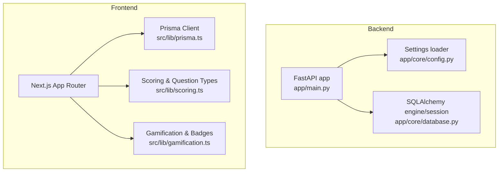
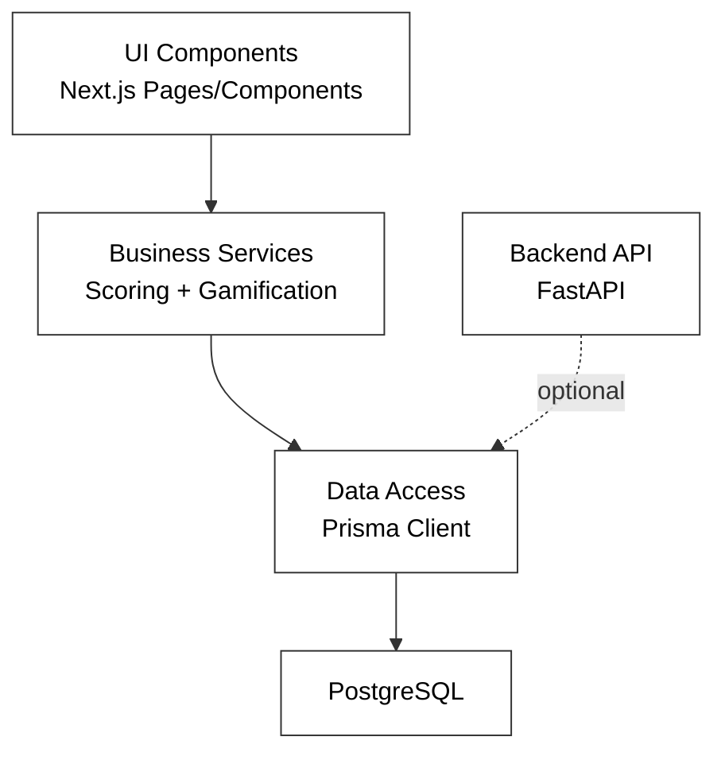
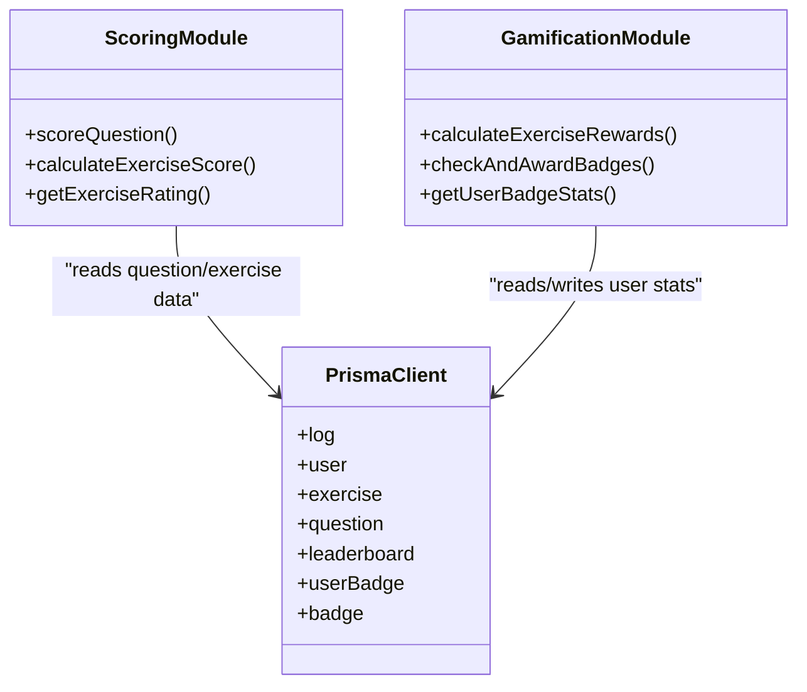
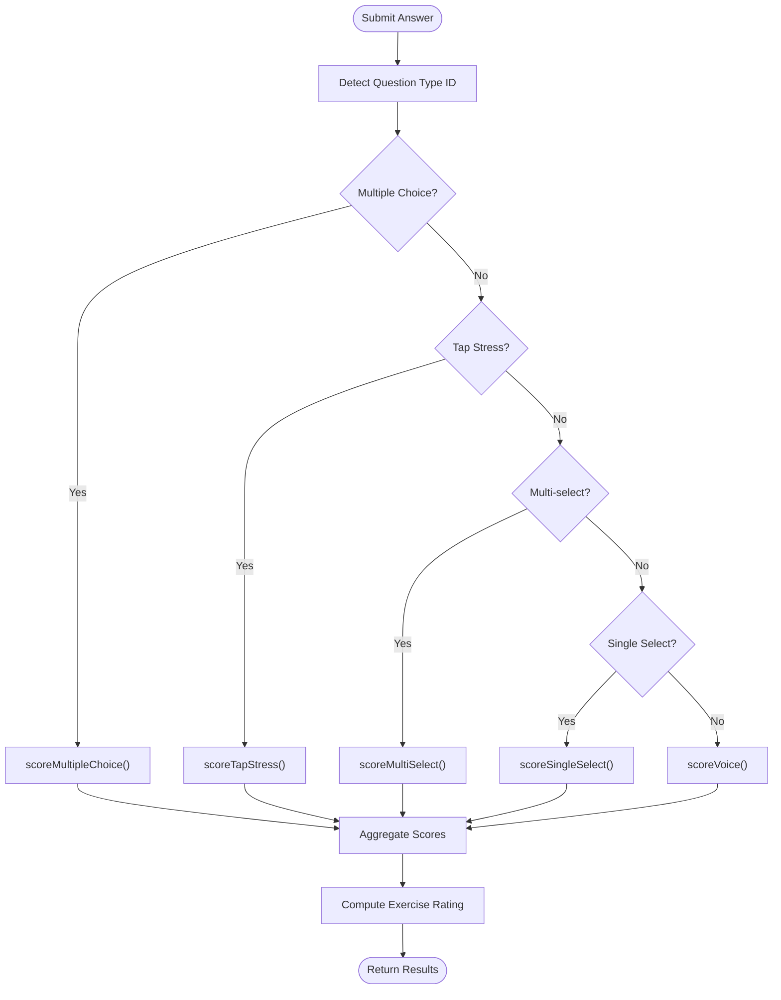
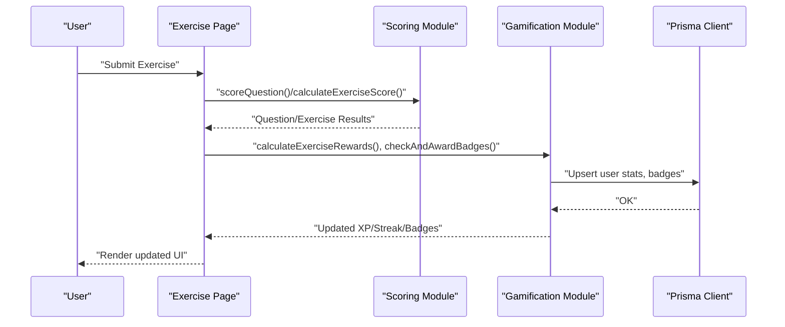
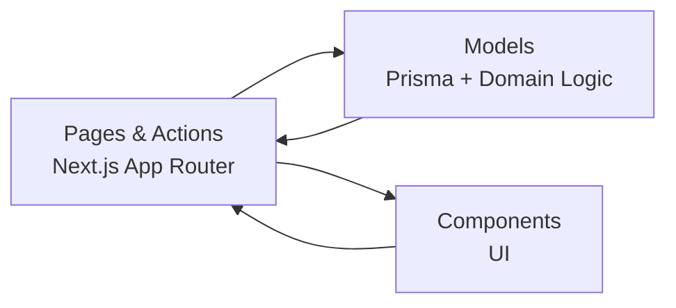
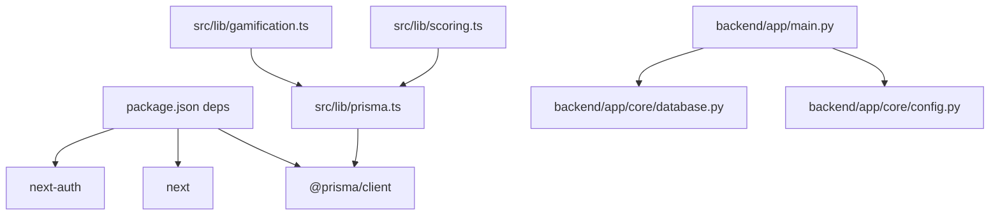

# System Design Patterns

<cite>
**Referenced Files in This Document**
- [english_pronunciation_app/backend/app/main.py](file://english_pronunciation_app/backend/app/main.py)
- [english_pronunciation_app/backend/app/core/config.py](file://english_pronunciation_app/backend/app/core/config.py)
- [english_pronunciation_app/backend/app/core/database.py](file://english_pronunciation_app/backend/app/core/database.py)
- [english_pronunciation_app/frontend/src/lib/prisma.ts](file://english_pronunciation_app/frontend/src/lib/prisma.ts)
- [english_pronunciation_app/frontend/src/lib/gamification.ts](file://english_pronunciation_app/frontend/src/lib/gamification.ts)
- [english_pronunciation_app/frontend/src/lib/scoring.ts](file://english_pronunciation_app/frontend/src/lib/scoring.ts)
- [english_pronunciation_app/frontend/package.json](file://english_pronunciation_app/frontend/package.json)
- [english_pronunciation_app/backend/README.md](file://english_pronunciation_app/backend/README.md)
</cite>

## Table of Contents
1. [Introduction](#introduction)
2. [Project Structure](#project-structure)
3. [Core Components](#core-components)
4. [Architecture Overview](#architecture-overview)
5. [Detailed Component Analysis](#detailed-component-analysis)
6. [Dependency Analysis](#dependency-analysis)
7. [Performance Considerations](#performance-considerations)
8. [Troubleshooting Guide](#troubleshooting-guide)
9. [Conclusion](#conclusion)

## Introduction
This document explains the system design patterns used in Web_HoTroPhatAmEN with a focus on layered architecture, data access abstraction via Prisma, factory-like dynamic exercise/question creation, observer-style gamification updates, and MVC separation in the frontend. It also documents component relationships, architectural decisions, and how these patterns improve maintainability and scalability.

## Project Structure
The system is split into:
- Backend: Minimal FastAPI service exposing health and placeholder endpoints.
- Frontend: Next.js application with Prisma client for data access, scoring and gamification logic, and UI components.

**Diagram sources**
- [english_pronunciation_app/backend/app/main.py:1-43](file://english_pronunciation_app/backend/app/main.py#L1-L43)
- [english_pronunciation_app/backend/app/core/config.py:1-34](file://english_pronunciation_app/backend/app/core/config.py#L1-L34)
- [english_pronunciation_app/backend/app/core/database.py:1-51](file://english_pronunciation_app/backend/app/core/database.py#L1-L51)
- [english_pronunciation_app/frontend/src/lib/prisma.ts:1-13](file://english_pronunciation_app/frontend/src/lib/prisma.ts#L1-L13)
- [english_pronunciation_app/frontend/src/lib/scoring.ts:1-227](file://english_pronunciation_app/frontend/src/lib/scoring.ts#L1-L227)
- [english_pronunciation_app/frontend/src/lib/gamification.ts:1-575](file://english_pronunciation_app/frontend/src/lib/gamification.ts#L1-L575)

**Section sources**
- [english_pronunciation_app/backend/app/main.py:1-43](file://english_pronunciation_app/backend/app/main.py#L1-L43)
- [english_pronunciation_app/backend/app/core/config.py:1-34](file://english_pronunciation_app/backend/app/core/config.py#L1-L34)
- [english_pronunciation_app/backend/app/core/database.py:1-51](file://english_pronunciation_app/backend/app/core/database.py#L1-L51)
- [english_pronunciation_app/frontend/src/lib/prisma.ts:1-13](file://english_pronunciation_app/frontend/src/lib/prisma.ts#L1-L13)
- [english_pronunciation_app/frontend/src/lib/scoring.ts:1-227](file://english_pronunciation_app/frontend/src/lib/scoring.ts#L1-L227)
- [english_pronunciation_app/frontend/src/lib/gamification.ts:1-575](file://english_pronunciation_app/frontend/src/lib/gamification.ts#L1-L575)
- [english_pronunciation_app/frontend/package.json:1-45](file://english_pronunciation_app/frontend/package.json#L1-L45)
- [english_pronunciation_app/backend/README.md:1-52](file://english_pronunciation_app/backend/README.md#L1-L52)

## Core Components
- Presentation layer (Frontend):
  - Next.js App Router pages and components.
  - Prisma client for data access.
  - Scoring module for question-type-specific scoring.
  - Gamification module for XP, streaks, leaderboards, and badges.
- Business logic layer (Frontend):
  - Scoring and rating calculations.
  - Gamification reward computation and badge checks.
- Data layer (Frontend):
  - Prisma client initialized as a singleton.
  - No backend persistence yet; backend exposes health endpoint.

Key pattern highlights:
- Layered architecture separates concerns across presentation, business, and data.
- Repository-like abstraction via Prisma client encapsulates queries.
- Factory-like dispatch in scoring based on question type.
- Observer-style gamification updates computed and propagated to UI.

**Section sources**
- [english_pronunciation_app/frontend/src/lib/prisma.ts:1-13](file://english_pronunciation_app/frontend/src/lib/prisma.ts#L1-L13)
- [english_pronunciation_app/frontend/src/lib/scoring.ts:1-227](file://english_pronunciation_app/frontend/src/lib/scoring.ts#L1-L227)
- [english_pronunciation_app/frontend/src/lib/gamification.ts:1-575](file://english_pronunciation_app/frontend/src/lib/gamification.ts#L1-L575)
- [english_pronunciation_app/backend/app/main.py:1-43](file://english_pronunciation_app/backend/app/main.py#L1-L43)

## Architecture Overview
The system follows a layered architecture:
- Presentation: Next.js pages and components render views and orchestrate user actions.
- Business: Scoring and gamification modules encapsulate domain logic.
- Data: Prisma client abstracts database operations; backend provides optional database health check.

**Diagram sources**
- [english_pronunciation_app/frontend/src/lib/prisma.ts:1-13](file://english_pronunciation_app/frontend/src/lib/prisma.ts#L1-L13)
- [english_pronunciation_app/frontend/src/lib/scoring.ts:1-227](file://english_pronunciation_app/frontend/src/lib/scoring.ts#L1-L227)
- [english_pronunciation_app/frontend/src/lib/gamification.ts:1-575](file://english_pronunciation_app/frontend/src/lib/gamification.ts#L1-L575)
- [english_pronunciation_app/backend/app/main.py:1-43](file://english_pronunciation_app/backend/app/main.py#L1-L43)

## Detailed Component Analysis

### Layered Architecture Pattern
- Presentation layer:
  - Next.js pages and components handle rendering and user interactions.
  - Example: exercise pages and feedback sheets.
- Business layer:
  - Scoring module computes question scores and exercise ratings.
  - Gamification module computes XP, streaks, and badge progress.
- Data layer:
  - Prisma client provides typed database access.
  - Backend health endpoint validates database connectivity.

Benefits:
- Clear separation of concerns improves testability and modularity.
- Changes in UI or data schema are isolated within their layers.

**Section sources**
- [english_pronunciation_app/frontend/src/lib/scoring.ts:1-227](file://english_pronunciation_app/frontend/src/lib/scoring.ts#L1-L227)
- [english_pronunciation_app/frontend/src/lib/gamification.ts:1-575](file://english_pronunciation_app/frontend/src/lib/gamification.ts#L1-L575)
- [english_pronunciation_app/frontend/src/lib/prisma.ts:1-13](file://english_pronunciation_app/frontend/src/lib/prisma.ts#L1-L13)
- [english_pronunciation_app/backend/app/main.py:1-43](file://english_pronunciation_app/backend/app/main.py#L1-L43)

### Repository Pattern with Prisma ORM
- Abstraction: Prisma client acts as a repository facade, hiding SQL and providing CRUD operations.
- Encapsulation: Queries are centralized in the client, enabling easy mocking and testing.
- Scalability: Prisma’s type safety reduces runtime errors and simplifies refactoring.

Implementation highlights:
- Singleton client initialization prevents multiple instances during development.
- Client is injected into business logic functions for transaction-safe operations.

**Diagram sources**
- [english_pronunciation_app/frontend/src/lib/prisma.ts:1-13](file://english_pronunciation_app/frontend/src/lib/prisma.ts#L1-L13)
- [english_pronunciation_app/frontend/src/lib/scoring.ts:1-227](file://english_pronunciation_app/frontend/src/lib/scoring.ts#L1-L227)
- [english_pronunciation_app/frontend/src/lib/gamification.ts:1-575](file://english_pronunciation_app/frontend/src/lib/gamification.ts#L1-L575)

**Section sources**
- [english_pronunciation_app/frontend/src/lib/prisma.ts:1-13](file://english_pronunciation_app/frontend/src/lib/prisma.ts#L1-L13)
- [english_pronunciation_app/frontend/src/lib/gamification.ts:24-26](file://english_pronunciation_app/frontend/src/lib/gamification.ts#L24-L26)

### Factory Pattern for Dynamic Exercise and Question Creation
- Dispatch by type: The scoring module selects a scoring strategy based on question type identifiers.
- Benefits:
  - Extensible: New question types can be added with minimal changes.
  - Cohesion: Each scoring branch encapsulates type-specific logic.

**Diagram sources**
- [english_pronunciation_app/frontend/src/lib/scoring.ts:191-201](file://english_pronunciation_app/frontend/src/lib/scoring.ts#L191-L201)

**Section sources**
- [english_pronunciation_app/frontend/src/lib/scoring.ts:191-201](file://english_pronunciation_app/frontend/src/lib/scoring.ts#L191-L201)

### Observer Pattern for Real-Time Gamification Updates
- Event-driven updates: Gamification computations (XP, streaks, badges) are triggered upon exercise submission and daily check-ins.
- Decoupled propagation: UI components subscribe to state changes (e.g., XP bar, streak badge, leaderboard updates) without tight coupling to the scoring pipeline.

**Diagram sources**
- [english_pronunciation_app/frontend/src/lib/scoring.ts:203-227](file://english_pronunciation_app/frontend/src/lib/scoring.ts#L203-L227)
- [english_pronunciation_app/frontend/src/lib/gamification.ts:195-234](file://english_pronunciation_app/frontend/src/lib/gamification.ts#L195-L234)
- [english_pronunciation_app/frontend/src/lib/gamification.ts:490-531](file://english_pronunciation_app/frontend/src/lib/gamification.ts#L490-L531)
- [english_pronunciation_app/frontend/src/lib/prisma.ts:1-13](file://english_pronunciation_app/frontend/src/lib/prisma.ts#L1-L13)

**Section sources**
- [english_pronunciation_app/frontend/src/lib/gamification.ts:195-234](file://english_pronunciation_app/frontend/src/lib/gamification.ts#L195-L234)
- [english_pronunciation_app/frontend/src/lib/gamification.ts:490-531](file://english_pronunciation_app/frontend/src/lib/gamification.ts#L490-L531)

### MVC Pattern Separation (Model-View-Controller)
- Model: Prisma client and domain modules (scoring, gamification) manage data and business rules.
- View: Next.js components render UI and present user feedback.
- Controller: Pages and server actions coordinate user interactions, fetch data, and trigger business logic.

**Diagram sources**
- [english_pronunciation_app/frontend/src/lib/prisma.ts:1-13](file://english_pronunciation_app/frontend/src/lib/prisma.ts#L1-L13)
- [english_pronunciation_app/frontend/src/lib/scoring.ts:1-227](file://english_pronunciation_app/frontend/src/lib/scoring.ts#L1-L227)
- [english_pronunciation_app/frontend/src/lib/gamification.ts:1-575](file://english_pronunciation_app/frontend/src/lib/gamification.ts#L1-L575)

**Section sources**
- [english_pronunciation_app/frontend/src/lib/prisma.ts:1-13](file://english_pronunciation_app/frontend/src/lib/prisma.ts#L1-L13)
- [english_pronunciation_app/frontend/src/lib/scoring.ts:1-227](file://english_pronunciation_app/frontend/src/lib/scoring.ts#L1-L227)
- [english_pronunciation_app/frontend/src/lib/gamification.ts:1-575](file://english_pronunciation_app/frontend/src/lib/gamification.ts#L1-L575)

## Dependency Analysis
- Frontend depends on Prisma client and Next.js ecosystem.
- Backend depends on configuration and SQLAlchemy for optional database checks.
- Scoring and gamification modules depend on Prisma client for data access.

**Diagram sources**
- [english_pronunciation_app/frontend/package.json:17-26](file://english_pronunciation_app/frontend/package.json#L17-L26)
- [english_pronunciation_app/frontend/src/lib/prisma.ts:1-13](file://english_pronunciation_app/frontend/src/lib/prisma.ts#L1-L13)
- [english_pronunciation_app/frontend/src/lib/scoring.ts:1-227](file://english_pronunciation_app/frontend/src/lib/scoring.ts#L1-L227)
- [english_pronunciation_app/frontend/src/lib/gamification.ts:1-575](file://english_pronunciation_app/frontend/src/lib/gamification.ts#L1-L575)
- [english_pronunciation_app/backend/app/main.py:1-43](file://english_pronunciation_app/backend/app/main.py#L1-L43)
- [english_pronunciation_app/backend/app/core/config.py:1-34](file://english_pronunciation_app/backend/app/core/config.py#L1-L34)
- [english_pronunciation_app/backend/app/core/database.py:1-51](file://english_pronunciation_app/backend/app/core/database.py#L1-L51)

**Section sources**
- [english_pronunciation_app/frontend/package.json:1-45](file://english_pronunciation_app/frontend/package.json#L1-L45)
- [english_pronunciation_app/frontend/src/lib/prisma.ts:1-13](file://english_pronunciation_app/frontend/src/lib/prisma.ts#L1-L13)
- [english_pronunciation_app/backend/app/main.py:1-43](file://english_pronunciation_app/backend/app/main.py#L1-L43)
- [english_pronunciation_app/backend/app/core/config.py:1-34](file://english_pronunciation_app/backend/app/core/config.py#L1-L34)
- [english_pronunciation_app/backend/app/core/database.py:1-51](file://english_pronunciation_app/backend/app/core/database.py#L1-L51)

## Performance Considerations
- Prisma client:
  - Use transactions for related writes to reduce round-trips.
  - Prefer selective field queries to minimize payload sizes.
- Scoring:
  - Avoid repeated normalization work; cache intermediate tokens if reused.
- Gamification:
  - Batch badge checks and leaderboard reads to reduce DB load.
- Backend:
  - Keep database checks lightweight; avoid heavy operations in health endpoints.

## Troubleshooting Guide
- Database connectivity:
  - Backend health endpoint reports database status when DATABASE_URL is set.
- CORS issues:
  - Configure allowed origins via environment variables; verify comma-separated values.
- Prisma client:
  - Ensure singleton initialization avoids multiple clients in development.
- Scoring edge cases:
  - Verify question type IDs and accepted answers arrays to prevent misclassification.

**Section sources**
- [english_pronunciation_app/backend/app/main.py:34-42](file://english_pronunciation_app/backend/app/main.py#L34-L42)
- [english_pronunciation_app/backend/app/core/config.py:23-33](file://english_pronunciation_app/backend/app/core/config.py#L23-L33)
- [english_pronunciation_app/backend/app/core/database.py:31-50](file://english_pronunciation_app/backend/app/core/database.py#L31-L50)
- [english_pronunciation_app/frontend/src/lib/prisma.ts:3-12](file://english_pronunciation_app/frontend/src/lib/prisma.ts#L3-L12)
- [english_pronunciation_app/frontend/src/lib/scoring.ts:80-93](file://english_pronunciation_app/frontend/src/lib/scoring.ts#L80-L93)

## Conclusion
Web_HoTroPhatAmEN applies layered architecture, repository-like Prisma abstraction, factory-style scoring dispatch, observer-style gamification updates, and MVC separation to achieve clean separation of concerns. These patterns collectively enhance maintainability, testability, and scalability while preparing the system for future enhancements such as pronunciation scoring and analytics.