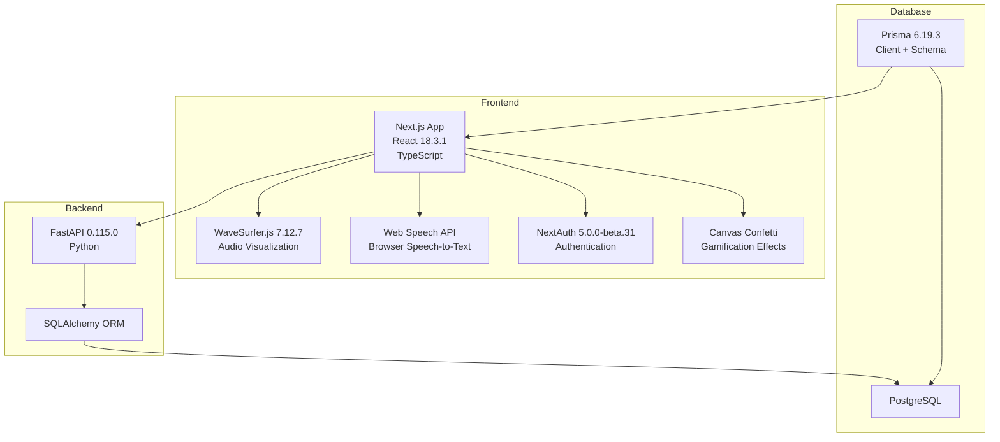
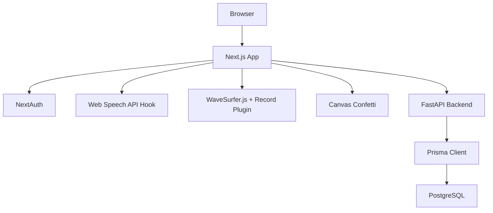
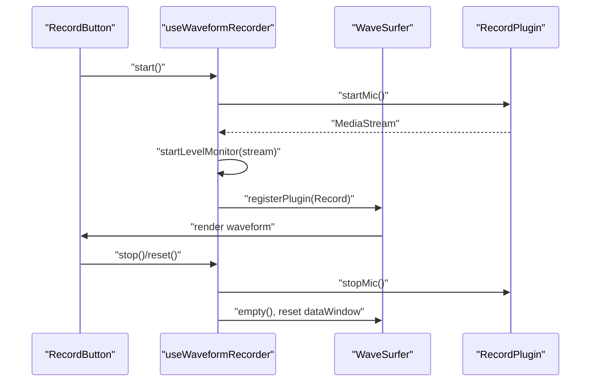
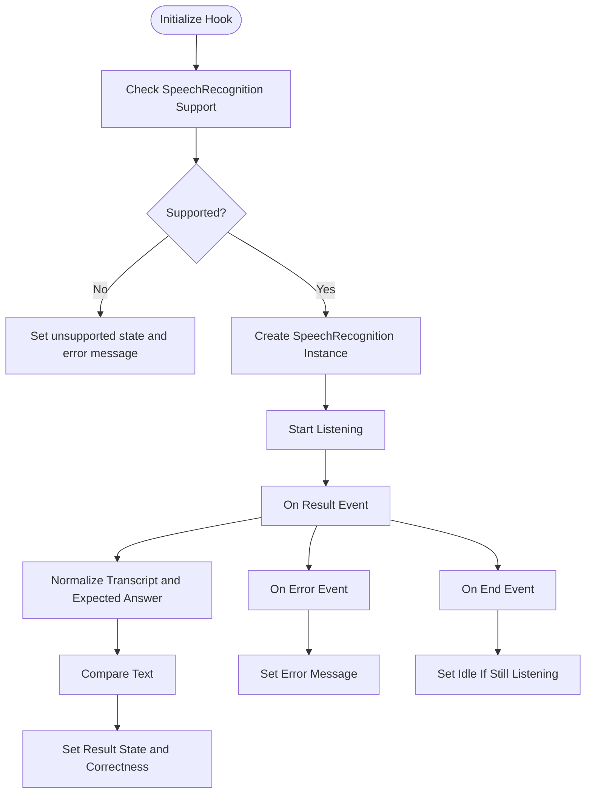
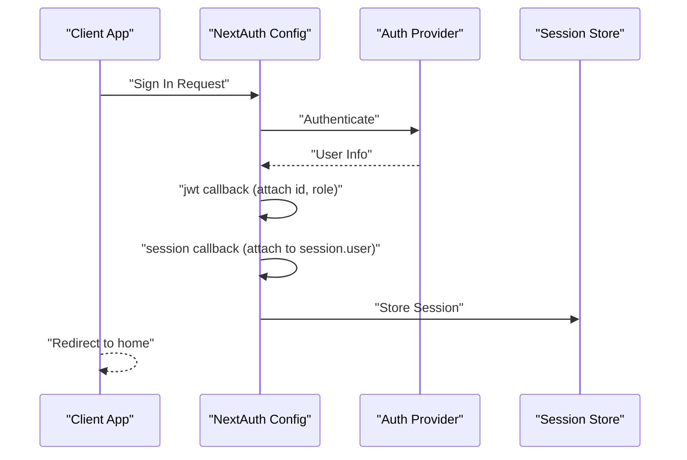
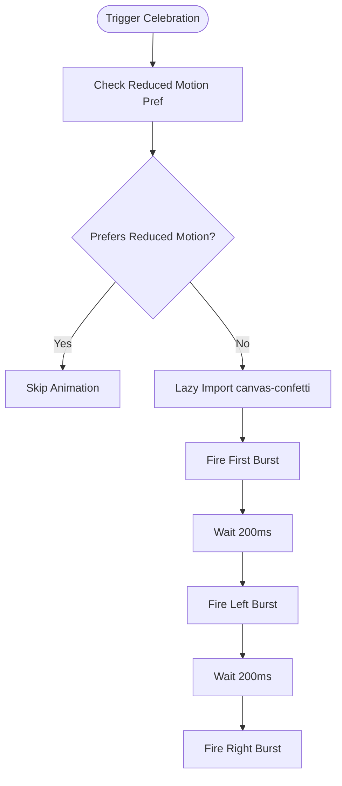
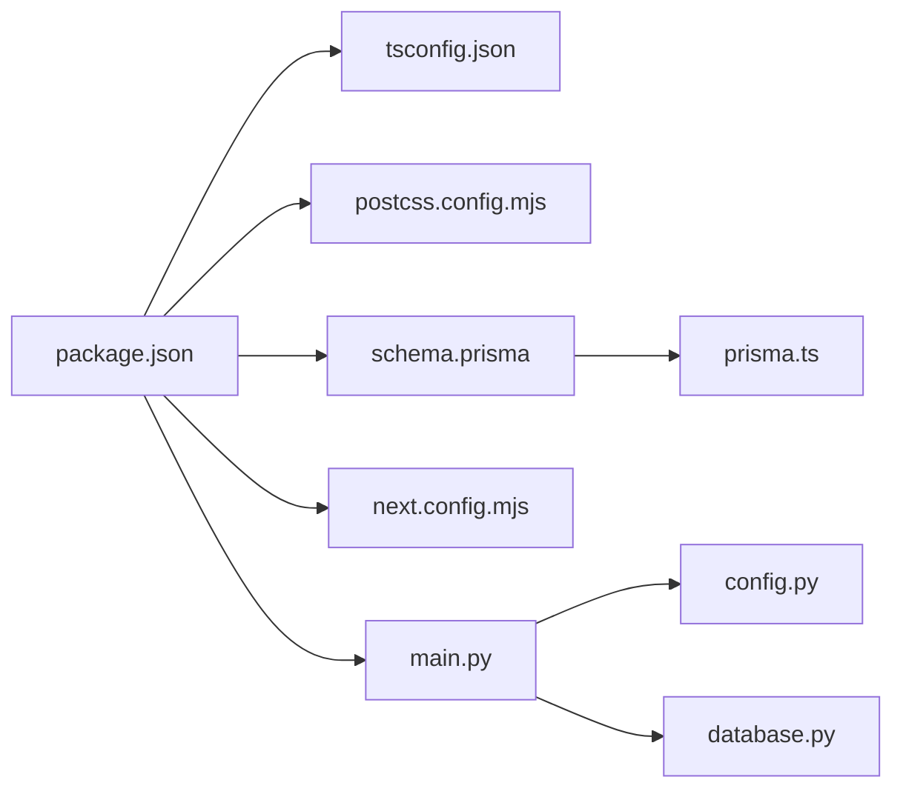

# Technology Stack

<cite>
**Referenced Files in This Document**
- [package.json](file://english_pronunciation_app/frontend/package.json)
- [tsconfig.json](file://english_pronunciation_app/frontend/tsconfig.json)
- [next.config.mjs](file://english_pronunciation_app/frontend/next.config.mjs)
- [postcss.config.mjs](file://english_pronunciation_app/frontend/postcss.config.mjs)
- [schema.prisma](file://english_pronunciation_app/frontend/prisma/schema.prisma)
- [prisma.ts](file://english_pronunciation_app/frontend/src/lib/prisma.ts)
- [auth.config.ts](file://english_pronunciation_app/frontend/src/lib/auth.config.ts)
- [useSpeechRecognition.ts](file://english_pronunciation_app/frontend/src/hooks/useSpeechRecognition.ts)
- [useWaveformRecorder.ts](file://english_pronunciation_app/frontend/src/hooks/useWaveformRecorder.ts)
- [RecordButton.tsx](file://english_pronunciation_app/frontend/src/components/audio/RecordButton.tsx)
- [confetti.ts](file://english_pronunciation_app/frontend/src/lib/confetti.ts)
- [main.py](file://english_pronunciation_app/backend/app/main.py)
- [config.py](file://english_pronunciation_app/backend/app/core/config.py)
- [database.py](file://english_pronunciation_app/backend/app/core/database.py)
- [README.md](file://english_pronunciation_app/backend/README.md)
</cite>

## Table of Contents
1. [Introduction](#introduction)
2. [Project Structure](#project-structure)
3. [Core Components](#core-components)
4. [Architecture Overview](#architecture-overview)
5. [Detailed Component Analysis](#detailed-component-analysis)
6. [Dependency Analysis](#dependency-analysis)
7. [Performance Considerations](#performance-considerations)
8. [Troubleshooting Guide](#troubleshooting-guide)
9. [Conclusion](#conclusion)

## Introduction
This document provides a comprehensive technology stack overview for Web_HoTroPhatAmEN. It covers the frontend (Next.js, TypeScript, Tailwind CSS, React, WaveSurfer.js), backend (FastAPI, Python, PostgreSQL via SQLAlchemy), database layer (Prisma), speech recognition (Web Speech API), authentication (NextAuth), and gamification (Canvas Confetti). It also documents version compatibility, upgrade paths, rationale for technology choices, and dependency/build configuration details.

## Project Structure
The project follows a clear separation of concerns:
- Frontend: Next.js 16.2.7 application with TypeScript, Tailwind CSS, and React 18.3.1
- Backend: Minimal FastAPI 0.115.0 service written in Python
- Database: PostgreSQL with Prisma 6.19.3 ORM and SQLAlchemy for database connectivity
- Speech Recognition: Web Speech API for browser-based speech-to-text
- Authentication: NextAuth 5.0.0-beta.31
- Gamification: Canvas Confetti for celebratory effects

**Diagram sources**
- [package.json:17-26](file://english_pronunciation_app/frontend/package.json#L17-L26)
- [main.py:10-22](file://english_pronunciation_app/backend/app/main.py#L10-L22)
- [schema.prisma:1-8](file://english_pronunciation_app/frontend/prisma/schema.prisma#L1-L8)
- [prisma.ts:6-12](file://english_pronunciation_app/frontend/src/lib/prisma.ts#L6-L12)

**Section sources**
- [package.json:17-26](file://english_pronunciation_app/frontend/package.json#L17-L26)
- [README.md:1-52](file://english_pronunciation_app/backend/README.md#L1-L52)

## Core Components
- Frontend framework and runtime: Next.js 16.2.7 with React 18.3.1 and TypeScript 6.x
- Styling and build pipeline: Tailwind CSS 4.3.0 with PostCSS and Autoprefixer
- Audio visualization and recording: WaveSurfer.js 7.12.7 with Record plugin
- Speech recognition: Web Speech API via a custom React hook
- Authentication: NextAuth 5.0.0-beta.31 with custom JWT/session callbacks
- Database ORM: Prisma 6.19.3 client and schema for PostgreSQL
- Backend API: FastAPI 0.115.0 with CORS middleware and health endpoint
- Gamification: Canvas Confetti for celebratory animations

**Section sources**
- [package.json:17-40](file://english_pronunciation_app/frontend/package.json#L17-L40)
- [tsconfig.json:24-28](file://english_pronunciation_app/frontend/tsconfig.json#L24-L28)
- [postcss.config.mjs:1-10](file://english_pronunciation_app/frontend/postcss.config.mjs#L1-L10)
- [schema.prisma:1-8](file://english_pronunciation_app/frontend/prisma/schema.prisma#L1-L8)
- [main.py:10-22](file://english_pronunciation_app/backend/app/main.py#L10-L22)

## Architecture Overview
The system architecture separates concerns across frontend, backend, and database layers. The frontend handles UI, audio visualization/recording, speech recognition, authentication, and gamification. The backend exposes a minimal API surface with health checks and CORS support. The database is managed via Prisma with a PostgreSQL provider.

**Diagram sources**
- [RecordButton.tsx:10-19](file://english_pronunciation_app/frontend/src/components/audio/RecordButton.tsx#L10-L19)
- [useSpeechRecognition.ts:15-21](file://english_pronunciation_app/frontend/src/hooks/useSpeechRecognition.ts#L15-L21)
- [useWaveformRecorder.ts:29-59](file://english_pronunciation_app/frontend/src/hooks/useWaveformRecorder.ts#L29-L59)
- [confetti.ts:11-29](file://english_pronunciation_app/frontend/src/lib/confetti.ts#L11-L29)
- [main.py:25-42](file://english_pronunciation_app/backend/app/main.py#L25-L42)
- [schema.prisma:5-8](file://english_pronunciation_app/frontend/prisma/schema.prisma#L5-L8)
- [prisma.ts:6-12](file://english_pronunciation_app/frontend/src/lib/prisma.ts#L6-L12)

## Detailed Component Analysis

### Frontend Stack
- Next.js 16.2.7: Application shell and routing powered by App Router
- React 18.3.1: UI components and hooks ecosystem
- TypeScript 6.x: Type-safe development with strict mode enabled
- Tailwind CSS 4.3.0 + PostCSS + Autoprefixer: Utility-first styling and build pipeline
- WaveSurfer.js 7.12.7: Audio waveform rendering and recording visualization
- Web Speech API: Browser-based speech-to-text via a custom React hook
- NextAuth 5.0.0-beta.31: Authentication with custom JWT/session callbacks
- Canvas Confetti: Lightweight, lazy-loaded confetti effects

Key configuration highlights:
- Path aliases via tsconfig.json map @/* to ./src/*
- Next.js config remains minimal
- PostCSS pipeline includes Tailwind and Autoprefixer
- Scripts include dev, build, start, lint, and Prisma seed commands

**Section sources**
- [package.json:6-13](file://english_pronunciation_app/frontend/package.json#L6-L13)
- [tsconfig.json:24-28](file://english_pronunciation_app/frontend/tsconfig.json#L24-L28)
- [next.config.mjs:1-5](file://english_pronunciation_app/frontend/next.config.mjs#L1-L5)
- [postcss.config.mjs:1-10](file://english_pronunciation_app/frontend/postcss.config.mjs#L1-L10)

### Audio Visualization and Recording (WaveSurfer.js)
The audio recording and visualization feature integrates WaveSurfer.js with its Record plugin. It provides real-time RMS-based volume feedback with dynamic waveform coloring and supports clearing old recordings to prevent artifact stacking.

**Diagram sources**
- [RecordButton.tsx:83-91](file://english_pronunciation_app/frontend/src/components/audio/RecordButton.tsx#L83-L91)
- [useWaveformRecorder.ts:99-123](file://english_pronunciation_app/frontend/src/hooks/useWaveformRecorder.ts#L99-L123)
- [useWaveformRecorder.ts:47-58](file://english_pronunciation_app/frontend/src/hooks/useWaveformRecorder.ts#L47-L58)

**Section sources**
- [useWaveformRecorder.ts:29-139](file://english_pronunciation_app/frontend/src/hooks/useWaveformRecorder.ts#L29-L139)
- [RecordButton.tsx:10-129](file://english_pronunciation_app/frontend/src/components/audio/RecordButton.tsx#L10-L129)

### Speech Recognition (Web Speech API)
The speech recognition hook wraps the browser’s SpeechRecognition API, normalizes input, and compares against an expected answer. It manages lifecycle events (result, error, end) and provides user feedback.

**Diagram sources**
- [useSpeechRecognition.ts:25-84](file://english_pronunciation_app/frontend/src/hooks/useSpeechRecognition.ts#L25-L84)
- [useSpeechRecognition.ts:60-83](file://english_pronunciation_app/frontend/src/hooks/useSpeechRecognition.ts#L60-L83)

**Section sources**
- [useSpeechRecognition.ts:15-111](file://english_pronunciation_app/frontend/src/hooks/useSpeechRecognition.ts#L15-L111)

### Authentication (NextAuth 5.0.0-beta.31)
NextAuth is configured with custom JWT and session callbacks to attach user ID and role to tokens and sessions. Pages are redirected to the login page as needed.

**Diagram sources**
- [auth.config.ts:3-24](file://english_pronunciation_app/frontend/src/lib/auth.config.ts#L3-L24)

**Section sources**
- [auth.config.ts:1-25](file://english_pronunciation_app/frontend/src/lib/auth.config.ts#L1-L25)

### Gamification (Canvas Confetti)
Confetti is lazily imported and executed only when reduced motion preferences are not enabled. It triggers celebratory bursts upon successful exercise completion.

**Diagram sources**
- [confetti.ts:4-29](file://english_pronunciation_app/frontend/src/lib/confetti.ts#L4-L29)

**Section sources**
- [confetti.ts:1-30](file://english_pronunciation_app/frontend/src/lib/confetti.ts#L1-L30)

### Backend Stack (FastAPI)
The backend is a minimal FastAPI service exposing:
- GET /: Basic service metadata
- GET /health: Status, environment, version, and database connectivity

It uses CORS middleware and environment-driven configuration.

**Section sources**
- [main.py:25-42](file://english_pronunciation_app/backend/app/main.py#L25-L42)
- [config.py:9-33](file://english_pronunciation_app/backend/app/core/config.py#L9-L33)
- [database.py:20-50](file://english_pronunciation_app/backend/app/core/database.py#L20-L50)
- [README.md:43-52](file://english_pronunciation_app/backend/README.md#L43-L52)

### Database Stack (Prisma + PostgreSQL)
Prisma is configured with:
- Generator: prisma-client-js
- Datasource: PostgreSQL provider bound to DATABASE_URL
- Client usage: Singleton pattern to avoid multiple instances during development

The schema defines comprehensive models for users, roles, gamification, exercises, questions, answers, and related entities.

**Section sources**
- [schema.prisma:1-8](file://english_pronunciation_app/frontend/prisma/schema.prisma#L1-L8)
- [prisma.ts:3-12](file://english_pronunciation_app/frontend/src/lib/prisma.ts#L3-L12)

## Dependency Analysis
Frontend dependencies and scripts:
- Runtime: Next.js, React, NextAuth, WaveSurfer.js, canvas-confetti
- Dev tooling: TypeScript, Tailwind CSS, PostCSS, Prisma, Autoprefixer
- Scripts: dev, build, start, lint, db:seed:lessons

Backend dependencies and environment:
- FastAPI, SQLAlchemy, Uvicorn for local development
- Environment variables for database URL and CORS origins

**Diagram sources**
- [package.json:6-13](file://english_pronunciation_app/frontend/package.json#L6-L13)
- [tsconfig.json:24-28](file://english_pronunciation_app/frontend/tsconfig.json#L24-L28)
- [postcss.config.mjs:1-10](file://english_pronunciation_app/frontend/postcss.config.mjs#L1-L10)
- [schema.prisma:1-8](file://english_pronunciation_app/frontend/prisma/schema.prisma#L1-L8)
- [prisma.ts:6-12](file://english_pronunciation_app/frontend/src/lib/prisma.ts#L6-L12)
- [next.config.mjs:1-5](file://english_pronunciation_app/frontend/next.config.mjs#L1-L5)
- [main.py:10-22](file://english_pronunciation_app/backend/app/main.py#L10-L22)
- [config.py:23-33](file://english_pronunciation_app/backend/app/core/config.py#L23-L33)
- [database.py:10-29](file://english_pronunciation_app/backend/app/core/database.py#L10-L29)

**Section sources**
- [package.json:6-44](file://english_pronunciation_app/frontend/package.json#L6-L44)
- [README.md:11-32](file://english_pronunciation_app/backend/README.md#L11-L32)

## Performance Considerations
- Frontend
  - Use of lazy loading for Canvas Confetti reduces initial bundle size.
  - WaveSurfer.js with scrolling waveform and minimal rendering improves responsiveness during recording.
  - Strict TypeScript configuration helps catch performance-related issues early.
- Backend
  - Health endpoint performs a simple SELECT 1 to verify database connectivity.
  - CORS configuration restricts origins to known frontend hosts.
- Database
  - Prisma client singleton prevents excessive connections in development.
  - PostgreSQL provider ensures efficient schema migrations and queries.

[No sources needed since this section provides general guidance]

## Troubleshooting Guide
- Next.js development server fails to start
  - Verify Node.js and npm/yarn versions compatible with Next.js 16.2.7 and TypeScript 6.x.
  - Ensure PATH aliases in tsconfig.json are correctly mapped.
- WaveSurfer.js recording not visible
  - Confirm browser supports the Record plugin and microphone permissions are granted.
  - Check that the container element exists and WaveSurfer is initialized with proper options.
- Speech recognition errors
  - Some browsers do not support the Web Speech API; the hook sets an unsupported state and error message.
  - Ensure the expected answer normalization matches user input expectations.
- NextAuth authentication issues
  - Verify environment variables for NextAuth providers and session secrets.
  - Check JWT/session callbacks for correct attachment of user ID and role.
- Backend health check failures
  - Confirm DATABASE_URL is set and reachable.
  - Validate CORS_ORIGINS includes frontend origins.
- Prisma client errors
  - Ensure DATABASE_URL is configured and Prisma migrations are applied.
  - Confirm the Prisma client singleton pattern is respected during development.

**Section sources**
- [useWaveformRecorder.ts:38-59](file://english_pronunciation_app/frontend/src/hooks/useWaveformRecorder.ts#L38-L59)
- [useSpeechRecognition.ts:25-41](file://english_pronunciation_app/frontend/src/hooks/useSpeechRecognition.ts#L25-L41)
- [auth.config.ts:8-23](file://english_pronunciation_app/frontend/src/lib/auth.config.ts#L8-L23)
- [main.py:34-42](file://english_pronunciation_app/backend/app/main.py#L34-L42)
- [config.py:31-33](file://english_pronunciation_app/backend/app/core/config.py#L31-L33)
- [database.py:31-50](file://english_pronunciation_app/backend/app/core/database.py#L31-L50)
- [prisma.ts:3-12](file://english_pronunciation_app/frontend/src/lib/prisma.ts#L3-L12)

## Conclusion
Web_HoTroPhatAmEN leverages a modern, modular stack combining Next.js 16.2.7 with React 18.3.1 and TypeScript, Tailwind CSS for styling, WaveSurfer.js for audio visualization, Web Speech API for speech recognition, NextAuth for authentication, and Prisma with PostgreSQL for data persistence. The backend is a lean FastAPI service with health checks and CORS support. The architecture balances developer productivity, user experience, and maintainability, with clear separation between frontend, backend, and database layers.