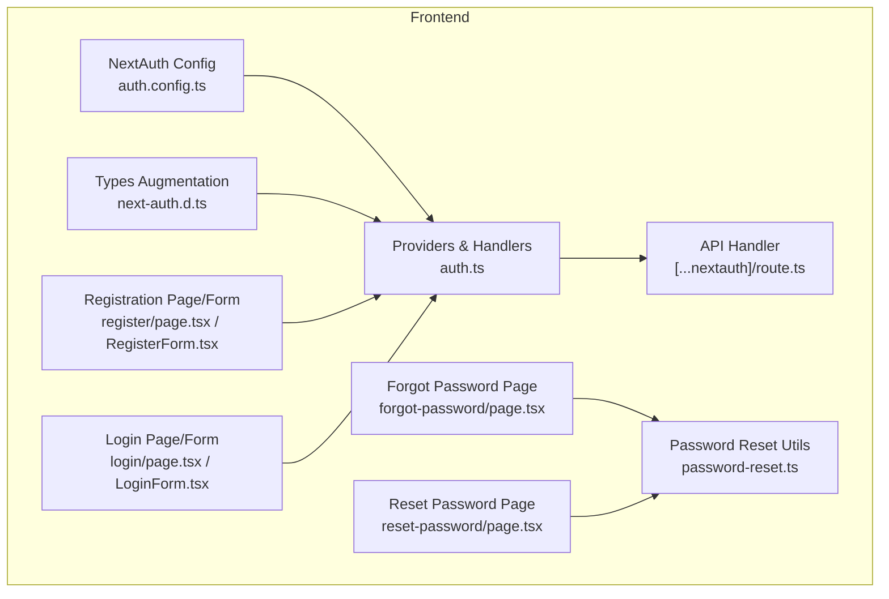
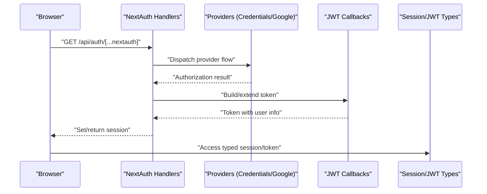
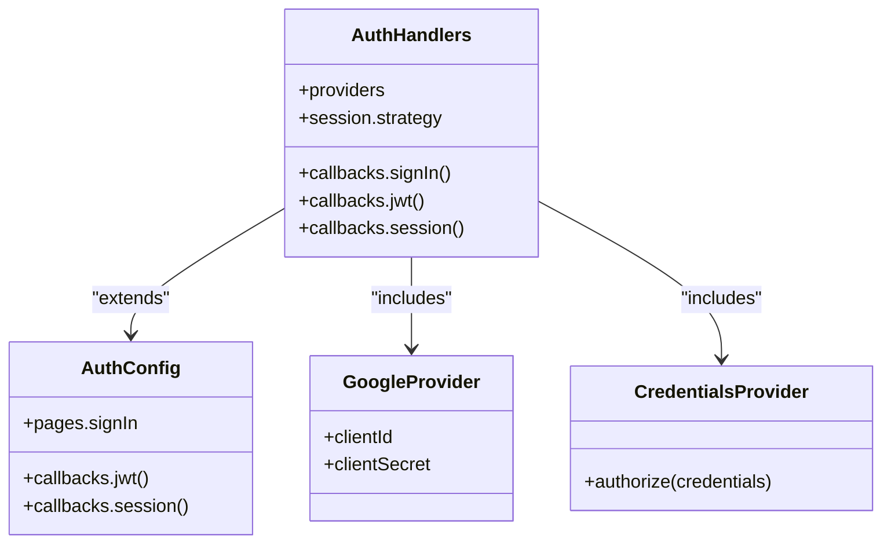
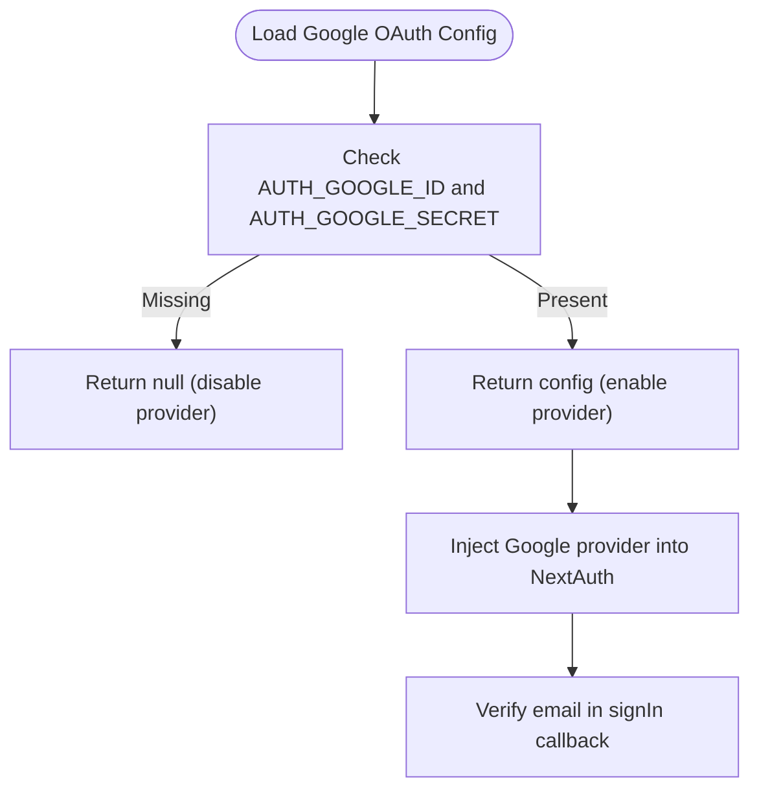
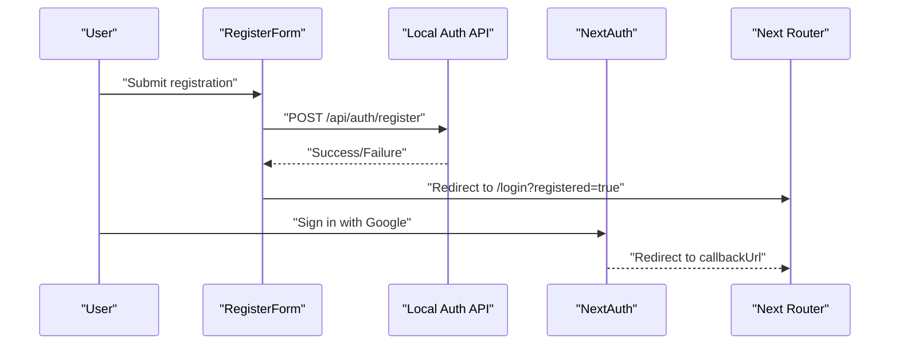
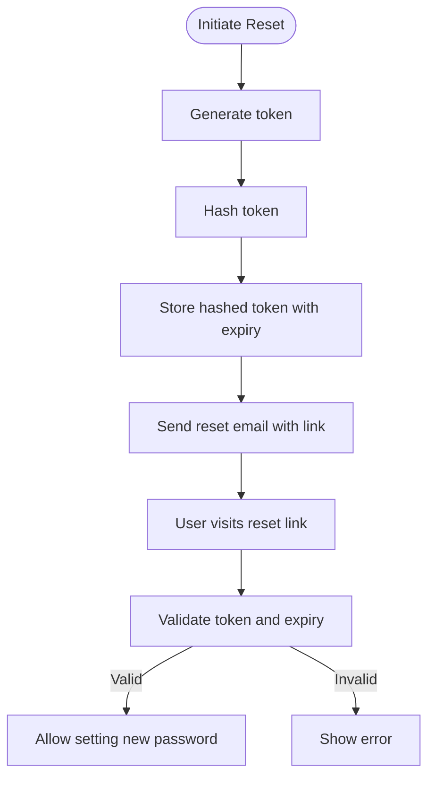
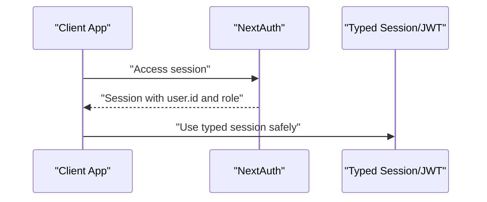
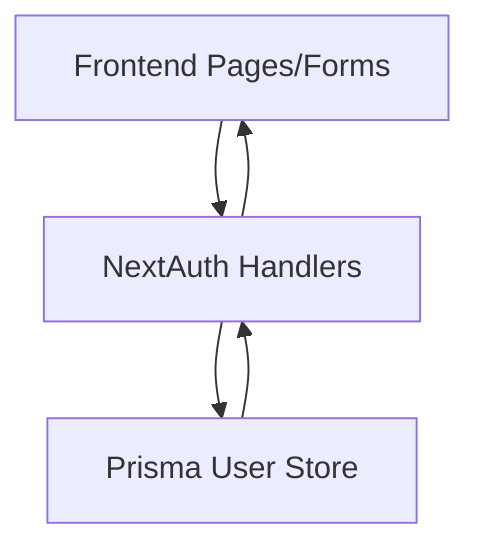
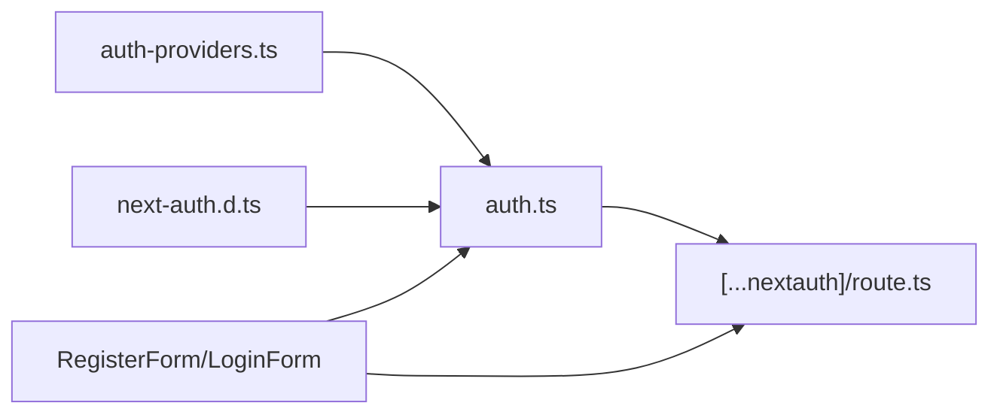

# Authentication System

<cite>
**Referenced Files in This Document**
- [auth.ts](file://english_pronunciation_app/frontend/src/lib/auth.ts)
- [auth.config.ts](file://english_pronunciation_app/frontend/src/lib/auth.config.ts)
- [auth-providers.ts](file://english_pronunciation_app/frontend/src/lib/auth-providers.ts)
- [[...nextauth]/route.ts](file://english_pronunciation_app/frontend/src/app/api/auth/[...nextauth]/route.ts)
- [next-auth.d.ts](file://english_pronunciation_app/frontend/src/types/next-auth.d.ts)
- [RegisterForm.tsx](file://english_pronunciation_app/frontend/src/app/register/RegisterForm.tsx)
- [register/page.tsx](file://english_pronunciation_app/frontend/src/app/register/page.tsx)
- [LoginForm.tsx](file://english_pronunciation_app/frontend/src/app/login/LoginForm.tsx)
- [login/page.tsx](file://english_pronunciation_app/frontend/src/app/login/page.tsx)
- [password-reset.ts](file://english_pronunciation_app/frontend/src/lib/password-reset.ts)
- [forgot-password/page.tsx](file://english_pronunciation_app/frontend/src/app/forgot-password/page.tsx)
- [reset-password/page.tsx](file://english_pronunciation_app/frontend/src/app/reset-password/page.tsx)
</cite>

## Table of Contents
1. [Introduction](#introduction)
2. [Project Structure](#project-structure)
3. [Core Components](#core-components)
4. [Architecture Overview](#architecture-overview)
5. [Detailed Component Analysis](#detailed-component-analysis)
6. [Dependency Analysis](#dependency-analysis)
7. [Performance Considerations](#performance-considerations)
8. [Troubleshooting Guide](#troubleshooting-guide)
9. [Conclusion](#conclusion)

## Introduction
This document explains the authentication and user management system built with NextAuth in the frontend application. It covers provider configuration (including Google OAuth), session management using JWT, user registration and login flows, password reset functionality, and the integration between frontend authentication state and backend user persistence. Security considerations such as CSRF protection, session expiration, and token handling are addressed, along with practical examples mapped to the actual codebase.

## Project Structure
The authentication system spans several frontend modules:
- NextAuth configuration and providers
- API route handler for NextAuth endpoints
- Frontend pages and forms for registration, login, and password reset
- Type augmentations for session and JWT tokens
- Utilities for OAuth provider detection and password reset token handling

**Diagram sources**
- [auth.config.ts:1-25](file://english_pronunciation_app/frontend/src/lib/auth.config.ts#L1-L25)
- [auth.ts:1-151](file://english_pronunciation_app/frontend/src/lib/auth.ts#L1-L151)
- [[...nextauth]/route.ts:1-4](file://english_pronunciation_app/frontend/src/app/api/auth/[...nextauth]/route.ts#L1-L4)
- [next-auth.d.ts:1-22](file://english_pronunciation_app/frontend/src/types/next-auth.d.ts#L1-L22)
- [register/page.tsx:1-40](file://english_pronunciation_app/frontend/src/app/register/page.tsx#L1-L40)
- [RegisterForm.tsx:1-234](file://english_pronunciation_app/frontend/src/app/register/RegisterForm.tsx#L1-L234)
- [login/page.tsx:1-39](file://english_pronunciation_app/frontend/src/app/login/page.tsx#L1-L39)
- [LoginForm.tsx:1-196](file://english_pronunciation_app/frontend/src/app/login/LoginForm.tsx#L1-L196)
- [password-reset.ts:1-39](file://english_pronunciation_app/frontend/src/lib/password-reset.ts#L1-L39)
- [forgot-password/page.tsx:1-15](file://english_pronunciation_app/frontend/src/app/forgot-password/page.tsx#L1-L15)
- [reset-password/page.tsx:1-27](file://english_pronunciation_app/frontend/src/app/reset-password/page.tsx#L1-L27)

**Section sources**
- [auth.config.ts:1-25](file://english_pronunciation_app/frontend/src/lib/auth.config.ts#L1-L25)
- [auth.ts:1-151](file://english_pronunciation_app/frontend/src/lib/auth.ts#L1-L151)
- [[...nextauth]/route.ts:1-4](file://english_pronunciation_app/frontend/src/app/api/auth/[...nextauth]/route.ts#L1-L4)
- [next-auth.d.ts:1-22](file://english_pronunciation_app/frontend/src/types/next-auth.d.ts#L1-L22)
- [register/page.tsx:1-40](file://english_pronunciation_app/frontend/src/app/register/page.tsx#L1-L40)
- [RegisterForm.tsx:1-234](file://english_pronunciation_app/frontend/src/app/register/RegisterForm.tsx#L1-L234)
- [login/page.tsx:1-39](file://english_pronunciation_app/frontend/src/app/login/page.tsx#L1-L39)
- [LoginForm.tsx:1-196](file://english_pronunciation_app/frontend/src/app/login/LoginForm.tsx#L1-L196)
- [password-reset.ts:1-39](file://english_pronunciation_app/frontend/src/lib/password-reset.ts#L1-L39)
- [forgot-password/page.tsx:1-15](file://english_pronunciation_app/frontend/src/app/forgot-password/page.tsx#L1-L15)
- [reset-password/page.tsx:1-27](file://english_pronunciation_app/frontend/src/app/reset-password/page.tsx#L1-L27)

## Core Components
- NextAuth configuration and providers: Defines session strategy, providers, and callbacks for JWT/session propagation.
- Provider utilities: Detects Google OAuth availability and returns client credentials from environment variables.
- API handler: Exposes NextAuth endpoints for GET/POST requests.
- Types augmentation: Extends NextAuth session and JWT types to include user ID and role.
- Registration and login forms: Drive local credential sign-in and Google sign-in flows.
- Password reset utilities: Token generation, hashing, TTL, and URL building for secure reset links.

Key implementation references:
- NextAuth setup and providers: [auth.ts:76-151](file://english_pronunciation_app/frontend/src/lib/auth.ts#L76-L151)
- Session/JWT callbacks: [auth.config.ts:8-23](file://english_pronunciation_app/frontend/src/lib/auth.config.ts#L8-L23)
- Google OAuth detection: [auth-providers.ts:1-15](file://english_pronunciation_app/frontend/src/lib/auth-providers.ts#L1-L15)
- NextAuth API handler: [[...nextauth]/route.ts:1-4](file://english_pronunciation_app/frontend/src/app/api/auth/[...nextauth]/route.ts#L1-L4)
- Session/JWT type extensions: [next-auth.d.ts:3-21](file://english_pronunciation_app/frontend/src/types/next-auth.d.ts#L3-L21)
- Registration flow: [RegisterForm.tsx:52-80](file://english_pronunciation_app/frontend/src/app/register/RegisterForm.tsx#L52-L80)
- Login flow: [LoginForm.tsx:45-70](file://english_pronunciation_app/frontend/src/app/login/LoginForm.tsx#L45-L70)
- Password reset helpers: [password-reset.ts:13-38](file://english_pronunciation_app/frontend/src/lib/password-reset.ts#L13-L38)

**Section sources**
- [auth.ts:76-151](file://english_pronunciation_app/frontend/src/lib/auth.ts#L76-L151)
- [auth.config.ts:8-23](file://english_pronunciation_app/frontend/src/lib/auth.config.ts#L8-L23)
- [auth-providers.ts:1-15](file://english_pronunciation_app/frontend/src/lib/auth-providers.ts#L1-L15)
- [[...nextauth]/route.ts:1-4](file://english_pronunciation_app/frontend/src/app/api/auth/[...nextauth]/route.ts#L1-L4)
- [next-auth.d.ts:3-21](file://english_pronunciation_app/frontend/src/types/next-auth.d.ts#L3-L21)
- [RegisterForm.tsx:52-80](file://english_pronunciation_app/frontend/src/app/register/RegisterForm.tsx#L52-L80)
- [LoginForm.tsx:45-70](file://english_pronunciation_app/frontend/src/app/login/LoginForm.tsx#L45-L70)
- [password-reset.ts:13-38](file://english_pronunciation_app/frontend/src/lib/password-reset.ts#L13-L38)

## Architecture Overview
The system integrates NextAuth with Prisma-backed user storage and supports:
- Local credentials provider with bcrypt password verification
- Google OAuth provider with dynamic configuration
- JWT-based session strategy
- Protected routes via session checks
- Password reset workflow with secure tokens

**Diagram sources**
- [[...nextauth]/route.ts:1-4](file://english_pronunciation_app/frontend/src/app/api/auth/[...nextauth]/route.ts#L1-L4)
- [auth.ts:76-151](file://english_pronunciation_app/frontend/src/lib/auth.ts#L76-L151)
- [auth.config.ts:8-23](file://english_pronunciation_app/frontend/src/lib/auth.config.ts#L8-L23)
- [next-auth.d.ts:3-21](file://english_pronunciation_app/frontend/src/types/next-auth.d.ts#L3-L21)

## Detailed Component Analysis

### NextAuth Configuration and Providers
- Session strategy: JWT
- Providers:
  - Google OAuth: conditionally enabled based on environment variables
  - Credentials provider: validates email/password against Prisma user records
- Callbacks:
  - signIn: ensures verified email for Google
  - jwt: enriches token with user data; for Google, creates or updates user record
  - session: injects user ID and role into session

**Diagram sources**
- [auth.config.ts:3-24](file://english_pronunciation_app/frontend/src/lib/auth.config.ts#L3-L24)
- [auth.ts:76-151](file://english_pronunciation_app/frontend/src/lib/auth.ts#L76-L151)

**Section sources**
- [auth.ts:76-151](file://english_pronunciation_app/frontend/src/lib/auth.ts#L76-L151)
- [auth.config.ts:3-24](file://english_pronunciation_app/frontend/src/lib/auth.config.ts#L3-L24)

### Google OAuth Setup and Dynamic Configuration
- Environment-driven configuration:
  - Reads client ID and secret from environment variables
  - Returns null if either is missing, disabling Google provider
- Provider injection:
  - Google provider is included only when configuration is present
- Sign-in guard:
  - Ensures Google emails are verified before allowing sign-in

**Diagram sources**
- [auth-providers.ts:1-15](file://english_pronunciation_app/frontend/src/lib/auth-providers.ts#L1-L15)
- [auth.ts:80-87](file://english_pronunciation_app/frontend/src/lib/auth.ts#L80-L87)
- [auth.ts:119-125](file://english_pronunciation_app/frontend/src/lib/auth.ts#L119-L125)

**Section sources**
- [auth-providers.ts:1-15](file://english_pronunciation_app/frontend/src/lib/auth-providers.ts#L1-L15)
- [auth.ts:80-87](file://english_pronunciation_app/frontend/src/lib/auth.ts#L80-L87)
- [auth.ts:119-125](file://english_pronunciation_app/frontend/src/lib/auth.ts#L119-L125)

### User Registration and Login Processes
- Registration:
  - Client-side form posts to a local API endpoint
  - On success, redirects to login with a success indicator
  - Supports Google sign-up via NextAuth
- Login:
  - Credentials provider sign-in with redirect control
  - Optional Google sign-in via NextAuth
  - Handles errors and displays user-friendly messages

**Diagram sources**
- [RegisterForm.tsx:52-80](file://english_pronunciation_app/frontend/src/app/register/RegisterForm.tsx#L52-L80)
- [register/page.tsx:25-39](file://english_pronunciation_app/frontend/src/app/register/page.tsx#L25-L39)
- [LoginForm.tsx:45-70](file://english_pronunciation_app/frontend/src/app/login/LoginForm.tsx#L45-L70)
- [login/page.tsx:24-38](file://english_pronunciation_app/frontend/src/app/login/page.tsx#L24-L38)

**Section sources**
- [RegisterForm.tsx:52-80](file://english_pronunciation_app/frontend/src/app/register/RegisterForm.tsx#L52-L80)
- [register/page.tsx:25-39](file://english_pronunciation_app/frontend/src/app/register/page.tsx#L25-L39)
- [LoginForm.tsx:45-70](file://english_pronunciation_app/frontend/src/app/login/LoginForm.tsx#L45-L70)
- [login/page.tsx:24-38](file://english_pronunciation_app/frontend/src/app/login/page.tsx#L24-L38)

### Password Reset Functionality
- Token lifecycle:
  - Generate secure random token
  - Hash token for storage/security
  - Enforce TTL (minutes)
- URL construction:
  - Build reset URL using base URL from environment or request origin
- Frontend pages:
  - Forgot password page triggers reset initiation
  - Reset password page accepts token and sets new password

**Diagram sources**
- [password-reset.ts:13-38](file://english_pronunciation_app/frontend/src/lib/password-reset.ts#L13-L38)
- [forgot-password/page.tsx:1-15](file://english_pronunciation_app/frontend/src/app/forgot-password/page.tsx#L1-L15)
- [reset-password/page.tsx:1-27](file://english_pronunciation_app/frontend/src/app/reset-password/page.tsx#L1-L27)

**Section sources**
- [password-reset.ts:13-38](file://english_pronunciation_app/frontend/src/lib/password-reset.ts#L13-L38)
- [forgot-password/page.tsx:1-15](file://english_pronunciation_app/frontend/src/app/forgot-password/page.tsx#L1-L15)
- [reset-password/page.tsx:1-27](file://english_pronunciation_app/frontend/src/app/reset-password/page.tsx#L1-L27)

### Session Management and Protected Routes
- Session strategy: JWT
- Token enrichment:
  - On sign-in, token receives user ID and role
  - Session callback propagates token fields to session.user
- Frontend consumption:
  - Typed session via module augmentation allows safe access to user.id and role
- Protected routes:
  - Guard access using session checks (e.g., require session before rendering protected content)

**Diagram sources**
- [auth.config.ts:8-23](file://english_pronunciation_app/frontend/src/lib/auth.config.ts#L8-L23)
- [next-auth.d.ts:3-21](file://english_pronunciation_app/frontend/src/types/next-auth.d.ts#L3-L21)

**Section sources**
- [auth.config.ts:8-23](file://english_pronunciation_app/frontend/src/lib/auth.config.ts#L8-L23)
- [next-auth.d.ts:3-21](file://english_pronunciation_app/frontend/src/types/next-auth.d.ts#L3-L21)

### Frontend Authentication State and Backend User Management
- Frontend pages:
  - Registration and login pages render appropriate provider options based on environment
  - Forms manage loading states, validation, and navigation
- Backend integration:
  - Credentials provider queries Prisma for user and verifies password
  - Google flow normalizes email, ensures uniqueness, and persists user with default role
- Profile synchronization:
  - Google avatar updates when changed
  - Username derived from email or provided name, with uniqueness enforced

**Diagram sources**
- [RegisterForm.tsx:15-86](file://english_pronunciation_app/frontend/src/app/register/RegisterForm.tsx#L15-L86)
- [LoginForm.tsx:15-76](file://english_pronunciation_app/frontend/src/app/login/LoginForm.tsx#L15-L76)
- [auth.ts:36-74](file://english_pronunciation_app/frontend/src/lib/auth.ts#L36-L74)

**Section sources**
- [RegisterForm.tsx:15-86](file://english_pronunciation_app/frontend/src/app/register/RegisterForm.tsx#L15-L86)
- [LoginForm.tsx:15-76](file://english_pronunciation_app/frontend/src/app/login/LoginForm.tsx#L15-L76)
- [auth.ts:36-74](file://english_pronunciation_app/frontend/src/lib/auth.ts#L36-L74)

## Dependency Analysis
- NextAuth depends on:
  - Provider utilities for Google configuration
  - Session/JWT type augmentation for type safety
  - API handler to expose NextAuth endpoints
- Frontend forms depend on:
  - NextAuth client hooks for sign-in
  - Environment variables for provider availability

**Diagram sources**
- [auth-providers.ts:1-15](file://english_pronunciation_app/frontend/src/lib/auth-providers.ts#L1-L15)
- [auth.ts:1-151](file://english_pronunciation_app/frontend/src/lib/auth.ts#L1-L151)
- [[...nextauth]/route.ts:1-4](file://english_pronunciation_app/frontend/src/app/api/auth/[...nextauth]/route.ts#L1-L4)
- [RegisterForm.tsx:1-10](file://english_pronunciation_app/frontend/src/app/register/RegisterForm.tsx#L1-L10)
- [LoginForm.tsx:1-10](file://english_pronunciation_app/frontend/src/app/login/LoginForm.tsx#L1-L10)

**Section sources**
- [auth-providers.ts:1-15](file://english_pronunciation_app/frontend/src/lib/auth-providers.ts#L1-L15)
- [auth.ts:1-151](file://english_pronunciation_app/frontend/src/lib/auth.ts#L1-L151)
- [[...nextauth]/route.ts:1-4](file://english_pronunciation_app/frontend/src/app/api/auth/[...nextauth]/route.ts#L1-L4)
- [RegisterForm.tsx:1-10](file://english_pronunciation_app/frontend/src/app/register/RegisterForm.tsx#L1-L10)
- [LoginForm.tsx:1-10](file://english_pronunciation_app/frontend/src/app/login/LoginForm.tsx#L1-L10)

## Performance Considerations
- Provider toggling: Disabling Google when credentials are missing avoids unnecessary provider initialization.
- Token size: Keep JWT claims minimal; current implementation stores user ID and role.
- Database lookups: Credential provider performs a single user lookup per sign-in; ensure indexing on email.
- Redirect handling: Use safe callback URLs to prevent excessive re-renders.

## Troubleshooting Guide
- Google OAuth not appearing:
  - Verify environment variables for Google client ID and secret are set.
  - Confirm provider detection returns a valid configuration.
- Sign-in fails with Google:
  - Ensure the user’s email is verified by Google.
- Credentials sign-in returns unauthorized:
  - Confirm the user exists and the password matches the stored hash.
- Session not populated:
  - Check JWT and session callbacks are properly extending token and session.
- Password reset link invalid:
  - Ensure token matches the hashed value and is within TTL.

**Section sources**
- [auth-providers.ts:1-15](file://english_pronunciation_app/frontend/src/lib/auth-providers.ts#L1-L15)
- [auth.ts:119-125](file://english_pronunciation_app/frontend/src/lib/auth.ts#L119-L125)
- [auth.config.ts:8-23](file://english_pronunciation_app/frontend/src/lib/auth.config.ts#L8-L23)
- [password-reset.ts:21-23](file://english_pronunciation_app/frontend/src/lib/password-reset.ts#L21-L23)

## Conclusion
The authentication system leverages NextAuth with a JWT strategy, supporting both local credentials and Google OAuth. It integrates tightly with frontend pages and forms, enforces secure password handling, and provides a robust password reset mechanism. Type-safe session and JWT augmentation enable reliable frontend state management, while environment-driven provider configuration offers flexibility across deployments.