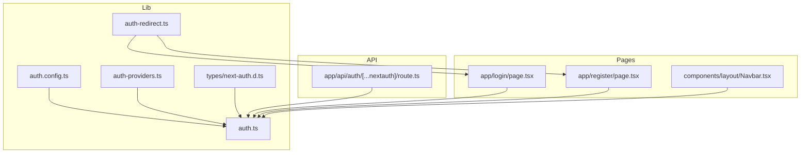
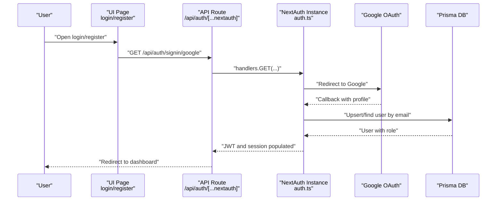
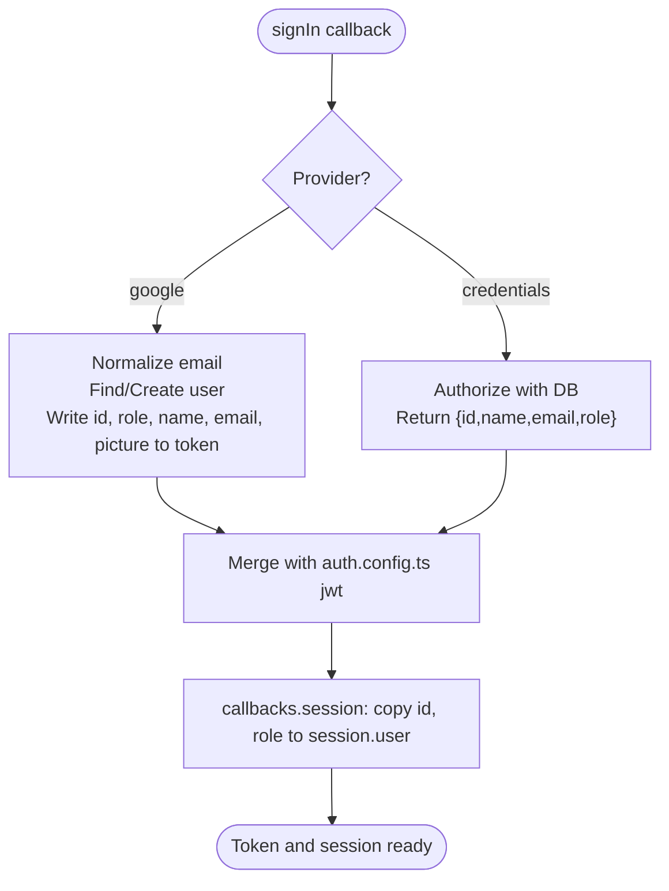
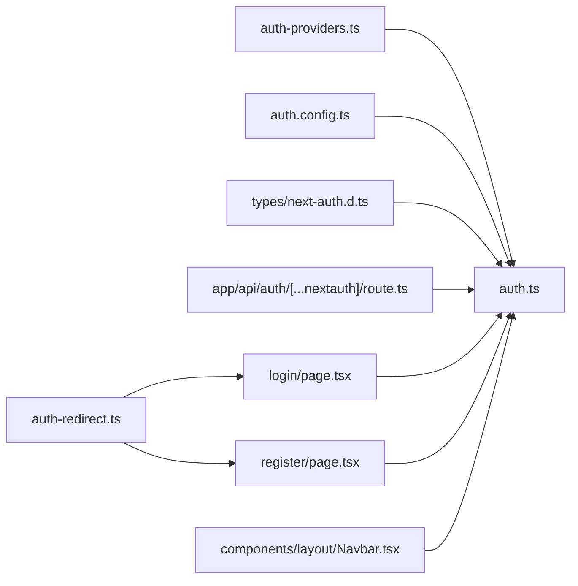

# NextAuth Configuration and Setup

<cite>
**Referenced Files in This Document**
- [auth.config.ts](file://english_pronunciation_app/frontend/src/lib/auth.config.ts)
- [auth.ts](file://english_pronunciation_app/frontend/src/lib/auth.ts)
- [auth-providers.ts](file://english_pronunciation_app/frontend/src/lib/auth-providers.ts)
- [auth-redirect.ts](file://english_pronunciation_app/frontend/src/lib/auth-redirect.ts)
- [route.ts](file://english_pronunciation_app/frontend/src/app/api/auth/[...nextauth]/route.ts)
- [next-auth.d.ts](file://english_pronunciation_app/frontend/src/types/next-auth.d.ts)
- [GOOGLE_OAUTH_SETUP.md](file://english_pronunciation_app/frontend/GOOGLE_OAUTH_SETUP.md)
- [AUTH_GOLDEN_STANDARDS.md](file://english_pronunciation_app/frontend/AUTH_GOLDEN_STANDARDS.md)
- [Navbar.tsx](file://english_pronunciation_app/frontend/src/components/layout/Navbar.tsx)
- [page.tsx (login)](file://english_pronunciation_app/frontend/src/app/login/page.tsx)
- [page.tsx (register)](file://english_pronunciation_app/frontend/src/app/register/page.tsx)
- [package.json](file://english_pronunciation_app/frontend/package.json)
</cite>

## Table of Contents
1. [Introduction](#introduction)
2. [Project Structure](#project-structure)
3. [Core Components](#core-components)
4. [Architecture Overview](#architecture-overview)
5. [Detailed Component Analysis](#detailed-component-analysis)
6. [Dependency Analysis](#dependency-analysis)
7. [Performance Considerations](#performance-considerations)
8. [Troubleshooting Guide](#troubleshooting-guide)
9. [Conclusion](#conclusion)
10. [Appendices](#appendices)

## Introduction
This document explains how NextAuth is configured and integrated in the frontend application. It covers the authConfig object structure, provider configuration, callback functions, JWT token handling, session management, user role assignment, and routing integration. It also provides step-by-step setup instructions for Google OAuth and environment variables, along with common configuration patterns and security considerations.

## Project Structure
The authentication system is centered around a small set of cohesive modules under the frontend/src/lib directory, with API routes and UI pages consuming the configured auth instance.

**Diagram sources**
- [auth.config.ts:1-25](file://english_pronunciation_app/frontend/src/lib/auth.config.ts#L1-L25)
- [auth.ts:1-151](file://english_pronunciation_app/frontend/src/lib/auth.ts#L1-L151)
- [auth-providers.ts:1-15](file://english_pronunciation_app/frontend/src/lib/auth-providers.ts#L1-L15)
- [auth-redirect.ts:1-27](file://english_pronunciation_app/frontend/src/lib/auth-redirect.ts#L1-L27)
- [next-auth.d.ts:1-22](file://english_pronunciation_app/frontend/src/types/next-auth.d.ts#L1-L22)
- [route.ts:1-4](file://english_pronunciation_app/frontend/src/app/api/auth/[...nextauth]/route.ts#L1-L4)
- [page.tsx (login):1-39](file://english_pronunciation_app/frontend/src/app/login/page.tsx#L1-L39)
- [page.tsx (register):1-40](file://english_pronunciation_app/frontend/src/app/register/page.tsx#L1-L40)
- [Navbar.tsx:1-28](file://english_pronunciation_app/frontend/src/components/layout/Navbar.tsx#L1-L28)

**Section sources**
- [auth.config.ts:1-25](file://english_pronunciation_app/frontend/src/lib/auth.config.ts#L1-L25)
- [auth.ts:1-151](file://english_pronunciation_app/frontend/src/lib/auth.ts#L1-L151)
- [auth-providers.ts:1-15](file://english_pronunciation_app/frontend/src/lib/auth-providers.ts#L1-L15)
- [auth-redirect.ts:1-27](file://english_pronunciation_app/frontend/src/lib/auth-redirect.ts#L1-L27)
- [route.ts:1-4](file://english_pronunciation_app/frontend/src/app/api/auth/[...nextauth]/route.ts#L1-L4)
- [next-auth.d.ts:1-22](file://english_pronunciation_app/frontend/src/types/next-auth.d.ts#L1-L22)
- [page.tsx (login):1-39](file://english_pronunciation_app/frontend/src/app/login/page.tsx#L1-L39)
- [page.tsx (register):1-40](file://english_pronunciation_app/frontend/src/app/register/page.tsx#L1-L40)
- [Navbar.tsx:1-28](file://english_pronunciation_app/frontend/src/components/layout/Navbar.tsx#L1-L28)

## Core Components
- auth.config.ts: Defines the shared NextAuth configuration object including providers array placeholder, pages.signIn, and initial callbacks for JWT and session.
- auth.ts: Creates the NextAuth instance by merging auth.config.ts with runtime providers (Google and Credentials), session strategy, and extended callbacks for signIn, JWT, and session.
- auth-providers.ts: Loads Google OAuth credentials from environment variables and exposes helpers to detect availability.
- auth-redirect.ts: Utility functions to compute safe callback paths and build auth HREFs with callbackUrl.
- app/api/auth/[...nextauth]/route.ts: Exposes NextAuth handlers for GET/POST requests.
- types/next-auth.d.ts: Augments NextAuth types to include optional id and role fields on JWT and session.
- UI pages and Navbar: Consume the auth instance to render protected links and user info.

Key configuration highlights:
- Providers: Google OAuth (conditional) and Credentials provider.
- Session strategy: JWT.
- Callbacks: signIn, jwt, session.
- Pages: signIn route mapped to /login.
- Role assignment: stored in JWT and session via callbacks.

**Section sources**
- [auth.config.ts:1-25](file://english_pronunciation_app/frontend/src/lib/auth.config.ts#L1-L25)
- [auth.ts:76-151](file://english_pronunciation_app/frontend/src/lib/auth.ts#L76-L151)
- [auth-providers.ts:1-15](file://english_pronunciation_app/frontend/src/lib/auth-providers.ts#L1-L15)
- [auth-redirect.ts:1-27](file://english_pronunciation_app/frontend/src/lib/auth-redirect.ts#L1-L27)
- [route.ts:1-4](file://english_pronunciation_app/frontend/src/app/api/auth/[...nextauth]/route.ts#L1-L4)
- [next-auth.d.ts:1-22](file://english_pronunciation_app/frontend/src/types/next-auth.d.ts#L1-L22)

## Architecture Overview
The authentication flow integrates UI pages, API routes, and the NextAuth instance. Providers are loaded conditionally based on environment variables, and callbacks manage user creation, role propagation, and token/session synchronization.

**Diagram sources**
- [auth.ts:76-151](file://english_pronunciation_app/frontend/src/lib/auth.ts#L76-L151)
- [auth-providers.ts:1-15](file://english_pronunciation_app/frontend/src/lib/auth-providers.ts#L1-L15)
- [route.ts:1-4](file://english_pronunciation_app/frontend/src/app/api/auth/[...nextauth]/route.ts#L1-L4)
- [page.tsx (login):1-39](file://english_pronunciation_app/frontend/src/app/login/page.tsx#L1-L39)
- [page.tsx (register):1-40](file://english_pronunciation_app/frontend/src/app/register/page.tsx#L1-L40)

## Detailed Component Analysis

### NextAuth Config Object (auth.config.ts)
- Purpose: Centralized NextAuthConfig with placeholders for providers and default page redirection.
- Key fields:
  - providers: Empty array (providers are merged at runtime).
  - pages.signIn: Redirects unauthenticated users to /login.
  - callbacks.jwt: Stores user.id and user.role into the JWT token when a user object is present.
  - callbacks.session: Populates session.user with id and role from the JWT token.

Implementation pattern:
- Uses a shared config object to keep defaults and type safety.
- Extends with runtime-specific providers and callbacks in auth.ts.

**Section sources**
- [auth.config.ts:1-25](file://english_pronunciation_app/frontend/src/lib/auth.config.ts#L1-L25)

### NextAuth Instance (auth.ts)
- Provider configuration:
  - Google: Conditionally included if environment variables are present.
  - Credentials: Authorize with normalized email and bcrypt comparison, returning id, name, email, role.
- Session strategy: JWT.
- Extended callbacks:
  - signIn: Validates Google sign-in by ensuring email exists and verified.
  - jwt: On Google sign-in, finds or creates a local user, then writes id, role, name, email, picture into the token; otherwise defers to auth.config.ts jwt.
  - session: Copies id and role from token into session.user.

User creation flow (Google OAuth):
- Normalize email and derive username if needed.
- Upsert default role "User".
- Create user with hashed temporary password and avatarUrl.
- Return user with role attached to the token and session.

**Section sources**
- [auth.ts:76-151](file://english_pronunciation_app/frontend/src/lib/auth.ts#L76-L151)

### Google OAuth Provider Loader (auth-providers.ts)
- Loads clientId and clientSecret from environment variables (supports dual keys).
- Returns null if missing, enabling conditional provider inclusion.
- Provides a helper to check if Google OAuth is enabled.

Environment variables:
- AUTH_GOOGLE_ID and AUTH_GOOGLE_SECRET.

**Section sources**
- [auth-providers.ts:1-15](file://english_pronunciation_app/frontend/src/lib/auth-providers.ts#L1-L15)

### Safe Callback Path Utilities (auth-redirect.ts)
- getSafeCallbackPath: Ensures callbackUrl is a single slash prefix, not empty, not a login/register path, and not a double-slash path.
- buildAuthHref: Builds login/register URLs with a safe callbackUrl query parameter.

Usage:
- Used by UI pages to construct secure redirect links.

**Section sources**
- [auth-redirect.ts:1-27](file://english_pronunciation_app/frontend/src/lib/auth-redirect.ts#L1-L27)

### API Handlers (app/api/auth/[...nextauth]/route.ts)
- Exposes NextAuth handlers for GET and POST.
- Delegates to the auth instance created in auth.ts.

Integration:
- NextAuth endpoints are mounted at /api/auth/[...nextauth].

**Section sources**
- [route.ts:1-4](file://english_pronunciation_app/frontend/src/app/api/auth/[...nextauth]/route.ts#L1-L4)

### Type Augmentation (types/next-auth.d.ts)
- Extends Session.user with optional id and role.
- Extends User with optional role.
- Extends JWT with optional id and role.

Purpose:
- Ensures type-safe access to custom fields in callbacks and UI components.

**Section sources**
- [next-auth.d.ts:1-22](file://english_pronunciation_app/frontend/src/types/next-auth.d.ts#L1-L22)

### UI Integration (login/register pages and Navbar)
- login/page.tsx and register/page.tsx:
  - Detect Google OAuth availability.
  - Render forms with Suspense fallbacks.
- Navbar:
  - Calls auth() to fetch session.
  - Filters navigation links based on authentication state.
  - Displays user name and avatar; detects Admin role.

Routing integration:
- authConfig.pages.signIn="/login" ensures redirects to login for unauthenticated users.

**Section sources**
- [page.tsx (login):1-39](file://english_pronunciation_app/frontend/src/app/login/page.tsx#L1-L39)
- [page.tsx (register):1-40](file://english_pronunciation_app/frontend/src/app/register/page.tsx#L1-L40)
- [Navbar.tsx:1-28](file://english_pronunciation_app/frontend/src/components/layout/Navbar.tsx#L1-L28)

### JWT Token Handling Mechanism
- Storage: JWT strategy is enabled in the auth instance.
- Population:
  - Credentials provider: id, name, email, role returned during authorize.
  - Google provider: id, role, name, email, picture written to token after user lookup/creation.
- Retrieval:
  - callbacks.jwt merges auth.config.ts jwt with provider-specific logic.
  - callbacks.session copies id and role from token into session.user.

**Diagram sources**
- [auth.ts:117-149](file://english_pronunciation_app/frontend/src/lib/auth.ts#L117-L149)
- [auth.config.ts:8-23](file://english_pronunciation_app/frontend/src/lib/auth.config.ts#L8-L23)

**Section sources**
- [auth.ts:76-151](file://english_pronunciation_app/frontend/src/lib/auth.ts#L76-L151)
- [auth.config.ts:1-25](file://english_pronunciation_app/frontend/src/lib/auth.config.ts#L1-L25)

### Session Management and Role Assignment
- Role assignment:
  - During Credentials authorize, role is attached to the returned user object.
  - During Google signIn, role is derived from the upserted user record.
- Session propagation:
  - callbacks.session reads token.id and token.role and writes them into session.user.
- UI consumption:
  - Navbar checks session.user.role to decide admin visibility.

**Section sources**
- [auth.ts:93-114](file://english_pronunciation_app/frontend/src/lib/auth.ts#L93-L114)
- [auth.ts:129-141](file://english_pronunciation_app/frontend/src/lib/auth.ts#L129-L141)
- [auth.ts:116-149](file://english_pronunciation_app/frontend/src/lib/auth.ts#L116-L149)
- [Navbar.tsx:14-26](file://english_pronunciation_app/frontend/src/components/layout/Navbar.tsx#L14-L26)

### Provider Array Configuration
- Google OAuth:
  - Conditionally included if AUTH_GOOGLE_ID and AUTH_GOOGLE_SECRET are present.
  - Uses getGoogleOAuthConfig() to supply clientId and clientSecret.
- Credentials:
  - Always included; requires email and password fields.
  - Uses Prisma to find user and bcrypt to verify password.
  - Returns id, name, email, role for successful authorization.

**Section sources**
- [auth.ts:79-116](file://english_pronunciation_app/frontend/src/lib/auth.ts#L79-L116)
- [auth-providers.ts:1-15](file://english_pronunciation_app/frontend/src/lib/auth-providers.ts#L1-L15)

### Page Redirection Settings
- authConfig.pages.signIn="/login" ensures unauthenticated users are redirected to the login page.
- UI pages use auth-redirect utilities to build safe callbackUrls and avoid login/register loops.

**Section sources**
- [auth.config.ts:5-7](file://english_pronunciation_app/frontend/src/lib/auth.config.ts#L5-L7)
- [auth-redirect.ts:1-27](file://english_pronunciation_app/frontend/src/lib/auth-redirect.ts#L1-L27)

### Security Configurations
- Environment variables:
  - AUTH_SECRET: Required for signing tokens.
  - AUTH_URL: Base URL for NextAuth.
  - AUTH_GOOGLE_ID and AUTH_GOOGLE_SECRET: Optional but required for Google OAuth.
- UI standards:
  - AUTH_GOLDEN_STANDARDS.md documents security and privacy practices (HTTPS, CSRF protection, terms/privacy links).

**Section sources**
- [GOOGLE_OAUTH_SETUP.md:117-136](file://english_pronunciation_app/frontend/GOOGLE_OAUTH_SETUP.md#L117-L136)
- [AUTH_GOLDEN_STANDARDS.md:197-211](file://english_pronunciation_app/frontend/AUTH_GOLDEN_STANDARDS.md#L197-L211)

## Dependency Analysis
The following diagram shows how modules depend on each other to implement authentication.

**Diagram sources**
- [auth-providers.ts:1-15](file://english_pronunciation_app/frontend/src/lib/auth-providers.ts#L1-L15)
- [auth.ts:1-151](file://english_pronunciation_app/frontend/src/lib/auth.ts#L1-L151)
- [auth.config.ts:1-25](file://english_pronunciation_app/frontend/src/lib/auth.config.ts#L1-L25)
- [auth-redirect.ts:1-27](file://english_pronunciation_app/frontend/src/lib/auth-redirect.ts#L1-L27)
- [route.ts:1-4](file://english_pronunciation_app/frontend/src/app/api/auth/[...nextauth]/route.ts#L1-L4)
- [page.tsx (login):1-39](file://english_pronunciation_app/frontend/src/app/login/page.tsx#L1-L39)
- [page.tsx (register):1-40](file://english_pronunciation_app/frontend/src/app/register/page.tsx#L1-L40)
- [Navbar.tsx:1-28](file://english_pronunciation_app/frontend/src/components/layout/Navbar.tsx#L1-L28)
- [next-auth.d.ts:1-22](file://english_pronunciation_app/frontend/src/types/next-auth.d.ts#L1-L22)

**Section sources**
- [auth.ts:1-151](file://english_pronunciation_app/frontend/src/lib/auth.ts#L1-L151)
- [auth.config.ts:1-25](file://english_pronunciation_app/frontend/src/lib/auth.config.ts#L1-L25)
- [auth-providers.ts:1-15](file://english_pronunciation_app/frontend/src/lib/auth-providers.ts#L1-L15)
- [auth-redirect.ts:1-27](file://english_pronunciation_app/frontend/src/lib/auth-redirect.ts#L1-L27)
- [route.ts:1-4](file://english_pronunciation_app/frontend/src/app/api/auth/[...nextauth]/route.ts#L1-L4)
- [page.tsx (login):1-39](file://english_pronunciation_app/frontend/src/app/login/page.tsx#L1-L39)
- [page.tsx (register):1-40](file://english_pronunciation_app/frontend/src/app/register/page.tsx#L1-L40)
- [Navbar.tsx:1-28](file://english_pronunciation_app/frontend/src/components/layout/Navbar.tsx#L1-L28)
- [next-auth.d.ts:1-22](file://english_pronunciation_app/frontend/src/types/next-auth.d.ts#L1-L22)

## Performance Considerations
- Provider selection: Google OAuth is only included when credentials are present, avoiding unnecessary initialization.
- Session strategy: JWT reduces server-side session storage overhead.
- Token/session callbacks: Keep logic lightweight; avoid heavy DB queries inside callbacks.
- UI hydration: Use Suspense in pages to improve perceived performance during auth-dependent rendering.

## Troubleshooting Guide
Common issues and resolutions:
- Missing Google OAuth button:
  - Ensure AUTH_GOOGLE_ID and AUTH_GOOGLE_SECRET are set in .env.local.
  - Restart the development server.
- redirect_uri_mismatch:
  - Verify Authorized redirect URIs in Google Cloud Console match the app’s domain and /api/auth/callback/google.
- access_denied:
  - Add test users to OAuth consent screen or publish the app.
- NEXTAUTH_SECRET:
  - Generate and set AUTH_SECRET in .env.local.

Environment and setup references:
- AUTH_SECRET, AUTH_URL, AUTH_GOOGLE_ID, AUTH_GOOGLE_SECRET.
- Google OAuth setup steps and checklist.

**Section sources**
- [GOOGLE_OAUTH_SETUP.md:167-207](file://english_pronunciation_app/frontend/GOOGLE_OAUTH_SETUP.md#L167-L207)
- [GOOGLE_OAUTH_SETUP.md:95-145](file://english_pronunciation_app/frontend/GOOGLE_OAUTH_SETUP.md#L95-L145)

## Conclusion
The application’s NextAuth setup cleanly separates configuration from runtime provider loading and callback logic. It supports both Google OAuth and email/password authentication, manages roles via JWT and session, and integrates seamlessly with the routing system. Following the documented environment variables and setup steps ensures a secure and reliable authentication experience.

## Appendices

### Step-by-Step Setup Instructions
1. Configure environment variables:
   - Set AUTH_SECRET, AUTH_URL, AUTH_GOOGLE_ID, AUTH_GOOGLE_SECRET.
2. Enable Google OAuth:
   - Create a Google Cloud project and OAuth client.
   - Add authorized origins and redirect URIs matching your domain.
3. Run the app:
   - Start the development server and verify the login/register pages.

**Section sources**
- [GOOGLE_OAUTH_SETUP.md:95-145](file://english_pronunciation_app/frontend/GOOGLE_OAUTH_SETUP.md#L95-L145)
- [GOOGLE_OAUTH_SETUP.md:16-93](file://english_pronunciation_app/frontend/GOOGLE_OAUTH_SETUP.md#L16-L93)

### Common Configuration Patterns
- Conditional providers: Include Google only when credentials are present.
- Role propagation: Return role from authorize and persist it in JWT and session.
- Safe redirects: Use getSafeCallbackPath to prevent login loops.
- Type safety: Extend NextAuth types to include custom fields.

**Section sources**
- [auth.ts:79-116](file://english_pronunciation_app/frontend/src/lib/auth.ts#L79-L116)
- [auth.ts:116-149](file://english_pronunciation_app/frontend/src/lib/auth.ts#L116-L149)
- [auth-redirect.ts:1-27](file://english_pronunciation_app/frontend/src/lib/auth-redirect.ts#L1-L27)
- [next-auth.d.ts:1-22](file://english_pronunciation_app/frontend/src/types/next-auth.d.ts#L1-L22)