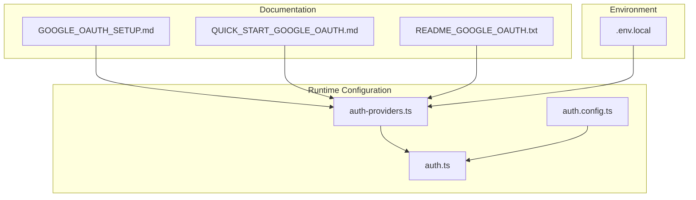
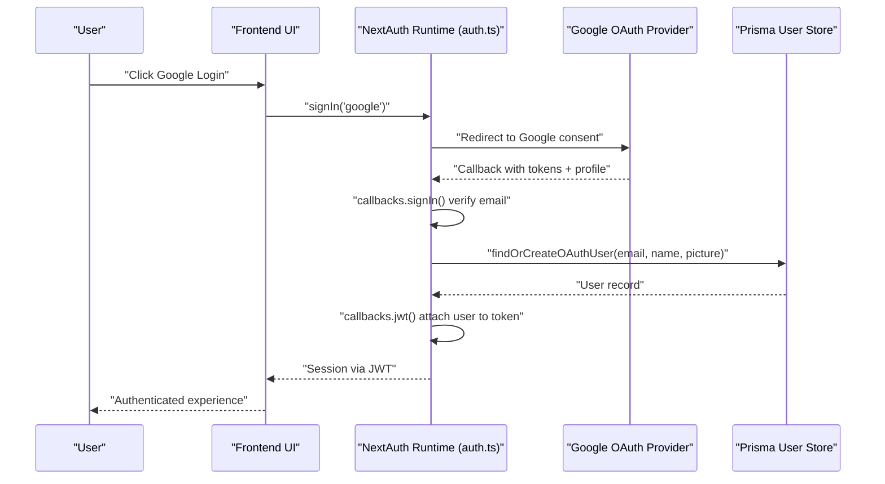
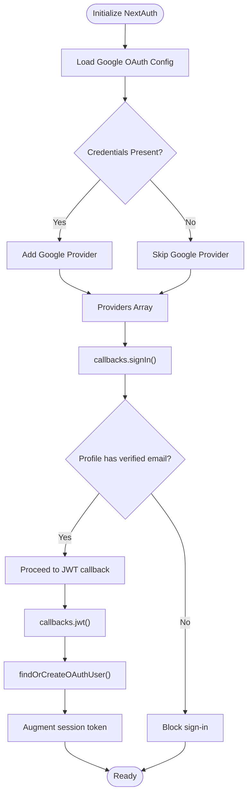
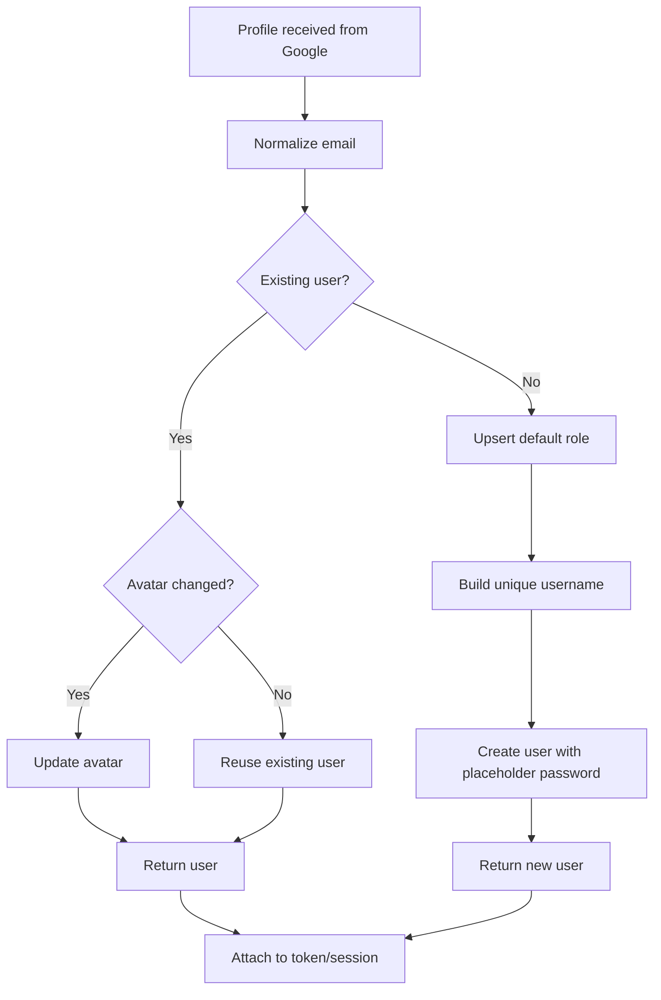
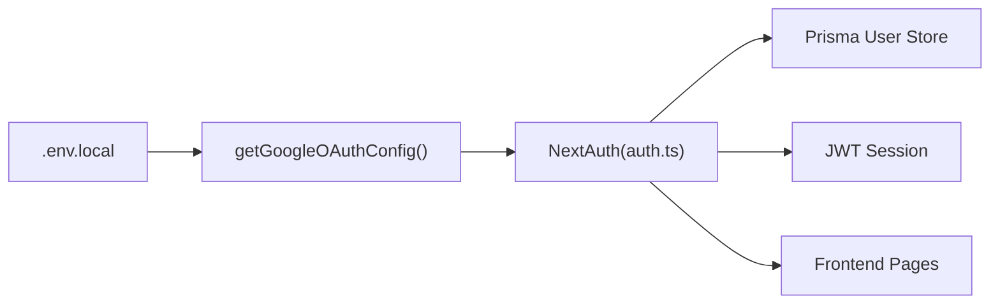

# OAuth Providers and User Management

<cite>
**Referenced Files in This Document**
- [GOOGLE_OAUTH_SETUP.md](file://english_pronunciation_app/frontend/GOOGLE_OAUTH_SETUP.md)
- [QUICK_START_GOOGLE_OAUTH.md](file://english_pronunciation_app/frontend/QUICK_START_GOOGLE_OAUTH.md)
- [README_GOOGLE_OAUTH.txt](file://english_pronunciation_app/frontend/README_GOOGLE_OAUTH.txt)
- [auth.ts](file://english_pronunciation_app/frontend/src/lib/auth.ts)
- [auth.config.ts](file://english_pronunciation_app/frontend/src/lib/auth.config.ts)
- [auth-providers.ts](file://english_pronunciation_app/frontend/src/lib/auth-providers.ts)
- [.env.local](file://english_pronunciation_app/frontend/.env.local)
</cite>

## Table of Contents
1. [Introduction](#introduction)
2. [Project Structure](#project-structure)
3. [Core Components](#core-components)
4. [Architecture Overview](#architecture-overview)
5. [Detailed Component Analysis](#detailed-component-analysis)
6. [Dependency Analysis](#dependency-analysis)
7. [Performance Considerations](#performance-considerations)
8. [Troubleshooting Guide](#troubleshooting-guide)
9. [Conclusion](#conclusion)
10. [Appendices](#appendices)

## Introduction
This document explains the OAuth provider implementation and user management for Google OAuth within the frontend application. It covers setup steps, environment configuration, user profile synchronization, and the end-to-end authentication flow from provider login to session creation. It also documents user data mapping, profile extraction, account creation and linking strategies, security considerations, and error handling patterns.

## Project Structure
The OAuth implementation centers around three primary areas:
- Provider setup and environment configuration documentation
- Runtime authentication configuration and provider wiring
- User provisioning and profile synchronization logic

**Diagram sources**
- [auth.ts:1-151](file://english_pronunciation_app/frontend/src/lib/auth.ts#L1-L151)
- [auth.config.ts:1-25](file://english_pronunciation_app/frontend/src/lib/auth.config.ts#L1-L25)
- [auth-providers.ts:1-15](file://english_pronunciation_app/frontend/src/lib/auth-providers.ts#L1-L15)
- [.env.local:1-1](file://english_pronunciation_app/frontend/.env.local#L1-L1)

**Section sources**
- [GOOGLE_OAUTH_SETUP.md:1-320](file://english_pronunciation_app/frontend/GOOGLE_OAUTH_SETUP.md#L1-L320)
- [QUICK_START_GOOGLE_OAUTH.md:1-159](file://english_pronunciation_app/frontend/QUICK_START_GOOGLE_OAUTH.md#L1-L159)
- [README_GOOGLE_OAUTH.txt:1-53](file://english_pronunciation_app/frontend/README_GOOGLE_OAUTH.txt#L1-L53)
- [auth.ts:1-151](file://english_pronunciation_app/frontend/src/lib/auth.ts#L1-L151)
- [auth.config.ts:1-25](file://english_pronunciation_app/frontend/src/lib/auth.config.ts#L1-L25)
- [auth-providers.ts:1-15](file://english_pronunciation_app/frontend/src/lib/auth-providers.ts#L1-L15)
- [.env.local:1-1](file://english_pronunciation_app/frontend/.env.local#L1-L1)

## Core Components
- Google OAuth configuration loader: Reads client credentials from environment variables and exposes availability checks.
- Authentication runtime: Configures NextAuth providers, JWT/session callbacks, and user provisioning logic.
- Environment configuration: Stores secrets and URLs required for OAuth and session handling.

Key responsibilities:
- Provider discovery and conditional enablement
- User lookup/creation and profile synchronization
- Session token augmentation with user metadata
- Consent verification and profile gating

**Section sources**
- [auth-providers.ts:1-15](file://english_pronunciation_app/frontend/src/lib/auth-providers.ts#L1-L15)
- [auth.ts:76-151](file://english_pronunciation_app/frontend/src/lib/auth.ts#L76-L151)
- [auth.config.ts:3-24](file://english_pronunciation_app/frontend/src/lib/auth.config.ts#L3-L24)

## Architecture Overview
The Google OAuth flow integrates with NextAuth and Prisma to provision users and maintain sessions.

**Diagram sources**
- [auth.ts:76-151](file://english_pronunciation_app/frontend/src/lib/auth.ts#L76-L151)
- [auth-providers.ts:1-15](file://english_pronunciation_app/frontend/src/lib/auth-providers.ts#L1-L15)

## Detailed Component Analysis

### Google OAuth Setup and Environment Configuration
- Steps to create a Google Cloud project, configure OAuth consent screen, and create OAuth 2.0 credentials
- Required scopes for email and profile access
- Authorized JavaScript origins and redirect URIs for development and production
- Environment variables for NextAuth and Google OAuth
- Troubleshooting common errors such as redirect URI mismatch and access denied

Implementation references:
- Provider setup and redirect URIs: [GOOGLE_OAUTH_SETUP.md:70-82](file://english_pronunciation_app/frontend/GOOGLE_OAUTH_SETUP.md#L70-L82)
- Environment variables and secrets: [GOOGLE_OAUTH_SETUP.md:117-136](file://english_pronunciation_app/frontend/GOOGLE_OAUTH_SETUP.md#L117-L136)
- Quick-start steps and troubleshooting: [QUICK_START_GOOGLE_OAUTH.md:5-32](file://english_pronunciation_app/frontend/QUICK_START_GOOGLE_OAUTH.md#L5-L32), [QUICK_START_GOOGLE_OAUTH.md:101-115](file://english_pronunciation_app/frontend/QUICK_START_GOOGLE_OAUTH.md#L101-L115)

**Section sources**
- [GOOGLE_OAUTH_SETUP.md:1-320](file://english_pronunciation_app/frontend/GOOGLE_OAUTH_SETUP.md#L1-L320)
- [QUICK_START_GOOGLE_OAUTH.md:1-159](file://english_pronunciation_app/frontend/QUICK_START_GOOGLE_OAUTH.md#L1-L159)
- [README_GOOGLE_OAUTH.txt:1-53](file://english_pronunciation_app/frontend/README_GOOGLE_OAUTH.txt#L1-L53)

### Authentication Runtime and Provider Wiring
The runtime composes NextAuth with:
- Google provider configured via environment variables
- Credentials provider for local accounts
- JWT/session callbacks to attach user metadata
- Conditional provider loading based on environment presence

Key behaviors:
- Conditional provider enablement when Google credentials are present
- Username normalization and uniqueness enforcement
- Profile-driven user creation and avatar updates
- Session augmentation with user id, role, and profile fields

**Diagram sources**
- [auth.ts:76-151](file://english_pronunciation_app/frontend/src/lib/auth.ts#L76-L151)
- [auth-providers.ts:1-15](file://english_pronunciation_app/frontend/src/lib/auth-providers.ts#L1-L15)

**Section sources**
- [auth.ts:1-151](file://english_pronunciation_app/frontend/src/lib/auth.ts#L1-L151)
- [auth.config.ts:1-25](file://english_pronunciation_app/frontend/src/lib/auth.config.ts#L1-L25)
- [auth-providers.ts:1-15](file://english_pronunciation_app/frontend/src/lib/auth-providers.ts#L1-L15)

### User Provisioning and Profile Synchronization
User lifecycle:
- Normalize incoming email
- Lookup existing user by normalized email
- Update avatar if changed
- Upsert default role if needed
- Generate unique username from email or preferred name
- Create user with hashed placeholder password and default role
- Attach user data to JWT and session

**Diagram sources**
- [auth.ts:36-74](file://english_pronunciation_app/frontend/src/lib/auth.ts#L36-L74)

**Section sources**
- [auth.ts:36-74](file://english_pronunciation_app/frontend/src/lib/auth.ts#L36-L74)

### Account Linking Strategies
- Single-provider linkage: Users authenticated via Google are linked to their Google email
- Role propagation: Role name from database is attached to JWT and session
- Avatar sync: Profile picture updates are reflected in the user record

References:
- Role attachment in JWT and session: [auth.ts:126-149](file://english_pronunciation_app/frontend/src/lib/auth.ts#L126-L149)
- Profile picture handling during provisioning: [auth.ts:133](file://english_pronunciation_app/frontend/src/lib/auth.ts#L133)

**Section sources**
- [auth.ts:126-149](file://english_pronunciation_app/frontend/src/lib/auth.ts#L126-L149)

### Security Considerations
- Secret management: AUTH_SECRET must be set and kept confidential
- Redirect URIs: Must match exactly between Google Console and application
- Consent screen mode: Testing vs. production publishing affects access
- Environment isolation: Separate variables per environment

References:
- Secrets and URLs: [GOOGLE_OAUTH_SETUP.md:117-136](file://english_pronunciation_app/frontend/GOOGLE_OAUTH_SETUP.md#L117-L136)
- Redirect URI requirements: [GOOGLE_OAUTH_SETUP.md:77-82](file://english_pronunciation_app/frontend/GOOGLE_OAUTH_SETUP.md#L77-L82)
- Publishing guidance: [GOOGLE_OAUTH_SETUP.md:252-256](file://english_pronunciation_app/frontend/GOOGLE_OAUTH_SETUP.md#L252-L256)

**Section sources**
- [GOOGLE_OAUTH_SETUP.md:117-136](file://english_pronunciation_app/frontend/GOOGLE_OAUTH_SETUP.md#L117-L136)
- [GOOGLE_OAUTH_SETUP.md:77-82](file://english_pronunciation_app/frontend/GOOGLE_OAUTH_SETUP.md#L77-L82)
- [GOOGLE_OAUTH_SETUP.md:252-256](file://english_pronunciation_app/frontend/GOOGLE_OAUTH_SETUP.md#L252-L256)

### Token Refresh and Session Handling
- Session strategy: JWT-based sessions
- Token augmentation: User id, role, username, email, and avatar included in the token
- Session payload: Mirrors token fields for client-side consumption

References:
- Session strategy and callbacks: [auth.ts:78](file://english_pronunciation_app/frontend/src/lib/auth.ts#L78), [auth.ts:117-149](file://english_pronunciation_app/frontend/src/lib/auth.ts#L117-L149), [auth.config.ts:8-23](file://english_pronunciation_app/frontend/src/lib/auth.config.ts#L8-L23)

**Section sources**
- [auth.ts:78](file://english_pronunciation_app/frontend/src/lib/auth.ts#L78)
- [auth.ts:117-149](file://english_pronunciation_app/frontend/src/lib/auth.ts#L117-L149)
- [auth.config.ts:8-23](file://english_pronunciation_app/frontend/src/lib/auth.config.ts#L8-L23)

## Dependency Analysis
The runtime depends on:
- Environment variables for provider credentials
- NextAuth configuration and callbacks
- Prisma for user and role persistence

**Diagram sources**
- [.env.local:1-1](file://english_pronunciation_app/frontend/.env.local#L1-L1)
- [auth-providers.ts:1-15](file://english_pronunciation_app/frontend/src/lib/auth-providers.ts#L1-L15)
- [auth.ts:76-151](file://english_pronunciation_app/frontend/src/lib/auth.ts#L76-L151)

**Section sources**
- [auth-providers.ts:1-15](file://english_pronunciation_app/frontend/src/lib/auth-providers.ts#L1-L15)
- [auth.ts:76-151](file://english_pronunciation_app/frontend/src/lib/auth.ts#L76-L151)
- [.env.local:1-1](file://english_pronunciation_app/frontend/.env.local#L1-L1)

## Performance Considerations
- Minimize database roundtrips by reusing existing user records
- Defer avatar updates to avoid unnecessary writes
- Keep usernames concise and unique to reduce collision handling overhead

## Troubleshooting Guide
Common issues and resolutions:
- Missing Google OAuth buttons: Verify environment variables and server restart
- Redirect URI mismatch: Ensure exact match in Google Console and application
- Access denied errors: Add test users or publish the OAuth app
- Missing AUTH_SECRET: Generate and set a secure secret

References:
- Troubleshooting checklist and fixes: [GOOGLE_OAUTH_SETUP.md:167-207](file://english_pronunciation_app/frontend/GOOGLE_OAUTH_SETUP.md#L167-L207), [QUICK_START_GOOGLE_OAUTH.md:85-98](file://english_pronunciation_app/frontend/QUICK_START_GOOGLE_OAUTH.md#L85-L98)

**Section sources**
- [GOOGLE_OAUTH_SETUP.md:167-207](file://english_pronunciation_app/frontend/GOOGLE_OAUTH_SETUP.md#L167-L207)
- [QUICK_START_GOOGLE_OAUTH.md:85-98](file://english_pronunciation_app/frontend/QUICK_START_GOOGLE_OAUTH.md#L85-L98)

## Conclusion
The application implements a robust Google OAuth integration using NextAuth, with environment-driven provider configuration, strict consent handling, and seamless user provisioning and profile synchronization. By following the documented setup and configuration steps, teams can reliably enable Google login, manage user identities, and maintain secure and scalable authentication flows.

## Appendices
- Implementation references for quick navigation:
  - Provider configuration loader: [auth-providers.ts:1-15](file://english_pronunciation_app/frontend/src/lib/auth-providers.ts#L1-L15)
  - Authentication runtime and callbacks: [auth.ts:76-151](file://english_pronunciation_app/frontend/src/lib/auth.ts#L76-L151)
  - JWT/session configuration: [auth.config.ts:3-24](file://english_pronunciation_app/frontend/src/lib/auth.config.ts#L3-L24)
  - Setup documentation: [GOOGLE_OAUTH_SETUP.md:1-320](file://english_pronunciation_app/frontend/GOOGLE_OAUTH_SETUP.md#L1-L320), [QUICK_START_GOOGLE_OAUTH.md:1-159](file://english_pronunciation_app/frontend/QUICK_START_GOOGLE_OAUTH.md#L1-L159)