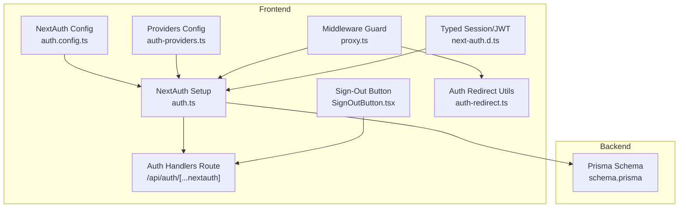
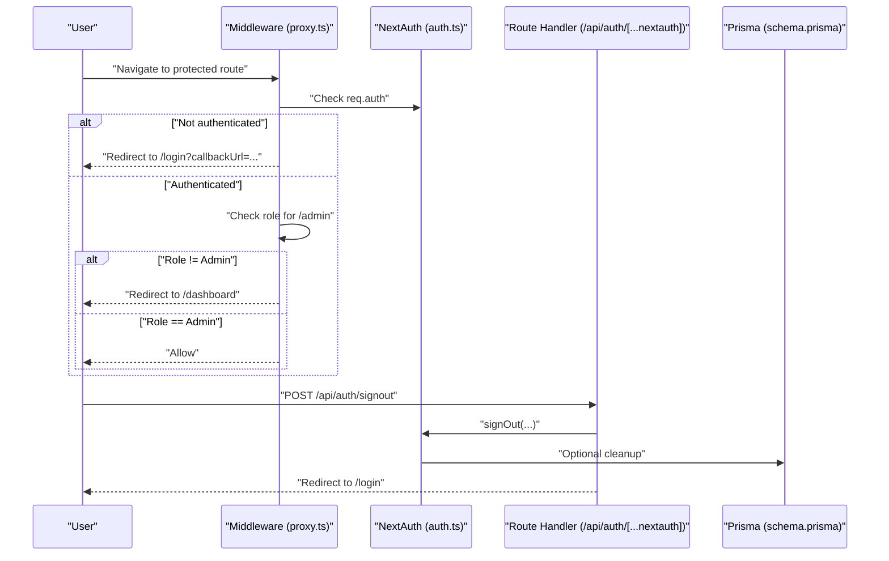
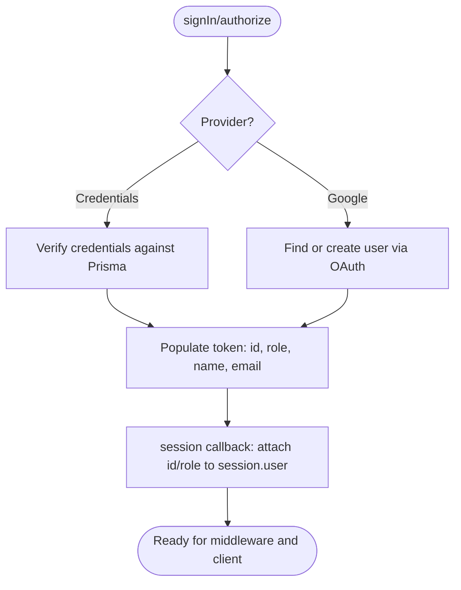
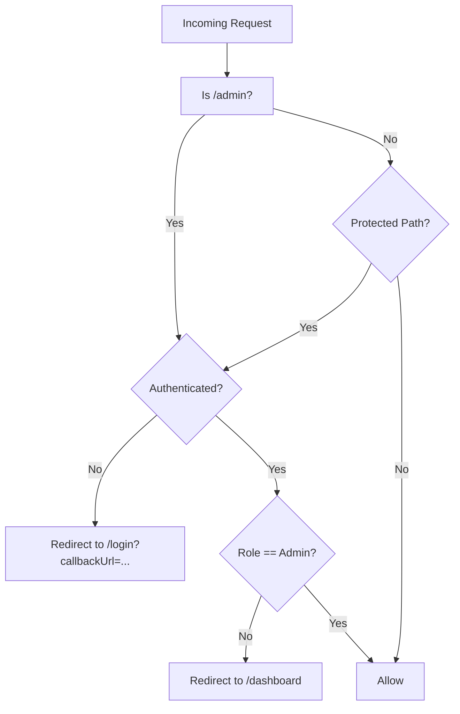
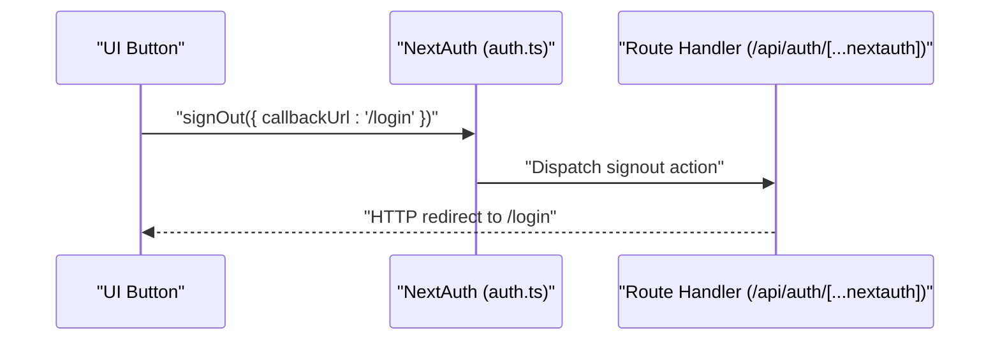
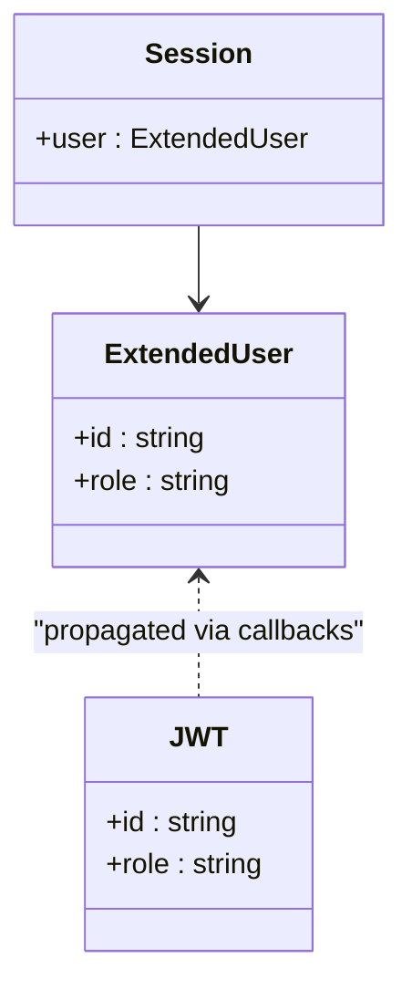
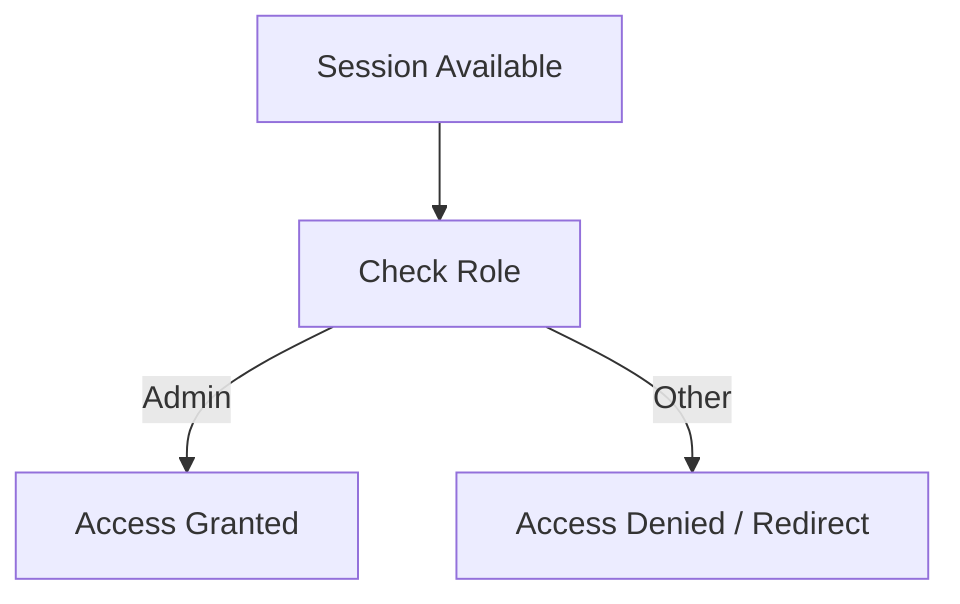
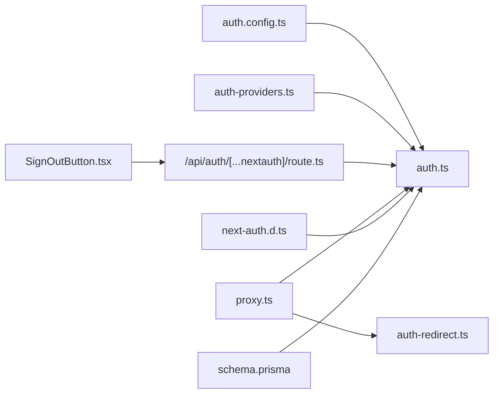

# Session Handling and Security

<cite>
**Referenced Files in This Document**
- [auth.ts](file://english_pronunciation_app/frontend/src/lib/auth.ts)
- [auth.config.ts](file://english_pronunciation_app/frontend/src/lib/auth.config.ts)
- [auth-providers.ts](file://english_pronunciation_app/frontend/src/lib/auth-providers.ts)
- [auth-redirect.ts](file://english_pronunciation_app/frontend/src/lib/auth-redirect.ts)
- [proxy.ts](file://english_pronunciation_app/frontend/src/proxy.ts)
- [SignOutButton.tsx](file://english_pronunciation_app/frontend/src/components/layout/SignOutButton.tsx)
- [next-auth.d.ts](file://english_pronunciation_app/frontend/src/types/next-auth.d.ts)
- [route.ts](file://english_pronunciation_app/frontend/src/app/api/auth/[...nextauth]/route.ts)
- [schema.prisma](file://english_pronunciation_app/frontend/prisma/schema.prisma)
- [ADMIN_ACCESS.md](file://PLAN/_Archive/ADMIN_ACCESS.md)
</cite>

## Table of Contents
1. [Introduction](#introduction)
2. [Project Structure](#project-structure)
3. [Core Components](#core-components)
4. [Architecture Overview](#architecture-overview)
5. [Detailed Component Analysis](#detailed-component-analysis)
6. [Dependency Analysis](#dependency-analysis)
7. [Performance Considerations](#performance-considerations)
8. [Troubleshooting Guide](#troubleshooting-guide)
9. [Conclusion](#conclusion)
10. [Appendices](#appendices)

## Introduction
This document explains session management and security implementation in the frontend application. It covers session persistence via JWT, token validation, user session lifecycle management, sign-out and session invalidation, automatic logout mechanisms, protected route enforcement, session guards, authentication state management, role-based access control, and secure configuration recommendations. It also documents the relationship between NextAuth sessions and application state, session timeout handling, and re-authentication flows.

## Project Structure
The authentication and session management stack centers around NextAuth.js configured in the frontend. Key elements include:
- NextAuth configuration and provider setup
- Middleware-based session guard and role enforcement
- Protected route matcher and redirect logic
- Client-side sign-out button
- Strongly typed session and JWT extensions
- Prisma schema modeling roles and users

**Diagram sources**
- [auth.config.ts:1-25](file://english_pronunciation_app/frontend/src/lib/auth.config.ts#L1-L25)
- [auth.ts:1-151](file://english_pronunciation_app/frontend/src/lib/auth.ts#L1-L151)
- [route.ts:1-3](file://english_pronunciation_app/frontend/src/app/api/auth/[...nextauth]/route.ts#L1-L3)
- [proxy.ts:1-51](file://english_pronunciation_app/frontend/src/proxy.ts#L1-L51)
- [SignOutButton.tsx:1-16](file://english_pronunciation_app/frontend/src/components/layout/SignOutButton.tsx#L1-L16)
- [next-auth.d.ts:1-22](file://english_pronunciation_app/frontend/src/types/next-auth.d.ts#L1-L22)
- [auth-redirect.ts:1-26](file://english_pronunciation_app/frontend/src/lib/auth-redirect.ts#L1-L26)
- [auth-providers.ts:1-15](file://english_pronunciation_app/frontend/src/lib/auth-providers.ts#L1-L15)
- [schema.prisma:14-59](file://english_pronunciation_app/frontend/prisma/schema.prisma#L14-L59)

**Section sources**
- [auth.config.ts:1-25](file://english_pronunciation_app/frontend/src/lib/auth.config.ts#L1-L25)
- [auth.ts:1-151](file://english_pronunciation_app/frontend/src/lib/auth.ts#L1-L151)
- [route.ts:1-3](file://english_pronunciation_app/frontend/src/app/api/auth/[...nextauth]/route.ts#L1-L3)
- [proxy.ts:1-51](file://english_pronunciation_app/frontend/src/proxy.ts#L1-L51)
- [SignOutButton.tsx:1-16](file://english_pronunciation_app/frontend/src/components/layout/SignOutButton.tsx#L1-L16)
- [next-auth.d.ts:1-22](file://english_pronunciation_app/frontend/src/types/next-auth.d.ts#L1-L22)
- [auth-redirect.ts:1-26](file://english_pronunciation_app/frontend/src/lib/auth-redirect.ts#L1-L26)
- [auth-providers.ts:1-15](file://english_pronunciation_app/frontend/src/lib/auth-providers.ts#L1-L15)
- [schema.prisma:14-59](file://english_pronunciation_app/frontend/prisma/schema.prisma#L14-L59)

## Core Components
- NextAuth configuration and callbacks define how tokens and sessions are populated and transformed.
- Provider setup supports both Google OAuth and credentials-based login.
- Middleware enforces session checks and role-based access control for protected areas.
- Client-side sign-out triggers NextAuth’s sign-out handler and redirects to login.
- Strong typing extends NextAuth session and JWT claims for role and ID.
- Auth redirect utilities sanitize callback URLs to prevent open redirect vulnerabilities.
- Prisma schema models users and roles, enabling role-based permissions.

**Section sources**
- [auth.config.ts:1-25](file://english_pronunciation_app/frontend/src/lib/auth.config.ts#L1-L25)
- [auth.ts:76-151](file://english_pronunciation_app/frontend/src/lib/auth.ts#L76-L151)
- [proxy.ts:7-47](file://english_pronunciation_app/frontend/src/proxy.ts#L7-L47)
- [SignOutButton.tsx:1-16](file://english_pronunciation_app/frontend/src/components/layout/SignOutButton.tsx#L1-L16)
- [next-auth.d.ts:1-22](file://english_pronunciation_app/frontend/src/types/next-auth.d.ts#L1-L22)
- [auth-redirect.ts:1-26](file://english_pronunciation_app/frontend/src/lib/auth-redirect.ts#L1-L26)
- [schema.prisma:14-59](file://english_pronunciation_app/frontend/prisma/schema.prisma#L14-L59)

## Architecture Overview
The system uses JWT-based sessions persisted in cookies by NextAuth. The middleware acts as a session guard, enforcing authentication and role checks. Providers handle external and local authentication flows. Strong typing ensures consistent session state across the app.

**Diagram sources**
- [proxy.ts:27-47](file://english_pronunciation_app/frontend/src/proxy.ts#L27-L47)
- [route.ts:1-3](file://english_pronunciation_app/frontend/src/app/api/auth/[...nextauth]/route.ts#L1-L3)
- [auth.ts:76-151](file://english_pronunciation_app/frontend/src/lib/auth.ts#L76-L151)
- [schema.prisma:14-59](file://english_pronunciation_app/frontend/prisma/schema.prisma#L14-L59)

## Detailed Component Analysis

### NextAuth Configuration and Callbacks
- Session strategy is set to JWT in the NextAuth setup.
- JWT callback enriches the token with user ID and role during sign-in and provider flows.
- Session callback propagates token fields into the session object for client-side consumption.
- Additional provider-specific logic normalizes emails, builds usernames, and upserts roles and users.

**Diagram sources**
- [auth.ts:78-149](file://english_pronunciation_app/frontend/src/lib/auth.ts#L78-L149)
- [auth.config.ts:8-23](file://english_pronunciation_app/frontend/src/lib/auth.config.ts#L8-L23)

**Section sources**
- [auth.ts:76-151](file://english_pronunciation_app/frontend/src/lib/auth.ts#L76-L151)
- [auth.config.ts:1-25](file://english_pronunciation_app/frontend/src/lib/auth.config.ts#L1-L25)

### Protected Routes and Session Guards
- Middleware defines protected routes and enforces authentication.
- Admin area requires authenticated users with role “Admin”.
- Non-admin requests to admin routes are redirected to dashboard.
- Safe callback URL handling prevents open redirect attacks.

**Diagram sources**
- [proxy.ts:7-47](file://english_pronunciation_app/frontend/src/proxy.ts#L7-L47)
- [auth-redirect.ts:1-26](file://english_pronunciation_app/frontend/src/lib/auth-redirect.ts#L1-L26)

**Section sources**
- [proxy.ts:1-51](file://english_pronunciation_app/frontend/src/proxy.ts#L1-L51)
- [auth-redirect.ts:1-26](file://english_pronunciation_app/frontend/src/lib/auth-redirect.ts#L1-L26)

### Sign-Out and Session Invalidation
- Client-side sign-out uses NextAuth’s sign-out hook with a callback URL to redirect to login.
- The API route handler exposes NextAuth’s handlers for sign-out and other auth actions.

**Diagram sources**
- [SignOutButton.tsx:1-16](file://english_pronunciation_app/frontend/src/components/layout/SignOutButton.tsx#L1-L16)
- [route.ts:1-3](file://english_pronunciation_app/frontend/src/app/api/auth/[...nextauth]/route.ts#L1-L3)
- [auth.ts:76-151](file://english_pronunciation_app/frontend/src/lib/auth.ts#L76-L151)

**Section sources**
- [SignOutButton.tsx:1-16](file://english_pronunciation_app/frontend/src/components/layout/SignOutButton.tsx#L1-L16)
- [route.ts:1-3](file://english_pronunciation_app/frontend/src/app/api/auth/[...nextauth]/route.ts#L1-L3)

### Authentication State Management and Typed Sessions
- Session and JWT types are extended to include user ID and role.
- Client code can safely access req.auth.user.id and req.auth.user.role in middleware and components.
- Strong typing reduces runtime errors and improves DX.

**Diagram sources**
- [next-auth.d.ts:3-21](file://english_pronunciation_app/frontend/src/types/next-auth.d.ts#L3-L21)
- [auth.config.ts:16-22](file://english_pronunciation_app/frontend/src/lib/auth.config.ts#L16-L22)

**Section sources**
- [next-auth.d.ts:1-22](file://english_pronunciation_app/frontend/src/types/next-auth.d.ts#L1-L22)
- [auth.config.ts:8-23](file://english_pronunciation_app/frontend/src/lib/auth.config.ts#L8-L23)

### Role-Based Access Control and Permission Checking
- Users are associated with roles via Prisma; middleware checks role for admin-only routes.
- Role propagation occurs in JWT and session callbacks.
- UI components can conditionally render based on session role.

**Diagram sources**
- [proxy.ts:32-40](file://english_pronunciation_app/frontend/src/proxy.ts#L32-L40)
- [schema.prisma:14-18](file://english_pronunciation_app/frontend/prisma/schema.prisma#L14-L18)

**Section sources**
- [proxy.ts:32-40](file://english_pronunciation_app/frontend/src/proxy.ts#L32-L40)
- [schema.prisma:14-18](file://english_pronunciation_app/frontend/prisma/schema.prisma#L14-L18)

### Session Persistence, Token Validation, and Lifecycle
- JWT strategy persists session data client-side; server validates tokens on subsequent requests.
- Token enrichment and session propagation occur in callbacks.
- Middleware reads req.auth to enforce protection and role checks.

**Section sources**
- [auth.ts:78-149](file://english_pronunciation_app/frontend/src/lib/auth.ts#L78-L149)
- [proxy.ts:27-47](file://english_pronunciation_app/frontend/src/proxy.ts#L27-L47)

### Automatic Logout Mechanisms and Re-authentication Flows
- Middleware redirects unauthenticated users to login with a safe callback URL.
- Auth redirect utilities ensure callback URLs are safe and avoid login/register loops.
- Re-authentication is triggered automatically when accessing protected resources without a valid session.

**Section sources**
- [proxy.ts:21-44](file://english_pronunciation_app/frontend/src/proxy.ts#L21-L44)
- [auth-redirect.ts:1-26](file://english_pronunciation_app/frontend/src/lib/auth-redirect.ts#L1-L26)

### Secure Cookie Configuration and Best Practices
- Configure secure, httpOnly, sameSite, and domain attributes for production deployments.
- Enforce HTTPS and proper cookie policies to mitigate session hijacking and CSRF risks.
- Keep provider secrets in environment variables and validate their presence at startup.

**Section sources**
- [auth-providers.ts:1-15](file://english_pronunciation_app/frontend/src/lib/auth-providers.ts#L1-L15)
- [ADMIN_ACCESS.md:73-82](file://PLAN/_Archive/ADMIN_ACCESS.md#L73-L82)

## Dependency Analysis

**Diagram sources**
- [auth.config.ts:1-25](file://english_pronunciation_app/frontend/src/lib/auth.config.ts#L1-L25)
- [auth.ts:1-151](file://english_pronunciation_app/frontend/src/lib/auth.ts#L1-L151)
- [auth-providers.ts:1-15](file://english_pronunciation_app/frontend/src/lib/auth-providers.ts#L1-L15)
- [route.ts:1-3](file://english_pronunciation_app/frontend/src/app/api/auth/[...nextauth]/route.ts#L1-L3)
- [proxy.ts:1-51](file://english_pronunciation_app/frontend/src/proxy.ts#L1-L51)
- [auth-redirect.ts:1-26](file://english_pronunciation_app/frontend/src/lib/auth-redirect.ts#L1-L26)
- [SignOutButton.tsx:1-16](file://english_pronunciation_app/frontend/src/components/layout/SignOutButton.tsx#L1-L16)
- [next-auth.d.ts:1-22](file://english_pronunciation_app/frontend/src/types/next-auth.d.ts#L1-L22)
- [schema.prisma:14-59](file://english_pronunciation_app/frontend/prisma/schema.prisma#L14-L59)

**Section sources**
- [auth.ts:1-151](file://english_pronunciation_app/frontend/src/lib/auth.ts#L1-L151)
- [proxy.ts:1-51](file://english_pronunciation_app/frontend/src/proxy.ts#L1-L51)

## Performance Considerations
- Prefer JWT strategy for reduced server-side session storage overhead.
- Minimize database queries in callbacks by leveraging Prisma upserts and caching where appropriate.
- Keep callback logic lightweight; avoid heavy computations in middleware.

## Troubleshooting Guide
- If middleware appears bypassed in development, confirm environment variables for provider configuration are present and valid.
- Ensure callback URLs are properly sanitized to avoid unexpected redirects.
- For admin access issues, verify user role assignment in the database and that session role is correctly propagated.

**Section sources**
- [auth-providers.ts:1-15](file://english_pronunciation_app/frontend/src/lib/auth-providers.ts#L1-L15)
- [auth-redirect.ts:1-26](file://english_pronunciation_app/frontend/src/lib/auth-redirect.ts#L1-L26)
- [schema.prisma:14-59](file://english_pronunciation_app/frontend/prisma/schema.prisma#L14-L59)

## Conclusion
The application employs NextAuth.js with JWT-based sessions, enforced by middleware for authentication and role checks. Strong typing ensures reliable session state across the app. Protected routes, sign-out, and redirect utilities collectively manage the user lifecycle securely. For production, apply secure cookie configuration and validate provider credentials to maintain robust security.

## Appendices
- Example protected route implementation: middleware checks authentication and role for admin paths and redirects unauthenticated users to login with a safe callback URL.
- Session guards: middleware applies to non-static assets and enforces protection for specific paths.
- Authentication state management: strongly typed session and JWT enable consistent access to user ID and role in components and middleware.
- Role-based access control: middleware enforces Admin-only access for admin routes and redirects unauthorized users appropriately.
- Session timeout handling: relies on token expiration; implement token refresh or re-auth prompts as needed.
- Re-authentication flows: middleware automatically redirects to login with preserved callback URL when sessions are missing or invalid.
- Security best practices: configure secure cookies, enforce HTTPS, and keep secrets in environment variables.