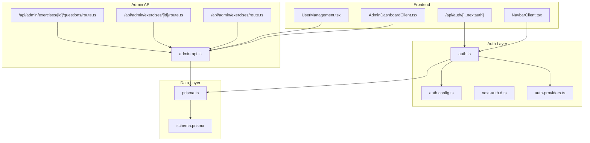
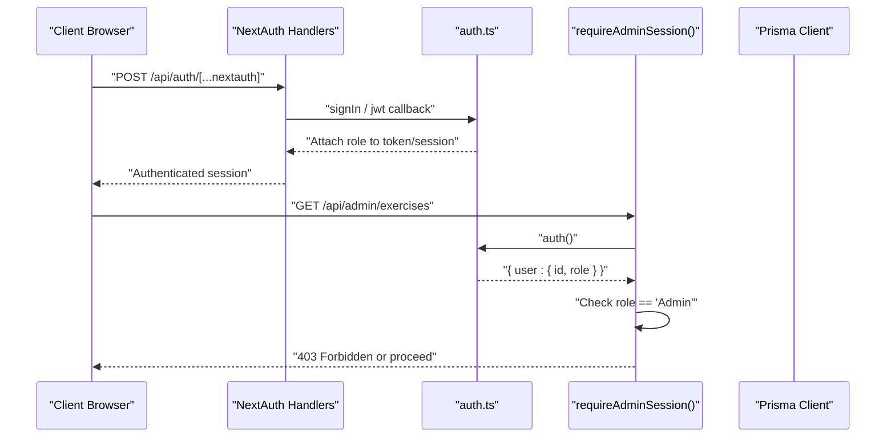
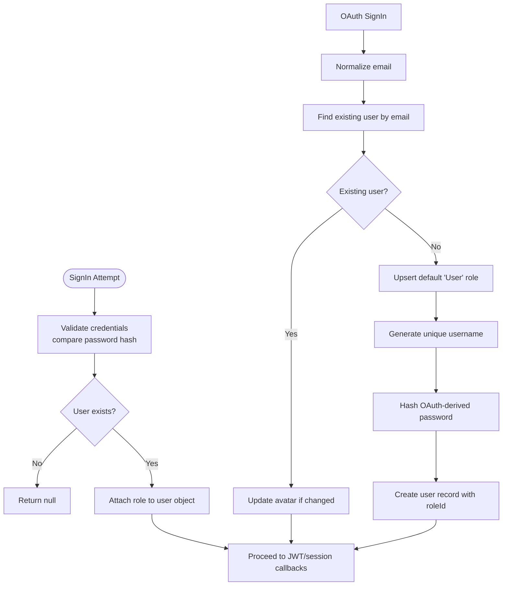
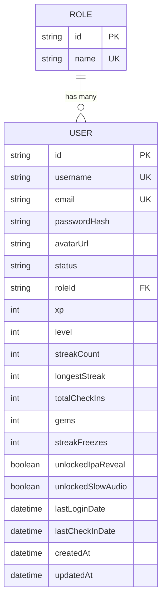
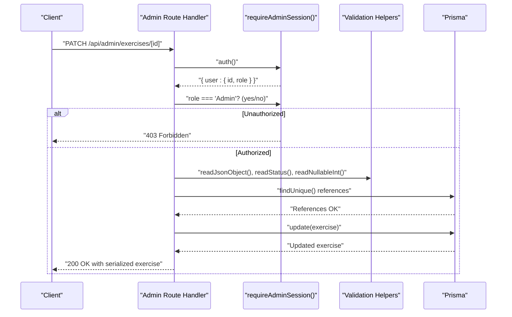
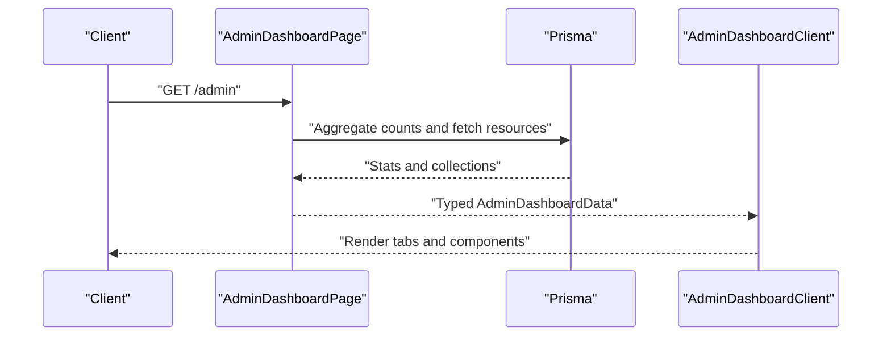
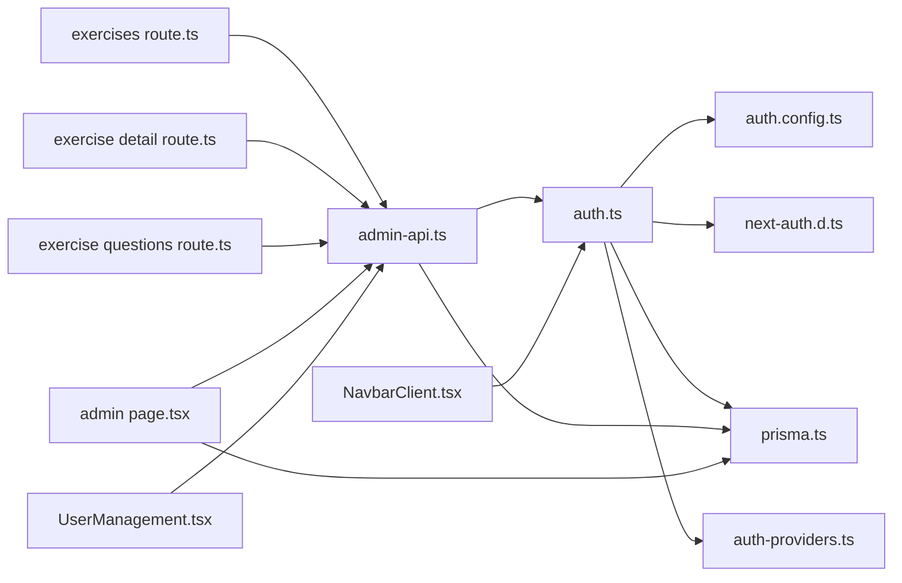

# User Profile and Permissions

<cite>
**Referenced Files in This Document**
- [auth.ts](file://english_pronunciation_app/frontend/src/lib/auth.ts)
- [auth.config.ts](file://english_pronunciation_app/frontend/src/lib/auth.config.ts)
- [next-auth.d.ts](file://english_pronunciation_app/frontend/src/types/next-auth.d.ts)
- [auth-providers.ts](file://english_pronunciation_app/frontend/src/lib/auth-providers.ts)
- [prisma.ts](file://english_pronunciation_app/frontend/src/lib/prisma.ts)
- [schema.prisma](file://english_pronunciation_app/frontend/prisma/schema.prisma)
- [admin-api.ts](file://english_pronunciation_app/frontend/src/lib/admin-api.ts)
- [admin page.tsx](file://english_pronunciation_app/frontend/src/app/admin/page.tsx)
- [AdminDashboardClient.tsx](file://english_pronunciation_app/frontend/src/components/admin/AdminDashboardClient.tsx)
- [UserManagement.tsx](file://english_pronunciation_app/frontend/src/components/admin/UserManagement.tsx)
- [NavbarClient.tsx](file://english_pronunciation_app/frontend/src/components/layout/NavbarClient.tsx)
- [exercises route.ts](file://english_pronunciation_app/frontend/src/app/api/admin/exercises/route.ts)
- [exercise detail route.ts](file://english_pronunciation_app/frontend/src/app/api/admin/exercises/[id]/route.ts)
- [exercise questions route.ts](file://english_pronunciation_app/frontend/src/app/api/admin/exercises/[id]/questions/route.ts)
- [auth route.ts](file://english_pronunciation_app/frontend/src/app/api/auth/[...nextauth]/route.ts)
</cite>

## Table of Contents
1. [Introduction](#introduction)
2. [Project Structure](#project-structure)
3. [Core Components](#core-components)
4. [Architecture Overview](#architecture-overview)
5. [Detailed Component Analysis](#detailed-component-analysis)
6. [Dependency Analysis](#dependency-analysis)
7. [Performance Considerations](#performance-considerations)
8. [Troubleshooting Guide](#troubleshooting-guide)
9. [Conclusion](#conclusion)
10. [Appendices](#appendices)

## Introduction
This document explains the user profile management and permission systems in the English pronunciation application. It covers role-based access control (RBAC), admin privileges, user data management, and the integration between authentication roles and application features. It documents the user profile structure, role assignment, permission checking mechanisms, and dynamic access control. Concrete examples demonstrate admin-only routes, user data CRUD operations, and role-based UI rendering. It also addresses user profile updates, role modifications, and audit trail requirements, along with the relationship between authenticated sessions and administrative capabilities.

## Project Structure
The system centers around:
- Authentication and session management using NextAuth.js with JWT strategy
- Role model and user-role relations in the Prisma schema
- Admin API routes enforcing role checks via a dedicated middleware
- Admin UI components rendering role-aware views
- Frontend navigation adapting to user roles

**Diagram sources**
- [NavbarClient.tsx:45-105](file://english_pronunciation_app/frontend/src/components/layout/NavbarClient.tsx#L45-L105)
- [AdminDashboardClient.tsx:16-56](file://english_pronunciation_app/frontend/src/components/admin/AdminDashboardClient.tsx#L16-L56)
- [UserManagement.tsx:29-98](file://english_pronunciation_app/frontend/src/components/admin/UserManagement.tsx#L29-L98)
- [auth.ts:76-151](file://english_pronunciation_app/frontend/src/lib/auth.ts#L76-L151)
- [auth.config.ts:3-24](file://english_pronunciation_app/frontend/src/lib/auth.config.ts#L3-L24)
- [next-auth.d.ts:3-21](file://english_pronunciation_app/frontend/src/types/next-auth.d.ts#L3-L21)
- [auth-providers.ts:1-15](file://english_pronunciation_app/frontend/src/lib/auth-providers.ts#L1-L15)
- [admin-api.ts:26-48](file://english_pronunciation_app/frontend/src/lib/admin-api.ts#L26-L48)
- [exercises route.ts:42-62](file://english_pronunciation_app/frontend/src/app/api/admin/exercises/route.ts#L42-L62)
- [exercise detail route.ts:86-102](file://english_pronunciation_app/frontend/src/app/api/admin/exercises/[id]/route.ts#L86-L102)
- [exercise questions route.ts:98-127](file://english_pronunciation_app/frontend/src/app/api/admin/exercises/[id]/questions/route.ts#L98-L127)
- [prisma.ts:1-13](file://english_pronunciation_app/frontend/src/lib/prisma.ts#L1-L13)
- [schema.prisma:14-59](file://english_pronunciation_app/frontend/prisma/schema.prisma#L14-L59)

**Section sources**
- [auth.ts:76-151](file://english_pronunciation_app/frontend/src/lib/auth.ts#L76-L151)
- [auth.config.ts:3-24](file://english_pronunciation_app/frontend/src/lib/auth.config.ts#L3-L24)
- [next-auth.d.ts:3-21](file://english_pronunciation_app/frontend/src/types/next-auth.d.ts#L3-L21)
- [auth-providers.ts:1-15](file://english_pronunciation_app/frontend/src/lib/auth-providers.ts#L1-L15)
- [prisma.ts:1-13](file://english_pronunciation_app/frontend/src/lib/prisma.ts#L1-L13)
- [schema.prisma:14-59](file://english_pronunciation_app/frontend/prisma/schema.prisma#L14-L59)
- [admin-api.ts:26-48](file://english_pronunciation_app/frontend/src/lib/admin-api.ts#L26-L48)
- [exercises route.ts:42-62](file://english_pronunciation_app/frontend/src/app/api/admin/exercises/route.ts#L42-L62)
- [exercise detail route.ts:86-102](file://english_pronunciation_app/frontend/src/app/api/admin/exercises/[id]/route.ts#L86-L102)
- [exercise questions route.ts:98-127](file://english_pronunciation_app/frontend/src/app/api/admin/exercises/[id]/questions/route.ts#L98-L127)
- [auth route.ts:1-4](file://english_pronunciation_app/frontend/src/app/api/auth/[...nextauth]/route.ts#L1-L4)
- [NavbarClient.tsx:45-105](file://english_pronunciation_app/frontend/src/components/layout/NavbarClient.tsx#L45-L105)
- [AdminDashboardClient.tsx:16-56](file://english_pronunciation_app/frontend/src/components/admin/AdminDashboardClient.tsx#L16-L56)
- [UserManagement.tsx:29-98](file://english_pronunciation_app/frontend/src/components/admin/UserManagement.tsx#L29-L98)

## Core Components
- Authentication and session management:
  - NextAuth.js with JWT strategy, custom providers (Credentials and optional Google OAuth), and callbacks to attach role to tokens/sessions
  - Strong typing for session and JWT via module augmentation
- Role and user model:
  - Role model with unique name and relation to User
  - User model with role relation, profile fields, gamification fields, and status
- Admin API:
  - Centralized admin guard requiring authenticated session and Admin role
  - Validation helpers and status enumerations
- Admin UI:
  - Admin dashboard client with tabs for overview, users, exercises, topics, audio, badges, reports
  - User management table with filtering and status badges
- Navigation:
  - Navbar renders Admin link conditionally based on isAdmin flag derived from session

**Section sources**
- [auth.ts:76-151](file://english_pronunciation_app/frontend/src/lib/auth.ts#L76-L151)
- [auth.config.ts:3-24](file://english_pronunciation_app/frontend/src/lib/auth.config.ts#L3-L24)
- [next-auth.d.ts:3-21](file://english_pronunciation_app/frontend/src/types/next-auth.d.ts#L3-L21)
- [schema.prisma:14-59](file://english_pronunciation_app/frontend/prisma/schema.prisma#L14-L59)
- [admin-api.ts:26-48](file://english_pronunciation_app/frontend/src/lib/admin-api.ts#L26-L48)
- [AdminDashboardClient.tsx:16-56](file://english_pronunciation_app/frontend/src/components/admin/AdminDashboardClient.tsx#L16-L56)
- [UserManagement.tsx:29-98](file://english_pronunciation_app/frontend/src/components/admin/UserManagement.tsx#L29-L98)
- [NavbarClient.tsx:45-105](file://english_pronunciation_app/frontend/src/components/layout/NavbarClient.tsx#L45-L105)

## Architecture Overview
The system enforces role-based access control at the API boundary and reflects roles in the UI. Admin-only routes validate the session’s role and reject unauthorized requests. The UI conditionally renders admin controls and pages based on the presence of an Admin role.

**Diagram sources**
- [auth route.ts:1-4](file://english_pronunciation_app/frontend/src/app/api/auth/[...nextauth]/route.ts#L1-L4)
- [auth.ts:76-151](file://english_pronunciation_app/frontend/src/lib/auth.ts#L76-L151)
- [admin-api.ts:26-48](file://english_pronunciation_app/frontend/src/lib/admin-api.ts#L26-L48)
- [exercises route.ts:42-62](file://english_pronunciation_app/frontend/src/app/api/admin/exercises/route.ts#L42-L62)

## Detailed Component Analysis

### Authentication and Session Management
- Provider configuration:
  - Credentials provider for email/password login
  - Optional Google OAuth provider using environment variables
- Token and session callbacks:
  - Attach user ID and role to JWT and session
  - Normalize email and derive username for OAuth users
  - Upsert default User role and create users on first OAuth sign-in
- Strong typing:
  - Augments NextAuth session and JWT types to include optional role

**Diagram sources**
- [auth.ts:93-114](file://english_pronunciation_app/frontend/src/lib/auth.ts#L93-L114)
- [auth.ts:119-148](file://english_pronunciation_app/frontend/src/lib/auth.ts#L119-L148)
- [auth.ts:36-74](file://english_pronunciation_app/frontend/src/lib/auth.ts#L36-L74)
- [auth.config.ts:9-22](file://english_pronunciation_app/frontend/src/lib/auth.config.ts#L9-L22)
- [next-auth.d.ts:3-21](file://english_pronunciation_app/frontend/src/types/next-auth.d.ts#L3-L21)

**Section sources**
- [auth.ts:76-151](file://english_pronunciation_app/frontend/src/lib/auth.ts#L76-L151)
- [auth.config.ts:3-24](file://english_pronunciation_app/frontend/src/lib/auth.config.ts#L3-L24)
- [next-auth.d.ts:3-21](file://english_pronunciation_app/frontend/src/types/next-auth.d.ts#L3-L21)
- [auth-providers.ts:1-15](file://english_pronunciation_app/frontend/src/lib/auth-providers.ts#L1-L15)

### Role Model and User Profile Structure
- Role model:
  - Unique name, ID, and relation to User
- User model:
  - Unique username, email, passwordHash, avatarUrl, status
  - Role relation via roleId
  - Gamification fields (XP, level, streaks, gems)
  - Audit timestamps and relations to progresses, attempts, badges, leaderboards, daily quests

**Diagram sources**
- [schema.prisma:14-59](file://english_pronunciation_app/frontend/prisma/schema.prisma#L14-L59)

**Section sources**
- [schema.prisma:14-59](file://english_pronunciation_app/frontend/prisma/schema.prisma#L14-L59)

### Admin Permission Guard and API Contracts
- Admin guard:
  - Requires authenticated session and role equality to "Admin"
  - Returns structured failure responses for unauthenticated or insufficient privilege
- Status enumerations:
  - Exercise, question, and map statuses defined centrally
- Validation helpers:
  - JSON parsing, required/optional/nullable string/int validators
  - Status validators with defaults and strictness
- Exercise CRUD:
  - List, create, update (PATCH), delete (archive) with validation and reference checks
- Exercise questions CRUD:
  - List and create questions with content parsing and options validation
  - Transactional updates and question count refresh

**Diagram sources**
- [admin-api.ts:26-48](file://english_pronunciation_app/frontend/src/lib/admin-api.ts#L26-L48)
- [exercise detail route.ts:104-173](file://english_pronunciation_app/frontend/src/app/api/admin/exercises/[id]/route.ts#L104-L173)
- [admin-api.ts:54-118](file://english_pronunciation_app/frontend/src/lib/admin-api.ts#L54-L118)

**Section sources**
- [admin-api.ts:26-48](file://english_pronunciation_app/frontend/src/lib/admin-api.ts#L26-L48)
- [admin-api.ts:54-118](file://english_pronunciation_app/frontend/src/lib/admin-api.ts#L54-L118)
- [exercise detail route.ts:86-173](file://english_pronunciation_app/frontend/src/app/api/admin/exercises/[id]/route.ts#L86-L173)
- [exercises route.ts:42-124](file://english_pronunciation_app/frontend/src/app/api/admin/exercises/route.ts#L42-L124)
- [exercise questions route.ts:98-209](file://english_pronunciation_app/frontend/src/app/api/admin/exercises/[id]/questions/route.ts#L98-L209)

### Admin Dashboard and Role-Based UI Rendering
- Admin dashboard page:
  - Aggregates statistics and lists resources (users, exercises, topics, levels, maps, audio files)
  - Passes typed data to client component
- Admin dashboard client:
  - Tabs for overview, users, exercises, topics, audio, badges, reports
  - Renders user table and exercise management UI
- User management:
  - Filters users by username/email and displays status badges
- Navigation:
  - Admin link visible only when isAdmin is true (derived from session role)

**Diagram sources**
- [admin page.tsx:6-248](file://english_pronunciation_app/frontend/src/app/admin/page.tsx#L6-L248)
- [AdminDashboardClient.tsx:70-196](file://english_pronunciation_app/frontend/src/components/admin/AdminDashboardClient.tsx#L70-L196)
- [UserManagement.tsx:29-98](file://english_pronunciation_app/frontend/src/components/admin/UserManagement.tsx#L29-L98)
- [NavbarClient.tsx:45-105](file://english_pronunciation_app/frontend/src/components/layout/NavbarClient.tsx#L45-L105)

**Section sources**
- [admin page.tsx:6-248](file://english_pronunciation_app/frontend/src/app/admin/page.tsx#L6-L248)
- [AdminDashboardClient.tsx:70-196](file://english_pronunciation_app/frontend/src/components/admin/AdminDashboardClient.tsx#L70-L196)
- [UserManagement.tsx:29-98](file://english_pronunciation_app/frontend/src/components/admin/UserManagement.tsx#L29-L98)
- [NavbarClient.tsx:45-105](file://english_pronunciation_app/frontend/src/components/layout/NavbarClient.tsx#L45-L105)

### User Data Management Examples
- Creating a user via OAuth:
  - Normalize email, upsert default role, generate unique username, hash password, and persist user
- Updating user profile:
  - Use admin routes to modify user attributes (e.g., status) after validating session and role
- Managing user roles:
  - Role assignment occurs at user creation (default "User") and can be extended via admin endpoints
- Auditing:
  - Use Prisma logs and application-level logging to track admin actions

**Section sources**
- [auth.ts:36-74](file://english_pronunciation_app/frontend/src/lib/auth.ts#L36-L74)
- [admin-api.ts:26-48](file://english_pronunciation_app/frontend/src/lib/admin-api.ts#L26-L48)
- [prisma.ts:1-13](file://english_pronunciation_app/frontend/src/lib/prisma.ts#L1-L13)

## Dependency Analysis
- Authentication depends on:
  - NextAuth configuration and providers
  - Prisma for user and role persistence
  - Environment variables for Google OAuth
- Admin API depends on:
  - Auth guard for role enforcement
  - Prisma for data operations
  - Validation helpers for request payloads
- UI depends on:
  - Session data to decide visibility of admin features
  - Admin dashboard data for rendering

**Diagram sources**
- [auth.ts:76-151](file://english_pronunciation_app/frontend/src/lib/auth.ts#L76-L151)
- [auth.config.ts:3-24](file://english_pronunciation_app/frontend/src/lib/auth.config.ts#L3-L24)
- [next-auth.d.ts:3-21](file://english_pronunciation_app/frontend/src/types/next-auth.d.ts#L3-L21)
- [auth-providers.ts:1-15](file://english_pronunciation_app/frontend/src/lib/auth-providers.ts#L1-L15)
- [prisma.ts:1-13](file://english_pronunciation_app/frontend/src/lib/prisma.ts#L1-L13)
- [admin-api.ts:26-48](file://english_pronunciation_app/frontend/src/lib/admin-api.ts#L26-L48)
- [exercises route.ts:42-62](file://english_pronunciation_app/frontend/src/app/api/admin/exercises/route.ts#L42-L62)
- [exercise detail route.ts:86-102](file://english_pronunciation_app/frontend/src/app/api/admin/exercises/[id]/route.ts#L86-L102)
- [exercise questions route.ts:98-127](file://english_pronunciation_app/frontend/src/app/api/admin/exercises/[id]/questions/route.ts#L98-L127)
- [admin page.tsx:6-248](file://english_pronunciation_app/frontend/src/app/admin/page.tsx#L6-L248)
- [NavbarClient.tsx:45-105](file://english_pronunciation_app/frontend/src/components/layout/NavbarClient.tsx#L45-L105)
- [UserManagement.tsx:29-98](file://english_pronunciation_app/frontend/src/components/admin/UserManagement.tsx#L29-L98)

**Section sources**
- [auth.ts:76-151](file://english_pronunciation_app/frontend/src/lib/auth.ts#L76-L151)
- [admin-api.ts:26-48](file://english_pronunciation_app/frontend/src/lib/admin-api.ts#L26-L48)
- [exercises route.ts:42-62](file://english_pronunciation_app/frontend/src/app/api/admin/exercises/route.ts#L42-L62)
- [exercise detail route.ts:86-102](file://english_pronunciation_app/frontend/src/app/api/admin/exercises/[id]/route.ts#L86-L102)
- [exercise questions route.ts:98-127](file://english_pronunciation_app/frontend/src/app/api/admin/exercises/[id]/questions/route.ts#L98-L127)
- [admin page.tsx:6-248](file://english_pronunciation_app/frontend/src/app/admin/page.tsx#L6-L248)
- [NavbarClient.tsx:45-105](file://english_pronunciation_app/frontend/src/components/layout/NavbarClient.tsx#L45-L105)
- [UserManagement.tsx:29-98](file://english_pronunciation_app/frontend/src/components/admin/UserManagement.tsx#L29-L98)

## Performance Considerations
- Use database indexes on frequently queried fields (e.g., unique usernames, emails, role relations)
- Batch queries in admin dashboards to reduce round-trips (already implemented via Promise.all)
- Keep validation helpers efficient and fail fast to avoid unnecessary DB calls
- Consider pagination for large resource listings in admin APIs

## Troubleshooting Guide
- Authentication failures:
  - Verify environment variables for Google OAuth are set when enabling OAuth
  - Ensure email normalization and unique username generation work as expected
- Admin access denied:
  - Confirm session contains role and equals "Admin"
  - Check that requireAdminSession returns 403 for non-admins
- Validation errors:
  - Review payload shape and constraints enforced by validation helpers
  - Ensure references (topic, level, map) exist before creating/updating exercises
- UI not showing admin features:
  - Verify isAdmin flag is computed from session.user.role
  - Confirm NavbarClient receives the correct user and role state

**Section sources**
- [auth-providers.ts:1-15](file://english_pronunciation_app/frontend/src/lib/auth-providers.ts#L1-L15)
- [auth.ts:119-148](file://english_pronunciation_app/frontend/src/lib/auth.ts#L119-L148)
- [admin-api.ts:26-48](file://english_pronunciation_app/frontend/src/lib/admin-api.ts#L26-L48)
- [admin-api.ts:54-118](file://english_pronunciation_app/frontend/src/lib/admin-api.ts#L54-L118)
- [NavbarClient.tsx:45-105](file://english_pronunciation_app/frontend/src/components/layout/NavbarClient.tsx#L45-L105)

## Conclusion
The system implements a clean RBAC model with NextAuth-managed sessions and a central admin guard enforcing Admin role at the API boundary. The Prisma schema supports user profiles, roles, and gamification metrics. Admin routes provide robust CRUD operations with validation and referential integrity. The UI dynamically renders admin features based on session roles. Extending the system to support permission inheritance or dynamic access control can be achieved by adding permission matrices and policy evaluation layers on top of the existing role checks.

## Appendices

### Appendix A: Admin-Only Routes Reference
- List exercises: GET /api/admin/exercises
- Create exercise: POST /api/admin/exercises
- Get exercise detail: GET /api/admin/exercises/[id]
- Update exercise: PATCH /api/admin/exercises/[id]
- Archive exercise: DELETE /api/admin/exercises/[id]
- List exercise questions: GET /api/admin/exercises/[id]/questions
- Create question: POST /api/admin/exercises/[id]/questions

**Section sources**
- [exercises route.ts:42-124](file://english_pronunciation_app/frontend/src/app/api/admin/exercises/route.ts#L42-L124)
- [exercise detail route.ts:86-212](file://english_pronunciation_app/frontend/src/app/api/admin/exercises/[id]/route.ts#L86-L212)
- [exercise questions route.ts:98-209](file://english_pronunciation_app/frontend/src/app/api/admin/exercises/[id]/questions/route.ts#L98-L209)

### Appendix B: Role Assignment and Session Flow
- Default role assignment during OAuth sign-up
- Role attached to JWT and session via callbacks
- Admin guard reads role from session to enforce access

**Section sources**
- [auth.ts:36-74](file://english_pronunciation_app/frontend/src/lib/auth.ts#L36-L74)
- [auth.config.ts:9-22](file://english_pronunciation_app/frontend/src/lib/auth.config.ts#L9-L22)
- [admin-api.ts:26-48](file://english_pronunciation_app/frontend/src/lib/admin-api.ts#L26-L48)