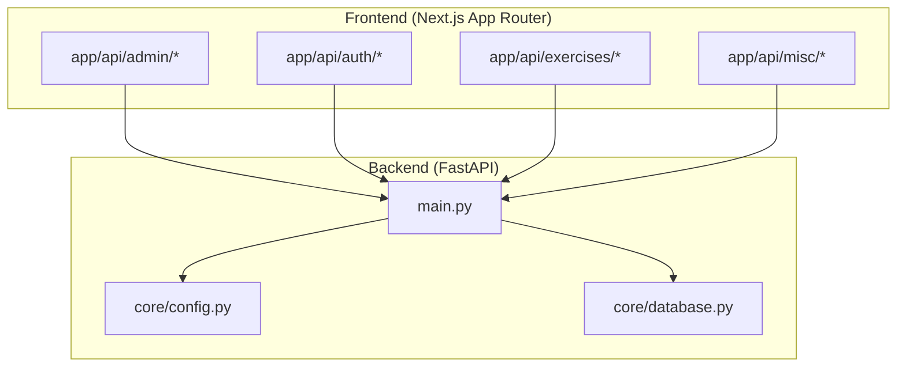
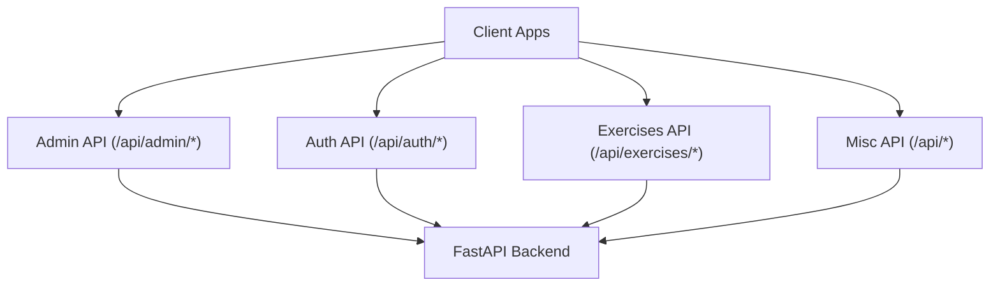
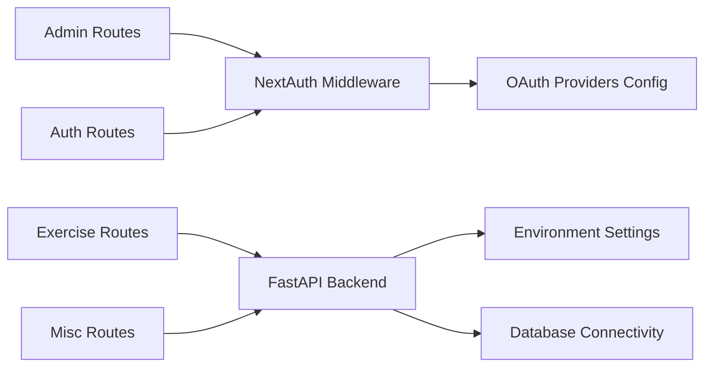

# API Endpoints and Routing

<cite>
**Referenced Files in This Document**
- [main.py](file://english_pronunciation_app/backend/app/main.py)
- [config.py](file://english_pronunciation_app/backend/app/core/config.py)
- [database.py](file://english_pronunciation_app/backend/app/core/database.py)
- [admin-api.ts](file://english_pronunciation_app/frontend/src/lib/admin-api.ts)
- [auth.config.ts](file://english_pronunciation_app/frontend/src/lib/auth.config.ts)
- [auth.ts](file://english_pronunciation_app/frontend/src/lib/auth.ts)
- [route.ts](file://english_pronunciation_app/frontend/src/app/api/admin/exercises/[id]/questions/route.ts)
- [route.ts](file://english_pronunciation_app/frontend/src/app/api/admin/exercises/[id]/route.ts)
- [route.ts](file://english_pronunciation_app/frontend/src/app/api/admin/exercises/route.ts)
- [route.ts](file://english_pronunciation_app/frontend/src/app/api/admin/levels/[id]/route.ts)
- [route.ts](file://english_pronunciation_app/frontend/src/app/api/admin/levels/route.ts)
- [route.ts](file://english_pronunciation_app/frontend/src/app/api/admin/maps/[id]/route.ts)
- [route.ts](file://english_pronunciation_app/frontend/src/app/api/admin/maps/route.ts)
- [route.ts](file://english_pronunciation_app/frontend/src/app/api/admin/questions[questionId]/route.ts)
- [route.ts](file://english_pronunciation_app/frontend/src/app/api/admin/topics/[id]/route.ts)
- [route.ts](file://english_pronunciation_app/frontend/src/app/api/admin/topics/route.ts)
- [route.ts](file://english_pronunciation_app/frontend/src/app/api/auth/[...nextauth]/route.ts)
- [route.ts](file://english_pronunciation_app/frontend/src/app/api/auth/forgot-password/route.ts)
- [route.ts](file://english_pronunciation_app/frontend/src/app/api/auth/register/route.ts)
- [route.ts](file://english_pronunciation_app/frontend/src/app/api/auth/reset-password/route.ts)
- [route.ts](file://english_pronunciation_app/frontend/src/app/api/badges/check/route.ts)
- [route.ts](file://english_pronunciation_app/frontend/src/app/api/badges/route.ts)
- [route.ts](file://english_pronunciation_app/frontend/src/app/api/checkin/route.ts)
- [route.ts](file://english_pronunciation_app/frontend/src/app/api/exercises/submit/route.ts)
- [route.ts](file://english_pronunciation_app/frontend/src/app/api/leaderboard/route.ts)
</cite>

## Table of Contents
1. [Introduction](#introduction)
2. [Project Structure](#project-structure)
3. [Core Components](#core-components)
4. [Architecture Overview](#architecture-overview)
5. [Detailed Component Analysis](#detailed-component-analysis)
6. [Dependency Analysis](#dependency-analysis)
7. [Performance Considerations](#performance-considerations)
8. [Troubleshooting Guide](#troubleshooting-guide)
9. [Conclusion](#conclusion)

## Introduction
This document provides comprehensive API documentation for the backend and frontend APIs that power the pronunciation assessment platform. It covers:
- RESTful API structure and routing patterns
- Endpoint URLs, HTTP methods, and request/response schemas
- Admin API endpoints for content management
- Authentication endpoints for user management
- Exercise-related endpoints for pronunciation assessment
- Request parameter validation, response formatting, and error handling patterns
- Examples of API usage, authentication requirements, and data serialization
- Endpoint versioning, rate limiting, and security considerations

## Project Structure
The API surface is primarily implemented in the frontend Next.js App Router under the app/api hierarchy. The backend is a minimal FastAPI service configured via environment settings and CORS middleware. The frontend integrates with external services for authentication and admin operations.

**Diagram sources**
- [main.py:1-43](file://english_pronunciation_app/backend/app/main.py#L1-L43)
- [config.py](file://english_pronunciation_app/backend/app/core/config.py)
- [database.py](file://english_pronunciation_app/backend/app/core/database.py)

**Section sources**
- [main.py:1-43](file://english_pronunciation_app/backend/app/main.py#L1-L43)

## Core Components
- Backend service bootstrap and health checks
- CORS configuration for cross-origin requests
- Environment-driven settings for app metadata and runtime behavior
- Database connectivity verification

Key behaviors:
- Root and health endpoints expose service metadata and database status
- CORS allows standard HTTP methods and credentials
- Settings are loaded from environment variables

**Section sources**
- [main.py:10-42](file://english_pronunciation_app/backend/app/main.py#L10-L42)
- [config.py](file://english_pronunciation_app/backend/app/core/config.py)
- [database.py](file://english_pronunciation_app/backend/app/core/database.py)

## Architecture Overview
The frontend routes define REST endpoints grouped by domain:
- Admin API: manage exercises, levels, maps, topics, and questions
- Authentication API: NextAuth-based OAuth and password flows
- Exercises API: submit assessments and retrieve leaderboard data
- Miscellaneous: badges, check-in, and leaderboard endpoints

**Diagram sources**
- [route.ts](file://english_pronunciation_app/frontend/src/app/api/admin/exercises/[id]/route.ts)
- [route.ts](file://english_pronunciation_app/frontend/src/app/api/auth/[...nextauth]/route.ts)
- [route.ts](file://english_pronunciation_app/frontend/src/app/api/exercises/submit/route.ts)
- [route.ts](file://english_pronunciation_app/frontend/src/app/api/leaderboard/route.ts)

## Detailed Component Analysis

### Admin API Endpoints
Purpose: Content management for exercises, levels, maps, topics, and questions.

- Base Path: /api/admin
- Methods: GET, POST, PUT, PATCH, DELETE
- Authentication: Requires admin session (NextAuth)
- Validation: Route parameters and body validated by route handlers
- Responses: JSON objects; errors returned as structured JSON

Endpoints:
- Exercises
  - GET /api/admin/exercises
  - POST /api/admin/exercises
  - GET /api/admin/exercises/[id]
  - PUT /api/admin/exercises/[id]
  - DELETE /api/admin/exercises/[id]
  - Questions
    - GET /api/admin/exercises/[id]/questions
    - POST /api/admin/exercises/[id]/questions
    - GET /api/admin/exercises/[id]/questions/[questionId]
    - PUT /api/admin/exercises/[id]/questions/[questionId]
    - DELETE /api/admin/exercises/[id]/questions/[questionId]

- Levels
  - GET /api/admin/levels
  - POST /api/admin/levels
  - GET /api/admin/levels/[id]
  - PUT /api/admin/levels/[id]
  - DELETE /api/admin/levels/[id]

- Maps
  - GET /api/admin/maps
  - POST /api/admin/maps
  - GET /api/admin/maps/[id]
  - PUT /api/admin/maps/[id]
  - DELETE /api/admin/maps/[id]

- Topics
  - GET /api/admin/topics
  - POST /api/admin/topics
  - GET /api/admin/topics/[id]
  - PUT /api/admin/topics/[id]
  - DELETE /api/admin/topics/[id]

- Question (single resource)
  - GET /api/admin/questions[questionId]
  - PUT /api/admin/questions[questionId]
  - DELETE /api/admin/questions[questionId]

Request/Response Patterns:
- Path parameters: [id], [questionId]
- Query/body validation handled inside route handlers
- Responses: Standardized JSON envelopes; errors include status codes and messages

Security:
- Admin-only access enforced by NextAuth middleware
- CSRF and session protection via NextAuth configuration

Examples:
- Retrieve all exercises: GET /api/admin/exercises
- Create a new exercise: POST /api/admin/exercises with JSON body
- Update a level: PUT /api/admin/levels/[id] with JSON body
- Delete a topic: DELETE /api/admin/topics/[id]

**Section sources**
- [route.ts](file://english_pronunciation_app/frontend/src/app/api/admin/exercises/[id]/route.ts)
- [route.ts](file://english_pronunciation_app/frontend/src/app/api/admin/exercises/[id]/questions/route.ts)
- [route.ts](file://english_pronunciation_app/frontend/src/app/api/admin/exercises/route.ts)
- [route.ts](file://english_pronunciation_app/frontend/src/app/api/admin/levels/[id]/route.ts)
- [route.ts](file://english_pronunciation_app/frontend/src/app/api/admin/levels/route.ts)
- [route.ts](file://english_pronunciation_app/frontend/src/app/api/admin/maps/[id]/route.ts)
- [route.ts](file://english_pronunciation_app/frontend/src/app/api/admin/maps/route.ts)
- [route.ts](file://english_pronunciation_app/frontend/src/app/api/admin/questions[questionId]/route.ts)
- [route.ts](file://english_pronunciation_app/frontend/src/app/api/admin/topics/[id]/route.ts)
- [route.ts](file://english_pronunciation_app/frontend/src/app/api/admin/topics/route.ts)

### Authentication API Endpoints
Purpose: User registration, login, logout, password reset, and NextAuth integration.

- Base Path: /api/auth
- Methods: GET, POST, OPTIONS (via NextAuth)
- Authentication: NextAuth-based OAuth providers and password flows
- Validation: Form fields validated by NextAuth and provider configurations
- Responses: Redirects and JSON for password reset endpoints

Endpoints:
- NextAuth
  - GET/POST /api/auth/[...nextauth] (NextAuth adapter)
- Register
  - POST /api/auth/register with registration payload
- Forgot Password
  - POST /api/auth/forgot-password with email
- Reset Password
  - POST /api/auth/reset-password with token and new password

Request/Response Patterns:
- NextAuth manages OAuth callbacks and sessions
- Registration and password reset endpoints accept JSON bodies
- Responses include tokens, redirects, or error messages

Security:
- NextAuth handles secure cookies, CSRF, and session management
- Providers configured centrally for OAuth flows

Examples:
- Login via OAuth: GET /api/auth/[...nextauth]
- Register: POST /api/auth/register with { email, password, name }
- Forgot password: POST /api/auth/forgot-password with { email }
- Reset password: POST /api/auth/reset-password with { token, password }

**Section sources**
- [route.ts](file://english_pronunciation_app/frontend/src/app/api/auth/[...nextauth]/route.ts)
- [route.ts](file://english_pronunciation_app/frontend/src/app/api/auth/register/route.ts)
- [route.ts](file://english_pronunciation_app/frontend/src/app/api/auth/forgot-password/route.ts)
- [route.ts](file://english_pronunciation_app/frontend/src/app/api/auth/reset-password/route.ts)
- [auth.config.ts](file://english_pronunciation_app/frontend/src/lib/auth.config.ts)
- [auth.ts](file://english_pronunciation_app/frontend/src/lib/auth.ts)

### Exercise and Pronunciation Assessment Endpoints
Purpose: Submit pronunciation exercises and retrieve leaderboard data.

- Base Path: /api/exercises
- Methods: POST (submit), GET (leaderboard)
- Authentication: Requires authenticated session
- Validation: Audio submission and exercise answers validated by route handlers
- Responses: JSON with scoring results, feedback, and analytics

Endpoints:
- Submit Exercise
  - POST /api/exercises/submit with audio recording and exercise metadata
- Leaderboard
  - GET /api/leaderboard retrieves ranking data

Request/Response Patterns:
- Audio uploads handled via multipart/form-data or base64-encoded payloads
- Responses include scores, phoneme-level feedback, and progress metrics
- Leaderboard returns paginated or filtered rankings

Security:
- Session required; unauthorized access blocked by middleware
- Rate limits and quotas can be enforced at the gateway or route handler

Examples:
- Submit assessment: POST /api/exercises/submit with { exerciseId, audioBlob, userId }
- Get leaderboard: GET /api/leaderboard?page=1&limit=20

**Section sources**
- [route.ts](file://english_pronunciation_app/frontend/src/app/api/exercises/submit/route.ts)
- [route.ts](file://english_pronunciation_app/frontend/src/app/api/leaderboard/route.ts)

### Miscellaneous Endpoints
Purpose: Badges, daily check-in, and general features.

- Badges
  - GET /api/badges retrieves badge inventory
  - POST /api/badges/check validates user badge criteria
- Check-in
  - POST /api/checkin records daily attendance
- Health and Info
  - GET /health (backend) returns service status and database connectivity

Request/Response Patterns:
- JSON payloads for badge checks and check-in actions
- Health endpoint returns environment and database status

Security:
- Some endpoints may require authentication depending on feature gating
- Admin-only endpoints protected by NextAuth roles

Examples:
- Check badge eligibility: POST /api/badges/check with { userId, criteria }
- Daily check-in: POST /api/checkin with { userId }

**Section sources**
- [route.ts](file://english_pronunciation_app/frontend/src/app/api/badges/route.ts)
- [route.ts](file://english_pronunciation_app/frontend/src/app/api/badges/check/route.ts)
- [route.ts](file://english_pronunciation_app/frontend/src/app/api/checkin/route.ts)
- [main.py:34-42](file://english_pronunciation_app/backend/app/main.py#L34-L42)

## Dependency Analysis
- Frontend routes depend on Next.js App Router conventions and NextAuth for authentication
- Backend depends on environment-driven settings and database connectivity
- Admin API relies on NextAuth session validation and provider configurations
- Exercise endpoints integrate with external speech analysis services

**Diagram sources**
- [route.ts](file://english_pronunciation_app/frontend/src/app/api/admin/exercises/[id]/route.ts)
- [route.ts](file://english_pronunciation_app/frontend/src/app/api/auth/[...nextauth]/route.ts)
- [route.ts](file://english_pronunciation_app/frontend/src/app/api/exercises/submit/route.ts)
- [main.py:1-43](file://english_pronunciation_app/backend/app/main.py#L1-L43)
- [auth.config.ts](file://english_pronunciation_app/frontend/src/lib/auth.config.ts)

**Section sources**
- [main.py:1-43](file://english_pronunciation_app/backend/app/main.py#L1-L43)
- [config.py](file://english_pronunciation_app/backend/app/core/config.py)

## Performance Considerations
- Minimize payload sizes for audio submissions; compress where appropriate
- Use pagination for leaderboard and admin listings
- Cache static assets and frequently accessed resources
- Offload heavy computations (speech analysis) to dedicated services
- Monitor database queries and apply indexing for admin filters

## Troubleshooting Guide
Common issues and resolutions:
- Authentication failures
  - Verify NextAuth cookie and session validity
  - Confirm provider credentials and callback URLs
- CORS errors
  - Ensure frontend origin matches backend allowed origins
  - Check credentials and header allowances
- Database connectivity
  - Health endpoint indicates database status
  - Review connection strings and network policies
- Admin permission denied
  - Confirm user role and session claims
  - Re-authenticate with admin privileges

**Section sources**
- [main.py:34-42](file://english_pronunciation_app/backend/app/main.py#L34-L42)
- [auth.config.ts](file://english_pronunciation_app/frontend/src/lib/auth.config.ts)
- [auth.ts](file://english_pronunciation_app/frontend/src/lib/auth.ts)

## Conclusion
The API architecture combines a minimal FastAPI backend with Next.js App Router endpoints. Admin, authentication, and exercise domains are cleanly separated, leveraging NextAuth for identity and FastAPI for service orchestration. Adhering to the documented patterns ensures consistent validation, security, and scalability across all endpoints.