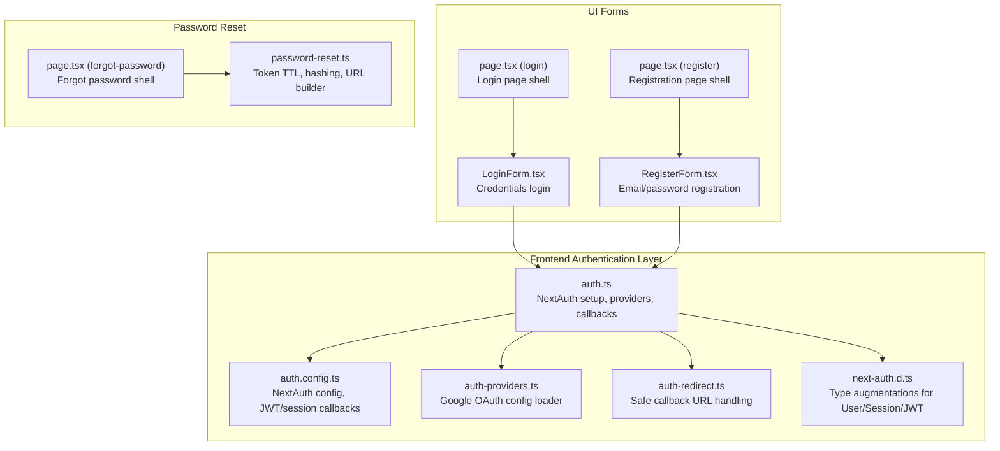
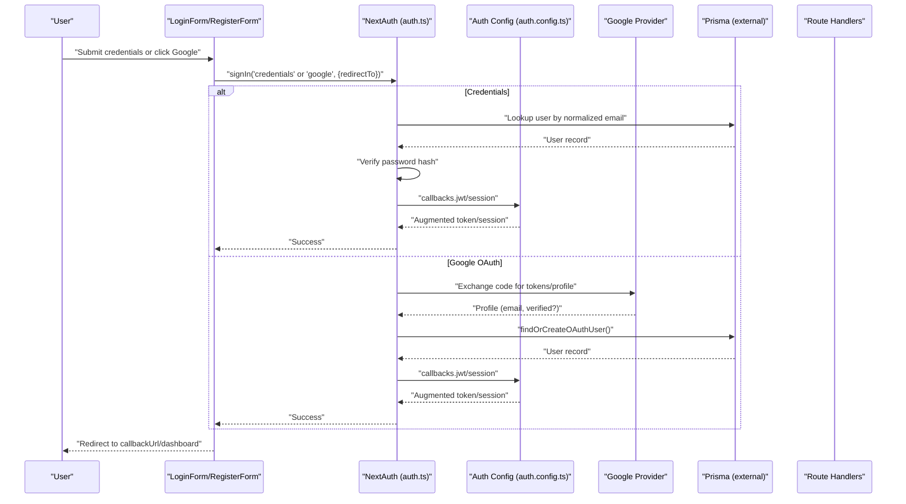
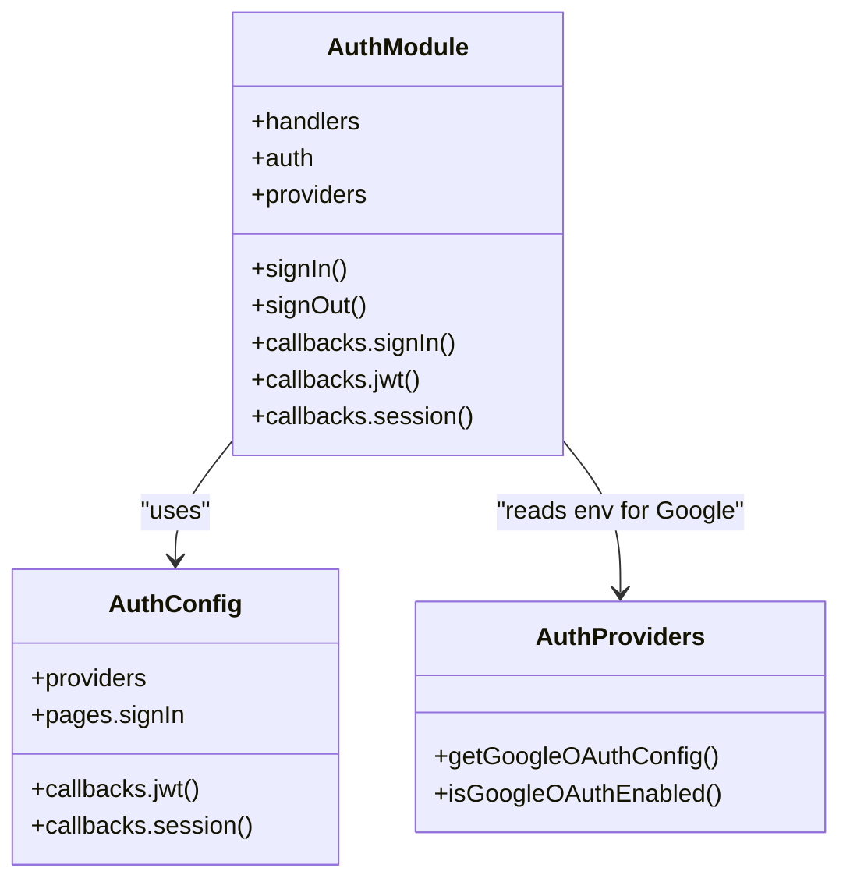
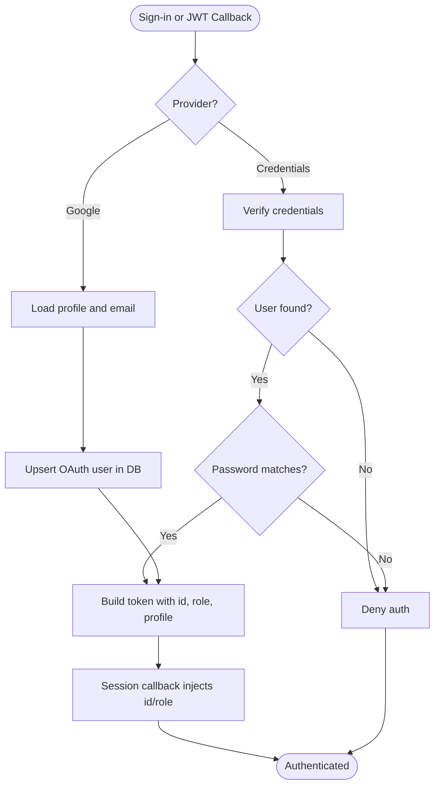
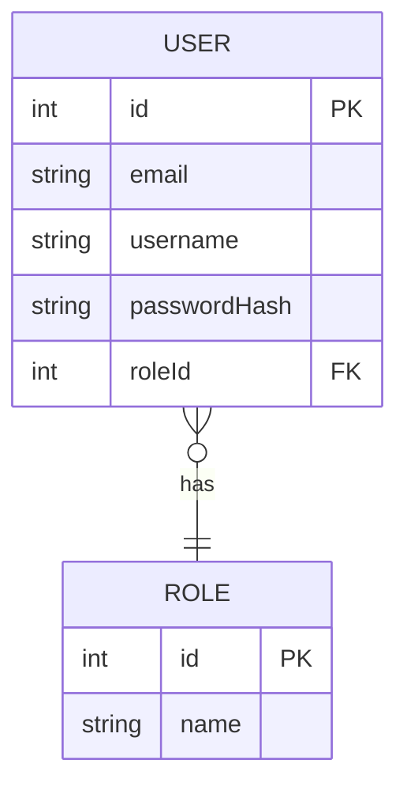
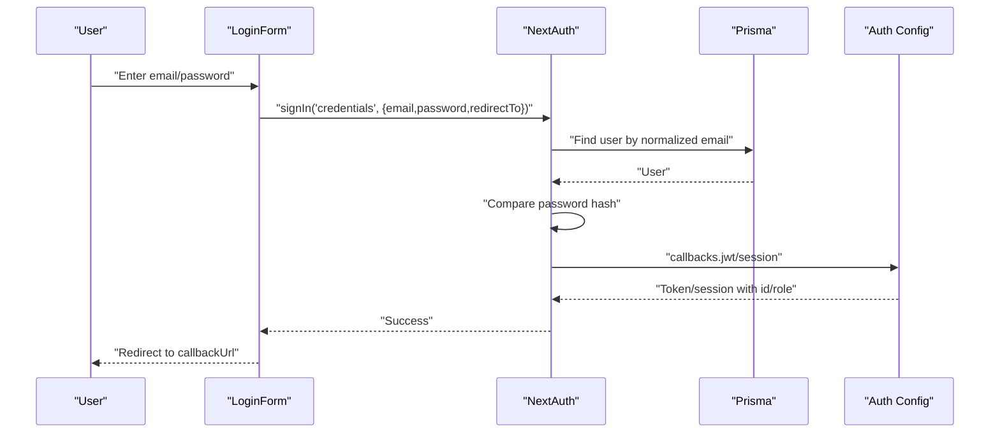
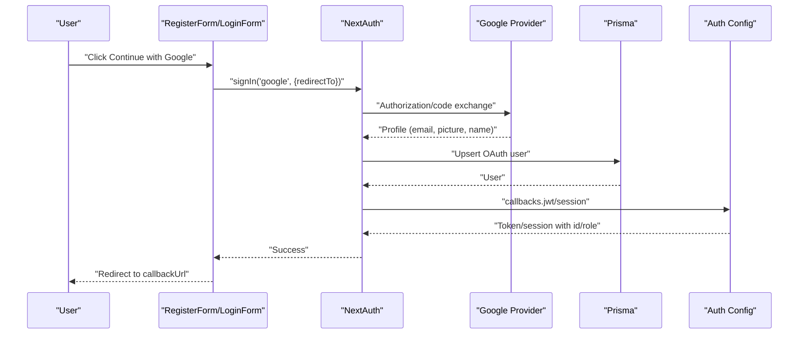
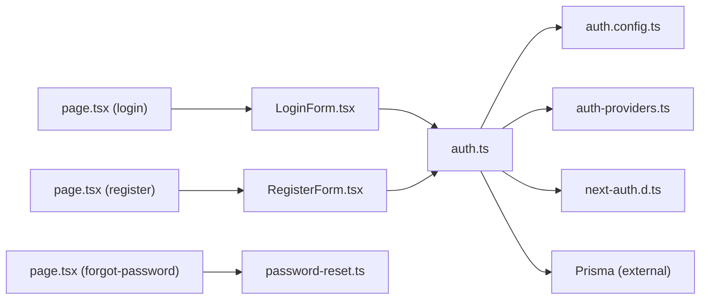

# Authentication and Security

<cite>
**Referenced Files in This Document**
- [auth.ts](file://english_pronunciation_app/frontend/src/lib/auth.ts)
- [auth.config.ts](file://english_pronunciation_app/frontend/src/lib/auth.config.ts)
- [auth-providers.ts](file://english_pronunciation_app/frontend/src/lib/auth-providers.ts)
- [auth-redirect.ts](file://english_pronunciation_app/frontend/src/lib/auth-redirect.ts)
- [next-auth.d.ts](file://english_pronunciation_app/frontend/src/types/next-auth.d.ts)
- [LoginForm.tsx](file://english_pronunciation_app/frontend/src/app/login/LoginForm.tsx)
- [RegisterForm.tsx](file://english_pronunciation_app/frontend/src/app/register/RegisterForm.tsx)
- [page.tsx (login)](file://english_pronunciation_app/frontend/src/app/login/page.tsx)
- [page.tsx (register)](file://english_pronunciation_app/frontend/src/app/register/page.tsx)
- [password-reset.ts](file://english_pronunciation_app/frontend/src/lib/password-reset.ts)
- [page.tsx (forgot-password)](file://english_pronunciation_app/frontend/src/app/forgot-password/page.tsx)
</cite>

## Table of Contents
1. [Introduction](#introduction)
2. [Project Structure](#project-structure)
3. [Core Components](#core-components)
4. [Architecture Overview](#architecture-overview)
5. [Detailed Component Analysis](#detailed-component-analysis)
6. [Dependency Analysis](#dependency-analysis)
7. [Performance Considerations](#performance-considerations)
8. [Troubleshooting Guide](#troubleshooting-guide)
9. [Conclusion](#conclusion)
10. [Appendices](#appendices)

## Introduction
This document explains the authentication and security model of the application, focusing on user authentication, authorization, and access control. It covers the NextAuth integration, OAuth provider configuration (Google), session management using JWT, role-based access control, and permission systems. It also documents security middleware considerations, input validation, protections against common vulnerabilities, and practical examples of authentication flows, session handling, and user registration. Finally, it outlines best practices for encryption, audit logging, API security patterns, rate limiting, and brute-force protection.

## Project Structure
Authentication and security logic is primarily implemented in the frontend Next.js application under the frontend/src directory. Key areas include:
- NextAuth configuration and providers
- OAuth provider detection and environment-driven enablement
- Session and JWT handling
- Role augmentation in tokens and sessions
- Client-side login and registration forms
- Safe callback URL handling
- Password reset token generation and URL building

**Diagram sources**
- [auth.ts:76-151](file://english_pronunciation_app/frontend/src/lib/auth.ts#L76-L151)
- [auth.config.ts:3-24](file://english_pronunciation_app/frontend/src/lib/auth.config.ts#L3-L24)
- [auth-providers.ts:1-15](file://english_pronunciation_app/frontend/src/lib/auth-providers.ts#L1-L15)
- [auth-redirect.ts:1-27](file://english_pronunciation_app/frontend/src/lib/auth-redirect.ts#L1-L27)
- [next-auth.d.ts:1-22](file://english_pronunciation_app/frontend/src/types/next-auth.d.ts#L1-L22)
- [LoginForm.tsx:1-196](file://english_pronunciation_app/frontend/src/app/login/LoginForm.tsx#L1-L196)
- [RegisterForm.tsx:1-234](file://english_pronunciation_app/frontend/src/app/register/RegisterForm.tsx#L1-L234)
- [page.tsx (login):1-39](file://english_pronunciation_app/frontend/src/app/login/page.tsx#L1-L39)
- [page.tsx (register):1-40](file://english_pronunciation_app/frontend/src/app/register/page.tsx#L1-L40)
- [password-reset.ts:1-39](file://english_pronunciation_app/frontend/src/lib/password-reset.ts#L1-L39)
- [page.tsx (forgot-password):1-15](file://english_pronunciation_app/frontend/src/app/forgot-password/page.tsx#L1-L15)

**Section sources**
- [auth.ts:76-151](file://english_pronunciation_app/frontend/src/lib/auth.ts#L76-L151)
- [auth.config.ts:3-24](file://english_pronunciation_app/frontend/src/lib/auth.config.ts#L3-L24)
- [auth-providers.ts:1-15](file://english_pronunciation_app/frontend/src/lib/auth-providers.ts#L1-L15)
- [auth-redirect.ts:1-27](file://english_pronunciation_app/frontend/src/lib/auth-redirect.ts#L1-L27)
- [next-auth.d.ts:1-22](file://english_pronunciation_app/frontend/src/types/next-auth.d.ts#L1-L22)
- [LoginForm.tsx:1-196](file://english_pronunciation_app/frontend/src/app/login/LoginForm.tsx#L1-L196)
- [RegisterForm.tsx:1-234](file://english_pronunciation_app/frontend/src/app/register/RegisterForm.tsx#L1-L234)
- [page.tsx (login):1-39](file://english_pronunciation_app/frontend/src/app/login/page.tsx#L1-L39)
- [page.tsx (register):1-40](file://english_pronunciation_app/frontend/src/app/register/page.tsx#L1-L40)
- [password-reset.ts:1-39](file://english_pronunciation_app/frontend/src/lib/password-reset.ts#L1-L39)
- [page.tsx (forgot-password):1-15](file://english_pronunciation_app/frontend/src/app/forgot-password/page.tsx#L1-L15)

## Core Components
- NextAuth configuration and providers: Centralized in auth.ts, enabling Credentials and Google OAuth providers, JWT session strategy, and custom callbacks for sign-in, JWT, and session augmentation.
- Type-safe session and JWT: Augmented types in next-auth.d.ts ensure role and ID are available in session and JWT.
- OAuth provider loader: Environment-driven Google OAuth configuration retrieval in auth-providers.ts.
- Safe callback URLs: Utilities in auth-redirect.ts prevent open redirects and enforce safe navigation after auth actions.
- Client forms: LoginForm.tsx and RegisterForm.tsx implement credential submission and registration via a dedicated API endpoint.
- Password reset utilities: Helpers in password-reset.ts manage token creation, hashing, expiration, and secure URL construction.

**Section sources**
- [auth.ts:76-151](file://english_pronunciation_app/frontend/src/lib/auth.ts#L76-L151)
- [auth.config.ts:3-24](file://english_pronunciation_app/frontend/src/lib/auth.config.ts#L3-L24)
- [next-auth.d.ts:1-22](file://english_pronunciation_app/frontend/src/types/next-auth.d.ts#L1-L22)
- [auth-providers.ts:1-15](file://english_pronunciation_app/frontend/src/lib/auth-providers.ts#L1-L15)
- [auth-redirect.ts:1-27](file://english_pronunciation_app/frontend/src/lib/auth-redirect.ts#L1-L27)
- [LoginForm.tsx:1-196](file://english_pronunciation_app/frontend/src/app/login/LoginForm.tsx#L1-L196)
- [RegisterForm.tsx:1-234](file://english_pronunciation_app/frontend/src/app/register/RegisterForm.tsx#L1-L234)
- [password-reset.ts:1-39](file://english_pronunciation_app/frontend/src/lib/password-reset.ts#L1-L39)

## Architecture Overview
The authentication system integrates NextAuth with:
- Providers: Google OAuth and Credentials.
- Session strategy: JWT stored client-side.
- Callbacks: signIn, jwt, and session to enrich tokens/sessions with user roles and IDs.
- UI: Login and Registration pages with safe callback handling and optional Google OAuth.

**Diagram sources**
- [auth.ts:76-151](file://english_pronunciation_app/frontend/src/lib/auth.ts#L76-L151)
- [auth.config.ts:3-24](file://english_pronunciation_app/frontend/src/lib/auth.config.ts#L3-L24)
- [LoginForm.tsx:45-76](file://english_pronunciation_app/frontend/src/app/login/LoginForm.tsx#L45-L76)
- [RegisterForm.tsx:52-80](file://english_pronunciation_app/frontend/src/app/register/RegisterForm.tsx#L52-L80)

## Detailed Component Analysis

### NextAuth Integration and Providers
- Providers:
  - Google OAuth: Enabled when environment variables are present; configured via auth-providers.ts.
  - Credentials: Validates email/password against hashed passwords stored in the database.
- Session strategy: JWT ensures stateless session handling client-side.
- Callbacks:
  - signIn: Enforces email verification for Google sign-ins.
  - jwt: Augments token with user ID, role, and profile attributes; creates/updates OAuth users.
  - session: Injects user ID and role into the session object for downstream UI and middleware checks.

**Diagram sources**
- [auth.config.ts:3-24](file://english_pronunciation_app/frontend/src/lib/auth.config.ts#L3-L24)
- [auth-providers.ts:1-15](file://english_pronunciation_app/frontend/src/lib/auth-providers.ts#L1-L15)
- [auth.ts:76-151](file://english_pronunciation_app/frontend/src/lib/auth.ts#L76-L151)

**Section sources**
- [auth.ts:76-151](file://english_pronunciation_app/frontend/src/lib/auth.ts#L76-L151)
- [auth.config.ts:3-24](file://english_pronunciation_app/frontend/src/lib/auth.config.ts#L3-L24)
- [auth-providers.ts:1-15](file://english_pronunciation_app/frontend/src/lib/auth-providers.ts#L1-L15)

### Session Management and JWT Handling
- Session strategy: JWT with client-side storage.
- Token augmentation:
  - On sign-in, token is enriched with user ID, role, and profile fields.
  - Session callback mirrors token fields into session.user for UI and server-side checks.
- Type safety: next-auth.d.ts augments Session, User, and JWT with optional role and ID fields.

**Diagram sources**
- [auth.ts:117-149](file://english_pronunciation_app/frontend/src/lib/auth.ts#L117-L149)
- [auth.config.ts:8-23](file://english_pronunciation_app/frontend/src/lib/auth.config.ts#L8-L23)
- [next-auth.d.ts:3-21](file://english_pronunciation_app/frontend/src/types/next-auth.d.ts#L3-L21)

**Section sources**
- [auth.ts:117-149](file://english_pronunciation_app/frontend/src/lib/auth.ts#L117-L149)
- [auth.config.ts:8-23](file://english_pronunciation_app/frontend/src/lib/auth.config.ts#L8-L23)
- [next-auth.d.ts:3-21](file://english_pronunciation_app/frontend/src/types/next-auth.d.ts#L3-L21)

### User Role-Based Access Control and Permissions
- Role storage: Users have a role linked to a Role entity; default role is ensured during OAuth user creation.
- Role propagation: Role is included in JWT and session for runtime checks in UI and middleware.
- Permission model: The current implementation stores role as a string in JWT/session; downstream components can gate features based on role presence and value.

**Diagram sources**
- [auth.ts:55-74](file://english_pronunciation_app/frontend/src/lib/auth.ts#L55-L74)

**Section sources**
- [auth.ts:55-74](file://english_pronunciation_app/frontend/src/lib/auth.ts#L55-L74)
- [auth.ts:117-149](file://english_pronunciation_app/frontend/src/lib/auth.ts#L117-L149)
- [auth.config.ts:8-23](file://english_pronunciation_app/frontend/src/lib/auth.config.ts#L8-L23)

### OAuth Providers Configuration
- Google OAuth:
  - Environment variables are loaded via auth-providers.ts.
  - If both client ID and secret are present, Google provider is enabled in NextAuth.
  - Profile-based sign-in is allowed only when email exists and is verified.

**Section sources**
- [auth-providers.ts:1-15](file://english_pronunciation_app/frontend/src/lib/auth-providers.ts#L1-L15)
- [auth.ts:80-87](file://english_pronunciation_app/frontend/src/lib/auth.ts#L80-L87)
- [auth.ts:119-125](file://english_pronunciation_app/frontend/src/lib/auth.ts#L119-L125)

### Input Validation and Sanitization
- Email normalization: Emails are trimmed and lowercased before lookup or creation.
- Username generation: Derived from email or preferred name, sanitized and length-limited; uniqueness enforced with numeric suffixes.
- Client-side validation:
  - LoginForm validates email format and disables submit until valid.
  - RegisterForm validates email format and enforces minimum length for username and password.

**Section sources**
- [auth.ts:12-19](file://english_pronunciation_app/frontend/src/lib/auth.ts#L12-L19)
- [auth.ts:21-34](file://english_pronunciation_app/frontend/src/lib/auth.ts#L21-L34)
- [LoginForm.tsx:29-43](file://english_pronunciation_app/frontend/src/app/login/LoginForm.tsx#L29-L43)
- [RegisterForm.tsx:29-50](file://english_pronunciation_app/frontend/src/app/register/RegisterForm.tsx#L29-L50)

### Authentication Flows

#### Credentials Login Flow

**Diagram sources**
- [LoginForm.tsx:45-76](file://english_pronunciation_app/frontend/src/app/login/LoginForm.tsx#L45-L76)
- [auth.ts:93-115](file://english_pronunciation_app/frontend/src/lib/auth.ts#L93-L115)
- [auth.config.ts:8-23](file://english_pronunciation_app/frontend/src/lib/auth.config.ts#L8-L23)

#### Google OAuth Flow

**Diagram sources**
- [RegisterForm.tsx:82-86](file://english_pronunciation_app/frontend/src/app/register/RegisterForm.tsx#L82-L86)
- [LoginForm.tsx:72-76](file://english_pronunciation_app/frontend/src/app/login/LoginForm.tsx#L72-L76)
- [auth.ts:119-149](file://english_pronunciation_app/frontend/src/lib/auth.ts#L119-L149)

#### User Registration Flow
- Client submits username, email, and password to a dedicated API endpoint (/api/auth/register).
- On success, the client is redirected to login with a success indicator and callbackUrl preserved.

**Section sources**
- [RegisterForm.tsx:52-80](file://english_pronunciation_app/frontend/src/app/register/RegisterForm.tsx#L52-L80)

### Password Reset Mechanism
- Token generation: Random URL-safe token created with cryptographic randomness.
- Token hashing: SHA-256 hashing for secure storage and comparison.
- Expiration: Token TTL defined in minutes; computed from current time.
- URL building: Base URL derived from environment or request origin; reset URL constructed with token.

**Section sources**
- [password-reset.ts:13-39](file://english_pronunciation_app/frontend/src/lib/password-reset.ts#L13-L39)

### Security Middleware Implementation
- Current state: No explicit middleware is shown in the referenced files. Role-based checks and session access rely on:
  - Session availability and role presence from NextAuth callbacks.
  - UI guards checking session.user.role before rendering protected content.
- Recommended pattern: Implement middleware to enforce role-based access control on protected routes and API endpoints.

[No sources needed since this section provides general guidance]

### Protection Against Common Vulnerabilities
- Open Redirect Prevention: Safe callback URL handling prevents unsafe redirections to external domains or sensitive paths.
- CSRF and Replay: NextAuth handles CSRF protection for sign-in/sign-out; ensure HTTPS and secure cookies in production.
- Injection and XSS: Normalize and validate inputs; avoid client-side injection of untrusted data; sanitize dynamic content.
- Credential Strength: Minimum length enforced for username and password; consider adding complexity requirements and rate limiting.

**Section sources**
- [auth-redirect.ts:3-15](file://english_pronunciation_app/frontend/src/lib/auth-redirect.ts#L3-L15)
- [RegisterForm.tsx:134-195](file://english_pronunciation_app/frontend/src/app/register/RegisterForm.tsx#L134-L195)
- [LoginForm.tsx:137-163](file://english_pronunciation_app/frontend/src/app/login/LoginForm.tsx#L137-L163)

### API Security Patterns
- Protected routes: Use middleware to guard API endpoints and enforce role-based permissions.
- Rate limiting: Implement per-IP or per-user rate limits for authentication endpoints to mitigate brute-force attacks.
- Audit logging: Log failed attempts, successful logins, and role changes for monitoring and incident response.
- CORS and headers: Configure strict CORS policies and security headers (e.g., SameSite, Secure, HttpOnly for cookies if used).

[No sources needed since this section provides general guidance]

## Dependency Analysis

**Diagram sources**
- [LoginForm.tsx:1-196](file://english_pronunciation_app/frontend/src/app/login/LoginForm.tsx#L1-L196)
- [RegisterForm.tsx:1-234](file://english_pronunciation_app/frontend/src/app/register/RegisterForm.tsx#L1-L234)
- [auth.ts:76-151](file://english_pronunciation_app/frontend/src/lib/auth.ts#L76-L151)
- [auth.config.ts:3-24](file://english_pronunciation_app/frontend/src/lib/auth.config.ts#L3-L24)
- [auth-providers.ts:1-15](file://english_pronunciation_app/frontend/src/lib/auth-providers.ts#L1-L15)
- [next-auth.d.ts:1-22](file://english_pronunciation_app/frontend/src/types/next-auth.d.ts#L1-L22)
- [page.tsx (login):1-39](file://english_pronunciation_app/frontend/src/app/login/page.tsx#L1-L39)
- [page.tsx (register):1-40](file://english_pronunciation_app/frontend/src/app/register/page.tsx#L1-L40)
- [page.tsx (forgot-password):1-15](file://english_pronunciation_app/frontend/src/app/forgot-password/page.tsx#L1-L15)
- [password-reset.ts:1-39](file://english_pronunciation_app/frontend/src/lib/password-reset.ts#L1-L39)

**Section sources**
- [LoginForm.tsx:1-196](file://english_pronunciation_app/frontend/src/app/login/LoginForm.tsx#L1-L196)
- [RegisterForm.tsx:1-234](file://english_pronunciation_app/frontend/src/app/register/RegisterForm.tsx#L1-L234)
- [auth.ts:76-151](file://english_pronunciation_app/frontend/src/lib/auth.ts#L76-L151)
- [auth.config.ts:3-24](file://english_pronunciation_app/frontend/src/lib/auth.config.ts#L3-L24)
- [auth-providers.ts:1-15](file://english_pronunciation_app/frontend/src/lib/auth-providers.ts#L1-L15)
- [next-auth.d.ts:1-22](file://english_pronunciation_app/frontend/src/types/next-auth.d.ts#L1-L22)
- [page.tsx (login):1-39](file://english_pronunciation_app/frontend/src/app/login/page.tsx#L1-L39)
- [page.tsx (register):1-40](file://english_pronunciation_app/frontend/src/app/register/page.tsx#L1-L40)
- [page.tsx (forgot-password):1-15](file://english_pronunciation_app/frontend/src/app/forgot-password/page.tsx#L1-L15)
- [password-reset.ts:1-39](file://english_pronunciation_app/frontend/src/lib/password-reset.ts#L1-L39)

## Performance Considerations
- JWT size: Keep token payload minimal; only include essential claims (id, role).
- Database lookups: Minimize DB queries in callbacks; cache default role if appropriate.
- Client-side rendering: Avoid heavy computations in callbacks; delegate to server-side where necessary.
- CDN and caching: Consider caching public assets and static auth pages; avoid caching private content.

[No sources needed since this section provides general guidance]

## Troubleshooting Guide
- Google OAuth not working:
  - Verify environment variables for client ID and secret are set.
  - Ensure the site is configured in Google Cloud Console with proper redirect URIs.
- Email not recognized:
  - Confirm email normalization and lowercase behavior.
  - Check for typos or extra spaces in the email field.
- Password errors:
  - Ensure bcrypt is installed and compatible with stored hashes.
  - Validate that the password meets minimum length requirements.
- Open redirect warnings:
  - Use the provided callback URL utilities to sanitize inputs.
- Role not available:
  - Confirm role is persisted and returned by the database.
  - Verify session callbacks are correctly injecting role into session.user.

**Section sources**
- [auth-providers.ts:1-15](file://english_pronunciation_app/frontend/src/lib/auth-providers.ts#L1-L15)
- [auth.ts:12-19](file://english_pronunciation_app/frontend/src/lib/auth.ts#L12-L19)
- [RegisterForm.tsx:134-195](file://english_pronunciation_app/frontend/src/app/register/RegisterForm.tsx#L134-L195)
- [LoginForm.tsx:137-163](file://english_pronunciation_app/frontend/src/app/login/LoginForm.tsx#L137-L163)
- [auth-redirect.ts:3-15](file://english_pronunciation_app/frontend/src/lib/auth-redirect.ts#L3-L15)
- [auth.config.ts:8-23](file://english_pronunciation_app/frontend/src/lib/auth.config.ts#L8-L23)

## Conclusion
The application implements a robust, extensible authentication system using NextAuth with JWT sessions, Google OAuth, and Credentials provider. Role-based access control is supported through augmented JWT and session objects. Strong input validation, safe callback URL handling, and environment-driven provider configuration enhance security. To further harden the system, implement middleware-based access control, rate limiting, and comprehensive audit logging.

[No sources needed since this section summarizes without analyzing specific files]

## Appendices

### Best Practices Checklist
- Use HTTPS and secure cookies for production deployments.
- Implement rate limiting for authentication endpoints.
- Add audit logs for login attempts, role changes, and password resets.
- Enforce strong password policies and consider multi-factor authentication.
- Regularly rotate secrets and review OAuth scopes.

[No sources needed since this section provides general guidance]