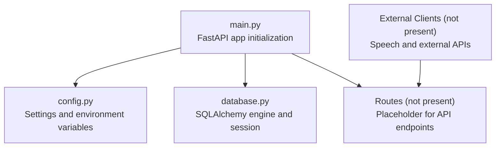
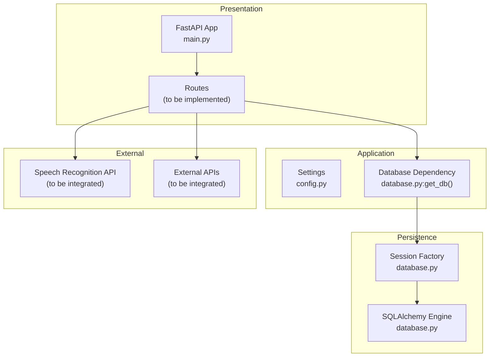

# Backend Services

<cite>
**Referenced Files in This Document**
- [main.py](file://english_pronunciation_app/backend/app/main.py)
- [config.py](file://english_pronunciation_app/backend/app/core/config.py)
- [database.py](file://english_pronunciation_app/backend/app/core/database.py)
</cite>

## Table of Contents
1. [Introduction](#introduction)
2. [Project Structure](#project-structure)
3. [Core Components](#core-components)
4. [Architecture Overview](#architecture-overview)
5. [Detailed Component Analysis](#detailed-component-analysis)
6. [Dependency Analysis](#dependency-analysis)
7. [Performance Considerations](#performance-considerations)
8. [Troubleshooting Guide](#troubleshooting-guide)
9. [Conclusion](#conclusion)
10. [Appendices](#appendices)

## Introduction
This document describes the backend service built with FastAPI for the pronunciation training platform. It covers the service architecture, API endpoint structure, request/response handling patterns, database integration via SQLAlchemy, CORS configuration, and operational endpoints. It also outlines authentication and authorization considerations, session management, error handling strategies, logging and monitoring approaches, API versioning, rate limiting, and performance optimization. Where applicable, references to concrete source files are provided to guide implementation and extension.

## Project Structure
The backend is organized around a minimal FastAPI application with modular configuration and database layers:
- Application entrypoint initializes the FastAPI app, applies CORS middleware, and exposes health and root endpoints.
- Configuration module centralizes environment-driven settings such as app metadata, environment, CORS origins, and database URL.
- Database module sets up SQLAlchemy engine and session factory, and provides a dependency for request-scoped sessions along with a database health check.

**Diagram sources**
- [main.py:1-43](file://english_pronunciation_app/backend/app/main.py#L1-L43)
- [config.py:1-34](file://english_pronunciation_app/backend/app/core/config.py#L1-L34)
- [database.py:1-51](file://english_pronunciation_app/backend/app/core/database.py#L1-L51)

**Section sources**
- [main.py:1-43](file://english_pronunciation_app/backend/app/main.py#L1-L43)
- [config.py:1-34](file://english_pronunciation_app/backend/app/core/config.py#L1-L34)
- [database.py:1-51](file://english_pronunciation_app/backend/app/core/database.py#L1-L51)

## Core Components
- FastAPI Application: Initializes the service with metadata (title, version, description), registers CORS middleware, and defines basic endpoints.
- Settings and Environment: Loads configuration from environment variables with defaults for app name, version, environment, CORS origins, and optional database URL.
- Database Layer: Creates an SQLAlchemy engine with connection pooling and pre-ping enabled, constructs a sessionmaker, and provides a dependency generator for request-scoped sessions. Includes a health check for database connectivity.

Key responsibilities:
- Expose health and root endpoints for service status.
- Provide a reusable database session per request.
- Allow flexible CORS configuration via environment variables.

**Section sources**
- [main.py:10-22](file://english_pronunciation_app/backend/app/main.py#L10-L22)
- [config.py:9-33](file://english_pronunciation_app/backend/app/core/config.py#L9-L33)
- [database.py:10-28](file://english_pronunciation_app/backend/app/core/database.py#L10-L28)

## Architecture Overview
The backend follows a layered architecture:
- Presentation: FastAPI routes (to be implemented) handle HTTP requests and responses.
- Application: Request lifecycle managed by FastAPI, with dependency injection for database sessions.
- Persistence: SQLAlchemy ORM with a configured engine and session factory.
- External Integrations: Speech recognition and external APIs (to be integrated) accessed from services.

**Diagram sources**
- [main.py:1-43](file://english_pronunciation_app/backend/app/main.py#L1-L43)
- [config.py:1-34](file://english_pronunciation_app/backend/app/core/config.py#L1-L34)
- [database.py:1-51](file://english_pronunciation_app/backend/app/core/database.py#L1-L51)

## Detailed Component Analysis

### FastAPI Application Initialization
- Creates a FastAPI instance with configurable metadata and description.
- Registers CORS middleware allowing configured origins and standard HTTP methods/headers.
- Defines two endpoints:
  - Root endpoint returning service metadata.
  - Health endpoint returning service metadata, environment, and database health status.

Operational behavior:
- On startup, reads settings and configures CORS.
- Health endpoint delegates database connectivity check to the database module.

**Section sources**
- [main.py:10-42](file://english_pronunciation_app/backend/app/main.py#L10-L42)

### Configuration Management
- Centralized settings via a dataclass with defaults for app name, version, environment, CORS origins, and optional database URL.
- Environment variable overrides:
  - APP_NAME, APP_VERSION, APP_ENV override defaults.
  - DATABASE_URL enables database integration.
  - CORS_ORIGINS accepts a comma-separated list of origins; parsed into a tuple.
- Utility to split CSV-like origin lists.

Security and flexibility:
- CORS origins are configurable at runtime.
- Database URL is optional; absence prevents database operations but allows service to run.

**Section sources**
- [config.py:9-33](file://english_pronunciation_app/backend/app/core/config.py#L9-L33)

### Database Integration (SQLAlchemy)
- Engine creation with connection pooling and pre-ping enabled when DATABASE_URL is set.
- Session factory bound to the engine for autocommit/autoflush behavior.
- Dependency generator yields a session per request and ensures closure in a finally block.
- Health check attempts a simple SQL statement to verify connectivity; returns structured status and messages.

Data flow:
- Routes depend on the database dependency to obtain a session.
- Sessions are closed after request completion to prevent leaks.

**Section sources**
- [database.py:10-28](file://english_pronunciation_app/backend/app/core/database.py#L10-L28)
- [database.py:31-50](file://english_pronunciation_app/backend/app/core/database.py#L31-L50)

### API Endpoint Structure and Request/Response Handling
Current endpoints:
- GET /
  - Purpose: Service metadata and status.
  - Response: JSON object containing service name, version, and status.
- GET /health
  - Purpose: Operational health check.
  - Response: JSON object containing service metadata, environment, and database status.

Request/Response patterns:
- Responses are JSON dictionaries.
- No request body is required for these endpoints.
- Error responses are not defined here; exceptions propagate to FastAPI’s default handlers.

Extending endpoints:
- Add route decorators under the FastAPI app instance.
- Use the database dependency to access a session.
- Define Pydantic models for request/response schemas.
- Apply validation and error handling patterns consistent with FastAPI best practices.

**Section sources**
- [main.py:25-42](file://english_pronunciation_app/backend/app/main.py#L25-L42)

### Authentication and Authorization
- Current implementation does not include authentication or authorization middleware.
- Next steps:
  - Integrate an authentication framework (e.g., OAuth2 with FastAPI Security, JWT tokens).
  - Add role-based access control (RBAC) for admin endpoints.
  - Implement session management and secure cookie policies.
  - Enforce permissions at route level using dependency injectors.

Note: Implement these enhancements alongside CORS and database configurations.

[No sources needed since this section provides general guidance]

### Session Management
- Request-scoped sessions are provided via a dependency generator.
- Sessions are opened at the start of each request and closed in a finally block.
- This pattern prevents connection leaks and ensures proper cleanup.

Recommendations:
- Avoid long-lived sessions.
- Use transactions explicitly when performing multiple writes.
- Consider adding retry logic for transient database errors.

**Section sources**
- [database.py:20-28](file://english_pronunciation_app/backend/app/core/database.py#L20-L28)

### Speech Processing Integration and External API Connections
- Not implemented in the current backend.
- Recommended approach:
  - Create a dedicated service module for external integrations.
  - Use async HTTP clients for non-blocking calls.
  - Implement retries, timeouts, and circuit breaker patterns.
  - Validate and transform external responses into internal models.
  - Log interactions for observability and debugging.

[No sources needed since this section provides general guidance]

### Data Transformation Logic
- To be implemented in service modules that consume external APIs and database models.
- Use Pydantic models for serialization/deserialization and validation.
- Normalize external data into domain-specific structures before persistence.

[No sources needed since this section provides general guidance]

### Error Handling Strategies
- Current endpoints do not define custom exception handlers.
- Recommended patterns:
  - Define global exception handlers for HTTPException and generic exceptions.
  - Return structured JSON error responses with codes and messages.
  - Log stack traces at debug/error levels.
  - Distinguish client errors (4xx) from server errors (5xx).

**Section sources**
- [main.py:25-42](file://english_pronunciation_app/backend/app/main.py#L25-L42)

### Logging Implementation and Monitoring
- Logging is not currently implemented in the backend.
- Recommended approach:
  - Configure Python logging with structured loggers.
  - Capture request ID, method, path, response status, and latency.
  - Export logs to centralized systems (e.g., ELK, Cloud Logging).
  - Add metrics for endpoint latencies and error rates.
  - Integrate OpenTelemetry for distributed tracing.

**Section sources**
- [main.py:10-22](file://english_pronunciation_app/backend/app/main.py#L10-L22)

### API Versioning
- The service sets a version field in the FastAPI metadata.
- Recommended versioning strategies:
  - URL path versioning (e.g., /api/v1/...).
  - Accept header versioning.
  - Deprecation policy with forward compatibility.
- Keep version aligned with deployment artifacts.

**Section sources**
- [main.py:10-14](file://english_pronunciation_app/backend/app/main.py#L10-L14)
- [config.py:11-12](file://english_pronunciation_app/backend/app/core/config.py#L11-L12)

### Rate Limiting
- Not implemented in the current backend.
- Recommended approaches:
  - Use middleware or route decorators to enforce limits per IP or user.
  - Store counters in Redis or in-memory stores.
  - Return appropriate HTTP status codes (e.g., 429 Too Many Requests).
  - Provide Retry-After headers.

[No sources needed since this section provides general guidance]

### Performance Optimization
- Database:
  - Connection pooling and pre-ping are enabled.
  - Use pagination for list endpoints.
  - Optimize queries with indexes and select-only projections.
- Application:
  - Minimize synchronous work in request handlers.
  - Use async patterns where external calls are involved.
  - Cache frequently accessed data with short TTLs.
- Observability:
  - Instrument endpoints with timing metrics.
  - Monitor slow endpoints and error spikes.

**Section sources**
- [database.py:15-17](file://english_pronunciation_app/backend/app/core/database.py#L15-L17)

### Examples of Common Backend Operations
- Health check: GET /health
  - Returns service metadata and database status.
- Root: GET /
  - Returns service metadata and status.
- Database session usage: Inject dependency in route handler to perform ORM operations.
- CORS configuration: Controlled via environment variables for origins and headers.

**Section sources**
- [main.py:25-42](file://english_pronunciation_app/backend/app/main.py#L25-L42)
- [database.py:20-28](file://english_pronunciation_app/backend/app/core/database.py#L20-L28)
- [config.py:24-33](file://english_pronunciation_app/backend/app/core/config.py#L24-L33)

## Dependency Analysis
The backend exhibits low coupling and high cohesion:
- main.py depends on config.py and database.py.
- database.py depends on config.py and SQLAlchemy.
- Routes (to be implemented) will depend on database dependency and potentially external services.

**Diagram sources**
- [main.py:1-43](file://english_pronunciation_app/backend/app/main.py#L1-L43)
- [config.py:1-34](file://english_pronunciation_app/backend/app/core/config.py#L1-L34)
- [database.py:1-51](file://english_pronunciation_app/backend/app/core/database.py#L1-L51)

**Section sources**
- [main.py:1-43](file://english_pronunciation_app/backend/app/main.py#L1-L43)
- [config.py:1-34](file://english_pronunciation_app/backend/app/core/config.py#L1-L34)
- [database.py:1-51](file://english_pronunciation_app/backend/app/core/database.py#L1-L51)

## Performance Considerations
- Database connection pooling and pre-ping reduce connection overhead and detect stale connections.
- Request-scoped sessions minimize contention and ensure timely cleanup.
- For future enhancements, consider:
  - Async database drivers and async route handlers.
  - Caching strategies for read-heavy endpoints.
  - Pagination and filtering for list endpoints.

[No sources needed since this section provides general guidance]

## Troubleshooting Guide
Common scenarios and resolutions:
- Database not configured:
  - Symptom: Health endpoint indicates database not configured.
  - Action: Set DATABASE_URL environment variable.
- Database connectivity errors:
  - Symptom: Health endpoint reports error status with message.
  - Action: Verify credentials, network, and server availability.
- CORS errors in browser:
  - Symptom: Preflight or fetch failures.
  - Action: Confirm CORS_ORIGINS includes the frontend origin(s).

Operational checks:
- Use GET /health to confirm service and database status.
- Use GET / to confirm service metadata.

**Section sources**
- [database.py:31-50](file://english_pronunciation_app/backend/app/core/database.py#L31-L50)
- [config.py:24-33](file://english_pronunciation_app/backend/app/core/config.py#L24-L33)
- [main.py:25-42](file://english_pronunciation_app/backend/app/main.py#L25-L42)

## Conclusion
The backend establishes a solid foundation with FastAPI, environment-driven configuration, and SQLAlchemy integration. It exposes essential health and root endpoints and provides a clean dependency for database sessions. Future development should focus on implementing API routes, integrating speech and external services, adding authentication/authorization, and establishing logging, monitoring, and rate limiting. These additions will enable scalable, secure, and observable operations for pronunciation training features.

[No sources needed since this section summarizes without analyzing specific files]

## Appendices
- Environment variables:
  - APP_NAME: Service name.
  - APP_VERSION: Semantic version.
  - APP_ENV: Environment identifier.
  - DATABASE_URL: Optional PostgreSQL connection string.
  - CORS_ORIGINS: Comma-separated list of allowed origins.

**Section sources**
- [config.py:23-33](file://english_pronunciation_app/backend/app/core/config.py#L23-L33)