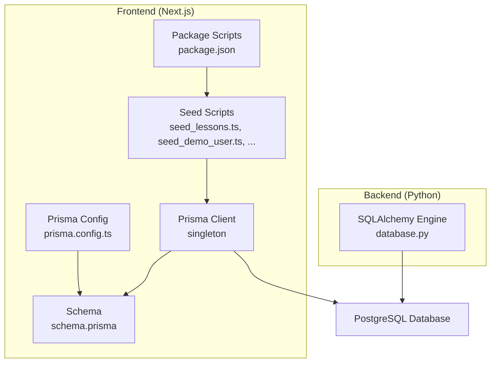
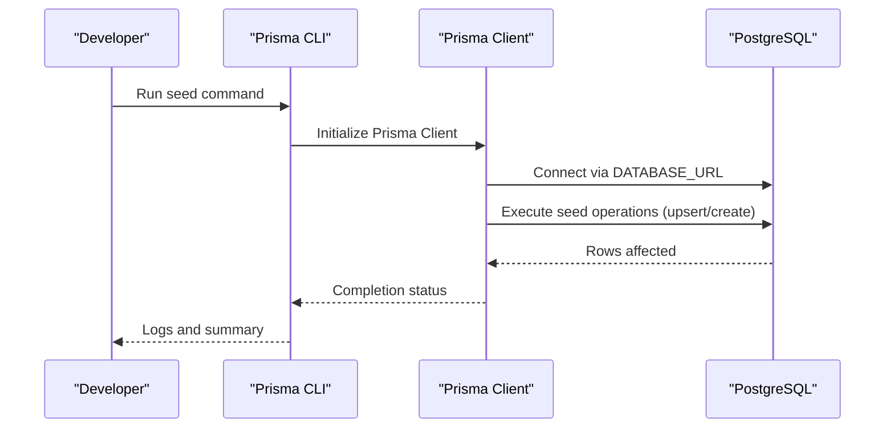
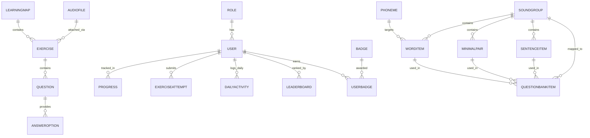
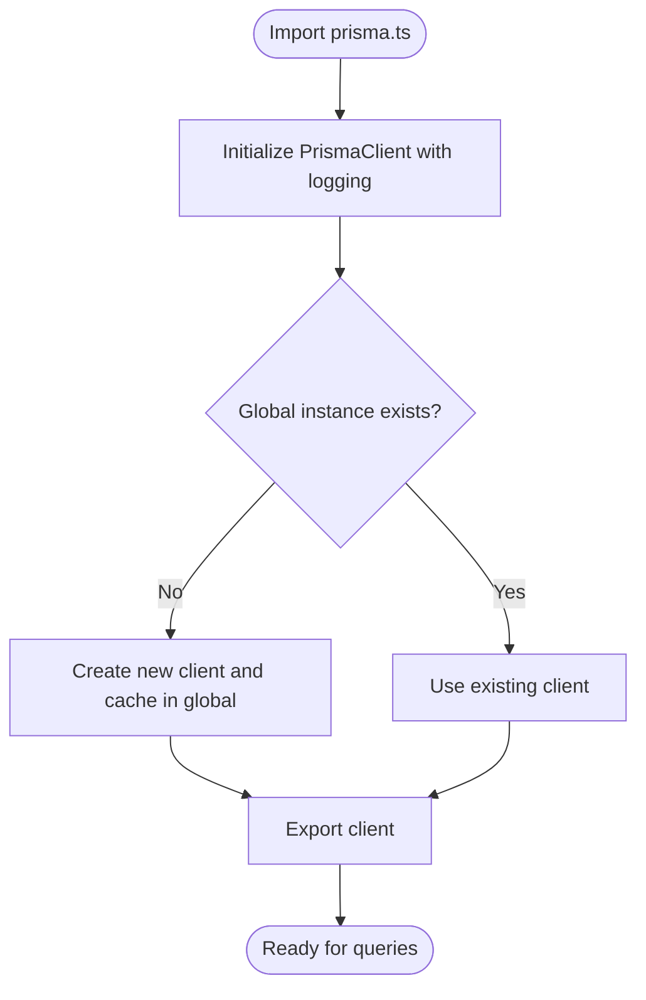
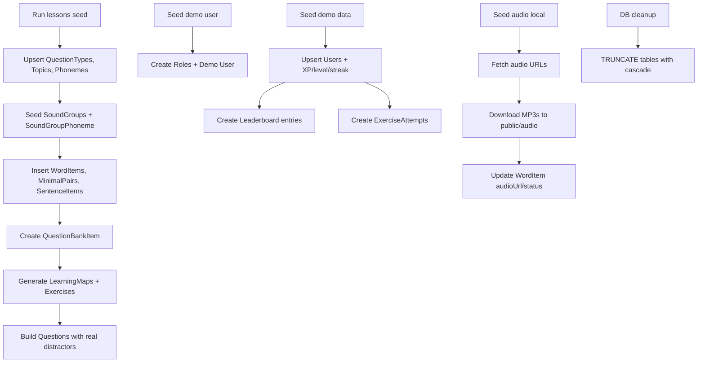
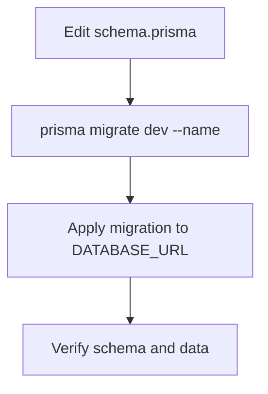
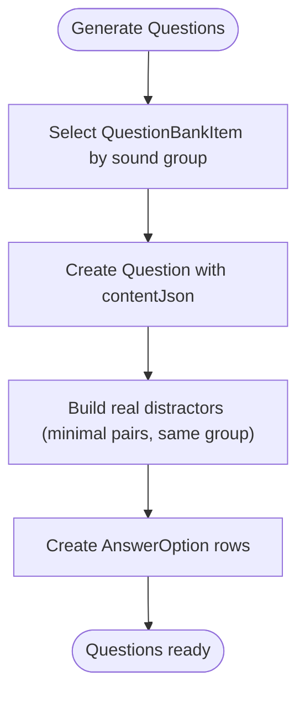
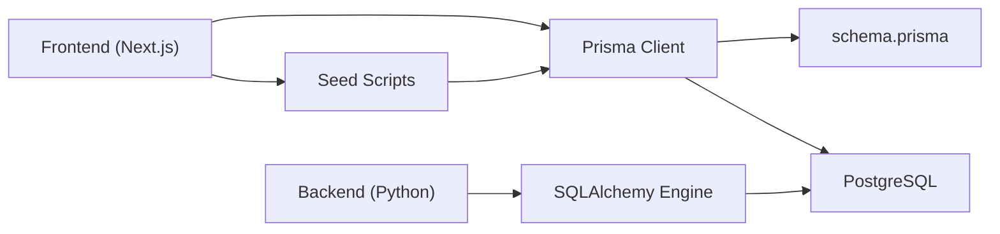

# Database Integration and ORM

<cite>
**Referenced Files in This Document**
- [schema.prisma](file://english_pronunciation_app/frontend/prisma/schema.prisma)
- [prisma.ts](file://english_pronunciation_app/frontend/src/lib/prisma.ts)
- [prisma.config.ts](file://english_pronunciation_app/frontend/prisma.config.ts)
- [package.json](file://english_pronunciation_app/frontend/package.json)
- [db_cleanup.ts](file://english_pronunciation_app/frontend/prisma/db_cleanup.ts)
- [seed_lessons.ts](file://english_pronunciation_app/frontend/prisma/seed_lessons.ts)
- [seed_listen_choose.ts](file://english_pronunciation_app/frontend/prisma/seed_listen_choose.ts)
- [seed_audio_local.ts](file://english_pronunciation_app/frontend/prisma/seed_audio_local.ts)
- [seed_demo_user.ts](file://english_pronunciation_app/frontend/prisma/seed_demo_user.ts)
- [seed_demo_data.ts](file://english_pronunciation_app/frontend/prisma/seed_demo_data.ts)
- [seed_subcategory.ts](file://english_pronunciation_app/frontend/prisma/seed_subcategory.ts)
- [database.py](file://english_pronunciation_app/backend/app/core/database.py)
</cite>

## Table of Contents
1. [Introduction](#introduction)
2. [Project Structure](#project-structure)
3. [Core Components](#core-components)
4. [Architecture Overview](#architecture-overview)
5. [Detailed Component Analysis](#detailed-component-analysis)
6. [Dependency Analysis](#dependency-analysis)
7. [Performance Considerations](#performance-considerations)
8. [Troubleshooting Guide](#troubleshooting-guide)
9. [Conclusion](#conclusion)
10. [Appendices](#appendices)

## Introduction
This document explains the database integration and Prisma ORM implementation for the English pronunciation learning platform. It covers the database schema design, entity relationships, and data models for lessons, exercises, users, and gamification elements. It also documents Prisma client configuration, database connection management, query patterns, data seeding strategies, migration procedures, schema evolution, CRUD operations, complex queries, data transformation logic, performance optimization, indexing strategies, connection pooling, validation rules, business logic, and transaction management.

## Project Structure
The database layer is primarily implemented in the frontend Next.js application using Prisma. The backend module includes a Python SQLAlchemy-based service for database health checks and connection utilities. The frontend’s Prisma configuration and schema define the PostgreSQL data model and client generation.

**Diagram sources**
- [prisma.ts:1-13](file://english_pronunciation_app/frontend/src/lib/prisma.ts#L1-L13)
- [prisma.config.ts:1-20](file://english_pronunciation_app/frontend/prisma.config.ts#L1-L20)
- [schema.prisma:1-8](file://english_pronunciation_app/frontend/prisma/schema.prisma#L1-L8)
- [seed_lessons.ts:1-24](file://english_pronunciation_app/frontend/prisma/seed_lessons.ts#L1-L24)
- [package.json:6-12](file://english_pronunciation_app/frontend/package.json#L6-L12)
- [database.py:1-51](file://english_pronunciation_app/backend/app/core/database.py#L1-L51)

**Section sources**
- [prisma.ts:1-13](file://english_pronunciation_app/frontend/src/lib/prisma.ts#L1-L13)
- [prisma.config.ts:1-20](file://english_pronunciation_app/frontend/prisma.config.ts#L1-L20)
- [schema.prisma:1-8](file://english_pronunciation_app/frontend/prisma/schema.prisma#L1-L8)
- [package.json:6-12](file://english_pronunciation_app/frontend/package.json#L6-L12)
- [database.py:1-51](file://english_pronunciation_app/backend/app/core/database.py#L1-L51)

## Core Components
- Prisma Client singleton for efficient, shared database access in development and production.
- Prisma configuration pointing to the schema and migrations directory with DATABASE_URL.
- PostgreSQL schema modeling users, roles, gamification metrics, learning maps, exercises, questions, phonemes, sound groups, word items, minimal pairs, sentences, and related audit trails.
- Seed scripts for lessons, demo users, demo data, audio local assets, and maintenance tasks.
- Backend SQLAlchemy utilities for database connectivity checks.

Key responsibilities:
- Define and evolve the data model via Prisma schema.
- Provide strongly typed queries and relations.
- Manage seeding, migrations, and schema updates.
- Support gamification and learning progression tracking.

**Section sources**
- [prisma.ts:1-13](file://english_pronunciation_app/frontend/src/lib/prisma.ts#L1-L13)
- [prisma.config.ts:12-20](file://english_pronunciation_app/frontend/prisma.config.ts#L12-L20)
- [schema.prisma:14-59](file://english_pronunciation_app/frontend/prisma/schema.prisma#L14-L59)
- [seed_lessons.ts:116-192](file://english_pronunciation_app/frontend/prisma/seed_lessons.ts#L116-L192)
- [seed_demo_user.ts:27-77](file://english_pronunciation_app/frontend/prisma/seed_demo_user.ts#L27-L77)
- [seed_demo_data.ts:41-152](file://english_pronunciation_app/frontend/prisma/seed_demo_data.ts#L41-L152)
- [seed_audio_local.ts:64-139](file://english_pronunciation_app/frontend/prisma/seed_audio_local.ts#L64-L139)
- [database.py:15-50](file://english_pronunciation_app/backend/app/core/database.py#L15-L50)

## Architecture Overview
The frontend uses Prisma Client to connect to PostgreSQL. Seed scripts populate the database with lessons, users, and gamification data. The backend provides a lightweight SQLAlchemy-based health check and connection utility.

**Diagram sources**
- [prisma.ts:6-10](file://english_pronunciation_app/frontend/src/lib/prisma.ts#L6-L10)
- [prisma.config.ts:12-20](file://english_pronunciation_app/frontend/prisma.config.ts#L12-L20)
- [seed_lessons.ts:48-50](file://english_pronunciation_app/frontend/prisma/seed_lessons.ts#L48-L50)
- [seed_demo_user.ts:20-21](file://english_pronunciation_app/frontend/prisma/seed_demo_user.ts#L20-L21)
- [seed_demo_data.ts:15-15](file://english_pronunciation_app/frontend/prisma/seed_demo_data.ts#L15-L15)

**Section sources**
- [prisma.ts:6-10](file://english_pronunciation_app/frontend/src/lib/prisma.ts#L6-L10)
- [prisma.config.ts:12-20](file://english_pronunciation_app/frontend/prisma.config.ts#L12-L20)
- [seed_lessons.ts:48-50](file://english_pronunciation_app/frontend/prisma/seed_lessons.ts#L48-L50)
- [seed_demo_user.ts:20-21](file://english_pronunciation_app/frontend/prisma/seed_demo_user.ts#L20-L21)
- [seed_demo_data.ts:15-15](file://english_pronunciation_app/frontend/prisma/seed_demo_data.ts#L15-L15)

## Detailed Component Analysis

### Database Schema Design and Entity Relationships
The schema defines core entities and their relationships:
- Users belong to Roles; Users track XP, level, streaks, and gamification items.
- Learning maps connect to exercises; Progress tracks user positions per map.
- Exercises link to Topics, Levels, and LearningMaps; Questions belong to Exercises.
- Question types categorize question formats; AnswerOptions provide MC choices.
- Phonemes, SoundGroups, WordItems, MinimalPairs, and SentenceItems form the content layer.
- ExerciseAttempt and QuestionAttempt capture user interactions and results.
- DailyActivity, Leaderboard, and UserBadge support gamification and reporting.
- PasswordResetToken links resets to Users.

**Diagram sources**
- [schema.prisma:14-501](file://english_pronunciation_app/frontend/prisma/schema.prisma#L14-L501)

**Section sources**
- [schema.prisma:14-501](file://english_pronunciation_app/frontend/prisma/schema.prisma#L14-L501)

### Prisma Client Configuration and Connection Management
- Prisma Client is initialized as a singleton to avoid multiple instances during development.
- Logging includes query, error, and warning events for observability.
- Prisma config enforces DATABASE_URL presence and binds schema and migrations paths.
- Frontend package.json defines a seed script that invokes the lessons seed.

**Diagram sources**
- [prisma.ts:3-12](file://english_pronunciation_app/frontend/src/lib/prisma.ts#L3-L12)
- [prisma.config.ts:6-10](file://english_pronunciation_app/frontend/prisma.config.ts#L6-L10)
- [package.json:12-12](file://english_pronunciation_app/frontend/package.json#L12-L12)

**Section sources**
- [prisma.ts:3-12](file://english_pronunciation_app/frontend/src/lib/prisma.ts#L3-L12)
- [prisma.config.ts:6-10](file://english_pronunciation_app/frontend/prisma.config.ts#L6-L10)
- [package.json:12-12](file://english_pronunciation_app/frontend/package.json#L12-L12)

### Data Seeding Strategies
- Lessons seed pipeline builds question types, topics, phonemes, sound groups, content items, question bank, learning maps, exercises, and questions with realistic distractors.
- Demo user and demo data scripts prepare roles, users, leaderboard entries, attempts, and daily activities for admin and learner dashboards.
- Local audio seeding downloads MP3s from external APIs and updates WordItem records to enable offline playback.
- Maintenance scripts clean the database and update subcategories without altering content.

**Diagram sources**
- [seed_lessons.ts:116-192](file://english_pronunciation_app/frontend/prisma/seed_lessons.ts#L116-L192)
- [seed_demo_user.ts:30-44](file://english_pronunciation_app/frontend/prisma/seed_demo_user.ts#L30-L44)
- [seed_demo_data.ts:44-102](file://english_pronunciation_app/frontend/prisma/seed_demo_data.ts#L44-L102)
- [seed_audio_local.ts:68-96](file://english_pronunciation_app/frontend/prisma/seed_audio_local.ts#L68-L96)
- [db_cleanup.ts:52-91](file://english_pronunciation_app/frontend/prisma/db_cleanup.ts#L52-L91)

**Section sources**
- [seed_lessons.ts:116-192](file://english_pronunciation_app/frontend/prisma/seed_lessons.ts#L116-L192)
- [seed_demo_user.ts:30-44](file://english_pronunciation_app/frontend/prisma/seed_demo_user.ts#L30-L44)
- [seed_demo_data.ts:44-102](file://english_pronunciation_app/frontend/prisma/seed_demo_data.ts#L44-L102)
- [seed_audio_local.ts:68-96](file://english_pronunciation_app/frontend/prisma/seed_audio_local.ts#L68-L96)
- [db_cleanup.ts:52-91](file://english_pronunciation_app/frontend/prisma/db_cleanup.ts#L52-L91)

### Migration Procedures and Schema Evolution
- Prisma migrations are stored under the configured migrations path.
- The schema file defines the current model; migrations evolve the database structure while preserving data where possible.
- Use Prisma CLI commands to introspect, generate, and apply migrations against the configured DATABASE_URL.

**Diagram sources**
- [prisma.config.ts:14-16](file://english_pronunciation_app/frontend/prisma.config.ts#L14-L16)
- [schema.prisma:1-8](file://english_pronunciation_app/frontend/prisma/schema.prisma#L1-L8)

**Section sources**
- [prisma.config.ts:14-16](file://english_pronunciation_app/frontend/prisma.config.ts#L14-L16)
- [schema.prisma:1-8](file://english_pronunciation_app/frontend/prisma/schema.prisma#L1-L8)

### CRUD Operations and Query Patterns
Common patterns observed in seed scripts:
- Upsert operations using unique identifiers (e.g., Role by name, User by email, WordItem by composite keys).
- Relation-aware inserts with foreign keys and relation fields.
- Aggregation counts and selections for derived metrics (e.g., leaderboard entries).
- Idempotent re-seeding with selective updates to preserve existing data.

Representative patterns:
- Upsert Role/User and update fields selectively.
- Find ACTIVE exercises and attach attempts.
- Update WordItem audioUrl and status after local asset ingestion.

**Section sources**
- [seed_demo_user.ts:30-64](file://english_pronunciation_app/frontend/prisma/seed_demo_user.ts#L30-L64)
- [seed_demo_data.ts:74-102](file://english_pronunciation_app/frontend/prisma/seed_demo_data.ts#L74-L102)
- [seed_demo_data.ts:123-133](file://english_pronunciation_app/frontend/prisma/seed_demo_data.ts#L123-L133)
- [seed_audio_local.ts:88-96](file://english_pronunciation_app/frontend/prisma/seed_audio_local.ts#L88-L96)
- [seed_audio_local.ts:126-129](file://english_pronunciation_app/frontend/prisma/seed_audio_local.ts#L126-L129)

### Complex Queries and Data Transformation Logic
- Question generation selects from QuestionBankItem and constructs Question and AnswerOption sets with real distractors drawn from the same sound group or minimal pairs.
- Listen-choose mode rebuilds questions without re-fetching audio, copying audioUrl from existing WordItem records.
- Subcategory updates propagate to SoundGroup and LearningMap without altering content.

**Diagram sources**
- [seed_lessons.ts:795-800](file://english_pronunciation_app/frontend/prisma/seed_lessons.ts#L795-L800)
- [seed_lessons.ts:765-793](file://english_pronunciation_app/frontend/prisma/seed_lessons.ts#L765-L793)
- [seed_listen_choose.ts:77-120](file://english_pronunciation_app/frontend/prisma/seed_listen_choose.ts#L77-L120)

**Section sources**
- [seed_lessons.ts:795-800](file://english_pronunciation_app/frontend/prisma/seed_lessons.ts#L795-L800)
- [seed_lessons.ts:765-793](file://english_pronunciation_app/frontend/prisma/seed_lessons.ts#L765-L793)
- [seed_listen_choose.ts:77-120](file://english_pronunciation_app/frontend/prisma/seed_listen_choose.ts#L77-L120)

### Transaction Management
- Business logic requiring multi-table updates should use Prisma transactions to ensure atomicity.
- The architecture skill checklist emphasizes using transactions for multi-table updates.

Recommended approach:
- Wrap related writes (e.g., creating attempts and updating user XP/streak) in a single transaction block.

**Section sources**
- [prisma.ts:6-10](file://english_pronunciation_app/frontend/src/lib/prisma.ts#L6-L10)
- [SKILL.md:234-234](file://english_pronunciation_app/.agents/skills/architect-mode/SKILL.md#L234-L234)

### Data Validation Rules and Business Logic
- Unique constraints enforced at schema level (e.g., User.email, Role.name, composite unique keys).
- Status enums guide content readiness (e.g., ACTIVE vs NEEDS_REVIEW).
- Derived metrics (e.g., leaderboard scores) are computed from user performance and XP.
- Gamification fields (XP, level, streaks, gems) are validated and updated consistently.

**Section sources**
- [schema.prisma:26-28](file://english_pronunciation_app/frontend/prisma/schema.prisma#L26-L28)
- [schema.prisma:32-38](file://english_pronunciation_app/frontend/prisma/schema.prisma#L32-L38)
- [seed_demo_data.ts:107-113](file://english_pronunciation_app/frontend/prisma/seed_demo_data.ts#L107-L113)
- [seed_audio_local.ts:104-108](file://english_pronunciation_app/frontend/prisma/seed_audio_local.ts#L104-L108)

## Dependency Analysis
- Frontend Prisma Client depends on the schema and DATABASE_URL.
- Seed scripts depend on Prisma Client and external APIs for audio.
- Backend SQLAlchemy module provides database connectivity utilities.

**Diagram sources**
- [prisma.ts:1-13](file://english_pronunciation_app/frontend/src/lib/prisma.ts#L1-L13)
- [schema.prisma:1-8](file://english_pronunciation_app/frontend/prisma/schema.prisma#L1-L8)
- [seed_lessons.ts:26-27](file://english_pronunciation_app/frontend/prisma/seed_lessons.ts#L26-L27)
- [database.py:3-17](file://english_pronunciation_app/backend/app/core/database.py#L3-L17)

**Section sources**
- [prisma.ts:1-13](file://english_pronunciation_app/frontend/src/lib/prisma.ts#L1-L13)
- [schema.prisma:1-8](file://english_pronunciation_app/frontend/prisma/schema.prisma#L1-L8)
- [seed_lessons.ts:26-27](file://english_pronunciation_app/frontend/prisma/seed_lessons.ts#L26-L27)
- [database.py:3-17](file://english_pronunciation_app/backend/app/core/database.py#L3-L17)

## Performance Considerations
- Indexes: The schema includes targeted indexes on frequently queried columns (e.g., Leaderboard(type, period, score), DailyActivity(date), WordItem(status, difficulty), etc.). These improve leaderboard ranking, daily aggregations, and filtering.
- Query logging: Enable Prisma query logs during development to identify slow queries and optimize.
- Connection pooling: Use a managed PostgreSQL service with appropriate pool settings; avoid creating new Prisma clients per request in serverless environments.
- Idempotent seeds: Upserts reduce redundant writes and improve resilience during re-seeds.
- Batch operations: Group related writes (e.g., creating multiple AnswerOptions) to minimize round-trips.

[No sources needed since this section provides general guidance]

## Troubleshooting Guide
- DATABASE_URL missing: Prisma config requires DATABASE_URL; ensure it is set in the environment.
- Connection failures: Use the backend SQLAlchemy health check to verify connectivity.
- Seed failures: Review seed logs for warnings about missing audio or content; re-run audio seeding if needed.
- Cleanup and re-seed: Use the cleanup script to reset the database, then re-run lessons seed.

**Section sources**
- [prisma.config.ts:6-10](file://english_pronunciation_app/frontend/prisma.config.ts#L6-L10)
- [database.py:31-50](file://english_pronunciation_app/backend/app/core/database.py#L31-L50)
- [seed_audio_local.ts:104-108](file://english_pronunciation_app/frontend/prisma/seed_audio_local.ts#L104-L108)
- [db_cleanup.ts:52-91](file://english_pronunciation_app/frontend/prisma/db_cleanup.ts#L52-L91)

## Conclusion
The database integration leverages Prisma ORM to model a rich, gamified learning system with robust seeding, migrations, and performance-conscious indexing. The frontend singleton client and backend connectivity utilities provide a solid foundation for scalable data operations. Adhering to transactional updates, idempotent seeds, and targeted indexes ensures reliability and maintainability.

[No sources needed since this section summarizes without analyzing specific files]

## Appendices

### Appendix A: Key Entities and Attributes
- Role: id, name
- User: id, username, email, passwordHash, status, gender, dob, avatarUrl, phone, XP/level/streak/gems fields, roleId
- ExerciseAttempt: id, userId, exerciseId, status, attemptCount, score, createdAt
- QuestionAttempt: id, exerciseAttemptId, questionId, transcript, selectedOptionId, isCorrect, score, accuracyScore, fluencyScore, feedback, audioUrl, timeSpent, createdAt
- Exercise: id, name, questionCount, timeLimit, status, description, topicId, levelId, mapId
- Question: id, name, content, status, score, answer, acceptedAnswers, typeId, exerciseId
- AnswerOption: id, content, questionId
- Phoneme: id, symbol, name, category, description, mouthHint, commonMistake, status
- SoundGroup: id, name, description, orderIndex, status, subcategory, topicId, levelId
- WordItem: id, word, ipa, audioUrl, audioSource, sourceType, sourceUrl, meaningVi, syllables, stressIndex, wordStressType, difficulty, status, reviewNote, createdBy, reviewedAt, createdAt, updatedAt, phonemeId
- MinimalPair: id, note, difficulty, status, soundGroupId, wordAId, wordBId
- SentenceItem: id, text, targetWords, difficulty, status, sourceType, sourceUrl, reviewNote, createdAt, updatedAt
- QuestionBankItem: id, prompt, contentJson, answer, acceptedAnswers, score, difficulty, status, sourceType, sourceUrl, reviewNote, createdAt, updatedAt, questionTypeId, soundGroupId, minimalPairId, wordItemId, sentenceItemId
- LearningMap: id, name, requirement, status, subcategory
- Progress: id, userId, mapId, position, result
- Leaderboard: id, userId, score, correctAnswers, completedExercises, type, period, updatedAt
- DailyActivity: id, userId, date, xpEarned, completedExercises, checkIns, createdAt, updatedAt
- UserBadge: id, userId, badgeId, earnedAt, validPeriod
- Badge: id, name, description, image, condition, type
- PasswordResetToken: id, tokenHash, expiresAt, usedAt, createdAt, userId

**Section sources**
- [schema.prisma:14-501](file://english_pronunciation_app/frontend/prisma/schema.prisma#L14-L501)