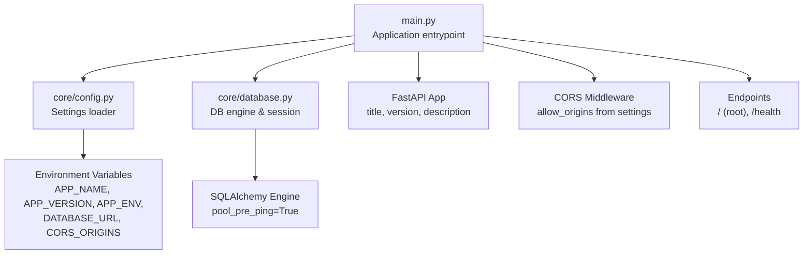
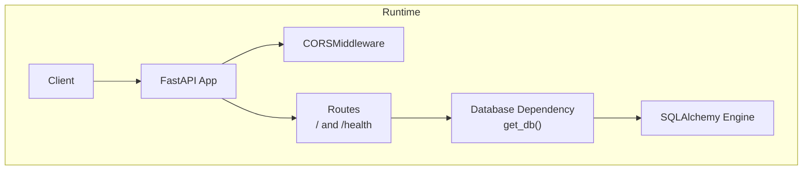
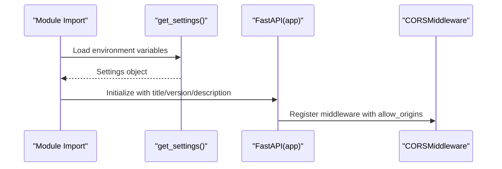
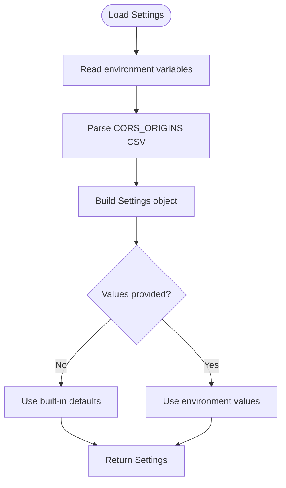
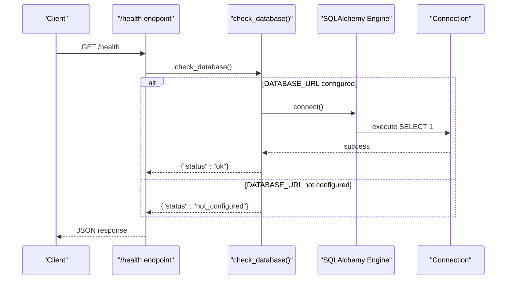
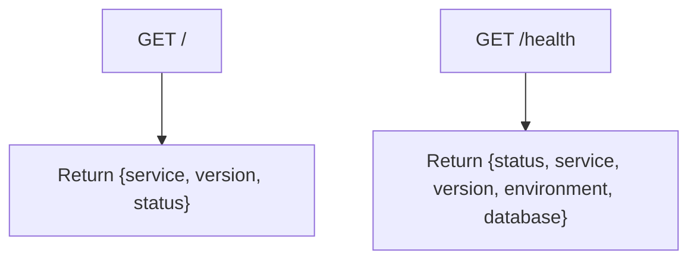
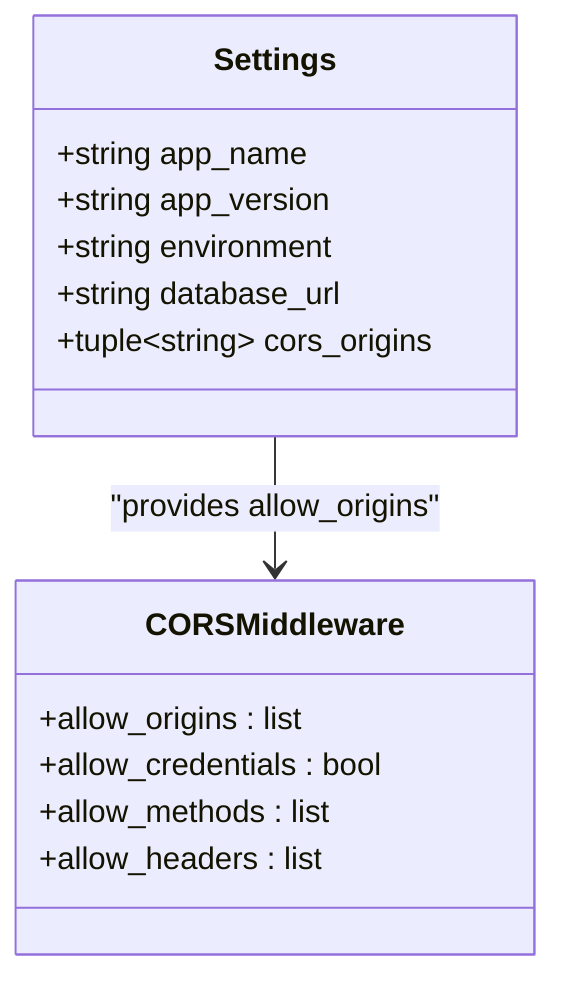
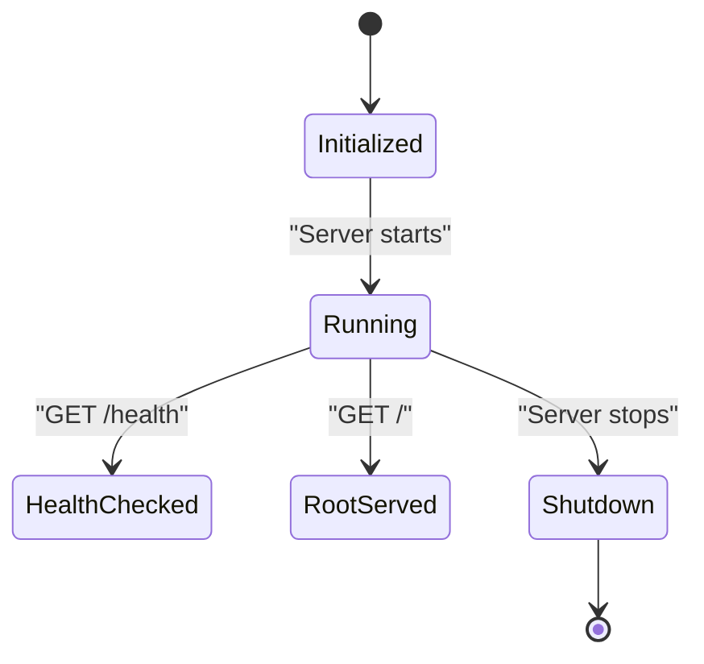
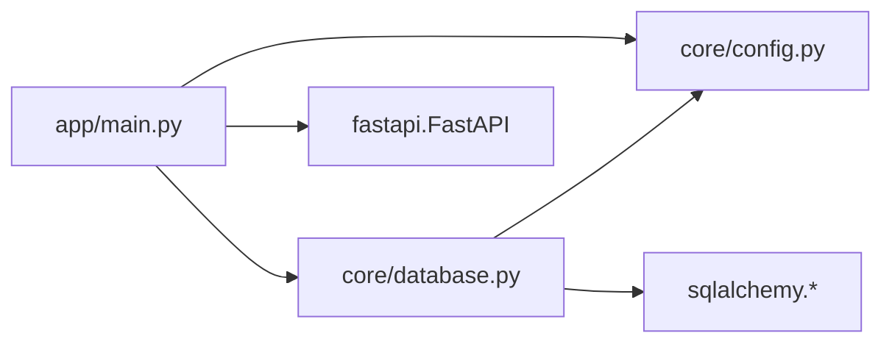

# FastAPI Application Architecture

<cite>
**Referenced Files in This Document**
- [main.py](file://english_pronunciation_app/backend/app/main.py)
- [config.py](file://english_pronunciation_app/backend/app/core/config.py)
- [database.py](file://english_pronunciation_app/backend/app/core/database.py)
- [README.md](file://english_pronunciation_app/backend/README.md)
</cite>

## Table of Contents
1. [Introduction](#introduction)
2. [Project Structure](#project-structure)
3. [Core Components](#core-components)
4. [Architecture Overview](#architecture-overview)
5. [Detailed Component Analysis](#detailed-component-analysis)
6. [Dependency Analysis](#dependency-analysis)
7. [Performance Considerations](#performance-considerations)
8. [Troubleshooting Guide](#troubleshooting-guide)
9. [Conclusion](#conclusion)

## Introduction
This document describes the FastAPI application architecture for the pronunciation learning platform. It covers application initialization, middleware configuration (including CORS), settings management via environment variables, database connection handling, health check endpoints, service metadata configuration, and lifecycle management. It also explains the application factory pattern, dependency injection patterns, and service registration processes, along with practical examples of configuration loading and environment-specific settings.

## Project Structure
The backend follows a clean modular structure:
- Application entrypoint initializes the FastAPI app, registers middleware, and defines health endpoints.
- Core configuration module loads environment variables into a typed settings object.
- Core database module sets up SQLAlchemy engine/session and exposes a dependency for request-scoped sessions.
- The backend README provides local run instructions and environment variable guidance.

**Diagram sources**
- [main.py:10-22](file://english_pronunciation_app/backend/app/main.py#L10-L22)
- [config.py:23-33](file://english_pronunciation_app/backend/app/core/config.py#L23-L33)
- [database.py:15-17](file://english_pronunciation_app/backend/app/core/database.py#L15-L17)

**Section sources**
- [main.py:1-43](file://english_pronunciation_app/backend/app/main.py#L1-L43)
- [config.py:1-34](file://english_pronunciation_app/backend/app/core/config.py#L1-L34)
- [database.py:1-51](file://english_pronunciation_app/backend/app/core/database.py#L1-L51)
- [README.md:1-52](file://english_pronunciation_app/backend/README.md#L1-L52)

## Core Components
- Application Factory Pattern: The FastAPI app instance is created in the main module and configured centrally.
- Settings Management: A typed Settings dataclass is populated from environment variables, enabling environment-specific configuration.
- Middleware Configuration: CORS middleware is registered with origins derived from settings.
- Database Layer: Optional database support via SQLAlchemy with a dependency provider for request-scoped sessions.
- Health Endpoint: Provides service metadata and database connectivity status.

**Section sources**
- [main.py:10-22](file://english_pronunciation_app/backend/app/main.py#L10-L22)
- [config.py:23-33](file://english_pronunciation_app/backend/app/core/config.py#L23-L33)
- [database.py:20-28](file://english_pronunciation_app/backend/app/core/database.py#L20-L28)
- [database.py:31-50](file://english_pronunciation_app/backend/app/core/database.py#L31-L50)

## Architecture Overview
The runtime architecture centers on the FastAPI application instance, which:
- Loads settings at import time.
- Registers CORS middleware based on settings.
- Defines two primary endpoints: root metadata and health.
- Uses a database dependency provider for optional database connectivity checks.

**Diagram sources**
- [main.py:10-22](file://english_pronunciation_app/backend/app/main.py#L10-L22)
- [main.py:25-42](file://english_pronunciation_app/backend/app/main.py#L25-L42)
- [database.py:20-28](file://english_pronunciation_app/backend/app/core/database.py#L20-L28)
- [database.py:15-17](file://english_pronunciation_app/backend/app/core/database.py#L15-L17)

## Detailed Component Analysis

### Application Initialization and Factory Pattern
- The application instance is created with metadata fields sourced from settings.
- Settings are loaded once at import time and reused across the app.
- The app registers CORS middleware with origins from settings.

**Diagram sources**
- [main.py:8-22](file://english_pronunciation_app/backend/app/main.py#L8-L22)
- [config.py:23-33](file://english_pronunciation_app/backend/app/core/config.py#L23-L33)

**Section sources**
- [main.py:8-14](file://english_pronunciation_app/backend/app/main.py#L8-L14)
- [main.py:16-22](file://english_pronunciation_app/backend/app/main.py#L16-L22)
- [config.py:23-33](file://english_pronunciation_app/backend/app/core/config.py#L23-L33)

### Settings Management and Environment Variables
- Settings include application name, version, environment, database URL, and CORS origins.
- Environment variables override defaults:
  - APP_NAME, APP_VERSION, APP_ENV
  - DATABASE_URL
  - CORS_ORIGINS (comma-separated)
- Origins are parsed into a tuple; defaults are provided when unspecified.

**Diagram sources**
- [config.py:23-33](file://english_pronunciation_app/backend/app/core/config.py#L23-L33)
- [config.py:5-6](file://english_pronunciation_app/backend/app/core/config.py#L5-L6)

**Section sources**
- [config.py:9-33](file://english_pronunciation_app/backend/app/core/config.py#L9-L33)

### Database Connection Handling and Dependency Injection
- If DATABASE_URL is set, an SQLAlchemy engine is created with pool_pre_ping enabled.
- A request-scoped dependency yields a database session per request and ensures closure.
- A health check endpoint queries the database to verify connectivity.

**Diagram sources**
- [main.py:34-42](file://english_pronunciation_app/backend/app/main.py#L34-L42)
- [database.py:31-50](file://english_pronunciation_app/backend/app/core/database.py#L31-L50)
- [database.py:15-17](file://english_pronunciation_app/backend/app/core/database.py#L15-L17)

**Section sources**
- [database.py:15-28](file://english_pronunciation_app/backend/app/core/database.py#L15-L28)
- [database.py:31-50](file://english_pronunciation_app/backend/app/core/database.py#L31-L50)

### Health Check Endpoints and Metadata
- Root endpoint returns service metadata (name, version, status).
- Health endpoint returns environment, service metadata, and database status.

**Diagram sources**
- [main.py:25-31](file://english_pronunciation_app/backend/app/main.py#L25-L31)
- [main.py:34-42](file://english_pronunciation_app/backend/app/main.py#L34-L42)

**Section sources**
- [main.py:25-31](file://english_pronunciation_app/backend/app/main.py#L25-L31)
- [main.py:34-42](file://english_pronunciation_app/backend/app/main.py#L34-L42)

### CORS Middleware Configuration
- Origins are configurable via environment variable and injected into the middleware.
- Credentials, methods, and headers are broadly permitted for development.

**Diagram sources**
- [config.py:10-20](file://english_pronunciation_app/backend/app/core/config.py#L10-L20)
- [main.py:16-22](file://english_pronunciation_app/backend/app/main.py#L16-L22)

**Section sources**
- [main.py:16-22](file://english_pronunciation_app/backend/app/main.py#L16-L22)
- [config.py:15-20](file://english_pronunciation_app/backend/app/core/config.py#L15-L20)

### Application Lifecycle Management
- Startup: Settings are loaded, the app is initialized, middleware is registered, and routes are defined.
- Shutdown: No explicit shutdown handlers are defined; database connections are closed per request.

**Diagram sources**
- [main.py:10-14](file://english_pronunciation_app/backend/app/main.py#L10-L14)
- [main.py:25-42](file://english_pronunciation_app/backend/app/main.py#L25-L42)

**Section sources**
- [main.py:10-14](file://english_pronunciation_app/backend/app/main.py#L10-L14)
- [main.py:25-42](file://english_pronunciation_app/backend/app/main.py#L25-L42)

## Dependency Analysis
- main.py depends on:
  - core/config.py for settings
  - core/database.py for database health checks
- core/database.py depends on:
  - core/config.py for settings
  - SQLAlchemy for engine/session creation
- The app depends on FastAPI for routing and middleware.

**Diagram sources**
- [main.py:4-5](file://english_pronunciation_app/backend/app/main.py#L4-L5)
- [database.py:7](file://english_pronunciation_app/backend/app/core/database.py#L7)

**Section sources**
- [main.py:4-5](file://english_pronunciation_app/backend/app/main.py#L4-L5)
- [database.py:7](file://english_pronunciation_app/backend/app/core/database.py#L7)

## Performance Considerations
- Connection pooling: The engine uses pool_pre_ping to validate connections before use, reducing stale connection errors.
- Request-scoped sessions: Sessions are opened and closed per request, minimizing long-lived connections.
- CORS breadth: Development allows all methods and headers; tighten for production environments.

## Troubleshooting Guide
- Health endpoint returns database status:
  - If DATABASE_URL is unset, database status indicates not configured.
  - On connection failure, the health endpoint surfaces an error status with the exception message.
- CORS issues:
  - Ensure CORS_ORIGINS contains the frontend origin(s) separated by commas.
  - Verify the environment variable is correctly loaded and parsed.

**Section sources**
- [database.py:31-50](file://english_pronunciation_app/backend/app/core/database.py#L31-L50)
- [config.py:24-25](file://english_pronunciation_app/backend/app/core/config.py#L24-L25)
- [README.md:34-46](file://english_pronunciation_app/backend/README.md#L34-L46)

## Conclusion
The FastAPI backend implements a minimal yet robust architecture:
- Centralized settings management via environment variables.
- Clear separation of concerns with a dedicated database layer and dependency provider.
- Practical health checks and metadata endpoints.
- Extensible foundation for adding pronunciation scoring, analytics, or ASR integrations in the future.