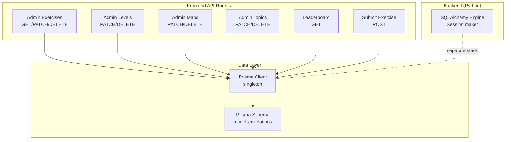
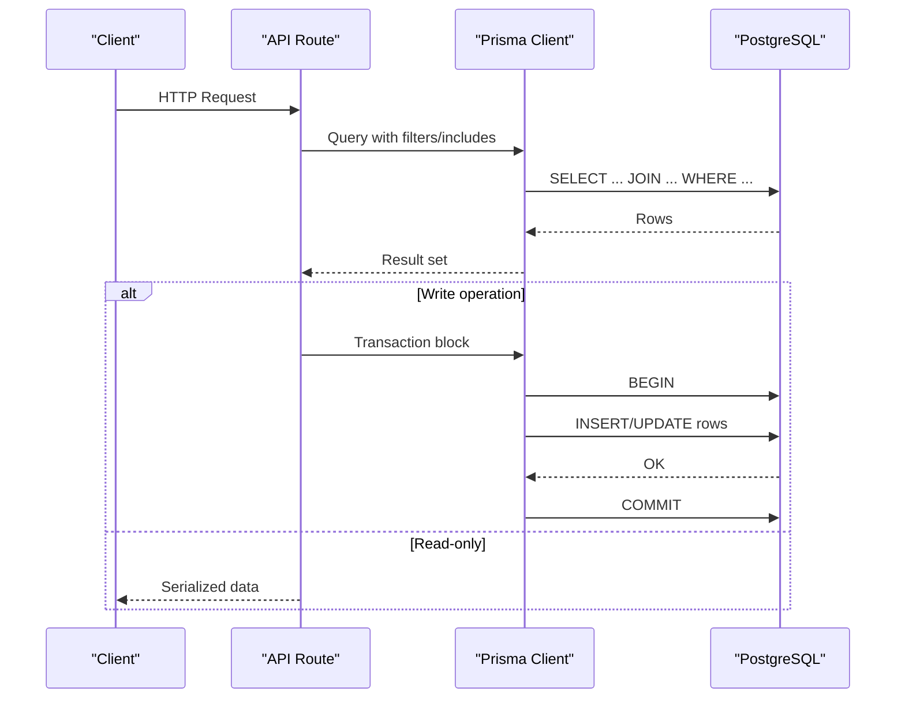
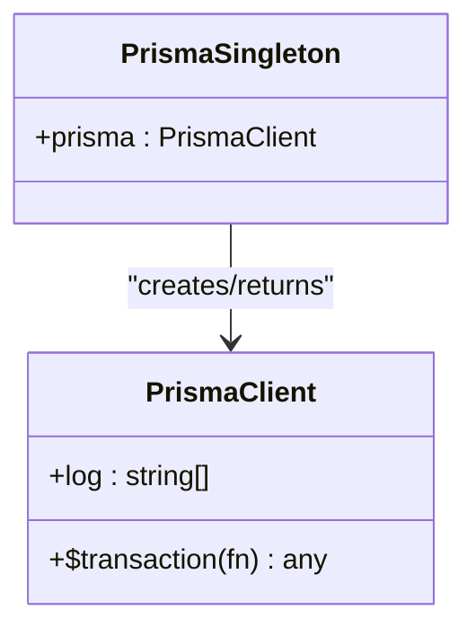
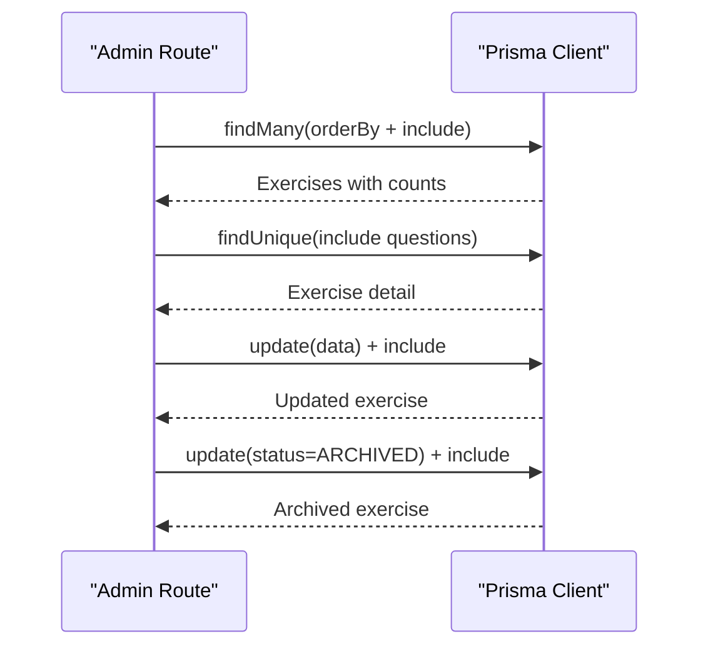
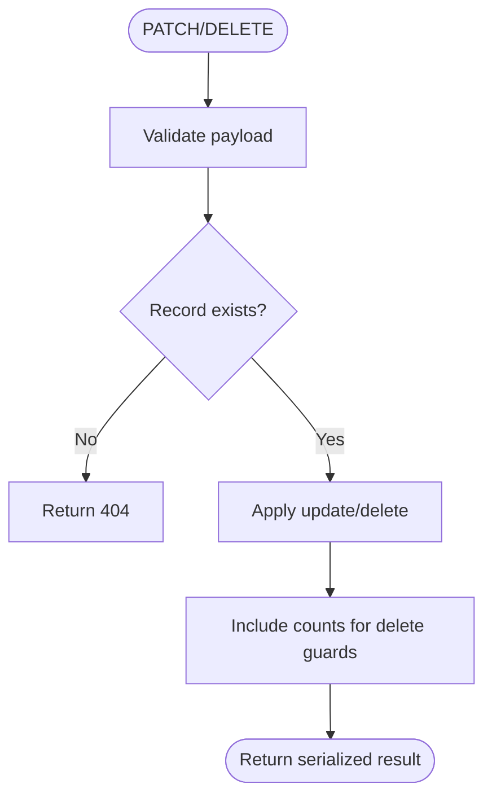
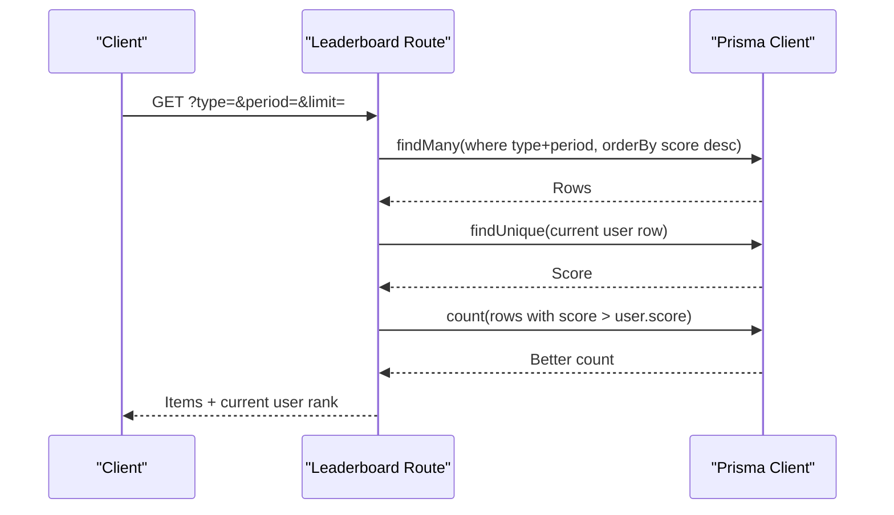
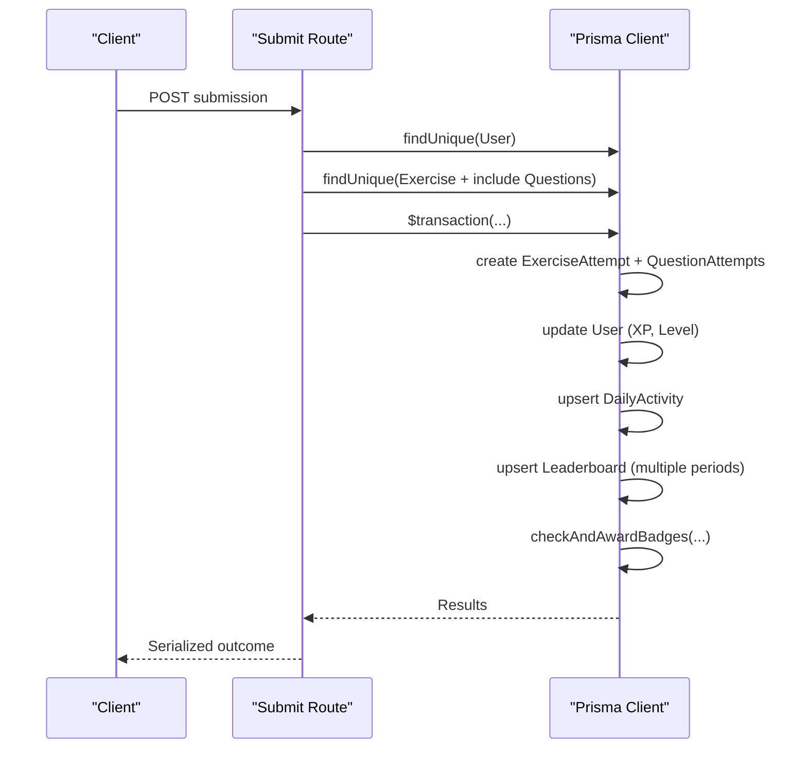
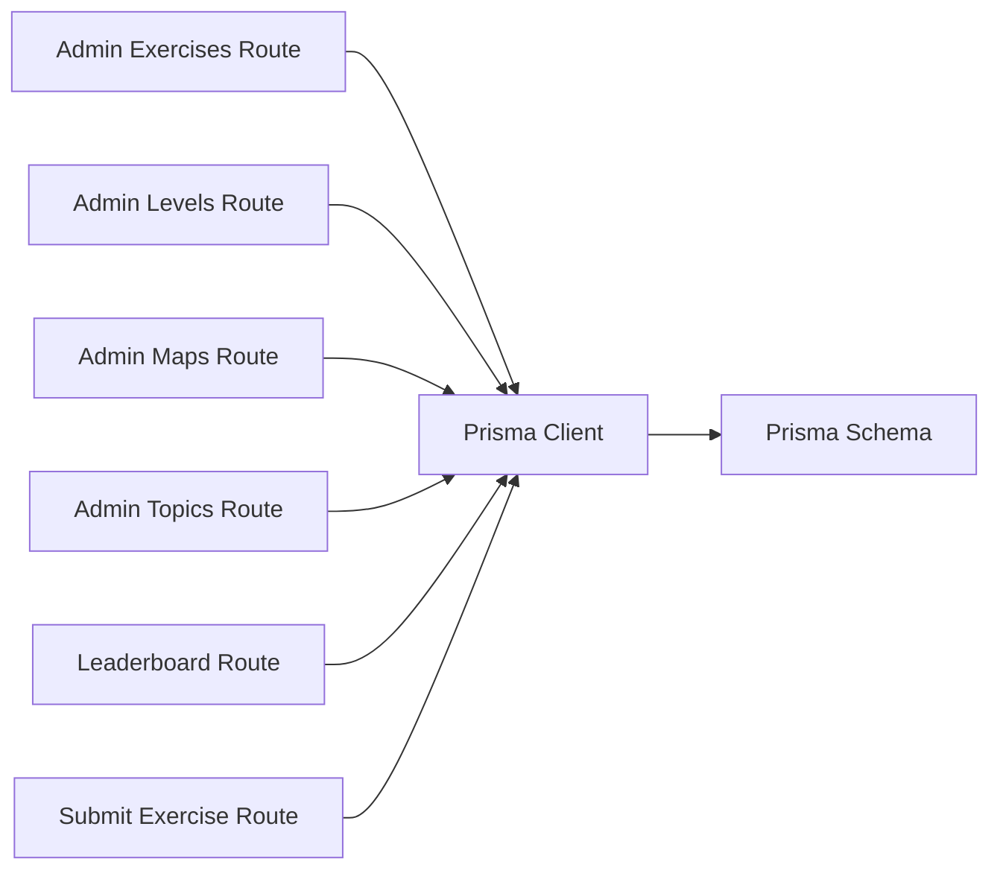

# Data Access Patterns and Queries

<cite>
**Referenced Files in This Document**
- [schema.prisma](file://english_pronunciation_app/frontend/prisma/schema.prisma)
- [prisma.ts](file://english_pronunciation_app/frontend/src/lib/prisma.ts)
- [database.py](file://english_pronunciation_app/backend/app/core/database.py)
- [admin-api.ts](file://english_pronunciation_app/frontend/src/lib/admin-api.ts)
- [admin.exercises.route.ts](file://english_pronunciation_app/frontend/src/app/api/admin/exercises/[id]/route.ts)
- [admin.exercises.list.route.ts](file://english_pronunciation_app/frontend/src/app/api/admin/exercises/route.ts)
- [admin.levels.route.ts](file://english_pronunciation_app/frontend/src/app/api/admin/levels/[id]/route.ts)
- [admin.maps.route.ts](file://english_pronunciation_app/frontend/src/app/api/admin/maps/[id]/route.ts)
- [admin.topics.route.ts](file://english_pronunciation_app/frontend/src/app/api/admin/topics/[id]/route.ts)
- [leaderboard.route.ts](file://english_pronunciation_app/frontend/src/app/api/leaderboard/route.ts)
- [exercises.submit.route.ts](file://english_pronunciation_app/frontend/src/app/api/exercises/submit/route.ts)
</cite>

## Table of Contents
1. [Introduction](#introduction)
2. [Project Structure](#project-structure)
3. [Core Components](#core-components)
4. [Architecture Overview](#architecture-overview)
5. [Detailed Component Analysis](#detailed-component-analysis)
6. [Dependency Analysis](#dependency-analysis)
7. [Performance Considerations](#performance-considerations)
8. [Troubleshooting Guide](#troubleshooting-guide)
9. [Conclusion](#conclusion)
10. [Appendices](#appendices)

## Introduction
This document explains the Prisma ORM data access patterns and query strategies used in the backend API routes. It covers CRUD operations, complex queries with joins, aggregations, pagination, filtering by status and difficulty, relationship loading, transaction handling, and efficient data fetching. It also documents leaderboard calculations, progress tracking, and gamification metrics derived from database queries.

## Project Structure
The data access layer centers around:
- Prisma schema defining models and relations
- A singleton Prisma client instance
- API routes implementing CRUD and complex queries
- Admin utilities for validation and constrained updates
- Backend Python module for database connectivity (alternative SQLAlchemy stack)

**Diagram sources**
- [prisma.ts:1-13](file://english_pronunciation_app/frontend/src/lib/prisma.ts#L1-L13)
- [schema.prisma:1-501](file://english_pronunciation_app/frontend/prisma/schema.prisma#L1-L501)
- [database.py:1-51](file://english_pronunciation_app/backend/app/core/database.py#L1-L51)

**Section sources**
- [prisma.ts:1-13](file://english_pronunciation_app/frontend/src/lib/prisma.ts#L1-L13)
- [schema.prisma:1-501](file://english_pronunciation_app/frontend/prisma/schema.prisma#L1-L501)
- [database.py:1-51](file://english_pronunciation_app/backend/app/core/database.py#L1-L51)

## Core Components
- Prisma Client: Singleton instance with logging enabled for diagnostics.
- Prisma Schema: Defines entities (User, Exercise, Question, Progress, Leaderboard, DailyQuest, etc.) and their relations.
- Admin Utilities: Validation helpers and admin session checks for safe updates.
- API Routes: Implement CRUD and complex queries with includes/joins, ordering, and pagination.

Key data models and relations relevant to data access patterns:
- User ↔ Role (many-to-one)
- User → Progress, ExerciseAttempt, DailyActivity, Leaderboard, DailyQuest, UserBadge
- Exercise → Topic, Level, LearningMap, Question, ExerciseAttempt
- Question → QuestionType, AnswerOption, QuestionAttempt
- DailyQuest → User
- Leaderboard → User
- Progress → User, LearningMap

**Section sources**
- [prisma.ts:1-13](file://english_pronunciation_app/frontend/src/lib/prisma.ts#L1-L13)
- [schema.prisma:14-73](file://english_pronunciation_app/frontend/prisma/schema.prisma#L14-L73)
- [schema.prisma:79-138](file://english_pronunciation_app/frontend/prisma/schema.prisma#L79-L138)
- [schema.prisma:157-195](file://english_pronunciation_app/frontend/prisma/schema.prisma#L157-L195)
- [schema.prisma:210-235](file://english_pronunciation_app/frontend/prisma/schema.prisma#L210-L235)
- [schema.prisma:420-453](file://english_pronunciation_app/frontend/prisma/schema.prisma#L420-L453)
- [schema.prisma:106-123](file://english_pronunciation_app/frontend/prisma/schema.prisma#L106-L123)
- [schema.prisma:90-103](file://english_pronunciation_app/frontend/prisma/schema.prisma#L90-L103)

## Architecture Overview
The frontend API routes orchestrate data access via Prisma. They:
- Validate requests and enforce admin/session policies
- Build queries with includes/joins and filters
- Paginate results and sort deterministically
- Use transactions for atomic writes during submissions
- Aggregate metrics for gamification and leaderboards

**Diagram sources**
- [exercises.submit.route.ts:182-274](file://english_pronunciation_app/frontend/src/app/api/exercises/submit/route.ts#L182-L274)
- [leaderboard.route.ts:54-89](file://english_pronunciation_app/frontend/src/app/api/leaderboard/route.ts#L54-L89)
- [admin.exercises.route.ts:67-84](file://english_pronunciation_app/frontend/src/app/api/admin/exercises/[id]/route.ts#L67-L84)

## Detailed Component Analysis

### Prisma Client and Connection Management
- Singleton pattern prevents multiple clients in development.
- Logging enabled for queries, errors, and warnings.
- Environment variable DATABASE_URL supplies the PostgreSQL connection string.

**Diagram sources**
- [prisma.ts:1-13](file://english_pronunciation_app/frontend/src/lib/prisma.ts#L1-L13)

**Section sources**
- [prisma.ts:1-13](file://english_pronunciation_app/frontend/src/lib/prisma.ts#L1-L13)
- [schema.prisma:5-8](file://english_pronunciation_app/frontend/prisma/schema.prisma#L5-L8)

### Admin CRUD: Exercises
- Listing exercises with counts and nested relations.
- Retrieving exercise details with questions and counts.
- Patching exercise metadata with reference checks.
- Archiving exercises by updating status.

**Diagram sources**
- [admin.exercises.list.route.ts:42-62](file://english_pronunciation_app/frontend/src/app/api/admin/exercises/route.ts#L42-L62)
- [admin.exercises.route.ts:67-84](file://english_pronunciation_app/frontend/src/app/api/admin/exercises/[id]/route.ts#L67-L84)
- [admin.exercises.route.ts:104-173](file://english_pronunciation_app/frontend/src/app/api/admin/exercises/[id]/route.ts#L104-L173)
- [admin.exercises.route.ts:175-212](file://english_pronunciation_app/frontend/src/app/api/admin/exercises/[id]/route.ts#L175-L212)

**Section sources**
- [admin.exercises.list.route.ts:42-62](file://english_pronunciation_app/frontend/src/app/api/admin/exercises/route.ts#L42-L62)
- [admin.exercises.route.ts:67-84](file://english_pronunciation_app/frontend/src/app/api/admin/exercises/[id]/route.ts#L67-L84)
- [admin.exercises.route.ts:104-173](file://english_pronunciation_app/frontend/src/app/api/admin/exercises/[id]/route.ts#L104-L173)
- [admin.exercises.route.ts:175-212](file://english_pronunciation_app/frontend/src/app/api/admin/exercises/[id]/route.ts#L175-L212)

### Admin CRUD: Levels, Maps, Topics
- Patch operations update name/description with validation.
- Delete operations guard against in-use resources and return counts.

**Diagram sources**
- [admin.levels.route.ts:27-71](file://english_pronunciation_app/frontend/src/app/api/admin/levels/[id]/route.ts#L27-L71)
- [admin.maps.route.ts:29-75](file://english_pronunciation_app/frontend/src/app/api/admin/maps/[id]/route.ts#L29-L75)
- [admin.topics.route.ts:27-71](file://english_pronunciation_app/frontend/src/app/api/admin/topics/[id]/route.ts#L27-L71)

**Section sources**
- [admin.levels.route.ts:27-106](file://english_pronunciation_app/frontend/src/app/api/admin/levels/[id]/route.ts#L27-L106)
- [admin.maps.route.ts:29-109](file://english_pronunciation_app/frontend/src/app/api/admin/maps/[id]/route.ts#L29-L109)
- [admin.topics.route.ts:27-106](file://english_pronunciation_app/frontend/src/app/api/admin/topics/[id]/route.ts#L27-L106)

### Leaderboard Retrieval and Ranking
- Filters by type ("week" or "month") and period.
- Orders by score descending, then updatedAt ascending for tie-breaking.
- Includes user badges with limits and sorts by recency.
- Computes current user rank by counting superior scores.

**Diagram sources**
- [leaderboard.route.ts:41-153](file://english_pronunciation_app/frontend/src/app/api/leaderboard/route.ts#L41-L153)

**Section sources**
- [leaderboard.route.ts:41-153](file://english_pronunciation_app/frontend/src/app/api/leaderboard/route.ts#L41-L153)

### Exercise Submission and Transactions
- Validates session and exercise/question presence.
- Scores answers and computes exercise completion and rating.
- Uses Prisma transaction to atomically:
  - Create ExerciseAttempt and QuestionAttempts
  - Update User XP and Level
  - Upsert DailyActivity
  - Upsert Leaderboard entries per target period
  - Award badges

**Diagram sources**
- [exercises.submit.route.ts:47-332](file://english_pronunciation_app/frontend/src/app/api/exercises/submit/route.ts#L47-L332)

**Section sources**
- [exercises.submit.route.ts:47-332](file://english_pronunciation_app/frontend/src/app/api/exercises/submit/route.ts#L47-L332)

### Pagination Strategies
- Limit enforced on leaderboard queries.
- Deterministic ordering via composite sort keys to avoid non-deterministic results.
- Count queries used to compute current user rank.

**Section sources**
- [leaderboard.route.ts:28-39](file://english_pronunciation_app/frontend/src/app/api/leaderboard/route.ts#L28-L39)
- [leaderboard.route.ts:61](file://english_pronunciation_app/frontend/src/app/api/leaderboard/route.ts#L61)
- [leaderboard.route.ts:125-133](file://english_pronunciation_app/frontend/src/app/api/leaderboard/route.ts#L125-L133)

### Filtering by Status and Difficulty
- Active status filters on exercises and questions.
- Indexes on status and difficulty support efficient filtering.
- Status enums for robust filtering across entities.

**Section sources**
- [exercises.submit.route.ts:69-85](file://english_pronunciation_app/frontend/src/app/api/exercises/submit/route.ts#L69-L85)
- [schema.prisma:214](file://english_pronunciation_app/frontend/prisma/schema.prisma#L214)
- [schema.prisma:329](file://english_pronunciation_app/frontend/prisma/schema.prisma#L329)
- [schema.prisma:354](file://english_pronunciation_app/frontend/prisma/schema.prisma#L354)
- [schema.prisma:377](file://english_pronunciation_app/frontend/prisma/schema.prisma#L377)
- [schema.prisma:416](file://english_pronunciation_app/frontend/prisma/schema.prisma#L416)

### Relationship Loading Techniques
- Includes for nested relations (e.g., topic, level, map, questions, options).
- Select projections to minimize payload size.
- Count aggregations via _count for metadata.

**Section sources**
- [admin.exercises.list.route.ts:47-55](file://english_pronunciation_app/frontend/src/app/api/admin/exercises/route.ts#L47-L55)
- [admin.exercises.route.ts:70-83](file://english_pronunciation_app/frontend/src/app/api/admin/exercises/[id]/route.ts#L70-L83)
- [leaderboard.route.ts:63-87](file://english_pronunciation_app/frontend/src/app/api/leaderboard/route.ts#L63-L87)

### Aggregation Patterns
- Count of questions/attempts via _count.
- Score aggregation for leaderboard entries.
- Computed rank via count of superior scores.

**Section sources**
- [admin.exercises.list.route.ts:53](file://english_pronunciation_app/frontend/src/app/api/admin/exercises/route.ts#L53)
- [leaderboard.route.ts:125-133](file://english_pronunciation_app/frontend/src/app/api/leaderboard/route.ts#L125-L133)

### N+1 Query Prevention
- Use includes/select to fetch relations in single queries.
- Avoid iterating records without preloading relations.
- Prefer count queries for lightweight metadata.

**Section sources**
- [admin.exercises.route.ts:70-83](file://english_pronunciation_app/frontend/src/app/api/admin/exercises/[id]/route.ts#L70-L83)
- [leaderboard.route.ts:63-87](file://english_pronunciation_app/frontend/src/app/api/leaderboard/route.ts#L63-L87)

### Efficient Data Fetching Patterns
- Composite sort keys for pagination stability.
- Select only required fields to reduce bandwidth.
- Parallelize independent reads (Promise.all).

**Section sources**
- [leaderboard.route.ts:61](file://english_pronunciation_app/frontend/src/app/api/leaderboard/route.ts#L61)
- [leaderboard.route.ts:54-89](file://english_pronunciation_app/frontend/src/app/api/leaderboard/route.ts#L54-L89)

### Transaction Handling and Batch Operations
- Single atomic transaction for submission writes.
- Upserts for daily and leaderboard metrics.
- Batch creation of QuestionAttempts.

**Section sources**
- [exercises.submit.route.ts:182-274](file://english_pronunciation_app/frontend/src/app/api/exercises/submit/route.ts#L182-L274)

### Complex Queries: Exercise Catalog Retrieval
- Join Exercise with Topic, Level, LearningMap.
- Include Questions and Options.
- Order by map/topic/name for consistent presentation.

**Section sources**
- [admin.exercises.list.route.ts:47-55](file://english_pronunciation_app/frontend/src/app/api/admin/exercises/route.ts#L47-L55)
- [admin.exercises.route.ts:70-83](file://english_pronunciation_app/frontend/src/app/api/admin/exercises/[id]/route.ts#L70-L83)

### Progress Tracking
- User progress per LearningMap via Progress entity.
- DailyActivity tracks XP and completed exercises per day.

**Section sources**
- [schema.prisma:125-138](file://english_pronunciation_app/frontend/prisma/schema.prisma#L125-L138)
- [schema.prisma:459-472](file://english_pronunciation_app/frontend/prisma/schema.prisma#L459-L472)

### Leaderboard Calculations
- Filter by type and period.
- Sort by score desc, updatedAt asc.
- Compute rank by counting superior scores.

**Section sources**
- [leaderboard.route.ts:56-89](file://english_pronunciation_app/frontend/src/app/api/leaderboard/route.ts#L56-L89)
- [leaderboard.route.ts:125-139](file://english_pronunciation_app/frontend/src/app/api/leaderboard/route.ts#L125-L139)

### Gamification Metrics
- Exercise attempts and best scores.
- XP and level updates.
- Daily bonus and retake bonuses.
- Leaderboard delta adjustments.

**Section sources**
- [exercises.submit.route.ts:172-177](file://english_pronunciation_app/frontend/src/app/api/exercises/submit/route.ts#L172-L177)
- [exercises.submit.route.ts:207-220](file://english_pronunciation_app/frontend/src/app/api/exercises/submit/route.ts#L207-L220)
- [exercises.submit.route.ts:241-264](file://english_pronunciation_app/frontend/src/app/api/exercises/submit/route.ts#L241-L264)

### Error Handling and Validation Patterns
- Centralized admin utilities for validation and admin checks.
- Structured API responses with codes/messages.
- Session-based admin enforcement.

**Section sources**
- [admin-api.ts:26-48](file://english_pronunciation_app/frontend/src/lib/admin-api.ts#L26-L48)
- [admin-api.ts:110-118](file://english_pronunciation_app/frontend/src/lib/admin-api.ts#L110-L118)
- [admin.exercises.route.ts:110-138](file://english_pronunciation_app/frontend/src/app/api/admin/exercises/[id]/route.ts#L110-L138)

### Database Connection Management
- Frontend uses Prisma client with environment-driven DATABASE_URL.
- Backend uses SQLAlchemy engine with connection pooling and pre-ping.

**Section sources**
- [schema.prisma:5-8](file://english_pronunciation_app/frontend/prisma/schema.prisma#L5-L8)
- [prisma.ts:1-13](file://english_pronunciation_app/frontend/src/lib/prisma.ts#L1-L13)
- [database.py:15-28](file://english_pronunciation_app/backend/app/core/database.py#L15-L28)

## Dependency Analysis

**Diagram sources**
- [admin.exercises.route.ts:1-212](file://english_pronunciation_app/frontend/src/app/api/admin/exercises/[id]/route.ts#L1-L212)
- [admin.exercises.list.route.ts:1-124](file://english_pronunciation_app/frontend/src/app/api/admin/exercises/route.ts#L1-L124)
- [admin.levels.route.ts:1-106](file://english_pronunciation_app/frontend/src/app/api/admin/levels/[id]/route.ts#L1-L106)
- [admin.maps.route.ts:1-109](file://english_pronunciation_app/frontend/src/app/api/admin/maps/[id]/route.ts#L1-L109)
- [admin.topics.route.ts:1-106](file://english_pronunciation_app/frontend/src/app/api/admin/topics/[id]/route.ts#L1-L106)
- [leaderboard.route.ts:1-153](file://english_pronunciation_app/frontend/src/app/api/leaderboard/route.ts#L1-L153)
- [exercises.submit.route.ts:1-332](file://english_pronunciation_app/frontend/src/app/api/exercises/submit/route.ts#L1-L332)
- [prisma.ts:1-13](file://english_pronunciation_app/frontend/src/lib/prisma.ts#L1-L13)
- [schema.prisma:1-501](file://english_pronunciation_app/frontend/prisma/schema.prisma#L1-L501)

**Section sources**
- [admin.exercises.route.ts:1-212](file://english_pronunciation_app/frontend/src/app/api/admin/exercises/[id]/route.ts#L1-L212)
- [admin.exercises.list.route.ts:1-124](file://english_pronunciation_app/frontend/src/app/api/admin/exercises/route.ts#L1-L124)
- [admin.levels.route.ts:1-106](file://english_pronunciation_app/frontend/src/app/api/admin/levels/[id]/route.ts#L1-L106)
- [admin.maps.route.ts:1-109](file://english_pronunciation_app/frontend/src/app/api/admin/maps/[id]/route.ts#L1-L109)
- [admin.topics.route.ts:1-106](file://english_pronunciation_app/frontend/src/app/api/admin/topics/[id]/route.ts#L1-L106)
- [leaderboard.route.ts:1-153](file://english_pronunciation_app/frontend/src/app/api/leaderboard/route.ts#L1-L153)
- [exercises.submit.route.ts:1-332](file://english_pronunciation_app/frontend/src/app/api/exercises/submit/route.ts#L1-L332)
- [prisma.ts:1-13](file://english_pronunciation_app/frontend/src/lib/prisma.ts#L1-L13)
- [schema.prisma:1-501](file://english_pronunciation_app/frontend/prisma/schema.prisma#L1-L501)

## Performance Considerations
- Use includes/select judiciously to avoid N+1 queries.
- Add indexes on frequently filtered/sorted columns (e.g., status, difficulty, type+period+score).
- Prefer deterministic sort keys for pagination stability.
- Minimize payload sizes by selecting only required fields.
- Use count queries for lightweight metadata and rank computations.

## Troubleshooting Guide
- Connection issues: Verify DATABASE_URL and environment configuration.
- Transaction failures: Inspect transaction boundaries and error logs.
- Validation errors: Confirm payload shapes and enum values align with admin utilities.
- Leaderboard anomalies: Ensure type and period parsing match expected formats.

**Section sources**
- [database.py:31-50](file://english_pronunciation_app/backend/app/core/database.py#L31-L50)
- [admin-api.ts:110-118](file://english_pronunciation_app/frontend/src/lib/admin-api.ts#L110-L118)
- [leaderboard.route.ts:20-26](file://english_pronunciation_app/frontend/src/app/api/leaderboard/route.ts#L20-L26)

## Conclusion
The application employs Prisma for robust, type-safe data access with careful attention to query efficiency, transaction safety, and admin-controlled updates. By leveraging includes, deterministic ordering, and targeted aggregations, it supports complex workflows such as leaderboard computation, progress tracking, and gamification metrics while preventing common pitfalls like N+1 queries.

## Appendices
- Backend database connectivity uses SQLAlchemy; frontend uses Prisma. Both are documented for completeness.

**Section sources**
- [database.py:1-51](file://english_pronunciation_app/backend/app/core/database.py#L1-L51)
- [prisma.ts:1-13](file://english_pronunciation_app/frontend/src/lib/prisma.ts#L1-L13)