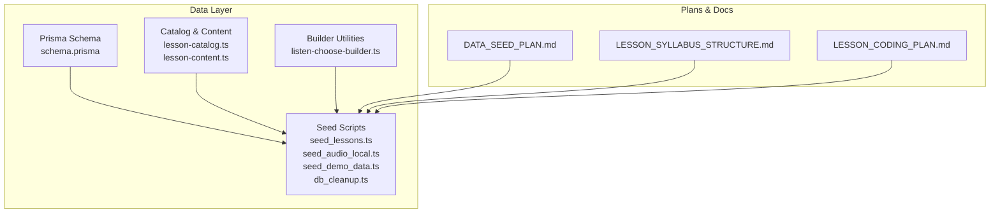
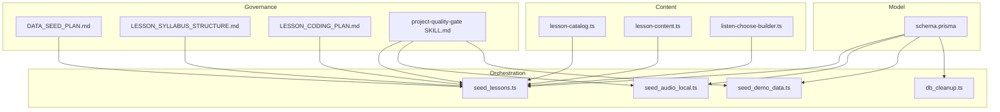
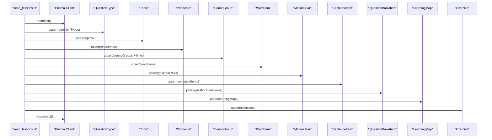
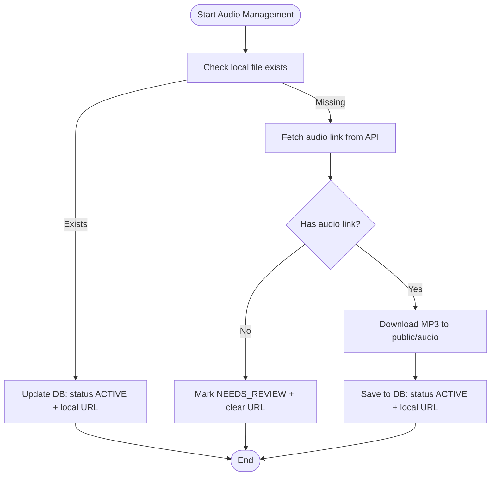
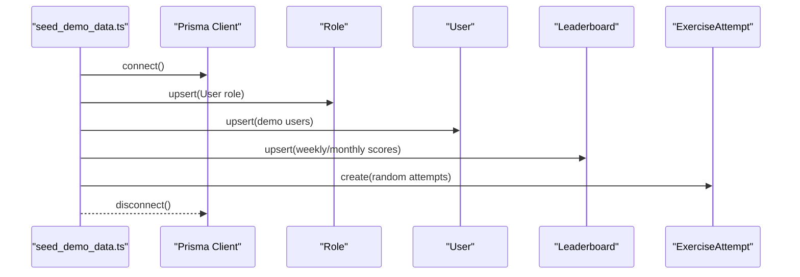
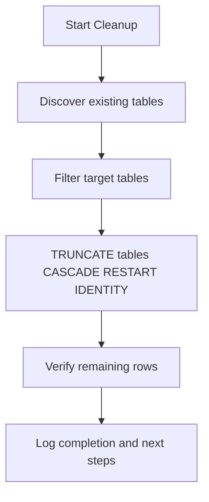
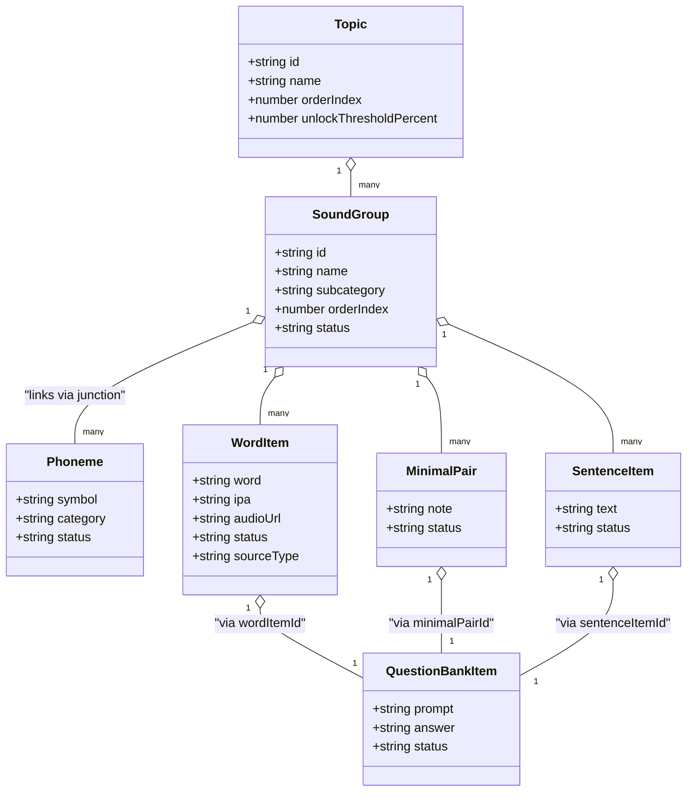
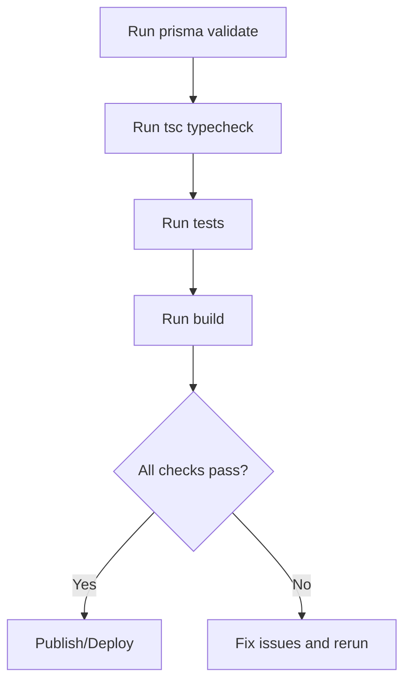
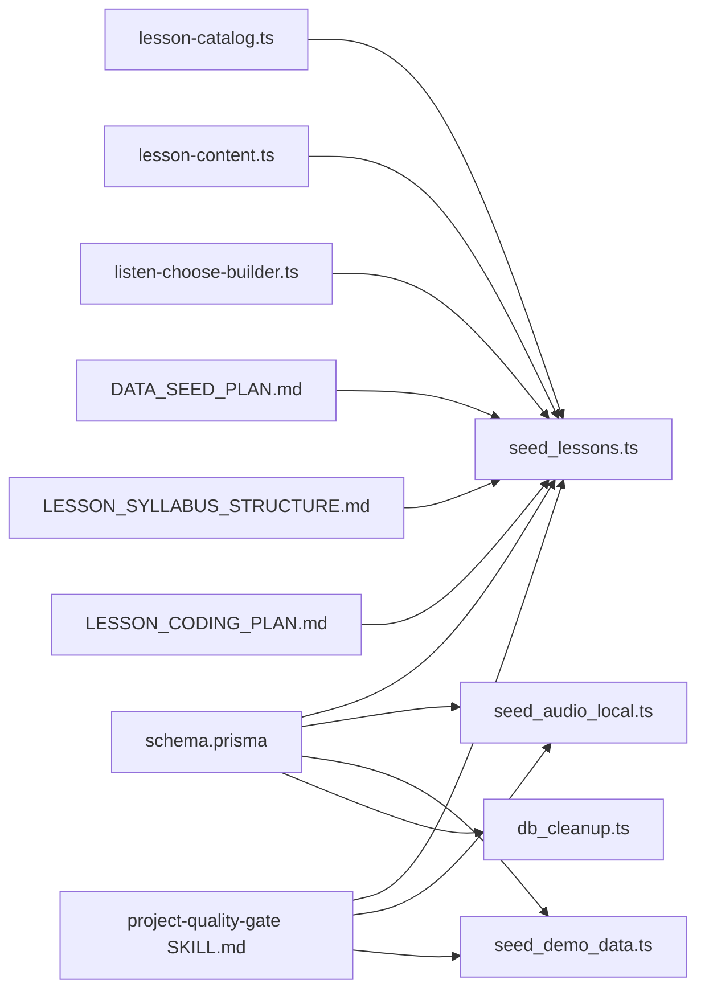

# Data Management and Seeding

<cite>
**Referenced Files in This Document**
- [schema.prisma](file://english_pronunciation_app/frontend/prisma/schema.prisma)
- [seed_lessons.ts](file://english_pronunciation_app/frontend/prisma/seed_lessons.ts)
- [seed_audio_local.ts](file://english_pronunciation_app/frontend/prisma/seed_audio_local.ts)
- [seed_demo_data.ts](file://english_pronunciation_app/frontend/prisma/seed_demo_data.ts)
- [db_cleanup.ts](file://english_pronunciation_app/frontend/prisma/db_cleanup.ts)
- [lesson-catalog.ts](file://english_pronunciation_app/frontend/prisma/lesson-catalog.ts)
- [lesson-content.ts](file://english_pronunciation_app/frontend/prisma/lesson-content.ts)
- [listen-choose-builder.ts](file://english_pronunciation_app/frontend/prisma/listen-choose-builder.ts)
- [DATA_SEED_PLAN.md](file://PLAN/02_Database_And_Data/DATA_SEED_PLAN.md)
- [LESSON_SYLLABUS_STRUCTURE.md](file://PLAN/02_Database_And_Data/LESSON_SYLLABUS_STRUCTURE.md)
- [LESSON_CODING_PLAN.md](file://PLAN/02_Database_And_Data/LESSON_CODING_PLAN.md)
- [project-quality-gate SKILL.md](file://english_pronunciation_app/.agents/skills/project-quality-gate/SKILL.md)
- [question-bank-curator sources.md](file://english_pronunciation_app/.agents/skills/question-bank-curator/references/sources.md)
- [04_PhuongPhapNghienCuu_DATA.md](file://WORD/Chuong1_TongQuan/04_PhuongPhapNghienCuu_DATA.md)
</cite>

## Table of Contents
1. [Introduction](#introduction)
2. [Project Structure](#project-structure)
3. [Core Components](#core-components)
4. [Architecture Overview](#architecture-overview)
5. [Detailed Component Analysis](#detailed-component-analysis)
6. [Dependency Analysis](#dependency-analysis)
7. [Performance Considerations](#performance-considerations)
8. [Troubleshooting Guide](#troubleshooting-guide)
9. [Conclusion](#conclusion)
10. [Appendices](#appendices)

## Introduction
This document provides comprehensive guidance for data management workflows in the English pronunciation application, covering seeding, cleanup, content management, and data governance. It documents the lesson seeding pipeline, audio file management, demo data setup, data migration strategies, schema evolution patterns, backward compatibility, content curation workflows, validation and QA, approval workflows, database cleanup, archival strategies, retention policies, bulk operations, transformations, and synchronization between local and production environments.

## Project Structure
The data management layer centers around Prisma schema modeling and TypeScript seed scripts located under the frontend/prisma directory. Supporting plans and guidelines define the lesson catalog, content structure, and quality gates.

**Diagram sources**
- [schema.prisma:1-501](file://english_pronunciation_app/frontend/prisma/schema.prisma#L1-L501)
- [seed_lessons.ts:1-800](file://english_pronunciation_app/frontend/prisma/seed_lessons.ts#L1-L800)
- [seed_audio_local.ts:1-147](file://english_pronunciation_app/frontend/prisma/seed_audio_local.ts#L1-L147)
- [seed_demo_data.ts:1-160](file://english_pronunciation_app/frontend/prisma/seed_demo_data.ts#L1-L160)
- [db_cleanup.ts:1-99](file://english_pronunciation_app/frontend/prisma/db_cleanup.ts#L1-L99)
- [lesson-catalog.ts:1-288](file://english_pronunciation_app/frontend/prisma/lesson-catalog.ts#L1-L288)
- [lesson-content.ts:1-800](file://english_pronunciation_app/frontend/prisma/lesson-content.ts#L1-L800)
- [listen-choose-builder.ts:1-134](file://english_pronunciation_app/frontend/prisma/listen-choose-builder.ts#L1-L134)
- [DATA_SEED_PLAN.md:1-418](file://PLAN/02_Database_And_Data/DATA_SEED_PLAN.md#L1-L418)
- [LESSON_SYLLABUS_STRUCTURE.md:1-198](file://PLAN/02_Database_And_Data/LESSON_SYLLABUS_STRUCTURE.md#L1-L198)
- [LESSON_CODING_PLAN.md:1-473](file://PLAN/02_Database_And_Data/LESSON_CODING_PLAN.md#L1-L473)

**Section sources**
- [schema.prisma:1-501](file://english_pronunciation_app/frontend/prisma/schema.prisma#L1-L501)
- [DATA_SEED_PLAN.md:1-418](file://PLAN/02_Database_And_Data/DATA_SEED_PLAN.md#L1-L418)
- [LESSON_SYLLABUS_STRUCTURE.md:1-198](file://PLAN/02_Database_And_Data/LESSON_SYLLABUS_STRUCTURE.md#L1-L198)
- [LESSON_CODING_PLAN.md:1-473](file://PLAN/02_Database_And_Data/LESSON_CODING_PLAN.md#L1-L473)

## Core Components
- Prisma schema defines the canonical data model for users, gamification, learning maps, exercises, questions, phonemes, sound groups, word items, minimal pairs, sentence items, and question bank items.
- Seed scripts orchestrate idempotent data creation/upsert flows for lessons, audio, and demo data.
- Catalog and content modules define structured lesson definitions and MVP content sets.
- Builder utilities support listen-choose question generation and scaffolding.

**Section sources**
- [schema.prisma:14-501](file://english_pronunciation_app/frontend/prisma/schema.prisma#L14-L501)
- [seed_lessons.ts:1-800](file://english_pronunciation_app/frontend/prisma/seed_lessons.ts#L1-L800)
- [seed_audio_local.ts:1-147](file://english_pronunciation_app/frontend/prisma/seed_audio_local.ts#L1-L147)
- [seed_demo_data.ts:1-160](file://english_pronunciation_app/frontend/prisma/seed_demo_data.ts#L1-L160)
- [lesson-catalog.ts:1-288](file://english_pronunciation_app/frontend/prisma/lesson-catalog.ts#L1-L288)
- [lesson-content.ts:1-800](file://english_pronunciation_app/frontend/prisma/lesson-content.ts#L1-L800)
- [listen-choose-builder.ts:1-134](file://english_pronunciation_app/frontend/prisma/listen-choose-builder.ts#L1-L134)

## Architecture Overview
The data management architecture follows a layered approach:
- Data model layer: Prisma schema with strong typing and referential integrity.
- Orchestration layer: Seed scripts implementing idempotent upserts and deterministic generation.
- Content layer: Catalog-driven lesson definitions and curated content sets.
- Governance layer: Plans and skills defining sourcing, validation, and quality gates.

**Diagram sources**
- [DATA_SEED_PLAN.md:1-418](file://PLAN/02_Database_And_Data/DATA_SEED_PLAN.md#L1-L418)
- [LESSON_SYLLABUS_STRUCTURE.md:1-198](file://PLAN/02_Database_And_Data/LESSON_SYLLABUS_STRUCTURE.md#L1-L198)
- [LESSON_CODING_PLAN.md:1-473](file://PLAN/02_Database_And_Data/LESSON_CODING_PLAN.md#L1-L473)
- [project-quality-gate SKILL.md:1-27](file://english_pronunciation_app/.agents/skills/project-quality-gate/SKILL.md#L1-L27)
- [schema.prisma:1-501](file://english_pronunciation_app/frontend/prisma/schema.prisma#L1-L501)
- [seed_lessons.ts:1-800](file://english_pronunciation_app/frontend/prisma/seed_lessons.ts#L1-L800)
- [seed_audio_local.ts:1-147](file://english_pronunciation_app/frontend/prisma/seed_audio_local.ts#L1-L147)
- [seed_demo_data.ts:1-160](file://english_pronunciation_app/frontend/prisma/seed_demo_data.ts#L1-L160)
- [db_cleanup.ts:1-99](file://english_pronunciation_app/frontend/prisma/db_cleanup.ts#L1-L99)
- [lesson-catalog.ts:1-288](file://english_pronunciation_app/frontend/prisma/lesson-catalog.ts#L1-L288)
- [lesson-content.ts:1-800](file://english_pronunciation_app/frontend/prisma/lesson-content.ts#L1-L800)
- [listen-choose-builder.ts:1-134](file://english_pronunciation_app/frontend/prisma/listen-choose-builder.ts#L1-L134)

## Detailed Component Analysis

### Lesson Seeding Pipeline
The lesson seeding pipeline creates and connects domain entities in a deterministic order:
- Upserts question types, topics, phonemes, and sound groups.
- Links phonemes to sound groups via junction records.
- Seeds word items, minimal pairs, and sentence items with status and difficulty mapping.
- Creates question bank items per content type and mode.
- Generates learning maps and exercises, assigning topic and level.
- Builds fixed questions from the question bank.

**Diagram sources**
- [seed_lessons.ts:116-754](file://english_pronunciation_app/frontend/prisma/seed_lessons.ts#L116-L754)
- [schema.prisma:14-501](file://english_pronunciation_app/frontend/prisma/schema.prisma#L14-L501)

**Section sources**
- [seed_lessons.ts:116-754](file://english_pronunciation_app/frontend/prisma/seed_lessons.ts#L116-L754)
- [lesson-catalog.ts:58-288](file://english_pronunciation_app/frontend/prisma/lesson-catalog.ts#L58-L288)
- [lesson-content.ts:14-800](file://english_pronunciation_app/frontend/prisma/lesson-content.ts#L14-L800)

### Audio File Management
Audio management supports both remote API fetching and local fallback:
- Remote fetching: retrieves audio URLs from a dictionary API with prioritization and timeouts.
- Local caching: downloads MP3 files to a public directory and updates DB records to local URLs.
- Status management: items without audio remain in NEEDS_REVIEW until remediated.

**Diagram sources**
- [seed_audio_local.ts:64-147](file://english_pronunciation_app/frontend/prisma/seed_audio_local.ts#L64-L147)

**Section sources**
- [seed_audio_local.ts:1-147](file://english_pronunciation_app/frontend/prisma/seed_audio_local.ts#L1-L147)
- [DATA_SEED_PLAN.md:71-96](file://PLAN/02_Database_And_Data/DATA_SEED_PLAN.md#L71-L96)

### Demo Data Setup
Demo data seeds multiple learners and admin users, assigns gamification stats, generates leaderboard entries, and creates representative exercise attempts. It depends on existing roles and active exercises.

**Diagram sources**
- [seed_demo_data.ts:41-160](file://english_pronunciation_app/frontend/prisma/seed_demo_data.ts#L41-L160)

**Section sources**
- [seed_demo_data.ts:1-160](file://english_pronunciation_app/frontend/prisma/seed_demo_data.ts#L1-L160)

### Database Cleanup Procedures
The cleanup script performs a controlled truncation of all tables in the public schema, restarting identities and cascading deletes. It verifies counts afterward and advises subsequent reseeding.

**Diagram sources**
- [db_cleanup.ts:52-99](file://english_pronunciation_app/frontend/prisma/db_cleanup.ts#L52-L99)

**Section sources**
- [db_cleanup.ts:1-99](file://english_pronunciation_app/frontend/prisma/db_cleanup.ts#L1-L99)

### Content Curation Workflows
Content curation is catalog-driven:
- Define topics, sound groups, phonemes, and exercise modes in the lesson catalog.
- Curate word items, minimal pairs, and sentence items with status, difficulty, and source metadata.
- Use builder utilities to scaffold listen-choose questions with staged presentation logic.

**Diagram sources**
- [schema.prisma:144-418](file://english_pronunciation_app/frontend/prisma/schema.prisma#L144-L418)
- [lesson-catalog.ts:15-52](file://english_pronunciation_app/frontend/prisma/lesson-catalog.ts#L15-L52)
- [lesson-content.ts:14-67](file://english_pronunciation_app/frontend/prisma/lesson-content.ts#L14-L67)

**Section sources**
- [lesson-catalog.ts:1-288](file://english_pronunciation_app/frontend/prisma/lesson-catalog.ts#L1-L288)
- [lesson-content.ts:1-800](file://english_pronunciation_app/frontend/prisma/lesson-content.ts#L1-L800)
- [listen-choose-builder.ts:1-134](file://english_pronunciation_app/frontend/prisma/listen-choose-builder.ts#L1-L134)

### Data Validation, QA, and Approval Workflows
Validation and QA are enforced through documented quality gates and curated sources:
- Schema validation, type checking, tests, and builds form the quality gate.
- Approved sources and licensing guidance govern content ingestion.
- Status-driven visibility ensures only approved items appear in active lessons.

**Diagram sources**
- [project-quality-gate SKILL.md:19-27](file://english_pronunciation_app/.agents/skills/project-quality-gate/SKILL.md#L19-L27)
- [04_PhuongPhapNghienCuu_DATA.md:385-438](file://WORD/Chuong1_TongQuan/04_PhuongPhapNghienCuu_DATA.md#L385-L438)
- [question-bank-curator sources.md:1-30](file://english_pronunciation_app/.agents/skills/question-bank-curator/references/sources.md#L1-L30)

**Section sources**
- [project-quality-gate SKILL.md:1-27](file://english_pronunciation_app/.agents/skills/project-quality-gate/SKILL.md#L1-L27)
- [04_PhuongPhapNghienCuu_DATA.md:385-438](file://WORD/Chuong1_TongQuan/04_PhuongPhapNghienCuu_DATA.md#L385-L438)
- [question-bank-curator sources.md:1-30](file://english_pronunciation_app/.agents/skills/question-bank-curator/references/sources.md#L1-L30)

### Data Migration Strategies and Backward Compatibility
Migration strategies emphasize idempotency and incremental evolution:
- Use seed scripts to evolve schema and data without destructive changes.
- Maintain status fields and metadata to preserve backward compatibility.
- Keep catalog-driven generation to avoid hard-coded content drift.

**Section sources**
- [DATA_SEED_PLAN.md:374-417](file://PLAN/02_Database_And_Data/DATA_SEED_PLAN.md#L374-L417)
- [LESSON_CODING_PLAN.md:169-202](file://PLAN/02_Database_And_Data/LESSON_CODING_PLAN.md#L169-L202)

### Bulk Operations and Transformations
Bulk operations leverage upsert patterns and batched updates:
- Upsert patterns prevent duplication and support re-seeding.
- Batched updates for subcategories demonstrate targeted transformations without regenerating content.

**Section sources**
- [seed_lessons.ts:116-754](file://english_pronunciation_app/frontend/prisma/seed_lessons.ts#L116-L754)
- [seed_subcategory.ts:270-342](file://docs/superpowers/plans/2026-06-18-sp3a-fix-subcategory-back-button.md#L270-L342)

### Content Synchronization Between Environments
Synchronization relies on idempotent seeds and deterministic identifiers:
- Use catalog-driven IDs and upsert semantics to reconcile differences.
- Maintain separate audio directories and URLs to isolate environment-specific assets.

**Section sources**
- [seed_lessons.ts:54-64](file://english_pronunciation_app/frontend/prisma/seed_lessons.ts#L54-L64)
- [seed_audio_local.ts:78-132](file://english_pronunciation_app/frontend/prisma/seed_audio_local.ts#L78-L132)

## Dependency Analysis
The following diagram highlights key dependencies among components:

**Diagram sources**
- [schema.prisma:1-501](file://english_pronunciation_app/frontend/prisma/schema.prisma#L1-L501)
- [seed_lessons.ts:1-800](file://english_pronunciation_app/frontend/prisma/seed_lessons.ts#L1-L800)
- [seed_audio_local.ts:1-147](file://english_pronunciation_app/frontend/prisma/seed_audio_local.ts#L1-L147)
- [seed_demo_data.ts:1-160](file://english_pronunciation_app/frontend/prisma/seed_demo_data.ts#L1-L160)
- [db_cleanup.ts:1-99](file://english_pronunciation_app/frontend/prisma/db_cleanup.ts#L1-L99)
- [lesson-catalog.ts:1-288](file://english_pronunciation_app/frontend/prisma/lesson-catalog.ts#L1-L288)
- [lesson-content.ts:1-800](file://english_pronunciation_app/frontend/prisma/lesson-content.ts#L1-L800)
- [listen-choose-builder.ts:1-134](file://english_pronunciation_app/frontend/prisma/listen-choose-builder.ts#L1-L134)
- [DATA_SEED_PLAN.md:1-418](file://PLAN/02_Database_And_Data/DATA_SEED_PLAN.md#L1-L418)
- [LESSON_SYLLABUS_STRUCTURE.md:1-198](file://PLAN/02_Database_And_Data/LESSON_SYLLABUS_STRUCTURE.md#L1-L198)
- [LESSON_CODING_PLAN.md:1-473](file://PLAN/02_Database_And_Data/LESSON_CODING_PLAN.md#L1-L473)
- [project-quality-gate SKILL.md:1-27](file://english_pronunciation_app/.agents/skills/project-quality-gate/SKILL.md#L1-L27)

**Section sources**
- [schema.prisma:1-501](file://english_pronunciation_app/frontend/prisma/schema.prisma#L1-L501)
- [seed_lessons.ts:1-800](file://english_pronunciation_app/frontend/prisma/seed_lessons.ts#L1-L800)
- [lesson-catalog.ts:1-288](file://english_pronunciation_app/frontend/prisma/lesson-catalog.ts#L1-L288)
- [lesson-content.ts:1-800](file://english_pronunciation_app/frontend/prisma/lesson-content.ts#L1-L800)
- [listen-choose-builder.ts:1-134](file://english_pronunciation_app/frontend/prisma/listen-choose-builder.ts#L1-L134)
- [DATA_SEED_PLAN.md:1-418](file://PLAN/02_Database_And_Data/DATA_SEED_PLAN.md#L1-L418)
- [LESSON_SYLLABUS_STRUCTURE.md:1-198](file://PLAN/02_Database_And_Data/LESSON_SYLLABUS_STRUCTURE.md#L1-L198)
- [LESSON_CODING_PLAN.md:1-473](file://PLAN/02_Database_And_Data/LESSON_CODING_PLAN.md#L1-L473)
- [project-quality-gate SKILL.md:1-27](file://english_pronunciation_app/.agents/skills/project-quality-gate/SKILL.md#L1-L27)

## Performance Considerations
- Prefer upsert patterns to minimize duplicate writes and reduce contention.
- Use batched operations for large datasets; limit concurrent network requests for audio fetching.
- Indexes on frequently queried fields (e.g., status, difficulty, topicId) improve query performance.
- Cache API responses for audio URLs to avoid repeated network calls during re-seeds.

## Troubleshooting Guide
Common issues and resolutions:
- Missing audio prevents listen-choose activation; mark items as NEEDS_REVIEW and remediate.
- API failures during audio fetch require retry logic and fallback to local storage.
- Schema mismatches after DB push cause validation failures; run prisma validate and regenerate clients.
- Demo data requires existing roles and active exercises; ensure prerequisite seeds are complete.

**Section sources**
- [seed_audio_local.ts:102-132](file://english_pronunciation_app/frontend/prisma/seed_audio_local.ts#L102-L132)
- [seed_demo_data.ts:50-61](file://english_pronunciation_app/frontend/prisma/seed_demo_data.ts#L50-L61)
- [project-quality-gate SKILL.md:19-27](file://english_pronunciation_app/.agents/skills/project-quality-gate/SKILL.md#L19-L27)

## Conclusion
The data management workflows combine a robust Prisma schema, catalog-driven content, and idempotent seed scripts to enable scalable lesson creation, reliable audio management, and reproducible demo setups. Governance through quality gates and curated sources ensures data integrity and compliance. Cleanup and migration strategies maintain backward compatibility and operational safety across environments.

## Appendices
- Appendix A: Data Model Overview
  - Users, Roles, Progress, Exercises, Questions, Phonemes, Sound Groups, Word Items, Minimal Pairs, Sentence Items, Question Bank Items, Learning Maps, Leaderboards, Daily Activities, Badges, User Badges, and related relations are defined in the schema.
- Appendix B: Seed Command Reference
  - Lessons: run the lesson seed script to create topics, groups, content, question bank, maps, exercises, and questions.
  - Audio: run the local audio seed to fetch and cache MP3 files and update DB records.
  - Demo: run the demo data script to populate users, attempts, and leaderboard entries.
  - Cleanup: run the cleanup script to truncate tables and restart sequences.

**Section sources**
- [schema.prisma:14-501](file://english_pronunciation_app/frontend/prisma/schema.prisma#L14-L501)
- [seed_lessons.ts:23-24](file://english_pronunciation_app/frontend/prisma/seed_lessons.ts#L23-L24)
- [seed_audio_local.ts:17-18](file://english_pronunciation_app/frontend/prisma/seed_audio_local.ts#L17-L18)
- [seed_demo_data.ts:8-9](file://english_pronunciation_app/frontend/prisma/seed_demo_data.ts#L8-L9)
- [db_cleanup.ts:13-16](file://english_pronunciation_app/frontend/prisma/db_cleanup.ts#L13-L16)