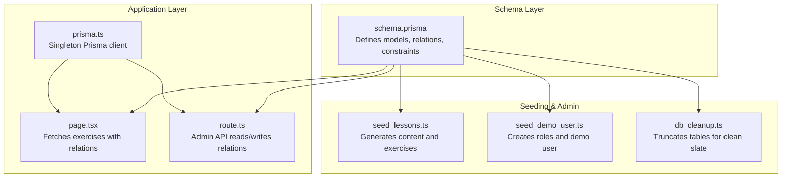
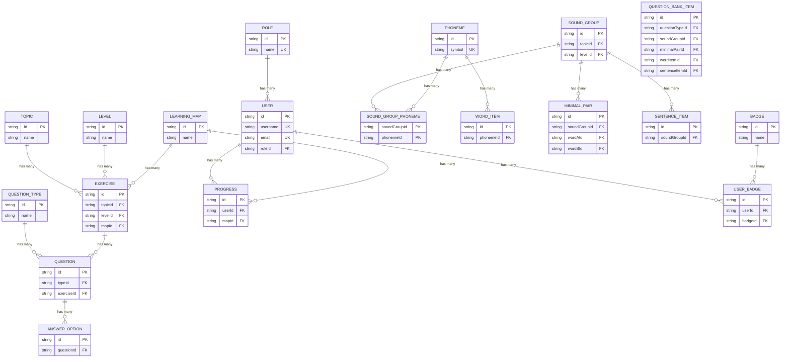
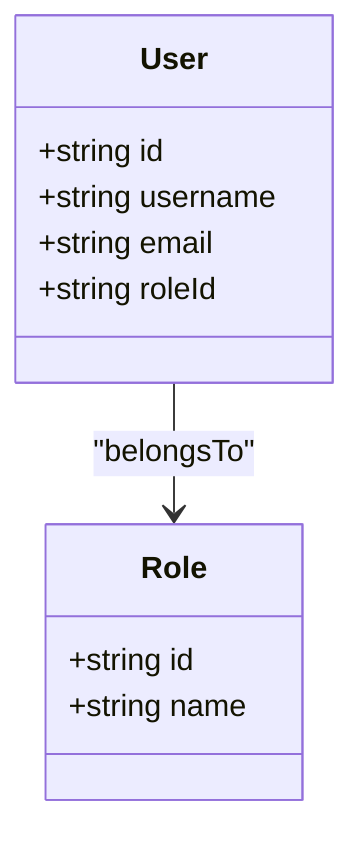
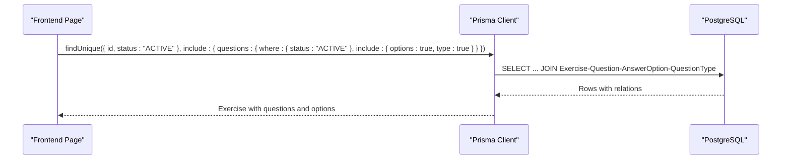
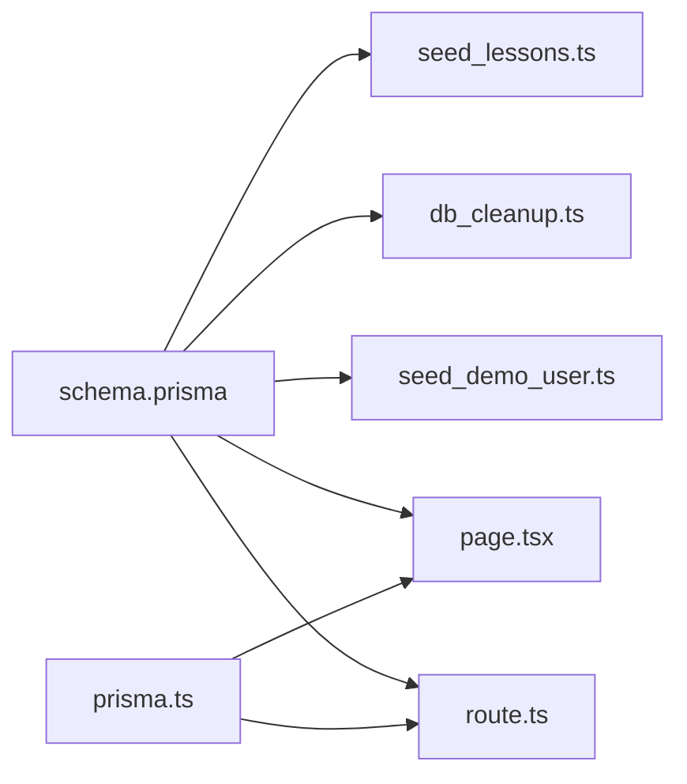

# Data Relationships and Constraints

<cite>
**Referenced Files in This Document**
- [schema.prisma](file://english_pronunciation_app/frontend/prisma/schema.prisma)
- [seed_lessons.ts](file://english_pronunciation_app/frontend/prisma/seed_lessons.ts)
- [seed_demo_user.ts](file://english_pronunciation_app/frontend/prisma/seed_demo_user.ts)
- [db_cleanup.ts](file://english_pronunciation_app/frontend/prisma/db_cleanup.ts)
- [DATA_SEED_PLAN.md](file://PLAN/02_Database_And_Data/DATA_SEED_PLAN.md)
- [DB_AUDIT_REPORT.md](file://PLAN/02_Database_And_Data/DB_AUDIT_REPORT.md)
- [page.tsx](file://english_pronunciation_app/frontend/src/app/exercises/[id]/page.tsx)
- [route.ts](file://english_pronunciation_app/frontend/src/app/api/admin/exercises/[id]/route.ts)
- [prisma.ts](file://english_pronunciation_app/frontend/src/lib/prisma.ts)
</cite>

## Table of Contents
1. [Introduction](#introduction)
2. [Project Structure](#project-structure)
3. [Core Components](#core-components)
4. [Architecture Overview](#architecture-overview)
5. [Detailed Component Analysis](#detailed-component-analysis)
6. [Dependency Analysis](#dependency-analysis)
7. [Performance Considerations](#performance-considerations)
8. [Troubleshooting Guide](#troubleshooting-guide)
9. [Conclusion](#conclusion)

## Introduction
This document explains the database relationships and referential constraints implemented in the project’s Prisma schema. It focuses on primary key and foreign key relationships among entities such as User-Role, Exercise-Topic-Level-LearningMap, Question-QuestionType, and phoneme-sound group associations. It also documents cascade delete behaviors, restrict patterns, set null scenarios, unique constraints, composite keys, indexing strategies, many-to-many relationships via junction tables, and constraint validation rules that enforce data and referential integrity.

## Project Structure
The database schema is defined in a single Prisma schema file and supported by seed scripts and administrative utilities. Frontend pages and API routes demonstrate practical usage of these relationships.



**Diagram sources**
- [schema.prisma](file://english_pronunciation_app/frontend/prisma/schema.prisma)
- [seed_lessons.ts](file://english_pronunciation_app/frontend/prisma/seed_lessons.ts)
- [seed_demo_user.ts](file://english_pronunciation_app/frontend/prisma/seed_demo_user.ts)
- [db_cleanup.ts](file://english_pronunciation_app/frontend/prisma/db_cleanup.ts)
- [page.tsx](file://english_pronunciation_app/frontend/src/app/exercises/[id]/page.tsx)
- [route.ts](file://english_pronunciation_app/frontend/src/app/api/admin/exercises/[id]/route.ts)
- [prisma.ts](file://english_pronunciation_app/frontend/src/lib/prisma.ts)

**Section sources**
- [schema.prisma](file://english_pronunciation_app/frontend/prisma/schema.prisma)
- [seed_lessons.ts](file://english_pronunciation_app/frontend/prisma/seed_lessons.ts)
- [seed_demo_user.ts](file://english_pronunciation_app/frontend/prisma/seed_demo_user.ts)
- [db_cleanup.ts](file://english_pronunciation_app/frontend/prisma/db_cleanup.ts)
- [page.tsx](file://english_pronunciation_app/frontend/src/app/exercises/[id]/page.tsx)
- [route.ts](file://english_pronunciation_app/frontend/src/app/api/admin/exercises/[id]/route.ts)
- [prisma.ts](file://english_pronunciation_app/frontend/src/lib/prisma.ts)

## Core Components
- User and Role: One-to-many relation enforced by foreign key roleId referencing Role.id. Unique constraints on username and email; Role.name is unique.
- LearningMap, Topic, Level: Many-to-one relations from Exercise to Topic, Level, and LearningMap; composite unique on Progress(userId, mapId).
- Exercise: Many-to-one to Topic, Level, LearningMap; cascade delete on Exercise cascades to dependent Question and AnswerOption.
- Question and QuestionType: Many-to-one relation; Question has a composite unique on (typeId, exerciseId) enforced via @@id on QuestionAttempt.
- Phoneme-SoundGroup association: Many-to-many via SoundGroupPhoneme junction table with composite primary key (soundGroupId, phonemeId) and indexes on both sides.
- WordItem, MinimalPair, SentenceItem: Many-to-one to SoundGroup; WordItem has restrict on phonemeId; MinimalPair restricts both wordAId and wordBId; QuestionBankItem set null on optional relations.
- UserBadge: Many-to-many between User and Badge via composite unique (userId, badgeId).
- Cascading and restriction policies: Explicitly configured per relation (Cascade, Restrict, SetNull).

**Section sources**
- [schema.prisma](file://english_pronunciation_app/frontend/prisma/schema.prisma)

## Architecture Overview
The schema enforces referential integrity at the database level and supports application-level queries with Prisma client. Seed scripts populate content and maintain integrity rules, while admin APIs and frontend pages rely on these relations.



**Diagram sources**
- [schema.prisma](file://english_pronunciation_app/frontend/prisma/schema.prisma)

## Detailed Component Analysis

### User-Role Relationship
- Primary key: Role.id, User.id
- Foreign key: User.roleId references Role.id
- Unique constraints: Role.name, User.username, User.email
- Cascade behavior: None specified; updates/deletes propagate per Prisma defaults unless overridden
- Application usage: Admin endpoints and frontend pages reference User.role and Role.name



**Diagram sources**
- [schema.prisma](file://english_pronunciation_app/frontend/prisma/schema.prisma)

**Section sources**
- [schema.prisma](file://english_pronunciation_app/frontend/prisma/schema.prisma)
- [seed_demo_user.ts](file://english_pronunciation_app/frontend/prisma/seed_demo_user.ts)

### Exercise-Topic-Level-LearningMap Relationship
- Primary keys: Topic.id, Level.id, LearningMap.id, Exercise.id
- Foreign keys: Exercise.topicId→Topic.id, Exercise.levelId→Level.id, Exercise.mapId→LearningMap.id
- Composite unique: Progress(userId, mapId)
- Cascade deletes: Exercise→Question, Question→AnswerOption
- Application usage: Exercise queries include related Topic, Level, and LearningMap; admin endpoints update these relations

```mermaid
classDiagram
class Topic {
+string id
+string name
}
class Level {
+string id
+string name
}
class LearningMap {
+string id
+string name
}
class Exercise {
+string id
+string topicId
+string levelId
+string mapId
}
class Progress {
+string id
+string userId
+string mapId
}
Topic ||--o{ Exercise : "has many"
Level ||--o{ Exercise : "has many"
LearningMap ||--o{ Exercise : "has many"
Exercise ||--o{ Progress : "has many"
```

**Diagram sources**
- [schema.prisma](file://english_pronunciation_app/frontend/prisma/schema.prisma)

**Section sources**
- [schema.prisma](file://english_pronunciation_app/frontend/prisma/schema.prisma)
- [page.tsx](file://english_pronunciation_app/frontend/src/app/exercises/[id]/page.tsx)
- [route.ts](file://english_pronunciation_app/frontend/src/app/api/admin/exercises/[id]/route.ts)

### Question-QuestionType Relationship
- Primary key: QuestionType.id, Question.id
- Foreign key: Question.typeId→QuestionType.id
- Composite unique: @@id([exerciseAttemptId, questionId]) on QuestionAttempt
- Cascade deletes: Question→AnswerOption
- Application usage: Exercise pages and admin endpoints include QuestionType details

```mermaid
classDiagram
class QuestionType {
+string id
+string name
}
class Question {
+string id
+string typeId
+string exerciseId
}
class AnswerOption {
+string id
+string questionId
}
QuestionType ||--o{ Question : "has many"
Question ||--o{ AnswerOption : "has many"
```

**Diagram sources**
- [schema.prisma](file://english_pronunciation_app/frontend/prisma/schema.prisma)

**Section sources**
- [schema.prisma](file://english_pronunciation_app/frontend/prisma/schema.prisma)
- [page.tsx](file://english_pronunciation_app/frontend/src/app/exercises/[id]/page.tsx)

### Phoneme-SoundGroup Associations
- Many-to-many via SoundGroupPhoneme junction table
- Composite primary key: (soundGroupId, phonemeId)
- Indexes: on phonemeId, on (soundGroupId, orderIndex)
- Cascade deletes: SoundGroupPhoneme→Phoneme and SoundGroup
- Restriction and set-null policies:
  - WordItem.phonemeId: Restrict (cannot delete Phoneme if referenced by WordItem)
  - MinimalPair.wordAId/wordBId: Restrict (cannot delete WordItem if referenced)
  - QuestionBankItem optional relations: SetNull on delete (optional relations)
  - SoundGroup.topicId/levelId: SetNull on delete (optional relations)

```mermaid
classDiagram
class Phoneme {
+string id
+string symbol
}
class SoundGroup {
+string id
+string topicId
+string levelId
}
class SoundGroupPhoneme {
+string soundGroupId
+string phonemeId
+string role
+number orderIndex
}
class WordItem {
+string id
+string phonemeId
}
class MinimalPair {
+string id
+string soundGroupId
+string wordAId
+string wordBId
}
class SentenceItem {
+string id
+string soundGroupId
}
class QuestionBankItem {
+string id
+string soundGroupId
+string minimalPairId
+string wordItemId
+string sentenceItemId
}
Phoneme ||--o{ SoundGroupPhoneme : "many"
SoundGroup ||--o{ SoundGroupPhoneme : "many"
SoundGroupPhoneme ||--|| Phoneme
SoundGroupPhoneme ||--|| SoundGroup
Phoneme ||--o{ WordItem : "many"
SoundGroup ||--o{ MinimalPair : "many"
SoundGroup ||--o{ SentenceItem : "many"
WordItem ||--|| Phoneme
MinimalPair --> WordItem : "references A/B"
QuestionBankItem --> SoundGroup
QuestionBankItem --> MinimalPair
QuestionBankItem --> WordItem
QuestionBankItem --> SentenceItem
```

**Diagram sources**
- [schema.prisma](file://english_pronunciation_app/frontend/prisma/schema.prisma)

**Section sources**
- [schema.prisma](file://english_pronunciation_app/frontend/prisma/schema.prisma)

### Many-to-Many Relationships
- UserBadge: composite unique (userId, badgeId) ensures one-time award per user-badge combination
- Junction table: UserBadge links User and Badge
- Cascade deletes: UserBadge→User and Badge

```mermaid
classDiagram
class User {
+string id
}
class Badge {
+string id
}
class UserBadge {
+string id
+string userId
+string badgeId
}
User ||--o{ UserBadge : "has many"
Badge ||--o{ UserBadge : "has many"
```

**Diagram sources**
- [schema.prisma](file://english_pronunciation_app/frontend/prisma/schema.prisma)

**Section sources**
- [schema.prisma](file://english_pronunciation_app/frontend/prisma/schema.prisma)

### Constraint Validation Rules and Referential Integrity
- Unique constraints:
  - Role.name (unique)
  - User.username (unique)
  - User.email (unique)
  - Phoneme.symbol (unique)
  - Progress(userId, mapId) (unique)
  - UserBadge(userId, badgeId) (unique)
  - PasswordResetToken.tokenHash (unique)
  - Leaderboard(userId, type, period) (unique)
  - DailyQuest(userId, date, questType) (unique)
  - WordItem(word, ipa, phonemeId) (unique)
  - MinimalPair(soundGroupId, wordAId, wordBId) (unique)
- Composite keys:
  - SoundGroupPhoneme: @@id([soundGroupId, phonemeId])
  - QuestionAttempt: @@id([exerciseAttemptId, questionId])
- Indexes:
  - Many foreign keys indexed (e.g., userId on multiple tables, expiresAt on PasswordResetToken)
  - Category/status composite index on Phoneme
  - Status/difficulty and audioSource/sourceType indexes on WordItem/SentenceItem
  - Multi-column indexes for frequent query patterns (e.g., Leaderboard(type, period, score))

**Section sources**
- [schema.prisma](file://english_pronunciation_app/frontend/prisma/schema.prisma)

### Cascade Delete Behaviors, Restrict Patterns, and Set Null Scenarios
- Cascade:
  - User → PasswordResetToken
  - User → Progress
  - User → ExerciseAttempt
  - Exercise → Question
  - Question → AnswerOption
  - User → DailyActivity
  - User → Leaderboard
  - User → UserBadge
  - Badge → UserBadge
- Restrict:
  - WordItem.phonemeId
  - MinimalPair.wordAId, wordBId
  - QuestionBankItem.questionTypeId (restrict on delete)
- SetNull:
  - SoundGroup.topicId, levelId (when parent deleted, children set to null)
  - QuestionBankItem.soundGroupId, minimalPairId, wordItemId, sentenceItemId (optional relations)

**Section sources**
- [schema.prisma](file://english_pronunciation_app/frontend/prisma/schema.prisma)

### Index Strategies
- Foreign key indexes for fast joins
- Composite indexes for frequent filters (e.g., Leaderboard by type+period+score)
- Category/status index on Phoneme for filtering by category and status
- Status/difficulty and audioSource/sourceType indexes on content tables for efficient filtering

**Section sources**
- [schema.prisma](file://english_pronunciation_app/frontend/prisma/schema.prisma)

### Relationship Queries and Join Patterns
- Exercise detail retrieval includes Topic, Level, LearningMap, and Questions with QuestionType and AnswerOption
- Admin API reads exercise with ordered questions and counts attempts
- Frontend pages fetch exercises with ACTIVE status and include only ACTIVE questions



**Diagram sources**
- [page.tsx](file://english_pronunciation_app/frontend/src/app/exercises/[id]/page.tsx)
- [prisma.ts](file://english_pronunciation_app/frontend/src/lib/prisma.ts)

**Section sources**
- [page.tsx](file://english_pronunciation_app/frontend/src/app/exercises/[id]/page.tsx)
- [route.ts](file://english_pronunciation_app/frontend/src/app/api/admin/exercises/[id]/route.ts)
- [prisma.ts](file://english_pronunciation_app/frontend/src/lib/prisma.ts)

## Dependency Analysis
The schema defines explicit foreign keys and constraints. Seed scripts and cleanup utilities maintain data integrity during development and testing.



**Diagram sources**
- [schema.prisma](file://english_pronunciation_app/frontend/prisma/schema.prisma)
- [seed_lessons.ts](file://english_pronunciation_app/frontend/prisma/seed_lessons.ts)
- [db_cleanup.ts](file://english_pronunciation_app/frontend/prisma/db_cleanup.ts)
- [seed_demo_user.ts](file://english_pronunciation_app/frontend/prisma/seed_demo_user.ts)
- [page.tsx](file://english_pronunciation_app/frontend/src/app/exercises/[id]/page.tsx)
- [route.ts](file://english_pronunciation_app/frontend/src/app/api/admin/exercises/[id]/route.ts)
- [prisma.ts](file://english_pronunciation_app/frontend/src/lib/prisma.ts)

**Section sources**
- [schema.prisma](file://english_pronunciation_app/frontend/prisma/schema.prisma)
- [seed_lessons.ts](file://english_pronunciation_app/frontend/prisma/seed_lessons.ts)
- [db_cleanup.ts](file://english_pronunciation_app/frontend/prisma/db_cleanup.ts)
- [seed_demo_user.ts](file://english_pronunciation_app/frontend/prisma/seed_demo_user.ts)
- [page.tsx](file://english_pronunciation_app/frontend/src/app/exercises/[id]/page.tsx)
- [route.ts](file://english_pronunciation_app/frontend/src/app/api/admin/exercises/[id]/route.ts)
- [prisma.ts](file://english_pronunciation_app/frontend/src/lib/prisma.ts)

## Performance Considerations
- Use indexes on foreign keys and frequently filtered columns (status, difficulty, type, period)
- Prefer selective queries with where clauses to avoid scanning large tables
- Leverage Prisma’s include patterns judiciously; eager-loading relations can increase payload size
- Monitor query plans for complex joins involving many-to-many relations

## Troubleshooting Guide
- If deleting a parent entity fails due to child records, confirm whether the relation uses Restrict or SetNull. For example, deleting a Phoneme referenced by WordItem requires changing or removing WordItem entries first.
- When updating relations (e.g., Exercise.topicId/levelId/mapId), ensure referenced entities exist; otherwise, admin endpoints validate references and return errors.
- After truncating tables, re-seed roles and demo user to restore authentication and admin access.

**Section sources**
- [schema.prisma](file://english_pronunciation_app/frontend/prisma/schema.prisma)
- [route.ts](file://english_pronunciation_app/frontend/src/app/api/admin/exercises/[id]/route.ts)
- [db_cleanup.ts](file://english_pronunciation_app/frontend/prisma/db_cleanup.ts)
- [seed_demo_user.ts](file://english_pronunciation_app/frontend/prisma/seed_demo_user.ts)

## Conclusion
The schema establishes robust relational integrity with explicit unique constraints, composite keys, and targeted indexes. Cascade, restrict, and set-null policies ensure predictable data lifecycle behavior. Seed scripts and admin utilities maintain consistency during development, while frontend and API routes demonstrate practical usage of these relationships.