# Database Design

<cite>
**Referenced Files in This Document**
- [schema.prisma](file://english_pronunciation_app/frontend/prisma/schema.prisma)
- [prisma.ts](file://english_pronunciation_app/frontend/src/lib/prisma.ts)
- [db_cleanup.ts](file://english_pronunciation_app/frontend/prisma/db_cleanup.ts)
- [seed_demo_user.ts](file://english_pronunciation_app/frontend/prisma/seed_demo_user.ts)
- [seed_demo_data.ts](file://english_pronunciation_app/frontend/prisma/seed_demo_data.ts)
- [seed_lessons.ts](file://english_pronunciation_app/frontend/prisma/seed_lessons.ts)
- [seed_listen_choose.ts](file://english_pronunciation_app/frontend/prisma/seed_listen_choose.ts)
- [seed_audio_local.ts](file://english_pronunciation_app/frontend/prisma/seed_audio_local.ts)
- [seed_subcategory.ts](file://english_pronunciation_app/frontend/prisma/seed_subcategory.ts)
- [lesson-catalog.ts](file://english_pronunciation_app/frontend/prisma/lesson-catalog.ts)
- [lesson-content.ts](file://english_pronunciation_app/frontend/prisma/lesson-content.ts)
- [listen-choose-builder.ts](file://english_pronunciation_app/frontend/prisma/listen-choose-builder.ts)
- [package.json](file://english_pronunciation_app/frontend/package.json)
</cite>

## Table of Contents
1. [Introduction](#introduction)
2. [Project Structure](#project-structure)
3. [Core Components](#core-components)
4. [Architecture Overview](#architecture-overview)
5. [Detailed Component Analysis](#detailed-component-analysis)
6. [Dependency Analysis](#dependency-analysis)
7. [Performance Considerations](#performance-considerations)
8. [Troubleshooting Guide](#troubleshooting-guide)
9. [Conclusion](#conclusion)
10. [Appendices](#appendices)

## Introduction
This document describes the database design and data model for the English pronunciation training application. It covers entity relationships, field definitions, data types, constraints, indexes, and referential integrity as defined in the Prisma schema. It also documents data access patterns via Prisma ORM, seeding and migration strategies, and operational procedures for data lifecycle management.

## Project Structure
The database model is defined in a Prisma schema and supported by TypeScript seed scripts. The application uses a singleton PrismaClient for data access.

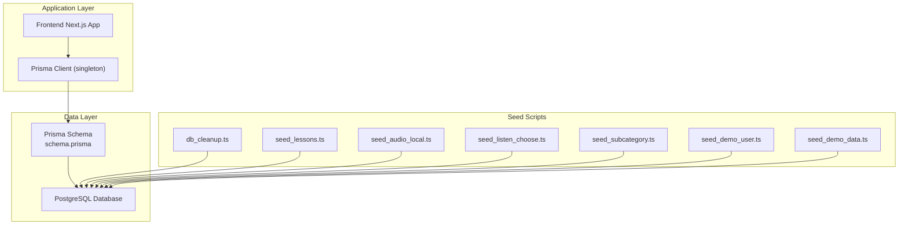

**Diagram sources**
- [prisma.ts:1-13](file://english_pronunciation_app/frontend/src/lib/prisma.ts#L1-L13)
- [schema.prisma:1-501](file://english_pronunciation_app/frontend/prisma/schema.prisma#L1-L501)
- [db_cleanup.ts:1-99](file://english_pronunciation_app/frontend/prisma/db_cleanup.ts#L1-L99)
- [seed_lessons.ts:1-1314](file://english_pronunciation_app/frontend/prisma/seed_lessons.ts#L1-L1314)
- [seed_audio_local.ts:1-147](file://english_pronunciation_app/frontend/prisma/seed_audio_local.ts#L1-L147)
- [seed_listen_choose.ts:1-143](file://english_pronunciation_app/frontend/prisma/seed_listen_choose.ts#L1-L143)
- [seed_subcategory.ts:1-70](file://english_pronunciation_app/frontend/prisma/seed_subcategory.ts#L1-L70)
- [seed_demo_user.ts:1-85](file://english_pronunciation_app/frontend/prisma/seed_demo_user.ts#L1-L85)
- [seed_demo_data.ts:1-160](file://english_pronunciation_app/frontend/prisma/seed_demo_data.ts#L1-L160)

**Section sources**
- [prisma.ts:1-13](file://english_pronunciation_app/frontend/src/lib/prisma.ts#L1-L13)
- [schema.prisma:1-501](file://english_pronunciation_app/frontend/prisma/schema.prisma#L1-L501)
- [package.json:1-45](file://english_pronunciation_app/frontend/package.json#L1-L45)

## Core Components
This section outlines the principal entities and their relationships, focusing on users, exercises, lessons, pronunciation records, and gamification metrics.

- Users and Roles
  - Role: defines user roles (e.g., User, Admin).
  - User: authenticated learners with profile attributes, account status, and gamification stats (XP, level, streaks, gems).
  - Constraints: unique identifiers for usernames and emails; cascading deletes on dependent records.

- Learning Maps and Progress
  - LearningMap: curated learning pathways linked to topics and exercises.
  - Progress: tracks user positions and results per map.

- Exercises and Attempts
  - Exercise: structured lessons with modes (listening, speaking, minimal pairs, sentences).
  - ExerciseAttempt: captures a user’s attempt at an exercise, including scores and timestamps.
  - Question and AnswerOption: define assessment items and choices.
  - QuestionAttempt: stores per-question results, transcripts, selected options, correctness, and audio URLs.

- Pronunciation Content
  - Phoneme: IPA symbols with categories and statuses.
  - SoundGroup: grouping of phonemes by topic/level with ordering and subcategories.
  - WordItem, MinimalPair, SentenceItem: content items supporting exercises with difficulty, status, and audio metadata.
  - QuestionBankItem: reusable question templates linking to content and question types.

- Gamification and Activity
  - DailyActivity: daily XP, completed exercises, and check-ins.
  - Leaderboard: aggregated weekly/monthly scores.
  - DailyQuest: personalized daily quests with rewards.
  - UserBadge: earned badges with validity periods.

- Security and Auth
  - PasswordResetToken: secure password reset with expiry and usage tracking.

Key indexes and constraints observed in the schema:
- Unique constraints on usernames, emails, and composite keys (e.g., unique user-per-map, unique leaderboard entries by period/type).
- Indexes on frequently queried columns (e.g., user/date for daily activity, type/period/score for leaderboards).
- Foreign keys with cascades (e.g., cascade delete on user-dependent records) and restrict/set-null behaviors as appropriate.

**Section sources**
- [schema.prisma:14-501](file://english_pronunciation_app/frontend/prisma/schema.prisma#L14-L501)

## Architecture Overview
The application follows a layered architecture:
- Presentation: Next.js pages and components.
- Services: API handlers orchestrate domain logic.
- Data Access: PrismaClient singleton encapsulates queries and mutations.
- Persistence: PostgreSQL managed by Prisma.

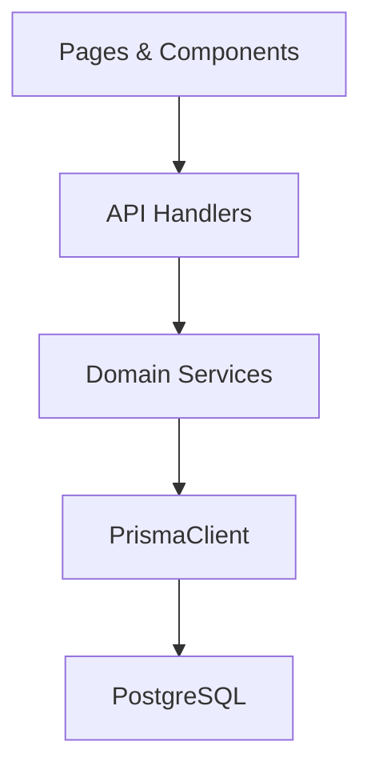

**Diagram sources**
- [prisma.ts:1-13](file://english_pronunciation_app/frontend/src/lib/prisma.ts#L1-L13)
- [schema.prisma:1-501](file://english_pronunciation_app/frontend/prisma/schema.prisma#L1-L501)

## Detailed Component Analysis

### Users and Authentication
- Entities
  - Role: id (UUID), name (unique), users.
  - User: id (UUID), username (unique), gender, dob, avatarUrl, email (unique), passwordHash, status, phone, timestamps; gamification fields (XP, level, streaks, gems, unlocks).
  - PasswordResetToken: id (UUID), tokenHash (unique), expiresAt, usedAt, createdAt; belongs to User.
- Relationships
  - User to Role: many-to-one via roleId.
  - User to PasswordResetToken: one-to-many with cascade delete.
- Constraints and indexes
  - Unique indices on username and email.
  - Index on expiresAt for cleanup.
- Sample data structure
  - User record includes profile, auth, and gamification fields; PasswordResetToken includes expiry and usage.

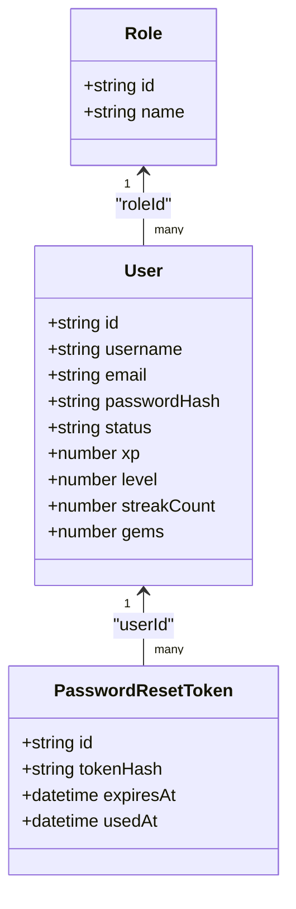

**Diagram sources**
- [schema.prisma:14-73](file://english_pronunciation_app/frontend/prisma/schema.prisma#L14-L73)

**Section sources**
- [schema.prisma:14-73](file://english_pronunciation_app/frontend/prisma/schema.prisma#L14-L73)

### Learning Maps, Topics, Levels, and Exercises
- Entities
  - Topic: id, name, description, orderIndex, unlockThresholdPercent.
  - Level: id, name, description.
  - LearningMap: id, name, requirement, status, subcategory.
  - Exercise: id, name, questionCount, timeLimit, status, description; belongs to Topic, Level, and LearningMap.
- Relationships
  - Topic to Exercise (one-to-many).
  - Level to Exercise (one-to-many).
  - LearningMap to Exercise (one-to-many).
- Constraints and indexes
  - Unique indices on user-per-map and leaderboard composite keys.
  - Indexes on map/topic/level/status for filtering.

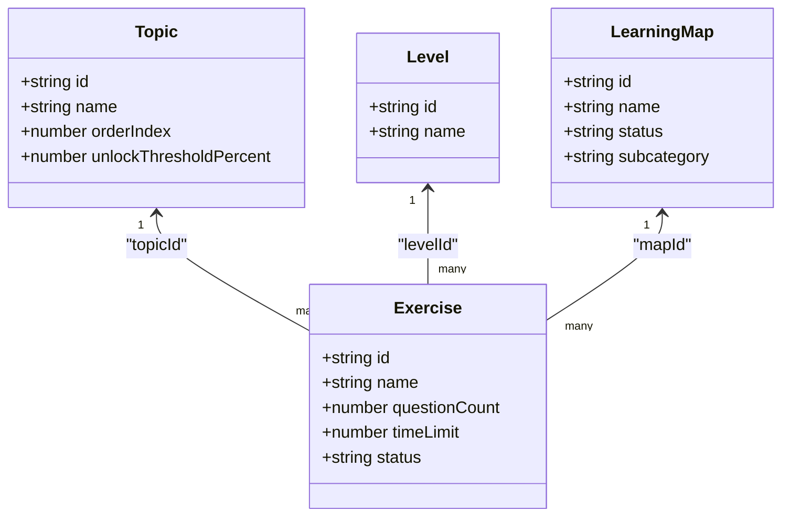

**Diagram sources**
- [schema.prisma:144-195](file://english_pronunciation_app/frontend/prisma/schema.prisma#L144-L195)
- [lesson-catalog.ts:1-288](file://english_pronunciation_app/frontend/prisma/lesson-catalog.ts#L1-L288)

**Section sources**
- [schema.prisma:144-195](file://english_pronunciation_app/frontend/prisma/schema.prisma#L144-L195)
- [lesson-catalog.ts:1-288](file://english_pronunciation_app/frontend/prisma/lesson-catalog.ts#L1-L288)

### Pronunciation Content Model
- Entities
  - Phoneme: id, symbol (unique), name, category, description, hints, status, timestamps.
  - SoundGroup: id, name, description, orderIndex, status, subcategory, timestamps; optionally belongs to Topic/Level.
  - SoundGroupPhoneme: junction table for phonemes in groups with roles and ordering.
  - WordItem: id, word, ipa, audioUrl, audioSource, sourceType, meaningVi, syllables, stressIndex, wordStressType, difficulty, status, reviewNote, timestamps; belongs to Phoneme.
  - MinimalPair: id, note, difficulty, status, timestamps; belongs to SoundGroup and two WordItems.
  - SentenceItem: id, text, targetWords, difficulty, status, sourceType, sourceUrl, reviewNote, timestamps; belongs to SoundGroup.
  - QuestionBankItem: id, prompt, contentJson, answer, acceptedAnswers, score, difficulty, status, sourceType, sourceUrl, reviewNote, timestamps; links to QuestionType, SoundGroup, WordItem, MinimalPair, SentenceItem.
- Relationships
  - Phoneme to WordItem (restrict on delete).
  - SoundGroup to WordItem/MinimalPair/SentenceItem (cascade on delete).
  - QuestionBankItem to multiple content entities (set-null on delete).
- Constraints and indexes
  - Unique combinations for WordItem and MinimalPair.
  - Indexes on category/status, phonemeId, status/difficulty, sourceType, and content linkage fields.

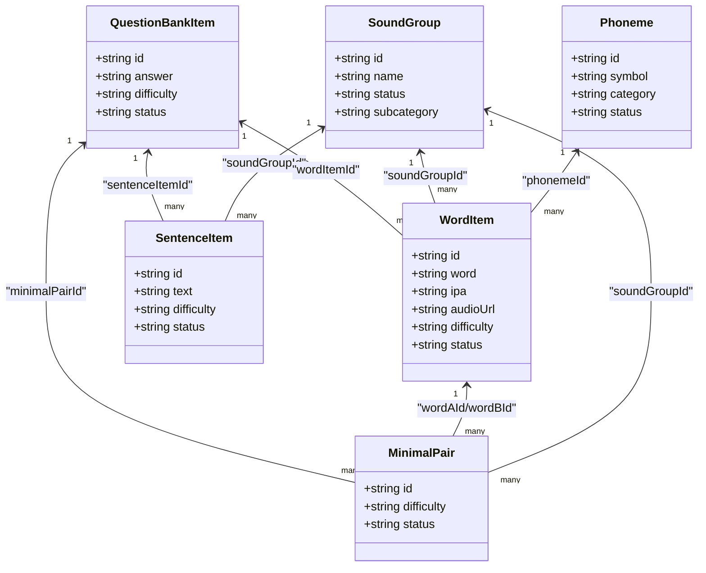

**Diagram sources**
- [schema.prisma:241-418](file://english_pronunciation_app/frontend/prisma/schema.prisma#L241-L418)

**Section sources**
- [schema.prisma:241-418](file://english_pronunciation_app/frontend/prisma/schema.prisma#L241-L418)

### Exercises, Questions, and Attempts
- Entities
  - QuestionType: id, name, description; supports multiple question types.
  - Question: id, name, content, status, score, answer, acceptedAnswers; belongs to QuestionType and Exercise.
  - AnswerOption: id, content; belongs to Question.
  - ExerciseAttempt: id, name, status, attemptCount, score; belongs to User and Exercise.
  - QuestionAttempt: id, exerciseAttemptId, questionId, transcript, selectedOptionId, isCorrect, score, accuracyScore, fluencyScore, feedback, audioUrl, timeSpent, timestamps.
- Relationships
  - Exercise to Question and Attempt (one-to-many).
  - Question to AnswerOption (one-to-many).
  - ExerciseAttempt to QuestionAttempt (one-to-many).
- Constraints and indexes
  - Composite unique keys for user-per-exercise attempts.
  - Indexes on attempt/question linkage and timestamps.

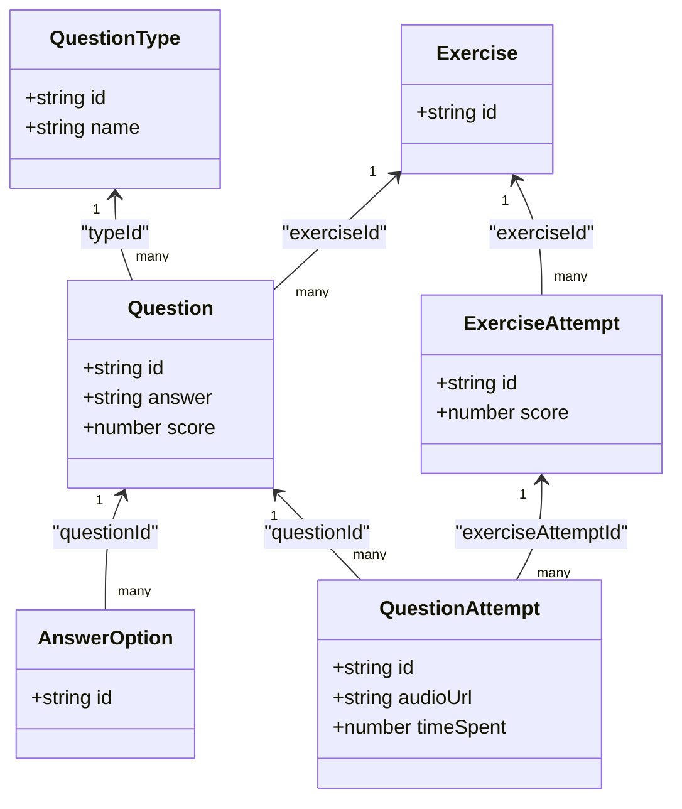

**Diagram sources**
- [schema.prisma:201-453](file://english_pronunciation_app/frontend/prisma/schema.prisma#L201-L453)

**Section sources**
- [schema.prisma:201-453](file://english_pronunciation_app/frontend/prisma/schema.prisma#L201-L453)

### Gamification Metrics and Daily Activity
- Entities
  - DailyActivity: id, userId, date, xpEarned, completedExercises, checkIns, timestamps; unique per user-date.
  - Leaderboard: id, userId, score, correctAnswers, completedExercises, type, period, updatedAt; unique per user-type-period.
  - DailyQuest: id, userId, date, questType, target, progress, completed, rewardXp, rewardGems, claimedAt, timestamps.
  - UserBadge: id, userId, badgeId, earnedAt, validPeriod; unique per user-badge.
  - Badge: id, name, description, image, condition, type.
- Relationships
  - User to DailyActivity, Leaderboard, DailyQuest, UserBadge.
  - Badge to UserBadge.
- Constraints and indexes
  - Unique composite keys for leaderboard and daily quest.
  - Indexes on type/period/score for leaderboards.

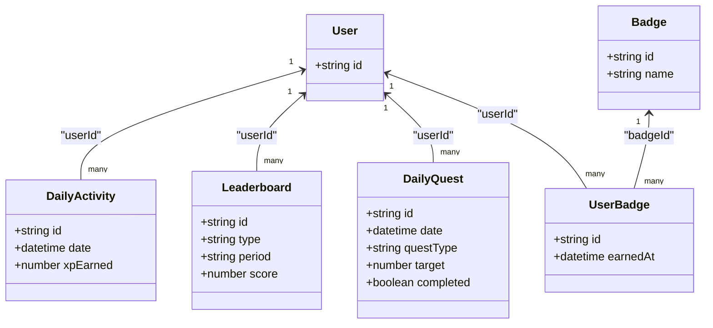

**Diagram sources**
- [schema.prisma:459-501](file://english_pronunciation_app/frontend/prisma/schema.prisma#L459-L501)

**Section sources**
- [schema.prisma:459-501](file://english_pronunciation_app/frontend/prisma/schema.prisma#L459-L501)

### Data Access Patterns Using Prisma ORM
- Singleton PrismaClient
  - The application initializes a singleton PrismaClient with logging enabled for diagnostics.
- Query patterns
  - Upserts for idempotent seeding (roles, users, content).
  - Find-first/upsert for content reconciliation (e.g., WordItem audio updates).
  - Aggregation and grouping for leaderboard and progress reporting.
  - Batch operations for cleanup and regeneration (e.g., TRUNCATE tables, regenerate listen-choose questions).

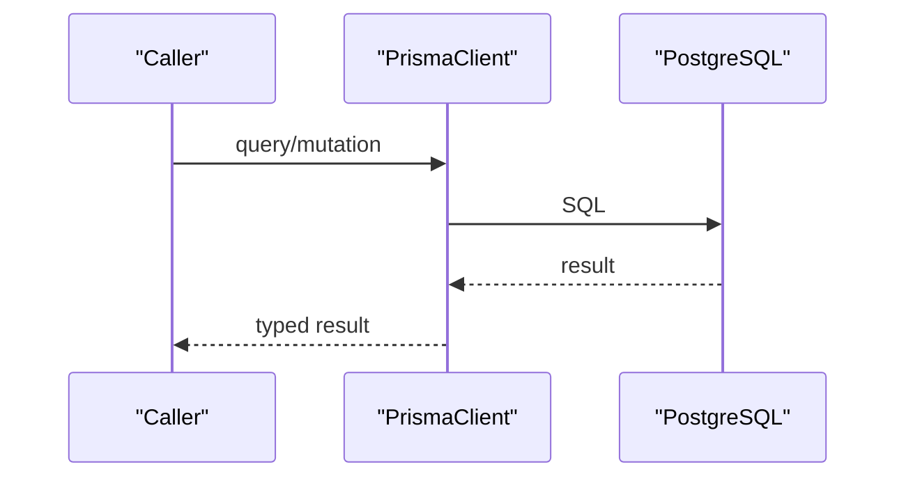

**Diagram sources**
- [prisma.ts:1-13](file://english_pronunciation_app/frontend/src/lib/prisma.ts#L1-L13)

**Section sources**
- [prisma.ts:1-13](file://english_pronunciation_app/frontend/src/lib/prisma.ts#L1-L13)

### Data Lifecycle Management and Migration Strategies
- Cleanup and Reset
  - db_cleanup.ts truncates all tables in the public schema with cascade and restart identity, preserving schema structure.
- Seed Pipelines
  - seed_lessons.ts seeds question types, topics, phonemes, sound groups, content, question bank, learning maps, exercises, and questions.
  - seed_audio_local.ts downloads audio locally and updates WordItem records.
  - seed_listen_choose.ts regenerates listen-choose questions without re-fetching audio.
  - seed_subcategory.ts updates subcategory metadata on existing content.
  - seed_demo_user.ts creates roles and a demo user.
  - seed_demo_data.ts generates demo users, leaderboard entries, exercise attempts, and daily activity.
- Versioning and Evolution
  - The Prisma schema defines the canonical model; migrations are applied via Prisma CLI.
  - Seed scripts ensure deterministic content population and idempotency.

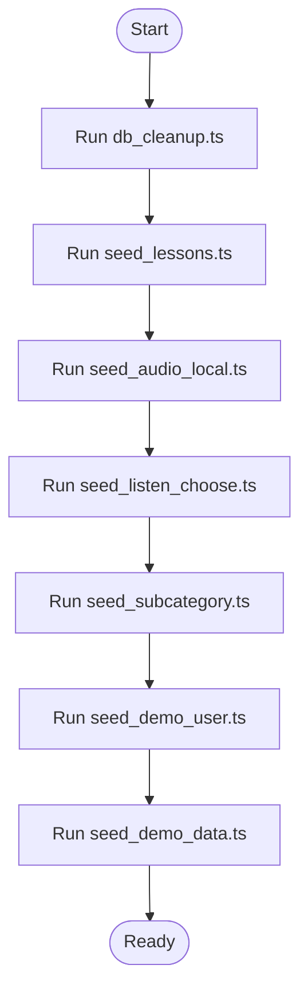

**Diagram sources**
- [db_cleanup.ts:1-99](file://english_pronunciation_app/frontend/prisma/db_cleanup.ts#L1-L99)
- [seed_lessons.ts:1-1314](file://english_pronunciation_app/frontend/prisma/seed_lessons.ts#L1-L1314)
- [seed_audio_local.ts:1-147](file://english_pronunciation_app/frontend/prisma/seed_audio_local.ts#L1-L147)
- [seed_listen_choose.ts:1-143](file://english_pronunciation_app/frontend/prisma/seed_listen_choose.ts#L1-L143)
- [seed_subcategory.ts:1-70](file://english_pronunciation_app/frontend/prisma/seed_subcategory.ts#L1-L70)
- [seed_demo_user.ts:1-85](file://english_pronunciation_app/frontend/prisma/seed_demo_user.ts#L1-L85)
- [seed_demo_data.ts:1-160](file://english_pronunciation_app/frontend/prisma/seed_demo_data.ts#L1-L160)

**Section sources**
- [db_cleanup.ts:1-99](file://english_pronunciation_app/frontend/prisma/db_cleanup.ts#L1-L99)
- [seed_lessons.ts:1-1314](file://english_pronunciation_app/frontend/prisma/seed_lessons.ts#L1-L1314)
- [seed_audio_local.ts:1-147](file://english_pronunciation_app/frontend/prisma/seed_audio_local.ts#L1-L147)
- [seed_listen_choose.ts:1-143](file://english_pronunciation_app/frontend/prisma/seed_listen_choose.ts#L1-L143)
- [seed_subcategory.ts:1-70](file://english_pronunciation_app/frontend/prisma/seed_subcategory.ts#L1-L70)
- [seed_demo_user.ts:1-85](file://english_pronunciation_app/frontend/prisma/seed_demo_user.ts#L1-L85)
- [seed_demo_data.ts:1-160](file://english_pronunciation_app/frontend/prisma/seed_demo_data.ts#L1-L160)

### Content Generation and Validation Rules
- Lesson Catalog and Content
  - lesson-catalog.ts defines topics, sound groups, and exercise modes.
  - lesson-content.ts provides curated content datasets for each sound group, including words, minimal pairs, and sentences with difficulty, status, and source metadata.
- Listen-Choose Builder
  - listen-choose-builder.ts builds 3-stage questions with skeleton generation, contrast phoneme selection, and pooling logic.
- Validation and Business Rules
  - ACTIVE status requires valid audio for listen-choose content.
  - Minimal pairs require both words to be ACTIVE.
  - QuestionBankItem links content to question types and supports accepted answers for advanced modes.

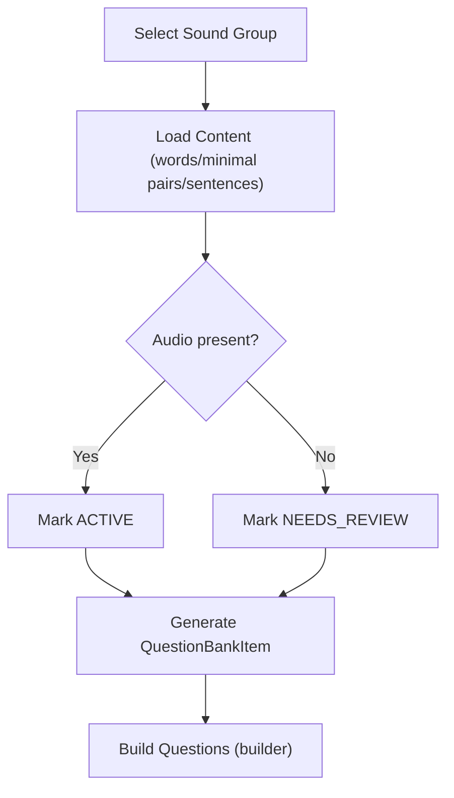

**Diagram sources**
- [lesson-catalog.ts:1-288](file://english_pronunciation_app/frontend/prisma/lesson-catalog.ts#L1-L288)
- [lesson-content.ts:1-1659](file://english_pronunciation_app/frontend/prisma/lesson-content.ts#L1-L1659)
- [listen-choose-builder.ts:1-134](file://english_pronunciation_app/frontend/prisma/listen-choose-builder.ts#L1-L134)

**Section sources**
- [lesson-catalog.ts:1-288](file://english_pronunciation_app/frontend/prisma/lesson-catalog.ts#L1-L288)
- [lesson-content.ts:1-1659](file://english_pronunciation_app/frontend/prisma/lesson-content.ts#L1-L1659)
- [listen-choose-builder.ts:1-134](file://english_pronunciation_app/frontend/prisma/listen-choose-builder.ts#L1-L134)

## Dependency Analysis
The following diagram highlights module-level dependencies among seed scripts and shared data catalogs.

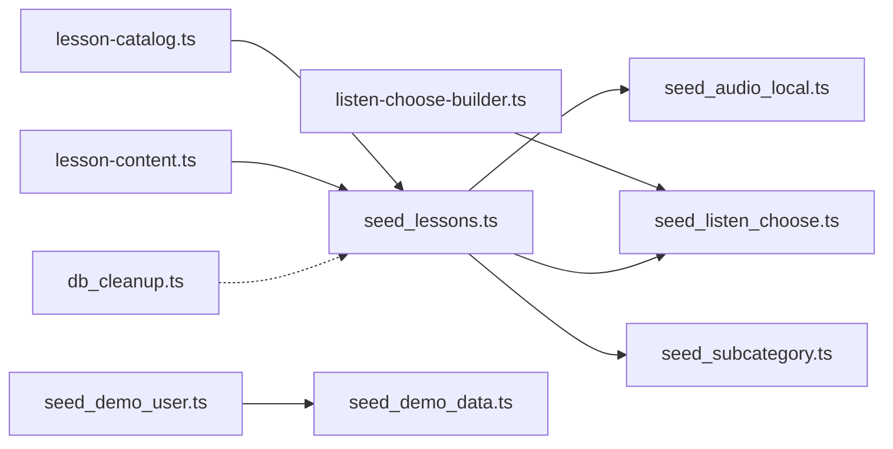

**Diagram sources**
- [lesson-catalog.ts:1-288](file://english_pronunciation_app/frontend/prisma/lesson-catalog.ts#L1-L288)
- [lesson-content.ts:1-1659](file://english_pronunciation_app/frontend/prisma/lesson-content.ts#L1-L1659)
- [listen-choose-builder.ts:1-134](file://english_pronunciation_app/frontend/prisma/listen-choose-builder.ts#L1-L134)
- [db_cleanup.ts:1-99](file://english_pronunciation_app/frontend/prisma/db_cleanup.ts#L1-L99)
- [seed_lessons.ts:1-1314](file://english_pronunciation_app/frontend/prisma/seed_lessons.ts#L1-L1314)
- [seed_audio_local.ts:1-147](file://english_pronunciation_app/frontend/prisma/seed_audio_local.ts#L1-L147)
- [seed_listen_choose.ts:1-143](file://english_pronunciation_app/frontend/prisma/seed_listen_choose.ts#L1-L143)
- [seed_subcategory.ts:1-70](file://english_pronunciation_app/frontend/prisma/seed_subcategory.ts#L1-L70)
- [seed_demo_user.ts:1-85](file://english_pronunciation_app/frontend/prisma/seed_demo_user.ts#L1-L85)
- [seed_demo_data.ts:1-160](file://english_pronunciation_app/frontend/prisma/seed_demo_data.ts#L1-L160)

**Section sources**
- [lesson-catalog.ts:1-288](file://english_pronunciation_app/frontend/prisma/lesson-catalog.ts#L1-L288)
- [lesson-content.ts:1-1659](file://english_pronunciation_app/frontend/prisma/lesson-content.ts#L1-L1659)
- [listen-choose-builder.ts:1-134](file://english_pronunciation_app/frontend/prisma/listen-choose-builder.ts#L1-L134)
- [db_cleanup.ts:1-99](file://english_pronunciation_app/frontend/prisma/db_cleanup.ts#L1-L99)
- [seed_lessons.ts:1-1314](file://english_pronunciation_app/frontend/prisma/seed_lessons.ts#L1-L1314)
- [seed_audio_local.ts:1-147](file://english_pronunciation_app/frontend/prisma/seed_audio_local.ts#L1-L147)
- [seed_listen_choose.ts:1-143](file://english_pronunciation_app/frontend/prisma/seed_listen_choose.ts#L1-L143)
- [seed_subcategory.ts:1-70](file://english_pronunciation_app/frontend/prisma/seed_subcategory.ts#L1-L70)
- [seed_demo_user.ts:1-85](file://english_pronunciation_app/frontend/prisma/seed_demo_user.ts#L1-L85)
- [seed_demo_data.ts:1-160](file://english_pronunciation_app/frontend/prisma/seed_demo_data.ts#L1-L160)

## Performance Considerations
- Indexes
  - Ensure efficient lookups on frequently filtered columns (e.g., user/date for daily activity, type/period/score for leaderboards).
- Queries
  - Prefer selective projections (select) to reduce payload sizes.
  - Use pagination for leaderboard and content listings.
- Writes
  - Batch operations for bulk inserts (e.g., seeders) to minimize round-trips.
- Caching
  - Consider caching frequently accessed content (e.g., question templates) in memory during generation phases.
- Logging
  - Enable Prisma query logs in development to identify slow queries.

## Troubleshooting Guide
- Common Issues
  - Missing user during submission: ensure demo user is seeded after cleanup.
  - Inconsistent audio: verify WordItem status and audio URL after running seed_audio_local.
  - Empty listen-choose pools: confirm contrast phonemes and neighbor groups; regenerate questions if needed.
- Diagnostic Steps
  - Verify database connectivity via PrismaClient initialization.
  - Confirm seed script execution order and idempotency.
  - Inspect logs for Prisma query warnings and errors.

**Section sources**
- [seed_demo_user.ts:1-85](file://english_pronunciation_app/frontend/prisma/seed_demo_user.ts#L1-L85)
- [seed_audio_local.ts:1-147](file://english_pronunciation_app/frontend/prisma/seed_audio_local.ts#L1-L147)
- [seed_listen_choose.ts:1-143](file://english_pronunciation_app/frontend/prisma/seed_listen_choose.ts#L1-L143)
- [prisma.ts:1-13](file://english_pronunciation_app/frontend/src/lib/prisma.ts#L1-L13)

## Conclusion
The database design centers on a robust, normalized schema with clear relationships between users, exercises, pronunciation content, and gamification metrics. Prisma ORM provides a type-safe interface for data access, while seed scripts ensure reproducible content and user setups. Proper indexing, referential integrity, and well-defined constraints support reliable operation and scalability.

## Appendices

### Appendix A: Entity Relationship Diagram (ER)
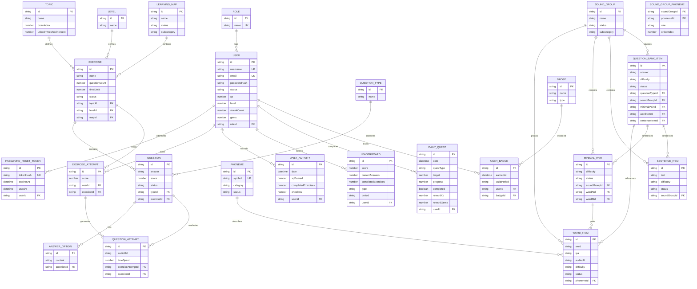

**Diagram sources**
- [schema.prisma:1-501](file://english_pronunciation_app/frontend/prisma/schema.prisma#L1-L501)

### Appendix B: Sample Data Structures
- User
  - Fields: id, username, email, passwordHash, status, profile fields, gamification fields, timestamps.
- Exercise
  - Fields: id, name, questionCount, timeLimit, status, topicId, levelId, mapId.
- Question
  - Fields: id, name, content, status, score, answer, acceptedAnswers, typeId, exerciseId.
- WordItem
  - Fields: id, word, ipa, audioUrl, audioSource, sourceType, difficulty, status, phonemeId.
- MinimalPair
  - Fields: id, note, difficulty, status, soundGroupId, wordAId, wordBId.
- SentenceItem
  - Fields: id, text, targetWords, difficulty, status, soundGroupId.
- QuestionBankItem
  - Fields: id, prompt, contentJson, answer, acceptedAnswers, score, difficulty, status, questionTypeId, soundGroupId, minimalPairId, wordItemId, sentenceItemId.
- DailyActivity
  - Fields: id, userId, date, xpEarned, completedExercises, checkIns, timestamps.
- Leaderboard
  - Fields: id, userId, score, correctAnswers, completedExercises, type, period, updatedAt.
- DailyQuest
  - Fields: id, userId, date, questType, target, progress, completed, rewardXp, rewardGems, claimedAt, timestamps.
- UserBadge
  - Fields: id, userId, badgeId, earnedAt, validPeriod.

**Section sources**
- [schema.prisma:14-501](file://english_pronunciation_app/frontend/prisma/schema.prisma#L14-L501)