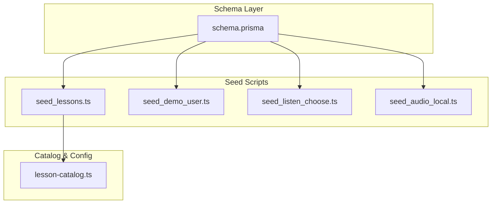
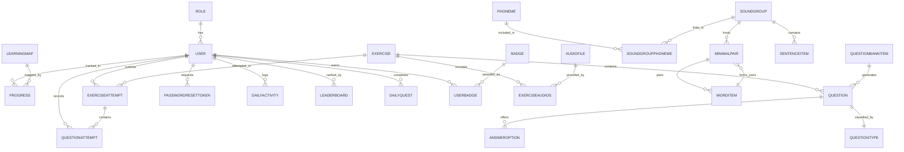
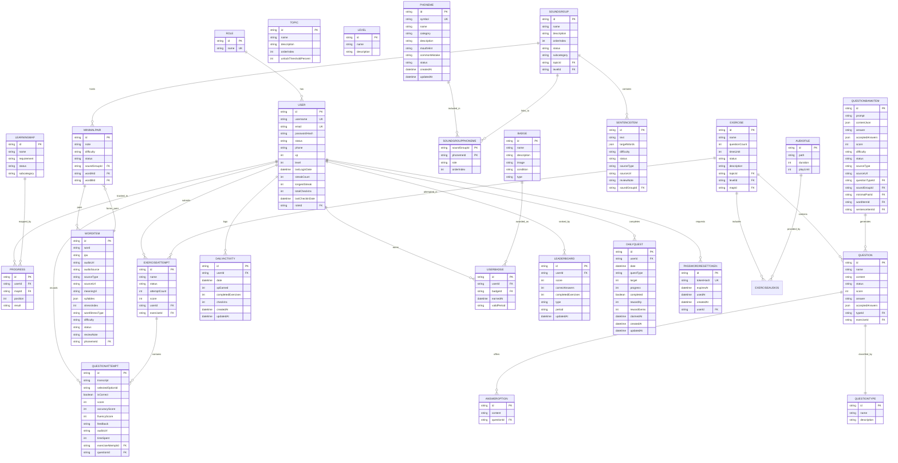
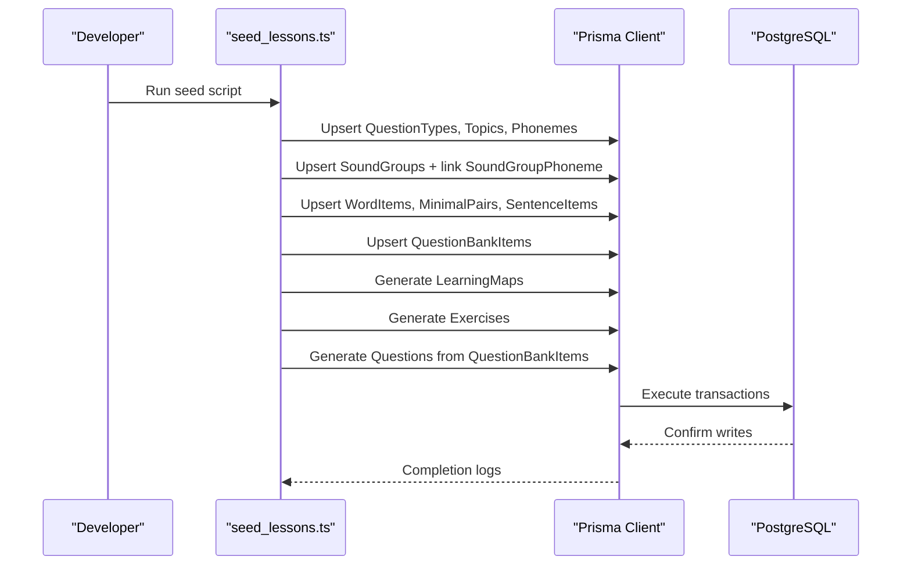
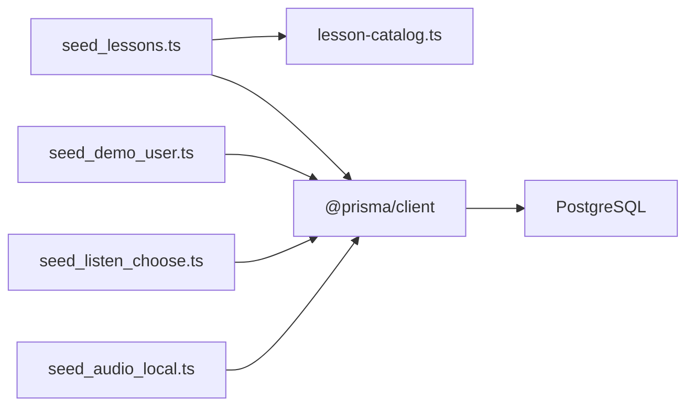

# Prisma Schema and Data Models

<cite>
**Referenced Files in This Document**
- [schema.prisma](file://english_pronunciation_app/frontend/prisma/schema.prisma)
- [seed_lessons.ts](file://english_pronunciation_app/frontend/prisma/seed_lessons.ts)
- [seed_demo_user.ts](file://english_pronunciation_app/frontend/prisma/seed_demo_user.ts)
- [seed_listen_choose.ts](file://english_pronunciation_app/frontend/prisma/seed_listen_choose.ts)
- [seed_audio_local.ts](file://english_pronunciation_app/frontend/prisma/seed_audio_local.ts)
- [lesson-catalog.ts](file://english_pronunciation_app/frontend/prisma/lesson-catalog.ts)
- [postgresql_expert SKILL.md](file://english_pronunciation_app/.agents/skills/postgresql_expert/SKILL.md)
- [CURRENT_PROJECT_CONTEXT.md](file://docs/superpowers/plans/2026-06-18-sp1-cleanup-plan-and-orphan-code.md)
</cite>

## Table of Contents
1. [Introduction](#introduction)
2. [Project Structure](#project-structure)
3. [Core Components](#core-components)
4. [Architecture Overview](#architecture-overview)
5. [Detailed Component Analysis](#detailed-component-analysis)
6. [Dependency Analysis](#dependency-analysis)
7. [Performance Considerations](#performance-considerations)
8. [Troubleshooting Guide](#troubleshooting-guide)
9. [Conclusion](#conclusion)

## Introduction
This document provides comprehensive documentation for the Prisma schema and data models used in the English pronunciation learning application. It covers entity definitions, field types, constraints, defaults, validation rules, indexes, relations, and gamification features. It also explains UUID generation, timestamps, and how the schema supports the lesson system, content generation, and user progress tracking.

## Project Structure
The Prisma schema is defined centrally and complemented by seed scripts that populate the database with realistic content. The schema targets a PostgreSQL provider and uses Prisma Client for type-safe database access.

**Diagram sources**
- [schema.prisma](file://english_pronunciation_app/frontend/prisma/schema.prisma)
- [seed_lessons.ts](file://english_pronunciation_app/frontend/prisma/seed_lessons.ts)
- [seed_demo_user.ts](file://english_pronunciation_app/frontend/prisma/seed_demo_user.ts)
- [seed_listen_choose.ts](file://english_pronunciation_app/frontend/prisma/seed_listen_choose.ts)
- [seed_audio_local.ts](file://english_pronunciation_app/frontend/prisma/seed_audio_local.ts)
- [lesson-catalog.ts](file://english_pronunciation_app/frontend/prisma/lesson-catalog.ts)

**Section sources**
- [schema.prisma](file://english_pronunciation_app/frontend/prisma/schema.prisma)
- [seed_lessons.ts](file://english_pronunciation_app/frontend/prisma/seed_lessons.ts)
- [seed_demo_user.ts](file://english_pronunciation_app/frontend/prisma/seed_demo_user.ts)
- [seed_listen_choose.ts](file://english_pronunciation_app/frontend/prisma/seed_listen_choose.ts)
- [seed_audio_local.ts](file://english_pronunciation_app/frontend/prisma/seed_audio_local.ts)
- [lesson-catalog.ts](file://english_pronunciation_app/frontend/prisma/lesson-catalog.ts)

## Core Components
This section summarizes the principal models and their roles in the system.

- Identity and Access
  - Role: Defines user roles (e.g., User, Admin).
  - User: Stores user profile, authentication hash, status, and gamification metrics.

- Learning and Progress
  - LearningMap: Represents curated learning paths.
  - Progress: Tracks user positions and outcomes per learning map.
  - Topic and Level: Organize content by thematic categories and difficulty.
  - Exercise and Question: Define assessment items and question content.
  - AnswerOption: Provides multiple-choice options for questions.

- Content and Phonetics
  - Phoneme: IPA symbols and categorization.
  - SoundGroup: Groupings of phonemes with optional topic/level linkage.
  - SoundGroupPhoneme: Many-to-many bridge with ordering and roles.
  - WordItem, MinimalPair, SentenceItem: Content items supporting exercises.
  - QuestionBankItem: Canonical question templates backing generated questions.

- Results and Activities
  - ExerciseAttempt and QuestionAttempt: Capture user attempts and scores.
  - DailyActivity: Tracks daily XP, completed exercises, and check-ins.

- Gamification
  - Badge and UserBadge: Achievement records.
  - Leaderboard: Periodic rankings by type and period.
  - DailyQuest: Personalized daily goals with rewards.

- Auxiliary
  - PasswordResetToken: Secure password reset lifecycle.
  - AudioFile: Centralized audio metadata for exercises.

**Section sources**
- [schema.prisma](file://english_pronunciation_app/frontend/prisma/schema.prisma)

## Architecture Overview
The schema enforces referential integrity via explicit relations and indexes. UUIDs are used as primary keys, and timestamps are managed via Prisma directives. Unique constraints ensure data integrity for usernames, emails, and composite keys. The design supports:
- One-to-many relations (e.g., User to Progress, Exercise to Question).
- Many-to-many via dedicated join tables (e.g., SoundGroup ↔ Phoneme).
- Composite unique constraints for meaningful business keys (e.g., user+map, user+date+questType).
- Indexes optimized for frequent queries (e.g., user+date on DailyActivity).

**Diagram sources**
- [schema.prisma](file://english_pronunciation_app/frontend/prisma/schema.prisma)

## Detailed Component Analysis

### Identity and Access Models
- Role
  - Fields: id (UUID), name (unique), users (relation).
  - Constraints: @id, @default(uuid), @unique(name).
- User
  - Fields: id (UUID), username (unique), email (unique), passwordHash, status, phone, plus gamification fields (xp, level, streaks, check-in dates), plus role relation and numerous relations to progress, attempts, activities, badges, leaderboards, and quests.
  - Constraints: @id, @default(uuid), @unique(username, email), @default(status="ACTIVE"), timestamps via @default(now()), @updatedAt.

Validation and defaults:
- Status uses an enumerated-like string with a sensible default.
- Timestamps are auto-managed for creation and updates.

Indexes:
- None explicitly declared; however, unique constraints imply indexes.

Relations:
- role: belongs to Role via roleId.

**Section sources**
- [schema.prisma](file://english_pronunciation_app/frontend/prisma/schema.prisma)

### Learning and Progress Models
- LearningMap
  - Fields: id (UUID), name, requirement, status, subcategory.
  - Relations: exercises, progresses.
  - Constraints: @id, @default(uuid), @default(status="ACTIVE").
  - Indexes: @@index([topicId]), @@index([levelId]), @@index([status, orderIndex]).
- Progress
  - Fields: id (UUID), userId, mapId, position, result.
  - Relations: user, map.
  - Constraints: @@id([userId, mapId]) via @@unique([userId, mapId]).

- Topic and Level
  - Topic: id, name, description, orderIndex, unlockThresholdPercent; relations to exercises and sound groups.
  - Level: id, name, description; relations to exercises and sound groups.

- Exercise and Question
  - Exercise: id, name, questionCount, timeLimit, status, description; belongs to Topic, Level, LearningMap; relations to questions, attempts, audios.
  - Question: id, name, content, status, score, answer, acceptedAnswers (JSON), belongs to QuestionType and Exercise; relations to options and attempts.
  - AnswerOption: id, content, belongs to Question.

Constraints and defaults:
- Defaults for counts and scores; status defaults to ACTIVE.
- acceptedAnswers enables flexible answer validation for advanced modes.

Indexes:
- @@index([questionTypeId]) on QuestionBankItem.
- @@index([soundGroupId]) on QuestionBankItem.

**Section sources**
- [schema.prisma](file://english_pronunciation_app/frontend/prisma/schema.prisma)

### Content and Phonetics Models
- Phoneme
  - Fields: id (UUID), symbol (unique), name, category, description, mouthHint, commonMistake, status, createdAt, updatedAt.
  - Relations: soundGroups (via SoundGroupPhoneme), wordItems.
  - Indexes: @@index([category, status]).

- SoundGroup
  - Fields: id (UUID), name, description, orderIndex, status, subcategory, createdAt, updatedAt; optional topicId and levelId.
  - Relations: topic, level, phonemes (via SoundGroupPhoneme), minimalPairs, sentenceItems, questionBankItems.
  - Indexes: @@index([topicId]), @@index([levelId]), @@index([status, orderIndex]).

- SoundGroupPhoneme (join table)
  - Fields: soundGroupId, phonemeId, role, orderIndex.
  - Relations: SoundGroup, Phoneme.
  - Constraints: @@id([soundGroupId, phonemeId]), @@index([phonemeId]), @@index([soundGroupId, orderIndex]).

- WordItem
  - Fields: id (UUID), word, ipa, audioUrl, audioSource, sourceType, sourceUrl, meaningVi, syllables (JSON), stressIndex, wordStressType, difficulty, status, reviewNote, createdBy, reviewedAt, createdAt, updatedAt; belongs to Phoneme.
  - Unique: @@unique([word, ipa, phonemeId]).
  - Indexes: @@index([phonemeId]), @@index([status, difficulty]), @@index([audioSource]).

- MinimalPair
  - Fields: id (UUID), note, difficulty, status, createdAt, updatedAt; belongs to SoundGroup and two WordItems.
  - Unique: @@unique([soundGroupId, wordAId, wordBId]).
  - Indexes: @@index([soundGroupId]), @@index([status, difficulty]), @@index([wordAId]), @@index([wordBId]).

- SentenceItem
  - Fields: id (UUID), text, targetWords (JSON), difficulty, status, sourceType, sourceUrl, reviewNote, createdAt, updatedAt; belongs to SoundGroup.
  - Indexes: @@index([soundGroupId]), @@index([status, difficulty]), @@index([sourceType]).

- QuestionBankItem
  - Fields: id (UUID), prompt, contentJson (JSON), answer, acceptedAnswers (JSON), score, difficulty, status, sourceType, sourceUrl, reviewNote, createdAt, updatedAt; belongs to QuestionType, optionally SoundGroup, MinimalPair, WordItem, SentenceItem.
  - Indexes: @@index([questionTypeId]), @@index([soundGroupId]), @@index([minimalPairId]), @@index([wordItemId]), @@index([sentenceItemId]), @@index([status, difficulty]), @@index([sourceType]).

**Section sources**
- [schema.prisma](file://english_pronunciation_app/frontend/prisma/schema.prisma)

### Results and Activities Models
- ExerciseAttempt
  - Fields: id (UUID), name, status, attemptCount, score; belongs to User and Exercise; relation to QuestionAttempt.
  - Defaults: @default(status="COMPLETED"), @default(attemptCount=1), @default(score=0).
- QuestionAttempt
  - Fields: id (UUID), transcript, selectedOptionId, isCorrect, score, accuracyScore, fluencyScore, feedback, audioUrl, timeSpent, createdAt; belongs to ExerciseAttempt and Question.
  - Defaults: @default(isCorrect=false), @default(score=0).

- DailyActivity
  - Fields: id (UUID), userId, date, xpEarned, completedExercises, checkIns, createdAt, updatedAt; belongs to User.
  - Unique: @@unique([userId, date]); Index: @@index([date]).

**Section sources**
- [schema.prisma](file://english_pronunciation_app/frontend/prisma/schema.prisma)

### Gamification Models
- Badge
  - Fields: id (UUID), name, description, image, condition, type; relation to UserBadge.
- UserBadge
  - Fields: id (UUID), userId, badgeId, earnedAt, validPeriod; belongs to User and Badge.
  - Unique: @@unique([userId, badgeId]).

- Leaderboard
  - Fields: id (UUID), userId, score, correctAnswers, completedExercises, type, period, updatedAt; belongs to User.
  - Unique: @@unique([userId, type, period]); Index: @@index([type, period, score]).

- DailyQuest
  - Fields: id (UUID), userId, date, questType, target, progress, completed, rewardXp, rewardGems, claimedAt, createdAt, updatedAt; belongs to User.
  - Unique: @@unique([userId, date, questType]); Index: @@index([userId, date]).

**Section sources**
- [schema.prisma](file://english_pronunciation_app/frontend/prisma/schema.prisma)

### Auxiliary Models
- PasswordResetToken
  - Fields: id (UUID), tokenHash (unique), expiresAt, usedAt, createdAt; belongs to User.
  - Unique: @@unique([tokenHash]); Indexes: @@index([userId]), @@index([expiresAt]).
- AudioFile
  - Fields: id (UUID), path, duration, playLimit; relation to Exercise via named relation "ExerciseAudios".

**Section sources**
- [schema.prisma](file://english_pronunciation_app/frontend/prisma/schema.prisma)

### Prisma Model Syntax and Schema Features
- Provider and Client Generation
  - Provider: PostgreSQL.
  - Client: Prisma Client JS.
- UUID Strategy
  - All @id fields use @default(uuid()) for deterministic primary keys.
- Timestamps
  - createdAt: @default(now()) on most models.
  - updatedAt: @updatedAt on models with mutable state.
- Soft Delete Pattern
  - Not present in the schema; however, a PostgreSQL expert skill guide outlines a standard soft-delete pattern using a deleted_at column and triggers for updated_at.
- Unique Constraints
  - Examples: Role.name, User.username, User.email, PasswordResetToken.tokenHash, composite keys for Progress, DailyActivity, DailyQuest, Leaderboard, SoundGroupPhoneme, WordItem, MinimalPair.
- Indexes
  - Explicit @@index declarations appear on foreign keys and frequently queried columns to optimize joins and lookups.

**Section sources**
- [schema.prisma](file://english_pronunciation_app/frontend/prisma/schema.prisma)
- [postgresql_expert SKILL.md](file://english_pronunciation_app/.agents/skills/postgresql_expert/SKILL.md)

### Entity Relationship Diagram (ERD)
This diagram consolidates the schema’s entities and relationships, highlighting foreign keys and cardinalities.

**Diagram sources**
- [schema.prisma](file://english_pronunciation_app/frontend/prisma/schema.prisma)

### Data Flow and Seed Scripts
The seed pipeline orchestrates schema-driven content generation:
- seed_lessons.ts: Seeds QuestionTypes, Topics, Phonemes, SoundGroups, WordItems, MinimalPairs, SentenceItems, QuestionBankItems, generates LearningMaps and Exercises, then creates Questions from QuestionBankItems.
- seed_demo_user.ts: Creates default Roles and a demo User for authentication flows after cleanup.
- seed_listen_choose.ts: Regenerates listen_choose questions for CĐ1-3 using existing WordItem audio URLs.
- seed_audio_local.ts: Downloads audio from external APIs to local storage and updates WordItem entries accordingly.

**Diagram sources**
- [seed_lessons.ts](file://english_pronunciation_app/frontend/prisma/seed_lessons.ts)
- [schema.prisma](file://english_pronunciation_app/frontend/prisma/schema.prisma)

**Section sources**
- [seed_lessons.ts](file://english_pronunciation_app/frontend/prisma/seed_lessons.ts)
- [seed_demo_user.ts](file://english_pronunciation_app/frontend/prisma/seed_demo_user.ts)
- [seed_listen_choose.ts](file://english_pronunciation_app/frontend/prisma/seed_listen_choose.ts)
- [seed_audio_local.ts](file://english_pronunciation_app/frontend/prisma/seed_audio_local.ts)
- [lesson-catalog.ts](file://english_pronunciation_app/frontend/prisma/lesson-catalog.ts)

## Dependency Analysis
- Internal Dependencies
  - seed_lessons.ts depends on lesson-catalog.ts for structured content definitions.
  - All seed scripts depend on Prisma Client for database operations.
- External Dependencies
  - PostgreSQL provider URL sourced from environment variables.
  - Audio fetching relies on external dictionary API during seeding.

**Diagram sources**
- [seed_lessons.ts](file://english_pronunciation_app/frontend/prisma/seed_lessons.ts)
- [seed_demo_user.ts](file://english_pronunciation_app/frontend/prisma/seed_demo_user.ts)
- [seed_listen_choose.ts](file://english_pronunciation_app/frontend/prisma/seed_listen_choose.ts)
- [seed_audio_local.ts](file://english_pronunciation_app/frontend/prisma/seed_audio_local.ts)
- [lesson-catalog.ts](file://english_pronunciation_app/frontend/prisma/lesson-catalog.ts)
- [schema.prisma](file://english_pronunciation_app/frontend/prisma/schema.prisma)

**Section sources**
- [seed_lessons.ts](file://english_pronunciation_app/frontend/prisma/seed_lessons.ts)
- [seed_demo_user.ts](file://english_pronunciation_app/frontend/prisma/seed_demo_user.ts)
- [seed_listen_choose.ts](file://english_pronunciation_app/frontend/prisma/seed_listen_choose.ts)
- [seed_audio_local.ts](file://english_pronunciation_app/frontend/prisma/seed_audio_local.ts)
- [lesson-catalog.ts](file://english_pronunciation_app/frontend/prisma/lesson-catalog.ts)
- [schema.prisma](file://english_pronunciation_app/frontend/prisma/schema.prisma)

## Performance Considerations
- Indexes
  - Foreign key indexes and composite indexes improve join performance and lookup speed.
- JSON Columns
  - JSON fields (e.g., contentJson, syllables) support flexible content but require careful indexing and query planning.
- UUIDs
  - While UUIDs offer distributed key generation, ensure appropriate indexing and consider partitioning strategies for very large datasets.
- Transactions
  - Use Prisma transactions for multi-table updates to maintain consistency and reduce overhead.

[No sources needed since this section provides general guidance]

## Troubleshooting Guide
Common issues and resolutions:
- Validation Failures
  - Use Prisma validation to confirm schema correctness before generating clients or pushing to the database.
- Seed Conflicts
  - Seed scripts use upserts; ensure environment variables (e.g., DATABASE_URL) are set correctly and that the database is reachable.
- Audio Fetch Failures
  - External API failures during seed_audio_local.ts lead to NEEDS_REVIEW status; re-run the script to retry.
- Authentication After Cleanup
  - After database cleanup, seed_demo_user.ts ensures a demo user exists for login flows.

**Section sources**
- [schema.prisma](file://english_pronunciation_app/frontend/prisma/schema.prisma)
- [seed_demo_user.ts](file://english_pronunciation_app/frontend/prisma/seed_demo_user.ts)
- [seed_audio_local.ts](file://english_pronunciation_app/frontend/prisma/seed_audio_local.ts)
- [CURRENT_PROJECT_CONTEXT.md](file://docs/superpowers/plans/2026-06-18-sp1-cleanup-plan-and-orphan-code.md)

## Conclusion
The Prisma schema defines a robust, normalized data model tailored to an English pronunciation learning platform. It integrates phonetic content, structured exercises, user progress tracking, and gamification features. UUIDs, timestamps, unique constraints, and indexes collectively ensure data integrity and query performance. The seed scripts automate realistic content population, while the ERD and indexes illustrate clear relationships and optimization strategies.