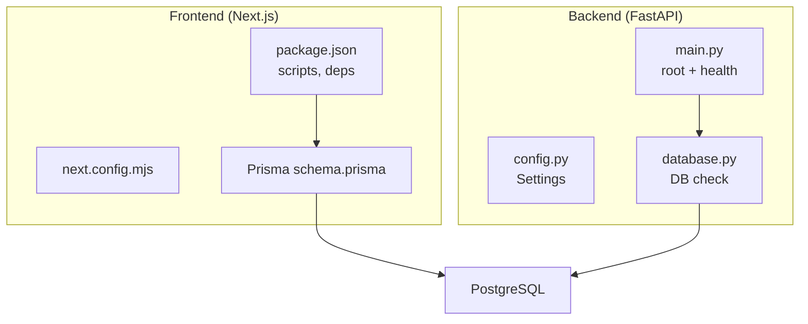
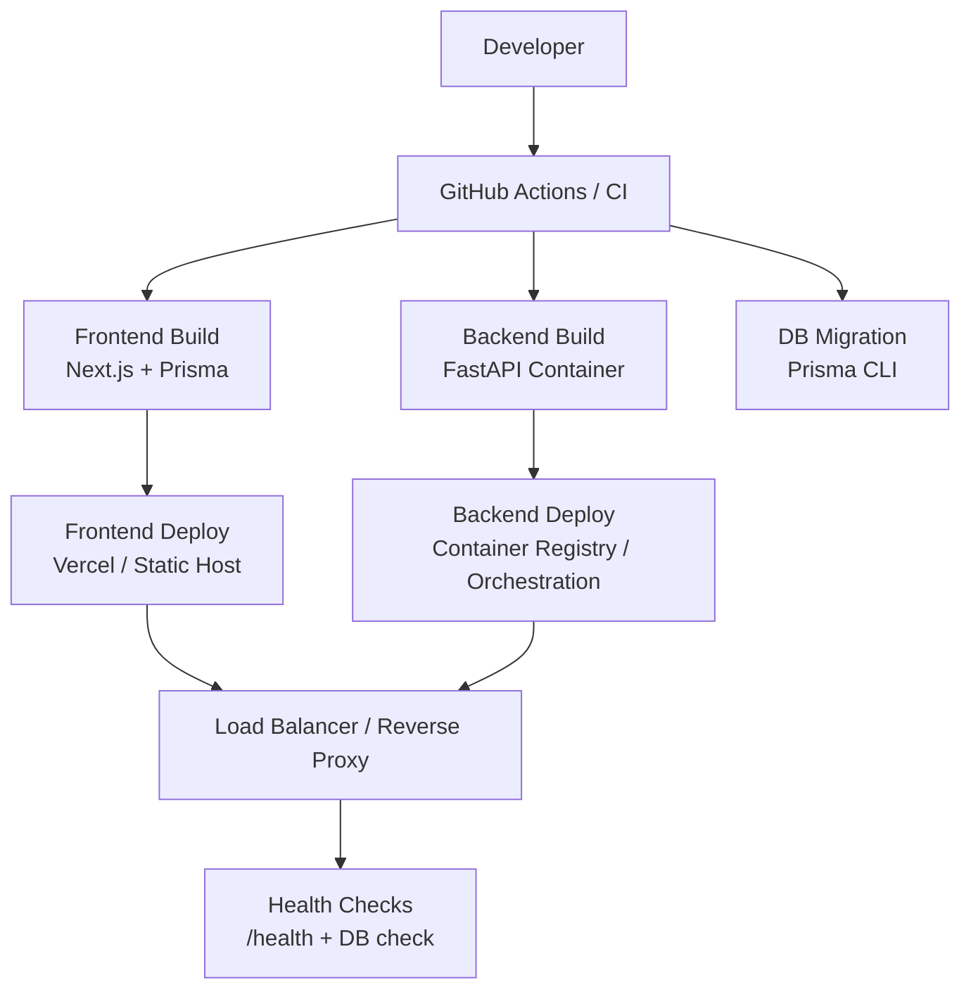
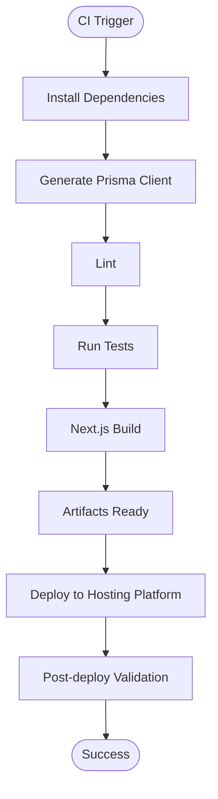
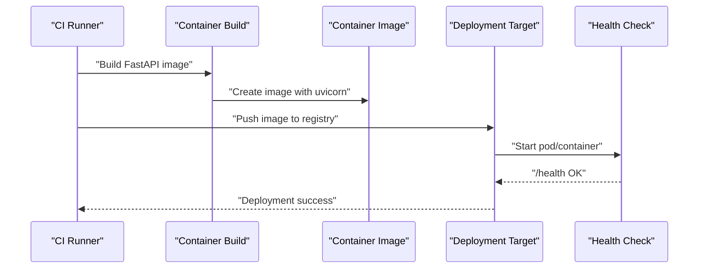
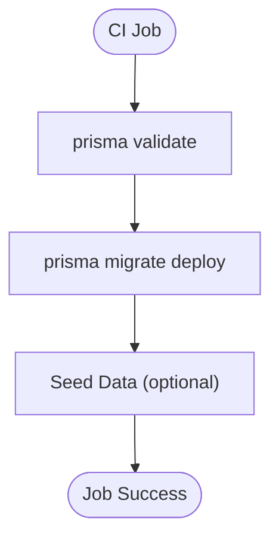
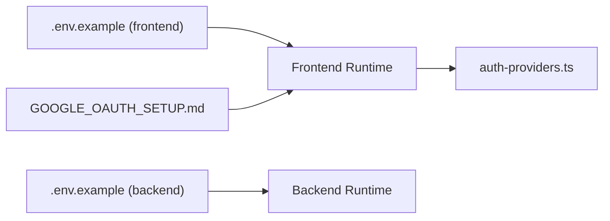
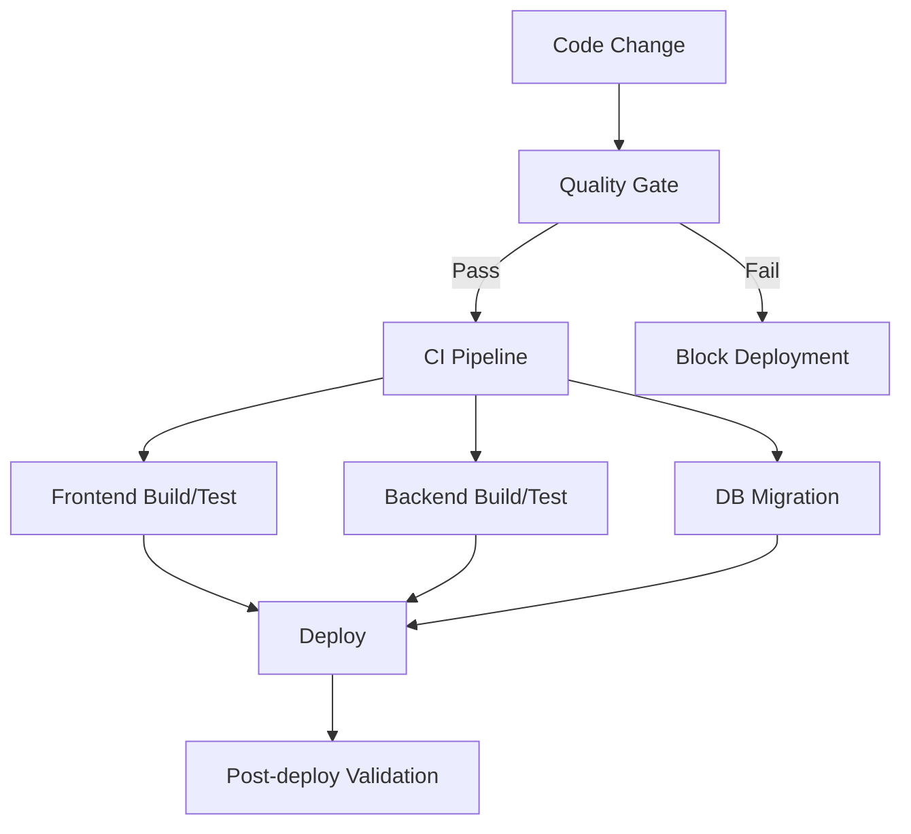
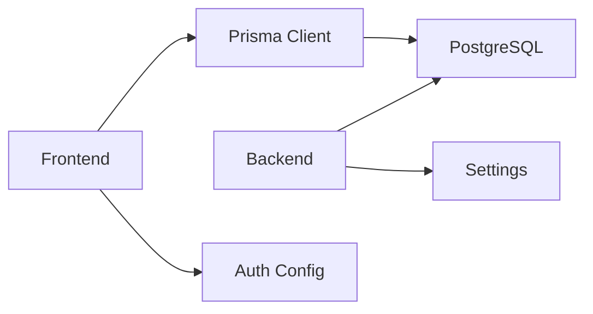

# Deployment Pipelines and Automation

<cite>
**Referenced Files in This Document**
- [package.json](file://english_pronunciation_app/frontend/package.json)
- [next.config.mjs](file://english_pronunciation_app/frontend/next.config.mjs)
- [schema.prisma](file://english_pronunciation_app/frontend/prisma/schema.prisma)
- [main.py](file://english_pronunciation_app/backend/app/main.py)
- [config.py](file://english_pronunciation_app/backend/app/core/config.py)
- [database.py](file://english_pronunciation_app/backend/app/core/database.py)
- [.env.example (frontend)](file://english_pronunciation_app/frontend/.env.example)
- [.env.example (backend)](file://english_pronunciation_app/backend/.env.example)
- [GOOGLE_OAUTH_SETUP.md](file://english_pronunciation_app/frontend/GOOGLE_OAUTH_SETUP.md)
- [QUICK_START_GOOGLE_OAUTH.md](file://english_pronunciation_app/frontend/QUICK_START_GOOGLE_OAUTH.md)
- [auth-providers.ts](file://english_pronunciation_app/frontend/src/lib/auth-providers.ts)
- [SKILL.md (deployment)](file://english_pronunciation_app/.agents/skills/deployment/SKILL.md)
- [SKILL.md (project-quality-gate)](file://english_pronunciation_app/.agents/skills/project-quality-gate/SKILL.md)
- [CURRENT_PROJECT_CONTEXT.md](file://docs/superpowers/plans/2026-06-18-sp1-cleanup-plan-and-orphan-code.md)
</cite>

## Table of Contents
1. [Introduction](#introduction)
2. [Project Structure](#project-structure)
3. [Core Components](#core-components)
4. [Architecture Overview](#architecture-overview)
5. [Detailed Component Analysis](#detailed-component-analysis)
6. [Dependency Analysis](#dependency-analysis)
7. [Performance Considerations](#performance-considerations)
8. [Troubleshooting Guide](#troubleshooting-guide)
9. [Conclusion](#conclusion)
10. [Appendices](#appendices)

## Introduction
This document describes deployment pipelines and automation for the pronunciation learning platform. It covers CI/CD configuration for automated testing, building, and deployment; frontend deployment to Vercel-like platforms; backend deployment for FastAPI applications; and database migration automation. It also documents secrets management, environment-specific deployments, deployment validation checks, rollback procedures, blue-green deployment strategies, zero-downtime techniques, and troubleshooting guidance.

## Project Structure
The platform consists of:
- Frontend built with Next.js App Router, TypeScript, Prisma, and Tailwind.
- Backend built with FastAPI, minimal routes, and optional database connectivity via SQLAlchemy.
- Shared PostgreSQL database managed by Prisma on the frontend; backend performs lightweight health checks against the same database.

**Diagram sources**
- [package.json:1-45](file://english_pronunciation_app/frontend/package.json#L1-L45)
- [next.config.mjs:1-5](file://english_pronunciation_app/frontend/next.config.mjs#L1-L5)
- [schema.prisma:1-501](file://english_pronunciation_app/frontend/prisma/schema.prisma#L1-L501)
- [main.py:1-43](file://english_pronunciation_app/backend/app/main.py#L1-L43)
- [config.py:1-34](file://english_pronunciation_app/backend/app/core/config.py#L1-L34)
- [database.py:1-51](file://english_pronunciation_app/backend/app/core/database.py#L1-L51)

**Section sources**
- [package.json:1-45](file://english_pronunciation_app/frontend/package.json#L1-L45)
- [next.config.mjs:1-5](file://english_pronunciation_app/frontend/next.config.mjs#L1-L5)
- [schema.prisma:1-501](file://english_pronunciation_app/frontend/prisma/schema.prisma#L1-L501)
- [main.py:1-43](file://english_pronunciation_app/backend/app/main.py#L1-L43)
- [config.py:1-34](file://english_pronunciation_app/backend/app/core/config.py#L1-L34)
- [database.py:1-51](file://english_pronunciation_app/backend/app/core/database.py#L1-L51)

## Core Components
- Frontend build and test pipeline: Next.js build, TypeScript type checking, unit tests, and Prisma seed invocation.
- Backend health endpoint and CORS configuration for safe cross-origin requests.
- Database connectivity abstraction with environment-driven configuration and health checks.
- Authentication and OAuth configuration via environment variables for secure runtime configuration.

**Section sources**
- [package.json:6-13](file://english_pronunciation_app/frontend/package.json#L6-L13)
- [main.py:10-42](file://english_pronunciation_app/backend/app/main.py#L10-L42)
- [config.py:9-33](file://english_pronunciation_app/backend/app/core/config.py#L9-L33)
- [database.py:31-50](file://english_pronunciation_app/backend/app/core/database.py#L31-L50)
- [.env.example (frontend):1-16](file://english_pronunciation_app/frontend/.env.example#L1-L16)
- [.env.example (backend):1-10](file://english_pronunciation_app/backend/.env.example#L1-L10)

## Architecture Overview
The deployment architecture supports:
- Frontend deployment to Vercel-compatible environments with static build and runtime configuration.
- Backend deployment as a containerized FastAPI service behind a reverse proxy or load balancer.
- Database migrations orchestrated by Prisma CLI and executed during builds or CI steps.
- Health checks and readiness probes to enable zero-downtime deployments.

[No sources needed since this diagram shows conceptual workflow, not actual code structure]

## Detailed Component Analysis

### Frontend Pipeline (Next.js)
- Build and test scripts are defined in the frontend package manifest.
- Prisma schema and client generation are integrated into the build pipeline.
- Environment variables are loaded from .env files and injected at build/runtime.

**Diagram sources**
- [package.json:6-13](file://english_pronunciation_app/frontend/package.json#L6-L13)
- [schema.prisma:1-8](file://english_pronunciation_app/frontend/prisma/schema.prisma#L1-L8)

**Section sources**
- [package.json:6-13](file://english_pronunciation_app/frontend/package.json#L6-L13)
- [schema.prisma:1-8](file://english_pronunciation_app/frontend/prisma/schema.prisma#L1-L8)

### Backend Pipeline (FastAPI)
- Minimal FastAPI app exposes root and health endpoints.
- CORS origins are configurable via environment variables.
- Database connectivity is optional and validated via a dedicated health check.

**Diagram sources**
- [main.py:25-42](file://english_pronunciation_app/backend/app/main.py#L25-L42)
- [config.py:23-33](file://english_pronunciation_app/backend/app/core/config.py#L23-L33)
- [database.py:31-50](file://english_pronunciation_app/backend/app/core/database.py#L31-L50)

**Section sources**
- [main.py:10-42](file://english_pronunciation_app/backend/app/main.py#L10-L42)
- [config.py:9-33](file://english_pronunciation_app/backend/app/core/config.py#L9-L33)
- [database.py:10-50](file://english_pronunciation_app/backend/app/core/database.py#L10-L50)

### Database Migration Automation (Prisma)
- Prisma schema defines the PostgreSQL model.
- Migration commands can be invoked in CI to keep the database schema aligned with the codebase.
- Seed scripts can be run post-migration to populate initial data.

**Diagram sources**
- [schema.prisma:1-8](file://english_pronunciation_app/frontend/prisma/schema.prisma#L1-L8)
- [package.json:12-12](file://english_pronunciation_app/frontend/package.json#L12-L12)

**Section sources**
- [schema.prisma:1-8](file://english_pronunciation_app/frontend/prisma/schema.prisma#L1-L8)
- [package.json:12-12](file://english_pronunciation_app/frontend/package.json#L12-L12)

### Secrets Management and Environment Configuration
- Frontend and backend require environment variables for database URLs, auth secrets, and OAuth credentials.
- OAuth setup documentation provides step-by-step instructions for obtaining credentials and configuring environment variables.
- Environment variable loading is supported via standard Next.js and Python environment mechanisms.

**Diagram sources**
- [.env.example (frontend):1-16](file://english_pronunciation_app/frontend/.env.example#L1-L16)
- [.env.example (backend):1-10](file://english_pronunciation_app/backend/.env.example#L1-L10)
- [GOOGLE_OAUTH_SETUP.md:95-250](file://english_pronunciation_app/frontend/GOOGLE_OAUTH_SETUP.md#L95-L250)
- [auth-providers.ts:1-14](file://english_pronunciation_app/frontend/src/lib/auth-providers.ts#L1-L14)

**Section sources**
- [.env.example (frontend):1-16](file://english_pronunciation_app/frontend/.env.example#L1-L16)
- [.env.example (backend):1-10](file://english_pronunciation_app/backend/.env.example#L1-L10)
- [GOOGLE_OAUTH_SETUP.md:95-250](file://english_pronunciation_app/frontend/GOOGLE_OAUTH_SETUP.md#L95-L250)
- [auth-providers.ts:1-14](file://english_pronunciation_app/frontend/src/lib/auth-providers.ts#L1-L14)

### Deployment Triggers and Validation
- Quality gates define pre-commit validation steps: Prisma validate, TypeScript compile, tests, and build.
- These validations should be mirrored in CI to prevent broken deployments.

**Diagram sources**
- [SKILL.md (project-quality-gate):19-27](file://english_pronunciation_app/.agents/skills/project-quality-gate/SKILL.md#L19-L27)
- [CURRENT_PROJECT_CONTEXT.md:256-262](file://docs/superpowers/plans/2026-06-18-sp1-cleanup-plan-and-orphan-code.md#L256-L262)

**Section sources**
- [SKILL.md (project-quality-gate):19-27](file://english_pronunciation_app/.agents/skills/project-quality-gate/SKILL.md#L19-L27)
- [CURRENT_PROJECT_CONTEXT.md:256-262](file://docs/superpowers/plans/2026-06-18-sp1-cleanup-plan-and-orphan-code.md#L256-L262)

### Rollback Procedures and Zero-Downtime Strategies
- Blue-green deployments: Maintain two identical environments; route traffic to the “green” environment, deploy changes to “blue,” validate, then switch traffic.
- Canary releases: Gradually shift traffic to the new version to minimize risk.
- Health checks: Use the backend’s /health endpoint and database connectivity checks to gate traffic.
- Database migrations: Run migrations before switching traffic; use reversible migrations where possible.

[No sources needed since this section provides general guidance]

### CI/CD Workflow Configuration (GitHub Actions)
- Define jobs for:
  - Linting and type checking
  - Running tests
  - Building frontend and backend
  - Running Prisma migrations
  - Deploying to staging and production
- Use matrix builds for multiple Node/Python versions if desired.
- Store secrets in repository settings and inject them into jobs via environment variables.

[No sources needed since this section provides general guidance]

## Dependency Analysis
- Frontend depends on Prisma for schema validation and client generation.
- Backend optionally depends on the same PostgreSQL database for health checks.
- Both components rely on environment variables for configuration.

**Diagram sources**
- [schema.prisma:1-8](file://english_pronunciation_app/frontend/prisma/schema.prisma#L1-L8)
- [config.py:23-33](file://english_pronunciation_app/backend/app/core/config.py#L23-L33)
- [database.py:10-17](file://english_pronunciation_app/backend/app/core/database.py#L10-L17)

**Section sources**
- [schema.prisma:1-8](file://english_pronunciation_app/frontend/prisma/schema.prisma#L1-L8)
- [config.py:9-33](file://english_pronunciation_app/backend/app/core/config.py#L9-L33)
- [database.py:10-17](file://english_pronunciation_app/backend/app/core/database.py#L10-L17)

## Performance Considerations
- Prefer incremental builds and caching in CI to reduce build times.
- Use separate containers for frontend and backend to optimize resource utilization.
- Keep database migrations minimal and idempotent to avoid long downtime.

[No sources needed since this section provides general guidance]

## Troubleshooting Guide
Common deployment issues and resolutions:
- Database connectivity errors: Verify DATABASE_URL and network access; ensure migrations ran successfully.
- OAuth login failures: Confirm AUTH_SECRET, AUTH_URL, and Google OAuth credentials; check redirect URIs.
- Health check failures: Inspect /health response and database check results; validate environment variables.
- Build failures: Re-run quality gate checks locally and in CI; address lint/type/test failures before merging.

**Section sources**
- [database.py:31-50](file://english_pronunciation_app/backend/app/core/database.py#L31-L50)
- [main.py:34-42](file://english_pronunciation_app/backend/app/main.py#L34-L42)
- [GOOGLE_OAUTH_SETUP.md:242-250](file://english_pronunciation_app/frontend/GOOGLE_OAUTH_SETUP.md#L242-L250)
- [auth-providers.ts:1-14](file://english_pronunciation_app/frontend/src/lib/auth-providers.ts#L1-L14)

## Conclusion
The pronunciation learning platform can be deployed using modern CI/CD practices with clear separation of concerns between the frontend and backend, robust database management via Prisma, and strong validation through quality gates. By adopting blue-green or canary deployments, enforcing health checks, and managing secrets securely, teams can achieve reliable, zero-downtime releases.

[No sources needed since this section summarizes without analyzing specific files]

## Appendices

### Environment Variables Reference
- Frontend:
  - DATABASE_URL: PostgreSQL connection string
  - AUTH_SECRET: Secret for sessions
  - AUTH_URL: Base URL for auth callbacks
  - AUTH_GOOGLE_ID / AUTH_GOOGLE_SECRET: Google OAuth credentials
  - GOOGLE_CLIENT_ID / GOOGLE_CLIENT_SECRET: Alternative names for OAuth
- Backend:
  - APP_NAME, APP_VERSION, APP_ENV: Service metadata and environment
  - DATABASE_URL: PostgreSQL connection string (shared with frontend)
  - CORS_ORIGINS: Comma-separated list of allowed origins

**Section sources**
- [.env.example (frontend):1-16](file://english_pronunciation_app/frontend/.env.example#L1-L16)
- [.env.example (backend):1-10](file://english_pronunciation_app/backend/.env.example#L1-L10)

### Deployment Artifacts and Commands
- Frontend build and test:
  - Scripts: dev, build, test, start, lint
  - Prisma seed: db:seed:lessons
- Backend:
  - Health endpoint: /health
  - Database check: internal connectivity verification

**Section sources**
- [package.json:6-13](file://english_pronunciation_app/frontend/package.json#L6-L13)
- [main.py:25-42](file://english_pronunciation_app/backend/app/main.py#L25-L42)
- [database.py:31-50](file://english_pronunciation_app/backend/app/core/database.py#L31-L50)