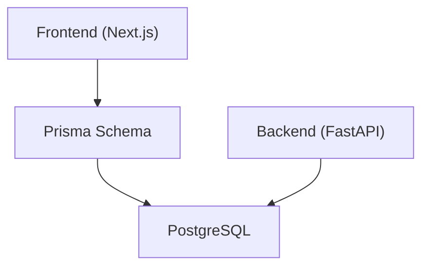
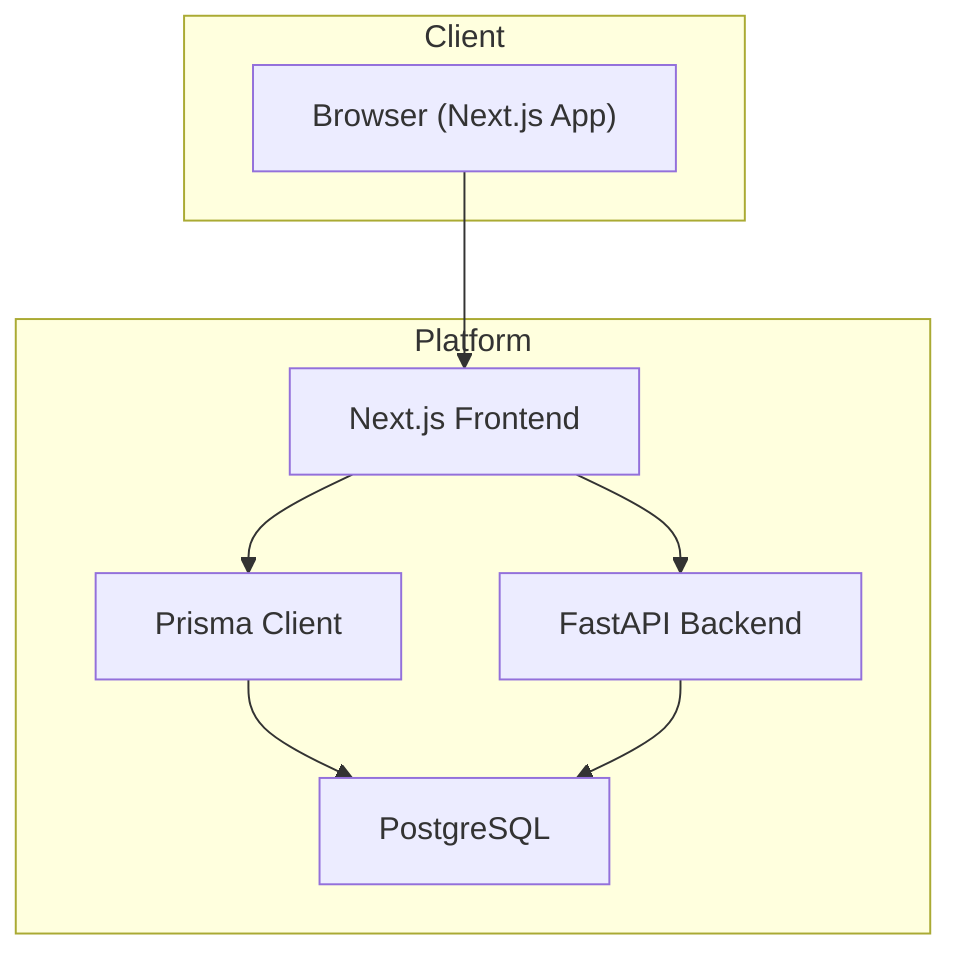
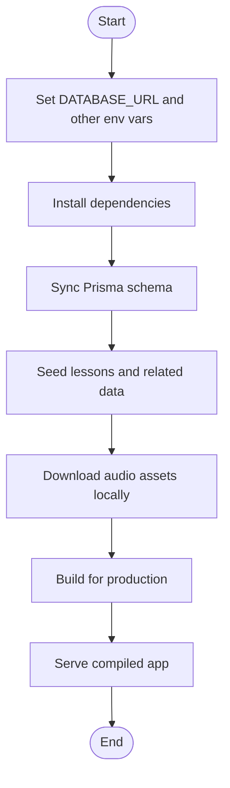
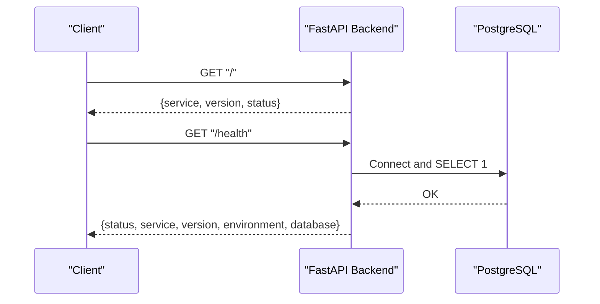
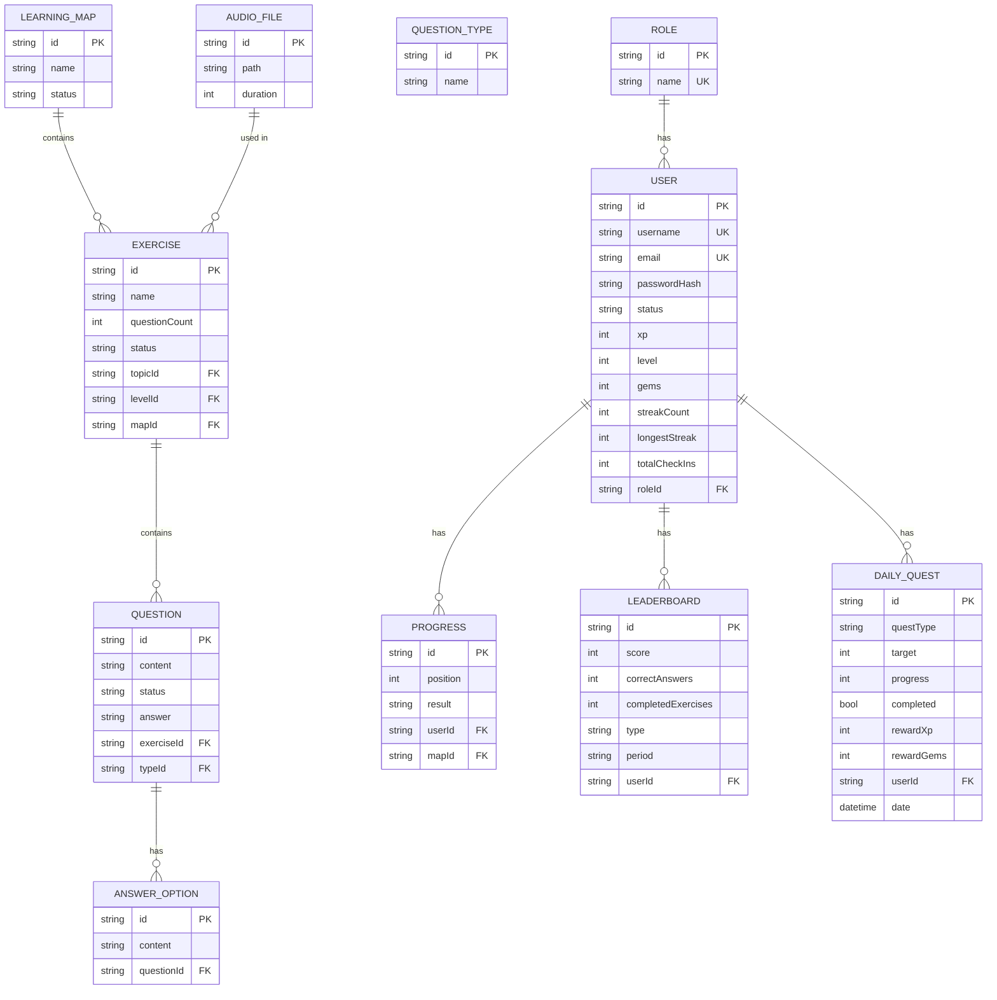
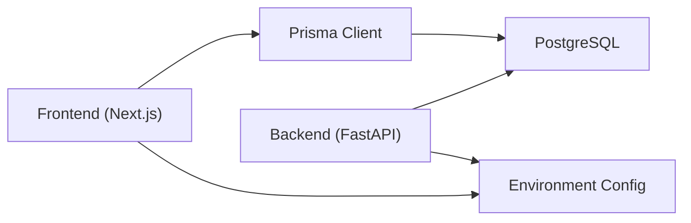

# Deployment and DevOps

<cite>
**Referenced Files in This Document**
- [package.json](file://english_pronunciation_app/frontend/package.json)
- [README.md](file://english_pronunciation_app/frontend/README.md)
- [next.config.mjs](file://english_pronunciation_app/frontend/next.config.mjs)
- [schema.prisma](file://english_pronunciation_app/frontend/prisma/schema.prisma)
- [main.py](file://english_pronunciation_app/backend/app/main.py)
- [config.py](file://english_pronunciation_app/backend/app/core/config.py)
- [database.py](file://english_pronunciation_app/backend/app/core/database.py)
- [README.md](file://english_pronunciation_app/backend/README.md)
</cite>

## Table of Contents
1. [Introduction](#introduction)
2. [Project Structure](#project-structure)
3. [Core Components](#core-components)
4. [Architecture Overview](#architecture-overview)
5. [Detailed Component Analysis](#detailed-component-analysis)
6. [Dependency Analysis](#dependency-analysis)
7. [Performance Considerations](#performance-considerations)
8. [Troubleshooting Guide](#troubleshooting-guide)
9. [Conclusion](#conclusion)
10. [Appendices](#appendices)

## Introduction
This document provides comprehensive deployment and DevOps guidance for the pronunciation learning platform. It covers environment configuration, build processes, deployment pipelines for frontend and backend, database migration strategies, production setup, infrastructure requirements, cloud/containerization options, CI/CD configuration, monitoring/logging, performance optimization, security hardening, backup and disaster recovery, maintenance workflows, troubleshooting, and scalability with load balancing and high availability.

## Project Structure
The platform consists of:
- Frontend built with Next.js 16, TypeScript, Prisma ORM, and PostgreSQL.
- Backend built with FastAPI, exposing health and metadata endpoints, with optional database connectivity checks.
- Shared Prisma schema defines the domain model for users, exercises, phonemes, learning maps, and gamification features.

**Diagram sources**
- [schema.prisma:1-501](file://english_pronunciation_app/frontend/prisma/schema.prisma#L1-L501)
- [main.py:1-43](file://english_pronunciation_app/backend/app/main.py#L1-L43)

**Section sources**
- [README.md:1-33](file://english_pronunciation_app/frontend/README.md#L1-L33)
- [README.md:1-52](file://english_pronunciation_app/backend/README.md#L1-L52)

## Core Components
- Frontend (Next.js)
  - Build commands: development, production build, start, lint, and Prisma seed scripts.
  - Prisma client generation and seeding via npm scripts.
  - Environment variable DATABASE_URL for Postgres connection.
- Backend (FastAPI)
  - Health endpoint and root metadata endpoint.
  - Configurable CORS origins via environment variable.
  - Optional database connectivity check when DATABASE_URL is set.

Key configuration and scripts:
- Frontend scripts and Prisma seed configuration are defined in the frontend package manifest.
- Backend configuration reads environment variables for app identity, environment, CORS, and database URL.

**Section sources**
- [package.json:1-45](file://english_pronunciation_app/frontend/package.json#L1-L45)
- [README.md:1-33](file://english_pronunciation_app/frontend/README.md#L1-L33)
- [config.py:1-34](file://english_pronunciation_app/backend/app/core/config.py#L1-L34)
- [database.py:1-51](file://english_pronunciation_app/backend/app/core/database.py#L1-L51)
- [main.py:1-43](file://english_pronunciation_app/backend/app/main.py#L1-L43)

## Architecture Overview
The system comprises:
- Frontend Next.js application serving the UI and interacting with backend APIs and PostgreSQL via Prisma.
- Backend FastAPI microservice providing health and metadata endpoints, with optional database connectivity verification.
- PostgreSQL database storing all application data, managed by Prisma.

**Diagram sources**
- [main.py:1-43](file://english_pronunciation_app/backend/app/main.py#L1-L43)
- [config.py:1-34](file://english_pronunciation_app/backend/app/core/config.py#L1-L34)
- [database.py:1-51](file://english_pronunciation_app/backend/app/core/database.py#L1-L51)
- [schema.prisma:1-501](file://english_pronunciation_app/frontend/prisma/schema.prisma#L1-L501)

## Detailed Component Analysis

### Frontend (Next.js) Deployment
- Environment
  - DATABASE_URL must point to a PostgreSQL instance for Prisma to connect.
  - Additional environment variables may be required depending on authentication and external integrations.
- Build and Seed
  - Install dependencies, sync Prisma schema, optionally clean database, seed lessons, download audio assets locally, then start development server.
- Production Build
  - Use the production build script to compile static assets and server-side rendering outputs.
- Prisma Operations
  - Use Prisma CLI to manage schema and seed data during setup and updates.

**Diagram sources**
- [README.md:1-33](file://english_pronunciation_app/frontend/README.md#L1-L33)
- [package.json:1-45](file://english_pronunciation_app/frontend/package.json#L1-L45)

**Section sources**
- [README.md:1-33](file://english_pronunciation_app/frontend/README.md#L1-L33)
- [package.json:1-45](file://english_pronunciation_app/frontend/package.json#L1-L45)
- [next.config.mjs:1-5](file://english_pronunciation_app/frontend/next.config.mjs#L1-L5)

### Backend (FastAPI) Deployment
- Environment
  - APP_NAME, APP_VERSION, APP_ENV define service identity and environment.
  - DATABASE_URL enables database connectivity checks.
  - CORS_ORIGINS controls allowed origins for cross-origin requests.
- Endpoints
  - Root metadata endpoint returns service and version info.
  - Health endpoint reports status, environment, version, and database connectivity.
- Database Connectivity
  - Optional database engine initialization and health checks when DATABASE_URL is provided.

**Diagram sources**
- [main.py:25-42](file://english_pronunciation_app/backend/app/main.py#L25-L42)
- [database.py:31-50](file://english_pronunciation_app/backend/app/core/database.py#L31-L50)

**Section sources**
- [README.md:1-52](file://english_pronunciation_app/backend/README.md#L1-L52)
- [config.py:1-34](file://english_pronunciation_app/backend/app/core/config.py#L1-L34)
- [database.py:1-51](file://english_pronunciation_app/backend/app/core/database.py#L1-L51)
- [main.py:1-43](file://english_pronunciation_app/backend/app/main.py#L1-L43)

### Database Model and Migration Strategy
- Prisma schema defines the complete domain model including users, roles, learning maps, exercises, phonemes, minimal pairs, sentences, questions, answers, progress tracking, gamification, and leaderboards.
- Migration approach
  - Use Prisma migrations for schema changes in development and staging.
  - Apply migrations in CI/CD pipelines before deploying backend and frontend.
  - Maintain idempotent seed scripts for content and audio assets.

**Diagram sources**
- [schema.prisma:1-501](file://english_pronunciation_app/frontend/prisma/schema.prisma#L1-L501)

**Section sources**
- [schema.prisma:1-501](file://english_pronunciation_app/frontend/prisma/schema.prisma#L1-L501)

## Dependency Analysis
- Frontend depends on Prisma client and PostgreSQL for persistence.
- Backend depends on SQLAlchemy for database connectivity and exposes health checks.
- Both components rely on environment variables for configuration.

**Diagram sources**
- [package.json:1-45](file://english_pronunciation_app/frontend/package.json#L1-L45)
- [schema.prisma:1-501](file://english_pronunciation_app/frontend/prisma/schema.prisma#L1-L501)
- [config.py:1-34](file://english_pronunciation_app/backend/app/core/config.py#L1-L34)
- [database.py:1-51](file://english_pronunciation_app/backend/app/core/database.py#L1-L51)

**Section sources**
- [package.json:1-45](file://english_pronunciation_app/frontend/package.json#L1-L45)
- [config.py:1-34](file://english_pronunciation_app/backend/app/core/config.py#L1-L34)
- [database.py:1-51](file://english_pronunciation_app/backend/app/core/database.py#L1-L51)

## Performance Considerations
- Database pooling and pre-ping
  - Enable connection pooling and pre-ping to maintain robust connections under load.
- Frontend optimization
  - Use Next.js static generation and server-side rendering to reduce initial load times.
  - Minimize payload sizes by avoiding committing audio assets to version control and downloading them locally during seed.
- Backend optimization
  - Keep endpoints lightweight; defer heavy computations to background tasks or external services.
- Caching
  - Implement CDN for static assets and consider caching strategies for frequently accessed content.
- Monitoring
  - Instrument health endpoints and database checks to detect performance regressions early.

[No sources needed since this section provides general guidance]

## Troubleshooting Guide
Common deployment and production issues:
- Database connectivity failures
  - Verify DATABASE_URL format and credentials; ensure network access to the database host.
  - Confirm that the database is reachable and the schema is up-to-date.
- CORS errors
  - Ensure CORS_ORIGINS includes the frontend origin(s) used in production.
- Health endpoint returns database error
  - Check database engine initialization and connectivity; confirm that the database is healthy and accepting connections.
- Prisma schema mismatch
  - Run Prisma migrations and ensure the client is regenerated after schema changes.
- Audio asset loading
  - Confirm that audio assets are downloaded locally during seed and served from the expected path.

**Section sources**
- [database.py:31-50](file://english_pronunciation_app/backend/app/core/database.py#L31-L50)
- [config.py:23-33](file://english_pronunciation_app/backend/app/core/config.py#L23-L33)
- [README.md:1-33](file://english_pronunciation_app/frontend/README.md#L1-L33)

## Conclusion
This guide outlines a practical, layered approach to deploying and operating the pronunciation learning platform. By aligning environment configuration, build processes, and database migrations with robust backend health checks and frontend optimizations, teams can achieve reliable, scalable, and secure operations. Adopt the recommended CI/CD, monitoring, security, and backup practices to support long-term stability and growth.

[No sources needed since this section summarizes without analyzing specific files]

## Appendices

### Environment Variables Reference
- Frontend
  - DATABASE_URL: PostgreSQL connection string for Prisma.
- Backend
  - APP_NAME: Service name.
  - APP_VERSION: Service version.
  - APP_ENV: Environment identifier (development, staging, production).
  - DATABASE_URL: Optional PostgreSQL connection string enabling database checks.
  - CORS_ORIGINS: Comma-separated list of allowed origins.

**Section sources**
- [README.md:1-33](file://english_pronunciation_app/frontend/README.md#L1-L33)
- [README.md:1-52](file://english_pronunciation_app/backend/README.md#L1-L52)
- [config.py:23-33](file://english_pronunciation_app/backend/app/core/config.py#L23-L33)

### CI/CD Pipeline Configuration Guidance
- Build stages
  - Frontend: install dependencies, lint, build, and test.
  - Backend: install dependencies, lint, and test.
- Database migrations
  - Run Prisma migrations in CI prior to backend deployment.
- Artifact packaging
  - Package Next.js static output and backend binaries.
- Deployment
  - Deploy backend to a containerized runtime or platform with environment variables configured.
  - Deploy frontend to a static hosting provider or CDN.
- Rollback
  - Maintain artifact versions for quick rollback.

[No sources needed since this section provides general guidance]

### Cloud and Containerization Options
- Containerization
  - Build images for both frontend and backend; run backend behind a reverse proxy or ingress.
- Cloud providers
  - Use managed PostgreSQL and container orchestration services.
- Secrets management
  - Store DATABASE_URL, OAuth secrets, and other sensitive values in environment-specific secret stores.

[No sources needed since this section provides general guidance]

### Monitoring and Logging
- Health checks
  - Monitor backend /health endpoint and database connectivity.
- Logs
  - Centralize application logs and correlate with database and frontend metrics.
- Metrics
  - Track response times, error rates, and database connection health.

[No sources needed since this section provides general guidance]

### Security Hardening
- Secrets
  - Never commit secrets; use environment variables or secret managers.
- CORS
  - Restrict CORS_ORIGINS to trusted domains only.
- Transport
  - Enforce HTTPS in production and secure cookie policies for authentication.

[No sources needed since this section provides general guidance]

### Backup and Disaster Recovery
- Database backups
  - Schedule regular logical backups of PostgreSQL; test restore procedures.
- Artifacts
  - Retain frontend build artifacts and backend binaries for reproducible deployments.
- DR plan
  - Define failover steps for database and application tiers.

[No sources needed since this section provides general guidance]

### Maintenance Workflows
- Regular schema updates
  - Use Prisma migrations and keep seed scripts idempotent.
- Content refresh
  - Periodically re-run audio asset downloads and content seeds as needed.

[No sources needed since this section provides general guidance]

### Scaling, Load Balancing, and High Availability
- Horizontal scaling
  - Scale backend replicas behind a load balancer; ensure stateless design.
- Database HA
  - Use managed PostgreSQL with read replicas and automatic failover.
- CDN and caching
  - Offload static assets to CDN and implement caching strategies.

[No sources needed since this section provides general guidance]