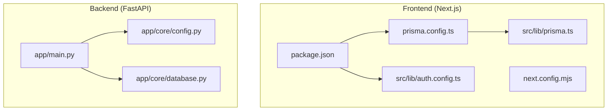
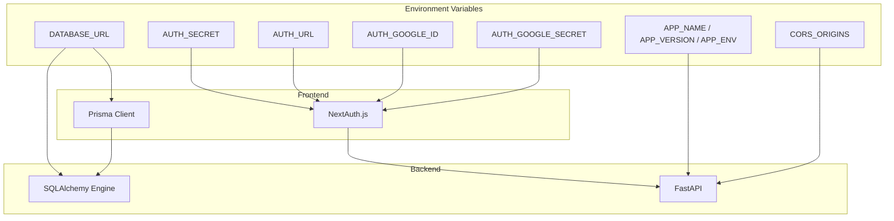
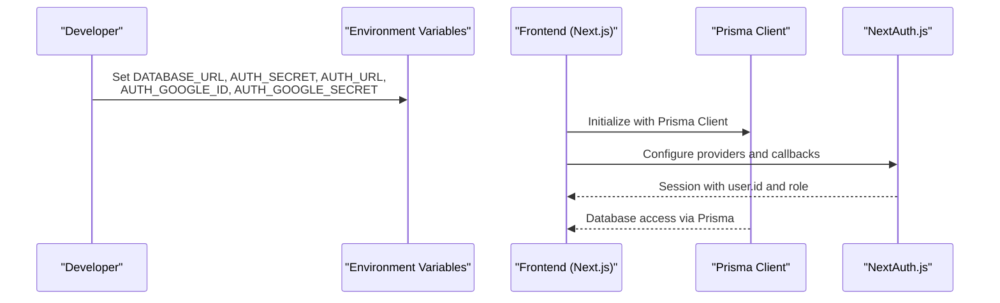
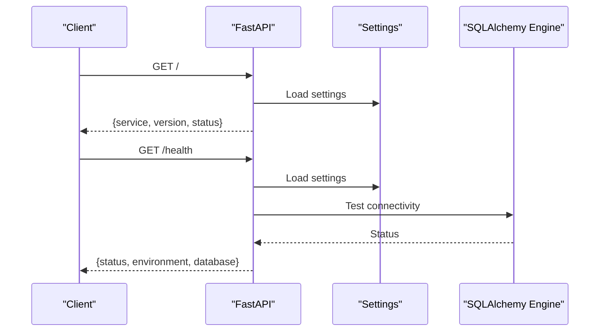
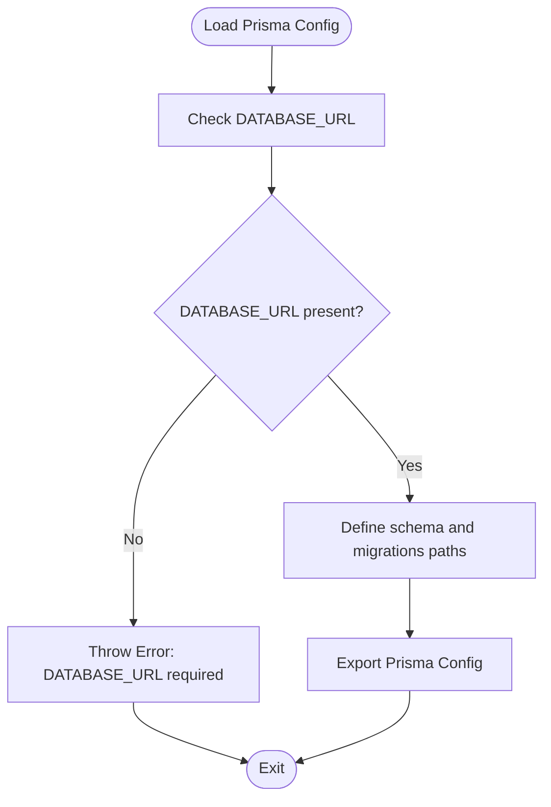
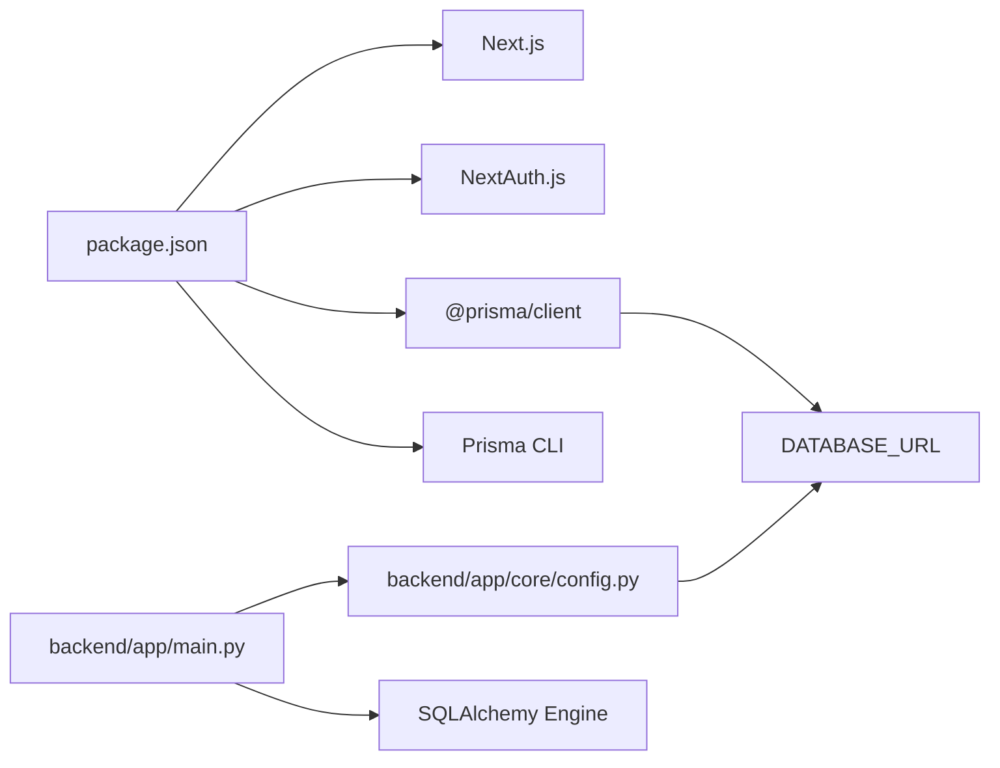

# Environment Configuration and Setup

<cite>
**Referenced Files in This Document**
- [package.json](file://english_pronunciation_app/frontend/package.json)
- [next.config.mjs](file://english_pronunciation_app/frontend/next.config.mjs)
- [prisma.config.ts](file://english_pronunciation_app/frontend/prisma.config.ts)
- [prisma.ts](file://english_pronunciation_app/frontend/src/lib/prisma.ts)
- [auth.config.ts](file://english_pronunciation_app/frontend/src/lib/auth.config.ts)
- [GOOGLE_OAUTH_SETUP.md](file://english_pronunciation_app/frontend/GOOGLE_OAUTH_SETUP.md)
- [QUICK_START_GOOGLE_OAUTH.md](file://english_pronunciation_app/frontend/QUICK_START_GOOGLE_OAUTH.md)
- [config.py](file://english_pronunciation_app/backend/app/core/config.py)
- [database.py](file://english_pronunciation_app/backend/app/core/database.py)
- [main.py](file://english_pronunciation_app/backend/app/main.py)
</cite>

## Table of Contents
1. [Introduction](#introduction)
2. [Project Structure](#project-structure)
3. [Core Components](#core-components)
4. [Architecture Overview](#architecture-overview)
5. [Detailed Component Analysis](#detailed-component-analysis)
6. [Dependency Analysis](#dependency-analysis)
7. [Performance Considerations](#performance-considerations)
8. [Troubleshooting Guide](#troubleshooting-guide)
9. [Conclusion](#conclusion)
10. [Appendices](#appendices)

## Introduction
This document provides comprehensive environment configuration and setup guidance for the pronunciation learning platform. It covers development, staging, and production environments for both the Next.js frontend and FastAPI backend. It explains runtime requirements, environment variables, database connectivity, API endpoints, Prisma configuration, Next.js environment-specific settings, security considerations for secrets and OAuth, and step-by-step setup procedures for developers and system administrators. It also includes troubleshooting and validation steps to resolve common environment configuration issues.

## Project Structure
The project consists of:
- Frontend built with Next.js, NextAuth.js, Prisma Client, and PostgreSQL via Prisma.
- Backend built with FastAPI, SQLAlchemy ORM, and PostgreSQL.
- Shared environment variable configuration for database connections, OAuth, and CORS.

**Diagram sources**
- [package.json:1-45](file://english_pronunciation_app/frontend/package.json#L1-L45)
- [next.config.mjs:1-5](file://english_pronunciation_app/frontend/next.config.mjs#L1-L5)
- [prisma.config.ts:1-21](file://english_pronunciation_app/frontend/prisma.config.ts#L1-L21)
- [prisma.ts:1-13](file://english_pronunciation_app/frontend/src/lib/prisma.ts#L1-L13)
- [auth.config.ts:1-25](file://english_pronunciation_app/frontend/src/lib/auth.config.ts#L1-L25)
- [main.py:1-43](file://english_pronunciation_app/backend/app/main.py#L1-L43)
- [config.py:1-34](file://english_pronunciation_app/backend/app/core/config.py#L1-L34)
- [database.py:1-51](file://english_pronunciation_app/backend/app/core/database.py#L1-L51)

**Section sources**
- [package.json:1-45](file://english_pronunciation_app/frontend/package.json#L1-L45)
- [next.config.mjs:1-5](file://english_pronunciation_app/frontend/next.config.mjs#L1-L5)
- [prisma.config.ts:1-21](file://english_pronunciation_app/frontend/prisma.config.ts#L1-L21)
- [prisma.ts:1-13](file://english_pronunciation_app/frontend/src/lib/prisma.ts#L1-L13)
- [auth.config.ts:1-25](file://english_pronunciation_app/frontend/src/lib/auth.config.ts#L1-L25)
- [main.py:1-43](file://english_pronunciation_app/backend/app/main.py#L1-L43)
- [config.py:1-34](file://english_pronunciation_app/backend/app/core/config.py#L1-L34)
- [database.py:1-51](file://english_pronunciation_app/backend/app/core/database.py#L1-L51)

## Core Components
- Runtime requirements
  - Node.js: Required for Next.js frontend and Prisma CLI.
  - Python: Required for FastAPI backend and Prisma Python client.
- Environment variables
  - DATABASE_URL: PostgreSQL connection string for both frontend Prisma and backend SQLAlchemy.
  - AUTH_SECRET: NextAuth.js secret for signing sessions and JWT tokens.
  - AUTH_URL: Base URL for NextAuth.js.
  - AUTH_GOOGLE_ID and AUTH_GOOGLE_SECRET: Google OAuth credentials.
  - APP_NAME, APP_VERSION, APP_ENV: Backend service metadata and environment.
  - CORS_ORIGINS: Comma-separated list of allowed origins for the backend.
- Database connectivity
  - Frontend: Prisma reads DATABASE_URL and applies it to migrations and seeding.
  - Backend: SQLAlchemy creates an engine from DATABASE_URL and manages sessions.
- API endpoints
  - Root and health checks exposed by the backend for environment verification.

**Section sources**
- [package.json:17-26](file://english_pronunciation_app/frontend/package.json#L17-L26)
- [prisma.config.ts:6-10](file://english_pronunciation_app/frontend/prisma.config.ts#L6-L10)
- [config.py:23-33](file://english_pronunciation_app/backend/app/core/config.py#L23-L33)
- [database.py:15-17](file://english_pronunciation_app/backend/app/core/database.py#L15-L17)
- [main.py:25-42](file://english_pronunciation_app/backend/app/main.py#L25-L42)

## Architecture Overview
The environment configuration spans three layers:
- Secrets and configuration: Environment variables consumed by frontend and backend.
- Data plane: PostgreSQL database accessed via Prisma (frontend) and SQLAlchemy (backend).
- API plane: FastAPI exposes health and root endpoints; Next.js handles authentication and UI.

**Diagram sources**
- [prisma.config.ts:6-10](file://english_pronunciation_app/frontend/prisma.config.ts#L6-L10)
- [config.py:23-33](file://english_pronunciation_app/backend/app/core/config.py#L23-L33)
- [database.py:15-17](file://english_pronunciation_app/backend/app/core/database.py#L15-L17)
- [auth.config.ts:3-24](file://english_pronunciation_app/frontend/src/lib/auth.config.ts#L3-L24)
- [main.py:10-22](file://english_pronunciation_app/backend/app/main.py#L10-L22)

## Detailed Component Analysis

### Frontend Environment Configuration
- Next.js configuration
  - The Next.js configuration file exists and can be extended for environment-specific overrides.
- Prisma configuration
  - Prisma requires DATABASE_URL; the configuration validates its presence and sets migrations and schema paths.
  - Prisma Client is initialized as a singleton to avoid multiple instances during development.
- Authentication configuration
  - NextAuth.js is configured with provider slots and callback handlers to attach user roles and IDs to sessions/tokens.
  - OAuth providers (e.g., Google) are integrated via environment variables.

**Diagram sources**
- [prisma.config.ts:6-20](file://english_pronunciation_app/frontend/prisma.config.ts#L6-L20)
- [prisma.ts:6-12](file://english_pronunciation_app/frontend/src/lib/prisma.ts#L6-L12)
- [auth.config.ts:3-24](file://english_pronunciation_app/frontend/src/lib/auth.config.ts#L3-L24)

**Section sources**
- [next.config.mjs:1-5](file://english_pronunciation_app/frontend/next.config.mjs#L1-L5)
- [prisma.config.ts:1-21](file://english_pronunciation_app/frontend/prisma.config.ts#L1-L21)
- [prisma.ts:1-13](file://english_pronunciation_app/frontend/src/lib/prisma.ts#L1-L13)
- [auth.config.ts:1-25](file://english_pronunciation_app/frontend/src/lib/auth.config.ts#L1-L25)

### Backend Environment Configuration
- Settings and environment variables
  - Backend reads environment variables for service metadata, environment mode, database URL, and CORS origins.
  - CORS middleware allows configurable origins.
- Database connectivity
  - SQLAlchemy engine is created from DATABASE_URL with pre-ping enabled.
  - Health endpoint verifies database connectivity.
- API endpoints
  - Root endpoint returns service metadata.
  - Health endpoint returns environment and database status.

**Diagram sources**
- [main.py:25-42](file://english_pronunciation_app/backend/app/main.py#L25-L42)
- [config.py:23-33](file://english_pronunciation_app/backend/app/core/config.py#L23-L33)
- [database.py:31-50](file://english_pronunciation_app/backend/app/core/database.py#L31-L50)

**Section sources**
- [config.py:1-34](file://english_pronunciation_app/backend/app/core/config.py#L1-L34)
- [database.py:1-51](file://english_pronunciation_app/backend/app/core/database.py#L1-L51)
- [main.py:1-43](file://english_pronunciation_app/backend/app/main.py#L1-L43)

### Prisma Configuration Across Environments
- Validation
  - DATABASE_URL is mandatory for Prisma; missing value triggers an error.
- Migrations and schema
  - Migration paths and schema location are defined in the Prisma configuration.
- Frontend vs backend
  - Frontend uses Prisma Client for queries and migrations.
  - Backend uses SQLAlchemy; Prisma is primarily for schema and seeding in this repository.

**Diagram sources**
- [prisma.config.ts:6-20](file://english_pronunciation_app/frontend/prisma.config.ts#L6-L20)

**Section sources**
- [prisma.config.ts:1-21](file://english_pronunciation_app/frontend/prisma.config.ts#L1-L21)

### Next.js Environment-Specific Settings
- Next.js configuration file exists for potential environment overrides.
- Prisma Client initialization uses a singleton pattern to prevent multiple instances in development.

**Section sources**
- [next.config.mjs:1-5](file://english_pronunciation_app/frontend/next.config.mjs#L1-L5)
- [prisma.ts:3-12](file://english_pronunciation_app/frontend/src/lib/prisma.ts#L3-L12)

### Security Considerations
- Environment variables
  - Keep AUTH_SECRET, AUTH_GOOGLE_ID, AUTH_GOOGLE_SECRET, and DATABASE_URL out of version control.
  - Use separate environment files per environment (development, staging, production).
- OAuth configuration
  - Ensure redirect URIs match Google Cloud Console exactly.
  - Use HTTPS in production and set appropriate consent screen scopes and test users.
- SSL certificates
  - For production deployments, configure HTTPS termination at the edge or load balancer and ensure AUTH_URL uses HTTPS.

**Section sources**
- [GOOGLE_OAUTH_SETUP.md:260-271](file://english_pronunciation_app/frontend/GOOGLE_OAUTH_SETUP.md#L260-L271)
- [QUICK_START_GOOGLE_OAUTH.md:101-115](file://english_pronunciation_app/frontend/QUICK_START_GOOGLE_OAUTH.md#L101-L115)

## Dependency Analysis
- Frontend dependencies
  - Next.js, NextAuth.js, Prisma Client, and React ecosystem.
  - Prisma CLI and TypeScript tooling for schema and migrations.
- Backend dependencies
  - FastAPI, SQLAlchemy, and environment-driven configuration.
- Cross-cutting concerns
  - DATABASE_URL is the single source of truth for database connectivity across frontend and backend.
  - AUTH_* variables are consumed by NextAuth.js for secure authentication.

**Diagram sources**
- [package.json:17-40](file://english_pronunciation_app/frontend/package.json#L17-L40)
- [main.py:1-43](file://english_pronunciation_app/backend/app/main.py#L1-L43)
- [config.py:23-33](file://english_pronunciation_app/backend/app/core/config.py#L23-L33)
- [prisma.config.ts:6-10](file://english_pronunciation_app/frontend/prisma.config.ts#L6-L10)

**Section sources**
- [package.json:1-45](file://english_pronunciation_app/frontend/package.json#L1-L45)
- [main.py:1-43](file://english_pronunciation_app/backend/app/main.py#L1-L43)
- [config.py:1-34](file://english_pronunciation_app/backend/app/core/config.py#L1-L34)
- [prisma.config.ts:1-21](file://english_pronunciation_app/frontend/prisma.config.ts#L1-L21)

## Performance Considerations
- Database pooling and pre-ping
  - Backend enables pool_pre_ping for robust connection health checks.
- Prisma client lifecycle
  - Frontend uses a singleton Prisma Client to reduce overhead in development.
- CORS configuration
  - Limit CORS_ORIGINS to trusted domains to minimize unnecessary preflight requests.

**Section sources**
- [database.py:16-17](file://english_pronunciation_app/backend/app/core/database.py#L16-L17)
- [prisma.ts:6-12](file://english_pronunciation_app/frontend/src/lib/prisma.ts#L6-L12)
- [config.py:24-25](file://english_pronunciation_app/backend/app/core/config.py#L24-L25)

## Troubleshooting Guide
Common environment configuration issues and resolutions:
- Missing DATABASE_URL
  - Symptom: Prisma throws an error requiring DATABASE_URL; backend health reports not configured.
  - Resolution: Set DATABASE_URL to a valid PostgreSQL connection string.
- OAuth redirect mismatch
  - Symptom: Google OAuth returns redirect_uri_mismatch.
  - Resolution: Match Authorized JavaScript origins and redirect URIs in Google Cloud Console to your AUTH_URL and NextAuth callback path.
- Access denied during OAuth consent
  - Symptom: Google OAuth returns access_denied.
  - Resolution: Add your email to Test users in the OAuth consent screen or publish the app.
- Missing AUTH_SECRET
  - Symptom: NextAuth errors indicate missing secret.
  - Resolution: Generate and set AUTH_SECRET to a strong random value.
- CORS blocked requests
  - Symptom: Frontend fetches fail due to CORS.
  - Resolution: Set CORS_ORIGINS to include your frontend origins.

Validation procedures:
- Backend health check
  - Call the /health endpoint to confirm environment and database status.
- Frontend OAuth button visibility
  - Confirm the Google sign-in button appears after restarting the development server with correct environment variables.

**Section sources**
- [prisma.config.ts:8-10](file://english_pronunciation_app/frontend/prisma.config.ts#L8-L10)
- [database.py:31-50](file://english_pronunciation_app/backend/app/core/database.py#L31-L50)
- [main.py:34-42](file://english_pronunciation_app/backend/app/main.py#L34-L42)
- [GOOGLE_OAUTH_SETUP.md:167-206](file://english_pronunciation_app/frontend/GOOGLE_OAUTH_SETUP.md#L167-L206)
- [QUICK_START_GOOGLE_OAUTH.md:101-115](file://english_pronunciation_app/frontend/QUICK_START_GOOGLE_OAUTH.md#L101-L115)

## Conclusion
This guide consolidates environment configuration for the pronunciation learning platform across development, staging, and production. By adhering to environment variable hygiene, validating database connectivity, and carefully configuring OAuth, teams can reliably deploy and operate the platform. Use the provided troubleshooting steps and validation procedures to diagnose and resolve common issues quickly.

## Appendices

### Step-by-Step Setup Guides

- Local development setup (with Docker alternatives)
  - Install Node.js and Python as per runtime requirements.
  - Create a PostgreSQL database and set DATABASE_URL.
  - Configure OAuth:
    - Create a Google Cloud project and OAuth client.
    - Set AUTH_SECRET, AUTH_URL, AUTH_GOOGLE_ID, AUTH_GOOGLE_SECRET.
  - Run frontend and backend:
    - Frontend: Install dependencies and start the Next.js dev server.
    - Backend: Install Python dependencies and start the FastAPI server.
  - Validate:
    - Visit the frontend login page and ensure the Google sign-in button appears.
    - Call the backend /health endpoint to confirm environment and database status.

- Staging and production setup
  - Use separate environment files for each environment.
  - Store secrets in platform-managed secret stores or encrypted environment files.
  - Configure HTTPS and update AUTH_URL accordingly.
  - Set CORS_ORIGINS to production domains only.
  - Seed databases using Prisma migrations and seeds as appropriate.

- Docker alternatives
  - Use containerized PostgreSQL for local parity.
  - Build and run the Next.js frontend and FastAPI backend containers separately or with orchestration.

[No sources needed since this section provides general guidance]