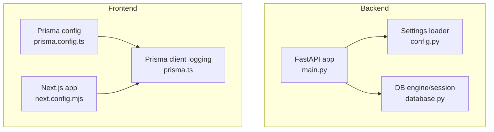
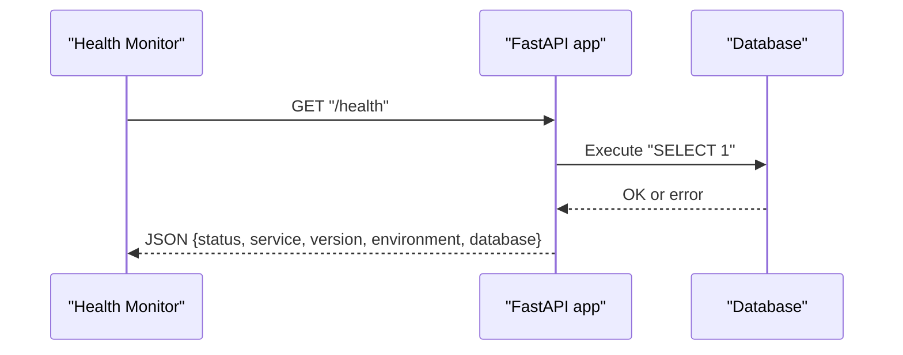
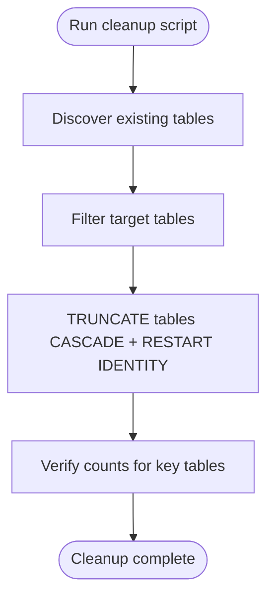
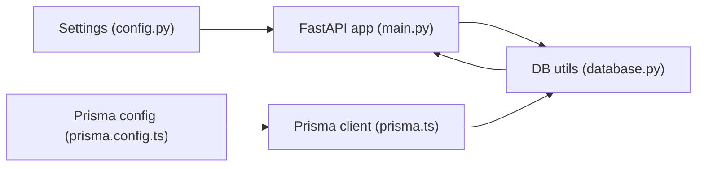

# Monitoring and Maintenance

<cite>
**Referenced Files in This Document**
- [main.py](file://english_pronunciation_app/backend/app/main.py)
- [config.py](file://english_pronunciation_app/backend/app/core/config.py)
- [database.py](file://english_pronunciation_app/backend/app/core/database.py)
- [prisma.ts](file://english_pronunciation_app/frontend/src/lib/prisma.ts)
- [prisma.config.ts](file://english_pronunciation_app/frontend/prisma.config.ts)
- [db_cleanup.ts](file://english_pronunciation_app/frontend/prisma/db_cleanup.ts)
- [STREAK_GAMIFICATION_GUIDE.md](file://PLAN/04_Features/STREAK_GAMIFICATION_GUIDE.md)
- [DB_AUDIT_REPORT.md](file://PLAN/02_Database_And_Data/DB_AUDIT_REPORT.md)
- [DailyRewardsPopup.tsx](file://english_pronunciation_app/frontend/src/components/gamification/DailyRewardsPopup.tsx)
- [useComboStreak.ts](file://english_pronunciation_app/frontend/src/hooks/useComboStreak.ts)
- [next.config.mjs](file://english_pronunciation_app/frontend/next.config.mjs)
- [package.json](file://english_pronunciation_app/frontend/package.json)
</cite>

## Table of Contents
1. [Introduction](#introduction)
2. [Project Structure](#project-structure)
3. [Core Components](#core-components)
4. [Architecture Overview](#architecture-overview)
5. [Detailed Component Analysis](#detailed-component-analysis)
6. [Dependency Analysis](#dependency-analysis)
7. [Performance Considerations](#performance-considerations)
8. [Troubleshooting Guide](#troubleshooting-guide)
9. [Conclusion](#conclusion)
10. [Appendices](#appendices)

## Introduction
This document provides comprehensive monitoring and maintenance guidance for the pronunciation learning platform. It covers backend application health checks, database connectivity verification, frontend logging configuration, analytics and user activity tracking, maintenance procedures for database cleanup and schema alignment, and operational best practices for reliability and performance. Where applicable, it references actual source files in the repository to ground recommendations in the current implementation.

## Project Structure
The platform comprises:
- Backend: FastAPI application exposing health and root endpoints, with database configuration and connection utilities.
- Frontend: Next.js application using Prisma for database access, with logging enabled for queries and warnings.

**Diagram sources**
- [main.py:1-43](file://english_pronunciation_app/backend/app/main.py#L1-L43)
- [config.py:1-34](file://english_pronunciation_app/backend/app/core/config.py#L1-L34)
- [database.py:1-51](file://english_pronunciation_app/backend/app/core/database.py#L1-L51)
- [prisma.ts:1-13](file://english_pronunciation_app/frontend/src/lib/prisma.ts#L1-L13)
- [prisma.config.ts:1-21](file://english_pronunciation_app/frontend/prisma.config.ts#L1-L21)
- [next.config.mjs:1-5](file://english_pronunciation_app/frontend/next.config.mjs#L1-L5)

**Section sources**
- [main.py:1-43](file://english_pronunciation_app/backend/app/main.py#L1-L43)
- [config.py:1-34](file://english_pronunciation_app/backend/app/core/config.py#L1-L34)
- [database.py:1-51](file://english_pronunciation_app/backend/app/core/database.py#L1-L51)
- [prisma.ts:1-13](file://english_pronunciation_app/frontend/src/lib/prisma.ts#L1-L13)
- [prisma.config.ts:1-21](file://english_pronunciation_app/frontend/prisma.config.ts#L1-L21)
- [next.config.mjs:1-5](file://english_pronunciation_app/frontend/next.config.mjs#L1-L5)

## Core Components
- Backend health endpoint: Returns service metadata and database health status.
- Database utilities: Centralized engine creation with connection pooling and pre-ping, plus a health checker that attempts a simple query.
- Frontend logging: Prisma client configured to log queries, errors, and warnings; Next.js configuration remains minimal.

Key capabilities:
- Health check endpoint validates runtime configuration and database connectivity.
- Database layer supports robust connection lifecycle and error reporting.
- Frontend logs database operations for diagnostics during development and production.

**Section sources**
- [main.py:25-43](file://english_pronunciation_app/backend/app/main.py#L25-L43)
- [database.py:15-51](file://english_pronunciation_app/backend/app/core/database.py#L15-L51)
- [prisma.ts:6-10](file://english_pronunciation_app/frontend/src/lib/prisma.ts#L6-L10)

## Architecture Overview
The monitoring and maintenance architecture integrates backend health checks with database connectivity verification and frontend logging.

**Diagram sources**
- [main.py:34-42](file://english_pronunciation_app/backend/app/main.py#L34-L42)
- [database.py:31-50](file://english_pronunciation_app/backend/app/core/database.py#L31-L50)

## Detailed Component Analysis

### Backend Application Health Monitoring
- Root endpoint: Provides service identity and operational status.
- Health endpoint: Aggregates service metadata and database connectivity status, enabling automated probes and alerting.

Operational notes:
- The health endpoint reports database status via a dedicated checker that executes a simple query and captures exceptions.
- Configure environment variables for app name, version, environment, and CORS origins to align with deployment targets.

**Section sources**
- [main.py:25-43](file://english_pronunciation_app/backend/app/main.py#L25-L43)
- [database.py:31-50](file://english_pronunciation_app/backend/app/core/database.py#L31-L50)
- [config.py:23-34](file://english_pronunciation_app/backend/app/core/config.py#L23-L34)

### Database Connectivity and Logging
- Engine configuration: Creates an SQLAlchemy engine with pre-ping enabled for connection resilience.
- Session management: Uses a factory-bound session maker to ensure proper lifecycle and closure.
- Health checker: Attempts a lightweight query to verify connectivity and returns structured status.

Frontend logging:
- Prisma client logs queries, errors, and warnings. This aids in diagnosing slow queries and operational anomalies during development and production.

**Section sources**
- [database.py:15-29](file://english_pronunciation_app/backend/app/core/database.py#L15-L29)
- [database.py:31-50](file://english_pronunciation_app/backend/app/core/database.py#L31-L50)
- [prisma.ts:6-10](file://english_pronunciation_app/frontend/src/lib/prisma.ts#L6-L10)

### User Activity Tracking and Analytics
The gamification feature documents analytics events and metrics that can serve as a foundation for operational dashboards and alerting thresholds.

- Analytics events: Daily reward claims, streak milestones, and resets.
- Metrics to monitor: Daily check-in rate, average streak length, retention (7-day and 30-day), and milestone completion rate.
- Implementation guidance: Use consistent event naming and payload schemas to enable automated aggregation and anomaly detection.

**Section sources**
- [STREAK_GAMIFICATION_GUIDE.md:440-475](file://PLAN/04_Features/STREAK_GAMIFICATION_GUIDE.md#L440-L475)
- [DailyRewardsPopup.tsx:1-239](file://english_pronunciation_app/frontend/src/components/gamification/DailyRewardsPopup.tsx#L1-L239)
- [useComboStreak.ts:1-75](file://english_pronunciation_app/frontend/src/hooks/useComboStreak.ts#L1-L75)

### Maintenance Procedures

#### Database Cleanup
- Purpose: Remove legacy and orphan data to align with planned schema and reduce noise.
- Approach: TRUNCATE all tables in the public schema with cascade and restart identity; preserves schema structure.
- Execution: Run the cleanup script; re-seed lessons afterward to populate valid content.

**Diagram sources**
- [db_cleanup.ts:52-86](file://english_pronunciation_app/frontend/prisma/db_cleanup.ts#L52-L86)

**Section sources**
- [db_cleanup.ts:1-86](file://english_pronunciation_app/frontend/prisma/db_cleanup.ts#L1-L86)
- [DB_AUDIT_REPORT.md:84-93](file://PLAN/02_Database_And_Data/DB_AUDIT_REPORT.md#L84-L93)

#### Schema and Migration Alignment
- Current state: Audit report indicates legacy seeds and lack of migration history.
- Recommendation: Adopt formal migrations to establish a verifiable schema history and prevent drift.

**Section sources**
- [DB_AUDIT_REPORT.md:78-82](file://PLAN/02_Database_And_Data/DB_AUDIT_REPORT.md#L78-L82)

#### Frontend Logging and Diagnostics
- Enable Prisma client logging to capture query execution, errors, and warnings.
- Keep Next.js configuration minimal while ensuring logs are captured by your platform’s logging stack.

**Section sources**
- [prisma.ts:6-10](file://english_pronunciation_app/frontend/src/lib/prisma.ts#L6-L10)
- [next.config.mjs:1-5](file://english_pronunciation_app/frontend/next.config.mjs#L1-L5)

## Dependency Analysis
The backend depends on configuration and database utilities, while the frontend depends on Prisma configuration and client logging.

**Diagram sources**
- [config.py:23-34](file://english_pronunciation_app/backend/app/core/config.py#L23-L34)
- [main.py:1-14](file://english_pronunciation_app/backend/app/main.py#L1-L14)
- [database.py:15-17](file://english_pronunciation_app/backend/app/core/database.py#L15-L17)
- [prisma.config.ts:6-20](file://english_pronunciation_app/frontend/prisma.config.ts#L6-L20)
- [prisma.ts:1-13](file://english_pronunciation_app/frontend/src/lib/prisma.ts#L1-L13)

**Section sources**
- [config.py:23-34](file://english_pronunciation_app/backend/app/core/config.py#L23-L34)
- [main.py:1-14](file://english_pronunciation_app/backend/app/main.py#L1-L14)
- [database.py:15-17](file://english_pronunciation_app/backend/app/core/database.py#L15-L17)
- [prisma.config.ts:6-20](file://english_pronunciation_app/frontend/prisma.config.ts#L6-L20)
- [prisma.ts:1-13](file://english_pronunciation_app/frontend/src/lib/prisma.ts#L1-L13)

## Performance Considerations
- Database connection resilience: Pre-ping ensures stale connections are detected and refreshed.
- Logging overhead: Enable Prisma query logging selectively in staging/production to avoid excessive I/O.
- Health checks: Keep the health endpoint lightweight; it currently performs a simple query suitable for frequent probing.

[No sources needed since this section provides general guidance]

## Troubleshooting Guide

Common issues and resolutions:
- Database not configured: The database utilities raise a runtime error if the connection URL is missing. Ensure the DATABASE_URL environment variable is set.
- Health check fails: The health endpoint returns an error status with the exception message. Inspect the returned message to diagnose connectivity or permission problems.
- Excessive frontend logs: Adjust Prisma client logging levels or disable in production to reduce noise.
- Legacy data inconsistencies: Use the cleanup script to remove orphaned data and re-seed lessons to restore a clean state.

**Section sources**
- [database.py:20-28](file://english_pronunciation_app/backend/app/core/database.py#L20-L28)
- [database.py:31-50](file://english_pronunciation_app/backend/app/core/database.py#L31-L50)
- [prisma.ts:6-10](file://english_pronunciation_app/frontend/src/lib/prisma.ts#L6-L10)
- [db_cleanup.ts:52-86](file://english_pronunciation_app/frontend/prisma/db_cleanup.ts#L52-L86)

## Conclusion
The platform includes essential building blocks for monitoring and maintenance: a health endpoint with database verification, resilient database connections, and frontend logging via Prisma. Operational readiness can be strengthened by adopting formal migrations, establishing analytics-driven metrics, and implementing targeted alerting around health, performance, and security indicators.

[No sources needed since this section summarizes without analyzing specific files]

## Appendices

### Alerting Mechanisms (Recommended)
- Critical system failures: Monitor backend health endpoint availability and database status field for error conditions.
- Performance degradation: Track database query durations and Prisma client logs for slow queries; correlate with user-reported latency.
- Security incidents: Watch for repeated authentication failures and unexpected administrative actions; integrate with centralized logging for correlation.

[No sources needed since this section provides general guidance]

### Backup and Restore Procedures (Recommended)
- Database backups: Schedule regular logical backups of the PostgreSQL database; test restoration procedures periodically.
- Configuration backups: Version control environment variables and Prisma configuration; maintain separate secrets management.
- Rollback strategy: Maintain recent backups and documented migration steps to revert schema changes if needed.

[No sources needed since this section provides general guidance]

### Log Rotation and Management (Recommended)
- Rotate logs by size/time using platform-native log rotators; retain logs for compliance and forensic analysis windows.
- Forward application logs to a centralized logging system for querying and alerting.

[No sources needed since this section provides general guidance]

### System Health Validation (Recommended)
- Automated probes: Use the health endpoint for liveness/readiness checks in container orchestrators.
- Capacity planning: Monitor database connection pool utilization, query execution times, and frontend error rates to inform scaling decisions.

[No sources needed since this section provides general guidance]