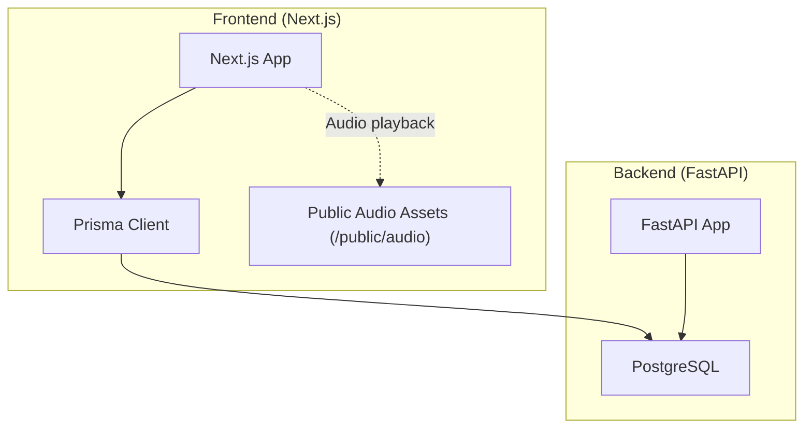
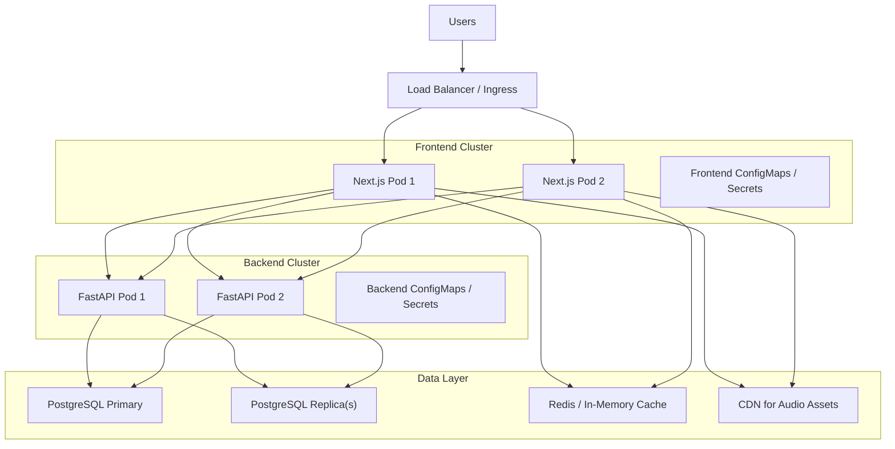
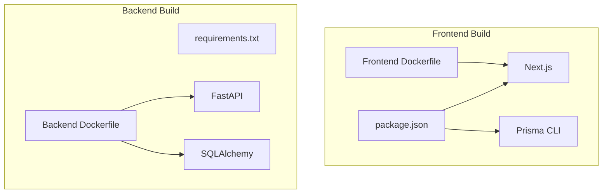

# Scaling and Infrastructure

<cite>
**Referenced Files in This Document**
- [main.py](file://english_pronunciation_app/backend/app/main.py)
- [config.py](file://english_pronunciation_app/backend/app/core/config.py)
- [database.py](file://english_pronunciation_app/backend/app/core/database.py)
- [Dockerfile (backend)](file://english_pronunciation_app/backend/Dockerfile)
- [Dockerfile (frontend)](file://english_pronunciation_app/frontend/Dockerfile)
- [docker-compose.yml](file://english_pronunciation_app/docker-compose.yml)
- [package.json](file://english_pronunciation_app/frontend/package.json)
- [next.config.mjs](file://english_pronunciation_app/frontend/next.config.mjs)
- [schema.prisma](file://english_pronunciation_app/frontend/prisma/schema.prisma)
- [prisma.ts](file://english_pronunciation_app/frontend/src/lib/prisma.ts)
- [prisma.config.ts](file://english_pronunciation_app/frontend/prisma.config.ts)
- [seed_audio_local.ts](file://docs/superpowers/plans/2026-06-18-sp3a-content-cd1-audio-local.md)
- [GOOGLE_OAUTH_SETUP.md](file://english_pronunciation_app/frontend/GOOGLE_OAUTH_SETUP.md)
- [SKILL.md (deployment)](file://english_pronunciation_app/.agents/skills/deployment/SKILL.md)
- [SKILL.md (postgresql_expert)](file://english_pronunciation_app/.agents/skills/postgresql_expert/SKILL.md)
</cite>

## Table of Contents
1. [Introduction](#introduction)
2. [Project Structure](#project-structure)
3. [Core Components](#core-components)
4. [Architecture Overview](#architecture-overview)
5. [Detailed Component Analysis](#detailed-component-analysis)
6. [Dependency Analysis](#dependency-analysis)
7. [Performance Considerations](#performance-considerations)
8. [Troubleshooting Guide](#troubleshooting-guide)
9. [Conclusion](#conclusion)
10. [Appendices](#appendices)

## Introduction
This document provides comprehensive scaling and infrastructure guidance for the pronunciation learning platform. It covers horizontal and vertical scaling strategies for the Next.js frontend and FastAPI backend, load balancing, auto-scaling policies, database connection pooling, infrastructure requirements across traffic scales, CDN configuration for audio assets, caching strategies, microservices architecture considerations, container orchestration with Kubernetes, cloud provider-specific configurations, cost optimization, resource allocation policies, performance benchmarking, disaster recovery, high availability, and geographic distribution strategies.

## Project Structure
The platform consists of:
- Frontend: Next.js application with App Router, Prisma ORM, and audio asset management.
- Backend: FastAPI service with SQLAlchemy ORM and database connectivity.
- Shared data: PostgreSQL database accessed via Prisma (frontend) and SQLAlchemy (backend).
- Local audio assets: MP3 files under frontend/public/audio managed by a seeding script.

**Diagram sources**
- [main.py:1-43](file://english_pronunciation_app/backend/app/main.py#L1-L43)
- [database.py:1-51](file://english_pronunciation_app/backend/app/core/database.py#L1-L51)
- [schema.prisma:1-501](file://english_pronunciation_app/frontend/prisma/schema.prisma#L1-L501)
- [prisma.ts:1-12](file://english_pronunciation_app/frontend/src/lib/prisma.ts#L1-L12)
- [seed_audio_local.ts:375-521](file://docs/superpowers/plans/2026-06-18-sp3a-content-cd1-audio-local.md#L375-L521)

**Section sources**
- [main.py:1-43](file://english_pronunciation_app/backend/app/main.py#L1-L43)
- [database.py:1-51](file://english_pronunciation_app/backend/app/core/database.py#L1-L51)
- [schema.prisma:1-501](file://english_pronunciation_app/frontend/prisma/schema.prisma#L1-L501)
- [prisma.ts:1-12](file://english_pronunciation_app/frontend/src/lib/prisma.ts#L1-L12)
- [seed_audio_local.ts:375-521](file://docs/superpowers/plans/2026-06-18-sp3a-content-cd1-audio-local.md#L375-L521)

## Core Components
- Next.js Frontend
  - App Router pages and API routes.
  - Prisma client for database access.
  - Audio assets served from frontend/public/audio.
- FastAPI Backend
  - Health endpoint and CORS middleware.
  - Database connectivity via SQLAlchemy with connection pooling.
- Database
  - PostgreSQL with Prisma schema and SQLAlchemy engine.
- Audio Asset Management
  - Local MP3 storage with automated seeding from external APIs.

Key implementation references:
- [main.py:1-43](file://english_pronunciation_app/backend/app/main.py#L1-L43)
- [config.py:1-34](file://english_pronunciation_app/backend/app/core/config.py#L1-L34)
- [database.py:1-51](file://english_pronunciation_app/backend/app/core/database.py#L1-L51)
- [schema.prisma:1-501](file://english_pronunciation_app/frontend/prisma/schema.prisma#L1-L501)
- [prisma.ts:1-12](file://english_pronunciation_app/frontend/src/lib/prisma.ts#L1-L12)
- [seed_audio_local.ts:375-521](file://docs/superpowers/plans/2026-06-18-sp3a-content-cd1-audio-local.md#L375-L521)

**Section sources**
- [main.py:1-43](file://english_pronunciation_app/backend/app/main.py#L1-L43)
- [config.py:1-34](file://english_pronunciation_app/backend/app/core/config.py#L1-L34)
- [database.py:1-51](file://english_pronunciation_app/backend/app/core/database.py#L1-L51)
- [schema.prisma:1-501](file://english_pronunciation_app/frontend/prisma/schema.prisma#L1-L501)
- [prisma.ts:1-12](file://english_pronunciation_app/frontend/src/lib/prisma.ts#L1-L12)
- [seed_audio_local.ts:375-521](file://docs/superpowers/plans/2026-06-18-sp3a-content-cd1-audio-local.md#L375-L521)

## Architecture Overview
High-level architecture for the pronunciation learning platform with scalable components and data flows.

**Diagram sources**
- [main.py:1-43](file://english_pronunciation_app/backend/app/main.py#L1-L43)
- [database.py:1-51](file://english_pronunciation_app/backend/app/core/database.py#L1-L51)
- [schema.prisma:1-501](file://english_pronunciation_app/frontend/prisma/schema.prisma#L1-L501)
- [prisma.ts:1-12](file://english_pronunciation_app/frontend/src/lib/prisma.ts#L1-L12)
- [seed_audio_local.ts:375-521](file://docs/superpowers/plans/2026-06-18-sp3a-content-cd1-audio-local.md#L375-L521)

## Detailed Component Analysis

### Next.js Frontend Scaling
- Horizontal Scaling
  - Stateless Next.js pods behind a load balancer.
  - Use Kubernetes Deployments with HPA based on CPU/memory or custom metrics.
- Vertical Scaling
  - Increase CPU/memory requests/limits per pod for compute-heavy pages.
- Static Assets and Audio
  - Serve static Next.js assets from CDN.
  - Host audio MP3s on CDN with cache-control headers; fallback to local storage if needed.
- Caching Strategies
  - Browser caching for static assets; cache-busting via file hashes.
  - Application-level caching for non-sensitive data using Redis.
- Containerization
  - Multi-stage Docker build targeting production runtime.
- Observability
  - Enable Next.js telemetry and structured logging.
  - Use metrics (requests, errors, latency) for autoscaling signals.

References:
- [Dockerfile (frontend)](file://english_pronunciation_app/frontend/Dockerfile)
- [package.json:1-45](file://english_pronunciation_app/frontend/package.json#L1-L45)
- [next.config.mjs:1-5](file://english_pronunciation_app/frontend/next.config.mjs#L1-L5)
- [seed_audio_local.ts:375-521](file://docs/superpowers/plans/2026-06-18-sp3a-content-cd1-audio-local.md#L375-L521)

**Section sources**
- [Dockerfile (frontend)](file://english_pronunciation_app/frontend/Dockerfile)
- [package.json:1-45](file://english_pronunciation_app/frontend/package.json#L1-L45)
- [next.config.mjs:1-5](file://english_pronunciation_app/frontend/next.config.mjs#L1-L5)
- [seed_audio_local.ts:375-521](file://docs/superpowers/plans/2026-06-18-sp3a-content-cd1-audio-local.md#L375-L521)

### FastAPI Backend Scaling
- Horizontal Scaling
  - Stateless FastAPI pods behind a load balancer.
  - Use Uvicorn workers per pod; scale pods via HPA.
- Vertical Scaling
  - Adjust CPU/memory limits; tune worker count based on I/O and CPU-bound tasks.
- Database Connection Pooling
  - SQLAlchemy engine with pre-ping enabled; configure pool size and timeouts.
- Health Checks and Readiness
  - Use /health endpoint for readiness probes.
- Containerization
  - Python slim image with Uvicorn entrypoint.
- Observability
  - Expose Prometheus metrics; monitor error rates and latency.

References:
- [main.py:1-43](file://english_pronunciation_app/backend/app/main.py#L1-L43)
- [config.py:1-34](file://english_pronunciation_app/backend/app/core/config.py#L1-L34)
- [database.py:1-51](file://english_pronunciation_app/backend/app/core/database.py#L1-L51)
- [Dockerfile (backend)](file://english_pronunciation_app/backend/Dockerfile)

**Section sources**
- [main.py:1-43](file://english_pronunciation_app/backend/app/main.py#L1-L43)
- [config.py:1-34](file://english_pronunciation_app/backend/app/core/config.py#L1-L34)
- [database.py:1-51](file://english_pronunciation_app/backend/app/core/database.py#L1-L51)
- [Dockerfile (backend)](file://english_pronunciation_app/backend/Dockerfile)

### Database Layer (PostgreSQL)
- Connection Pooling
  - SQLAlchemy engine with pool_pre_ping; configure pool_size and max_overflow.
- Read Replicas
  - Use replica instances for reporting and read-heavy queries.
- Indexing and Constraints
  - Follow schema-defined indexes; add partial indexes for soft deletes and composite filters.
- Security
  - Enforce RLS for tenant isolation; parameterized queries; secrets management.
- Migration Strategy
  - Prefer migration-based schema management for production.

References:
- [schema.prisma:1-501](file://english_pronunciation_app/frontend/prisma/schema.prisma#L1-L501)
- [prisma.ts:1-12](file://english_pronunciation_app/frontend/src/lib/prisma.ts#L1-L12)
- [prisma.config.ts:1-20](file://english_pronunciation_app/frontend/prisma.config.ts#L1-L20)
- [SKILL.md (postgresql_expert):45-211](file://english_pronunciation_app/.agents/skills/postgresql_expert/SKILL.md#L45-L211)

**Section sources**
- [schema.prisma:1-501](file://english_pronunciation_app/frontend/prisma/schema.prisma#L1-L501)
- [prisma.ts:1-12](file://english_pronunciation_app/frontend/src/lib/prisma.ts#L1-L12)
- [prisma.config.ts:1-20](file://english_pronunciation_app/frontend/prisma.config.ts#L1-L20)
- [SKILL.md (postgresql_expert):45-211](file://english_pronunciation_app/.agents/skills/postgresql_expert/SKILL.md#L45-L211)

### Audio Asset Delivery
- Local Storage
  - Store MP3s under frontend/public/audio; serve via Next.js static assets.
- CDN Strategy
  - Upload audio to CDN with immutable cache headers; use origin pull or push.
  - Fallback to local storage if CDN is unavailable.
- Seeding Pipeline
  - Automated script downloads audio from external APIs and updates DB records.

References:
- [seed_audio_local.ts:375-521](file://docs/superpowers/plans/2026-06-18-sp3a-content-cd1-audio-local.md#L375-L521)

**Section sources**
- [seed_audio_local.ts:375-521](file://docs/superpowers/plans/2026-06-18-sp3a-content-cd1-audio-local.md#L375-L521)

### Load Balancing and Auto-Scaling
- Load Balancer
  - Ingress controller with sticky sessions disabled for stateless apps.
- Auto-Scaling
  - HPA targets CPU/utilization or custom metrics (RPS, latency).
  - Minimum pods to maintain cold-start performance; maximum to cap costs.
- Health Checks
  - Use /health for readiness/liveness probes.

References:
- [main.py:34-42](file://english_pronunciation_app/backend/app/main.py#L34-L42)
- [SKILL.md (deployment):122-234](file://english_pronunciation_app/.agents/skills/deployment/SKILL.md#L122-L234)

**Section sources**
- [main.py:34-42](file://english_pronunciation_app/backend/app/main.py#L34-L42)
- [SKILL.md (deployment):122-234](file://english_pronunciation_app/.agents/skills/deployment/SKILL.md#L122-L234)

### Microservices and Orchestration
- Current Monolith
  - Single Next.js app and single FastAPI service.
- Future Microservices
  - Split backend into domain services (exercises, user, gamification) with API gateways.
- Kubernetes
  - Separate Deployments, Services, HPA, ConfigMaps, Secrets.
  - Use namespaces for environments; manage rollout strategies (blue/green or canary).

References:
- [SKILL.md (deployment):122-234](file://english_pronunciation_app/.agents/skills/deployment/SKILL.md#L122-L234)

**Section sources**
- [SKILL.md (deployment):122-234](file://english_pronunciation_app/.agents/skills/deployment/SKILL.md#L122-L234)

### Cloud Provider Considerations
- AWS
  - ALB/NLB, ECS/EKS, RDS with read replicas, ElastiCache/Redis, CloudFront CDN.
- Azure
  - Application Gateway, AKS, Azure Database for PostgreSQL, Cache for Redis, CDN.
- GCP
  - Cloud Load Balancing, GKE, Cloud SQL, Memorystore, Cloud CDN.
- General
  - Use managed databases and CDNs to reduce operational overhead.

[No sources needed since this section provides general guidance]

### Cost Optimization
- Resource Allocation
  - Right-size CPU/memory; enable autoscaling; set min/max pods.
- Storage
  - Archive infrequent audio; use CDN caching to reduce origin bandwidth.
- Database
  - Use read replicas; connection pooling; optimize queries.
- Observability
  - Consolidate logs/metrics; disable noisy debug logs in production.

[No sources needed since this section provides general guidance]

### Performance Benchmarking
- Metrics
  - Latency (p50/p95/p99), throughput (RPS), error rate, database query time.
- Tools
  - Locust/K6 for load tests; Prometheus/Grafana for dashboards.
- Baselines
  - Establish baselines per feature (exercise playback, submission, leaderboard).

[No sources needed since this section provides general guidance]

## Dependency Analysis
Runtime and build-time dependencies for frontend and backend.

**Diagram sources**
- [package.json:1-45](file://english_pronunciation_app/frontend/package.json#L1-L45)
- [Dockerfile (frontend)](file://english_pronunciation_app/frontend/Dockerfile)
- [Dockerfile (backend)](file://english_pronunciation_app/backend/Dockerfile)

**Section sources**
- [package.json:1-45](file://english_pronunciation_app/frontend/package.json#L1-L45)
- [Dockerfile (frontend)](file://english_pronunciation_app/frontend/Dockerfile)
- [Dockerfile (backend)](file://english_pronunciation_app/backend/Dockerfile)

## Performance Considerations
- Database
  - Connection pooling, read replicas, indexing strategy, vacuum/analyze.
- Frontend
  - Static generation, ISR, CDN caching, asset optimization.
- Backend
  - Worker tuning, async I/O, caching, health checks.
- Audio
  - Pre-warm CDN caches; compress where appropriate; use adaptive bitrate if live streaming.

[No sources needed since this section provides general guidance]

## Troubleshooting Guide
- Health Endpoint
  - Verify /health response for environment and database status.
- Database Connectivity
  - Check DATABASE_URL and engine initialization; confirm pool_pre_ping.
- Authentication
  - Ensure OAuth client IDs and redirect URIs match deployment URLs.
- Local Audio
  - Confirm seeded audio files exist and DB audioUrl fields are updated.

References:
- [main.py:34-42](file://english_pronunciation_app/backend/app/main.py#L34-L42)
- [database.py:31-51](file://english_pronunciation_app/backend/app/core/database.py#L31-L51)
- [GOOGLE_OAUTH_SETUP.md:57-107](file://english_pronunciation_app/frontend/GOOGLE_OAUTH_SETUP.md#L57-L107)
- [seed_audio_local.ts:375-521](file://docs/superpowers/plans/2026-06-18-sp3a-content-cd1-audio-local.md#L375-L521)

**Section sources**
- [main.py:34-42](file://english_pronunciation_app/backend/app/main.py#L34-L42)
- [database.py:31-51](file://english_pronunciation_app/backend/app/core/database.py#L31-L51)
- [GOOGLE_OAUTH_SETUP.md:57-107](file://english_pronunciation_app/frontend/GOOGLE_OAUTH_SETUP.md#L57-L107)
- [seed_audio_local.ts:375-521](file://docs/superpowers/plans/2026-06-18-sp3a-content-cd1-audio-local.md#L375-L521)

## Conclusion
The pronunciation learning platform can be scaled horizontally and vertically across Next.js and FastAPI while leveraging PostgreSQL with connection pooling, CDN-delivered audio assets, and robust caching strategies. Adopt Kubernetes for orchestration, implement auto-scaling policies, and establish monitoring and disaster recovery procedures to ensure high availability and cost efficiency.

[No sources needed since this section summarizes without analyzing specific files]

## Appendices

### Infrastructure Requirements by Traffic Scale
- Low Traffic
  - Small Next.js and FastAPI nodes; embedded or small managed DB; basic CDN caching.
- Medium Traffic
  - Multiple frontend/backend pods; read replicas; Redis cache; CDN with regional edge.
- High Traffic
  - Autoscaling enabled; multiple DB replicas; CDN with origin pull; microservices separation.

[No sources needed since this section provides general guidance]

### Disaster Recovery and High Availability
- Backups
  - Automated DB backups with point-in-time recovery.
- Failover
  - Multi-AZ DB; replica promotion; DNS failover.
- Geo-Distribution
  - CDN edge locations; colocated regions for latency.

[No sources needed since this section provides general guidance]