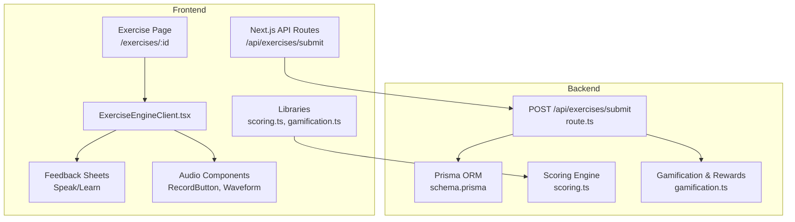
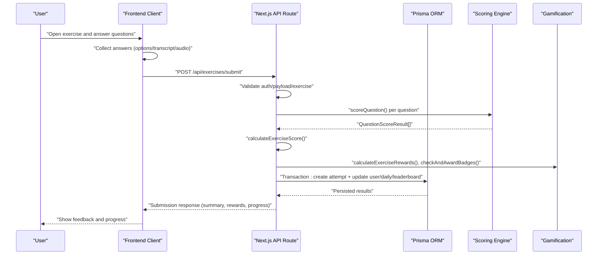
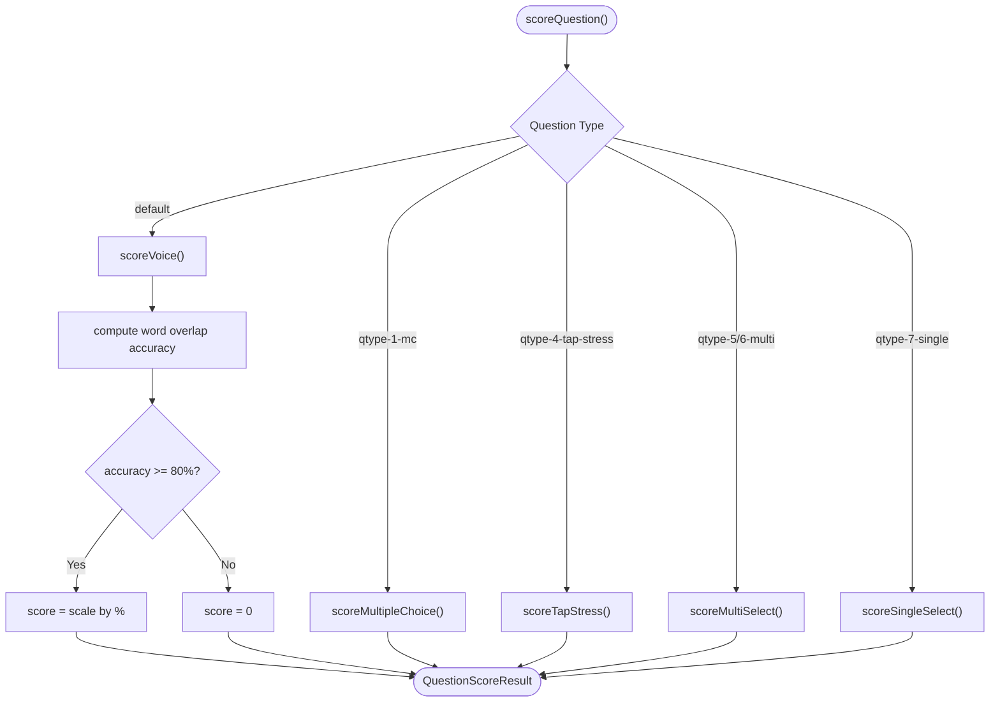
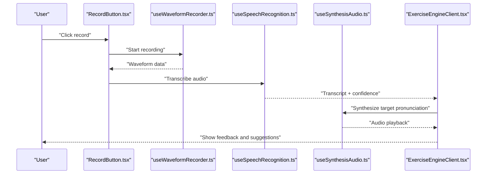
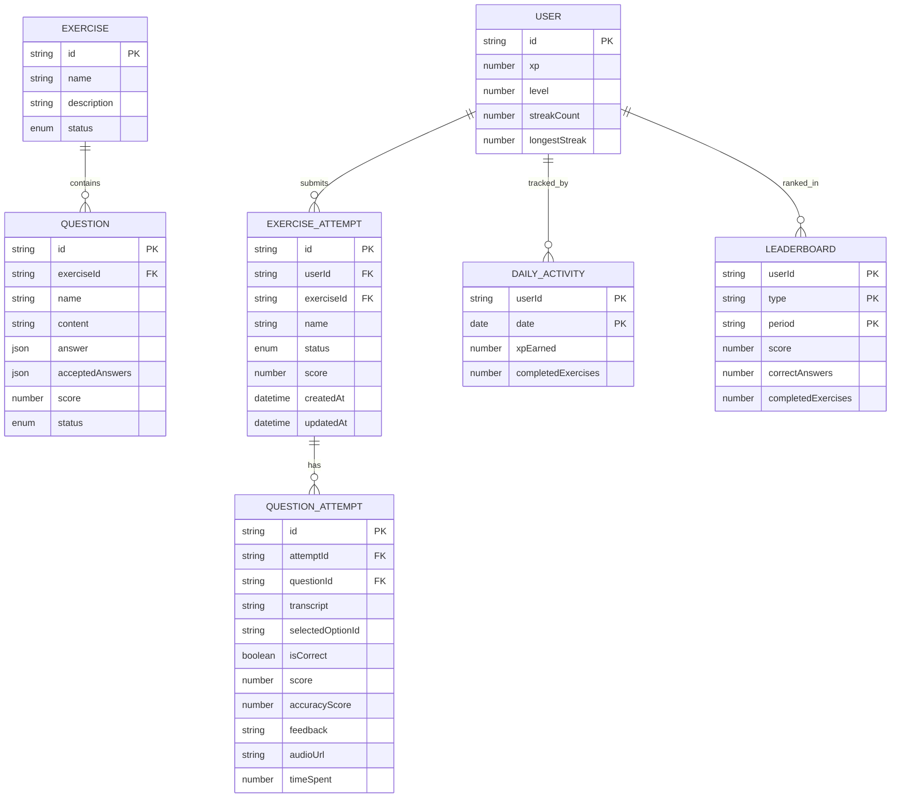
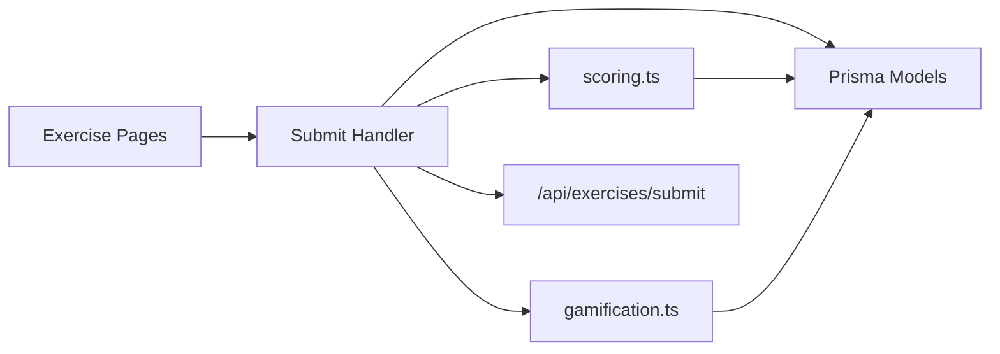

# API Integration and Submission Processing

<cite>
**Referenced Files in This Document**
- [route.ts](file://english_pronunciation_app/frontend/src/app/api/exercises/submit/route.ts)
- [scoring.ts](file://english_pronunciation_app/frontend/src/lib/scoring.ts)
- [page.tsx](file://english_pronunciation_app/frontend/src/app/exercises/[id]/page.tsx)
- [page.tsx](file://english_pronunciation_app/frontend/src/app/exercises/page.tsx)
- [ExerciseEngineClient.tsx](file://english_pronunciation_app/frontend/src/app/exercises/[id]/ExerciseEngineClient.tsx)
- [SpeakFeedbackSheet.tsx](file://english_pronunciation_app/frontend/src/app/exercises/[id]/SpeakFeedbackSheet.tsx)
- [ListenFeedbackSheet.tsx](file://english_pronunciation_app/frontend/src/app/exercises/[id]/ListenFeedbackSheet.tsx)
- [useSynthesisAudio.ts](file://english_pronunciation_app/frontend/src/app/exercises/[id]/useSynthesisAudio.ts)
- [RecordButton.tsx](file://english_pronunciation_app/frontend/src/components/audio/RecordButton.tsx)
- [useWaveformRecorder.ts](file://english_pronunciation_app/frontend/src/lib/useWaveformRecorder.ts)
- [useSpeechRecognition.ts](file://english_pronunciation_app/frontend/src/lib/useSpeechRecognition.ts)
- [gamification.ts](file://english_pronunciation_app/frontend/src/lib/gamification.ts)
- [levelSystem.ts](file://english_pronunciation_app/frontend/src/lib/levelSystem.ts)
- [schema.prisma](file://english_pronunciation_app/frontend/prisma/schema.prisma)
</cite>

## Table of Contents
1. [Introduction](#introduction)
2. [Project Structure](#project-structure)
3. [Core Components](#core-components)
4. [Architecture Overview](#architecture-overview)
5. [Detailed Component Analysis](#detailed-component-analysis)
6. [Dependency Analysis](#dependency-analysis)
7. [Performance Considerations](#performance-considerations)
8. [Troubleshooting Guide](#troubleshooting-guide)
9. [Conclusion](#conclusion)

## Introduction
This document explains the exercise API integration and submission processing pipeline for an English pronunciation training application. It covers:
- Exercise retrieval endpoints and frontend rendering
- Submission handling and validation
- Result evaluation and scoring algorithms
- Feedback generation and progress tracking
- Synthesis audio processing for pronunciation assessment
- Real-time feedback delivery
- API endpoint specifications, request/response schemas, and error handling patterns
- Performance considerations for large exercises, caching strategies, and offline submission handling
- Frontend-backend integration between exercise components and backend services

## Project Structure
The system is a Next.js application with a frontend and a backend service. The frontend handles exercise presentation, audio recording, and submission to backend APIs. The backend validates submissions, evaluates answers, updates user progress, and manages gamification rewards.

**Diagram sources**
- [route.ts:47-331](file://english_pronunciation_app/frontend/src/app/api/exercises/submit/route.ts#L47-L331)
- [page.tsx:47-91](file://english_pronunciation_app/frontend/src/app/exercises/[id]/page.tsx#L47-L91)
- [ExerciseEngineClient.tsx](file://english_pronunciation_app/frontend/src/app/exercises/[id]/ExerciseEngineClient.tsx)
- [scoring.ts:1-227](file://english_pronunciation_app/frontend/src/lib/scoring.ts#L1-L227)
- [gamification.ts](file://english_pronunciation_app/frontend/src/lib/gamification.ts)
- [schema.prisma](file://english_pronunciation_app/frontend/prisma/schema.prisma)

**Section sources**
- [page.tsx:14-137](file://english_pronunciation_app/frontend/src/app/exercises/page.tsx#L14-L137)
- [page.tsx:47-91](file://english_pronunciation_app/frontend/src/app/exercises/[id]/page.tsx#L47-L91)
- [route.ts:47-331](file://english_pronunciation_app/frontend/src/app/api/exercises/submit/route.ts#L47-L331)

## Core Components
- Exercise retrieval and rendering:
  - Exercise listing and detail pages fetch ACTIVE exercises and render question metadata.
- Submission endpoint:
  - Validates authentication, payload, and exercise state; scores answers; persists attempts; updates user XP, level, daily activity, leaderboard, and badges.
- Scoring engine:
  - Implements question-type-specific scoring (multiple choice, voice transcription with overlap accuracy, tap stress, multi-select, single select).
- Gamification and progress:
  - Calculates XP rewards, determines level-ups, updates daily activity, leaderboard entries, and checks for badge awards.
- Audio and feedback:
  - Provides waveform recording, speech recognition, synthesis audio hooks, and feedback sheets for speak/listen exercises.

**Section sources**
- [page.tsx:47-91](file://english_pronunciation_app/frontend/src/app/exercises/[id]/page.tsx#L47-L91)
- [route.ts:47-331](file://english_pronunciation_app/frontend/src/app/api/exercises/submit/route.ts#L47-L331)
- [scoring.ts:191-227](file://english_pronunciation_app/frontend/src/lib/scoring.ts#L191-L227)
- [gamification.ts](file://english_pronunciation_app/frontend/src/lib/gamification.ts)

## Architecture Overview
The frontend renders exercises and captures user interactions (selections, audio). Submissions are sent to the backend via a protected API endpoint. The backend performs validation, scoring, and persistence within a transaction. Results include per-question feedback, exercise summary, XP rewards, level progression, daily stats, leaderboard deltas, and badges.

**Diagram sources**
- [route.ts:47-331](file://english_pronunciation_app/frontend/src/app/api/exercises/submit/route.ts#L47-L331)
- [scoring.ts:191-227](file://english_pronunciation_app/frontend/src/lib/scoring.ts#L191-L227)
- [gamification.ts](file://english_pronunciation_app/frontend/src/lib/gamification.ts)

## Detailed Component Analysis

### Exercise Retrieval Endpoints
- GET /exercises:
  - Fetches ACTIVE exercises with associated topic, level, map, and question counts.
  - Renders a grid of exercises with status badges and links to individual exercise pages.
- GET /exercises/:id:
  - Loads an ACTIVE exercise with its ACTIVE questions and options.
  - Builds a normalized question dataset for client-side rendering.

Key behaviors:
- Status filtering ensures only ACTIVE and non-ARCHIVED exercises are presented.
- Options parsing supports both explicit options and embedded JSON in question content.

**Section sources**
- [page.tsx:14-137](file://english_pronunciation_app/frontend/src/app/exercises/page.tsx#L14-L137)
- [page.tsx:47-91](file://english_pronunciation_app/frontend/src/app/exercises/[id]/page.tsx#L47-L91)

### Submission Endpoint: POST /api/exercises/submit
Purpose:
- Accepts exercise answers, validates them, scores each question, computes totals, and persists the attempt with side effects (XP, level, daily activity, leaderboard, badges).

Request schema:
- Body fields:
  - exerciseId: string (required)
  - startedAt: string (optional ISO timestamp)
  - completedAt: string (optional ISO timestamp)
  - answers: array of SubmitAnswerInput (required, non-empty)
- SubmitAnswerInput fields:
  - questionId: string (required)
  - selectedOptionId: string|null (optional)
  - selectedText: string|null (optional)
  - transcript: string|null (optional)
  - audioUrl: string|null (optional)
  - timeSpent: number|null (optional)

Validation rules:
- Authentication required; returns UNAUTHENTICATED on missing session.
- exerciseId must be a non-empty string; returns VALIDATION_ERROR otherwise.
- answers must be a non-empty array of valid objects; returns EMPTY_ANSWERS or VALIDATION_ERROR accordingly.
- All questionIds must belong to the exercise; returns QUESTION_NOT_IN_EXERCISE if mismatch.
- No duplicate questionIds are allowed; returns VALIDATION_ERROR if duplicates detected.

Processing steps:
- Load exercise with ACTIVE questions and options.
- For each answer, map to question and score using scoreQuestion().
- Compute exerciseScore, rating, completion status.
- Retrieve previous best attempt and daily activity for reward calculations.
- Calculate rewards via calculateExerciseRewards().
- Persist within Prisma transaction:
  - Create exerciseAttempt with nested questionAttempts.
  - Update user XP and level.
  - Upsert dailyActivity.
  - Upsert leaderboard entries for target periods.
  - Award badges via checkAndAwardBadges().

Response schema:
- Fields include attempt ID, exerciseScore, maxScore, completion flag, rating, summary metrics, rewards breakdown, progress (current XP, level, next level threshold), dailyActivity snapshot, badges awarded, previousBestScore, streak info, and per-question results (isCorrect, score, accuracyScore, feedback).

Error handling:
- Returns structured errors with code/message/status for validation failures, not found, unauthenticated, and internal server errors.

**Section sources**
- [route.ts:20-39](file://english_pronunciation_app/frontend/src/app/api/exercises/submit/route.ts#L20-L39)
- [route.ts:47-331](file://english_pronunciation_app/frontend/src/app/api/exercises/submit/route.ts#L47-L331)

### Scoring Algorithm Implementation
Supported question types and scoring logic:
- Multiple Choice (qtype-1-mc):
  - Exact text match preferred; falls back to normalized match if exact fails but normalization yields non-empty strings.
- Voice (qtype-2-voice):
  - Multi-candidate acceptance (including acceptedAnswers) computes word overlap accuracy; correctness threshold ≥ 80%; score scaled by percentage.
- Tap Stress (qtype-4-tap-stress):
  - Selects option by index; correctness compares to target stress index.
- Multi-select (qtype-5-choose-weak, qtype-6-choose-linking):
  - Answer and selection are split by commas, normalized, and compared as sets for equality.
- Single Select (qtype-7-choose-assimilation):
  - Exact match against selected option content (IPA characters preserved).
- General:
  - scoreQuestion() dispatches to the appropriate scorer based on question type id.
  - calculateExerciseScore() aggregates per-question results into raw/max/exerciseScore and correct count.
  - getExerciseRating() maps exerciseScore to NEEDS_PRACTICE/PASS/GOOD/EXCELLENT.
  - isExerciseCompleted() defines passing threshold.

**Diagram sources**
- [scoring.ts:74-201](file://english_pronunciation_app/frontend/src/lib/scoring.ts#L74-L201)

**Section sources**
- [scoring.ts:191-227](file://english_pronunciation_app/frontend/src/lib/scoring.ts#L191-L227)

### Feedback Generation and Progress Tracking
Feedback generation:
- Per-question feedback strings are computed during scoring (e.g., correctness messages).
- Exercise rating and completion flags inform UI messaging and gamification triggers.

Progress tracking:
- User XP and level updates occur after successful submission.
- DailyActivity tracks XP earned and completed exercises for the day.
- Leaderboard entries are upserted for configured periods with ranking deltas.
- Badges are checked and awarded post-submission.

**Section sources**
- [route.ts:172-274](file://english_pronunciation_app/frontend/src/app/api/exercises/submit/route.ts#L172-L274)
- [gamification.ts](file://english_pronunciation_app/frontend/src/lib/gamification.ts)

### Synthesis Audio Processing and Real-Time Feedback
Audio capture and processing:
- RecordButton.tsx provides recording controls and waveform visualization.
- useWaveformRecorder.ts manages audio recording lifecycle and waveform data.
- useSpeechRecognition.ts integrates browser Web Speech API for live transcription feedback.
- useSynthesisAudio.ts orchestrates TTS synthesis for pronunciation targets and feedback.

Real-time feedback delivery:
- During speak exercises, users receive immediate feedback based on accuracy thresholds and question type.
- Feedback sheets (SpeakFeedbackSheet.tsx, ListenFeedbackSheet.tsx) present detailed results and suggestions.

**Diagram sources**
- [RecordButton.tsx](file://english_pronunciation_app/frontend/src/components/audio/RecordButton.tsx)
- [useWaveformRecorder.ts](file://english_pronunciation_app/frontend/src/lib/useWaveformRecorder.ts)
- [useSpeechRecognition.ts](file://english_pronunciation_app/frontend/src/lib/useSpeechRecognition.ts)
- [useSynthesisAudio.ts](file://english_pronunciation_app/frontend/src/app/exercises/[id]/useSynthesisAudio.ts)
- [SpeakFeedbackSheet.tsx](file://english_pronunciation_app/frontend/src/app/exercises/[id]/SpeakFeedbackSheet.tsx)
- [ListenFeedbackSheet.tsx](file://english_pronunciation_app/frontend/src/app/exercises/[id]/ListenFeedbackSheet.tsx)

**Section sources**
- [useSynthesisAudio.ts](file://english_pronunciation_app/frontend/src/app/exercises/[id]/useSynthesisAudio.ts)
- [RecordButton.tsx](file://english_pronunciation_app/frontend/src/components/audio/RecordButton.tsx)
- [useWaveformRecorder.ts](file://english_pronunciation_app/frontend/src/lib/useWaveformRecorder.ts)
- [useSpeechRecognition.ts](file://english_pronunciation_app/frontend/src/lib/useSpeechRecognition.ts)
- [SpeakFeedbackSheet.tsx](file://english_pronunciation_app/frontend/src/app/exercises/[id]/SpeakFeedbackSheet.tsx)
- [ListenFeedbackSheet.tsx](file://english_pronunciation_app/frontend/src/app/exercises/[id]/ListenFeedbackSheet.tsx)

### Database Schema and Persistence
Core entities involved in submission processing:
- User: XP, level, streak counters
- Exercise: metadata and ACTIVE questions
- ExerciseAttempt: attempt header with status, score, timestamps, and nested QuestionAttempt records
- QuestionAttempt: per-question results (transcript, selected option, correctness, score, feedback, audioUrl, timeSpent)
- DailyActivity: daily XP and completed exercises
- Leaderboard: aggregated scores and metrics by period and type
- Badge: award tracking

**Diagram sources**
- [schema.prisma](file://english_pronunciation_app/frontend/prisma/schema.prisma)

**Section sources**
- [schema.prisma](file://english_pronunciation_app/frontend/prisma/schema.prisma)

## Dependency Analysis
- Frontend-to-Backend:
  - POST /api/exercises/submit depends on scoring.ts for evaluation and gamification.ts for rewards.
  - Exercise pages depend on Prisma queries to load ACTIVE content.
- Internal Dependencies:
  - route.ts composes scoring.ts and gamification.ts; uses Prisma models for persistence.
  - Audio components depend on browser APIs and shared hooks for recording and synthesis.

**Diagram sources**
- [route.ts:47-331](file://english_pronunciation_app/frontend/src/app/api/exercises/submit/route.ts#L47-L331)
- [scoring.ts:1-227](file://english_pronunciation_app/frontend/src/lib/scoring.ts#L1-L227)
- [gamification.ts](file://english_pronunciation_app/frontend/src/lib/gamification.ts)
- [schema.prisma](file://english_pronunciation_app/frontend/prisma/schema.prisma)

**Section sources**
- [route.ts:47-331](file://english_pronunciation_app/frontend/src/app/api/exercises/submit/route.ts#L47-L331)
- [scoring.ts:191-227](file://english_pronunciation_app/frontend/src/lib/scoring.ts#L191-L227)

## Performance Considerations
- Large exercises:
  - Batch processing: Group questions by type to minimize repeated branching in scoring.
  - Lazy loading: Render questions progressively to reduce initial payload size.
  - Pagination: For very large exercise sets, consider paginated retrieval endpoints.
- Validation and uniqueness:
  - Early exits for invalid payloads prevent unnecessary DB work.
  - Unique questionId checks avoid redundant writes.
- Transaction boundaries:
  - Consolidate writes into a single Prisma transaction to maintain consistency and reduce overhead.
- Caching strategies:
  - Exercise templates can be cached on the CDN for static assets and precomputed metadata.
  - User progress snapshots can be cached with short TTLs to reduce DB load.
- Offline submission handling:
  - Store local submissions with timestamps and sync on reconnect.
  - Queue submissions and retry on network availability.
- Audio processing:
  - Debounce transcription events to reduce compute load.
  - Preload synthesis audio for common targets to improve responsiveness.

[No sources needed since this section provides general guidance]

## Troubleshooting Guide
Common issues and resolutions:
- Authentication failures:
  - Ensure user session exists; redirect to login if missing.
- Validation errors:
  - Verify exerciseId format and presence of answers; confirm each answer includes a valid questionId.
- Exercise not found:
  - Confirm exercise status is ACTIVE and question statuses are ACTIVE.
- Duplicate answers:
  - Remove duplicate questionIds; each question must appear once per submission.
- Scoring anomalies:
  - For IPA-based single-select, ensure exact character matching is intended.
  - For voice scoring, confirm transcript quality and acceptedAnswers configuration.
- Reward calculation discrepancies:
  - Review daily bonus and retake multipliers; verify previous best attempt and daily activity counts.
- Database errors:
  - Check Prisma model relationships and transaction rollback conditions.

**Section sources**
- [route.ts:53-118](file://english_pronunciation_app/frontend/src/app/api/exercises/submit/route.ts#L53-L118)
- [route.ts:327-330](file://english_pronunciation_app/frontend/src/app/api/exercises/submit/route.ts#L327-L330)

## Conclusion
The exercise API integration combines robust frontend exercise rendering with a secure, validated submission pipeline. The backend scoring engine supports diverse question types, while gamification and progress tracking keep users engaged. Audio hooks enable real-time feedback for pronunciation tasks. By following the documented patterns and performance recommendations, teams can scale the system and maintain reliability for large exercises and high-volume usage.