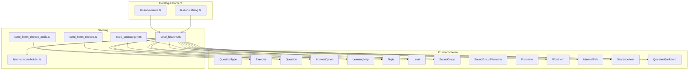
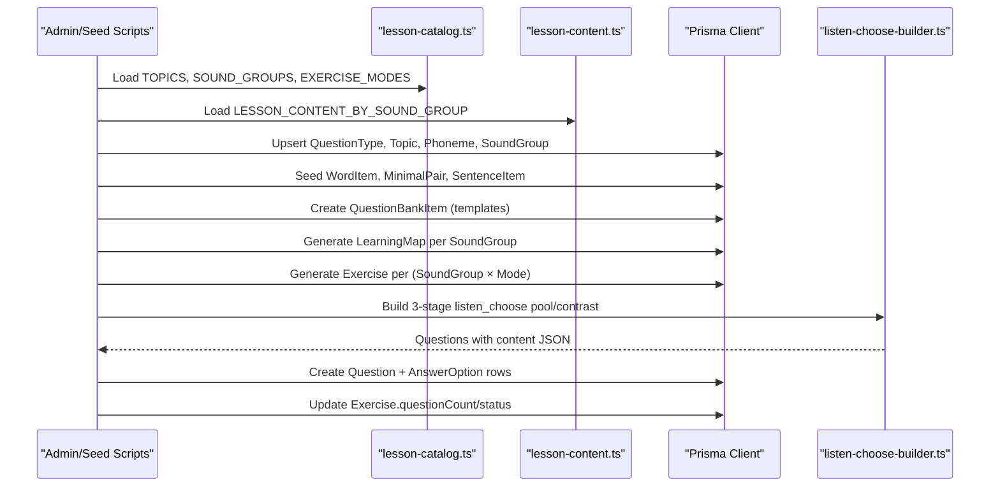
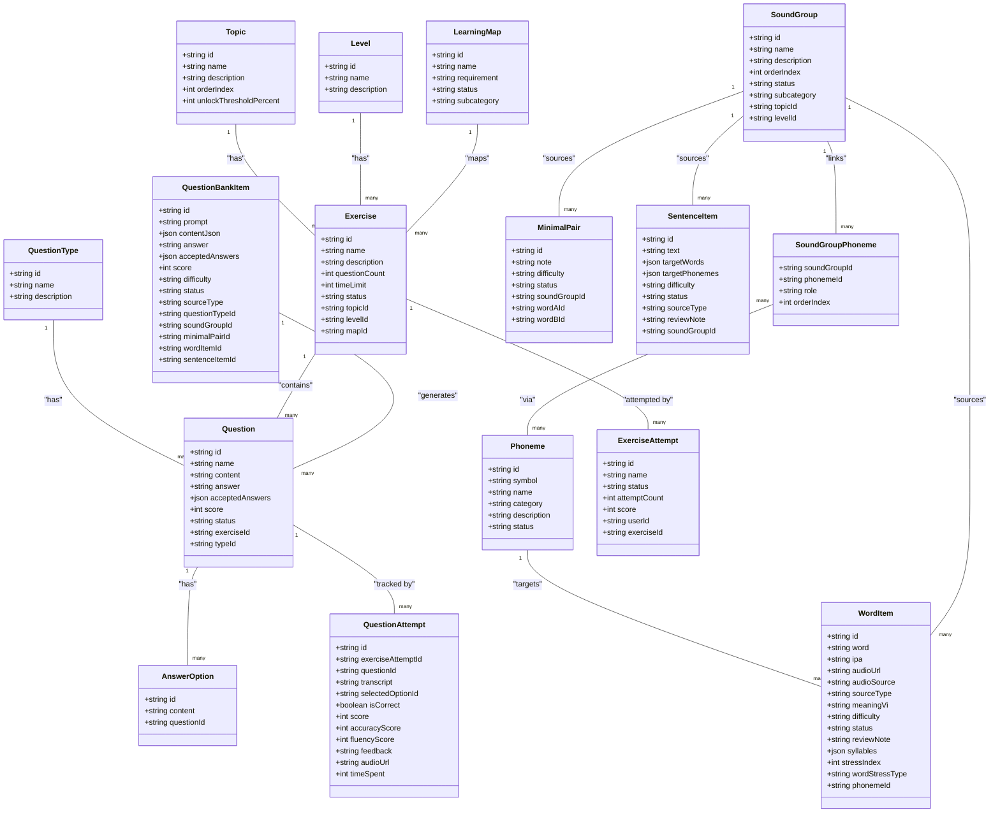
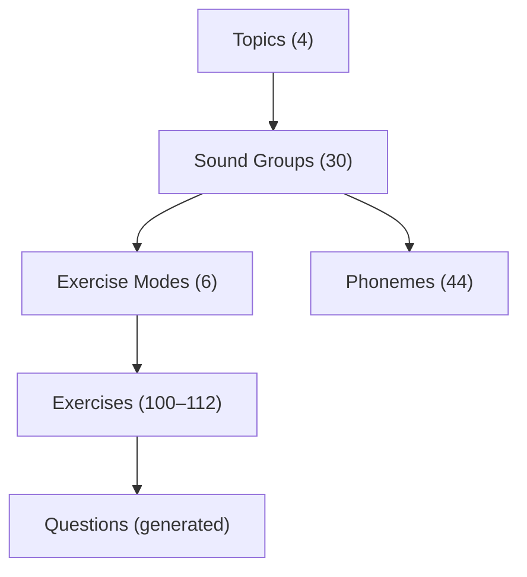
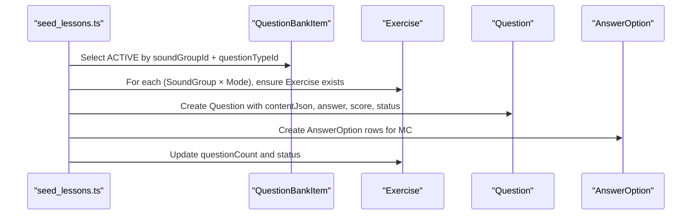
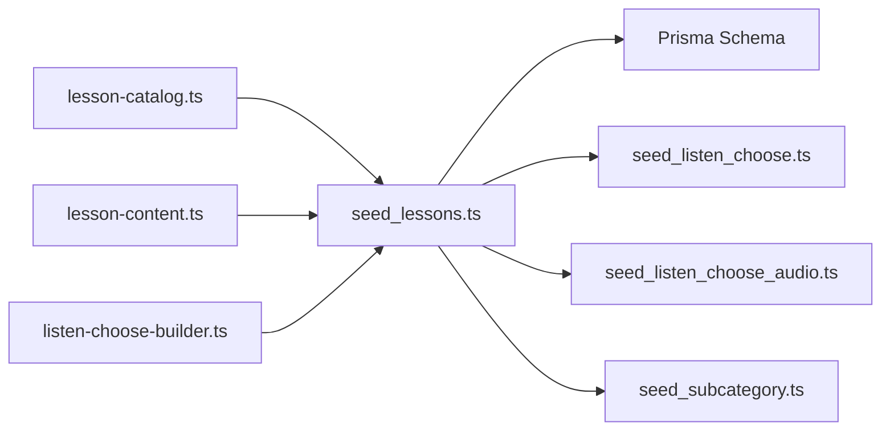

# Database Schema and Content Models

<cite>
**Referenced Files in This Document**
- [schema.prisma](file://english_pronunciation_app/frontend/prisma/schema.prisma)
- [lesson-catalog.ts](file://english_pronunciation_app/frontend/prisma/lesson-catalog.ts)
- [lesson-content.ts](file://english_pronunciation_app/frontend/prisma/lesson-content.ts)
- [seed_lessons.ts](file://english_pronunciation_app/frontend/prisma/seed_lessons.ts)
- [seed_listen_choose.ts](file://english_pronunciation_app/frontend/prisma/seed_listen_choose.ts)
- [seed_listen_choose_audio.ts](file://english_pronunciation_app/frontend/prisma/seed_listen_choose_audio.ts)
- [seed_subcategory.ts](file://english_pronunciation_app/frontend/prisma/seed_subcategory.ts)
- [listen-choose-builder.ts](file://english_pronunciation_app/frontend/prisma/listen-choose-builder.ts)
- [DATA_SEED_PLAN.md](file://PLAN/02_Database_And_Data/DATA_SEED_PLAN.md)
- [LESSON_SYLLABUS_STRUCTURE.md](file://PLAN/02_Database_And_Data/LESSON_SYLLABUS_STRUCTURE.md)
</cite>

## Table of Contents
1. [Introduction](#introduction)
2. [Project Structure](#project-structure)
3. [Core Components](#core-components)
4. [Architecture Overview](#architecture-overview)
5. [Detailed Component Analysis](#detailed-component-analysis)
6. [Dependency Analysis](#dependency-analysis)
7. [Performance Considerations](#performance-considerations)
8. [Troubleshooting Guide](#troubleshooting-guide)
9. [Conclusion](#conclusion)
10. [Appendices](#appendices)

## Introduction
This document describes the exercise-related database schema and content models used to power the English pronunciation learning system. It covers the Exercise, Question, Option, and Answer entities; the lesson catalog structure and content categorization; question types and content storage patterns; Prisma schema definitions; seeding strategies; data migration patterns; and content versioning. It also documents data integrity constraints, cascading operations, and performance optimization via indexing.

## Project Structure
The exercise system is defined by:
- A Prisma schema that models domain entities and their relationships
- A lesson catalog that defines topics, sound groups, and exercise modes
- A lesson content library that supplies WordItem, MinimalPair, and SentenceItem data
- Seed scripts that populate the database, generate exercises and questions, and maintain content consistency

**Diagram sources**
- [schema.prisma:141-418](file://english_pronunciation_app/frontend/prisma/schema.prisma#L141-L418)
- [lesson-catalog.ts:1-288](file://english_pronunciation_app/frontend/prisma/lesson-catalog.ts#L1-L288)
- [lesson-content.ts:1-1659](file://english_pronunciation_app/frontend/prisma/lesson-content.ts#L1-L1659)
- [seed_lessons.ts:1-1314](file://english_pronunciation_app/frontend/prisma/seed_lessons.ts#L1-L1314)
- [seed_listen_choose.ts:1-143](file://english_pronunciation_app/frontend/prisma/seed_listen_choose.ts#L1-L143)
- [seed_listen_choose_audio.ts:1-85](file://english_pronunciation_app/frontend/prisma/seed_listen_choose_audio.ts#L1-L85)
- [seed_subcategory.ts:1-70](file://english_pronunciation_app/frontend/prisma/seed_subcategory.ts#L1-L70)
- [listen-choose-builder.ts:1-134](file://english_pronunciation_app/frontend/prisma/listen-choose-builder.ts#L1-L134)

**Section sources**
- [schema.prisma:1-501](file://english_pronunciation_app/frontend/prisma/schema.prisma#L1-L501)
- [lesson-catalog.ts:1-288](file://english_pronunciation_app/frontend/prisma/lesson-catalog.ts#L1-L288)
- [lesson-content.ts:1-1659](file://english_pronunciation_app/frontend/prisma/lesson-content.ts#L1-L1659)
- [seed_lessons.ts:1-1314](file://english_pronunciation_app/frontend/prisma/seed_lessons.ts#L1-L1314)

## Core Components
This section documents the core entities and their relationships that underpin exercises and content.

- Exercise
  - Purpose: encapsulates a learning session with a fixed set of questions
  - Key attributes: name, description, questionCount, timeLimit, status, topicId, levelId, mapId
  - Relationships: belongs to Topic, Level, LearningMap; contains many Question; tracks many ExerciseAttempt
  - Constraints: unique per topicId/levelId combination enforced by relations

- Question
  - Purpose: stores a single quiz item with content payload and scoring
  - Key attributes: name, content (JSON), answer, acceptedAnswers (optional array), score, status, answer (legacy), questionAttempts
  - Relationships: belongs to Exercise, QuestionType; has many AnswerOption; tracked by QuestionAttempt
  - Validation: content JSON validated by generation pipeline; acceptedAnswers optional for flexible matching

- AnswerOption
  - Purpose: provides distractors or selectable choices for a Question
  - Key attributes: content (display text), linked to Question
  - Constraints: one-to-many with Question; used for scoring via selectedOptionId

- QuestionType
  - Purpose: classifies question modes (e.g., MC, voice, minimal pairs, CĐ4 modes)
  - Key attributes: id, name, description; links to Question and QuestionBankItem
  - Notes: includes specialized types for CĐ4 (tap-stress, choose-weak, choose-linking, choose-assimilation)

- LearningMap
  - Purpose: maps a SoundGroup to a navigable learning path
  - Key attributes: name, requirement, status, subcategory
  - Relationships: belongs to Topic; contains many Exercise; tracks Progress

- Topic and Level
  - Purpose: hierarchical classification for exercises
  - Key attributes: orderIndex, unlockThresholdPercent (Topic); used for default level assignment

- SoundGroup and SoundGroupPhoneme
  - Purpose: groups phonemes for instruction; supports subcategories and ordering
  - Relationships: many-to-many via SoundGroupPhoneme; linked to Phoneme

- Phoneme
  - Purpose: stores IPA symbols and categories
  - Attributes: symbol (unique), category, status, createdAt/updatedAt

- WordItem, MinimalPair, SentenceItem
  - Purpose: content items backing questions
  - Attributes: difficulty, status, audioSource, sourceType, reviewNote, syllables, stressIndex, wordStressType (WordItem)
  - Relationships: WordItem linked to Phoneme; MinimalPair links two WordItem; SentenceItem provides sentence content

- QuestionBankItem
  - Purpose: template items used to generate Questions
  - Attributes: prompt, contentJson, answer, acceptedAnswers (optional), score, difficulty, status, sourceType
  - Relationships: links to QuestionType, SoundGroup, and optional WordItem/MinimalPair/SentenceItem

- ExerciseAttempt and QuestionAttempt
  - Purpose: records user attempts and responses
  - Attributes: attempt metadata, transcript, selectedOptionId, isCorrect, score, accuracyScore, fluencyScore, feedback, audioUrl, timeSpent

**Section sources**
- [schema.prisma:141-453](file://english_pronunciation_app/frontend/prisma/schema.prisma#L141-L453)
- [lesson-catalog.ts:15-52](file://english_pronunciation_app/frontend/prisma/lesson-catalog.ts#L15-L52)
- [lesson-content.ts:14-67](file://english_pronunciation_app/frontend/prisma/lesson-content.ts#L14-L67)

## Architecture Overview
The system follows a “catalog-driven” content model:
- Catalog defines topics, sound groups, and exercise modes
- Content library provides WordItem, MinimalPair, SentenceItem datasets
- Seed pipeline creates QuestionBankItem templates, generates LearningMaps and Exercises, and builds Questions from templates
- Listening mode (CĐ1–3) uses a 3-stage builder to produce phoneme-ID questions with contrast phonemes
- CĐ4 uses specialized QuestionTypes and content-driven Question generation

**Diagram sources**
- [seed_lessons.ts:116-1271](file://english_pronunciation_app/frontend/prisma/seed_lessons.ts#L116-L1271)
- [lesson-catalog.ts:58-159](file://english_pronunciation_app/frontend/prisma/lesson-catalog.ts#L58-L159)
- [lesson-content.ts:1499-1599](file://english_pronunciation_app/frontend/prisma/lesson-content.ts#L1499-L1599)
- [listen-choose-builder.ts:110-133](file://english_pronunciation_app/frontend/prisma/listen-choose-builder.ts#L110-L133)

## Detailed Component Analysis

### Prisma Schema: Entities and Relationships

**Diagram sources**
- [schema.prisma:141-453](file://english_pronunciation_app/frontend/prisma/schema.prisma#L141-L453)

**Section sources**
- [schema.prisma:141-453](file://english_pronunciation_app/frontend/prisma/schema.prisma#L141-L453)

### Lesson Catalog Structure and Hierarchical Organization
The lesson catalog defines:
- Topics: 4 hierarchical categories with unlock thresholds
- Sound Groups: 30 instructional clusters grouped by phonetic families and subcategories
- Exercise Modes: 6 modes (4 standard + 2 CĐ4-specific) applied per topic
- Phonemes: 44 IPA symbols mapped to categories

**Diagram sources**
- [lesson-catalog.ts:58-159](file://english_pronunciation_app/frontend/prisma/lesson-catalog.ts#L58-L159)
- [LESSON_SYLLABUS_STRUCTURE.md:11-162](file://PLAN/02_Database_And_Data/LESSON_SYLLABUS_STRUCTURE.md#L11-L162)

**Section sources**
- [lesson-catalog.ts:58-159](file://english_pronunciation_app/frontend/prisma/lesson-catalog.ts#L58-L159)
- [LESSON_SYLLABUS_STRUCTURE.md:11-162](file://PLAN/02_Database_And_Data/LESSON_SYLLABUS_STRUCTURE.md#L11-L162)

### Content Storage Patterns and Metadata Management
Content is modeled as:
- WordItem: word, IPA, phoneme linkage, audio metadata, difficulty, status, review notes, syllables/stress for CĐ4
- MinimalPair: two related WordItem entries with explanation and difficulty
- SentenceItem: text, target words/phonemes, difficulty, status, source metadata

These items feed QuestionBankItem templates, which are transformed into Questions during exercise generation.

**Section sources**
- [lesson-content.ts:14-67](file://english_pronunciation_app/frontend/prisma/lesson-content.ts#L14-L67)
- [schema.prisma:259-418](file://english_pronunciation_app/frontend/prisma/schema.prisma#L259-L418)

### Question Types and Question Generation
- QuestionType defines modes: MC, voice, minimal pairs, and CĐ4 specialized types
- QuestionBankItem stores canonical templates with contentJson, answer, acceptedAnswers, score, difficulty, status
- seed_lessons.ts generates Questions from templates, building realistic distractors and applying mode-specific logic
- Specialized builders handle CĐ4 modes and 3-stage listening tasks

**Diagram sources**
- [seed_lessons.ts:795-1271](file://english_pronunciation_app/frontend/prisma/seed_lessons.ts#L795-L1271)
- [schema.prisma:201-235](file://english_pronunciation_app/frontend/prisma/schema.prisma#L201-L235)

**Section sources**
- [seed_lessons.ts:795-1271](file://english_pronunciation_app/frontend/prisma/seed_lessons.ts#L795-L1271)
- [schema.prisma:201-235](file://english_pronunciation_app/frontend/prisma/schema.prisma#L201-L235)

### Listening Mode 3-Stage Builder
The builder produces 10-question sets:
- Stage 1: show word, IPA, and contrast phonemes
- Stage 2: hide word, reveal IPA skeleton with blanks
- Stage 3: audio only with contrast phonemes

It filters candidates to single-phoneme targets and cycles the pool to reach 10.

**Section sources**
- [listen-choose-builder.ts:1-134](file://english_pronunciation_app/frontend/prisma/listen-choose-builder.ts#L1-L134)
- [seed_listen_choose.ts:1-143](file://english_pronunciation_app/frontend/prisma/seed_listen_choose.ts#L1-L143)

### Data Integrity, Cascading, and Indexing
- Foreign keys and relations enforce referential integrity (e.g., Question.exerciseId, AnswerOption.questionId)
- Cascading deletes on parent deletion ensure cleanup (e.g., deleting an Exercise removes Questions and Options)
- Unique constraints prevent duplicates (e.g., WordItem uniqueness by word/ipa/phonemeId)
- Indexes optimize frequent queries (e.g., by status, difficulty, sourceType, phonemeId, soundGroupId)

**Section sources**
- [schema.prisma:141-453](file://english_pronunciation_app/frontend/prisma/schema.prisma#L141-L453)

### Content Seeding Strategies and Migration Patterns
- QuestionTypes, Topics, Phonemes, SoundGroups are seeded first
- Content (WordItem, MinimalPair, SentenceItem) is ingested with audio resolution
- QuestionBankItem templates are created from content
- Exercises and Questions are generated, with special handling for CĐ4 modes and 3-stage listening
- Maintenance scripts support incremental updates (e.g., baking contrast audio, updating subcategories)

**Section sources**
- [seed_lessons.ts:116-1271](file://english_pronunciation_app/frontend/prisma/seed_lessons.ts#L116-L1271)
- [seed_listen_choose.ts:1-143](file://english_pronunciation_app/frontend/prisma/seed_listen_choose.ts#L1-L143)
- [seed_listen_choose_audio.ts:1-85](file://english_pronunciation_app/frontend/prisma/seed_listen_choose_audio.ts#L1-L85)
- [seed_subcategory.ts:1-70](file://english_pronunciation_app/frontend/prisma/seed_subcategory.ts#L1-L70)

### Content Versioning and Review Workflow
- Status lifecycle: DRAFT → NEEDS_REVIEW → ACTIVE
- Audio fallback and caching policies ensure stability
- Review notes and source metadata track provenance
- Seed pipeline enforces rules: audio-required for listen_choose, difficulty mapping, and mode-specific content

**Section sources**
- [DATA_SEED_PLAN.md:33-56](file://PLAN/02_Database_And_Data/DATA_SEED_PLAN.md#L33-L56)
- [seed_lessons.ts:279-320](file://english_pronunciation_app/frontend/prisma/seed_lessons.ts#L279-L320)

## Dependency Analysis
The following diagram highlights key dependencies among components:

**Diagram sources**
- [lesson-catalog.ts:1-288](file://english_pronunciation_app/frontend/prisma/lesson-catalog.ts#L1-L288)
- [lesson-content.ts:1-1659](file://english_pronunciation_app/frontend/prisma/lesson-content.ts#L1-L1659)
- [seed_lessons.ts:1-1314](file://english_pronunciation_app/frontend/prisma/seed_lessons.ts#L1-L1314)
- [listen-choose-builder.ts:1-134](file://english_pronunciation_app/frontend/prisma/listen-choose-builder.ts#L1-L134)
- [seed_listen_choose.ts:1-143](file://english_pronunciation_app/frontend/prisma/seed_listen_choose.ts#L1-L143)
- [seed_listen_choose_audio.ts:1-85](file://english_pronunciation_app/frontend/prisma/seed_listen_choose_audio.ts#L1-L85)
- [seed_subcategory.ts:1-70](file://english_pronunciation_app/frontend/prisma/seed_subcategory.ts#L1-L70)

**Section sources**
- [lesson-catalog.ts:1-288](file://english_pronunciation_app/frontend/prisma/lesson-catalog.ts#L1-L288)
- [lesson-content.ts:1-1659](file://english_pronunciation_app/frontend/prisma/lesson-content.ts#L1-L1659)
- [seed_lessons.ts:1-1314](file://english_pronunciation_app/frontend/prisma/seed_lessons.ts#L1-L1314)

## Performance Considerations
- Indexes on frequently filtered columns (e.g., status, difficulty, sourceType, phonemeId, soundGroupId) improve query performance
- JSON fields (contentJson, syllables) should be kept lean; avoid unnecessary nesting
- Batch operations during seeding reduce round-trips
- Avoid redundant API calls by caching audio URLs and reusing existing local audio
- Use upsert patterns to minimize duplicate writes

[No sources needed since this section provides general guidance]

## Troubleshooting Guide
Common issues and resolutions:
- Missing audio for listen_choose: items remain NEEDS_REVIEW; ensure audio is present before activation
- Insufficient contrast phonemes: 3-stage builder may skip exercises with empty pools; verify neighbor groups and filtering logic
- Mode mismatch: ensure QuestionBankItem mode matches Exercise mode to avoid zero-question exercises
- CDD4 mode errors: confirm QuestionType overrides and content-driven generation paths are correct

**Section sources**
- [seed_lessons.ts:813-914](file://english_pronunciation_app/frontend/prisma/seed_lessons.ts#L813-L914)
- [seed_listen_choose.ts:70-75](file://english_pronunciation_app/frontend/prisma/seed_listen_choose.ts#L70-L75)

## Conclusion
The exercise system combines a robust Prisma schema with a catalog-driven content model. The seed pipeline ensures high-quality, audioliterate content while supporting advanced features like CĐ4 modes and 3-stage listening. Proper indexing, integrity constraints, and a structured review workflow guarantee data reliability and performance.

[No sources needed since this section summarizes without analyzing specific files]

## Appendices

### Appendix A: Prisma Schema Highlights
- Entities: QuestionType, Topic, Level, LearningMap, Exercise, Question, AnswerOption, Phoneme, SoundGroup, SoundGroupPhoneme, WordItem, MinimalPair, SentenceItem, QuestionBankItem, ExerciseAttempt, QuestionAttempt
- Notable constraints: unique combinations (e.g., WordItem by word/ipa/phonemeId), foreign keys with cascades, indexes on status/difficulty/sourceType/phonemeId/soundGroupId

**Section sources**
- [schema.prisma:141-453](file://english_pronunciation_app/frontend/prisma/schema.prisma#L141-L453)

### Appendix B: Data Seed Plan References
- Question bank in DB rationale, MVP sizing, randomization controls, and review workflow

**Section sources**
- [DATA_SEED_PLAN.md:1-418](file://PLAN/02_Database_And_Data/DATA_SEED_PLAN.md#L1-L418)