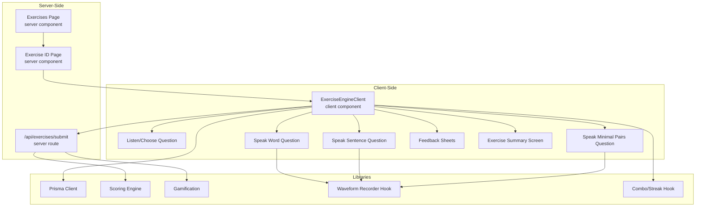
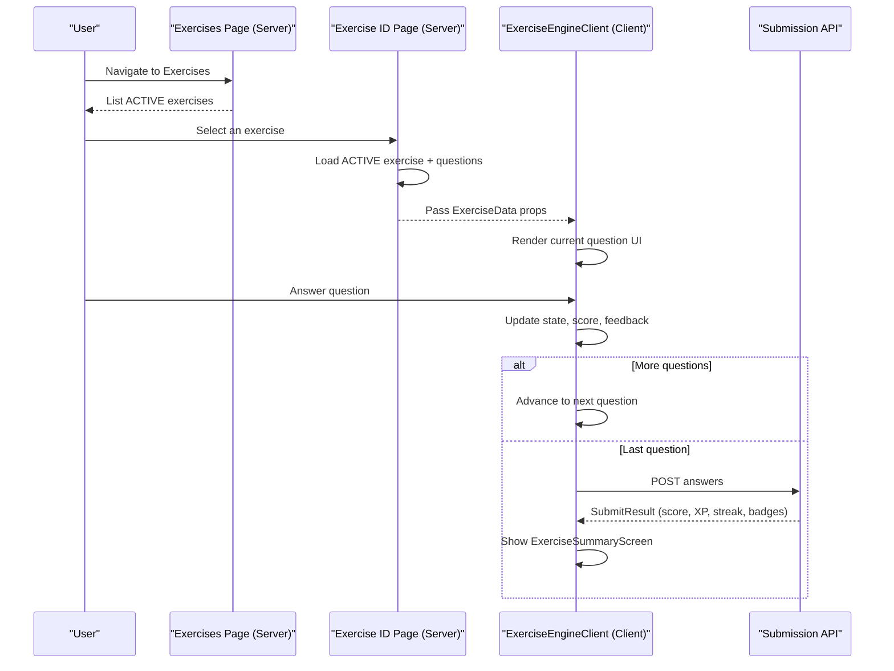
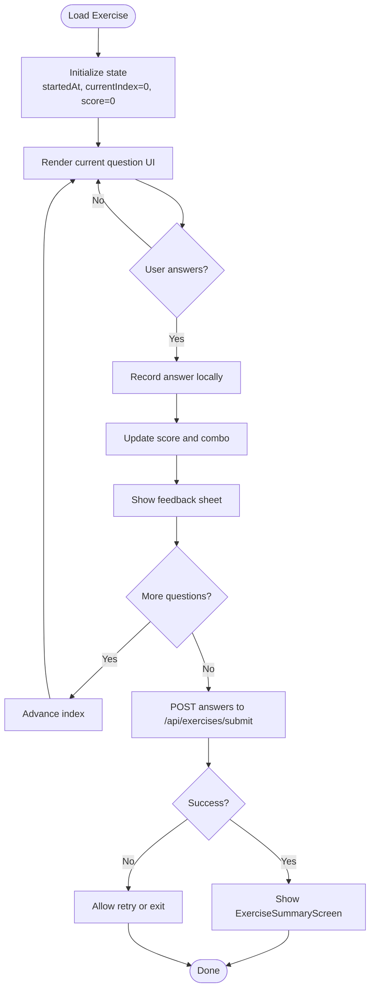
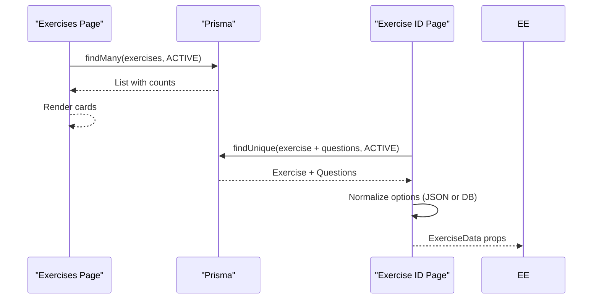
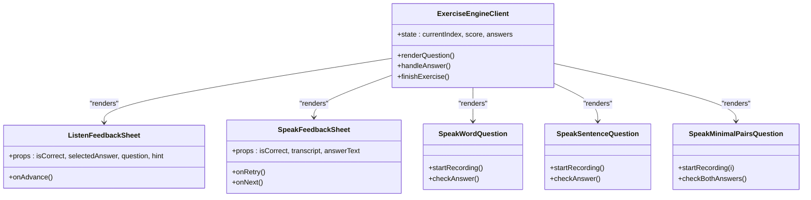
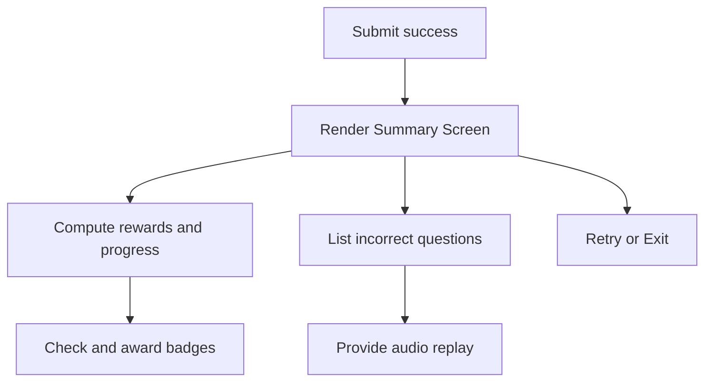
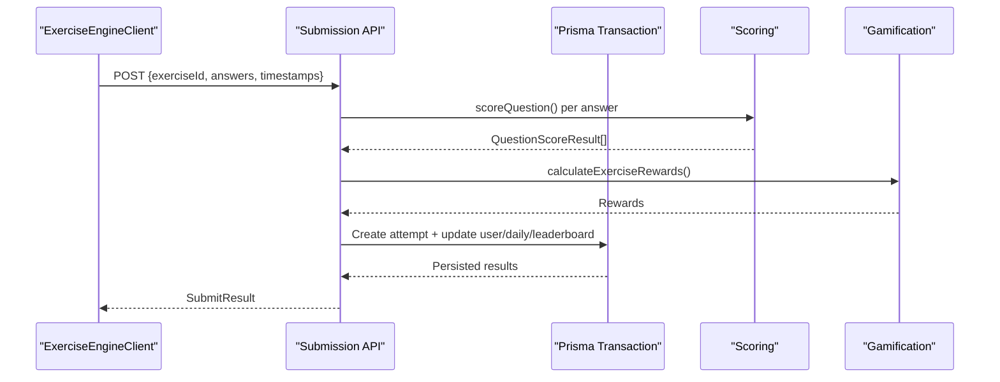
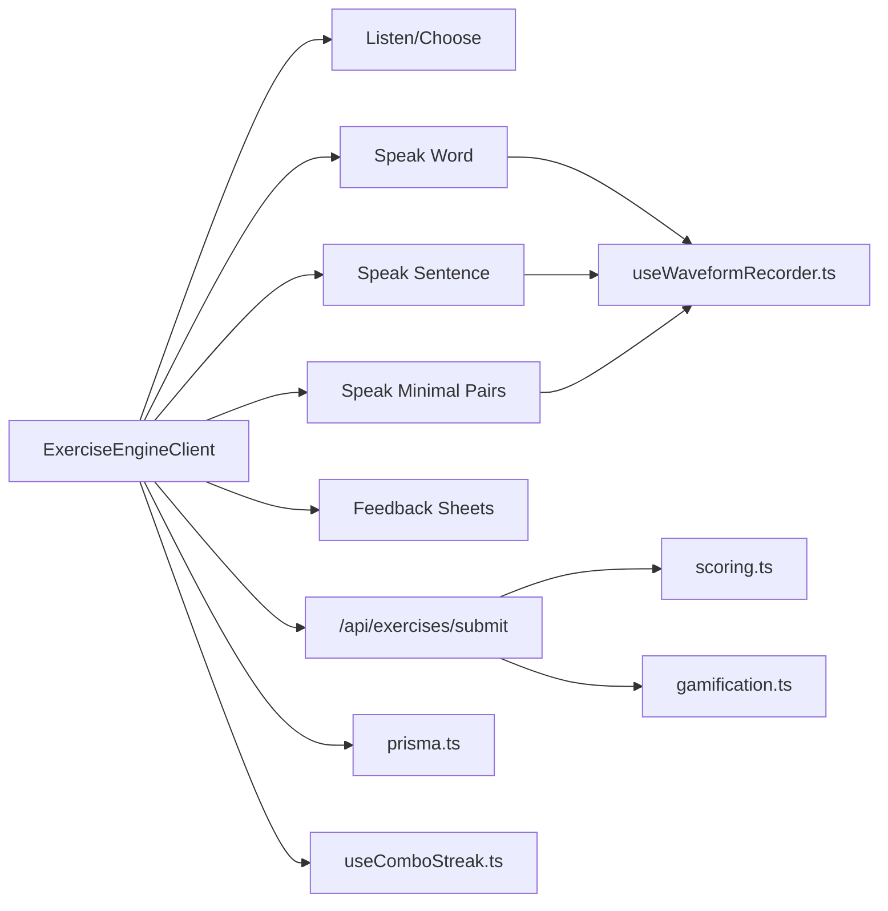

# Exercise Architecture and Rendering

<cite>
**Referenced Files in This Document**
- [ExerciseEngineClient.tsx](file://english_pronunciation_app/frontend/src/app/exercises/[id]/ExerciseEngineClient.tsx)
- [page.tsx](file://english_pronunciation_app/frontend/src/app/exercises/[id]/page.tsx)
- [ExerciseSummaryScreen.tsx](file://english_pronunciation_app/frontend/src/app/exercises/[id]/ExerciseSummaryScreen.tsx)
- [ListenFeedbackSheet.tsx](file://english_pronunciation_app/frontend/src/app/exercises/[id]/ListenFeedbackSheet.tsx)
- [SpeakFeedbackSheet.tsx](file://english_pronunciation_app/frontend/src/app/exercises/[id]/SpeakFeedbackSheet.tsx)
- [SpeakWordQuestion.tsx](file://english_pronunciation_app/frontend/src/app/exercises/[id]/SpeakWordQuestion.tsx)
- [SpeakSentenceQuestion.tsx](file://english_pronunciation_app/frontend/src/app/exercises/[id]/SpeakSentenceQuestion.tsx)
- [SpeakMinimalPairsQuestion.tsx](file://english_pronunciation_app/frontend/src/app/exercises/[id]/SpeakMinimalPairsQuestion.tsx)
- [route.ts](file://english_pronunciation_app/frontend/src/app/api/exercises/submit/route.ts)
- [prisma.ts](file://english_pronunciation_app/frontend/src/lib/prisma.ts)
- [scoring.ts](file://english_pronunciation_app/frontend/src/lib/scoring.ts)
- [gamification.ts](file://english_pronunciation_app/frontend/src/lib/gamification.ts)
- [useComboStreak.ts](file://english_pronunciation_app/frontend/src/hooks/useComboStreak.ts)
- [useWaveformRecorder.ts](file://english_pronunciation_app/frontend/src/hooks/useWaveformRecorder.ts)
- [RecordButton.tsx](file://english_pronunciation_app/frontend/src/components/audio/RecordButton.tsx)
- [exercises page.tsx](file://english_pronunciation_app/frontend/src/app/exercises/page.tsx)
</cite>

## Table of Contents
1. [Introduction](#introduction)
2. [Project Structure](#project-structure)
3. [Core Components](#core-components)
4. [Architecture Overview](#architecture-overview)
5. [Detailed Component Analysis](#detailed-component-analysis)
6. [Dependency Analysis](#dependency-analysis)
7. [Performance Considerations](#performance-considerations)
8. [Troubleshooting Guide](#troubleshooting-guide)
9. [Conclusion](#conclusion)

## Introduction
This document explains the exercise architecture and rendering engine for the pronunciation training application. It covers the server-side exercise loading mechanism, client-side rendering patterns, dynamic content delivery, and the ExerciseEngineClient component architecture. It also documents exercise state management, real-time rendering capabilities, lifecycle from loading to completion, error handling and fallback mechanisms, integration between server-side data fetching and client-side interactive components, implementation patterns for exercise progression and navigation, and user interface updates. Finally, it addresses performance optimization techniques and memory management for complex exercises.

## Project Structure
The exercise system is organized around a Next.js App Router structure with:
- Server-side pages that load exercise data from the database
- A client-side ExerciseEngineClient orchestrating the interactive rendering
- Specialized question components for different modalities
- A submission API endpoint that validates and scores answers
- Supporting libraries for scoring, gamification, and audio/visual feedback

**Diagram sources**
- [exercises page.tsx:14-137](file://english_pronunciation_app/frontend/src/app/exercises/page.tsx#L14-L137)
- [page.tsx:47-91](file://english_pronunciation_app/frontend/src/app/exercises/[id]/page.tsx#L47-L91)
- [ExerciseEngineClient.tsx:323-644](file://english_pronunciation_app/frontend/src/app/exercises/[id]/ExerciseEngineClient.tsx#L323-L644)
- [route.ts:47-331](file://english_pronunciation_app/frontend/src/app/api/exercises/submit/route.ts#L47-L331)
- [prisma.ts:1-13](file://english_pronunciation_app/frontend/src/lib/prisma.ts#L1-L13)
- [scoring.ts:1-227](file://english_pronunciation_app/frontend/src/lib/scoring.ts#L1-L227)
- [gamification.ts:1-575](file://english_pronunciation_app/frontend/src/lib/gamification.ts#L1-L575)
- [useWaveformRecorder.ts:1-140](file://english_pronunciation_app/frontend/src/hooks/useWaveformRecorder.ts#L1-L140)
- [useComboStreak.ts:1-75](file://english_pronunciation_app/frontend/src/hooks/useComboStreak.ts#L1-L75)

**Section sources**
- [exercises page.tsx:14-137](file://english_pronunciation_app/frontend/src/app/exercises/page.tsx#L14-L137)
- [page.tsx:47-91](file://english_pronunciation_app/frontend/src/app/exercises/[id]/page.tsx#L47-L91)
- [ExerciseEngineClient.tsx:323-644](file://english_pronunciation_app/frontend/src/app/exercises/[id]/ExerciseEngineClient.tsx#L323-L644)

## Core Components
- ExerciseEngineClient: Central client component managing exercise lifecycle, state, navigation, and submission. It renders question-specific components and handles real-time feedback.
- Question Components: Listen/Choose, Speak Word, Speak Sentence, Speak Minimal Pairs, Tap Stress, and Multi-select variants. Each encapsulates modality-specific UI and interaction.
- Feedback Sheets: ListenFeedbackSheet and SpeakFeedbackSheet provide contextual overlays with audio replay and retry controls.
- ExerciseSummaryScreen: Presents results, XP rewards, streak, badges, and incorrect questions with audio replay.
- Submission API: Validates payload, scores answers, computes rewards, and persists results atomically.

Key responsibilities:
- Server-side: Load exercise metadata and questions, filter ACTIVE items, and pass structured data to the client.
- Client-side: Manage state transitions, maintain answers, compute score, trigger submission, and render dynamic UI.
- Backend API: Enforce validation, score per-question, compute exercise-level metrics, and update user progress and leaderboards.

**Section sources**
- [ExerciseEngineClient.tsx:323-644](file://english_pronunciation_app/frontend/src/app/exercises/[id]/ExerciseEngineClient.tsx#L323-L644)
- [page.tsx:47-91](file://english_pronunciation_app/frontend/src/app/exercises/[id]/page.tsx#L47-L91)
- [route.ts:47-331](file://english_pronunciation_app/frontend/src/app/api/exercises/submit/route.ts#L47-L331)

## Architecture Overview
The system follows a layered architecture:
- Presentation Layer: Next.js server components fetch data and render client components.
- Client Engine: ExerciseEngineClient coordinates state and UI rendering.
- Interaction Layer: Question components manage user input and real-time feedback.
- Services Layer: Submission API performs scoring, gamification, and persistence.
- Data Access: Prisma client manages database queries and transactions.

**Diagram sources**
- [exercises page.tsx:14-137](file://english_pronunciation_app/frontend/src/app/exercises/page.tsx#L14-L137)
- [page.tsx:47-91](file://english_pronunciation_app/frontend/src/app/exercises/[id]/page.tsx#L47-L91)
- [ExerciseEngineClient.tsx:367-403](file://english_pronunciation_app/frontend/src/app/exercises/[id]/ExerciseEngineClient.tsx#L367-L403)
- [route.ts:47-331](file://english_pronunciation_app/frontend/src/app/api/exercises/submit/route.ts#L47-L331)

## Detailed Component Analysis

### ExerciseEngineClient: Lifecycle and State Management
ExerciseEngineClient orchestrates the entire exercise lifecycle:
- Initialization: Captures startedAt, initializes state for current index, score, answers, incorrect questions, and submission status.
- Navigation: Advances through questions or completes the exercise.
- Scoring: Records answers locally and submits them upon completion.
- Real-time feedback: Updates score, combo streak, and displays feedback sheets.
- Completion: Renders ExerciseSummaryScreen with results and rewards.

**Diagram sources**
- [ExerciseEngineClient.tsx:323-644](file://english_pronunciation_app/frontend/src/app/exercises/[id]/ExerciseEngineClient.tsx#L323-L644)
- [route.ts:47-331](file://english_pronunciation_app/frontend/src/app/api/exercises/submit/route.ts#L47-L331)

**Section sources**
- [ExerciseEngineClient.tsx:323-644](file://english_pronunciation_app/frontend/src/app/exercises/[id]/ExerciseEngineClient.tsx#L323-L644)

### Server-Side Loading: Exercises Page and Exercise ID Page
- Exercises Page (server): Fetches ACTIVE exercises, counts ACTIVE questions, and renders cards with links to individual exercises.
- Exercise ID Page (server): Loads ACTIVE exercise with ACTIVE questions, normalizes options from JSON content or DB, and passes ExerciseData to the client.

**Diagram sources**
- [exercises page.tsx:14-137](file://english_pronunciation_app/frontend/src/app/exercises/page.tsx#L14-L137)
- [page.tsx:47-91](file://english_pronunciation_app/frontend/src/app/exercises/[id]/page.tsx#L47-L91)
- [prisma.ts:1-13](file://english_pronunciation_app/frontend/src/lib/prisma.ts#L1-L13)

**Section sources**
- [exercises page.tsx:14-137](file://english_pronunciation_app/frontend/src/app/exercises/page.tsx#L14-L137)
- [page.tsx:47-91](file://english_pronunciation_app/frontend/src/app/exercises/[id]/page.tsx#L47-L91)

### Question Components and Real-Time Rendering
- Listen/Choose Question: Parses word prompts (including phoneme mode), auto-plays audio, renders options, and shows feedback.
- Speak Word/Sentence/Minimal Pairs: Integrate speech recognition, waveform visualization, dynamic feedback, and contextual feedback sheets.
- Tap Stress and Multi-Select: Specialized scoring and rendering for stress and multi-choice selections.

**Diagram sources**
- [ExerciseEngineClient.tsx:323-644](file://english_pronunciation_app/frontend/src/app/exercises/[id]/ExerciseEngineClient.tsx#L323-L644)
- [ListenFeedbackSheet.tsx:34-149](file://english_pronunciation_app/frontend/src/app/exercises/[id]/ListenFeedbackSheet.tsx#L34-L149)
- [SpeakFeedbackSheet.tsx:18-94](file://english_pronunciation_app/frontend/src/app/exercises/[id]/SpeakFeedbackSheet.tsx#L18-L94)
- [SpeakWordQuestion.tsx:57-221](file://english_pronunciation_app/frontend/src/app/exercises/[id]/SpeakWordQuestion.tsx#L57-L221)
- [SpeakSentenceQuestion.tsx:48-224](file://english_pronunciation_app/frontend/src/app/exercises/[id]/SpeakSentenceQuestion.tsx#L48-L224)
- [SpeakMinimalPairsQuestion.tsx:83-257](file://english_pronunciation_app/frontend/src/app/exercises/[id]/SpeakMinimalPairsQuestion.tsx#L83-L257)

**Section sources**
- [ListenFeedbackSheet.tsx:34-149](file://english_pronunciation_app/frontend/src/app/exercises/[id]/ListenFeedbackSheet.tsx#L34-L149)
- [SpeakFeedbackSheet.tsx:18-94](file://english_pronunciation_app/frontend/src/app/exercises/[id]/SpeakFeedbackSheet.tsx#L18-L94)
- [SpeakWordQuestion.tsx:57-221](file://english_pronunciation_app/frontend/src/app/exercises/[id]/SpeakWordQuestion.tsx#L57-L221)
- [SpeakSentenceQuestion.tsx:48-224](file://english_pronunciation_app/frontend/src/app/exercises/[id]/SpeakSentenceQuestion.tsx#L48-L224)
- [SpeakMinimalPairsQuestion.tsx:83-257](file://english_pronunciation_app/frontend/src/app/exercises/[id]/SpeakMinimalPairsQuestion.tsx#L83-L257)

### Exercise Summary Screen and Rewards
ExerciseSummaryScreen presents:
- Rating-based praise and a visual score ring
- XP, streak, and badges earned
- Previous-best comparison and progress bias
- Incorrect questions with audio replay
- Action buttons to retry or exit

**Diagram sources**
- [ExerciseSummaryScreen.tsx:88-254](file://english_pronunciation_app/frontend/src/app/exercises/[id]/ExerciseSummaryScreen.tsx#L88-L254)
- [route.ts:172-326](file://english_pronunciation_app/frontend/src/app/api/exercises/submit/route.ts#L172-L326)
- [gamification.ts:490-531](file://english_pronunciation_app/frontend/src/lib/gamification.ts#L490-L531)

**Section sources**
- [ExerciseSummaryScreen.tsx:88-254](file://english_pronunciation_app/frontend/src/app/exercises/[id]/ExerciseSummaryScreen.tsx#L88-L254)

### Submission API: Validation, Scoring, and Persistence
The submission endpoint:
- Authenticates user and validates payload
- Loads exercise and ensures all answers belong to the exercise
- Scores each question using scoring logic
- Computes exercise-level metrics and rating
- Awards XP, updates level, daily activity, leaderboards, and badges atomically
- Returns comprehensive results to the client

**Diagram sources**
- [route.ts:47-331](file://english_pronunciation_app/frontend/src/app/api/exercises/submit/route.ts#L47-L331)
- [scoring.ts:191-227](file://english_pronunciation_app/frontend/src/lib/scoring.ts#L191-L227)
- [gamification.ts:195-234](file://english_pronunciation_app/frontend/src/lib/gamification.ts#L195-L234)

**Section sources**
- [route.ts:47-331](file://english_pronunciation_app/frontend/src/app/api/exercises/submit/route.ts#L47-L331)

## Dependency Analysis
- ExerciseEngineClient depends on:
  - Question components for rendering
  - Feedback sheets for contextual overlays
  - Scoring utilities for correctness checks
  - Gamification utilities for XP and badges
  - Hooks for combo/streak and waveform recording
- Server pages depend on Prisma for data retrieval
- Submission API depends on scoring and gamification modules

**Diagram sources**
- [ExerciseEngineClient.tsx:323-644](file://english_pronunciation_app/frontend/src/app/exercises/[id]/ExerciseEngineClient.tsx#L323-L644)
- [route.ts:47-331](file://english_pronunciation_app/frontend/src/app/api/exercises/submit/route.ts#L47-L331)
- [scoring.ts:1-227](file://english_pronunciation_app/frontend/src/lib/scoring.ts#L1-L227)
- [gamification.ts:1-575](file://english_pronunciation_app/frontend/src/lib/gamification.ts#L1-L575)
- [useWaveformRecorder.ts:1-140](file://english_pronunciation_app/frontend/src/hooks/useWaveformRecorder.ts#L1-L140)
- [useComboStreak.ts:1-75](file://english_pronunciation_app/frontend/src/hooks/useComboStreak.ts#L1-L75)
- [prisma.ts:1-13](file://english_pronunciation_app/frontend/src/lib/prisma.ts#L1-L13)

**Section sources**
- [ExerciseEngineClient.tsx:323-644](file://english_pronunciation_app/frontend/src/app/exercises/[id]/ExerciseEngineClient.tsx#L323-L644)
- [page.tsx:47-91](file://english_pronunciation_app/frontend/src/app/exercises/[id]/page.tsx#L47-L91)

## Performance Considerations
- Client-side rendering
  - Use memoization for derived values (e.g., current hint parsing) to avoid unnecessary re-renders.
  - Keep answer arrays immutable and update via refs to minimize prop churn.
  - Defer non-critical UI updates (e.g., combo praise) to requestAnimationFrame boundaries.
- Audio and media
  - Reuse Audio instances carefully; clean up on unmount to prevent resource leaks.
  - For speech recognition, stop streams promptly and avoid overlapping sessions.
- Waveform visualization
  - Clear both canvas and internal buffers when resetting to prevent artifacts.
  - Cancel animation frames and close audio contexts to free resources.
- Database queries
  - Use selective includes and filters to limit payload sizes.
  - Cache frequently accessed static data (e.g., question types) when appropriate.
- Network
  - Batch submissions and debounce retries to reduce API calls.
  - Validate early on the client to avoid unnecessary round-trips.

[No sources needed since this section provides general guidance]

## Troubleshooting Guide
Common issues and resolutions:
- No questions in exercise
  - The client renders a friendly message and navigates back to the learning map.
- Submission errors
  - The client shows an error state and allows retry or exit; the server returns explicit error codes for validation failures.
- Speech recognition unsupported
  - Components detect lack of Web Speech API and guide users to supported browsers.
  - Microphone permission denied: instruct users to grant permissions in browser settings.
- Audio playback blocked
  - Catch and warn on autoplay errors; provide manual play controls.
- Waveform artifacts after retries
  - Ensure both canvas and plugin buffer are cleared on reset.

**Section sources**
- [ExerciseEngineClient.tsx:493-519](file://english_pronunciation_app/frontend/src/app/exercises/[id]/ExerciseEngineClient.tsx#L493-L519)
- [route.ts:327-331](file://english_pronunciation_app/frontend/src/app/api/exercises/submit/route.ts#L327-L331)
- [SpeakWordQuestion.tsx:156-205](file://english_pronunciation_app/frontend/src/app/exercises/[id]/SpeakWordQuestion.tsx#L156-L205)
- [SpeakSentenceQuestion.tsx:150-199](file://english_pronunciation_app/frontend/src/app/exercises/[id]/SpeakSentenceQuestion.tsx#L150-L199)
- [SpeakMinimalPairsQuestion.tsx:170-172](file://english_pronunciation_app/frontend/src/app/exercises/[id]/SpeakMinimalPairsQuestion.tsx#L170-L172)
- [useWaveformRecorder.ts:93-136](file://english_pronunciation_app/frontend/src/hooks/useWaveformRecorder.ts#L93-L136)

## Conclusion
The exercise architecture combines robust server-side data loading with a flexible, modular client engine. ExerciseEngineClient centralizes state and navigation while delegating modality-specific interactions to specialized components. The submission pipeline integrates scoring, gamification, and persistence in a single atomic transaction. Real-time feedback, waveform visualization, and contextual overlays deliver an immersive, accessible experience. With careful attention to performance and error handling, the system scales to complex exercises while maintaining responsiveness and reliability.