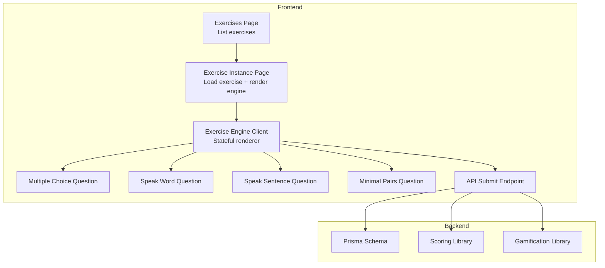
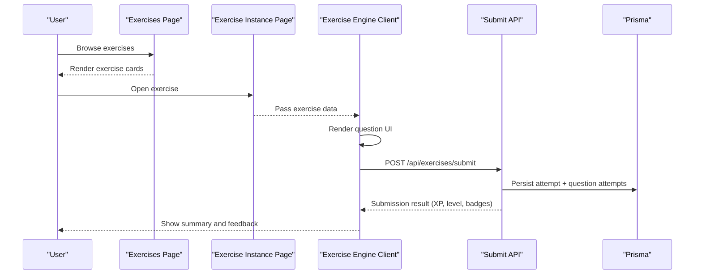
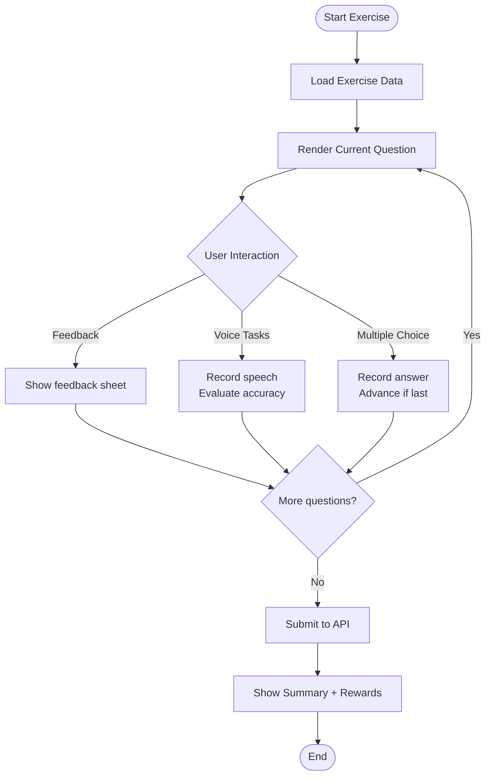
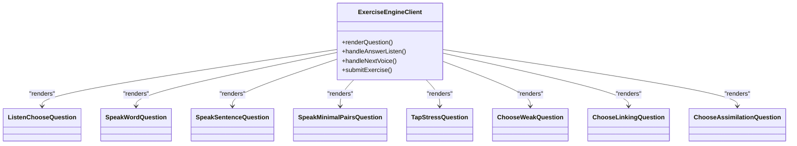
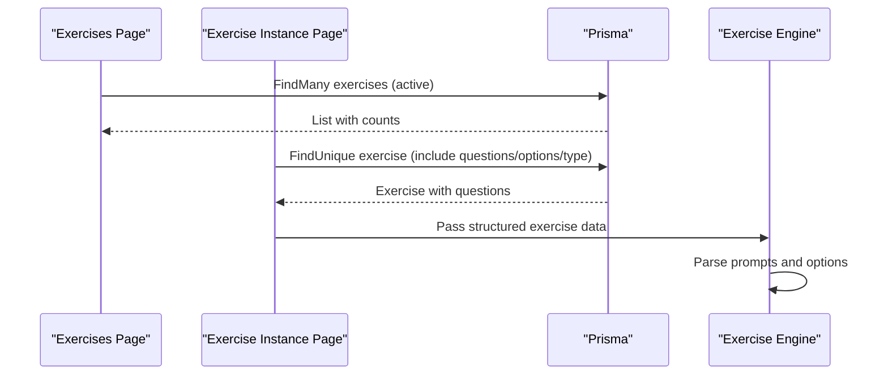
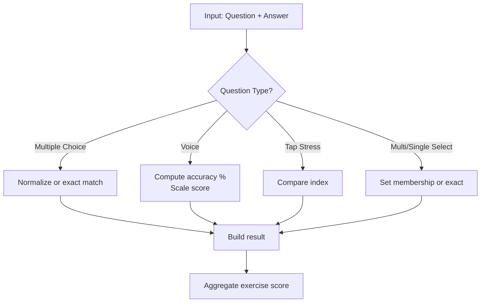
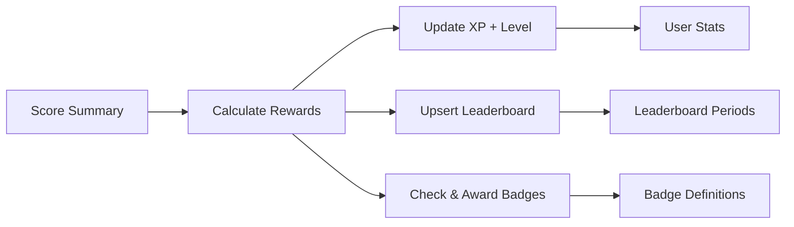
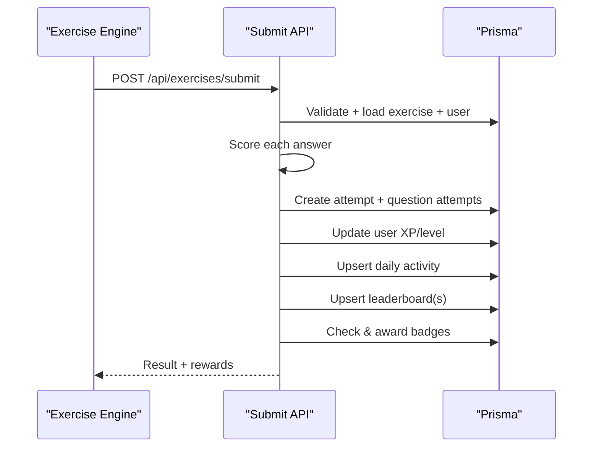
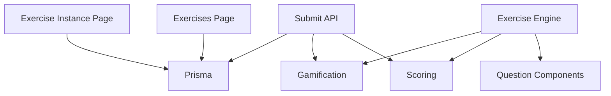
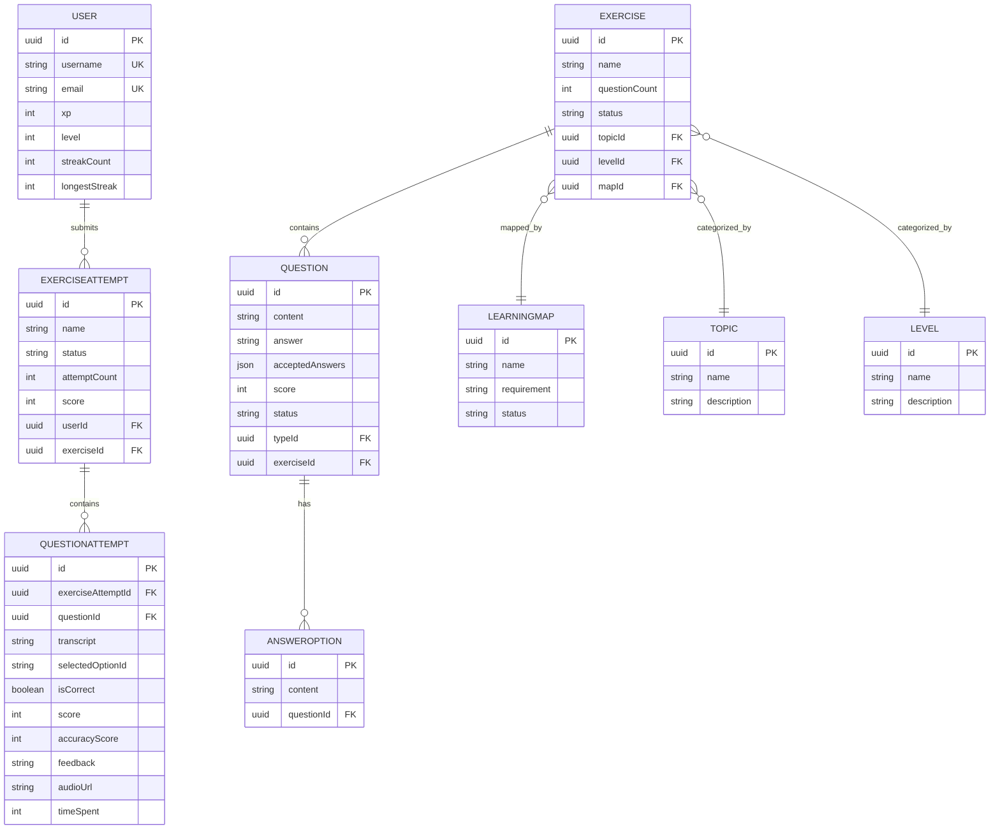

# Exercise Management System

<cite>
**Referenced Files in This Document**
- [page.tsx](file://english_pronunciation_app/frontend/src/app/exercises/page.tsx)
- [page.tsx](file://english_pronunciation_app/frontend/src/app/exercises/[id]/page.tsx)
- [ExerciseEngineClient.tsx](file://english_pronunciation_app/frontend/src/app/exercises/[id]/ExerciseEngineClient.tsx)
- [SpeakWordQuestion.tsx](file://english_pronunciation_app/frontend/src/app/exercises/[id]/SpeakWordQuestion.tsx)
- [SpeakSentenceQuestion.tsx](file://english_pronunciation_app/frontend/src/app/exercises/[id]/SpeakSentenceQuestion.tsx)
- [SpeakMinimalPairsQuestion.tsx](file://english_pronunciation_app/frontend/src/app/exercises/[id]/SpeakMinimalPairsQuestion.tsx)
- [route.ts](file://english_pronunciation_app/frontend/src/app/api/exercises/submit/route.ts)
- [scoring.ts](file://english_pronunciation_app/frontend/src/lib/scoring.ts)
- [gamification.ts](file://english_pronunciation_app/frontend/src/lib/gamification.ts)
- [schema.prisma](file://english_pronunciation_app/frontend/prisma/schema.prisma)
</cite>

## Table of Contents
1. [Introduction](#introduction)
2. [Project Structure](#project-structure)
3. [Core Components](#core-components)
4. [Architecture Overview](#architecture-overview)
5. [Detailed Component Analysis](#detailed-component-analysis)
6. [Dependency Analysis](#dependency-analysis)
7. [Performance Considerations](#performance-considerations)
8. [Troubleshooting Guide](#troubleshooting-guide)
9. [Conclusion](#conclusion)
10. [Appendices](#appendices)

## Introduction
This document describes the exercise management and content delivery system for an English pronunciation training platform. It covers the exercise architecture, question types (multiple choice, speaking, minimal pairs, stress identification, and connected speech patterns), content management patterns, the rendering engine, dynamic content loading, user interaction handling, database schema, scoring and feedback mechanisms, API integration for retrieval and submission, and gamification features such as XP, leveling, streaks, badges, and leaderboards.

## Project Structure
The system is a Next.js application with a frontend and backend API layer. Exercises are presented via pages that load data from the database and render a client-side exercise engine. Submissions are processed through a dedicated API endpoint that evaluates answers, updates user progress, and computes rewards.

**Diagram sources**
- [page.tsx:14-137](file://english_pronunciation_app/frontend/src/app/exercises/page.tsx#L14-L137)
- [page.tsx:47-91](file://english_pronunciation_app/frontend/src/app/exercises/[id]/page.tsx#L47-L91)
- [ExerciseEngineClient.tsx:323-644](file://english_pronunciation_app/frontend/src/app/exercises/[id]/ExerciseEngineClient.tsx#L323-L644)
- [route.ts:47-331](file://english_pronunciation_app/frontend/src/app/api/exercises/submit/route.ts#L47-L331)
- [scoring.ts:191-226](file://english_pronunciation_app/frontend/src/lib/scoring.ts#L191-L226)
- [gamification.ts:195-234](file://english_pronunciation_app/frontend/src/lib/gamification.ts#L195-L234)
- [schema.prisma:175-227](file://english_pronunciation_app/frontend/prisma/schema.prisma#L175-L227)

**Section sources**
- [page.tsx:14-137](file://english_pronunciation_app/frontend/src/app/exercises/page.tsx#L14-L137)
- [page.tsx:47-91](file://english_pronunciation_app/frontend/src/app/exercises/[id]/page.tsx#L47-L91)
- [ExerciseEngineClient.tsx:323-644](file://english_pronunciation_app/frontend/src/app/exercises/[id]/ExerciseEngineClient.tsx#L323-L644)
- [route.ts:47-331](file://english_pronunciation_app/frontend/src/app/api/exercises/submit/route.ts#L47-L331)
- [scoring.ts:191-226](file://english_pronunciation_app/frontend/src/lib/scoring.ts#L191-L226)
- [gamification.ts:195-234](file://english_pronunciation_app/frontend/src/lib/gamification.ts#L195-L234)
- [schema.prisma:175-227](file://english_pronunciation_app/frontend/prisma/schema.prisma#L175-L227)

## Core Components
- Exercises listing page: Loads and displays available exercises with metadata and status.
- Exercise instance page: Fetches a single exercise with its questions and renders the client-side engine.
- Exercise engine client: Manages state, user interactions, question rendering, and submission flow.
- Question components: Specialized UI for multiple-choice, word/sentence speaking, minimal pairs, and stress/tap tasks.
- Submission API: Validates answers, scores them, persists results, and computes XP, level, streak, badges, and leaderboard deltas.
- Scoring library: Implements question-type-specific scoring and exercise-level aggregation.
- Gamification library: Computes XP rewards, level progression, streak handling, badge checks, and leaderboard targets.

**Section sources**
- [page.tsx:14-137](file://english_pronunciation_app/frontend/src/app/exercises/page.tsx#L14-L137)
- [page.tsx:47-91](file://english_pronunciation_app/frontend/src/app/exercises/[id]/page.tsx#L47-L91)
- [ExerciseEngineClient.tsx:323-644](file://english_pronunciation_app/frontend/src/app/exercises/[id]/ExerciseEngineClient.tsx#L323-L644)
- [route.ts:47-331](file://english_pronunciation_app/frontend/src/app/api/exercises/submit/route.ts#L47-L331)
- [scoring.ts:191-226](file://english_pronunciation_app/frontend/src/lib/scoring.ts#L191-L226)
- [gamification.ts:195-234](file://english_pronunciation_app/frontend/src/lib/gamification.ts#L195-L234)

## Architecture Overview
The system follows a layered architecture:
- Presentation layer: Next.js app router pages and client components.
- Domain services: Scoring and gamification utilities.
- Data access: Prisma ORM schema and queries.
- API gateway: Next.js API routes for exercise submission.

**Diagram sources**
- [page.tsx:14-137](file://english_pronunciation_app/frontend/src/app/exercises/page.tsx#L14-L137)
- [page.tsx:47-91](file://english_pronunciation_app/frontend/src/app/exercises/[id]/page.tsx#L47-L91)
- [ExerciseEngineClient.tsx:367-397](file://english_pronunciation_app/frontend/src/app/exercises/[id]/ExerciseEngineClient.tsx#L367-L397)
- [route.ts:182-274](file://english_pronunciation_app/frontend/src/app/api/exercises/submit/route.ts#L182-L274)

## Detailed Component Analysis

### Exercise Rendering Engine
The engine orchestrates the entire exercise lifecycle:
- State management: Tracks current question index, score, correctness, answers, and submission status.
- Dynamic rendering: Renders the appropriate question component based on type.
- Interaction handling: Records answers, manages voice tasks, and advances through questions.
- Submission pipeline: Sends answers to the API, handles errors, and displays results.

**Diagram sources**
- [ExerciseEngineClient.tsx:323-644](file://english_pronunciation_app/frontend/src/app/exercises/[id]/ExerciseEngineClient.tsx#L323-L644)
- [route.ts:182-274](file://english_pronunciation_app/frontend/src/app/api/exercises/submit/route.ts#L182-L274)

**Section sources**
- [ExerciseEngineClient.tsx:323-644](file://english_pronunciation_app/frontend/src/app/exercises/[id]/ExerciseEngineClient.tsx#L323-L644)

### Question Types and Components
- Multiple choice (Listen/Choose): Parses JSON content for options or falls back to stored options; compares normalized or exact answers depending on content type.
- Speak word: Uses Web Speech API and waveform visualization; normalizes answers for comparison.
- Speak sentence: Similar to word but uses sentence-level accuracy scoring against accepted answers.
- Minimal pairs: Two-word challenge with independent recording per word; checks both independently.
- Tap stress: Selects the stressed syllable by index among provided options.
- Choose weak/linked/assimilation: Multi-select or single-select modes with normalized or exact matching.

**Diagram sources**
- [ExerciseEngineClient.tsx:577-630](file://english_pronunciation_app/frontend/src/app/exercises/[id]/ExerciseEngineClient.tsx#L577-L630)
- [SpeakWordQuestion.tsx:57-221](file://english_pronunciation_app/frontend/src/app/exercises/[id]/SpeakWordQuestion.tsx#L57-L221)
- [SpeakSentenceQuestion.tsx:48-224](file://english_pronunciation_app/frontend/src/app/exercises/[id]/SpeakSentenceQuestion.tsx#L48-L224)
- [SpeakMinimalPairsQuestion.tsx:83-257](file://english_pronunciation_app/frontend/src/app/exercises/[id]/SpeakMinimalPairsQuestion.tsx#L83-L257)

**Section sources**
- [ExerciseEngineClient.tsx:182-304](file://english_pronunciation_app/frontend/src/app/exercises/[id]/ExerciseEngineClient.tsx#L182-L304)
- [SpeakWordQuestion.tsx:57-221](file://english_pronunciation_app/frontend/src/app/exercises/[id]/SpeakWordQuestion.tsx#L57-L221)
- [SpeakSentenceQuestion.tsx:48-224](file://english_pronunciation_app/frontend/src/app/exercises/[id]/SpeakSentenceQuestion.tsx#L48-L224)
- [SpeakMinimalPairsQuestion.tsx:83-257](file://english_pronunciation_app/frontend/src/app/exercises/[id]/SpeakMinimalPairsQuestion.tsx#L83-L257)

### Content Loading and Dynamic Parsing
- Exercise page loads exercise metadata and counts active questions.
- Instance page resolves exercise with included questions and options, parsing JSON content for prompts and options.
- Engine parses word prompts for IPA, audio URLs, hints, and listen-choose stages.

**Diagram sources**
- [page.tsx:14-49](file://english_pronunciation_app/frontend/src/app/exercises/page.tsx#L14-L49)
- [page.tsx:50-88](file://english_pronunciation_app/frontend/src/app/exercises/[id]/page.tsx#L50-L88)
- [ExerciseEngineClient.tsx:111-133](file://english_pronunciation_app/frontend/src/app/exercises/[id]/ExerciseEngineClient.tsx#L111-L133)

**Section sources**
- [page.tsx:14-49](file://english_pronunciation_app/frontend/src/app/exercises/page.tsx#L14-L49)
- [page.tsx:50-88](file://english_pronunciation_app/frontend/src/app/exercises/[id]/page.tsx#L50-L88)
- [ExerciseEngineClient.tsx:111-133](file://english_pronunciation_app/frontend/src/app/exercises/[id]/ExerciseEngineClient.tsx#L111-L133)

### Scoring Logic and Feedback
- Multiple choice: Exact match for IPA; normalized match for words; builds result with feedback.
- Voice tasks: Sentence scoring uses word overlap accuracy; word scoring uses normalized comparison; returns accuracy score and scaled points.
- Tap stress: Index-based selection; multi-select and single-select variants with normalized or exact matching.
- Exercise-level aggregation: Raw score, max score, percentage, and correct count.

**Diagram sources**
- [scoring.ts:74-201](file://english_pronunciation_app/frontend/src/lib/scoring.ts#L74-L201)
- [route.ts:120-139](file://english_pronunciation_app/frontend/src/app/api/exercises/submit/route.ts#L120-L139)

**Section sources**
- [scoring.ts:74-201](file://english_pronunciation_app/frontend/src/lib/scoring.ts#L74-L201)
- [route.ts:120-139](file://english_pronunciation_app/frontend/src/app/api/exercises/submit/route.ts#L120-L139)

### Gamification and Rewards
- XP calculation: Base XP equals exercise score; retake bonus for improved attempts; daily bonus thresholds; leaderboard deltas computed per period.
- Level progression: Square-root-based formula; next level threshold derived from current level.
- Badges: Determined by user statistics (completed exercises, skill thresholds, streaks, weekly rank).
- Leaderboard targets: Weekly and monthly periods updated via upsert.

**Diagram sources**
- [gamification.ts:195-234](file://english_pronunciation_app/frontend/src/lib/gamification.ts#L195-L234)
- [gamification.ts:380-488](file://english_pronunciation_app/frontend/src/lib/gamification.ts#L380-L488)
- [route.ts:241-264](file://english_pronunciation_app/frontend/src/app/api/exercises/submit/route.ts#L241-L264)

**Section sources**
- [gamification.ts:195-234](file://english_pronunciation_app/frontend/src/lib/gamification.ts#L195-L234)
- [gamification.ts:380-488](file://english_pronunciation_app/frontend/src/lib/gamification.ts#L380-L488)
- [route.ts:241-264](file://english_pronunciation_app/frontend/src/app/api/exercises/submit/route.ts#L241-L264)

### API Integration for Exercise Retrieval and Submission
- GET exercise instance: Returns structured exercise data with questions, options, and types.
- POST submission: Validates payload, checks question ownership, scores each answer, persists attempts, updates user XP/level, daily activity, leaderboard entries, and awards badges.

**Diagram sources**
- [ExerciseEngineClient.tsx:367-397](file://english_pronunciation_app/frontend/src/app/exercises/[id]/ExerciseEngineClient.tsx#L367-L397)
- [route.ts:47-331](file://english_pronunciation_app/frontend/src/app/api/exercises/submit/route.ts#L47-L331)

**Section sources**
- [ExerciseEngineClient.tsx:367-397](file://english_pronunciation_app/frontend/src/app/exercises/[id]/ExerciseEngineClient.tsx#L367-L397)
- [route.ts:47-331](file://english_pronunciation_app/frontend/src/app/api/exercises/submit/route.ts#L47-L331)

## Dependency Analysis
The system exhibits clear separation of concerns:
- Frontend pages depend on Prisma for data fetching.
- The engine depends on question components and shared libraries.
- The submission API depends on scoring and gamification utilities and writes to the database.

**Diagram sources**
- [page.tsx:14-49](file://english_pronunciation_app/frontend/src/app/exercises/page.tsx#L14-L49)
- [page.tsx:50-88](file://english_pronunciation_app/frontend/src/app/exercises/[id]/page.tsx#L50-L88)
- [ExerciseEngineClient.tsx:323-644](file://english_pronunciation_app/frontend/src/app/exercises/[id]/ExerciseEngineClient.tsx#L323-L644)
- [route.ts:47-331](file://english_pronunciation_app/frontend/src/app/api/exercises/submit/route.ts#L47-L331)
- [scoring.ts:191-226](file://english_pronunciation_app/frontend/src/lib/scoring.ts#L191-L226)
- [gamification.ts:195-234](file://english_pronunciation_app/frontend/src/lib/gamification.ts#L195-L234)

**Section sources**
- [page.tsx:14-49](file://english_pronunciation_app/frontend/src/app/exercises/page.tsx#L14-L49)
- [page.tsx:50-88](file://english_pronunciation_app/frontend/src/app/exercises/[id]/page.tsx#L50-L88)
- [ExerciseEngineClient.tsx:323-644](file://english_pronunciation_app/frontend/src/app/exercises/[id]/ExerciseEngineClient.tsx#L323-L644)
- [route.ts:47-331](file://english_pronunciation_app/frontend/src/app/api/exercises/submit/route.ts#L47-L331)
- [scoring.ts:191-226](file://english_pronunciation_app/frontend/src/lib/scoring.ts#L191-L226)
- [gamification.ts:195-234](file://english_pronunciation_app/frontend/src/lib/gamification.ts#L195-L234)

## Performance Considerations
- Client-side rendering: ExerciseEngineClient uses React state and refs to minimize re-renders; memoization for parsed prompts and progress calculations.
- Audio playback: Lazy initialization of HTMLAudio elements and controlled autoplay to avoid browser restrictions.
- Speech recognition: Graceful handling of unsupported browsers and permission denials; short timeouts for speech recognition sessions.
- Database queries: Efficient includes and filtering to reduce payload sizes; transactional writes for atomic updates.

## Troubleshooting Guide
Common issues and resolutions:
- Exercise not found: Ensure the exercise exists and is active; verify ID routing and status filters.
- Empty answers or validation errors: Confirm the payload includes all required fields and question IDs belong to the exercise.
- Authentication failures: Verify session presence and user existence before processing submissions.
- Speech API unsupported: Prompt users to use supported browsers and enable microphone permissions.
- Audio playback blocked: Handle autoplay policy and provide manual replay controls.

**Section sources**
- [page.tsx:68-70](file://english_pronunciation_app/frontend/src/app/exercises/[id]/page.tsx#L68-L70)
- [route.ts:53-67](file://english_pronunciation_app/frontend/src/app/api/exercises/submit/route.ts#L53-L67)
- [SpeakWordQuestion.tsx:156-205](file://english_pronunciation_app/frontend/src/app/exercises/[id]/SpeakWordQuestion.tsx#L156-L205)

## Conclusion
The exercise management system integrates a robust client-side rendering engine with a typed scoring and gamification framework. It supports diverse question types, dynamic content parsing, real-time user interactions, and comprehensive reward computation. The modular design enables easy extension of question types and content sources while maintaining strong data integrity through Prisma and transactional APIs.

## Appendices

### Database Schema Overview
Key entities and relationships:
- Users, Roles, ExerciseAttempts, QuestionAttempts
- Exercises, Questions, AnswerOptions, QuestionTypes
- Topics, Levels, LearningMaps
- Phonemes, SoundGroups, WordItems, MinimalPairs, SentenceItems
- Leaderboards, Badges, UserBadges, DailyActivities

**Diagram sources**
- [schema.prisma:20-59](file://english_pronunciation_app/frontend/prisma/schema.prisma#L20-L59)
- [schema.prisma:175-227](file://english_pronunciation_app/frontend/prisma/schema.prisma#L175-L227)
- [schema.prisma:420-453](file://english_pronunciation_app/frontend/prisma/schema.prisma#L420-L453)
- [schema.prisma:79-88](file://english_pronunciation_app/frontend/prisma/schema.prisma#L79-L88)
- [schema.prisma:144-164](file://english_pronunciation_app/frontend/prisma/schema.prisma#L144-L164)

**Section sources**
- [schema.prisma:20-59](file://english_pronunciation_app/frontend/prisma/schema.prisma#L20-L59)
- [schema.prisma:175-227](file://english_pronunciation_app/frontend/prisma/schema.prisma#L175-L227)
- [schema.prisma:420-453](file://english_pronunciation_app/frontend/prisma/schema.prisma#L420-L453)
- [schema.prisma:79-88](file://english_pronunciation_app/frontend/prisma/schema.prisma#L79-L88)
- [schema.prisma:144-164](file://english_pronunciation_app/frontend/prisma/schema.prisma#L144-L164)