# Question Types and Formats

<cite>
**Referenced Files in This Document**
- [ExerciseEngineClient.tsx](file://english_pronunciation_app/frontend/src/app/exercises/[id]/ExerciseEngineClient.tsx)
- [scoring.ts](file://english_pronunciation_app/frontend/src/lib/scoring.ts)
- [SpeakMinimalPairsQuestion.tsx](file://english_pronunciation_app/frontend/src/app/exercises/[id]/SpeakMinimalPairsQuestion.tsx)
- [SpeakSentenceQuestion.tsx](file://english_pronunciation_app/frontend/src/app/exercises/[id]/SpeakSentenceQuestion.tsx)
- [SpeakWordQuestion.tsx](file://english_pronunciation_app/frontend/src/app/exercises/[id]/SpeakWordQuestion.tsx)
- [TapStressQuestion.tsx](file://english_pronunciation_app/frontend/src/app/exercises/[id]/TapStressQuestion.tsx)
- [ChooseWeakQuestion.tsx](file://english_pronunciation_app/frontend/src/app/exercises/[id]/ChooseWeakQuestion.tsx)
- [ChooseLinkingQuestion.tsx](file://english_pronunciation_app/frontend/src/app/exercises/[id]/ChooseLinkingQuestion.tsx)
- [ChooseAssimilationQuestion.tsx](file://english_pronunciation_app/frontend/src/app/exercises/[id]/ChooseAssimilationQuestion.tsx)
- [SpeakFeedbackSheet.tsx](file://english_pronunciation_app/frontend/src/app/exercises/[id]/SpeakFeedbackSheet.tsx)
- [useWaveformRecorder.ts](file://english_pronunciation_app/frontend/src/hooks/useWaveformRecorder.ts)
- [useSynthesisAudio.ts](file://english_pronunciation_app/frontend/src/app/exercises/[id]/useSynthesisAudio.ts)
</cite>

## Table of Contents
1. [Introduction](#introduction)
2. [Project Structure](#project-structure)
3. [Core Components](#core-components)
4. [Architecture Overview](#architecture-overview)
5. [Detailed Component Analysis](#detailed-component-analysis)
6. [Dependency Analysis](#dependency-analysis)
7. [Performance Considerations](#performance-considerations)
8. [Troubleshooting Guide](#troubleshooting-guide)
9. [Conclusion](#conclusion)
10. [Appendices](#appendices)

## Introduction
This document explains the pronunciation exercise question types and formats implemented in the frontend. It covers multiple-choice listening/choosing, speaking tasks for words, sentences, and minimal pairs, and specialized phonological tasks: stress tapping, weak vowel identification, linking pair selection, and assimilation choice. It documents question rendering patterns, user interactions, input validation, scoring, and accessibility considerations. It also provides implementation guidelines for adding new question formats.

## Project Structure
The exercise engine orchestrates rendering and scoring across question types. Each question type is implemented as a dedicated component that handles user input, validation, and feedback. Scoring logic is centralized to ensure consistent evaluation across formats.

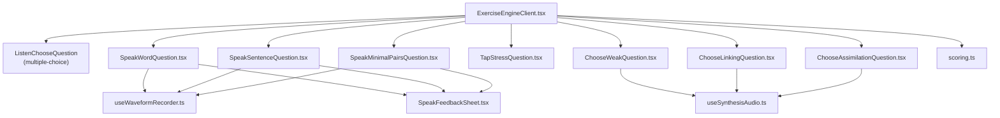

**Diagram sources**
- [ExerciseEngineClient.tsx:323-644](file://english_pronunciation_app/frontend/src/app/exercises/[id]/ExerciseEngineClient.tsx#L323-L644)
- [scoring.ts:191-201](file://english_pronunciation_app/frontend/src/lib/scoring.ts#L191-L201)
- [SpeakMinimalPairsQuestion.tsx:1-258](file://english_pronunciation_app/frontend/src/app/exercises/[id]/SpeakMinimalPairsQuestion.tsx#L1-L258)
- [SpeakSentenceQuestion.tsx:1-225](file://english_pronunciation_app/frontend/src/app/exercises/[id]/SpeakSentenceQuestion.tsx#L1-L225)
- [SpeakWordQuestion.tsx:1-222](file://english_pronunciation_app/frontend/src/app/exercises/[id]/SpeakWordQuestion.tsx#L1-L222)
- [TapStressQuestion.tsx:1-123](file://english_pronunciation_app/frontend/src/app/exercises/[id]/TapStressQuestion.tsx#L1-L123)
- [ChooseWeakQuestion.tsx:1-166](file://english_pronunciation_app/frontend/src/app/exercises/[id]/ChooseWeakQuestion.tsx#L1-L166)
- [ChooseLinkingQuestion.tsx:1-168](file://english_pronunciation_app/frontend/src/app/exercises/[id]/ChooseLinkingQuestion.tsx#L1-L168)
- [ChooseAssimilationQuestion.tsx:1-129](file://english_pronunciation_app/frontend/src/app/exercises/[id]/ChooseAssimilationQuestion.tsx#L1-L129)
- [SpeakFeedbackSheet.tsx:1-96](file://english_pronunciation_app/frontend/src/app/exercises/[id]/SpeakFeedbackSheet.tsx#L1-L96)
- [useWaveformRecorder.ts:1-140](file://english_pronunciation_app/frontend/src/hooks/useWaveformRecorder.ts#L1-L140)
- [useSynthesisAudio.ts:1-36](file://english_pronunciation_app/frontend/src/app/exercises/[id]/useSynthesisAudio.ts#L1-L36)

**Section sources**
- [ExerciseEngineClient.tsx:323-644](file://english_pronunciation_app/frontend/src/app/exercises/[id]/ExerciseEngineClient.tsx#L323-L644)

## Core Components
- ExerciseEngineClient: Orchestrates navigation, scoring, and submission of answers. Renders the appropriate question component based on type and manages feedback overlays.
- Scoring module: Provides scoring functions for each question type, normalization utilities, and exercise-level aggregation.
- Question components: Specialized UI and interaction logic for each format (speaking, choosing, tapping, selecting).
- Feedback sheets: Unified bottom-sheet feedback for speaking tasks.
- Hooks: Waveform visualization and synthesis playback for audio.

Key responsibilities:
- Rendering: Each question type renders its own UI and controls.
- Interaction: Captures user selections, transcriptions, and audio metadata.
- Validation: Applies format-specific rules (exact match for IPA, normalized match for words, multi-select sets, etc.).
- Scoring: Computes correctness, scores, and accuracy metrics per question and exercise totals.
- Accessibility: Uses ARIA attributes, labels, and semantic roles for screen readers and keyboard navigation.

**Section sources**
- [ExerciseEngineClient.tsx:323-644](file://english_pronunciation_app/frontend/src/app/exercises/[id]/ExerciseEngineClient.tsx#L323-L644)
- [scoring.ts:1-227](file://english_pronunciation_app/frontend/src/lib/scoring.ts#L1-L227)

## Architecture Overview
The engine routes to question-specific components depending on question type. Speaking tasks use speech recognition and waveform visualization. Choosing/tapping tasks rely on option selection with immediate feedback. Scoring is performed centrally and aggregated for the exercise summary.

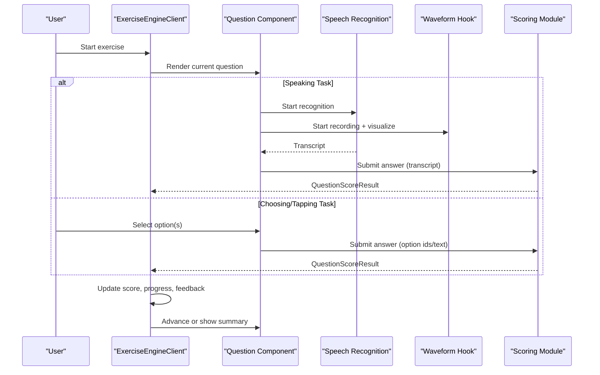

**Diagram sources**
- [ExerciseEngineClient.tsx:444-477](file://english_pronunciation_app/frontend/src/app/exercises/[id]/ExerciseEngineClient.tsx#L444-L477)
- [SpeakSentenceQuestion.tsx:84-106](file://english_pronunciation_app/frontend/src/app/exercises/[id]/SpeakSentenceQuestion.tsx#L84-L106)
- [SpeakMinimalPairsQuestion.tsx:106-148](file://english_pronunciation_app/frontend/src/app/exercises/[id]/SpeakMinimalPairsQuestion.tsx#L106-L148)
- [SpeakWordQuestion.tsx:88-113](file://english_pronunciation_app/frontend/src/app/exercises/[id]/SpeakWordQuestion.tsx#L88-L113)
- [scoring.ts:191-201](file://english_pronunciation_app/frontend/src/lib/scoring.ts#L191-L201)

## Detailed Component Analysis

### Multiple-Choice Questions (Listening/Choosing)
- Purpose: Present phoneme or word options and evaluate exact or normalized matches.
- Rendering: Displays word/skeleton/audio cues and options; supports three-stage listening modes.
- Interaction: Clicking an option submits immediately; feedback highlights correct/incorrect.
- Validation: Exact match for IPA phonemes; normalized match for words.
- Scoring: Uses multiple-choice scoring logic.

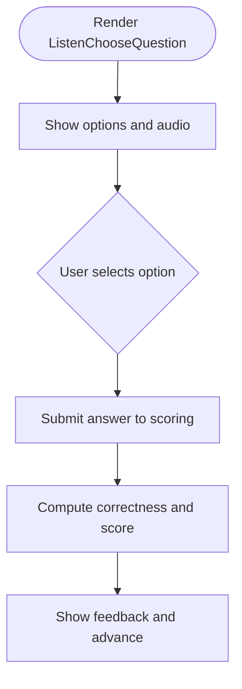

**Diagram sources**
- [ExerciseEngineClient.tsx:182-304](file://english_pronunciation_app/frontend/src/app/exercises/[id]/ExerciseEngineClient.tsx#L182-L304)
- [scoring.ts:74-106](file://english_pronunciation_app/frontend/src/lib/scoring.ts#L74-L106)

**Section sources**
- [ExerciseEngineClient.tsx:182-304](file://english_pronunciation_app/frontend/src/app/exercises/[id]/ExerciseEngineClient.tsx#L182-L304)
- [scoring.ts:74-106](file://english_pronunciation_app/frontend/src/lib/scoring.ts#L74-L106)

### Speaking Exercises: Words
- Purpose: Pronounce a single word with optional IPA and audio support.
- Rendering: Shows masked/unmasked word, audio button, microphone button, waveform visualization, and dynamic volume hints.
- Interaction: Start/stop recording, retry, and proceed after validation.
- Validation: Normalized comparison against expected answer; normalized answer normalization used to ignore punctuation/spaces.
- Scoring: Overlap accuracy with multi-answer support; threshold determines correctness.

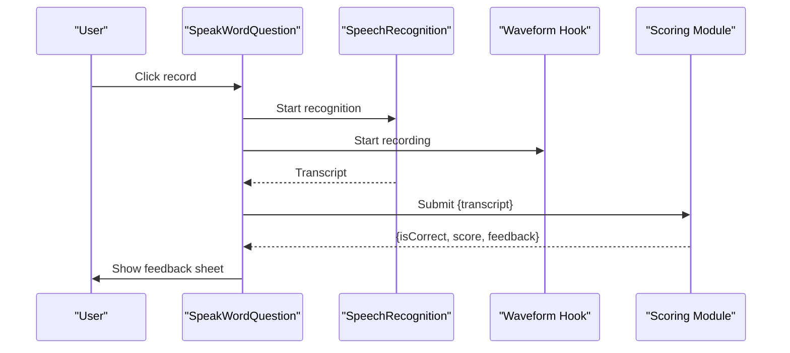

**Diagram sources**
- [SpeakWordQuestion.tsx:88-113](file://english_pronunciation_app/frontend/src/app/exercises/[id]/SpeakWordQuestion.tsx#L88-L113)
- [useWaveformRecorder.ts:99-123](file://english_pronunciation_app/frontend/src/hooks/useWaveformRecorder.ts#L99-L123)
- [scoring.ts:108-131](file://english_pronunciation_app/frontend/src/lib/scoring.ts#L108-L131)

**Section sources**
- [SpeakWordQuestion.tsx:1-222](file://english_pronunciation_app/frontend/src/app/exercises/[id]/SpeakWordQuestion.tsx#L1-L222)
- [useWaveformRecorder.ts:1-140](file://english_pronunciation_app/frontend/src/hooks/useWaveformRecorder.ts#L1-L140)
- [scoring.ts:108-131](file://english_pronunciation_app/frontend/src/lib/scoring.ts#L108-L131)

### Speaking Exercises: Sentences
- Purpose: Produce a full sentence transcription with optional IPA.
- Rendering: Masked sentence toggle, audio replay, waveform, and dynamic feedback.
- Interaction: Start/stop recording, retry, and proceed after accuracy threshold.
- Validation: Multi-candidate overlap accuracy; supports alternate correct answers.
- Scoring: Accuracy percentage mapped to score; threshold determines correctness.

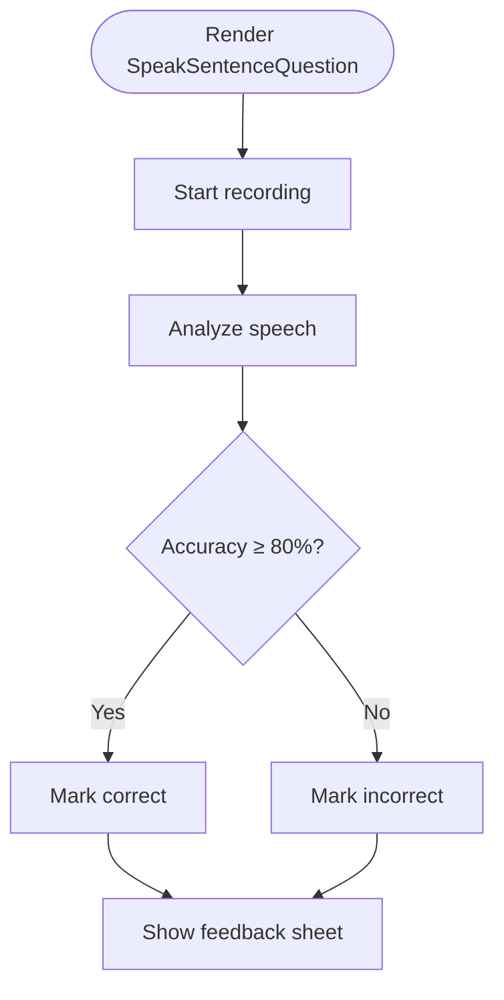

**Diagram sources**
- [SpeakSentenceQuestion.tsx:69-82](file://english_pronunciation_app/frontend/src/app/exercises/[id]/SpeakSentenceQuestion.tsx#L69-L82)
- [scoring.ts:108-131](file://english_pronunciation_app/frontend/src/lib/scoring.ts#L108-L131)

**Section sources**
- [SpeakSentenceQuestion.tsx:1-225](file://english_pronunciation_app/frontend/src/app/exercises/[id]/SpeakSentenceQuestion.tsx#L1-L225)
- [scoring.ts:108-131](file://english_pronunciation_app/frontend/src/lib/scoring.ts#L108-L131)

### Speaking Exercises: Minimal Pairs
- Purpose: Compare two near-contrast words; validate both independently.
- Rendering: Two-column layout with IPA, masked words, audio buttons, waveform, and recording controls.
- Interaction: Record each word separately; unified check button validates both; retry resets both sides.
- Validation: Independent normalized comparisons per word; combined result determines correctness.
- Scoring: Both must meet threshold; feedback sheet shows combined transcript.

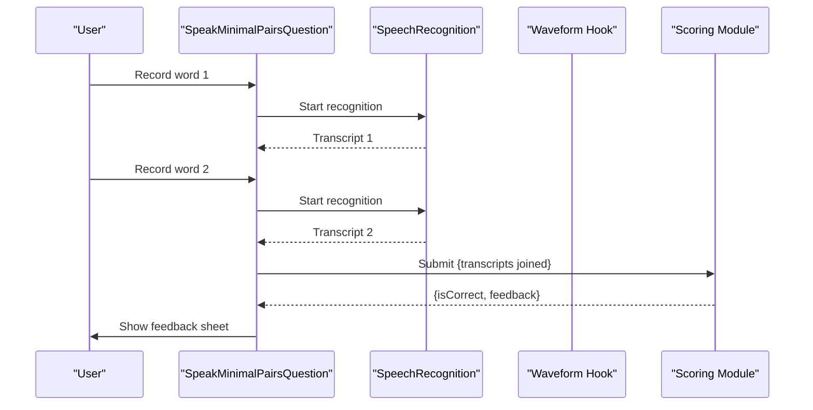

**Diagram sources**
- [SpeakMinimalPairsQuestion.tsx:106-157](file://english_pronunciation_app/frontend/src/app/exercises/[id]/SpeakMinimalPairsQuestion.tsx#L106-L157)
- [scoring.ts:108-131](file://english_pronunciation_app/frontend/src/lib/scoring.ts#L108-L131)

**Section sources**
- [SpeakMinimalPairsQuestion.tsx:1-258](file://english_pronunciation_app/frontend/src/app/exercises/[id]/SpeakMinimalPairsQuestion.tsx#L1-L258)
- [scoring.ts:108-131](file://english_pronunciation_app/frontend/src/lib/scoring.ts#L108-L131)

### Stress Identification (Tap Stress)
- Purpose: Identify the stressed syllable in a word.
- Rendering: Word, optional IPA, audio button, and syllable buttons; auto-play audio on load.
- Interaction: Tap the correct syllable; disabled after submission; visual feedback for correct/incorrect.
- Validation: Index-based correctness against stored answer index.
- Scoring: Builds standardized result with correctness and feedback.

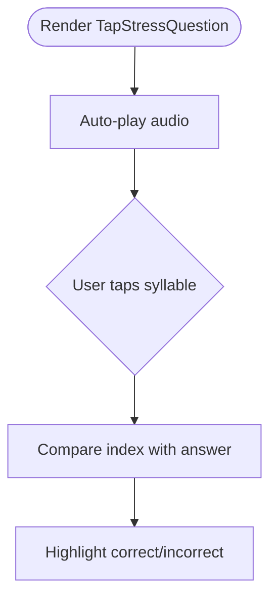

**Diagram sources**
- [TapStressQuestion.tsx:46-60](file://english_pronunciation_app/frontend/src/app/exercises/[id]/TapStressQuestion.tsx#L46-L60)
- [scoring.ts:157-167](file://english_pronunciation_app/frontend/src/lib/scoring.ts#L157-L167)

**Section sources**
- [TapStressQuestion.tsx:1-123](file://english_pronunciation_app/frontend/src/app/exercises/[id]/TapStressQuestion.tsx#L1-L123)
- [scoring.ts:157-167](file://english_pronunciation_app/frontend/src/lib/scoring.ts#L157-L167)

### Weak Vowel Questions
- Purpose: Identify words reduced to weak forms (e.g., schwa) in connected speech.
- Rendering: Sentence with optional IPA; auto-play; word chips as selectable options.
- Interaction: Toggle multiple words; submit; visual feedback highlights correct/incorrect selections.
- Validation: Multi-select set equality; normalization ignores punctuation/spaces; preserves “→” for linking contexts.
- Scoring: Builds standardized result with correctness and feedback.

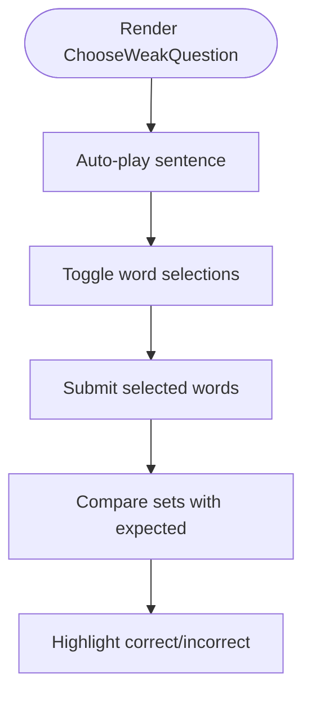

**Diagram sources**
- [ChooseWeakQuestion.tsx:86-104](file://english_pronunciation_app/frontend/src/app/exercises/[id]/ChooseWeakQuestion.tsx#L86-L104)
- [scoring.ts:169-176](file://english_pronunciation_app/frontend/src/lib/scoring.ts#L169-L176)

**Section sources**
- [ChooseWeakQuestion.tsx:1-166](file://english_pronunciation_app/frontend/src/app/exercises/[id]/ChooseWeakQuestion.tsx#L1-L166)
- [scoring.ts:169-176](file://english_pronunciation_app/frontend/src/lib/scoring.ts#L169-L176)

### Linking Questions
- Purpose: Identify adjacent word boundary links in connected speech.
- Rendering: Sentence with optional IPA; auto-play; word pair chips as selectable options.
- Interaction: Toggle pairs; submit; visual feedback highlights correct/incorrect selections.
- Validation: Multi-select set equality; normalization preserves “→” joining character.
- Scoring: Builds standardized result with correctness and feedback.

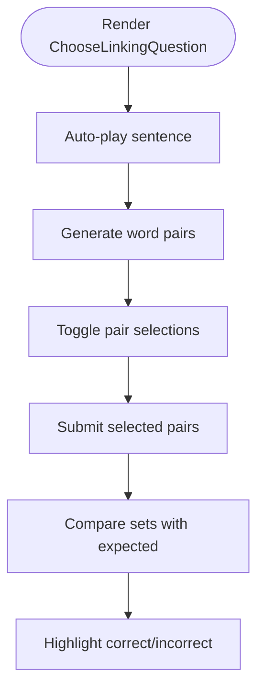

**Diagram sources**
- [ChooseLinkingQuestion.tsx:89-107](file://english_pronunciation_app/frontend/src/app/exercises/[id]/ChooseLinkingQuestion.tsx#L89-L107)
- [scoring.ts:169-176](file://english_pronunciation_app/frontend/src/lib/scoring.ts#L169-L176)

**Section sources**
- [ChooseLinkingQuestion.tsx:1-168](file://english_pronunciation_app/frontend/src/app/exercises/[id]/ChooseLinkingQuestion.tsx#L1-L168)
- [scoring.ts:169-176](file://english_pronunciation_app/frontend/src/lib/scoring.ts#L169-L176)

### Assimilation Choice Questions
- Purpose: Choose the correct surface form versus underlying form in assimilation.
- Rendering: Sentence with optional IPA; auto-play; original/result buttons.
- Interaction: Select the correct pronunciation; visual feedback highlights correct/incorrect.
- Validation: Exact match against answer content (preserves IPA characters).
- Scoring: Builds standardized result with correctness and feedback.

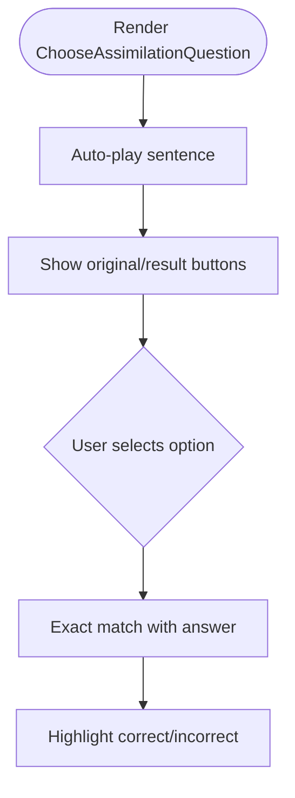

**Diagram sources**
- [ChooseAssimilationQuestion.tsx:67-68](file://english_pronunciation_app/frontend/src/app/exercises/[id]/ChooseAssimilationQuestion.tsx#L67-L68)
- [scoring.ts:178-189](file://english_pronunciation_app/frontend/src/lib/scoring.ts#L178-L189)

**Section sources**
- [ChooseAssimilationQuestion.tsx:1-129](file://english_pronunciation_app/frontend/src/app/exercises/[id]/ChooseAssimilationQuestion.tsx#L1-L129)
- [scoring.ts:178-189](file://english_pronunciation_app/frontend/src/lib/scoring.ts#L178-L189)

### Question Rendering Patterns and User Interaction Handling
- Engine routing: Based on question.type, the engine renders the appropriate component.
- Feedback overlays: Non-speaking tasks show inline feedback; speaking tasks show persistent bottom-sheet feedback.
- Progress and scoring: Centralized state tracks current index, score, and incorrect questions; submission aggregates results.

**Section sources**
- [ExerciseEngineClient.tsx:521-641](file://english_pronunciation_app/frontend/src/app/exercises/[id]/ExerciseEngineClient.tsx#L521-L641)
- [SpeakFeedbackSheet.tsx:1-96](file://english_pronunciation_app/frontend/src/app/exercises/[id]/SpeakFeedbackSheet.tsx#L1-L96)

### Input Validation and Scoring Mechanisms
- Multiple-choice: Exact match for IPA; normalized match for words.
- Voice tasks: Overlap accuracy with optional multi-answer candidates; threshold-based correctness.
- Tap stress: Index-based correctness.
- Multi-select tasks: Set equality after normalization; special handling for linking “→”.
- Single-select tasks: Exact match preserving IPA characters.

**Section sources**
- [scoring.ts:40-72](file://english_pronunciation_app/frontend/src/lib/scoring.ts#L40-L72)
- [scoring.ts:74-106](file://english_pronunciation_app/frontend/src/lib/scoring.ts#L74-L106)
- [scoring.ts:108-131](file://english_pronunciation_app/frontend/src/lib/scoring.ts#L108-L131)
- [scoring.ts:157-167](file://english_pronunciation_app/frontend/src/lib/scoring.ts#L157-L167)
- [scoring.ts:169-189](file://english_pronunciation_app/frontend/src/lib/scoring.ts#L169-L189)

### Accessibility Considerations
- ARIA roles and labels: Buttons include aria-labels and aria-pressed states for selected options.
- Keyboard navigation: Buttons are focusable and operable via Enter/Space.
- Screen reader announcements: Status updates and feedback are announced via live regions.
- Visual feedback: Color-coded states and animations indicate recording levels and correctness.
- Audio cues: Autoplay of audio and synthesized speech are supported; muted state toggles sound effects.

**Section sources**
- [SpeakWordQuestion.tsx:161-166](file://english_pronunciation_app/frontend/src/app/exercises/[id]/SpeakWordQuestion.tsx#L161-L166)
- [SpeakSentenceQuestion.tsx:155-158](file://english_pronunciation_app/frontend/src/app/exercises/[id]/SpeakSentenceQuestion.tsx#L155-L158)
- [SpeakMinimalPairsQuestion.tsx:207-213](file://english_pronunciation_app/frontend/src/app/exercises/[id]/SpeakMinimalPairsQuestion.tsx#L207-L213)
- [TapStressQuestion.tsx:109-112](file://english_pronunciation_app/frontend/src/app/exercises/[id]/TapStressQuestion.tsx#L109-L112)
- [ChooseWeakQuestion.tsx:142-145](file://english_pronunciation_app/frontend/src/app/exercises/[id]/ChooseWeakQuestion.tsx#L142-L145)
- [ChooseLinkingQuestion.tsx:142-145](file://english_pronunciation_app/frontend/src/app/exercises/[id]/ChooseLinkingQuestion.tsx#L142-L145)
- [ChooseAssimilationQuestion.tsx:108-118](file://english_pronunciation_app/frontend/src/app/exercises/[id]/ChooseAssimilationQuestion.tsx#L108-L118)

## Dependency Analysis
- Engine depends on question components for rendering and on scoring for evaluation.
- Speaking components depend on speech recognition APIs and waveform hooks.
- Choosing components depend on synthesis audio hook for auto-play.
- Scoring module centralizes normalization and scoring logic.

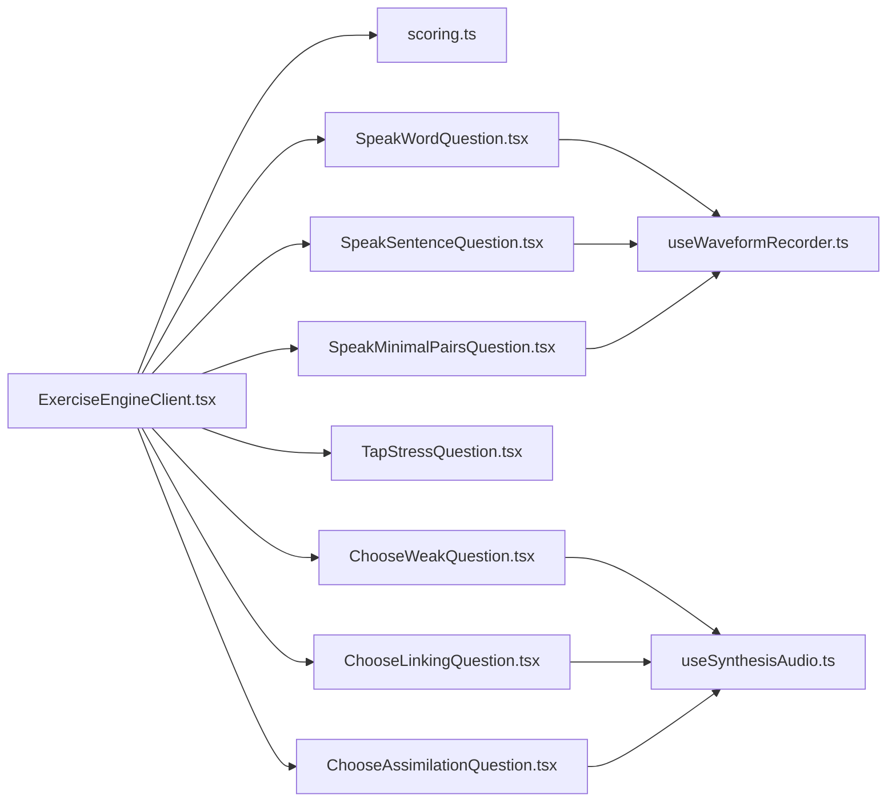

**Diagram sources**
- [ExerciseEngineClient.tsx:12-18](file://english_pronunciation_app/frontend/src/app/exercises/[id]/ExerciseEngineClient.tsx#L12-L18)
- [scoring.ts:1-227](file://english_pronunciation_app/frontend/src/lib/scoring.ts#L1-L227)
- [SpeakWordQuestion.tsx:1-222](file://english_pronunciation_app/frontend/src/app/exercises/[id]/SpeakWordQuestion.tsx#L1-L222)
- [SpeakSentenceQuestion.tsx:1-225](file://english_pronunciation_app/frontend/src/app/exercises/[id]/SpeakSentenceQuestion.tsx#L1-L225)
- [SpeakMinimalPairsQuestion.tsx:1-258](file://english_pronunciation_app/frontend/src/app/exercises/[id]/SpeakMinimalPairsQuestion.tsx#L1-L258)
- [TapStressQuestion.tsx:1-123](file://english_pronunciation_app/frontend/src/app/exercises/[id]/TapStressQuestion.tsx#L1-L123)
- [ChooseWeakQuestion.tsx:1-166](file://english_pronunciation_app/frontend/src/app/exercises/[id]/ChooseWeakQuestion.tsx#L1-L166)
- [ChooseLinkingQuestion.tsx:1-168](file://english_pronunciation_app/frontend/src/app/exercises/[id]/ChooseLinkingQuestion.tsx#L1-L168)
- [ChooseAssimilationQuestion.tsx:1-129](file://english_pronunciation_app/frontend/src/app/exercises/[id]/ChooseAssimilationQuestion.tsx#L1-L129)
- [useWaveformRecorder.ts:1-140](file://english_pronunciation_app/frontend/src/hooks/useWaveformRecorder.ts#L1-L140)
- [useSynthesisAudio.ts:1-36](file://english_pronunciation_app/frontend/src/app/exercises/[id]/useSynthesisAudio.ts#L1-L36)

**Section sources**
- [ExerciseEngineClient.tsx:323-644](file://english_pronunciation_app/frontend/src/app/exercises/[id]/ExerciseEngineClient.tsx#L323-L644)

## Performance Considerations
- Speech recognition timeouts: Prevent long-running sessions; ensure timely stops.
- Waveform rendering: Efficient RMS monitoring and animation frame scheduling; clear buffers on reset to avoid stale visuals.
- Scoring computations: Tokenization and overlap calculations are linear in token counts; keep candidate lists concise.
- Network submission: Debounce or batch submissions if extending to many questions; handle errors gracefully.

[No sources needed since this section provides general guidance]

## Troubleshooting Guide
Common issues and resolutions:
- Browser lacks Web Speech API: Prompt to use supported browsers; disable recording controls with clear messages.
- Microphone blocked: Provide explicit steps to grant permissions; offer retry actions.
- No speech detected: Advise speaking clearly and loudly; provide dynamic feedback based on recording level.
- Stale waveform after retries: Ensure waveform and internal buffers are cleared on reset.
- Incorrect scoring for IPA: Use exact match for IPA content; avoid normalization that strips IPA characters.

**Section sources**
- [SpeakSentenceQuestion.tsx:180-200](file://english_pronunciation_app/frontend/src/app/exercises/[id]/SpeakSentenceQuestion.tsx#L180-L200)
- [SpeakWordQuestion.tsx:186-206](file://english_pronunciation_app/frontend/src/app/exercises/[id]/SpeakWordQuestion.tsx#L186-L206)
- [SpeakMinimalPairsQuestion.tsx:170-173](file://english_pronunciation_app/frontend/src/app/exercises/[id]/SpeakMinimalPairsQuestion.tsx#L170-L173)
- [useWaveformRecorder.ts:89-97](file://english_pronunciation_app/frontend/src/hooks/useWaveformRecorder.ts#L89-L97)

## Conclusion
The pronunciation exercise system integrates diverse question formats with robust rendering, interaction, validation, and scoring. Centralized scoring ensures consistent evaluation, while specialized components deliver tailored user experiences. Accessibility and performance are addressed through ARIA, dynamic feedback, and efficient rendering.

[No sources needed since this section summarizes without analyzing specific files]

## Appendices

### Example Question Data Structures
- ExerciseQuestion: Includes id, name, content, type, answer, score, acceptedAnswers, and options.
- WordPrompt: Supports word, IPA, audioUrl, hint, and optional listen-choose 3-stage fields.
- SubmitAnswer: Captures questionId, selectedOptionId, selectedText, transcript, audioUrl, timeSpent.

**Section sources**
- [ExerciseEngineClient.tsx:25-69](file://english_pronunciation_app/frontend/src/app/exercises/[id]/ExerciseEngineClient.tsx#L25-L69)
- [ExerciseEngineClient.tsx:111-133](file://english_pronunciation_app/frontend/src/app/exercises/[id]/ExerciseEngineClient.tsx#L111-L133)

### Accepted Answer Formats
- Multiple-choice: Option content or selected option id.
- Voice (words/sentences/minimal pairs): Transcript string; normalized for comparison.
- Tap stress: Selected syllable index derived from option id.
- Multi-select (weak/linking): Comma-separated selected texts.
- Single-select (assimilation): Exact content match.

**Section sources**
- [scoring.ts:74-106](file://english_pronunciation_app/frontend/src/lib/scoring.ts#L74-L106)
- [scoring.ts:108-131](file://english_pronunciation_app/frontend/src/lib/scoring.ts#L108-L131)
- [scoring.ts:157-167](file://english_pronunciation_app/frontend/src/lib/scoring.ts#L157-L167)
- [scoring.ts:169-189](file://english_pronunciation_app/frontend/src/lib/scoring.ts#L169-L189)

### Implementation Guidelines for New Question Formats
- Define a new component under exercises/[id]/ with a clear rendering and interaction model.
- Add a new question type id and route in the engine’s rendering switch.
- Implement scoring in scoring.ts with a dedicated function and integrate with scoreQuestion dispatch.
- Handle normalization and validation consistently with existing formats.
- Provide accessibility labels, ARIA attributes, and keyboard operability.
- Integrate waveform or synthesis hooks as needed.
- Test browser compatibility and provide fallback messaging for unsupported features.

**Section sources**
- [ExerciseEngineClient.tsx:521-631](file://english_pronunciation_app/frontend/src/app/exercises/[id]/ExerciseEngineClient.tsx#L521-L631)
- [scoring.ts:191-201](file://english_pronunciation_app/frontend/src/lib/scoring.ts#L191-L201)