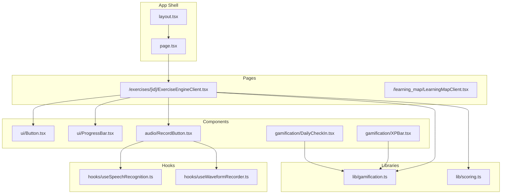
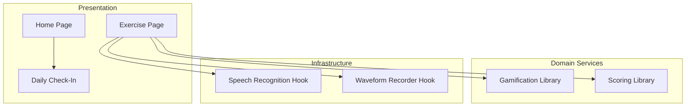
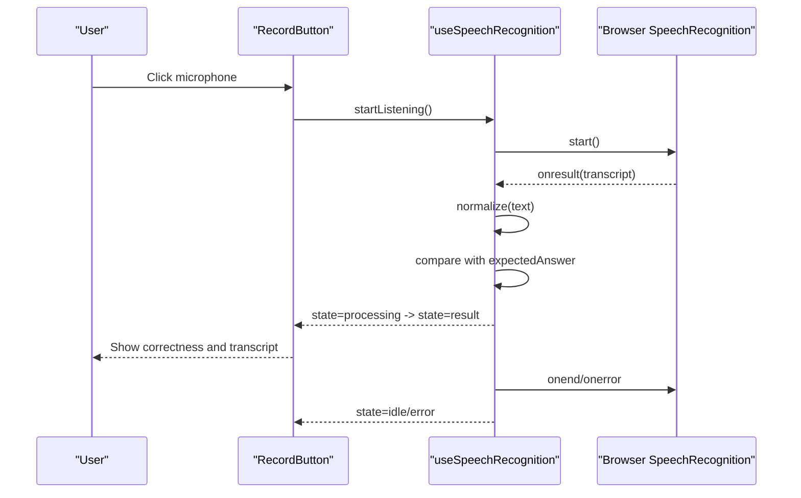
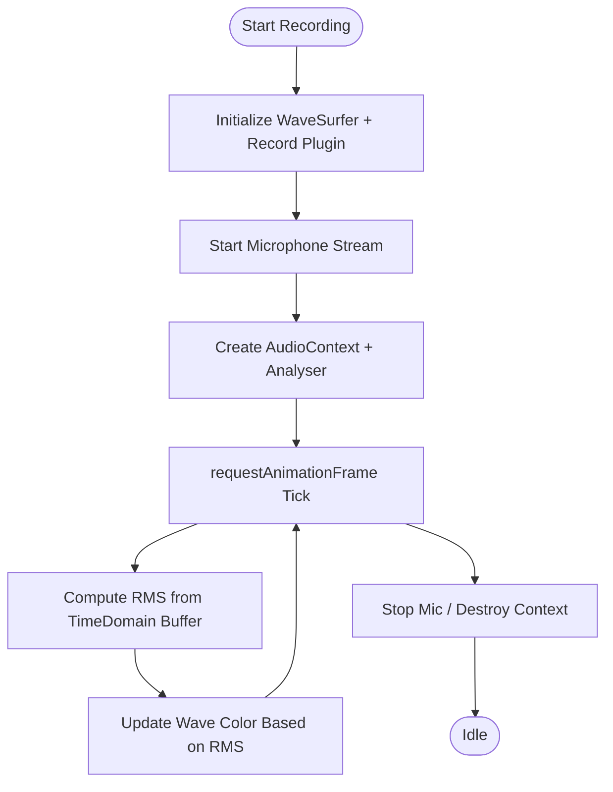
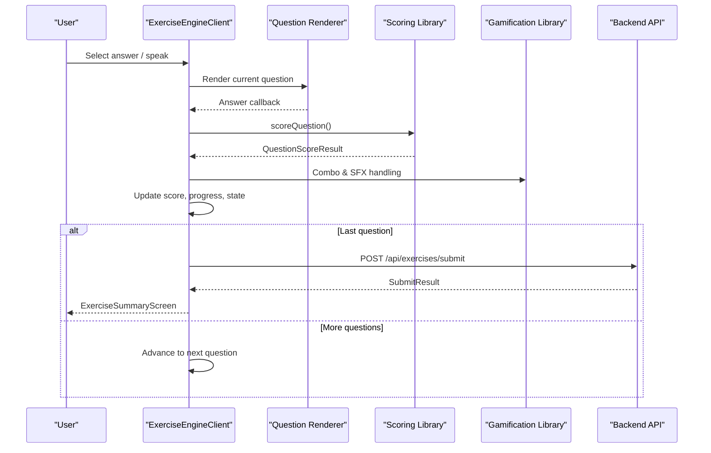
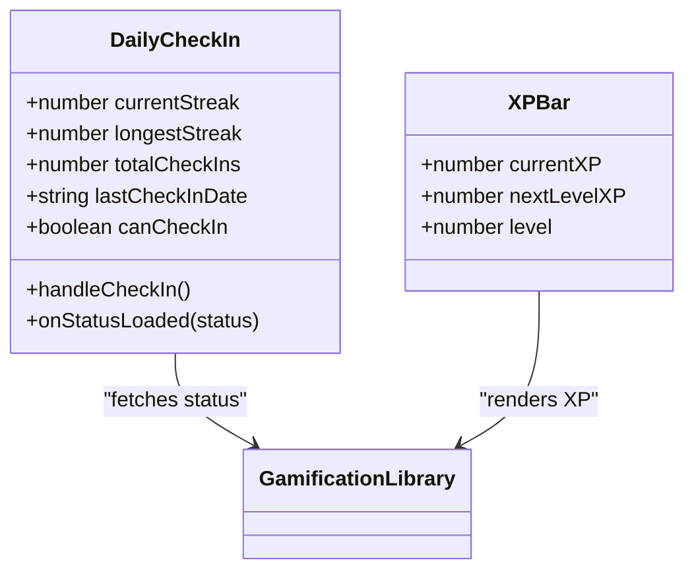
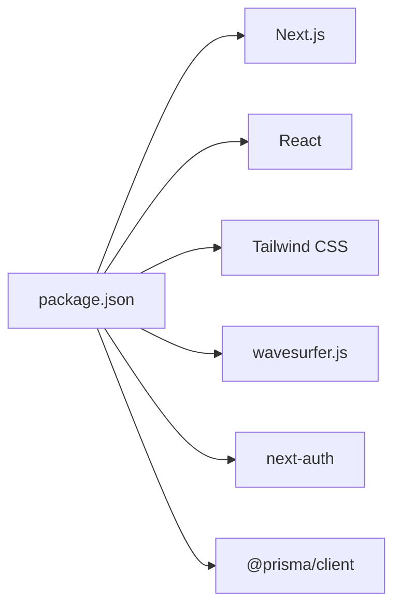

# Frontend Development

<cite>
**Referenced Files in This Document**
- [package.json](file://english_pronunciation_app/frontend/package.json)
- [tsconfig.json](file://english_pronunciation_app/frontend/tsconfig.json)
- [next.config.mjs](file://english_pronunciation_app/frontend/next.config.mjs)
- [layout.tsx](file://english_pronunciation_app/frontend/src/app/layout.tsx)
- [page.tsx](file://english_pronunciation_app/frontend/src/app/page.tsx)
- [useSpeechRecognition.ts](file://english_pronunciation_app/frontend/src/hooks/useSpeechRecognition.ts)
- [useWaveformRecorder.ts](file://english_pronunciation_app/frontend/src/hooks/useWaveformRecorder.ts)
- [RecordButton.tsx](file://english_pronunciation_app/frontend/src/components/audio/RecordButton.tsx)
- [DailyCheckIn.tsx](file://english_pronunciation_app/frontend/src/components/gamification/DailyCheckIn.tsx)
- [XPBar.tsx](file://english_pronunciation_app/frontend/src/components/gamification/XPBar.tsx)
- [ExerciseEngineClient.tsx](file://english_pronunciation_app/frontend/src/app/exercises/[id]/ExerciseEngineClient.tsx)
- [Button.tsx](file://english_pronunciation_app/frontend/src/components/ui/Button.tsx)
- [ProgressBar.tsx](file://english_pronunciation_app/frontend/src/components/ui/ProgressBar.tsx)
- [gamification.ts](file://english_pronunciation_app/frontend/src/lib/gamification.ts)
- [scoring.ts](file://english_pronunciation_app/frontend/src/lib/scoring.ts)
</cite>

## Table of Contents
1. [Introduction](#introduction)
2. [Project Structure](#project-structure)
3. [Core Components](#core-components)
4. [Architecture Overview](#architecture-overview)
5. [Detailed Component Analysis](#detailed-component-analysis)
6. [Dependency Analysis](#dependency-analysis)
7. [Performance Considerations](#performance-considerations)
8. [Troubleshooting Guide](#troubleshooting-guide)
9. [Conclusion](#conclusion)
10. [Appendices](#appendices)

## Introduction
This document provides comprehensive frontend development guidance for the Next.js application focused on English pronunciation training. It covers the application structure, routing system, component architecture, state management patterns, TypeScript configuration, Tailwind CSS styling, responsive design, speech recognition and audio recording integrations, real-time feedback mechanisms, gamification UI components, the exercise rendering engine, and user interface patterns. It also includes guidance on component development, styling best practices, accessibility implementation, performance optimization, testing strategies, and backend API integration.

## Project Structure
The frontend is organized under the Next.js App Router convention with a strict separation of concerns:
- Application shell and global layout in the app directory
- Page-level components and routes
- Shared UI components under components
- Hooks for reusable logic
- Libraries for domain logic (gamification, scoring)
- Global styles and fonts

Key characteristics:
- Strict TypeScript configuration with path aliases
- Tailwind CSS v4 for utility-first styling
- Next.js App Router with dynamic routes and server-side rendering
- Client components marked with "use client" for interactivity

**Diagram sources**
- [layout.tsx:1-51](file://english_pronunciation_app/frontend/src/app/layout.tsx#L1-L51)
- [page.tsx:1-141](file://english_pronunciation_app/frontend/src/app/page.tsx#L1-L141)
- [ExerciseEngineClient.tsx:1-645](file://english_pronunciation_app/frontend/src/app/exercises/[id]/ExerciseEngineClient.tsx#L1-L645)
- [Button.tsx:1-83](file://english_pronunciation_app/frontend/src/components/ui/Button.tsx#L1-L83)
- [ProgressBar.tsx:1-66](file://english_pronunciation_app/frontend/src/components/ui/ProgressBar.tsx#L1-L66)
- [RecordButton.tsx:1-130](file://english_pronunciation_app/frontend/src/components/audio/RecordButton.tsx#L1-L130)
- [useSpeechRecognition.ts:1-111](file://english_pronunciation_app/frontend/src/hooks/useSpeechRecognition.ts#L1-L111)
- [useWaveformRecorder.ts:1-140](file://english_pronunciation_app/frontend/src/hooks/useWaveformRecorder.ts#L1-L140)
- [DailyCheckIn.tsx:1-234](file://english_pronunciation_app/frontend/src/components/gamification/DailyCheckIn.tsx#L1-L234)
- [XPBar.tsx:1-50](file://english_pronunciation_app/frontend/src/components/gamification/XPBar.tsx#L1-L50)
- [gamification.ts:1-575](file://english_pronunciation_app/frontend/src/lib/gamification.ts#L1-L575)
- [scoring.ts:1-227](file://english_pronunciation_app/frontend/src/lib/scoring.ts#L1-L227)

**Section sources**
- [package.json:1-45](file://english_pronunciation_app/frontend/package.json#L1-L45)
- [tsconfig.json:1-42](file://english_pronunciation_app/frontend/tsconfig.json#L1-L42)
- [next.config.mjs:1-5](file://english_pronunciation_app/frontend/next.config.mjs#L1-L5)
- [layout.tsx:1-51](file://english_pronunciation_app/frontend/src/app/layout.tsx#L1-L51)
- [page.tsx:1-141](file://english_pronunciation_app/frontend/src/app/page.tsx#L1-L141)

## Core Components
This section documents the foundational building blocks of the frontend.

- Global Layout and Fonts
  - Root layout sets up metadata, fonts, theme provider, navbar/footer, and hydration-safe initialization for light mode only.
  - Inter and Noto Sans fonts are configured with CSS variables for consistent typography.

- UI Primitive Components
  - Button: Implements WCAG-compliant variants, sizes, icons, loading states, and focus management.
  - ProgressBar: Accessible progress indicator with ARIA attributes and optional percentage display.

- Speech and Audio Integration
  - useSpeechRecognition: Browser SpeechRecognition wrapper with state machine, normalization, and error handling.
  - useWaveformRecorder: Wavesurfer-based recorder with real-time RMS-based visual feedback and microphone lifecycle management.
  - RecordButton: Interactive microphone button with state-driven styling, live regions for screen readers, and result presentation.

- Gamification Components
  - DailyCheckIn: Fetches and updates daily check-in status, displays streak metrics, and handles API errors.
  - XPBar: Visual progress bar for experience points with level display and remaining XP calculation.

- Exercise Engine
  - ExerciseEngineClient: Central orchestration for exercise rendering, scoring, feedback, combo streaks, SFX, and submission to backend.

**Section sources**
- [layout.tsx:1-51](file://english_pronunciation_app/frontend/src/app/layout.tsx#L1-L51)
- [Button.tsx:1-83](file://english_pronunciation_app/frontend/src/components/ui/Button.tsx#L1-L83)
- [ProgressBar.tsx:1-66](file://english_pronunciation_app/frontend/src/components/ui/ProgressBar.tsx#L1-L66)
- [useSpeechRecognition.ts:1-111](file://english_pronunciation_app/frontend/src/hooks/useSpeechRecognition.ts#L1-L111)
- [useWaveformRecorder.ts:1-140](file://english_pronunciation_app/frontend/src/hooks/useWaveformRecorder.ts#L1-L140)
- [RecordButton.tsx:1-130](file://english_pronunciation_app/frontend/src/components/audio/RecordButton.tsx#L1-L130)
- [DailyCheckIn.tsx:1-234](file://english_pronunciation_app/frontend/src/components/gamification/DailyCheckIn.tsx#L1-L234)
- [XPBar.tsx:1-50](file://english_pronunciation_app/frontend/src/components/gamification/XPBar.tsx#L1-L50)
- [ExerciseEngineClient.tsx:1-645](file://english_pronunciation_app/frontend/src/app/exercises/[id]/ExerciseEngineClient.tsx#L1-L645)

## Architecture Overview
The frontend follows a layered architecture:
- Presentation Layer: Pages and components
- Domain Services: Libraries for gamification and scoring
- Infrastructure: Hooks encapsulating browser APIs (SpeechRecognition, MediaDevices)

**Diagram sources**
- [ExerciseEngineClient.tsx:1-645](file://english_pronunciation_app/frontend/src/app/exercises/[id]/ExerciseEngineClient.tsx#L1-L645)
- [page.tsx:1-141](file://english_pronunciation_app/frontend/src/app/page.tsx#L1-L141)
- [DailyCheckIn.tsx:1-234](file://english_pronunciation_app/frontend/src/components/gamification/DailyCheckIn.tsx#L1-L234)
- [gamification.ts:1-575](file://english_pronunciation_app/frontend/src/lib/gamification.ts#L1-L575)
- [scoring.ts:1-227](file://english_pronunciation_app/frontend/src/lib/scoring.ts#L1-L227)
- [useSpeechRecognition.ts:1-111](file://english_pronunciation_app/frontend/src/hooks/useSpeechRecognition.ts#L1-L111)
- [useWaveformRecorder.ts:1-140](file://english_pronunciation_app/frontend/src/hooks/useWaveformRecorder.ts#L1-L140)

## Detailed Component Analysis

### Speech Recognition System
The speech recognition system integrates the Web Speech API with a finite-state machine and normalization logic.

**Diagram sources**
- [RecordButton.tsx:1-130](file://english_pronunciation_app/frontend/src/components/audio/RecordButton.tsx#L1-L130)
- [useSpeechRecognition.ts:1-111](file://english_pronunciation_app/frontend/src/hooks/useSpeechRecognition.ts#L1-L111)

**Section sources**
- [useSpeechRecognition.ts:1-111](file://english_pronunciation_app/frontend/src/hooks/useSpeechRecognition.ts#L1-L111)
- [RecordButton.tsx:1-130](file://english_pronunciation_app/frontend/src/components/audio/RecordButton.tsx#L1-L130)

### Audio Recording and Real-Time Feedback
The recording system uses Wavesurfer with a record plugin and real-time RMS analysis for visual feedback.

**Diagram sources**
- [useWaveformRecorder.ts:1-140](file://english_pronunciation_app/frontend/src/hooks/useWaveformRecorder.ts#L1-L140)

**Section sources**
- [useWaveformRecorder.ts:1-140](file://english_pronunciation_app/frontend/src/hooks/useWaveformRecorder.ts#L1-L140)

### Exercise Rendering Engine
The exercise engine orchestrates question rendering, scoring, feedback, combo streaks, and submission.

**Diagram sources**
- [ExerciseEngineClient.tsx:1-645](file://english_pronunciation_app/frontend/src/app/exercises/[id]/ExerciseEngineClient.tsx#L1-L645)
- [scoring.ts:1-227](file://english_pronunciation_app/frontend/src/lib/scoring.ts#L1-L227)
- [gamification.ts:1-575](file://english_pronunciation_app/frontend/src/lib/gamification.ts#L1-L575)

**Section sources**
- [ExerciseEngineClient.tsx:1-645](file://english_pronunciation_app/frontend/src/app/exercises/[id]/ExerciseEngineClient.tsx#L1-L645)
- [scoring.ts:1-227](file://english_pronunciation_app/frontend/src/lib/scoring.ts#L1-L227)
- [gamification.ts:1-575](file://english_pronunciation_app/frontend/src/lib/gamification.ts#L1-L575)

### Gamification UI Components
Daily check-in and XP bar components integrate with backend APIs and present streak and progression data.

**Diagram sources**
- [DailyCheckIn.tsx:1-234](file://english_pronunciation_app/frontend/src/components/gamification/DailyCheckIn.tsx#L1-L234)
- [XPBar.tsx:1-50](file://english_pronunciation_app/frontend/src/components/gamification/XPBar.tsx#L1-L50)
- [gamification.ts:1-575](file://english_pronunciation_app/frontend/src/lib/gamification.ts#L1-L575)

**Section sources**
- [DailyCheckIn.tsx:1-234](file://english_pronunciation_app/frontend/src/components/gamification/DailyCheckIn.tsx#L1-L234)
- [XPBar.tsx:1-50](file://english_pronunciation_app/frontend/src/components/gamification/XPBar.tsx#L1-L50)
- [gamification.ts:1-575](file://english_pronunciation_app/frontend/src/lib/gamification.ts#L1-L575)

## Dependency Analysis
The frontend relies on:
- Next.js App Router for routing and SSR
- React and React DOM for UI
- Tailwind CSS v4 for styling
- wavesurfer.js for waveform visualization and recording
- next-auth for authentication
- @prisma/client for database interactions

**Diagram sources**
- [package.json:1-45](file://english_pronunciation_app/frontend/package.json#L1-L45)

**Section sources**
- [package.json:1-45](file://english_pronunciation_app/frontend/package.json#L1-L45)
- [tsconfig.json:1-42](file://english_pronunciation_app/frontend/tsconfig.json#L1-L42)
- [next.config.mjs:1-5](file://english_pronunciation_app/frontend/next.config.mjs#L1-L5)

## Performance Considerations
- Prefer lightweight client components and mark only interactive components with "use client".
- Memoize expensive computations (e.g., waveform analyser loop) and cancel animation frames on unmount.
- Defer non-critical assets and leverage Next.js automatic optimizations.
- Use CSS containment and transform for animations to avoid layout thrashing.
- Minimize re-renders by isolating state and using shallow comparisons where appropriate.
- Lazy-load heavy libraries (e.g., wavesurfer plugins) when feasible.

## Troubleshooting Guide
- Speech Recognition Not Supported
  - Symptom: Error message indicating lack of browser support.
  - Resolution: Ensure Chrome/Edge; polyfill or fallback messaging is displayed.
  - Reference: [useSpeechRecognition.ts:25-41](file://english_pronunciation_app/frontend/src/hooks/useSpeechRecognition.ts#L25-L41)

- Microphone Access Denied
  - Symptom: Warning logged; recording fails silently.
  - Resolution: Prompt user to grant permission; handle navigator.mediaDevices.getUserMedia errors.
  - Reference: [useWaveformRecorder.ts:109-112](file://english_pronunciation_app/frontend/src/hooks/useWaveformRecorder.ts#L109-L112)

- Exercise Submission Failures
  - Symptom: Error messages during submission.
  - Resolution: Validate network connectivity; inspect response payload and display user-friendly messages.
  - Reference: [ExerciseEngineClient.tsx:367-397](file://english_pronunciation_app/frontend/src/app/exercises/[id]/ExerciseEngineClient.tsx#L367-L397)

- Daily Check-In API Issues
  - Symptom: Status loading failures or connection errors.
  - Resolution: Implement retry logic and display clear error messages; handle ALREADY_CHECKED_IN scenarios.
  - Reference: [DailyCheckIn.tsx:77-96](file://english_pronunciation_app/frontend/src/components/gamification/DailyCheckIn.tsx#L77-L96), [DailyCheckIn.tsx:111-161](file://english_pronunciation_app/frontend/src/components/gamification/DailyCheckIn.tsx#L111-L161)

**Section sources**
- [useSpeechRecognition.ts:25-41](file://english_pronunciation_app/frontend/src/hooks/useSpeechRecognition.ts#L25-L41)
- [useWaveformRecorder.ts:109-112](file://english_pronunciation_app/frontend/src/hooks/useWaveformRecorder.ts#L109-L112)
- [ExerciseEngineClient.tsx:367-397](file://english_pronunciation_app/frontend/src/app/exercises/[id]/ExerciseEngineClient.tsx#L367-L397)
- [DailyCheckIn.tsx:77-96](file://english_pronunciation_app/frontend/src/components/gamification/DailyCheckIn.tsx#L77-L96)
- [DailyCheckIn.tsx:111-161](file://english_pronunciation_app/frontend/src/components/gamification/DailyCheckIn.tsx#L111-L161)

## Conclusion
The frontend leverages Next.js App Router, TypeScript, and Tailwind CSS to deliver an accessible, responsive, and interactive pronunciation training platform. The speech recognition and audio recording hooks provide real-time feedback, while the exercise engine and gamification components reinforce learning outcomes. Adhering to the guidance in this document ensures maintainable, performant, and inclusive frontend development.

## Appendices

### TypeScript and Build Configuration
- Strict TypeScript settings with path aliases (@/*) for modular imports.
- Incremental builds and isolated modules for reliability.
- Target ES2017 for compatibility.

**Section sources**
- [tsconfig.json:1-42](file://english_pronunciation_app/frontend/tsconfig.json#L1-L42)

### Testing Strategies
- Unit tests for hooks and utilities using TSX test runner.
- Example tests for useComboStreak and useWaveformRecorder are included in the hooks directory.
- Recommended approach: Mock browser APIs for hooks, isolate UI components, and assert state transitions.

**Section sources**
- [package.json:9](file://english_pronunciation_app/frontend/package.json#L9)

### Accessibility Implementation
- Buttons meet WCAG 2.1 AA: minimum 44x44px touch targets, sufficient color contrast, keyboard focus, and visible focus rings.
- Progress bars expose ARIA attributes and labels.
- Live regions announce state changes for screen readers.
- Proper labeling and roles for interactive elements.

**Section sources**
- [Button.tsx:18-24](file://english_pronunciation_app/frontend/src/components/ui/Button.tsx#L18-L24)
- [ProgressBar.tsx:13-16](file://english_pronunciation_app/frontend/src/components/ui/ProgressBar.tsx#L13-L16)
- [RecordButton.tsx:71-96](file://english_pronunciation_app/frontend/src/components/audio/RecordButton.tsx#L71-L96)

### Styling Best Practices
- Utility-first approach with Tailwind CSS v4.
- Consistent color tokens and semantic variants for buttons and progress indicators.
- Responsive breakpoints and mobile-first design patterns.
- Font variables for Inter and Noto Sans to support Vietnamese and IPA.

**Section sources**
- [layout.tsx:8-13](file://english_pronunciation_app/frontend/src/app/layout.tsx#L8-L13)
- [Button.tsx:42-55](file://english_pronunciation_app/frontend/src/components/ui/Button.tsx#L42-L55)
- [ProgressBar.tsx:29-40](file://english_pronunciation_app/frontend/src/components/ui/ProgressBar.tsx#L29-L40)

### Backend API Integration Patterns
- Exercise submission endpoint: POST /api/exercises/submit with structured payload.
- Daily check-in endpoint: GET /api/checkin for status, POST /api/checkin for action.
- Use of ApiResponse union type for consistent error handling.

**Section sources**
- [ExerciseEngineClient.tsx:372-397](file://english_pronunciation_app/frontend/src/app/exercises/[id]/ExerciseEngineClient.tsx#L372-L397)
- [DailyCheckIn.tsx:77-96](file://english_pronunciation_app/frontend/src/components/gamification/DailyCheckIn.tsx#L77-L96)
- [DailyCheckIn.tsx:111-161](file://english_pronunciation_app/frontend/src/components/gamification/DailyCheckIn.tsx#L111-L161)