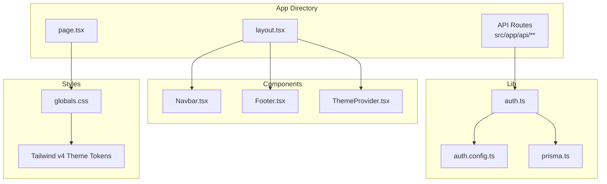
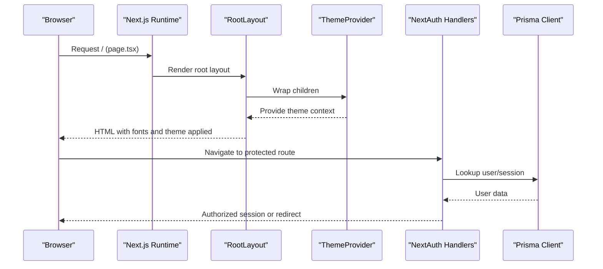
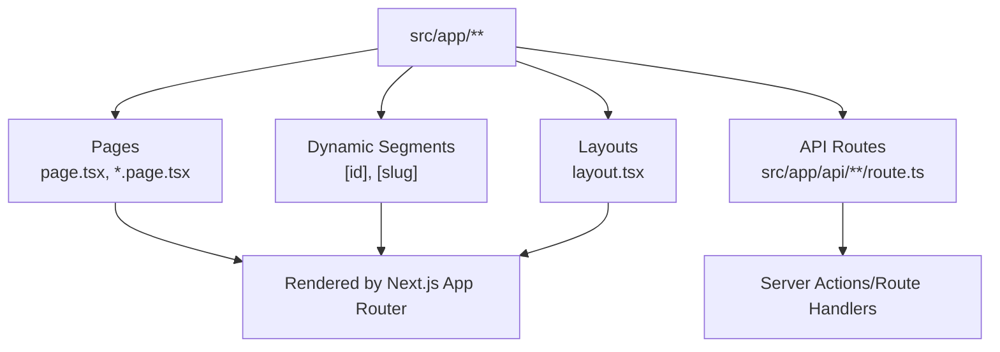
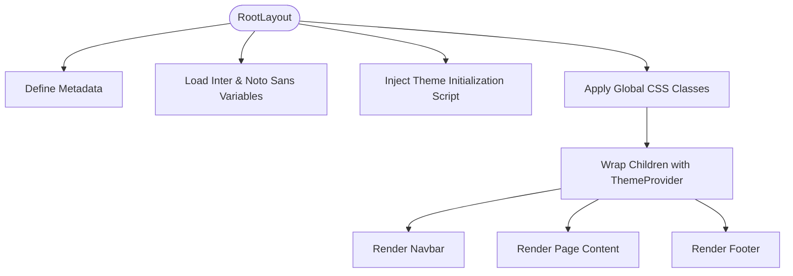
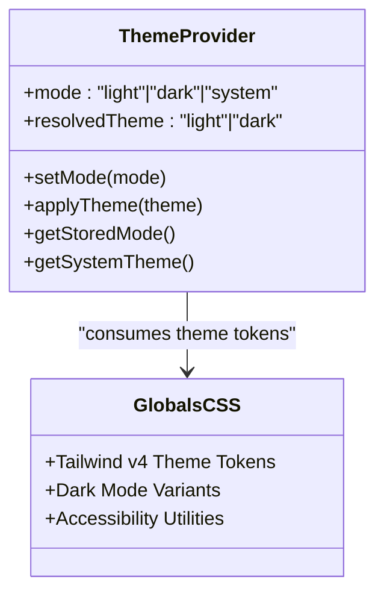
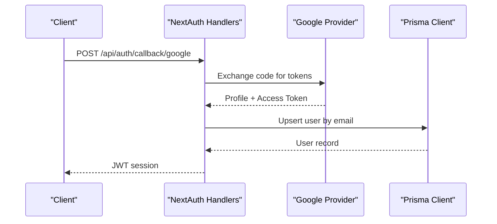
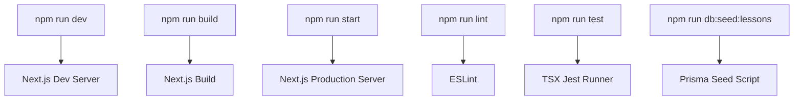
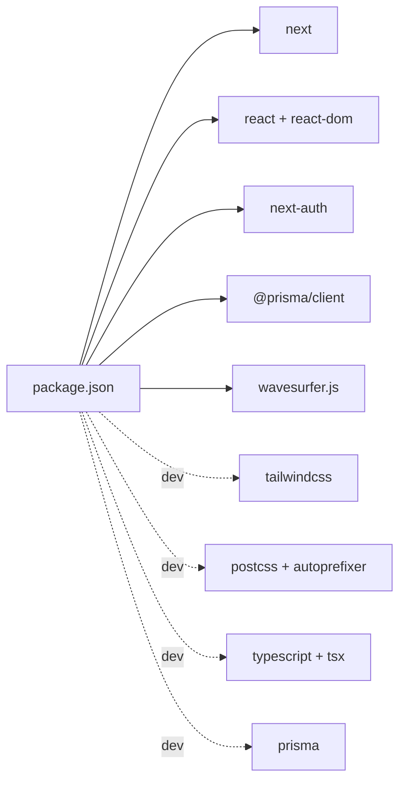

# Next.js Application Structure

<cite>
**Referenced Files in This Document**
- [package.json](file://english_pronunciation_app/frontend/package.json)
- [next.config.mjs](file://english_pronunciation_app/frontend/next.config.mjs)
- [tsconfig.json](file://english_pronunciation_app/frontend/tsconfig.json)
- [postcss.config.mjs](file://english_pronunciation_app/frontend/postcss.config.mjs)
- [src/app/layout.tsx](file://english_pronunciation_app/frontend/src/app/layout.tsx)
- [src/app/page.tsx](file://english_pronunciation_app/frontend/src/app/page.tsx)
- [src/app/globals.css](file://english_pronunciation_app/frontend/src/app/globals.css)
- [src/components/theme/ThemeProvider.tsx](file://english_pronunciation_app/frontend/src/components/theme/ThemeProvider.tsx)
- [src/lib/auth.config.ts](file://english_pronunciation_app/frontend/src/lib/auth.config.ts)
- [src/lib/auth.ts](file://english_pronunciation_app/frontend/src/lib/auth.ts)
- [src/lib/prisma.ts](file://english_pronunciation_app/frontend/src/lib/prisma.ts)
- [src/components/layout/Navbar.tsx](file://english_pronunciation_app/frontend/src/components/layout/Navbar.tsx)
- [src/components/layout/Footer.tsx](file://english_pronunciation_app/frontend/src/components/layout/Footer.tsx)
</cite>

## Table of Contents
1. [Introduction](#introduction)
2. [Project Structure](#project-structure)
3. [Core Components](#core-components)
4. [Architecture Overview](#architecture-overview)
5. [Detailed Component Analysis](#detailed-component-analysis)
6. [Dependency Analysis](#dependency-analysis)
7. [Performance Considerations](#performance-considerations)
8. [Troubleshooting Guide](#troubleshooting-guide)
9. [Conclusion](#conclusion)
10. [Appendices](#appendices)

## Introduction
This document explains the Next.js application structure for the English pronunciation learning platform. It covers the file-based routing system, app directory conventions, root layout configuration, metadata management, authentication and authorization setup, global styling with Tailwind CSS and custom theme tokens, font loading strategies, and the development workflow. Guidance on folder organization, naming conventions, and best practices for scalability is included.

## Project Structure
The frontend is organized under the Next.js App Router convention with a strict separation of server and client concerns:
- App directory: routing, layouts, pages, and API routes
- Components: reusable UI building blocks
- Lib: server-side utilities, authentication, and database client
- Public assets: static media referenced by the app

Key configuration files define the build pipeline, TypeScript compilation, PostCSS/Tailwind integration, and Next.js runtime behavior.

**Diagram sources**
- [src/app/layout.tsx](file://english_pronunciation_app/frontend/src/app/layout.tsx)
- [src/app/page.tsx](file://english_pronunciation_app/frontend/src/app/page.tsx)
- [src/app/globals.css](file://english_pronunciation_app/frontend/src/app/globals.css)
- [src/components/theme/ThemeProvider.tsx](file://english_pronunciation_app/frontend/src/components/theme/ThemeProvider.tsx)
- [src/components/layout/Navbar.tsx](file://english_pronunciation_app/frontend/src/components/layout/Navbar.tsx)
- [src/components/layout/Footer.tsx](file://english_pronunciation_app/frontend/src/components/layout/Footer.tsx)
- [src/lib/auth.config.ts](file://english_pronunciation_app/frontend/src/lib/auth.config.ts)
- [src/lib/auth.ts](file://english_pronunciation_app/frontend/src/lib/auth.ts)
- [src/lib/prisma.ts](file://english_pronunciation_app/frontend/src/lib/prisma.ts)

**Section sources**
- [package.json](file://english_pronunciation_app/frontend/package.json)
- [next.config.mjs](file://english_pronunciation_app/frontend/next.config.mjs)
- [tsconfig.json](file://english_pronunciation_app/frontend/tsconfig.json)
- [postcss.config.mjs](file://english_pronunciation_app/frontend/postcss.config.mjs)

## Core Components
- Root layout and metadata: defines fonts, theme initialization script, and shared layout structure
- Home page: marketing-focused landing page with gradient backgrounds and feature highlights
- Global styles: Tailwind v4 theme tokens, dark mode variants, and accessibility helpers
- Theme provider: centralized theme state with forced light mode and persistence
- Authentication: NextAuth.js integration with Google OAuth and credentials provider
- Database client: Prisma singleton for efficient database access

**Section sources**
- [src/app/layout.tsx](file://english_pronunciation_app/frontend/src/app/layout.tsx)
- [src/app/page.tsx](file://english_pronunciation_app/frontend/src/app/page.tsx)
- [src/app/globals.css](file://english_pronunciation_app/frontend/src/app/globals.css)
- [src/components/theme/ThemeProvider.tsx](file://english_pronunciation_app/frontend/src/components/theme/ThemeProvider.tsx)
- [src/lib/auth.config.ts](file://english_pronunciation_app/frontend/src/lib/auth.config.ts)
- [src/lib/auth.ts](file://english_pronunciation_app/frontend/src/lib/auth.ts)
- [src/lib/prisma.ts](file://english_pronunciation_app/frontend/src/lib/prisma.ts)

## Architecture Overview
The application follows Next.js App Router conventions with a root layout wrapping all pages. Authentication integrates via NextAuth.js with a JWT strategy and provider callbacks. Styling leverages Tailwind v4 with custom theme tokens and dark mode variants. The database client is initialized as a singleton to avoid multiple instances during development.

**Diagram sources**
- [src/app/layout.tsx](file://english_pronunciation_app/frontend/src/app/layout.tsx)
- [src/components/theme/ThemeProvider.tsx](file://english_pronunciation_app/frontend/src/components/theme/ThemeProvider.tsx)
- [src/lib/auth.ts](file://english_pronunciation_app/frontend/src/lib/auth.ts)
- [src/lib/prisma.ts](file://english_pronunciation_app/frontend/src/lib/prisma.ts)

## Detailed Component Analysis

### File-Based Routing and App Directory Conventions
- Pages: top-level pages such as the home page and feature pages live under the app directory
- Dynamic routes: dynamic segments are supported via square brackets in file names
- API routes: server endpoints are colocated under app/api with route handlers per endpoint
- Route groups: nested folders can group related routes without affecting URLs

**Section sources**
- [src/app/page.tsx](file://english_pronunciation_app/frontend/src/app/page.tsx)

### Root Layout Configuration and Metadata Management
- Metadata: site title and description configured at the root layout level
- Fonts: Inter and Noto Sans loaded via Next/font with subset-specific variables
- Theme initialization: a hydration-safe script forces light mode on initial render
- Global CSS: imported in the root layout to apply theme tokens and utilities

**Diagram sources**
- [src/app/layout.tsx](file://english_pronunciation_app/frontend/src/app/layout.tsx)
- [src/app/globals.css](file://english_pronunciation_app/frontend/src/app/globals.css)

**Section sources**
- [src/app/layout.tsx](file://english_pronunciation_app/frontend/src/app/layout.tsx)
- [src/app/globals.css](file://english_pronunciation_app/frontend/src/app/globals.css)

### Internationalization Setup
- Language attribute: html lang is set to Vietnamese for Vietnamese locale content
- Font subsets: fonts include Latin and Vietnamese subsets for optimal coverage
- Metadata: localized title and description for Vietnamese users

Best practices:
- Keep language attributes consistent across pages
- Load locale-appropriate fonts and adjust directionality if adding RTL languages
- Use Next.js i18n routing for multi-language deployments

**Section sources**
- [src/app/layout.tsx](file://english_pronunciation_app/frontend/src/app/layout.tsx)

### Global Styling with Tailwind CSS and Theme Provider
- Tailwind v4: theme tokens defined centrally for primary, accent, success, warning, error, and neutral palettes
- Dark mode: custom dark variant and extensive dark-mode overrides for backgrounds, borders, and text
- Accessibility: reduced-motion support and screen-reader utility class
- Theme provider: centralized theme state with forced light mode and persistence

**Diagram sources**
- [src/components/theme/ThemeProvider.tsx](file://english_pronunciation_app/frontend/src/components/theme/ThemeProvider.tsx)
- [src/app/globals.css](file://english_pronunciation_app/frontend/src/app/globals.css)

**Section sources**
- [src/app/globals.css](file://english_pronunciation_app/frontend/src/app/globals.css)
- [src/components/theme/ThemeProvider.tsx](file://english_pronunciation_app/frontend/src/components/theme/ThemeProvider.tsx)

### Authentication and Authorization
- Providers: Google OAuth and Credentials provider
- Session strategy: JWT
- Callbacks: token and session augmentation, OAuth user creation/upsert, sign-in checks
- Protected routes: server-side session retrieval in layout components

**Diagram sources**
- [src/lib/auth.ts](file://english_pronunciation_app/frontend/src/lib/auth.ts)
- [src/lib/auth.config.ts](file://english_pronunciation_app/frontend/src/lib/auth.config.ts)
- [src/lib/prisma.ts](file://english_pronunciation_app/frontend/src/lib/prisma.ts)

**Section sources**
- [src/lib/auth.config.ts](file://english_pronunciation_app/frontend/src/lib/auth.config.ts)
- [src/lib/auth.ts](file://english_pronunciation_app/frontend/src/lib/auth.ts)
- [src/lib/prisma.ts](file://english_pronunciation_app/frontend/src/lib/prisma.ts)
- [src/components/layout/Navbar.tsx](file://english_pronunciation_app/frontend/src/components/layout/Navbar.tsx)

### Build Configuration, TypeScript Setup, and Development Workflow
- Next.js: configured with default settings
- TypeScript: strict mode, ESNext target, bundler module resolution, path aliases
- Tailwind CSS: integrated via PostCSS with autoprefixer and Tailwind v4 plugin
- Scripts: dev, build, start, lint, test, and Prisma seed commands

**Section sources**
- [package.json](file://english_pronunciation_app/frontend/package.json)
- [next.config.mjs](file://english_pronunciation_app/frontend/next.config.mjs)
- [tsconfig.json](file://english_pronunciation_app/frontend/tsconfig.json)
- [postcss.config.mjs](file://english_pronunciation_app/frontend/postcss.config.mjs)

### Folder Organization, Naming Conventions, and Best Practices
Recommended structure and conventions:
- App directory
  - Group related pages under feature folders (e.g., learning_map, exercises)
  - Use page.tsx for route entry points
  - Use [dynamic].tsx for dynamic segments
  - Place API routes under app/api with route.ts per endpoint
- Components
  - Feature-based grouping (e.g., layout, theme, ui, gamification)
  - Use PascalCase for component filenames
  - Prefix client components with use client directive
- Lib
  - Separate server utilities, auth, and database clients
  - Export handler objects from auth modules for route integration
- Styles
  - Centralize theme tokens in globals.css
  - Use Tailwind utilities alongside custom CSS for advanced variants
- Types
  - Define custom module augmentations (e.g., next-auth.d.ts) in lib/types

## Dependency Analysis
The application’s runtime dependencies include Next.js, React, NextAuth.js, Prisma client, and Wavesurfer for audio visualization. Development dependencies include Tailwind CSS v4, PostCSS, TypeScript, and TSX for tests. Path aliases resolve @/ to src/.

**Diagram sources**
- [package.json](file://english_pronunciation_app/frontend/package.json)

**Section sources**
- [package.json](file://english_pronunciation_app/frontend/package.json)

## Performance Considerations
- Font loading: preload critical subsets and use font-display strategies to minimize FOIT
- Hydration: keep theme initialization minimal and avoid heavy client-side logic in root layout
- Bundle size: tree-shake unused utilities and lazy-load non-critical components
- API routes: cache responses where appropriate and optimize database queries
- Images and media: leverage Next/image and compressed audio assets

## Troubleshooting Guide
Common issues and resolutions:
- Hydration mismatch after theme changes: ensure theme initialization runs on the client and matches SSR
- Authentication redirects loop: verify provider configuration and callback URLs
- Database connection errors: confirm Prisma client initialization and environment variables
- Tailwind utilities not applying: check PostCSS configuration and ensure globals.css is imported in the root layout

**Section sources**
- [src/components/theme/ThemeProvider.tsx](file://english_pronunciation_app/frontend/src/components/theme/ThemeProvider.tsx)
- [src/lib/auth.ts](file://english_pronunciation_app/frontend/src/lib/auth.ts)
- [src/lib/prisma.ts](file://english_pronunciation_app/frontend/src/lib/prisma.ts)
- [src/app/globals.css](file://english_pronunciation_app/frontend/src/app/globals.css)

## Conclusion
The application follows Next.js best practices with a clear separation of concerns, robust authentication, and a cohesive design system powered by Tailwind CSS. By adhering to the recommended structure and conventions, teams can maintain scalability and consistency as features expand.

## Appendices
- API route examples: see the API routes under src/app/api for patterns of dynamic routes and handlers
- Navigation: protected navigation links are filtered server-side based on authentication state