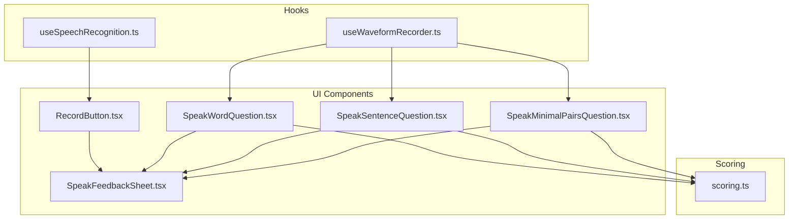
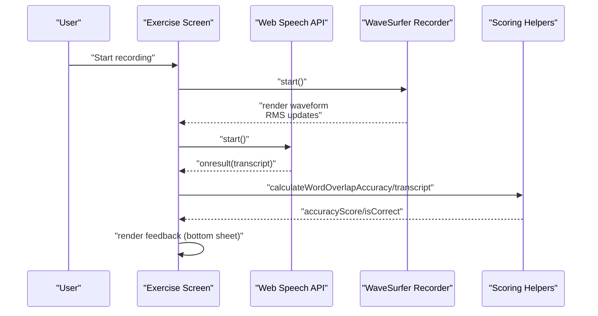
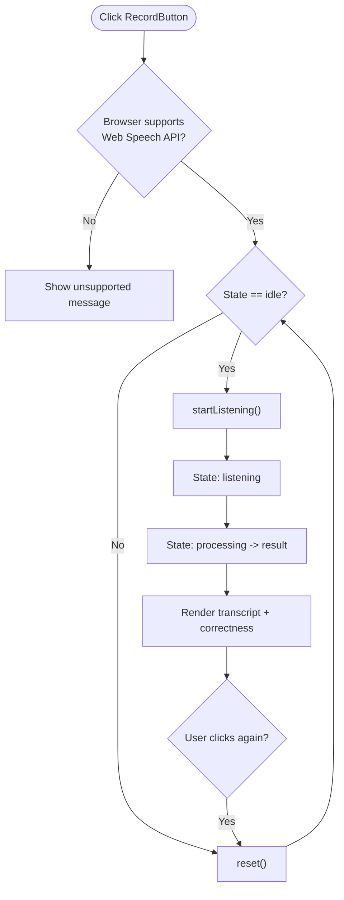
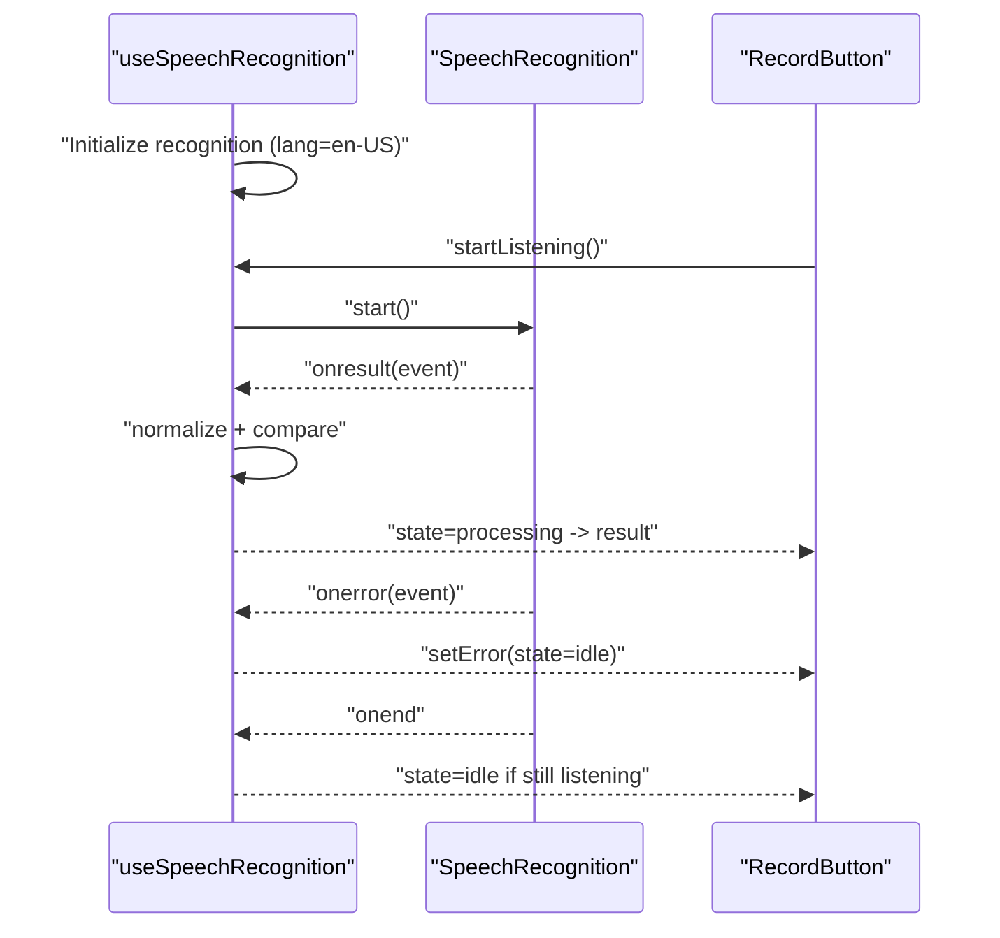
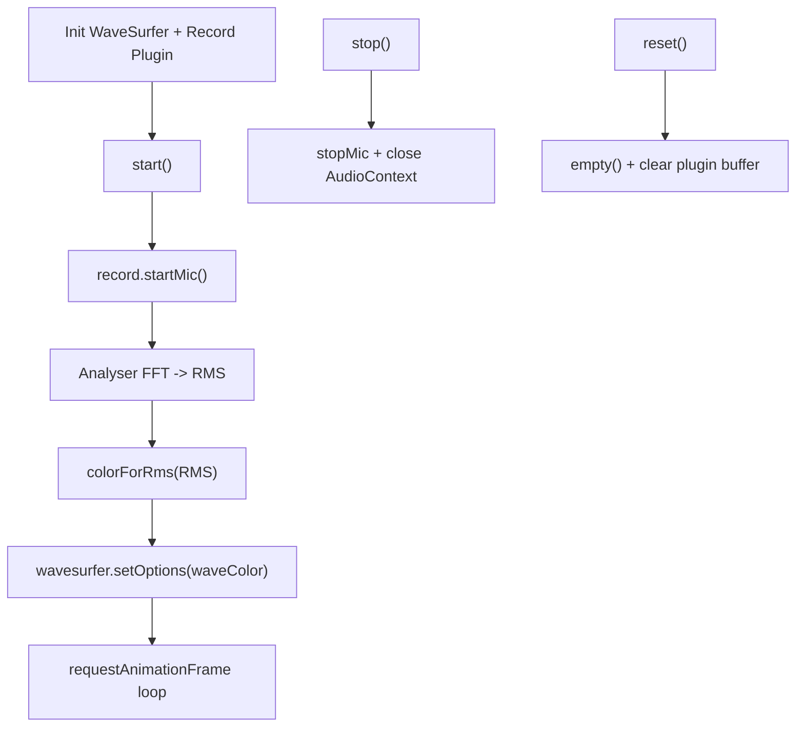
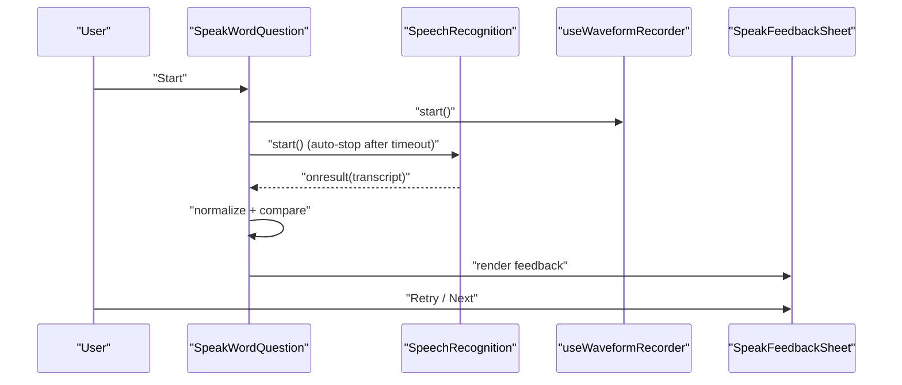
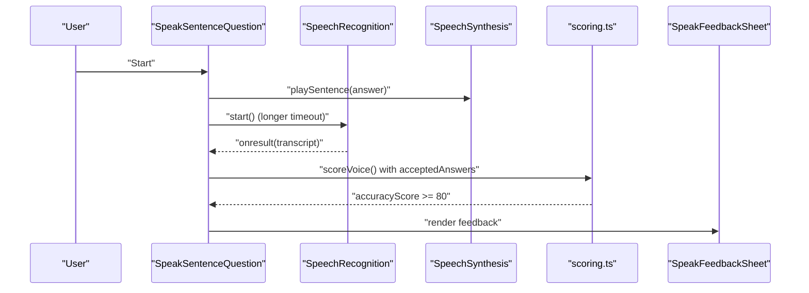
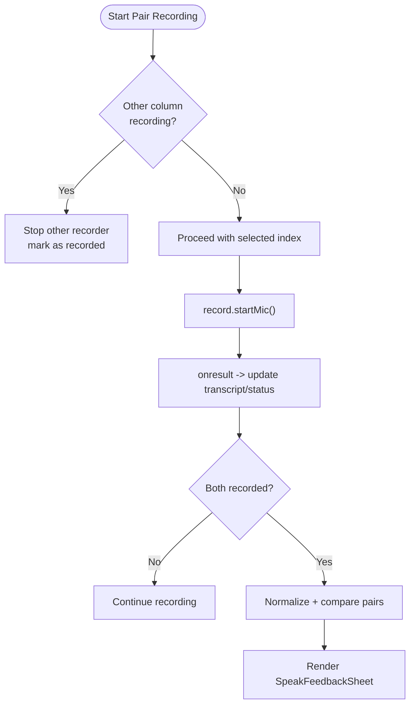
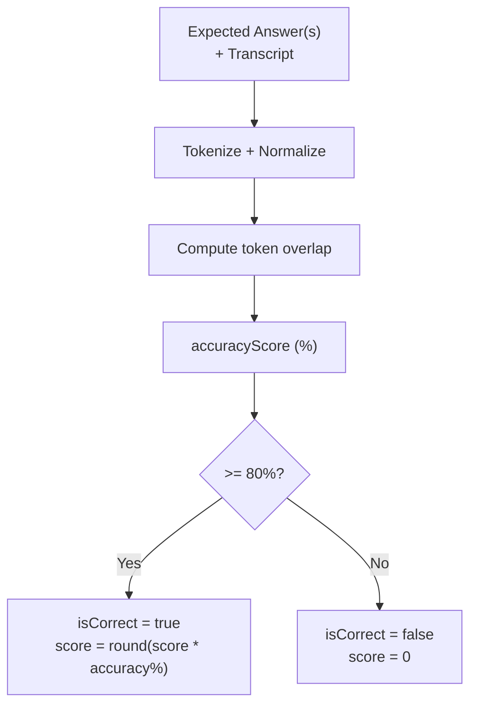
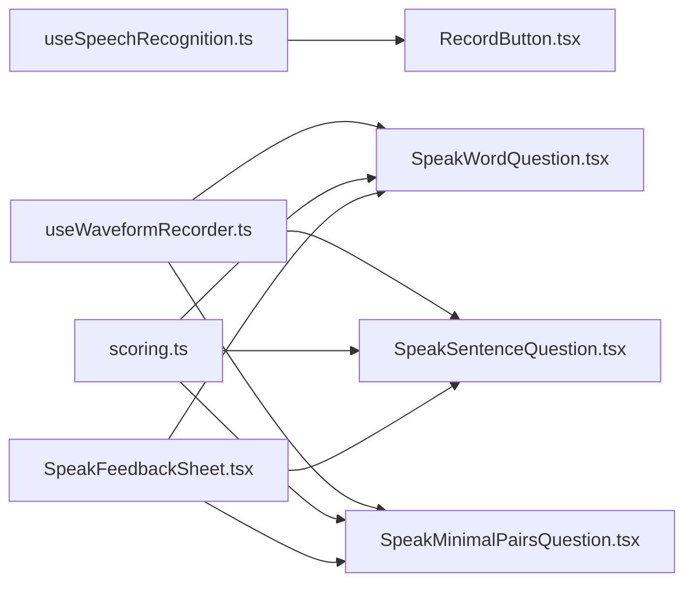

# Speech Recognition Integration

<cite>
**Referenced Files in This Document**
- [RecordButton.tsx](file://english_pronunciation_app/frontend/src/components/audio/RecordButton.tsx)
- [useSpeechRecognition.ts](file://english_pronunciation_app/frontend/src/hooks/useSpeechRecognition.ts)
- [useWaveformRecorder.ts](file://english_pronunciation_app/frontend/src/hooks/useWaveformRecorder.ts)
- [useWaveformRecorder.test.ts](file://english_pronunciation_app/frontend/src/hooks/__tests__/useWaveformRecorder.test.ts)
- [SpeakFeedbackSheet.tsx](file://english_pronunciation_app/frontend/src/app/exercises/[id]/SpeakFeedbackSheet.tsx)
- [SpeakWordQuestion.tsx](file://english_pronunciation_app/frontend/src/app/exercises/[id]/SpeakWordQuestion.tsx)
- [SpeakSentenceQuestion.tsx](file://english_pronunciation_app/frontend/src/app/exercises/[id]/SpeakSentenceQuestion.tsx)
- [SpeakMinimalPairsQuestion.tsx](file://english_pronunciation_app/frontend/src/app/exercises/[id]/SpeakMinimalPairsQuestion.tsx)
- [scoring.ts](file://english_pronunciation_app/frontend/src/lib/scoring.ts)
- [SCORING_AND_LEADERBOARD_PLAN.md](file://PLAN/04_Features/SCORING_AND_LEADERBOARD_PLAN.md)
</cite>

## Table of Contents
1. [Introduction](#introduction)
2. [Project Structure](#project-structure)
3. [Core Components](#core-components)
4. [Architecture Overview](#architecture-overview)
5. [Detailed Component Analysis](#detailed-component-analysis)
6. [Dependency Analysis](#dependency-analysis)
7. [Performance Considerations](#performance-considerations)
8. [Troubleshooting Guide](#troubleshooting-guide)
9. [Conclusion](#conclusion)
10. [Appendices](#appendices)

## Introduction
This document explains the speech recognition integration for the English pronunciation application. It covers the Web Speech API implementation, audio recording and real-time feedback, the RecordButton component, the useSpeechRecognition hook, and waveform visualization. It also documents speech-to-text processing, pronunciation assessment logic, audio quality optimization, browser compatibility, microphone permissions, error handling, and integration with exercise components and the assessment scoring system.

## Project Structure
The speech recognition feature spans three layers:
- Hooks: reusable logic for speech recognition and waveform recording
- UI Components: exercise-specific screens and feedback overlays
- Scoring Library: pronunciation assessment and scoring helpers

**Diagram sources**
- [useSpeechRecognition.ts:1-111](file://english_pronunciation_app/frontend/src/hooks/useSpeechRecognition.ts#L1-L111)
- [useWaveformRecorder.ts:1-140](file://english_pronunciation_app/frontend/src/hooks/useWaveformRecorder.ts#L1-L140)
- [RecordButton.tsx:1-130](file://english_pronunciation_app/frontend/src/components/audio/RecordButton.tsx#L1-L130)
- [SpeakWordQuestion.tsx:1-222](file://english_pronunciation_app/frontend/src/app/exercises/[id]/SpeakWordQuestion.tsx#L1-L222)
- [SpeakSentenceQuestion.tsx:1-225](file://english_pronunciation_app/frontend/src/app/exercises/[id]/SpeakSentenceQuestion.tsx#L1-L225)
- [SpeakMinimalPairsQuestion.tsx:1-258](file://english_pronunciation_app/frontend/src/app/exercises/[id]/SpeakMinimalPairsQuestion.tsx#L1-L258)
- [SpeakFeedbackSheet.tsx:1-96](file://english_pronunciation_app/frontend/src/app/exercises/[id]/SpeakFeedbackSheet.tsx#L1-L96)
- [scoring.ts:1-227](file://english_pronunciation_app/frontend/src/lib/scoring.ts#L1-L227)

**Section sources**
- [useSpeechRecognition.ts:1-111](file://english_pronunciation_app/frontend/src/hooks/useSpeechRecognition.ts#L1-L111)
- [useWaveformRecorder.ts:1-140](file://english_pronunciation_app/frontend/src/hooks/useWaveformRecorder.ts#L1-L140)
- [RecordButton.tsx:1-130](file://english_pronunciation_app/frontend/src/components/audio/RecordButton.tsx#L1-L130)
- [SpeakWordQuestion.tsx:1-222](file://english_pronunciation_app/frontend/src/app/exercises/[id]/SpeakWordQuestion.tsx#L1-L222)
- [SpeakSentenceQuestion.tsx:1-225](file://english_pronunciation_app/frontend/src/app/exercises/[id]/SpeakSentenceQuestion.tsx#L1-L225)
- [SpeakMinimalPairsQuestion.tsx:1-258](file://english_pronunciation_app/frontend/src/app/exercises/[id]/SpeakMinimalPairsQuestion.tsx#L1-L258)
- [SpeakFeedbackSheet.tsx:1-96](file://english_pronunciation_app/frontend/src/app/exercises/[id]/SpeakFeedbackSheet.tsx#L1-L96)
- [scoring.ts:1-227](file://english_pronunciation_app/frontend/src/lib/scoring.ts#L1-L227)

## Core Components
- RecordButton: a compact, accessible button that integrates the useSpeechRecognition hook to provide speech input with visual and auditory feedback.
- useSpeechRecognition: a hook that initializes the Web Speech API, manages lifecycle states, normalizes transcripts, and compares against expected answers.
- useWaveformRecorder: a hook that creates a scrolling waveform visualization using wavesurfer.js and a recording plugin, with real-time RMS-based dynamic feedback.
- Exercise Screens: SpeakWordQuestion, SpeakSentenceQuestion, and SpeakMinimalPairsQuestion orchestrate recording, error handling, and feedback presentation.
- SpeakFeedbackSheet: a persistent bottom sheet that displays correctness, transcript, and replay controls after assessment.
- Scoring Helpers: calculateWordOverlapAccuracy and scoreVoice implement flexible pronunciation scoring with multi-answer support.

**Section sources**
- [RecordButton.tsx:10-130](file://english_pronunciation_app/frontend/src/components/audio/RecordButton.tsx#L10-L130)
- [useSpeechRecognition.ts:15-111](file://english_pronunciation_app/frontend/src/hooks/useSpeechRecognition.ts#L15-L111)
- [useWaveformRecorder.ts:29-140](file://english_pronunciation_app/frontend/src/hooks/useWaveformRecorder.ts#L29-L140)
- [SpeakWordQuestion.tsx:57-222](file://english_pronunciation_app/frontend/src/app/exercises/[id]/SpeakWordQuestion.tsx#L57-L222)
- [SpeakSentenceQuestion.tsx:48-225](file://english_pronunciation_app/frontend/src/app/exercises/[id]/SpeakSentenceQuestion.tsx#L48-L225)
- [SpeakMinimalPairsQuestion.tsx:83-258](file://english_pronunciation_app/frontend/src/app/exercises/[id]/SpeakMinimalPairsQuestion.tsx#L83-L258)
- [SpeakFeedbackSheet.tsx:18-96](file://english_pronunciation_app/frontend/src/app/exercises/[id]/SpeakFeedbackSheet.tsx#L18-L96)
- [scoring.ts:52-131](file://english_pronunciation_app/frontend/src/lib/scoring.ts#L52-L131)

## Architecture Overview
The system combines two complementary technologies:
- Web Speech API for speech-to-text conversion
- wavesurfer.js with a recording plugin for real-time audio visualization and dynamic feedback

**Diagram sources**
- [SpeakWordQuestion.tsx:88-111](file://english_pronunciation_app/frontend/src/app/exercises/[id]/SpeakWordQuestion.tsx#L88-L111)
- [SpeakSentenceQuestion.tsx:84-104](file://english_pronunciation_app/frontend/src/app/exercises/[id]/SpeakSentenceQuestion.tsx#L84-L104)
- [SpeakMinimalPairsQuestion.tsx:106-148](file://english_pronunciation_app/frontend/src/app/exercises/[id]/SpeakMinimalPairsQuestion.tsx#L106-L148)
- [useWaveformRecorder.ts:99-123](file://english_pronunciation_app/frontend/src/hooks/useWaveformRecorder.ts#L99-L123)
- [scoring.ts:108-131](file://english_pronunciation_app/frontend/src/lib/scoring.ts#L108-L131)

## Detailed Component Analysis

### RecordButton Component
RecordButton encapsulates the simplified speech input experience:
- Integrates useSpeechRecognition to manage state transitions and results
- Provides visual feedback per state (idle, listening, processing, result)
- Announces status to assistive technologies via aria-live regions
- Displays correctness and transcript in a result card

**Diagram sources**
- [RecordButton.tsx:10-130](file://english_pronunciation_app/frontend/src/components/audio/RecordButton.tsx#L10-L130)
- [useSpeechRecognition.ts:50-98](file://english_pronunciation_app/frontend/src/hooks/useSpeechRecognition.ts#L50-L98)

**Section sources**
- [RecordButton.tsx:10-130](file://english_pronunciation_app/frontend/src/components/audio/RecordButton.tsx#L10-L130)
- [useSpeechRecognition.ts:15-111](file://english_pronunciation_app/frontend/src/hooks/useSpeechRecognition.ts#L15-L111)

### useSpeechRecognition Hook
The hook provides a controlled lifecycle for speech recognition:
- Browser detection and initialization of SpeechRecognition
- Configuration for single-result, non-continuous recognition
- Normalization of transcripts for comparison
- Comparison logic against expected answer with flexible matching
- Error handling for unsupported browsers and runtime errors

**Diagram sources**
- [useSpeechRecognition.ts:25-84](file://english_pronunciation_app/frontend/src/hooks/useSpeechRecognition.ts#L25-L84)
- [RecordButton.tsx:17-19](file://english_pronunciation_app/frontend/src/components/audio/RecordButton.tsx#L17-L19)

**Section sources**
- [useSpeechRecognition.ts:15-111](file://english_pronunciation_app/frontend/src/hooks/useSpeechRecognition.ts#L15-L111)

### useWaveformRecorder Hook
Real-time audio visualization and dynamic feedback:
- Initializes wavesurfer.js with a scrolling waveform
- Registers the recording plugin to capture microphone input
- Uses an AudioContext analyser to compute RMS amplitude
- Updates waveform color based on volume thresholds (silence, normal, loud)
- Provides start/stop/reset lifecycle and clears plugin buffers to prevent stale data

**Diagram sources**
- [useWaveformRecorder.ts:38-59](file://english_pronunciation_app/frontend/src/hooks/useWaveformRecorder.ts#L38-L59)
- [useWaveformRecorder.ts:61-87](file://english_pronunciation_app/frontend/src/hooks/useWaveformRecorder.ts#L61-L87)
- [useWaveformRecorder.ts:99-136](file://english_pronunciation_app/frontend/src/hooks/useWaveformRecorder.ts#L99-L136)

**Section sources**
- [useWaveformRecorder.ts:29-140](file://english_pronunciation_app/frontend/src/hooks/useWaveformRecorder.ts#L29-L140)
- [useWaveformRecorder.test.ts:1-16](file://english_pronunciation_app/frontend/src/hooks/__tests__/useWaveformRecorder.test.ts#L1-L16)

### Exercise Integration: SpeakWordQuestion
- Orchestrates recording with both SpeechRecognition and the waveform recorder
- Presents dynamic hints based on current RMS level
- Handles browser support and microphone permission errors
- Uses a bottom sheet for feedback and replay controls

**Diagram sources**
- [SpeakWordQuestion.tsx:88-111](file://english_pronunciation_app/frontend/src/app/exercises/[id]/SpeakWordQuestion.tsx#L88-L111)
- [SpeakWordQuestion.tsx:169-217](file://english_pronunciation_app/frontend/src/app/exercises/[id]/SpeakWordQuestion.tsx#L169-L217)
- [SpeakFeedbackSheet.tsx:18-96](file://english_pronunciation_app/frontend/src/app/exercises/[id]/SpeakFeedbackSheet.tsx#L18-L96)

**Section sources**
- [SpeakWordQuestion.tsx:57-222](file://english_pronunciation_app/frontend/src/app/exercises/[id]/SpeakWordQuestion.tsx#L57-L222)
- [SpeakFeedbackSheet.tsx:18-96](file://english_pronunciation_app/frontend/src/app/exercises/[id]/SpeakFeedbackSheet.tsx#L18-L96)

### Exercise Integration: SpeakSentenceQuestion
- Similar to SpeakWordQuestion but uses speech synthesis to play the target sentence
- Applies flexible scoring using calculateWordOverlapAccuracy with multi-answer support

**Diagram sources**
- [SpeakSentenceQuestion.tsx:29-38](file://english_pronunciation_app/frontend/src/app/exercises/[id]/SpeakSentenceQuestion.tsx#L29-L38)
- [SpeakSentenceQuestion.tsx:84-104](file://english_pronunciation_app/frontend/src/app/exercises/[id]/SpeakSentenceQuestion.tsx#L84-L104)
- [SpeakSentenceQuestion.tsx:202-221](file://english_pronunciation_app/frontend/src/app/exercises/[id]/SpeakSentenceQuestion.tsx#L202-L221)
- [scoring.ts:108-131](file://english_pronunciation_app/frontend/src/lib/scoring.ts#L108-L131)

**Section sources**
- [SpeakSentenceQuestion.tsx:48-225](file://english_pronunciation_app/frontend/src/app/exercises/[id]/SpeakSentenceQuestion.tsx#L48-L225)
- [scoring.ts:108-131](file://english_pronunciation_app/frontend/src/lib/scoring.ts#L108-L131)

### Exercise Integration: SpeakMinimalPairsQuestion
- Dual-recorder setup for minimal pairs with mutual exclusivity
- Prevents simultaneous microphone streams and ensures proper cleanup
- Compares normalized transcripts for each word and aggregates results

**Diagram sources**
- [SpeakMinimalPairsQuestion.tsx:106-148](file://english_pronunciation_app/frontend/src/app/exercises/[id]/SpeakMinimalPairsQuestion.tsx#L106-L148)
- [SpeakMinimalPairsQuestion.tsx:227-253](file://english_pronunciation_app/frontend/src/app/exercises/[id]/SpeakMinimalPairsQuestion.tsx#L227-L253)

**Section sources**
- [SpeakMinimalPairsQuestion.tsx:83-258](file://english_pronunciation_app/frontend/src/app/exercises/[id]/SpeakMinimalPairsQuestion.tsx#L83-L258)

### Pronunciation Assessment Logic
- calculateWordOverlapAccuracy computes token-level overlap between expected and actual transcripts
- scoreVoice applies multi-answer support and sets a threshold (≥80%) for correctness
- Feedback messages guide learners toward improvement

**Diagram sources**
- [scoring.ts:52-72](file://english_pronunciation_app/frontend/src/lib/scoring.ts#L52-L72)
- [scoring.ts:108-131](file://english_pronunciation_app/frontend/src/lib/scoring.ts#L108-L131)

**Section sources**
- [scoring.ts:40-131](file://english_pronunciation_app/frontend/src/lib/scoring.ts#L40-L131)

## Dependency Analysis
- RecordButton depends on useSpeechRecognition for state and results
- Exercise screens depend on useWaveformRecorder for visualization and dynamic feedback
- All speak exercises depend on scoring helpers for assessment
- SpeakFeedbackSheet is shared across exercises for consistent feedback presentation

**Diagram sources**
- [useSpeechRecognition.ts:15-111](file://english_pronunciation_app/frontend/src/hooks/useSpeechRecognition.ts#L15-L111)
- [RecordButton.tsx:10-19](file://english_pronunciation_app/frontend/src/components/audio/RecordButton.tsx#L10-L19)
- [useWaveformRecorder.ts:29-140](file://english_pronunciation_app/frontend/src/hooks/useWaveformRecorder.ts#L29-L140)
- [SpeakWordQuestion.tsx:57-222](file://english_pronunciation_app/frontend/src/app/exercises/[id]/SpeakWordQuestion.tsx#L57-L222)
- [SpeakSentenceQuestion.tsx:48-225](file://english_pronunciation_app/frontend/src/app/exercises/[id]/SpeakSentenceQuestion.tsx#L48-L225)
- [SpeakMinimalPairsQuestion.tsx:83-258](file://english_pronunciation_app/frontend/src/app/exercises/[id]/SpeakMinimalPairsQuestion.tsx#L83-L258)
- [SpeakFeedbackSheet.tsx:18-96](file://english_pronunciation_app/frontend/src/app/exercises/[id]/SpeakFeedbackSheet.tsx#L18-L96)
- [scoring.ts:108-131](file://english_pronunciation_app/frontend/src/lib/scoring.ts#L108-L131)

**Section sources**
- [RecordButton.tsx:10-130](file://english_pronunciation_app/frontend/src/components/audio/RecordButton.tsx#L10-L130)
- [SpeakWordQuestion.tsx:57-222](file://english_pronunciation_app/frontend/src/app/exercises/[id]/SpeakWordQuestion.tsx#L57-L222)
- [SpeakSentenceQuestion.tsx:48-225](file://english_pronunciation_app/frontend/src/app/exercises/[id]/SpeakSentenceQuestion.tsx#L48-L225)
- [SpeakMinimalPairsQuestion.tsx:83-258](file://english_pronunciation_app/frontend/src/app/exercises/[id]/SpeakMinimalPairsQuestion.tsx#L83-L258)
- [SpeakFeedbackSheet.tsx:18-96](file://english_pronunciation_app/frontend/src/app/exercises/[id]/SpeakFeedbackSheet.tsx#L18-L96)
- [scoring.ts:108-131](file://english_pronunciation_app/frontend/src/lib/scoring.ts#L108-L131)

## Performance Considerations
- Real-time RMS computation runs on requestAnimationFrame; keep analyser buffer sizes reasonable to avoid CPU spikes.
- Clear plugin buffers on reset to prevent stale waveform artifacts during retries.
- Limit SpeechRecognition timeouts to user-friendly durations (shorter for words, longer for sentences).
- Defer heavy DOM updates until after normalization and scoring to minimize layout thrash.

## Troubleshooting Guide
Common issues and resolutions:
- Browser not supported: detect via SpeechRecognition constructor; prompt to use Chrome or Edge.
- Microphone blocked: differentiate "not-allowed"/"service-not-allowed" errors; instruct users to grant permissions in site settings.
- No speech detected: advise speaking clearly and loudly in English; verify hardware and permissions.
- Stale waveform after retry: ensure plugin dataWindow is cleared alongside wavesurfer.empty().
- Multi-column minimal pairs: stop the other recorder when starting a new recording to avoid conflicts.

**Section sources**
- [useSpeechRecognition.ts:25-41](file://english_pronunciation_app/frontend/src/hooks/useSpeechRecognition.ts#L25-L41)
- [SpeakWordQuestion.tsx:94-102](file://english_pronunciation_app/frontend/src/app/exercises/[id]/SpeakWordQuestion.tsx#L94-L102)
- [SpeakSentenceQuestion.tsx:180-200](file://english_pronunciation_app/frontend/src/app/exercises/[id]/SpeakSentenceQuestion.tsx#L180-L200)
- [SpeakMinimalPairsQuestion.tsx:110-115](file://english_pronunciation_app/frontend/src/app/exercises/[id]/SpeakMinimalPairsQuestion.tsx#L110-L115)
- [useWaveformRecorder.ts:93-97](file://english_pronunciation_app/frontend/src/hooks/useWaveformRecorder.ts#L93-L97)

## Conclusion
The speech recognition integration combines Web Speech API for accurate speech-to-text with wavesurfer.js for engaging, real-time audio feedback. The modular hooks and shared feedback components enable consistent assessment across word, sentence, and minimal pairs exercises. Flexible scoring logic and clear error handling improve usability and learner outcomes.

## Appendices

### Browser Compatibility and Permissions
- Web Speech API is primarily supported in Chromium-based browsers (Chrome, Edge). Detect availability and inform users accordingly.
- Microphone permissions must be granted; handle "not-allowed" and "service-not-allowed" errors with actionable guidance.

**Section sources**
- [useSpeechRecognition.ts:25-41](file://english_pronunciation_app/frontend/src/hooks/useSpeechRecognition.ts#L25-L41)
- [SpeakWordQuestion.tsx:186-200](file://english_pronunciation_app/frontend/src/app/exercises/[id]/SpeakWordQuestion.tsx#L186-L200)
- [SpeakSentenceQuestion.tsx:180-200](file://english_pronunciation_app/frontend/src/app/exercises/[id]/SpeakSentenceQuestion.tsx#L180-L200)
- [SpeakMinimalPairsQuestion.tsx:124-133](file://english_pronunciation_app/frontend/src/app/exercises/[id]/SpeakMinimalPairsQuestion.tsx#L124-L133)

### Scoring Reference
- Base scores and thresholds are defined in the project’s scoring plan, with speak_sentence using a percentage-based formula.

**Section sources**
- [SCORING_AND_LEADERBOARD_PLAN.md:26-57](file://PLAN/04_Features/SCORING_AND_LEADERBOARD_PLAN.md#L26-L57)
- [scoring.ts:108-131](file://english_pronunciation_app/frontend/src/lib/scoring.ts#L108-L131)