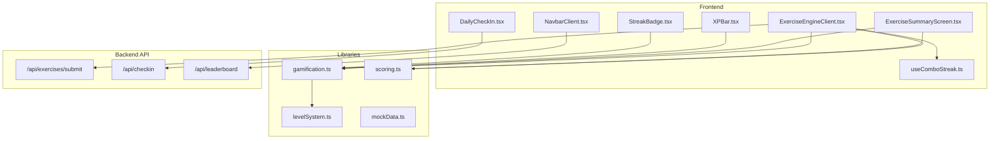
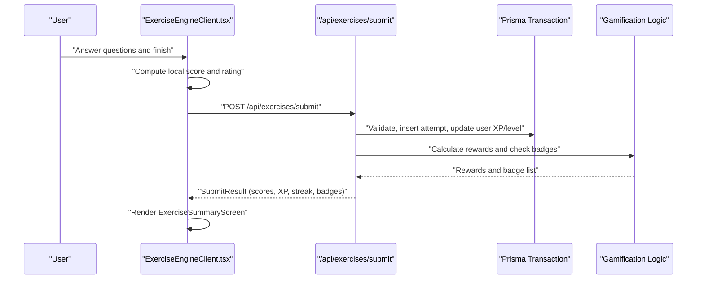
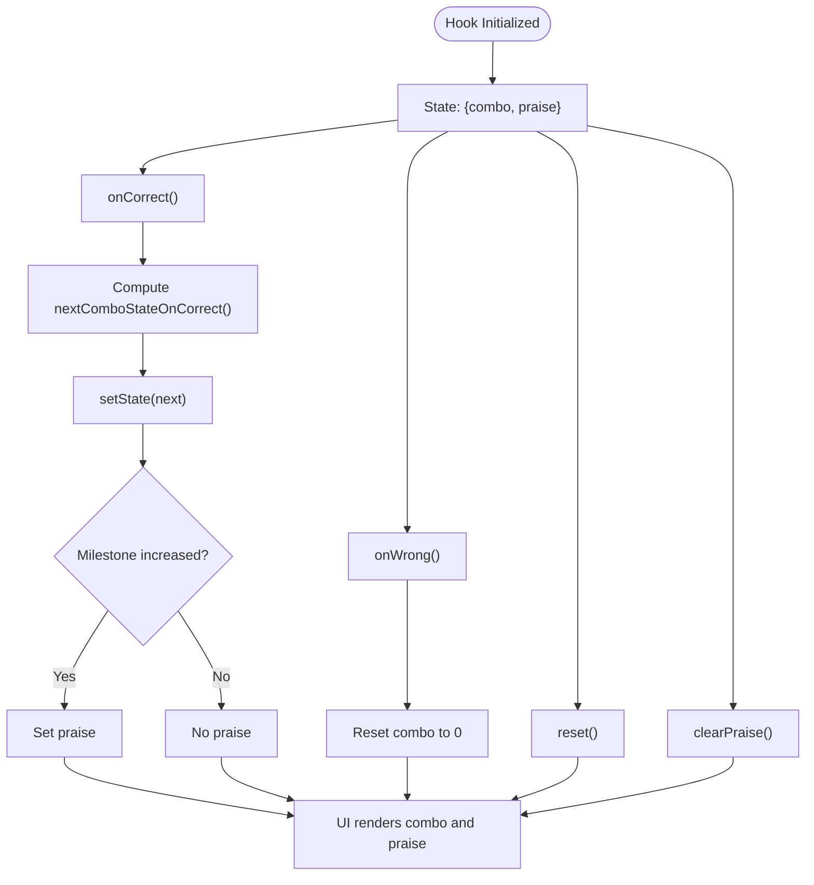
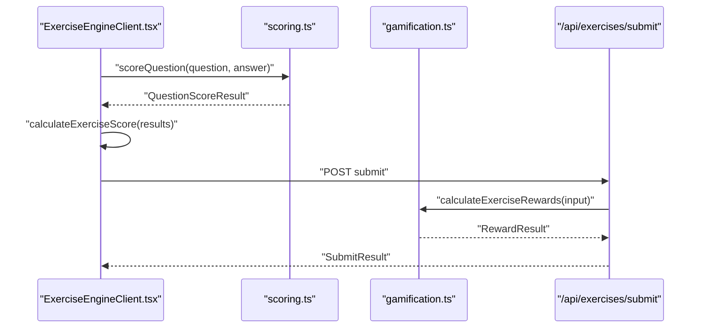
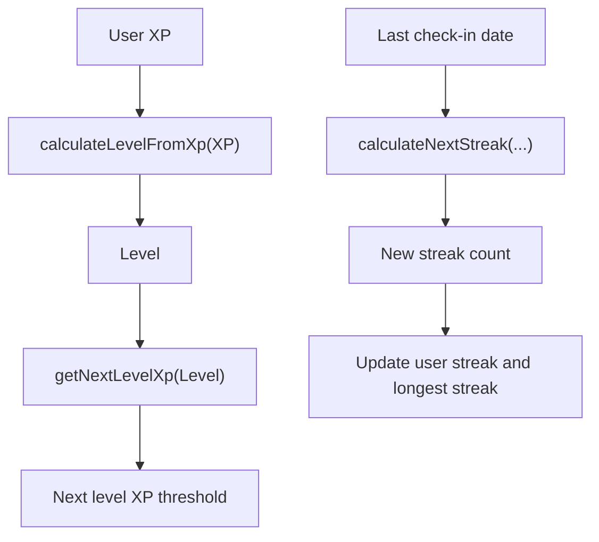
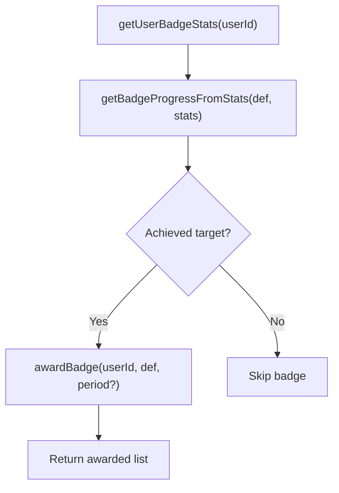
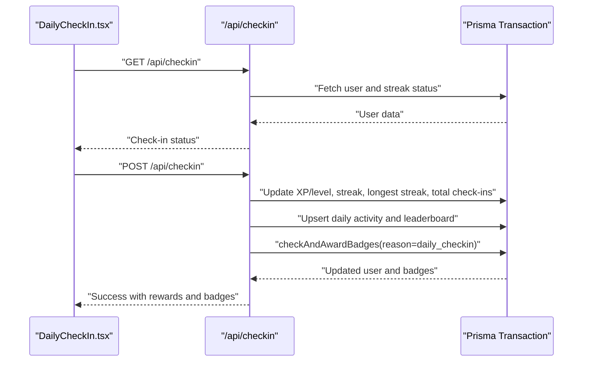
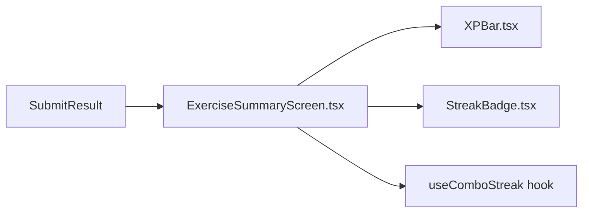
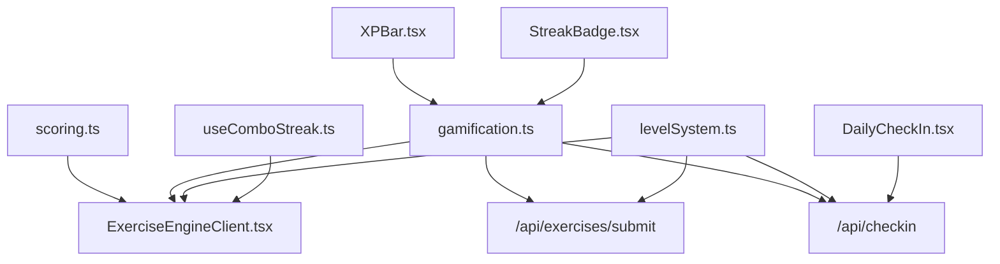

# State Management Patterns

<cite>
**Referenced Files in This Document**
- [gamification.ts](file://english_pronunciation_app/frontend/src/lib/gamification.ts)
- [levelSystem.ts](file://english_pronunciation_app/frontend/src/lib/levelSystem.ts)
- [scoring.ts](file://english_pronunciation_app/frontend/src/lib/scoring.ts)
- [useComboStreak.ts](file://english_pronunciation_app/frontend/src/hooks/useComboStreak.ts)
- [DailyCheckIn.tsx](file://english_pronunciation_app/frontend/src/components/gamification/DailyCheckIn.tsx)
- [XPBar.tsx](file://english_pronunciation_app/frontend/src/components/gamification/XPBar.tsx)
- [StreakBadge.tsx](file://english_pronunciation_app/frontend/src/components/gamification/StreakBadge.tsx)
- [ExerciseEngineClient.tsx](file://english_pronunciation_app/frontend/src/app/exercises/[id]/ExerciseEngineClient.tsx)
- [ExerciseSummaryScreen.tsx](file://english_pronunciation_app/frontend/src/app/exercises/[id]/ExerciseSummaryScreen.tsx)
- [route.ts (checkin)](file://english_pronunciation_app/frontend/src/app/api/checkin/route.ts)
- [route.ts (exercises submit)](file://english_pronunciation_app/frontend/src/app/api/exercises/submit/route.ts)
- [page.tsx (dashboard)](file://english_pronunciation_app/frontend/src/app/dashboard/page.tsx)
- [page.tsx (leaderboard)](file://english_pronunciation_app/frontend/src/app/leaderboard/page.tsx)
- [NavbarClient.tsx](file://english_pronunciation_app/frontend/src/components/layout/NavbarClient.tsx)
- [mockData.ts](file://english_pronunciation_app/frontend/src/lib/mockData.ts)
</cite>

## Table of Contents
1. [Introduction](#introduction)
2. [Project Structure](#project-structure)
3. [Core Components](#core-components)
4. [Architecture Overview](#architecture-overview)
5. [Detailed Component Analysis](#detailed-component-analysis)
6. [Dependency Analysis](#dependency-analysis)
7. [Performance Considerations](#performance-considerations)
8. [Troubleshooting Guide](#troubleshooting-guide)
9. [Conclusion](#conclusion)

## Introduction
This document explains the state management patterns used across the application’s gamification and exercise systems. It covers custom React hooks, XP calculation, streak management, level progression, scoring algorithms, combo systems, achievement tracking, state persistence via backend APIs, real-time updates, and performance optimization strategies. The goal is to help developers understand how frontend state integrates with backend services and how to maintain consistency and responsiveness during interactive exercises and gamified experiences.

## Project Structure
The state management spans three layers:
- Frontend React components and hooks manage UI state, user interactions, and optimistic updates.
- Backend API routes orchestrate database transactions, calculate rewards, and synchronize leaderboard and badge states.
- Shared libraries encapsulate domain logic for scoring, XP, streaks, and badges.

**Diagram sources**
- [ExerciseEngineClient.tsx:323-645](file://english_pronunciation_app/frontend/src/app/exercises/[id]/ExerciseEngineClient.tsx#L323-L645)
- [ExerciseSummaryScreen.tsx:88-255](file://english_pronunciation_app/frontend/src/app/exercises/[id]/ExerciseSummaryScreen.tsx#L88-L255)
- [DailyCheckIn.tsx:48-234](file://english_pronunciation_app/frontend/src/components/gamification/DailyCheckIn.tsx#L48-L234)
- [XPBar.tsx:15-50](file://english_pronunciation_app/frontend/src/components/gamification/XPBar.tsx#L15-L50)
- [StreakBadge.tsx:12-63](file://english_pronunciation_app/frontend/src/components/gamification/StreakBadge.tsx#L12-L63)
- [useComboStreak.ts:38-75](file://english_pronunciation_app/frontend/src/hooks/useComboStreak.ts#L38-L75)
- [gamification.ts:178-575](file://english_pronunciation_app/frontend/src/lib/gamification.ts#L178-L575)
- [levelSystem.ts:20-133](file://english_pronunciation_app/frontend/src/lib/levelSystem.ts#L20-L133)
- [scoring.ts:191-227](file://english_pronunciation_app/frontend/src/lib/scoring.ts#L191-L227)
- [route.ts (exercises submit):47-332](file://english_pronunciation_app/frontend/src/app/api/exercises/submit/route.ts#L47-L332)
- [route.ts (checkin):33-216](file://english_pronunciation_app/frontend/src/app/api/checkin/route.ts#L33-L216)
- [page.tsx (leaderboard):60-224](file://english_pronunciation_app/frontend/src/app/leaderboard/page.tsx#L60-L224)

**Section sources**
- [ExerciseEngineClient.tsx:323-645](file://english_pronunciation_app/frontend/src/app/exercises/[id]/ExerciseEngineClient.tsx#L323-L645)
- [route.ts (exercises submit):47-332](file://english_pronunciation_app/frontend/src/app/api/exercises/submit/route.ts#L47-L332)
- [route.ts (checkin):33-216](file://english_pronunciation_app/frontend/src/app/api/checkin/route.ts#L33-L216)

## Core Components
- Scoring and exercise completion:
  - Question scoring logic, normalization, and rating determination are centralized in the scoring library.
  - Exercise-level score aggregation and pass/fail thresholds are computed client-side and validated server-side.
- XP and level progression:
  - XP calculations and level derivation are implemented in shared libraries and used by both frontend UI and backend transaction logic.
- Streak and daily check-in:
  - Streak computation considers freeze usage and local day boundaries; frontend components surface status and rewards.
- Combo system:
  - A custom hook manages combo state, milestones, and praise messages for positive reinforcement.
- Achievement tracking:
  - Badge definitions and awarding logic are encapsulated in the gamification library and executed on submission and daily check-in.

**Section sources**
- [scoring.ts:191-227](file://english_pronunciation_app/frontend/src/lib/scoring.ts#L191-L227)
- [gamification.ts:178-575](file://english_pronunciation_app/frontend/src/lib/gamification.ts#L178-L575)
- [useComboStreak.ts:38-75](file://english_pronunciation_app/frontend/src/hooks/useComboStreak.ts#L38-L75)
- [levelSystem.ts:20-133](file://english_pronunciation_app/frontend/src/lib/levelSystem.ts#L20-L133)

## Architecture Overview
The system follows a predictable flow for exercises and daily check-ins:
- Frontend collects answers and computes local scores.
- On completion, the frontend posts to the backend API.
- The backend validates, scores, calculates rewards, updates user state, leaderboard entries, and badges atomically within a transaction.
- The frontend receives the result and updates UI state accordingly.

**Diagram sources**
- [ExerciseEngineClient.tsx:367-403](file://english_pronunciation_app/frontend/src/app/exercises/[id]/ExerciseEngineClient.tsx#L367-L403)
- [route.ts (exercises submit):182-274](file://english_pronunciation_app/frontend/src/app/api/exercises/submit/route.ts#L182-L274)
- [gamification.ts:195-234](file://english_pronunciation_app/frontend/src/lib/gamification.ts#L195-L234)

## Detailed Component Analysis

### Custom Hooks Implementation
- useComboStreak:
  - Manages combo streak state, milestone levels, and praise messages.
  - Provides pure helper functions for state transitions to support testability without React.
  - Integrates with SFX and UI feedback to reinforce correct answers.

**Diagram sources**
- [useComboStreak.ts:24-75](file://english_pronunciation_app/frontend/src/hooks/useComboStreak.ts#L24-L75)

**Section sources**
- [useComboStreak.ts:38-75](file://english_pronunciation_app/frontend/src/hooks/useComboStreak.ts#L38-L75)

### Exercise Progress Tracking and Scoring
- Local scoring pipeline:
  - Normalize answers, tokenize for comparison, and compute accuracy scores for voice tasks.
  - Aggregate per-question results into an exercise score and rating.
- Submission flow:
  - Validates payload, ensures questions belong to the exercise, and prevents duplicates.
  - Computes rewards using backend logic and persists attempt data atomically.

**Diagram sources**
- [ExerciseEngineClient.tsx:191-201](file://english_pronunciation_app/frontend/src/app/exercises/[id]/ExerciseEngineClient.tsx#L191-L201)
- [scoring.ts:191-227](file://english_pronunciation_app/frontend/src/lib/scoring.ts#L191-L227)
- [route.ts (exercises submit):120-177](file://english_pronunciation_app/frontend/src/app/api/exercises/submit/route.ts#L120-L177)
- [gamification.ts:195-234](file://english_pronunciation_app/frontend/src/lib/gamification.ts#L195-L234)

**Section sources**
- [scoring.ts:191-227](file://english_pronunciation_app/frontend/src/lib/scoring.ts#L191-L227)
- [route.ts (exercises submit):120-177](file://english_pronunciation_app/frontend/src/app/api/exercises/submit/route.ts#L120-L177)

### XP Calculation, Streak Management, and Level Progression
- XP and level:
  - Level derived from XP using a square-root formula; next level threshold computed accordingly.
  - Frontend dashboard and summary screens consume these helpers to render progress bars and level info.
- Streak:
  - Next streak computed considering last check-in, today, and freeze usage; prevents double-check-in and supports freeze mechanics.
- Daily bonus:
  - Exercise rewards incorporate base XP, retake XP, and daily bonus thresholds based on completed exercises.

**Diagram sources**
- [gamification.ts:178-184](file://english_pronunciation_app/frontend/src/lib/gamification.ts#L178-L184)
- [gamification.ts:553-575](file://english_pronunciation_app/frontend/src/lib/gamification.ts#L553-L575)
- [page.tsx (dashboard):95-102](file://english_pronunciation_app/frontend/src/app/dashboard/page.tsx#L95-L102)

**Section sources**
- [gamification.ts:178-184](file://english_pronunciation_app/frontend/src/lib/gamification.ts#L178-L184)
- [gamification.ts:553-575](file://english_pronunciation_app/frontend/src/lib/gamification.ts#L553-L575)
- [page.tsx (dashboard):95-102](file://english_pronunciation_app/frontend/src/app/dashboard/page.tsx#L95-L102)

### Achievement Tracking and Badge System
- Badge definitions enumerate criteria by category and target.
- Badge progress computed from user statistics (completed exercises, listening/speaking counts, streaks, best improvement, weekly rank).
- Awarding occurs on exercise submission and daily check-in, with periodic badges bound to weekly periods.

**Diagram sources**
- [gamification.ts:380-488](file://english_pronunciation_app/frontend/src/lib/gamification.ts#L380-L488)
- [gamification.ts:490-531](file://english_pronunciation_app/frontend/src/lib/gamification.ts#L490-L531)

**Section sources**
- [gamification.ts:380-488](file://english_pronunciation_app/frontend/src/lib/gamification.ts#L380-L488)
- [gamification.ts:490-531](file://english_pronunciation_app/frontend/src/lib/gamification.ts#L490-L531)

### Daily Check-In State Management
- Frontend loads current streak, longest streak, total check-ins, and eligibility to check-in.
- On submit, it updates state optimistically and handles errors gracefully.
- Backend enforces uniqueness per day, increments XP/level, updates streaks, and upserts leaderboard entries.

**Diagram sources**
- [DailyCheckIn.tsx:69-104](file://english_pronunciation_app/frontend/src/components/gamification/DailyCheckIn.tsx#L69-L104)
- [DailyCheckIn.tsx:106-161](file://english_pronunciation_app/frontend/src/components/gamification/DailyCheckIn.tsx#L106-L161)
- [route.ts (checkin):33-77](file://english_pronunciation_app/frontend/src/app/api/checkin/route.ts#L33-L77)
- [route.ts (checkin):79-215](file://english_pronunciation_app/frontend/src/app/api/checkin/route.ts#L79-L215)

**Section sources**
- [DailyCheckIn.tsx:69-104](file://english_pronunciation_app/frontend/src/components/gamification/DailyCheckIn.tsx#L69-L104)
- [DailyCheckIn.tsx:106-161](file://english_pronunciation_app/frontend/src/components/gamification/DailyCheckIn.tsx#L106-L161)
- [route.ts (checkin):33-77](file://english_pronunciation_app/frontend/src/app/api/checkin/route.ts#L33-L77)
- [route.ts (checkin):79-215](file://english_pronunciation_app/frontend/src/app/api/checkin/route.ts#L79-L215)

### Real-Time Updates and UI Feedback
- Optimistic updates:
  - Exercise summary screen displays XP gains, streak, and badges immediately upon successful submission.
  - Daily check-in updates UI state after a successful POST.
- Visual feedback:
  - XP bar and streak badge components reflect current state.
  - Combo milestones trigger praise popups and SFX.

**Diagram sources**
- [ExerciseSummaryScreen.tsx:145-205](file://english_pronunciation_app/frontend/src/app/exercises/[id]/ExerciseSummaryScreen.tsx#L145-L205)
- [XPBar.tsx:15-50](file://english_pronunciation_app/frontend/src/components/gamification/XPBar.tsx#L15-L50)
- [StreakBadge.tsx:12-63](file://english_pronunciation_app/frontend/src/components/gamification/StreakBadge.tsx#L12-L63)
- [useComboStreak.ts:38-75](file://english_pronunciation_app/frontend/src/hooks/useComboStreak.ts#L38-L75)

**Section sources**
- [ExerciseSummaryScreen.tsx:145-205](file://english_pronunciation_app/frontend/src/app/exercises/[id]/ExerciseSummaryScreen.tsx#L145-L205)
- [XPBar.tsx:15-50](file://english_pronunciation_app/frontend/src/components/gamification/XPBar.tsx#L15-L50)
- [StreakBadge.tsx:12-63](file://english_pronunciation_app/frontend/src/components/gamification/StreakBadge.tsx#L12-L63)

## Dependency Analysis
Key dependencies and coupling:
- Frontend exercise engine depends on scoring and gamification libraries for correctness and reward computation.
- Backend routes depend on shared gamification utilities to ensure consistent reward logic and badge checks.
- UI components depend on shared libraries for rendering XP and level progress.

**Diagram sources**
- [scoring.ts:191-227](file://english_pronunciation_app/frontend/src/lib/scoring.ts#L191-L227)
- [gamification.ts:178-575](file://english_pronunciation_app/frontend/src/lib/gamification.ts#L178-L575)
- [levelSystem.ts:20-133](file://english_pronunciation_app/frontend/src/lib/levelSystem.ts#L20-L133)
- [useComboStreak.ts:38-75](file://english_pronunciation_app/frontend/src/hooks/useComboStreak.ts#L38-L75)
- [route.ts (exercises submit):182-274](file://english_pronunciation_app/frontend/src/app/api/exercises/submit/route.ts#L182-L274)
- [route.ts (checkin):118-190](file://english_pronunciation_app/frontend/src/app/api/checkin/route.ts#L118-L190)
- [XPBar.tsx:15-50](file://english_pronunciation_app/frontend/src/components/gamification/XPBar.tsx#L15-L50)
- [StreakBadge.tsx:12-63](file://english_pronunciation_app/frontend/src/components/gamification/StreakBadge.tsx#L12-L63)

**Section sources**
- [scoring.ts:191-227](file://english_pronunciation_app/frontend/src/lib/scoring.ts#L191-L227)
- [gamification.ts:178-575](file://english_pronunciation_app/frontend/src/lib/gamification.ts#L178-L575)
- [levelSystem.ts:20-133](file://english_pronunciation_app/frontend/src/lib/levelSystem.ts#L20-L133)
- [useComboStreak.ts:38-75](file://english_pronunciation_app/frontend/src/hooks/useComboStreak.ts#L38-L75)
- [route.ts (exercises submit):182-274](file://english_pronunciation_app/frontend/src/app/api/exercises/submit/route.ts#L182-L274)
- [route.ts (checkin):118-190](file://english_pronunciation_app/frontend/src/app/api/checkin/route.ts#L118-L190)

## Performance Considerations
- Minimize re-renders:
  - Use memoization for derived values (e.g., progress percentage, combo milestone) to avoid unnecessary recalculations.
  - Keep answer recording in refs to prevent prop drilling and frequent state updates.
- Optimize scoring:
  - Tokenization and overlap accuracy are linear in token count; keep input normalization efficient.
- Database transactions:
  - Group writes (user, daily activity, leaderboard, badges) in a single transaction to reduce round-trips and ensure atomicity.
- UI responsiveness:
  - Render optimistic updates while awaiting backend responses; apply rollback logic on errors.
- Leaderboard queries:
  - Paginate and limit leaderboard results; cache recent periods to reduce repeated computations.

[No sources needed since this section provides general guidance]

## Troubleshooting Guide
Common issues and resolutions:
- Unauthenticated requests:
  - Ensure authentication middleware is applied; return explicit error codes for unauthenticated access.
- Validation failures:
  - Validate exercise ID, answers, and question ownership before scoring; return structured error payloads.
- Duplicate submissions:
  - Enforce unique question IDs per attempt; reject duplicate answers.
- Daily check-in conflicts:
  - Prevent double-check-in on the same day; handle freeze usage to maintain streak continuity.
- UI state desynchronization:
  - Re-fetch status after long-running operations; reconcile optimistic updates with server responses.

**Section sources**
- [route.ts (exercises submit):53-67](file://english_pronunciation_app/frontend/src/app/api/exercises/submit/route.ts#L53-L67)
- [route.ts (exercises submit):115-118](file://english_pronunciation_app/frontend/src/app/api/exercises/submit/route.ts#L115-L118)
- [route.ts (checkin):111-116](file://english_pronunciation_app/frontend/src/app/api/checkin/route.ts#L111-L116)

## Conclusion
The application employs a clean separation of concerns: frontend components manage UI state and user interactions, backend routes enforce business logic and data consistency, and shared libraries encapsulate reusable gamification and scoring algorithms. Custom hooks like useComboStreak enhance engagement, while optimistic updates and transactional backend operations ensure a responsive and reliable experience. By following the patterns documented here, teams can extend the system with confidence, maintaining performance and consistency across gamified features.