# UI Components Library

<cite>
**Referenced Files in This Document**
- [Button.tsx](file://english_pronunciation_app/frontend/src/components/ui/Button.tsx)
- [Card.tsx](file://english_pronunciation_app/frontend/src/components/ui/Card.tsx)
- [Input.tsx](file://english_pronunciation_app/frontend/src/components/ui/Input.tsx)
- [Modal.tsx](file://english_pronunciation_app/frontend/src/components/ui/Modal.tsx)
- [ProgressBar.tsx](file://english_pronunciation_app/frontend/src/components/ui/ProgressBar.tsx)
- [Navbar.tsx](file://english_pronunciation_app/frontend/src/components/layout/Navbar.tsx)
- [Footer.tsx](file://english_pronunciation_app/frontend/src/components/layout/Footer.tsx)
- [ThemeToggle.tsx](file://english_pronunciation_app/frontend/src/components/theme/ThemeToggle.tsx)
- [ThemeProvider.tsx](file://english_pronunciation_app/frontend/src/components/theme/ThemeProvider.tsx)
- [globals.css](file://english_pronunciation_app/frontend/src/app/globals.css)
- [UI_COMPONENTS_GUIDE.md](file://PLAN/03_UI_UX/UI_COMPONENTS_GUIDE.md)
- [COLOR_SYSTEM_GUIDE.md](file://PLAN/03_UI_UX/COLOR_SYSTEM_GUIDE.md)
- [HCI_ACCESSIBILITY_AUDIT.md](file://PLAN/03_UI_UX/HCI_ACCESSIBILITY_AUDIT.md)
- [layout.tsx](file://english_pronunciation_app/frontend/src/app/layout.tsx)
- [page.tsx](file://english_pronunciation_app/frontend/src/app/page.tsx)
</cite>

## Table of Contents
1. [Introduction](#introduction)
2. [Project Structure](#project-structure)
3. [Core Components](#core-components)
4. [Architecture Overview](#architecture-overview)
5. [Detailed Component Analysis](#detailed-component-analysis)
6. [Dependency Analysis](#dependency-analysis)
7. [Performance Considerations](#performance-considerations)
8. [Troubleshooting Guide](#troubleshooting-guide)
9. [Conclusion](#conclusion)
10. [Appendices](#appendices)

## Introduction
This document describes the UI components library used across the English pronunciation application. It covers reusable components (Button, Card, Input, Modal, ProgressBar) and layout components (Navbar, Footer, ThemeToggle). The guide explains component props, styling patterns, customization options, accessibility features, responsive design considerations, composition patterns, integration guidelines, and testing strategies. It also documents theme support and styling consistency across the application.

## Project Structure
The UI components are organized under the frontend application’s shared components directory. Layout and theme components are grouped separately for clarity and reuse.

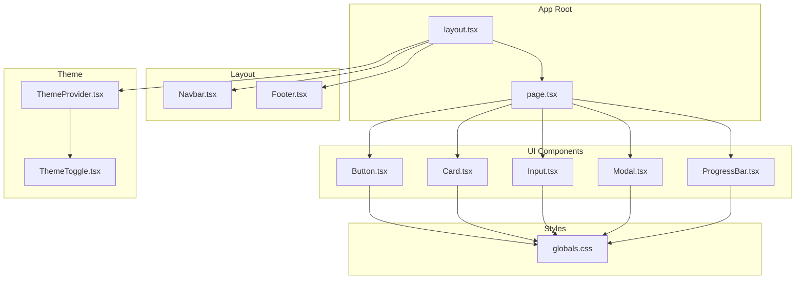

**Diagram sources**
- [layout.tsx](file://english_pronunciation_app/frontend/src/app/layout.tsx)
- [page.tsx](file://english_pronunciation_app/frontend/src/app/page.tsx)
- [Button.tsx](file://english_pronunciation_app/frontend/src/components/ui/Button.tsx)
- [Card.tsx](file://english_pronunciation_app/frontend/src/components/ui/Card.tsx)
- [Input.tsx](file://english_pronunciation_app/frontend/src/components/ui/Input.tsx)
- [Modal.tsx](file://english_pronunciation_app/frontend/src/components/ui/Modal.tsx)
- [ProgressBar.tsx](file://english_pronunciation_app/frontend/src/components/ui/ProgressBar.tsx)
- [Navbar.tsx](file://english_pronunciation_app/frontend/src/components/layout/Navbar.tsx)
- [Footer.tsx](file://english_pronunciation_app/frontend/src/components/layout/Footer.tsx)
- [ThemeToggle.tsx](file://english_pronunciation_app/frontend/src/components/theme/ThemeToggle.tsx)
- [ThemeProvider.tsx](file://english_pronunciation_app/frontend/src/components/theme/ThemeProvider.tsx)
- [globals.css](file://english_pronunciation_app/frontend/src/app/globals.css)

**Section sources**
- [layout.tsx](file://english_pronunciation_app/frontend/src/app/layout.tsx)
- [page.tsx](file://english_pronunciation_app/frontend/src/app/page.tsx)

## Core Components
This section summarizes the primary UI components and their roles.

- Button: Action trigger with variants, sizes, and states.
- Card: Content container with optional elevation and padding.
- Input: Text field with validation, icons, and feedback.
- Modal: Overlay dialog with backdrop, close controls, and focus management.
- ProgressBar: Indeterminate or determinate progress indicator.

Each component exposes a consistent prop interface and follows established styling and accessibility patterns.

**Section sources**
- [Button.tsx](file://english_pronunciation_app/frontend/src/components/ui/Button.tsx)
- [Card.tsx](file://english_pronunciation_app/frontend/src/components/ui/Card.tsx)
- [Input.tsx](file://english_pronunciation_app/frontend/src/components/ui/Input.tsx)
- [Modal.tsx](file://english_pronunciation_app/frontend/src/components/ui/Modal.tsx)
- [ProgressBar.tsx](file://english_pronunciation_app/frontend/src/components/ui/ProgressBar.tsx)

## Architecture Overview
The UI components integrate with Next.js app routing and theme provider. The layout composes Navbar, page content, and Footer. ThemeToggle toggles dark/light mode via ThemeProvider, which applies global CSS variables and class-based themes.

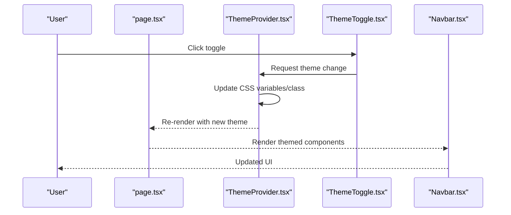

**Diagram sources**
- [page.tsx](file://english_pronunciation_app/frontend/src/app/page.tsx)
- [ThemeProvider.tsx](file://english_pronunciation_app/frontend/src/components/theme/ThemeProvider.tsx)
- [ThemeToggle.tsx](file://english_pronunciation_app/frontend/src/components/theme/ThemeToggle.tsx)
- [Navbar.tsx](file://english_pronunciation_app/frontend/src/components/layout/Navbar.tsx)

## Detailed Component Analysis

### Button
- Purpose: Trigger actions with consistent styling and behavior.
- Props:
  - variant: primary, secondary, outline, ghost, link
  - size: sm, md, lg
  - disabled: boolean
  - loading: boolean
  - iconLeft/iconRight: ReactNode
  - onClick: () => void
  - className: string
- Styling patterns:
  - Uses CSS custom properties for colors and spacing.
  - Responsive padding and typography scales by size.
- Accessibility:
  - Inherits native button semantics; disabled state prevents interaction.
  - Loading state communicates pending action.
- Composition:
  - Can wrap icons and render as anchor when href is provided.

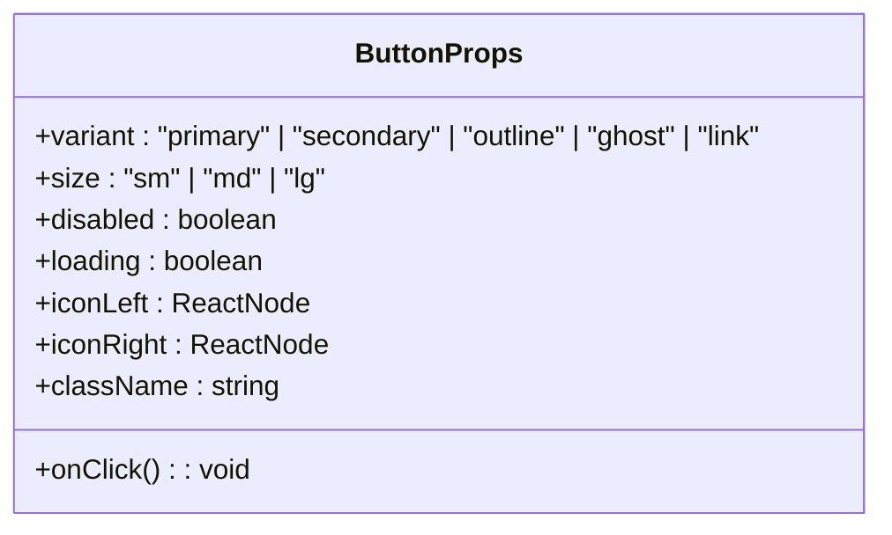

**Diagram sources**
- [Button.tsx](file://english_pronunciation_app/frontend/src/components/ui/Button.tsx)

**Section sources**
- [Button.tsx](file://english_pronunciation_app/frontend/src/components/ui/Button.tsx)
- [globals.css](file://english_pronunciation_app/frontend/src/app/globals.css)

### Card
- Purpose: Encapsulate content with consistent spacing and optional elevation.
- Props:
  - children: ReactNode
  - className: string
  - shadow: boolean
  - padding: "none" | "sm" | "md" | "lg"
- Styling patterns:
  - Background and border tokens from color system.
  - Optional box-shadow for depth.
- Accessibility:
  - Semantic grouping via div; ensure nested interactive elements are keyboard accessible.
- Composition:
  - Used inside modals, forms, and content sections.

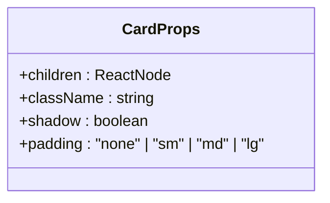

**Diagram sources**
- [Card.tsx](file://english_pronunciation_app/frontend/src/components/ui/Card.tsx)

**Section sources**
- [Card.tsx](file://english_pronunciation_app/frontend/src/components/ui/Card.tsx)
- [globals.css](file://english_pronunciation_app/frontend/src/app/globals.css)

### Input
- Purpose: Text input with validation and optional adornments.
- Props:
  - value: string
  - onChange: (value: string) => void
  - placeholder: string
  - type: "text" | "email" | "password" | "number"
  - error: string
  - iconLeft: ReactNode
  - iconRight: ReactNode
  - disabled: boolean
  - className: string
- Styling patterns:
  - Focus ring and border states.
  - Error state color and messaging.
- Accessibility:
  - aria-invalid and aria-describedby for assistive tech.
  - Proper labeling via associated label element.
- Composition:
  - Often composed with Button for submit actions.

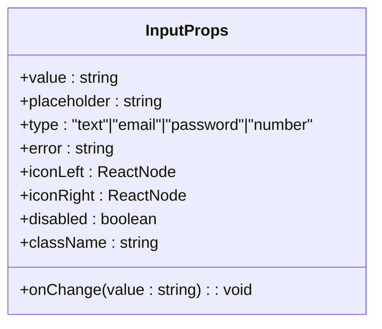

**Diagram sources**
- [Input.tsx](file://english_pronunciation_app/frontend/src/components/ui/Input.tsx)

**Section sources**
- [Input.tsx](file://english_pronunciation_app/frontend/src/components/ui/Input.tsx)
- [globals.css](file://english_pronunciation_app/frontend/src/app/globals.css)

### Modal
- Purpose: Display contextual content or dialogs with overlay.
- Props:
  - isOpen: boolean
  - onClose: () => void
  - title: string
  - children: ReactNode
  - actions: ReactNode[]
  - className: string
- Styling patterns:
  - Centered card with backdrop; scroll containment.
- Accessibility:
  - Focus trap on open; Escape to close; role="dialog"; labelledby/ describedby.
- Composition:
  - Composed with Card and Button for actions.

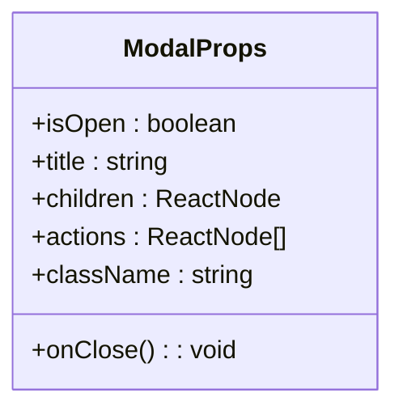

**Diagram sources**
- [Modal.tsx](file://english_pronunciation_app/frontend/src/components/ui/Modal.tsx)

**Section sources**
- [Modal.tsx](file://english_pronunciation_app/frontend/src/components/ui/Modal.tsx)
- [globals.css](file://english_pronunciation_app/frontend/src/app/globals.css)

### ProgressBar
- Purpose: Visualize progress or loading states.
- Props:
  - value: number (0–100)
  - indeterminate: boolean
  - className: string
- Styling patterns:
  - Animated fill for indeterminate; discrete fill for determinate.
- Accessibility:
  - aria-valuemin/aria-valuemax/aria-valuenow for screen readers.
- Composition:
  - Used within forms and modals during async operations.

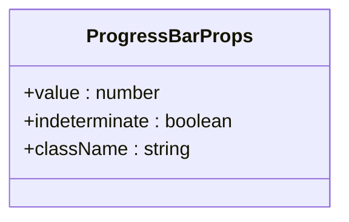

**Diagram sources**
- [ProgressBar.tsx](file://english_pronunciation_app/frontend/src/components/ui/ProgressBar.tsx)

**Section sources**
- [ProgressBar.tsx](file://english_pronunciation_app/frontend/src/components/ui/ProgressBar.tsx)
- [globals.css](file://english_pronunciation_app/frontend/src/app/globals.css)

### Navbar
- Purpose: Primary navigation header with branding and user actions.
- Props: None (composes internal links and ThemeToggle).
- Styling patterns:
  - Fixed height, horizontal alignment, and responsive breakpoint behavior.
- Accessibility:
  - Skip links, semantic landmarks, and keyboard navigation.
- Composition:
  - Integrated into app layout and rendered at top of pages.

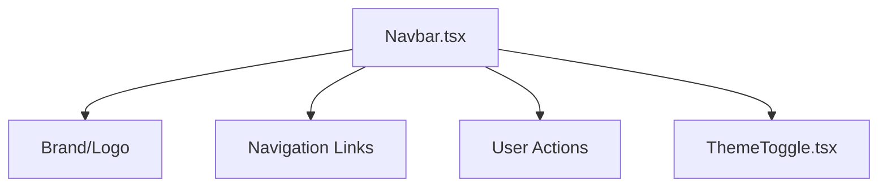

**Diagram sources**
- [Navbar.tsx](file://english_pronunciation_app/frontend/src/components/layout/Navbar.tsx)
- [ThemeToggle.tsx](file://english_pronunciation_app/frontend/src/components/theme/ThemeToggle.tsx)

**Section sources**
- [Navbar.tsx](file://english_pronunciation_app/frontend/src/components/layout/Navbar.tsx)
- [globals.css](file://english_pronunciation_app/frontend/src/app/globals.css)

### Footer
- Purpose: Secondary informational area and links.
- Props: None (renders legal, social, and support links).
- Styling patterns:
  - Grid or flex layout; responsive stacking on small screens.
- Accessibility:
  - Landmark region; skip to main content.
- Composition:
  - Included in layout below page content.

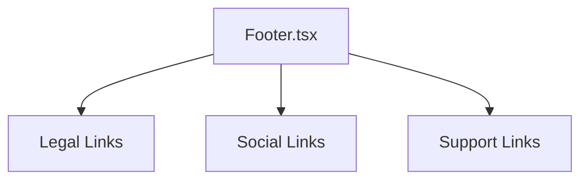

**Diagram sources**
- [Footer.tsx](file://english_pronunciation_app/frontend/src/components/layout/Footer.tsx)

**Section sources**
- [Footer.tsx](file://english_pronunciation_app/frontend/src/components/layout/Footer.tsx)
- [globals.css](file://english_pronunciation_app/frontend/src/app/globals.css)

### ThemeToggle
- Purpose: Switch between light and dark themes.
- Props: None (reads current theme from ThemeProvider).
- Styling patterns:
  - Icon-based toggle; smooth transitions.
- Accessibility:
  - ARIA label; visible focus; keyboard activation.
- Integration:
  - Consumed by Navbar and other layout areas.

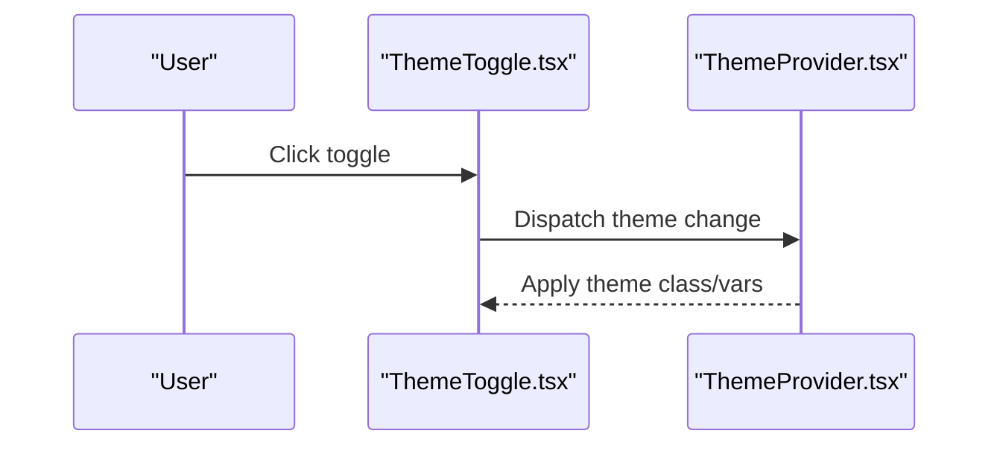

**Diagram sources**
- [ThemeToggle.tsx](file://english_pronunciation_app/frontend/src/components/theme/ThemeToggle.tsx)
- [ThemeProvider.tsx](file://english_pronunciation_app/frontend/src/components/theme/ThemeProvider.tsx)

**Section sources**
- [ThemeToggle.tsx](file://english_pronunciation_app/frontend/src/components/theme/ThemeToggle.tsx)
- [ThemeProvider.tsx](file://english_pronunciation_app/frontend/src/components/theme/ThemeProvider.tsx)
- [globals.css](file://english_pronunciation_app/frontend/src/app/globals.css)

## Dependency Analysis
The UI components depend on shared styles and theme provider. They are consumed by page components and layout wrappers.

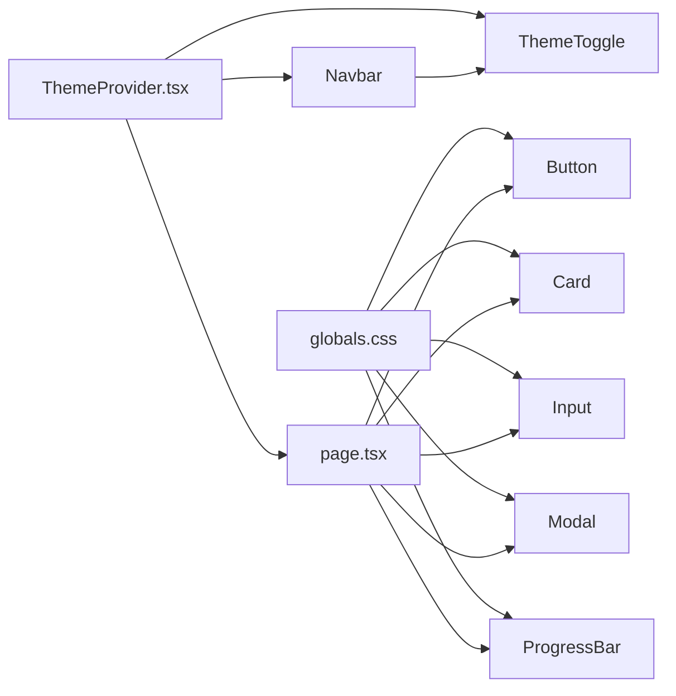

**Diagram sources**
- [globals.css](file://english_pronunciation_app/frontend/src/app/globals.css)
- [ThemeProvider.tsx](file://english_pronunciation_app/frontend/src/components/theme/ThemeProvider.tsx)
- [ThemeToggle.tsx](file://english_pronunciation_app/frontend/src/components/theme/ThemeToggle.tsx)
- [Navbar.tsx](file://english_pronunciation_app/frontend/src/components/layout/Navbar.tsx)
- [page.tsx](file://english_pronunciation_app/frontend/src/app/page.tsx)
- [Button.tsx](file://english_pronunciation_app/frontend/src/components/ui/Button.tsx)
- [Card.tsx](file://english_pronunciation_app/frontend/src/components/ui/Card.tsx)
- [Input.tsx](file://english_pronunciation_app/frontend/src/components/ui/Input.tsx)
- [Modal.tsx](file://english_pronunciation_app/frontend/src/components/ui/Modal.tsx)
- [ProgressBar.tsx](file://english_pronunciation_app/frontend/src/components/ui/ProgressBar.tsx)

**Section sources**
- [globals.css](file://english_pronunciation_app/frontend/src/app/globals.css)
- [layout.tsx](file://english_pronunciation_app/frontend/src/app/layout.tsx)
- [page.tsx](file://english_pronunciation_app/frontend/src/app/page.tsx)

## Performance Considerations
- Prefer lightweight components and avoid unnecessary re-renders by memoizing props.
- Use CSS custom properties for theme switching to minimize layout thrashing.
- Lazy-load heavy assets within modals or cards.
- Keep DOM depth shallow for frequently updated components like ProgressBar.

## Troubleshooting Guide
- Button not responding:
  - Verify disabled and loading states are not preventing interaction.
  - Ensure onClick is provided and not blocked by parent event handlers.
- Input validation errors:
  - Confirm error prop is a non-empty string to show visual feedback.
  - Pair with proper aria-invalid and aria-describedby attributes.
- Modal not closing:
  - Check isOpen prop and onClose handler are both controlled.
  - Ensure Escape key and backdrop click are handled.
- ThemeToggle not applying:
  - Confirm ThemeProvider wraps the app and updates CSS variables/class.
  - Verify focus management and keyboard activation.

**Section sources**
- [Button.tsx](file://english_pronunciation_app/frontend/src/components/ui/Button.tsx)
- [Input.tsx](file://english_pronunciation_app/frontend/src/components/ui/Input.tsx)
- [Modal.tsx](file://english_pronunciation_app/frontend/src/components/ui/Modal.tsx)
- [ThemeToggle.tsx](file://english_pronunciation_app/frontend/src/components/theme/ThemeToggle.tsx)
- [ThemeProvider.tsx](file://english_pronunciation_app/frontend/src/components/theme/ThemeProvider.tsx)

## Conclusion
The UI components library provides a cohesive, accessible, and theme-aware set of primitives for building consistent experiences. By adhering to the documented props, styling patterns, and accessibility guidelines, developers can compose reliable interfaces that scale across the application.

## Appendices

### Styling Consistency and Theme Support
- Color system and tokens are defined centrally and applied via CSS custom properties.
- ThemeProvider manages class-based theme switching and updates global variables.
- Components consume tokens rather than hardcoded values to maintain consistency.

**Section sources**
- [COLOR_SYSTEM_GUIDE.md](file://PLAN/03_UI_UX/COLOR_SYSTEM_GUIDE.md)
- [ThemeProvider.tsx](file://english_pronunciation_app/frontend/src/components/theme/ThemeProvider.tsx)
- [globals.css](file://english_pronunciation_app/frontend/src/app/globals.css)

### Accessibility Guidelines
- Use semantic HTML and ARIA attributes where appropriate.
- Ensure keyboard navigation and focus management.
- Provide labels and descriptions for interactive elements.

**Section sources**
- [HCI_ACCESSIBILITY_AUDIT.md](file://PLAN/03_UI_UX/HCI_ACCESSIBILITY_AUDIT.md)

### Usage Examples and Integration
- Import components into page.tsx and compose them within layout.tsx.
- Wrap the app with ThemeProvider to enable theme switching.
- Reference UI_COMPONENTS_GUIDE for component-specific usage patterns.

**Section sources**
- [page.tsx](file://english_pronunciation_app/frontend/src/app/page.tsx)
- [layout.tsx](file://english_pronunciation_app/frontend/src/app/layout.tsx)
- [UI_COMPONENTS_GUIDE.md](file://PLAN/03_UI_UX/UI_COMPONENTS_GUIDE.md)