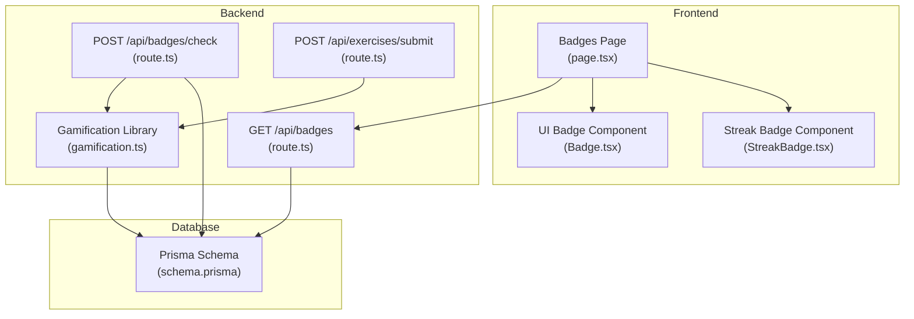
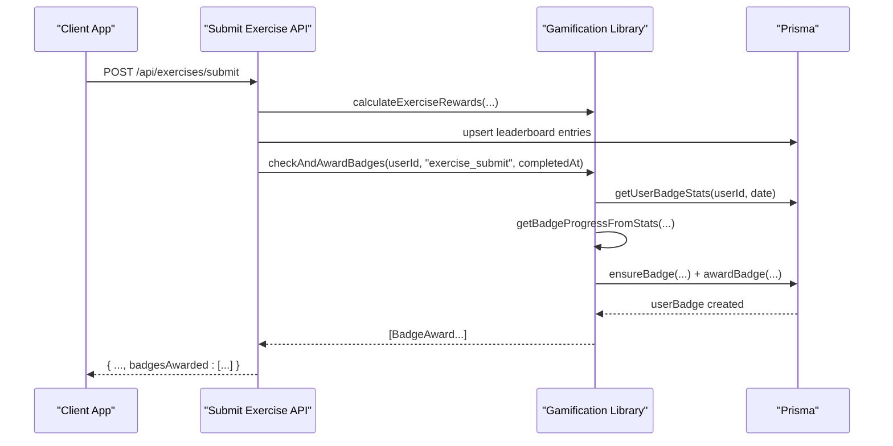
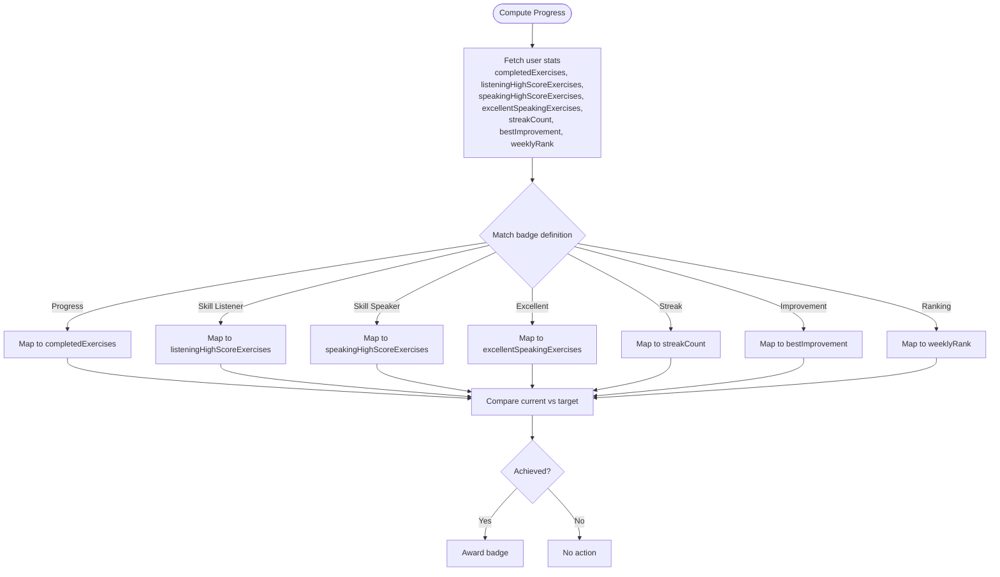
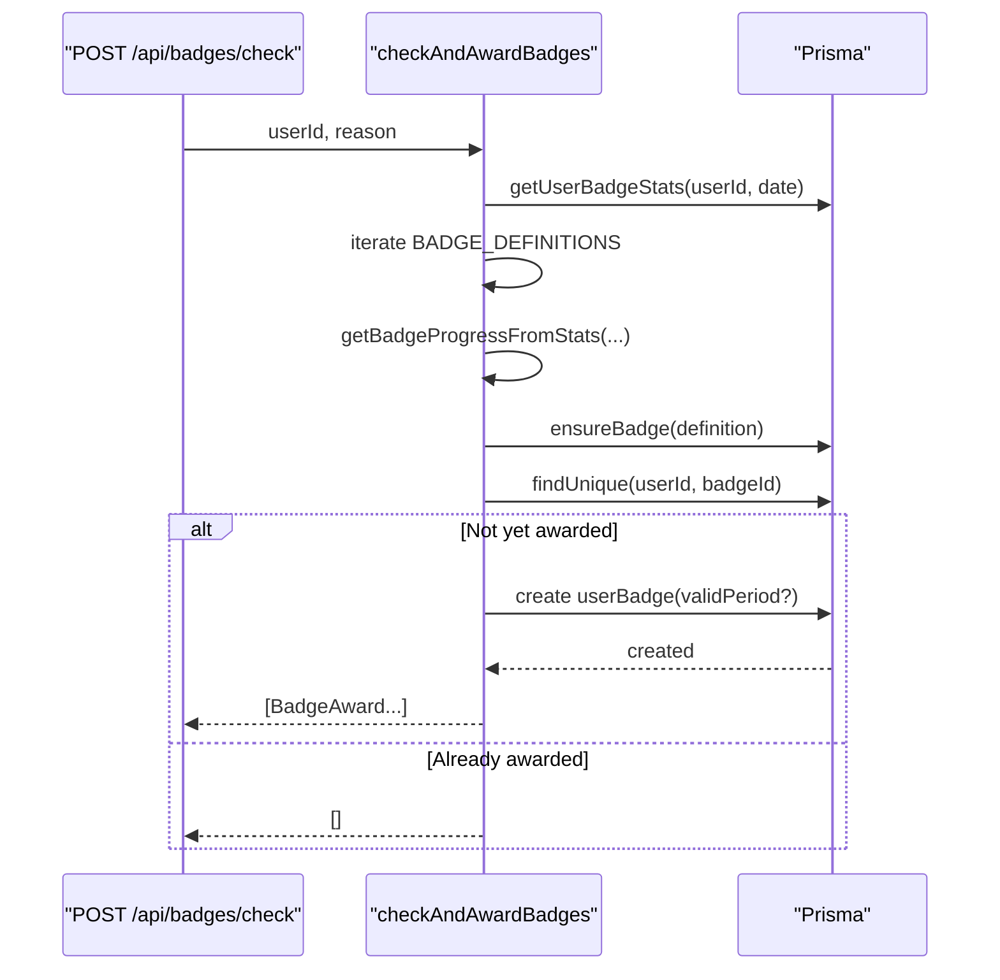
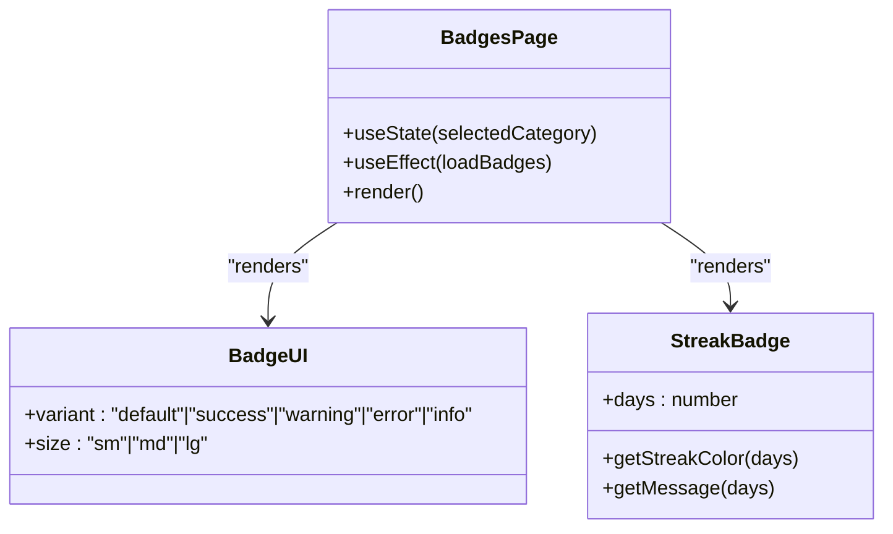
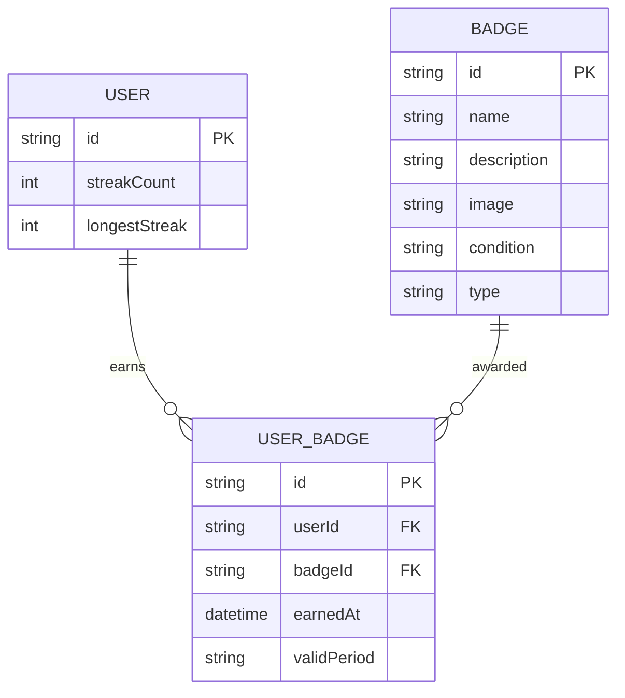
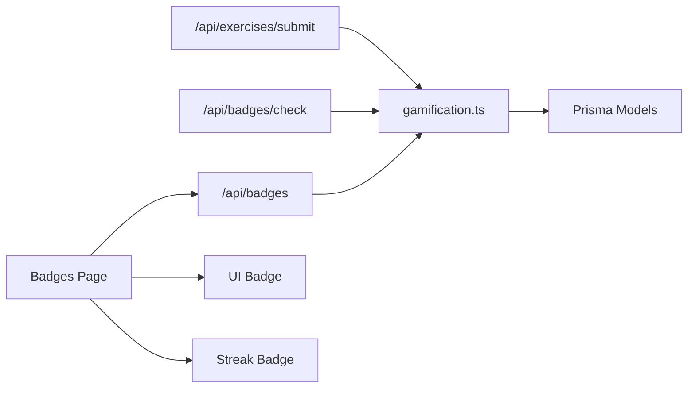

# Badge and Achievement System

<cite>
**Referenced Files in This Document**
- [BADGE_SYSTEM_PLAN.md](file://PLAN/04_Features/BADGE_SYSTEM_PLAN.md)
- [gamification.ts](file://english_pronunciation_app/frontend/src/lib/gamification.ts)
- [route.ts](file://english_pronunciation_app/frontend/src/app/api/badges/check/route.ts)
- [route.ts](file://english_pronunciation_app/frontend/src/app/api/badges/route.ts)
- [page.tsx](file://english_pronunciation_app/frontend/src/app/badges/page.tsx)
- [StreakBadge.tsx](file://english_pronunciation_app/frontend/src/components/gamification/StreakBadge.tsx)
- [Badge.tsx](file://english_pronunciation_app/frontend/src/components/ui/Badge.tsx)
- [schema.prisma](file://english_pronunciation_app/frontend/prisma/schema.prisma)
- [route.ts](file://english_pronunciation_app/frontend/src/app/api/exercises/submit/route.ts)
- [period.ts](file://english_pronunciation_app/frontend/src/lib/period.ts)
</cite>

## Table of Contents
1. [Introduction](#introduction)
2. [Project Structure](#project-structure)
3. [Core Components](#core-components)
4. [Architecture Overview](#architecture-overview)
5. [Detailed Component Analysis](#detailed-component-analysis)
6. [Dependency Analysis](#dependency-analysis)
7. [Performance Considerations](#performance-considerations)
8. [Troubleshooting Guide](#troubleshooting-guide)
9. [Conclusion](#conclusion)

## Introduction
This document describes the badge and achievement system that recognizes learner progress, skills, streaks, improvements, and rankings. It explains badge definitions, rarity tiers, progress tracking, automatic awarding, and how badges appear in the user interface. The system integrates with exercise submission, daily check-in, and leaderboard updates to evaluate user progress and award achievements accordingly.

## Project Structure
The badge system spans backend APIs, frontend pages, UI components, and the database schema:
- Backend APIs handle badge queries and auto-awarding triggers.
- Frontend pages display earned and available badges with progress bars.
- UI components render badge variants and streak visuals.
- The database schema defines Badge and UserBadge entities with optional validity periods for periodic badges.

**Diagram sources**
- [page.tsx:133-252](file://english_pronunciation_app/frontend/src/app/badges/page.tsx#L133-L252)
- [Badge.tsx:1-43](file://english_pronunciation_app/frontend/src/components/ui/Badge.tsx#L1-L43)
- [StreakBadge.tsx:1-63](file://english_pronunciation_app/frontend/src/components/gamification/StreakBadge.tsx#L1-L63)
- [route.ts:29-95](file://english_pronunciation_app/frontend/src/app/api/badges/route.ts#L29-L95)
- [route.ts:34-59](file://english_pronunciation_app/frontend/src/app/api/badges/check/route.ts#L34-L59)
- [route.ts:266-266](file://english_pronunciation_app/frontend/src/app/api/exercises/submit/route.ts#L266-L266)
- [gamification.ts:490-531](file://english_pronunciation_app/frontend/src/lib/gamification.ts#L490-L531)
- [schema.prisma:478-500](file://english_pronunciation_app/frontend/prisma/schema.prisma#L478-L500)

**Section sources**
- [BADGE_SYSTEM_PLAN.md:10-156](file://PLAN/04_Features/BADGE_SYSTEM_PLAN.md#L10-L156)
- [schema.prisma:478-500](file://english_pronunciation_app/frontend/prisma/schema.prisma#L478-L500)

## Core Components
- Badge definitions: A curated set of badges with id, name, description, condition, type (rarity), and category (progress, skill, streak, improvement, ranking). Targets and units define measurable goals.
- Progress tracking: Computes current progress toward each badge using user statistics such as completed exercises, listening/speaking high-score counts, streak count, best improvement, and weekly rank.
- Automatic awarding: Evaluates progress against criteria and awards badges atomically, preventing duplicates and supporting periodic validity windows.
- Frontend integration: Displays earned vs. available badges, progress bars, and category filtering; renders badge rarity via UI variants.

Key implementation references:
- Badge definitions and types: [gamification.ts:65-176](file://english_pronunciation_app/frontend/src/lib/gamification.ts#L65-L176)
- Progress computation: [gamification.ts:328-378](file://english_pronunciation_app/frontend/src/lib/gamification.ts#L328-L378)
- Stats aggregation: [gamification.ts:380-488](file://english_pronunciation_app/frontend/src/lib/gamification.ts#L380-L488)
- Award logic: [gamification.ts:250-304](file://english_pronunciation_app/frontend/src/lib/gamification.ts#L250-L304)
- Auto-award orchestration: [gamification.ts:490-531](file://english_pronunciation_app/frontend/src/lib/gamification.ts#L490-L531)
- Frontend badge page: [page.tsx:133-252](file://english_pronunciation_app/frontend/src/app/badges/page.tsx#L133-L252)
- Badge UI component: [Badge.tsx:1-43](file://english_pronunciation_app/frontend/src/components/ui/Badge.tsx#L1-L43)
- Streak visual component: [StreakBadge.tsx:1-63](file://english_pronunciation_app/frontend/src/components/gamification/StreakBadge.tsx#L1-L63)
- Periodic period helpers: [period.ts:19-32](file://english_pronunciation_app/frontend/src/lib/period.ts#L19-L32)

**Section sources**
- [gamification.ts:65-176](file://english_pronunciation_app/frontend/src/lib/gamification.ts#L65-L176)
- [gamification.ts:328-378](file://english_pronunciation_app/frontend/src/lib/gamification.ts#L328-L378)
- [gamification.ts:380-488](file://english_pronunciation_app/frontend/src/lib/gamification.ts#L380-L488)
- [gamification.ts:250-304](file://english_pronunciation_app/frontend/src/lib/gamification.ts#L250-L304)
- [gamification.ts:490-531](file://english_pronunciation_app/frontend/src/lib/gamification.ts#L490-L531)
- [page.tsx:133-252](file://english_pronunciation_app/frontend/src/app/badges/page.tsx#L133-L252)
- [Badge.tsx:1-43](file://english_pronunciation_app/frontend/src/components/ui/Badge.tsx#L1-L43)
- [StreakBadge.tsx:1-63](file://english_pronunciation_app/frontend/src/components/gamification/StreakBadge.tsx#L1-L63)
- [period.ts:19-32](file://english_pronunciation_app/frontend/src/lib/period.ts#L19-L32)

## Architecture Overview
The badge system follows a layered architecture:
- Presentation: Badges page fetches and renders badge lists with progress.
- Application: APIs trigger badge evaluation upon exercise submission and manual checks.
- Domain: Gamification library encapsulates badge definitions, progress calculation, stats aggregation, and award logic.
- Persistence: Prisma models persist badges and user-badge records, including optional validity periods for periodic badges.

**Diagram sources**
- [route.ts:266-266](file://english_pronunciation_app/frontend/src/app/api/exercises/submit/route.ts#L266-L266)
- [gamification.ts:195-234](file://english_pronunciation_app/frontend/src/lib/gamification.ts#L195-L234)
- [gamification.ts:380-488](file://english_pronunciation_app/frontend/src/lib/gamification.ts#L380-L488)
- [gamification.ts:328-378](file://english_pronunciation_app/frontend/src/lib/gamification.ts#L328-L378)
- [gamification.ts:250-304](file://english_pronunciation_app/frontend/src/lib/gamification.ts#L250-L304)

## Detailed Component Analysis

### Badge Definition Structure
Badge definitions include:
- Identity: id, name, description, condition
- Classification: type (COMMON, RARE, EPIC, PERIODIC), category (progress, skill, streak, improvement, ranking)
- Goals: target and unit for quantified criteria
- Rarity and visual mapping: The frontend maps type to UI variants for consistent visual distinction.

Examples of badge types and categories:
- Progress: First exercise, three exercises, ten exercises
- Skill: Good listener, clear speaker, excellent pronunciation
- Streak: 3-day, 7-day, 14-day
- Improvement: Comeback (score delta)
- Ranking: Weekly top 10

Rarity tiers and intent:
- COMMON: Easy to achieve, encouraging beginners
- RARE: Requires sustained effort
- EPIC: Significant milestones
- PERIODIC: Valid for a period (e.g., weekly), stored with validPeriod

**Section sources**
- [BADGE_SYSTEM_PLAN.md:37-121](file://PLAN/04_Features/BADGE_SYSTEM_PLAN.md#L37-L121)
- [gamification.ts:65-176](file://english_pronunciation_app/frontend/src/lib/gamification.ts#L65-L176)
- [page.tsx:69-75](file://english_pronunciation_app/frontend/src/app/badges/page.tsx#L69-L75)

### Progress Categories and Conditions
Progress categories and typical conditions:
- Progress: Complete X exercises with minimum score threshold
- Skill: Achieve thresholds on listening or speaking exercises
- Streak: Consecutive check-ins/days
- Improvement: Best improvement score delta on reattempts
- Ranking: Position within weekly leaderboard

Conditions are expressed in natural language within definitions and rendered in the UI for transparency.

**Section sources**
- [BADGE_SYSTEM_PLAN.md:53-92](file://PLAN/04_Features/BADGE_SYSTEM_PLAN.md#L53-L92)
- [gamification.ts:65-176](file://english_pronunciation_app/frontend/src/lib/gamification.ts#L65-L176)

### Badge Progression Tracking
The system tracks user statistics and computes progress per badge:
- Completed exercises: count of exercises meeting the passing threshold
- Listening/speaking high-score exercises: counts for skill badges
- Excellent speaking exercises: threshold for excellence badge
- Streak count: from user model
- Best improvement: difference between best attempts
- Weekly rank: from leaderboard for ranking badges

Stats aggregation and progress computation:
- Aggregation: [getUserBadgeStats:380-488](file://english_pronunciation_app/frontend/src/lib/gamification.ts#L380-L488)
- Progress mapping: [getBadgeProgressFromStats:328-378](file://english_pronunciation_app/frontend/src/lib/gamification.ts#L328-L378)

**Diagram sources**
- [gamification.ts:328-378](file://english_pronunciation_app/frontend/src/lib/gamification.ts#L328-L378)
- [gamification.ts:380-488](file://english_pronunciation_app/frontend/src/lib/gamification.ts#L380-L488)

**Section sources**
- [gamification.ts:328-378](file://english_pronunciation_app/frontend/src/lib/gamification.ts#L328-L378)
- [gamification.ts:380-488](file://english_pronunciation_app/frontend/src/lib/gamification.ts#L380-L488)

### Automatic Badge Awarding Mechanism
Awarding logic ensures uniqueness and atomicity:
- Upsert badge definition into the database
- Prevent duplicate awards per user-badge combination
- Optionally set validPeriod for PERIODIC badges
- Return awarded badge metadata

Trigger points:
- Exercise submission: [checkAndAwardBadges:490-531](file://english_pronunciation_app/frontend/src/lib/gamification.ts#L490-L531) invoked after scoring and leaderboard updates
- Manual check: [POST /api/badges/check:34-59](file://english_pronunciation_app/frontend/src/app/api/badges/check/route.ts#L34-L59)

**Diagram sources**
- [route.ts:34-59](file://english_pronunciation_app/frontend/src/app/api/badges/check/route.ts#L34-L59)
- [gamification.ts:490-531](file://english_pronunciation_app/frontend/src/lib/gamification.ts#L490-L531)
- [gamification.ts:250-304](file://english_pronunciation_app/frontend/src/lib/gamification.ts#L250-L304)

**Section sources**
- [route.ts:34-59](file://english_pronunciation_app/frontend/src/app/api/badges/check/route.ts#L34-L59)
- [gamification.ts:490-531](file://english_pronunciation_app/frontend/src/lib/gamification.ts#L490-L531)
- [gamification.ts:250-304](file://english_pronunciation_app/frontend/src/lib/gamification.ts#L250-L304)

### Frontend Integration and Visual Representation
- Badges page: Lists earned and available badges, filters by category, shows progress bars, and indicates earned dates.
- UI Badge component: Renders variants mapped from badge types (COMMON → default, RARE → info, EPIC → warning, PERIODIC → success).
- Streak visual: Dedicated component for streak display with color gradients and milestone messages.

**Diagram sources**
- [page.tsx:133-252](file://english_pronunciation_app/frontend/src/app/badges/page.tsx#L133-L252)
- [Badge.tsx:1-43](file://english_pronunciation_app/frontend/src/components/ui/Badge.tsx#L1-L43)
- [StreakBadge.tsx:1-63](file://english_pronunciation_app/frontend/src/components/gamification/StreakBadge.tsx#L1-L63)

**Section sources**
- [page.tsx:69-75](file://english_pronunciation_app/frontend/src/app/badges/page.tsx#L69-L75)
- [Badge.tsx:1-43](file://english_pronunciation_app/frontend/src/components/ui/Badge.tsx#L1-L43)
- [StreakBadge.tsx:1-63](file://english_pronunciation_app/frontend/src/components/gamification/StreakBadge.tsx#L1-L63)

### Database Schema and Periodic Badges
The schema supports:
- Badge: identity, name, description, image, condition, type
- UserBadge: association of user to badge, earned timestamp, optional validPeriod

Periodic badges use validPeriod to scope validity to a weekly or monthly period.

**Diagram sources**
- [schema.prisma:478-500](file://english_pronunciation_app/frontend/prisma/schema.prisma#L478-L500)

**Section sources**
- [schema.prisma:478-500](file://english_pronunciation_app/frontend/prisma/schema.prisma#L478-L500)
- [period.ts:19-32](file://english_pronunciation_app/frontend/src/lib/period.ts#L19-L32)

## Dependency Analysis
- APIs depend on the gamification library for badge evaluation and stats.
- Exercise submission triggers badge evaluation after scoring and leaderboard updates.
- Frontend depends on backend APIs for badge data and on UI components for rendering.
- Database models underpin badge persistence and uniqueness constraints.

**Diagram sources**
- [route.ts:266-266](file://english_pronunciation_app/frontend/src/app/api/exercises/submit/route.ts#L266-L266)
- [route.ts:34-59](file://english_pronunciation_app/frontend/src/app/api/badges/check/route.ts#L34-L59)
- [route.ts:29-95](file://english_pronunciation_app/frontend/src/app/api/badges/route.ts#L29-L95)
- [gamification.ts:490-531](file://english_pronunciation_app/frontend/src/lib/gamification.ts#L490-L531)
- [schema.prisma:478-500](file://english_pronunciation_app/frontend/prisma/schema.prisma#L478-L500)

**Section sources**
- [route.ts:266-266](file://english_pronunciation_app/frontend/src/app/api/exercises/submit/route.ts#L266-L266)
- [route.ts:34-59](file://english_pronunciation_app/frontend/src/app/api/badges/check/route.ts#L34-L59)
- [route.ts:29-95](file://english_pronunciation_app/frontend/src/app/api/badges/route.ts#L29-L95)
- [gamification.ts:490-531](file://english_pronunciation_app/frontend/src/lib/gamification.ts#L490-L531)

## Performance Considerations
- Efficient stats aggregation: Single transaction fetches attempts and leaderboard subset to minimize round trips.
- Early exits: Duplicate award prevention avoids unnecessary writes.
- Periodic badge validity: validPeriod reduces long-term storage overhead for time-bound achievements.
- UI responsiveness: Progress bars update client-side after fetching badge summaries.

## Troubleshooting Guide
Common issues and resolutions:
- Unauthenticated requests: APIs return unauthenticated errors; ensure user session exists.
- Validation errors: Verify payload fields (e.g., exerciseId, answers) conform to expected shapes.
- Internal errors: Server errors during badge evaluation or database operations; check logs and retry.
- Duplicate badge awards: The system prevents re-awarding the same badge; verify uniqueness constraints.
- Periodic badge expiration: PERIODIC badges rely on validPeriod; ensure period calculation aligns with leaderboard cycles.

**Section sources**
- [route.ts:30-95](file://english_pronunciation_app/frontend/src/app/api/badges/route.ts#L30-L95)
- [route.ts:34-59](file://english_pronunciation_app/frontend/src/app/api/badges/check/route.ts#L34-L59)
- [route.ts:47-67](file://english_pronunciation_app/frontend/src/app/api/exercises/submit/route.ts#L47-L67)

## Conclusion
The badge and achievement system provides a structured, extensible framework for recognizing learner milestones. With clear definitions, transparent conditions, robust progress tracking, and automatic awarding, it enhances motivation and engagement. The frontend integrates badges seamlessly into profiles and dashboards, while the database supports both permanent and periodic achievements.