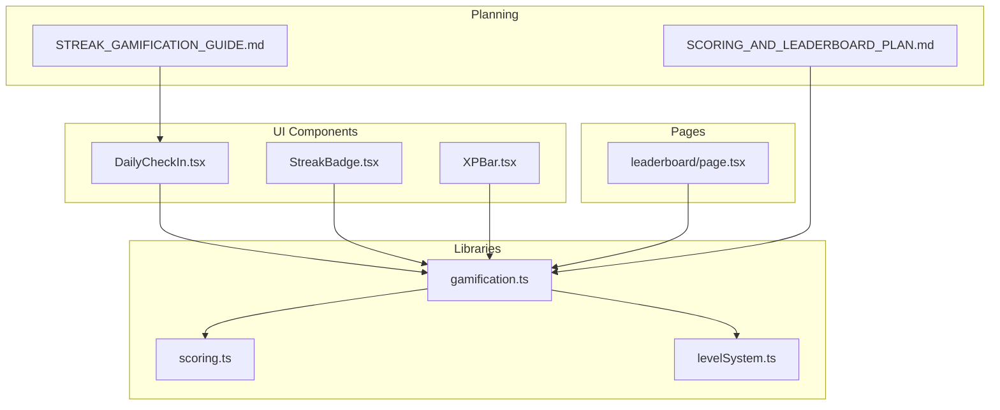
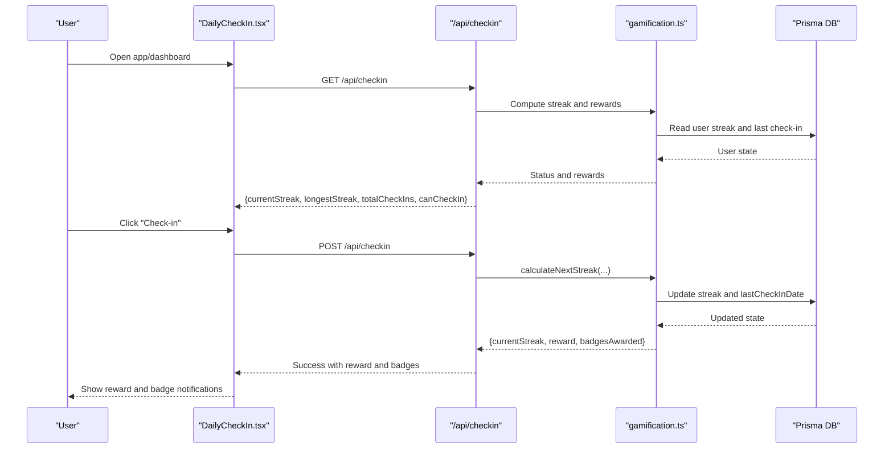
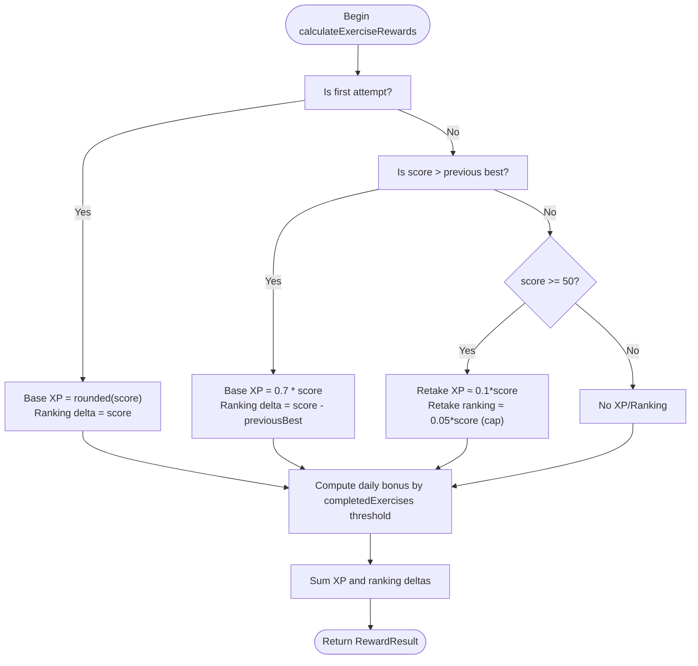
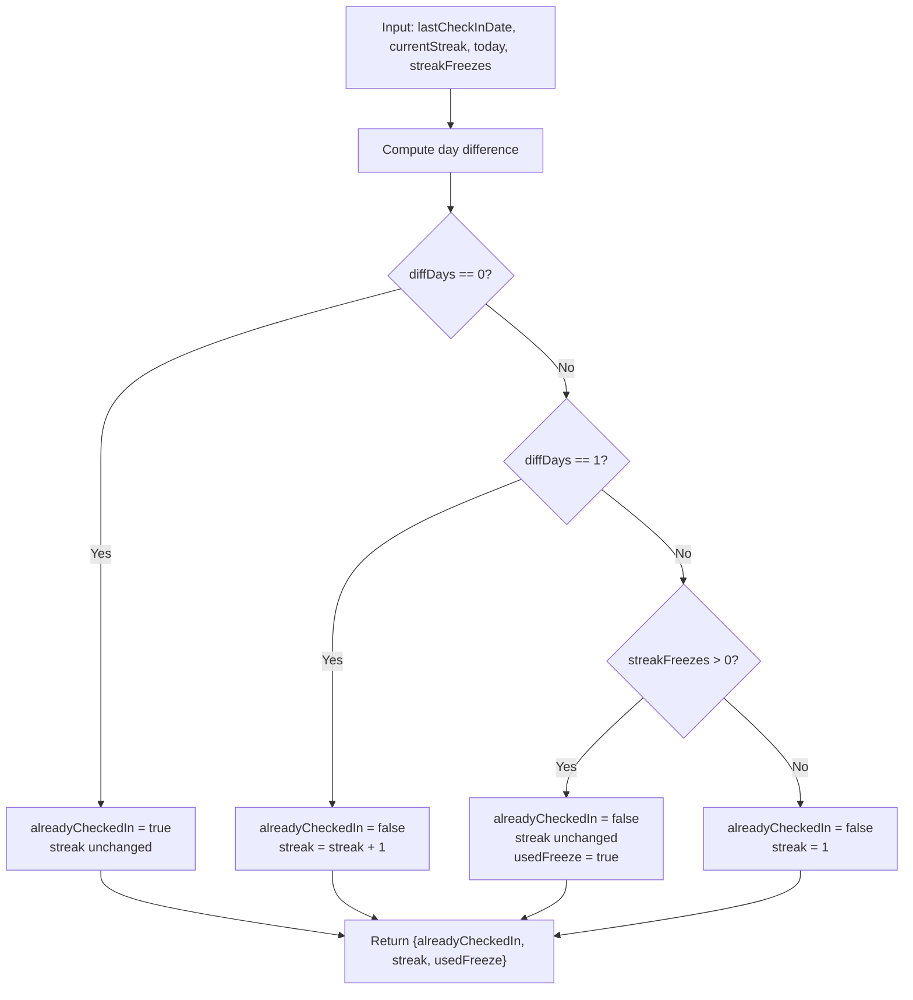
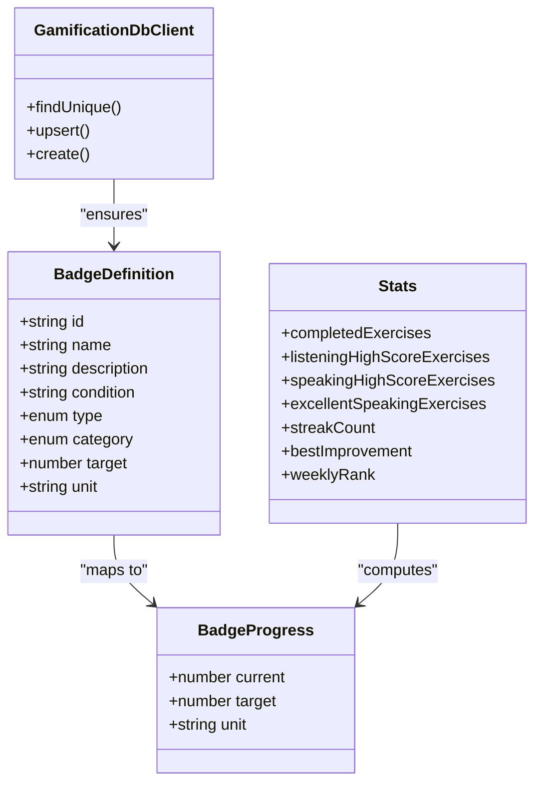
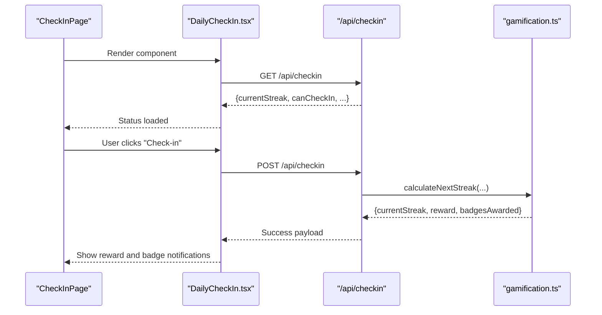
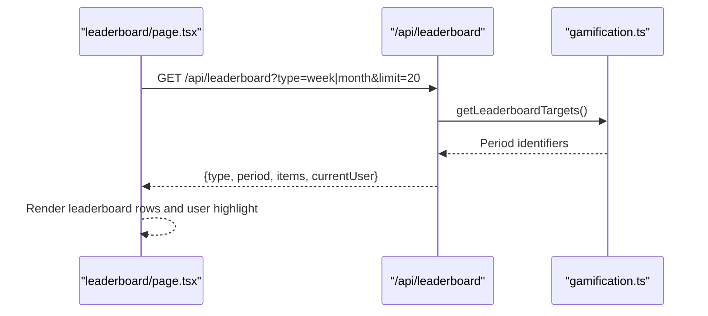
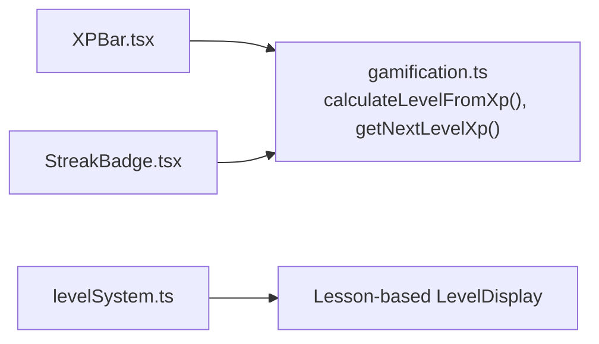
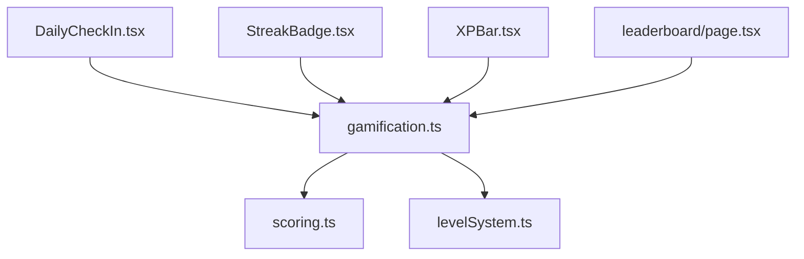

# Gamification Engine

<cite>
**Referenced Files in This Document**
- [gamification.ts](file://english_pronunciation_app/frontend/src/lib/gamification.ts)
- [DailyCheckIn.tsx](file://english_pronunciation_app/frontend/src/components/gamification/DailyCheckIn.tsx)
- [StreakBadge.tsx](file://english_pronunciation_app/frontend/src/components/gamification/StreakBadge.tsx)
- [XPBar.tsx](file://english_pronunciation_app/frontend/src/components/gamification/XPBar.tsx)
- [leaderboard/page.tsx](file://english_pronunciation_app/frontend/src/app/leaderboard/page.tsx)
- [scoring.ts](file://english_pronunciation_app/frontend/src/lib/scoring.ts)
- [levelSystem.ts](file://english_pronunciation_app/frontend/src/lib/levelSystem.ts)
- [STREAK_GAMIFICATION_GUIDE.md](file://PLAN/04_Features/STREAK_GAMIFICATION_GUIDE.md)
- [SCORING_AND_LEADERBOARD_PLAN.md](file://PLAN/04_Features/SCORING_AND_LEADERBOARD_PLAN.md)
- [gamification.test.ts](file://english_pronunciation_app/frontend/src/lib/__tests__/gamification.test.ts)
- [useComboStreak.ts](file://english_pronunciation_app/frontend/src/hooks/useComboStreak.ts)
</cite>

## Table of Contents
1. [Introduction](#introduction)
2. [Project Structure](#project-structure)
3. [Core Components](#core-components)
4. [Architecture Overview](#architecture-overview)
5. [Detailed Component Analysis](#detailed-component-analysis)
6. [Dependency Analysis](#dependency-analysis)
7. [Performance Considerations](#performance-considerations)
8. [Troubleshooting Guide](#troubleshooting-guide)
9. [Conclusion](#conclusion)
10. [Appendices](#appendices)

## Introduction
This document describes the gamification and motivation system, covering XP calculation algorithms, streak tracking, achievement badges, daily check-in mechanics, reward structures, and progress visualization. It explains how learning activities trigger gamification rewards, how user engagement and retention are driven, and how leaderboards and social comparison features are implemented. Configuration options for gamification parameters, reward scaling, and achievement criteria are documented alongside concrete examples from the codebase.

## Project Structure
The gamification engine spans frontend libraries, UI components, and planning documents:
- Core logic resides in a centralized library module that computes XP, streaks, badges, and leaderboard targets.
- UI components visualize XP progression, streak counters, and daily check-in flows.
- Leaderboard pages consume leaderboard APIs to present weekly/monthly rankings.
- Scoring utilities support exercise scoring and ratings used by XP calculations.
- Planning documents define streak mechanics, reward tiers, and leaderboard policies.

**Diagram sources**
- [gamification.ts:1-575](file://english_pronunciation_app/frontend/src/lib/gamification.ts#L1-L575)
- [DailyCheckIn.tsx:1-234](file://english_pronunciation_app/frontend/src/components/gamification/DailyCheckIn.tsx#L1-L234)
- [StreakBadge.tsx:1-63](file://english_pronunciation_app/frontend/src/components/gamification/StreakBadge.tsx#L1-L63)
- [XPBar.tsx:1-50](file://english_pronunciation_app/frontend/src/components/gamification/XPBar.tsx#L1-L50)
- [leaderboard/page.tsx:1-224](file://english_pronunciation_app/frontend/src/app/leaderboard/page.tsx#L1-L224)
- [scoring.ts:1-227](file://english_pronunciation_app/frontend/src/lib/scoring.ts#L1-L227)
- [levelSystem.ts:1-133](file://english_pronunciation_app/frontend/src/lib/levelSystem.ts#L1-L133)
- [STREAK_GAMIFICATION_GUIDE.md:1-569](file://PLAN/04_Features/STREAK_GAMIFICATION_GUIDE.md#L1-L569)
- [SCORING_AND_LEADERBOARD_PLAN.md:1-280](file://PLAN/04_Features/SCORING_AND_LEADERBOARD_PLAN.md#L1-L280)

**Section sources**
- [gamification.ts:1-575](file://english_pronunciation_app/frontend/src/lib/gamification.ts#L1-L575)
- [DailyCheckIn.tsx:1-234](file://english_pronunciation_app/frontend/src/components/gamification/DailyCheckIn.tsx#L1-L234)
- [leaderboard/page.tsx:1-224](file://english_pronunciation_app/frontend/src/app/leaderboard/page.tsx#L1-L224)
- [STREAK_GAMIFICATION_GUIDE.md:1-569](file://PLAN/04_Features/STREAK_GAMIFICATION_GUIDE.md#L1-L569)
- [SCORING_AND_LEADERBOARD_PLAN.md:1-280](file://PLAN/04_Features/SCORING_AND_LEADERBOARD_PLAN.md#L1-L280)

## Core Components
- XP calculation and level progression:
  - XP to level mapping uses a square-root-based formula with a minimum level.
  - Next-level XP requirement derived from inverse computation.
- Exercise reward engine:
  - Computes base XP, retake XP, daily bonus XP, ranking deltas, and total ranking delta based on attempt outcomes and daily thresholds.
- Streak tracking and freeze mechanics:
  - Calculates next streak considering last check-in date, current streak, optional freeze usage, and local day boundaries.
- Achievement badge system:
  - Defines badge categories and targets, computes progress from user statistics, and awards badges upon meeting conditions.
- Daily check-in:
  - Provides UI and API integration for daily check-in with weekly reward cycles and milestone detection.
- Leaderboard:
  - Fetches weekly and monthly leaderboard data and displays user rank and scores.

**Section sources**
- [gamification.ts:178-234](file://english_pronunciation_app/frontend/src/lib/gamification.ts#L178-L234)
- [gamification.ts:553-575](file://english_pronunciation_app/frontend/src/lib/gamification.ts#L553-L575)
- [gamification.ts:65-176](file://english_pronunciation_app/frontend/src/lib/gamification.ts#L65-L176)
- [DailyCheckIn.tsx:1-234](file://english_pronunciation_app/frontend/src/components/gamification/DailyCheckIn.tsx#L1-L234)
- [leaderboard/page.tsx:1-224](file://english_pronunciation_app/frontend/src/app/leaderboard/page.tsx#L1-L224)

## Architecture Overview
The gamification engine integrates frontend logic with UI components and backend APIs. The central library module encapsulates reward computations, streak logic, and badge checks. UI components orchestrate user interactions and display progress. Leaderboard pages fetch and render ranking data.

**Diagram sources**
- [DailyCheckIn.tsx:76-161](file://english_pronunciation_app/frontend/src/components/gamification/DailyCheckIn.tsx#L76-L161)
- [gamification.ts:553-575](file://english_pronunciation_app/frontend/src/lib/gamification.ts#L553-L575)
- [STREAK_GAMIFICATION_GUIDE.md:52-104](file://PLAN/04_Features/STREAK_GAMIFICATION_GUIDE.md#L52-L104)

## Detailed Component Analysis

### XP Calculation and Level Progression
- XP to level mapping:
  - Level computed from accumulated XP using a floor(sqrt(XP/100)) + 1 formula.
  - Next level XP threshold computed as level^2 * 100.
- Exercise reward computation:
  - Base XP equals rounded exercise score for first attempts.
  - Improved retakes yield reduced base XP and ranking delta equal to score improvement.
  - Retake attempts below passing threshold yield small XP and minimal ranking bonus.
  - Daily bonus XP and ranking are determined by completed exercises threshold and score cutoff.
- Scoring integration:
  - Exercise rating informs gem rewards and contributes to XP scaling.

**Diagram sources**
- [gamification.ts:195-234](file://english_pronunciation_app/frontend/src/lib/gamification.ts#L195-L234)
- [scoring.ts:217-222](file://english_pronunciation_app/frontend/src/lib/scoring.ts#L217-L222)

**Section sources**
- [gamification.ts:178-184](file://english_pronunciation_app/frontend/src/lib/gamification.ts#L178-L184)
- [gamification.ts:195-234](file://english_pronunciation_app/frontend/src/lib/gamification.ts#L195-L234)
- [scoring.ts:217-222](file://english_pronunciation_app/frontend/src/lib/scoring.ts#L217-L222)
- [gamification.test.ts:17-45](file://english_pronunciation_app/frontend/src/lib/__tests__/gamification.test.ts#L17-L45)

### Streak Tracking and Freeze Mechanics
- Streak calculation:
  - Compares last check-in date to today’s local day boundary.
  - One-day gap increments streak; zero-day means already checked in; larger gaps reset to 1 unless a freeze is available.
  - Optional freeze usage preserves streak count at the cost of one freeze token.
- Weekly reward cycle:
  - Cycle day determined by (currentStreak - 1) % 7 + 1; rewards scale from day 1 to day 7.

**Diagram sources**
- [gamification.ts:553-575](file://english_pronunciation_app/frontend/src/lib/gamification.ts#L553-L575)
- [STREAK_GAMIFICATION_GUIDE.md:181-192](file://PLAN/04_Features/STREAK_GAMIFICATION_GUIDE.md#L181-L192)

**Section sources**
- [gamification.ts:553-575](file://english_pronunciation_app/frontend/src/lib/gamification.ts#L553-L575)
- [STREAK_GAMIFICATION_GUIDE.md:181-192](file://PLAN/04_Features/STREAK_GAMIFICATION_GUIDE.md#L181-L192)

### Achievement Badge System
- Badge definitions:
  - Categories include progress, skill, streak, improvement, and ranking.
  - Targets and units define quantified goals (e.g., number of exercises, days, score deltas).
- Badge progress computation:
  - Aggregates user statistics: completed exercises, listening/speaking high-score counts, excellent speaking attempts, best improvement, and weekly rank.
- Award logic:
  - Checks if progress meets target or rank threshold depending on category.
  - Upserts badge definitions and creates user-badge records with optional validity period.

**Diagram sources**
- [gamification.ts:42-51](file://english_pronunciation_app/frontend/src/lib/gamification.ts#L42-L51)
- [gamification.ts:328-378](file://english_pronunciation_app/frontend/src/lib/gamification.ts#L328-L378)
- [gamification.ts:380-488](file://english_pronunciation_app/frontend/src/lib/gamification.ts#L380-L488)
- [gamification.ts:250-304](file://english_pronunciation_app/frontend/src/lib/gamification.ts#L250-L304)

**Section sources**
- [gamification.ts:65-176](file://english_pronunciation_app/frontend/src/lib/gamification.ts#L65-L176)
- [gamification.ts:328-378](file://english_pronunciation_app/frontend/src/lib/gamification.ts#L328-L378)
- [gamification.ts:380-488](file://english_pronunciation_app/frontend/src/lib/gamification.ts#L380-L488)
- [gamification.ts:490-531](file://english_pronunciation_app/frontend/src/lib/gamification.ts#L490-L531)

### Daily Check-In Functionality and Rewards
- UI and API integration:
  - On mount, loads current streak and eligibility via GET /api/checkin.
  - On user action, posts to POST /api/checkin to claim daily reward and potentially earn badges.
  - Weekly reward cycle is visualized as a 7-day indicator.
- Reward structure:
  - Base daily check-in reward includes XP and ranking score.
  - Weekly rewards scale from day 1 to day 7 with increasing coin amounts and milestone badges.

**Diagram sources**
- [DailyCheckIn.tsx:76-161](file://english_pronunciation_app/frontend/src/components/gamification/DailyCheckIn.tsx#L76-L161)
- [STREAK_GAMIFICATION_GUIDE.md:52-104](file://PLAN/04_Features/STREAK_GAMIFICATION_GUIDE.md#L52-L104)
- [STREAK_GAMIFICATION_GUIDE.md:196-223](file://PLAN/04_Features/STREAK_GAMIFICATION_GUIDE.md#L196-L223)

**Section sources**
- [DailyCheckIn.tsx:1-234](file://english_pronunciation_app/frontend/src/components/gamification/DailyCheckIn.tsx#L1-L234)
- [STREAK_GAMIFICATION_GUIDE.md:196-223](file://PLAN/04_Features/STREAK_GAMIFICATION_GUIDE.md#L196-L223)

### Leaderboard Implementation and Social Comparison
- Leaderboard data:
  - Fetches weekly and monthly leaderboards filtered by type and limit.
  - Displays user rank, score, level, streak, completed exercises, and badges.
- Ranking policy:
  - Ranking scores are used for weekly/monthly competition; daily check-in adds modest ranking contribution.
  - Reset periods ensure fresh competition and fair entry for new users.

**Diagram sources**
- [leaderboard/page.tsx:74-100](file://english_pronunciation_app/frontend/src/app/leaderboard/page.tsx#L74-L100)
- [gamification.ts:236-244](file://english_pronunciation_app/frontend/src/lib/gamification.ts#L236-L244)

**Section sources**
- [leaderboard/page.tsx:1-224](file://english_pronunciation_app/frontend/src/app/leaderboard/page.tsx#L1-L224)
- [SCORING_AND_LEADERBOARD_PLAN.md:132-141](file://PLAN/04_Features/SCORING_AND_LEADERBOARD_PLAN.md#L132-L141)

### Progress Visualization Components
- XP bar:
  - Shows current XP, next level threshold, and remaining XP to level up.
- Streak badge:
  - Visualizes streak with color-coded gradients and contextual messages.
- Level display:
  - Separate lesson-based leveling system exists for course progression.

**Diagram sources**
- [XPBar.tsx:1-50](file://english_pronunciation_app/frontend/src/components/gamification/XPBar.tsx#L1-L50)
- [StreakBadge.tsx:1-63](file://english_pronunciation_app/frontend/src/components/gamification/StreakBadge.tsx#L1-L63)
- [gamification.ts:178-184](file://english_pronunciation_app/frontend/src/lib/gamification.ts#L178-L184)
- [levelSystem.ts:1-133](file://english_pronunciation_app/frontend/src/lib/levelSystem.ts#L1-L133)

**Section sources**
- [XPBar.tsx:1-50](file://english_pronunciation_app/frontend/src/components/gamification/XPBar.tsx#L1-L50)
- [StreakBadge.tsx:1-63](file://english_pronunciation_app/frontend/src/components/gamification/StreakBadge.tsx#L1-L63)
- [levelSystem.ts:1-133](file://english_pronunciation_app/frontend/src/lib/levelSystem.ts#L1-L133)

## Dependency Analysis
The gamification engine exhibits clear separation of concerns:
- Libraries depend on scoring utilities for exercise ratings and on period utilities for leaderboard periods.
- UI components depend on the gamification library for reward computations and on backend APIs for state updates.
- Leaderboard pages depend on gamification library for period generation and on backend APIs for ranking data.

**Diagram sources**
- [gamification.ts:1-5](file://english_pronunciation_app/frontend/src/lib/gamification.ts#L1-L5)
- [scoring.ts:1-5](file://english_pronunciation_app/frontend/src/lib/scoring.ts#L1-L5)
- [levelSystem.ts:1-5](file://english_pronunciation_app/frontend/src/lib/levelSystem.ts#L1-L5)
- [DailyCheckIn.tsx:1-5](file://english_pronunciation_app/frontend/src/components/gamification/DailyCheckIn.tsx#L1-L5)
- [StreakBadge.tsx:1-5](file://english_pronunciation_app/frontend/src/components/gamification/StreakBadge.tsx#L1-L5)
- [XPBar.tsx:1-5](file://english_pronunciation_app/frontend/src/components/gamification/XPBar.tsx#L1-L5)
- [leaderboard/page.tsx:1-5](file://english_pronunciation_app/frontend/src/app/leaderboard/page.tsx#L1-L5)

**Section sources**
- [gamification.ts:1-5](file://english_pronunciation_app/frontend/src/lib/gamification.ts#L1-L5)
- [scoring.ts:1-5](file://english_pronunciation_app/frontend/src/lib/scoring.ts#L1-L5)
- [levelSystem.ts:1-5](file://english_pronunciation_app/frontend/src/lib/levelSystem.ts#L1-L5)
- [DailyCheckIn.tsx:1-5](file://english_pronunciation_app/frontend/src/components/gamification/DailyCheckIn.tsx#L1-L5)
- [StreakBadge.tsx:1-5](file://english_pronunciation_app/frontend/src/components/gamification/StreakBadge.tsx#L1-L5)
- [XPBar.tsx:1-5](file://english_pronunciation_app/frontend/src/components/gamification/XPBar.tsx#L1-L5)
- [leaderboard/page.tsx:1-5](file://english_pronunciation_app/frontend/src/app/leaderboard/page.tsx#L1-L5)

## Performance Considerations
- Computation complexity:
  - XP and level calculations are O(1).
  - Streak computation is O(1) with date arithmetic.
  - Badge progress aggregation scans exercise attempts; complexity proportional to attempts count.
- UI responsiveness:
  - Use optimistic updates for immediate feedback during streak claims and badge unlocks.
  - Debounce leaderboard fetches and avoid redundant re-renders by memoizing computed values.
- Data access:
  - Batch queries for user stats and leaderboard reduce network overhead.
  - Cache leaderboard periods and computed XP thresholds to minimize recomputation.

## Troubleshooting Guide
Common issues and resolutions:
- Duplicate check-in on the same day:
  - API returns an error code indicating already checked in; UI disables the button and shows a message.
- Streak reset after extended absence:
  - Backend detects gaps > 48 hours and resets streak; UI displays encouraging messaging.
- Badge awarding not triggering:
  - Verify user statistics aggregation and category-specific thresholds; ensure periodic badges align with current weekly period.
- Level mismatch:
  - Two separate systems exist: XP-based level (gamification) and lesson-based level (course progression). Confirm which is displayed in UI.

**Section sources**
- [DailyCheckIn.tsx:147-155](file://english_pronunciation_app/frontend/src/components/gamification/DailyCheckIn.tsx#L147-L155)
- [STREAK_GAMIFICATION_GUIDE.md:181-192](file://PLAN/04_Features/STREAK_GAMIFICATION_GUIDE.md#L181-L192)
- [gamification.ts:490-531](file://english_pronunciation_app/frontend/src/lib/gamification.ts#L490-L531)
- [CURRENT_PROJECT_CONTEXT.md:41-53](file://PLAN/00_Project_Context/CURRENT_PROJECT_CONTEXT.md#L41-L53)

## Conclusion
The gamification engine combines robust XP calculations, streak mechanics, and a structured badge system to drive engagement and retention. Daily check-in and leaderboard features foster habit formation and social comparison. The modular design allows easy configuration of reward scales, achievement criteria, and leaderboard periods while maintaining clear separation between presentation and logic.

## Appendices

### Configuration Options and Parameters
- Daily bonus thresholds:
  - Configured via a lookup table keyed by completed exercises threshold.
- Check-in reward:
  - Fixed XP and ranking score per successful daily check-in.
- Streak freeze:
  - Optional freeze token usage preserved streak on missed days.
- Leaderboard periods:
  - Weekly and monthly periods generated dynamically based on current date.
- Exercise rating to gem conversion:
  - Excellent rating yields gem reward for shop purchases.

**Section sources**
- [gamification.ts:53-58](file://english_pronunciation_app/frontend/src/lib/gamification.ts#L53-L58)
- [gamification.ts:60-63](file://english_pronunciation_app/frontend/src/lib/gamification.ts#L60-L63)
- [gamification.ts:547-551](file://english_pronunciation_app/frontend/src/lib/gamification.ts#L547-L551)
- [gamification.ts:236-244](file://english_pronunciation_app/frontend/src/lib/gamification.ts#L236-L244)
- [scoring.ts:217-222](file://english_pronunciation_app/frontend/src/lib/scoring.ts#L217-L222)

### Examples from the Codebase
- Exercise reward computation:
  - First attempt: base XP equals rounded score; ranking delta equals score.
  - Improved retake: base XP scaled down; ranking delta equals score improvement.
  - Reference: [calculateExerciseRewards:195-234](file://english_pronunciation_app/frontend/src/lib/gamification.ts#L195-L234)
- Streak calculation:
  - One-day gap increments streak; freeze prevents reset; otherwise reset to 1.
  - Reference: [calculateNextStreak:553-575](file://english_pronunciation_app/frontend/src/lib/gamification.ts#L553-L575)
- Badge progress computation:
  - Progress mapped from user statistics to badge targets.
  - Reference: [getBadgeProgressFromStats:328-378](file://english_pronunciation_app/frontend/src/lib/gamification.ts#L328-L378)
- Leaderboard targets:
  - Weekly and monthly periods generated for leaderboard queries.
  - Reference: [getLeaderboardTargets:236-244](file://english_pronunciation_app/frontend/src/lib/gamification.ts#L236-L244)
- Test coverage:
  - Unit tests validate first attempt XP, retake improvements, and expected deltas.
  - Reference: [gamification.test.ts:17-45](file://english_pronunciation_app/frontend/src/lib/__tests__/gamification.test.ts#L17-L45)