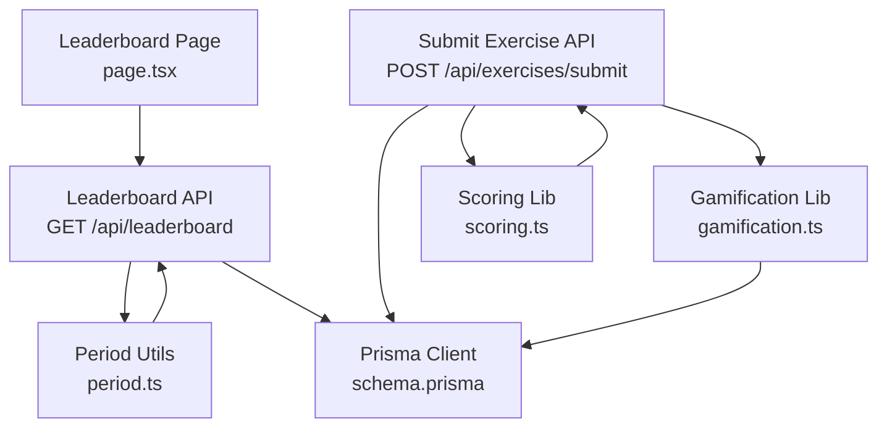
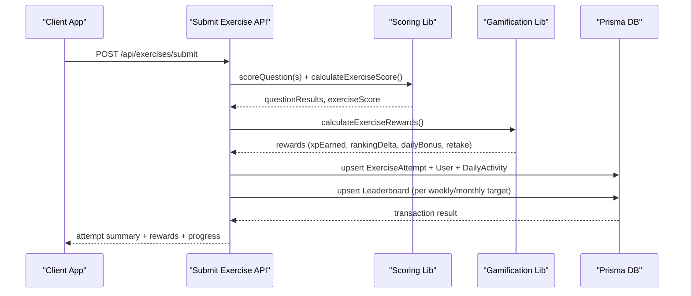
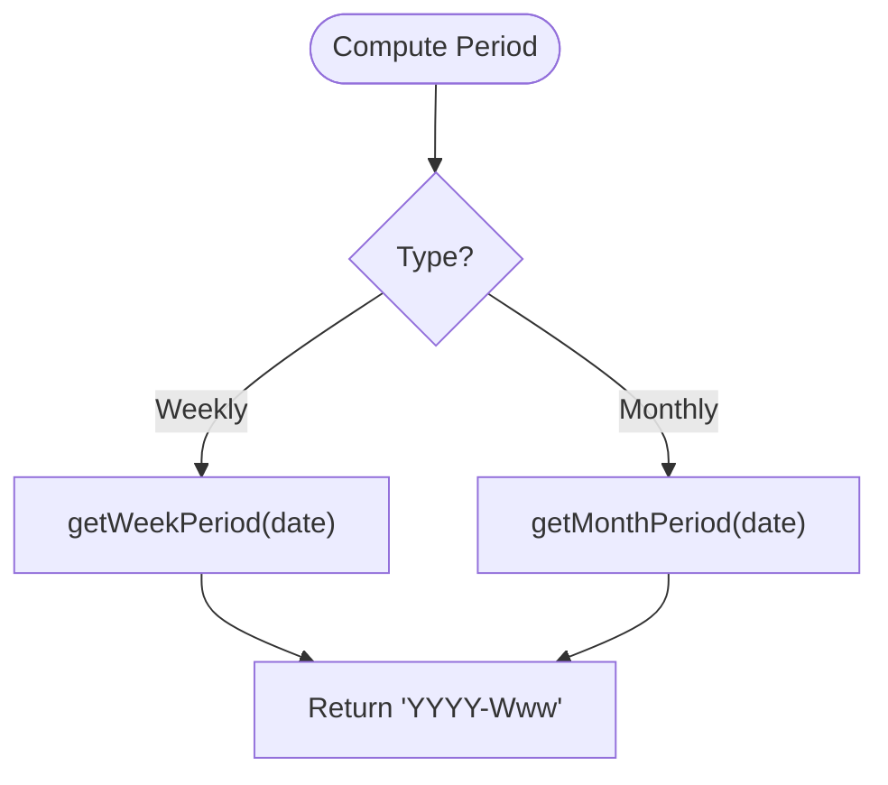
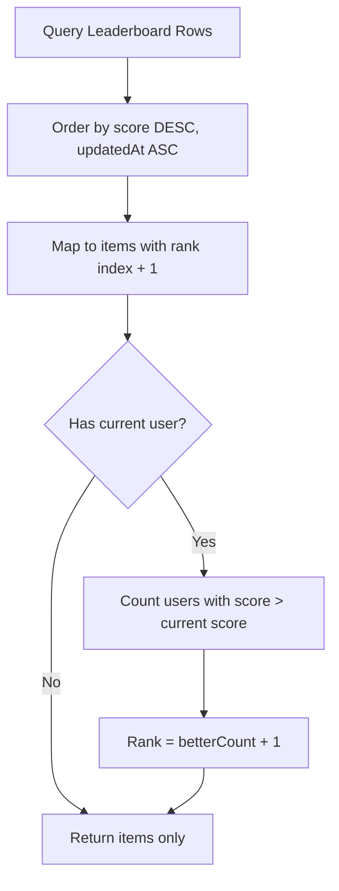
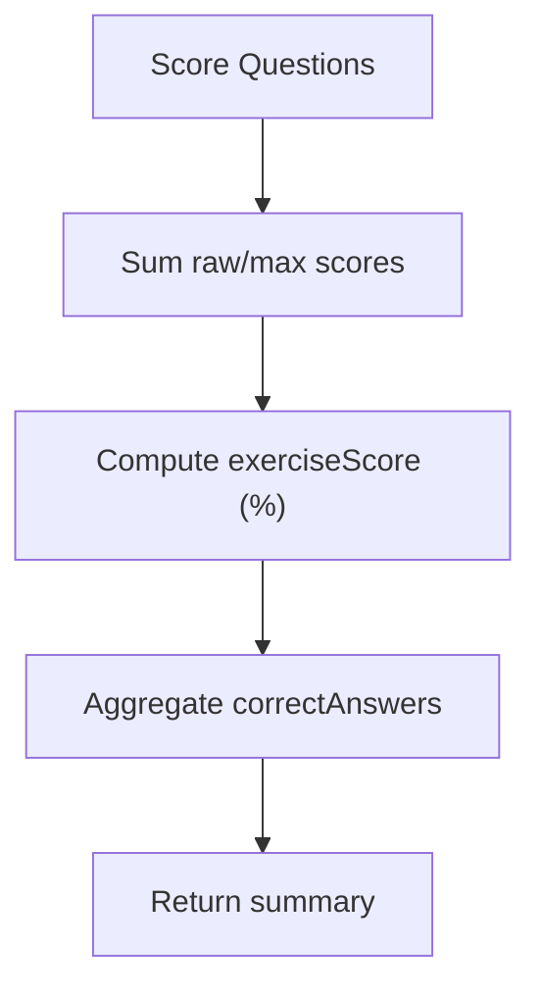
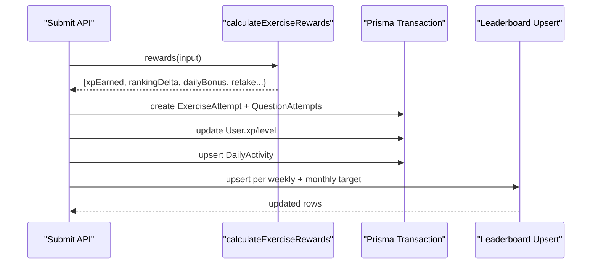
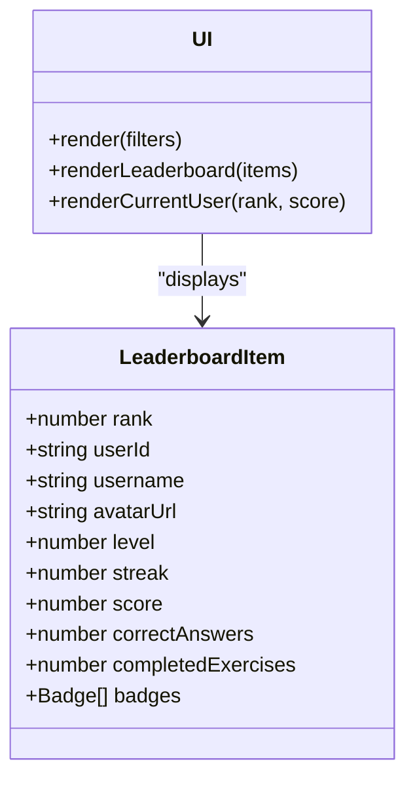
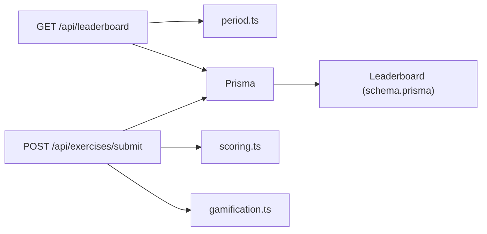

# Leaderboard and Ranking

<cite>
**Referenced Files in This Document**
- [SCORING_AND_LEADERBOARD_PLAN.md](file://PLAN/04_Features/SCORING_AND_LEADERBOARD_PLAN.md)
- [STREAK_GAMIFICATION_GUIDE.md](file://PLAN/04_Features/STREAK_GAMIFICATION_GUIDE.md)
- [route.ts](file://english_pronunciation_app/frontend/src/app/api/leaderboard/route.ts)
- [page.tsx](file://english_pronunciation_app/frontend/src/app/leaderboard/page.tsx)
- [scoring.ts](file://english_pronunciation_app/frontend/src/lib/scoring.ts)
- [period.ts](file://english_pronunciation_app/frontend/src/lib/period.ts)
- [gamification.ts](file://english_pronunciation_app/frontend/src/lib/gamification.ts)
- [schema.prisma](file://english_pronunciation_app/frontend/prisma/schema.prisma)
- [submit.route.ts](file://english_pronunciation_app/frontend/src/app/api/exercises/submit/route.ts)
</cite>

## Table of Contents
1. [Introduction](#introduction)
2. [Project Structure](#project-structure)
3. [Core Components](#core-components)
4. [Architecture Overview](#architecture-overview)
5. [Detailed Component Analysis](#detailed-component-analysis)
6. [Dependency Analysis](#dependency-analysis)
7. [Performance Considerations](#performance-considerations)
8. [Troubleshooting Guide](#troubleshooting-guide)
9. [Conclusion](#conclusion)
10. [Appendices](#appendices)

## Introduction
This document explains the leaderboard and ranking system, focusing on the periodic leaderboard structure (weekly and monthly), period-based calculations, score aggregation, and the ranking algorithm. It also documents how exercise scoring integrates with leaderboard positioning, how streaks influence rankings, and how different exercise types affect performance on the leaderboard. The goal is to provide a clear understanding of how user positions are determined, how scores are accumulated and decay/reset, and how the UI displays rankings and user position tracking.

## Project Structure
The leaderboard feature spans frontend pages, API routes, and shared libraries:
- UI page renders weekly/monthly leaderboards and user’s current rank.
- API route handles leaderboard queries, filtering by type and period, and computes user rank.
- Libraries implement scoring, period calculation, and gamification rewards (including leaderboard deltas).
- Prisma schema defines the Leaderboard entity and its indexing for efficient ranking.

**Diagram sources**
- [page.tsx:60-100](file://english_pronunciation_app/frontend/src/app/leaderboard/page.tsx#L60-L100)
- [route.ts:41-152](file://english_pronunciation_app/frontend/src/app/api/leaderboard/route.ts#L41-L152)
- [period.ts:1-33](file://english_pronunciation_app/frontend/src/lib/period.ts#L1-L33)
- [gamification.ts:195-244](file://english_pronunciation_app/frontend/src/lib/gamification.ts#L195-L244)
- [scoring.ts:191-227](file://english_pronunciation_app/frontend/src/lib/scoring.ts#L191-L227)
- [schema.prisma:90-103](file://english_pronunciation_app/frontend/prisma/schema.prisma#L90-L103)
- [submit.route.ts:47-332](file://english_pronunciation_app/frontend/src/app/api/exercises/submit/route.ts#L47-L332)

**Section sources**
- [page.tsx:1-224](file://english_pronunciation_app/frontend/src/app/leaderboard/page.tsx#L1-L224)
- [route.ts:1-153](file://english_pronunciation_app/frontend/src/app/api/leaderboard/route.ts#L1-L153)
- [period.ts:1-33](file://english_pronunciation_app/frontend/src/lib/period.ts#L1-L33)
- [gamification.ts:1-575](file://english_pronunciation_app/frontend/src/lib/gamification.ts#L1-L575)
- [scoring.ts:1-227](file://english_pronunciation_app/frontend/src/lib/scoring.ts#L1-L227)
- [schema.prisma:90-103](file://english_pronunciation_app/frontend/prisma/schema.prisma#L90-L103)
- [submit.route.ts:1-332](file://english_pronunciation_app/frontend/src/app/api/exercises/submit/route.ts#L1-L332)

## Core Components
- Periodic leaderboard periods:
  - Weekly: ISO-like “YYYY-Www”.
  - Monthly: “YYYY-MM”.
- Leaderboard entries:
  - Per user, per type (“tuan” or “thang”), per period.
  - Aggregated metrics: score, correctAnswers, completedExercises.
- Ranking calculation:
  - Ordered by score descending; ties resolved by updatedAt ascending.
  - Current user’s rank computed by counting users with higher score in the same period.
- Exercise scoring and leaderboard delta:
  - Exercise scoring aggregates question results into an exercise score out of 100.
  - Leaderboard delta depends on attempt type (first-time, improvement, retake) and daily bonus thresholds.

Key behaviors derived from the plan and implementation:
- Separate XP and Ranking Score to avoid long-term dominance by early users.
- Weekly/Monthly resets to keep competition fair and engaging.
- Daily bonus encourages daily participation and limits spam via caps.
- Retake policy rewards improvement while preventing farming.

**Section sources**
- [SCORING_AND_LEADERBOARD_PLAN.md:11-25](file://PLAN/04_Features/SCORING_AND_LEADERBOARD_PLAN.md#L11-L25)
- [SCORING_AND_LEADERBOARD_PLAN.md:132-142](file://PLAN/04_Features/SCORING_AND_LEADERBOARD_PLAN.md#L132-L142)
- [SCORING_AND_LEADERBOARD_PLAN.md:104-131](file://PLAN/04_Features/SCORING_AND_LEADERBOARD_PLAN.md#L104-L131)
- [SCORING_AND_LEADERBOARD_PLAN.md:153-190](file://PLAN/04_Features/SCORING_AND_LEADERBOARD_PLAN.md#L153-L190)
- [period.ts:15-32](file://english_pronunciation_app/frontend/src/lib/period.ts#L15-L32)
- [schema.prisma:90-103](file://english_pronunciation_app/frontend/prisma/schema.prisma#L90-L103)
- [route.ts:54-105](file://english_pronunciation_app/frontend/src/app/api/leaderboard/route.ts#L54-L105)
- [route.ts:124-139](file://english_pronunciation_app/frontend/src/app/api/leaderboard/route.ts#L124-L139)
- [gamification.ts:195-234](file://english_pronunciation_app/frontend/src/lib/gamification.ts#L195-L234)
- [submit.route.ts:241-264](file://english_pronunciation_app/frontend/src/app/api/exercises/submit/route.ts#L241-L264)

## Architecture Overview
The leaderboard pipeline connects exercise submission to leaderboard updates and UI rendering.

**Diagram sources**
- [submit.route.ts:120-141](file://english_pronunciation_app/frontend/src/app/api/exercises/submit/route.ts#L120-L141)
- [scoring.ts:191-227](file://english_pronunciation_app/frontend/src/lib/scoring.ts#L191-L227)
- [gamification.ts:195-234](file://english_pronunciation_app/frontend/src/lib/gamification.ts#L195-L234)
- [submit.route.ts:182-274](file://english_pronunciation_app/frontend/src/app/api/exercises/submit/route.ts#L182-L274)

## Detailed Component Analysis

### Periodic Leaderboard Structure
- Period types:
  - Weekly: ISO-like “YYYY-Www”.
  - Monthly: “YYYY-MM”.
- Period computation:
  - Uses local day boundaries and UTC arithmetic to align weeks.
- Leaderboard entries:
  - Unique constraint on (userId, type, period) ensures one row per user per period.
  - Index on (type, period, score) supports fast ranking queries.

**Diagram sources**
- [period.ts:19-32](file://english_pronunciation_app/frontend/src/lib/period.ts#L19-L32)

**Section sources**
- [period.ts:1-33](file://english_pronunciation_app/frontend/src/lib/period.ts#L1-L33)
- [schema.prisma:90-103](file://english_pronunciation_app/frontend/prisma/schema.prisma#L90-L103)

### Ranking Calculation Algorithm
- Leaderboard retrieval orders by score descending; ties broken by updatedAt ascending.
- Current user’s rank is computed by counting users with strictly higher score in the same period.
- Tie-breaking rule: earliest update time wins.

**Diagram sources**
- [route.ts:54-105](file://english_pronunciation_app/frontend/src/app/api/leaderboard/route.ts#L54-L105)
- [route.ts:124-139](file://english_pronunciation_app/frontend/src/app/api/leaderboard/route.ts#L124-L139)

**Section sources**
- [route.ts:41-152](file://english_pronunciation_app/frontend/src/app/api/leaderboard/route.ts#L41-L152)

### Score Aggregation and Exercise Scoring
- Question scoring:
  - Multiple choice and single-select use exact or normalized matching.
  - Voice/speak questions use word overlap accuracy to derive accuracyScore and scaled score.
- Exercise scoring:
  - Raw score divided by max score times 100 to produce exerciseScore.
  - Correct answers counted for aggregation.
- Exercise rating and completion thresholds guide badges and progression.

**Diagram sources**
- [scoring.ts:191-227](file://english_pronunciation_app/frontend/src/lib/scoring.ts#L191-L227)

**Section sources**
- [scoring.ts:1-227](file://english_pronunciation_app/frontend/src/lib/scoring.ts#L1-L227)

### Leaderboard Update on Exercise Submission
- After scoring, rewards are computed:
  - Base XP and Ranking Score depend on whether it is the first attempt, an improvement, or a retake.
  - Daily bonus adds XP and Ranking Score based on completed exercises in the day and minimum exerciseScore threshold.
- Transactionally:
  - Upserts ExerciseAttempt and associated QuestionAttempts.
  - Updates User XP and level.
  - Upserts DailyActivity.
  - Upserts Leaderboard for both weekly and monthly targets with computed rankingDelta.

**Diagram sources**
- [submit.route.ts:172-177](file://english_pronunciation_app/frontend/src/app/api/exercises/submit/route.ts#L172-L177)
- [gamification.ts:195-234](file://english_pronunciation_app/frontend/src/lib/gamification.ts#L195-L234)
- [submit.route.ts:241-264](file://english_pronunciation_app/frontend/src/app/api/exercises/submit/route.ts#L241-L264)

**Section sources**
- [submit.route.ts:172-274](file://english_pronunciation_app/frontend/src/app/api/exercises/submit/route.ts#L172-L274)
- [gamification.ts:195-234](file://english_pronunciation_app/frontend/src/lib/gamification.ts#L195-L234)

### Leaderboard Display and User Position Tracking
- UI filters between weekly and monthly views.
- Renders top N users with avatars, usernames, level, streak, badges, and aggregated metrics.
- Highlights top 3 ranks with special styling.
- Shows current user’s rank and score for the selected period.

**Diagram sources**
- [page.tsx:9-46](file://english_pronunciation_app/frontend/src/app/leaderboard/page.tsx#L9-L46)
- [page.tsx:102-224](file://english_pronunciation_app/frontend/src/app/leaderboard/page.tsx#L102-L224)

**Section sources**
- [page.tsx:1-224](file://english_pronunciation_app/frontend/src/app/leaderboard/page.tsx#L1-L224)

### Streaks and Leaderboard Positioning
- Streaks are tracked separately from leaderboard scores but influence motivation and daily check-ins.
- Daily check-in logic increments streaks and can trigger rewards; it does not directly alter leaderboard score but contributes to engagement and potential daily bonuses.
- The leaderboard itself is period-based and independent of streak counts, but streaks support consistent daily participation that can improve daily bonus contributions.

**Section sources**
- [STREAK_GAMIFICATION_GUIDE.md:1-569](file://PLAN/04_Features/STREAK_GAMIFICATION_GUIDE.md#L1-L569)
- [schema.prisma:31-44](file://english_pronunciation_app/frontend/prisma/schema.prisma#L31-L44)

## Dependency Analysis
- Leaderboard API depends on:
  - Period utilities for computing target periods.
  - Prisma for querying and ordering leaderboard rows.
  - Authentication for resolving current user context.
- Submit Exercise API depends on:
  - Scoring library for question and exercise scoring.
  - Gamification library for reward computation and leaderboard delta.
  - Prisma for transactional writes to attempts, user, daily activity, and leaderboard.
- Data model:
  - Leaderboard entity stores aggregated metrics and is indexed for fast ranking.

**Diagram sources**
- [route.ts:1-18](file://english_pronunciation_app/frontend/src/app/api/leaderboard/route.ts#L1-L18)
- [period.ts:1-33](file://english_pronunciation_app/frontend/src/lib/period.ts#L1-L33)
- [submit.route.ts:1-332](file://english_pronunciation_app/frontend/src/app/api/exercises/submit/route.ts#L1-L332)
- [scoring.ts:1-227](file://english_pronunciation_app/frontend/src/lib/scoring.ts#L1-L227)
- [gamification.ts:1-575](file://english_pronunciation_app/frontend/src/lib/gamification.ts#L1-L575)
- [schema.prisma:90-103](file://english_pronunciation_app/frontend/prisma/schema.prisma#L90-L103)

**Section sources**
- [route.ts:1-153](file://english_pronunciation_app/frontend/src/app/api/leaderboard/route.ts#L1-L153)
- [submit.route.ts:1-332](file://english_pronunciation_app/frontend/src/app/api/exercises/submit/route.ts#L1-L332)
- [schema.prisma:90-103](file://english_pronunciation_app/frontend/prisma/schema.prisma#L90-L103)

## Performance Considerations
- Indexing:
  - Leaderboard index on (type, period, score) enables efficient top-N queries and rank computations.
- Query limits:
  - API enforces a bounded limit for returned items and sanitizes inputs.
- Transactional writes:
  - Leaderboard updates occur within the same transaction as attempt creation, ensuring consistency.
- Period computation:
  - Using UTC-aligned week calculation avoids timezone-related inconsistencies.

Recommendations:
- Monitor leaderboard queries and consider caching top-K periodically if traffic grows.
- Ensure Prisma client connection pooling and query timeouts are tuned for concurrent leaderboard requests.

**Section sources**
- [schema.prisma](file://english_pronunciation_app/frontend/prisma/schema.prisma#L102)
- [route.ts:28-39](file://english_pronunciation_app/frontend/src/app/api/leaderboard/route.ts#L28-L39)
- [submit.route.ts:241-264](file://english_pronunciation_app/frontend/src/app/api/exercises/submit/route.ts#L241-L264)

## Troubleshooting Guide
Common issues and resolutions:
- Invalid leaderboard type:
  - Ensure type is “tuan” or “thang”; otherwise, the API returns an error.
- Missing authentication:
  - Submitting exercises requires a valid session; unauthorized requests are rejected.
- Validation errors:
  - exerciseId must be present and valid; answers must be non-empty and each question must belong to the exercise.
- Duplicate submissions:
  - Repeated answers for the same question are rejected.
- Internal errors:
  - Server-side failures during transactional writes or queries return internal error responses.

UI and API error handling:
- Leaderboard page displays loading states, network errors, and empty states gracefully.
- API routes return structured error responses with codes and messages.

**Section sources**
- [route.ts:41-50](file://english_pronunciation_app/frontend/src/app/api/leaderboard/route.ts#L41-L50)
- [submit.route.ts:47-67](file://english_pronunciation_app/frontend/src/app/api/exercises/submit/route.ts#L47-L67)
- [page.tsx:66-100](file://english_pronunciation_app/frontend/src/app/leaderboard/page.tsx#L66-L100)

## Conclusion
The leaderboard system separates XP and Ranking Score, resets weekly and monthly for fairness, and computes user positions based on aggregated scores with deterministic tie-breaking. Exercise scoring feeds into both XP and leaderboard deltas, with policies that reward first attempts, improvements, and moderate retakes while discouraging spam via daily caps. The UI provides clear visibility into current rank and period, and the backend maintains correctness through transactional writes and proper indexing.

## Appendices

### Examples and Rules

- Period calculation examples:
  - Weekly: “2026-W24”
  - Monthly: “2026-06”
- Score weighting and deltas:
  - First attempt: full exerciseScore applied to leaderboard.
  - Improvement: delta equals difference from previous best score.
  - Retake below best: small retakeRanking and retakeXp with daily caps.
- Tie-breaking:
  - Users with equal scores are ordered by updatedAt ascending.
- Ranking updates:
  - Leaderboard is updated per weekly and monthly target upon successful submission.
- Streaks and leaderboard:
  - Streaks do not directly change leaderboard score but encourage daily participation and daily bonuses.

**Section sources**
- [SCORING_AND_LEADERBOARD_PLAN.md:104-131](file://PLAN/04_Features/SCORING_AND_LEADERBOARD_PLAN.md#L104-L131)
- [SCORING_AND_LEADERBOARD_PLAN.md:153-190](file://PLAN/04_Features/SCORING_AND_LEADERBOARD_PLAN.md#L153-L190)
- [period.ts:19-32](file://english_pronunciation_app/frontend/src/lib/period.ts#L19-L32)
- [route.ts](file://english_pronunciation_app/frontend/src/app/api/leaderboard/route.ts#L61)
- [gamification.ts:195-234](file://english_pronunciation_app/frontend/src/lib/gamification.ts#L195-L234)
- [submit.route.ts:241-264](file://english_pronunciation_app/frontend/src/app/api/exercises/submit/route.ts#L241-L264)