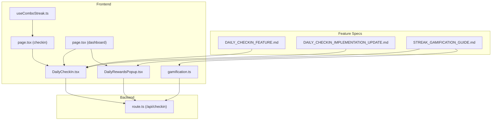
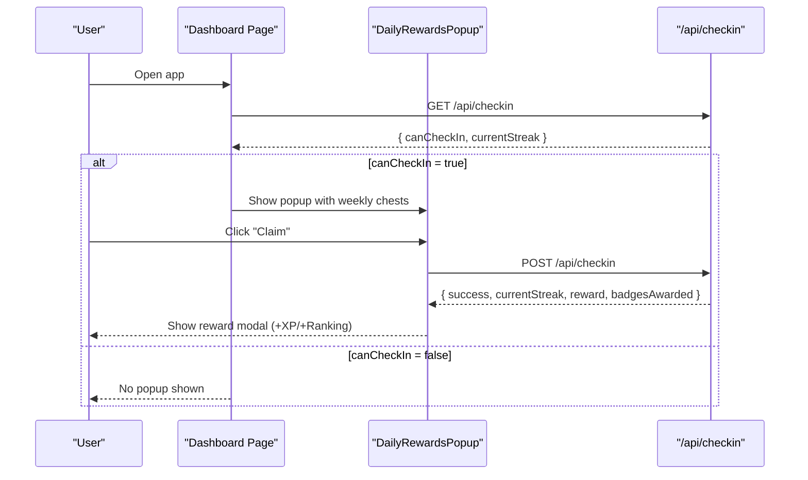
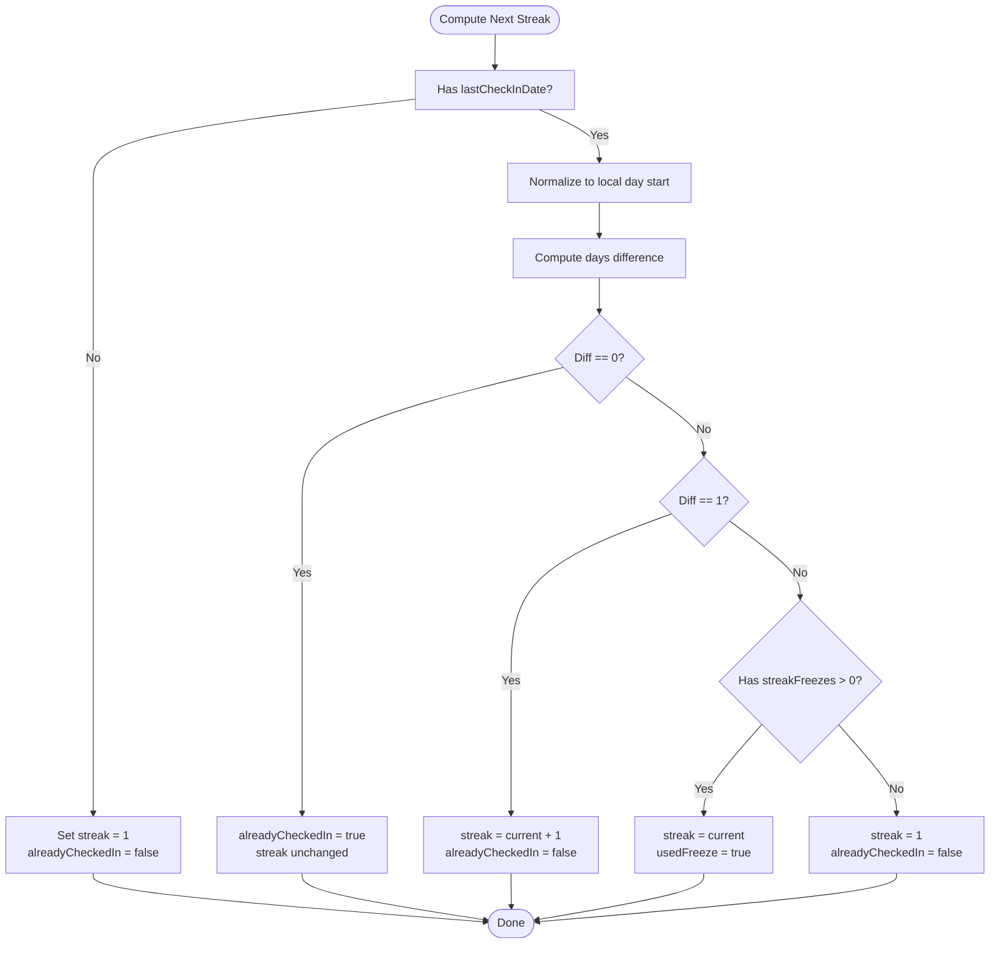
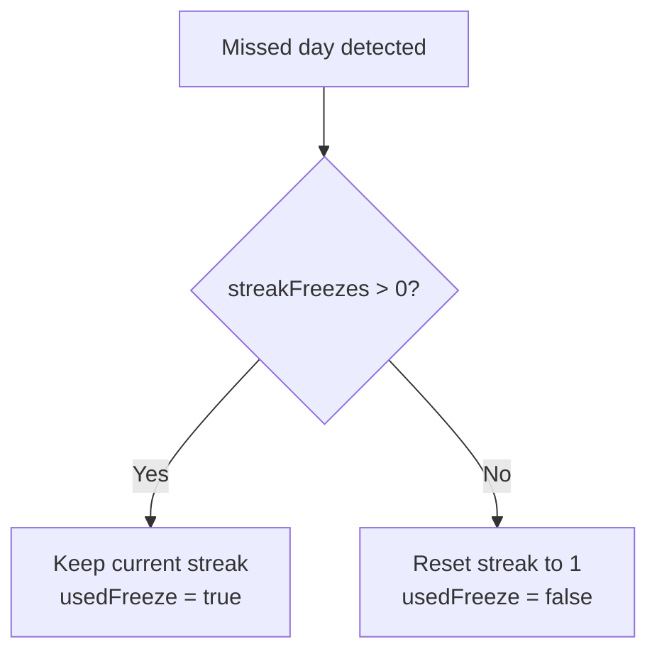
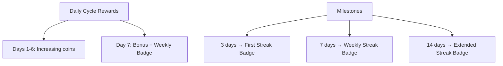
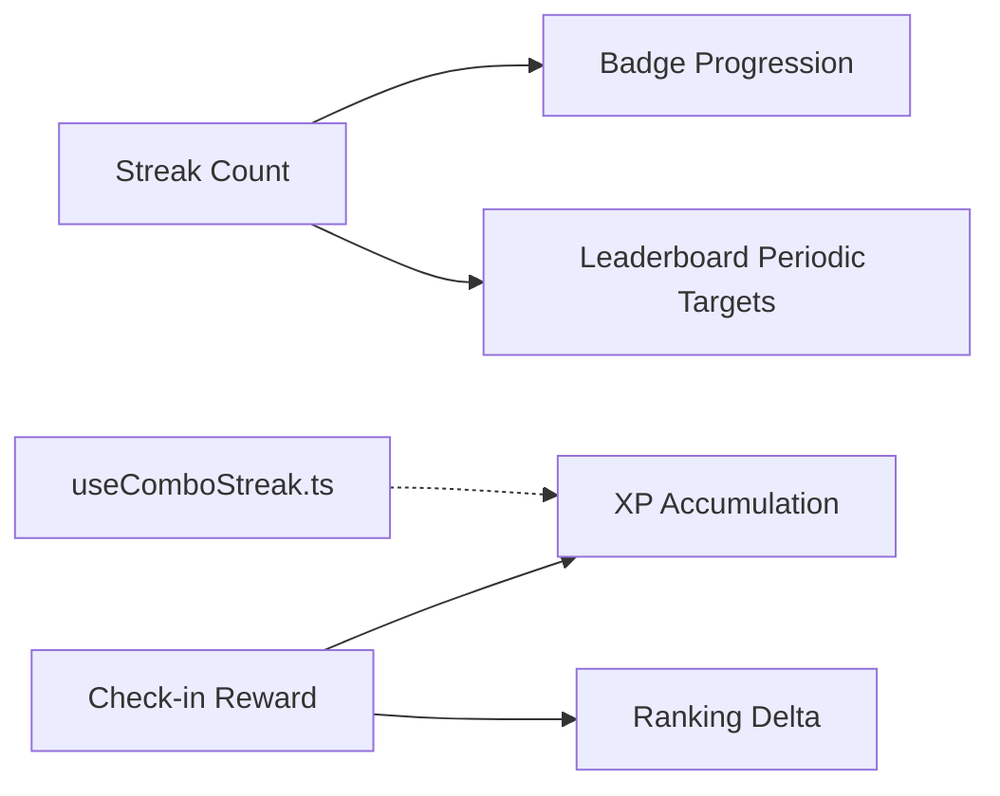
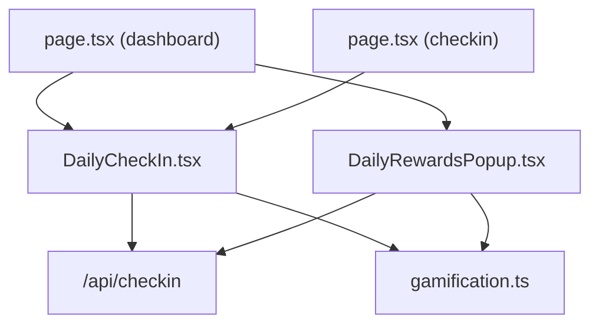

# Streak and Daily Check-in

<cite>
**Referenced Files in This Document**
- [DAILY_CHECKIN_FEATURE.md](file://PLAN/04_Features/DAILY_CHECKIN_FEATURE.md)
- [DAILY_CHECKIN_IMPLEMENTATION_UPDATE.md](file://PLAN/04_Features/DAILY_CHECKIN_IMPLEMENTATION_UPDATE.md)
- [STREAK_GAMIFICATION_GUIDE.md](file://PLAN/04_Features/STREAK_GAMIFICATION_GUIDE.md)
- [DailyCheckIn.tsx](file://english_pronunciation_app/frontend/src/components/gamification/DailyCheckIn.tsx)
- [DailyRewardsPopup.tsx](file://english_pronunciation_app/frontend/src/components/gamification/DailyRewardsPopup.tsx)
- [gamification.ts](file://english_pronunciation_app/frontend/src/lib/gamification.ts)
- [useComboStreak.ts](file://english_pronunciation_app/frontend/src/hooks/useComboStreak.ts)
- [page.tsx](file://english_pronunciation_app/frontend/src/app/checkin/page.tsx)
- [page.tsx](file://english_pronunciation_app/frontend/src/app/dashboard/page.tsx)
- [route.ts](file://english_pronunciation_app/frontend/src/app/api/checkin/route.ts)
</cite>

## Table of Contents
1. [Introduction](#introduction)
2. [Project Structure](#project-structure)
3. [Core Components](#core-components)
4. [Architecture Overview](#architecture-overview)
5. [Detailed Component Analysis](#detailed-component-analysis)
6. [Dependency Analysis](#dependency-analysis)
7. [Performance Considerations](#performance-considerations)
8. [Troubleshooting Guide](#troubleshooting-guide)
9. [Conclusion](#conclusion)
10. [Appendices](#appendices)

## Introduction
This document explains the streak tracking and daily check-in system, focusing on:
- Streak calculation algorithm: consecutive day detection, break handling, and streak freeze mechanics
- Daily check-in UI components: streak visualization, reward popup, and user interaction patterns
- Streak freeze functionality for maintaining streaks during missed days, gem-based streak protection, and recovery mechanisms
- Integration with the broader gamification system: XP, ranking score, and badge progression

The system supports two complementary flows:
- Passive streak growth via automatic check-ins when users complete exercises
- Active daily reward collection via a popup that appears on first app open per day

## Project Structure
Key files involved in the streak and daily check-in system:
- Feature specifications and plans
  - DAILY_CHECKIN_FEATURE.md
  - DAILY_CHECKIN_IMPLEMENTATION_UPDATE.md
  - STREAK_GAMIFICATION_GUIDE.md
- Frontend components
  - DailyCheckIn.tsx
  - DailyRewardsPopup.tsx
  - page.tsx (checkin page)
  - page.tsx (dashboard page)
- Backend API
  - route.ts (/api/checkin)
- Utility libraries
  - gamification.ts (XP, ranking, streak freeze, badges)
  - useComboStreak.ts (separate combo streak logic)



**Diagram sources**
- [DAILY_CHECKIN_FEATURE.md:1-371](file://PLAN/04_Features/DAILY_CHECKIN_FEATURE.md#L1-L371)
- [DAILY_CHECKIN_IMPLEMENTATION_UPDATE.md:1-33](file://PLAN/04_Features/DAILY_CHECKIN_IMPLEMENTATION_UPDATE.md#L1-L33)
- [STREAK_GAMIFICATION_GUIDE.md:1-569](file://PLAN/04_Features/STREAK_GAMIFICATION_GUIDE.md#L1-L569)
- [DailyCheckIn.tsx:1-234](file://english_pronunciation_app/frontend/src/components/gamification/DailyCheckIn.tsx#L1-L234)
- [DailyRewardsPopup.tsx:1-239](file://english_pronunciation_app/frontend/src/components/gamification/DailyRewardsPopup.tsx#L1-L239)
- [page.tsx](file://english_pronunciation_app/frontend/src/app/checkin/page.tsx)
- [page.tsx](file://english_pronunciation_app/frontend/src/app/dashboard/page.tsx)
- [route.ts](file://english_pronunciation_app/frontend/src/app/api/checkin/route.ts)
- [useComboStreak.ts:1-75](file://english_pronunciation_app/frontend/src/hooks/useComboStreak.ts#L1-L75)
- [gamification.ts:1-575](file://english_pronunciation_app/frontend/src/lib/gamification.ts#L1-L575)

**Section sources**
- [DAILY_CHECKIN_FEATURE.md:1-371](file://PLAN/04_Features/DAILY_CHECKIN_FEATURE.md#L1-L371)
- [DAILY_CHECKIN_IMPLEMENTATION_UPDATE.md:1-33](file://PLAN/04_Features/DAILY_CHECKIN_IMPLEMENTATION_UPDATE.md#L1-L33)
- [STREAK_GAMIFICATION_GUIDE.md:1-569](file://PLAN/04_Features/STREAK_GAMIFICATION_GUIDE.md#L1-L569)

## Core Components
- DailyCheckIn.tsx
  - Displays current streak, longest streak, total check-ins, and a weekly progress indicator
  - Provides a button to claim daily reward when eligible
  - Fetches status on mount and updates UI after check-in
- DailyRewardsPopup.tsx
  - Auto-appearance on first app open per day when eligible
  - Presents seven chests representing daily rewards for the current weekly cycle
  - Handles claiming today’s reward and shows a celebratory modal
- gamification.ts
  - Defines XP and ranking rewards for check-in
  - Implements streak freeze logic using gem-based protection
  - Manages badge definitions and awarding logic
- useComboStreak.ts
  - Separate combo streak logic for exercises (not daily check-in)
- API route.ts
  - Exposes GET /api/checkin for status and POST /api/checkin for claiming rewards

**Section sources**
- [DailyCheckIn.tsx:1-234](file://english_pronunciation_app/frontend/src/components/gamification/DailyCheckIn.tsx#L1-L234)
- [DailyRewardsPopup.tsx:1-239](file://english_pronunciation_app/frontend/src/components/gamification/DailyRewardsPopup.tsx#L1-L239)
- [gamification.ts:60-63](file://english_pronunciation_app/frontend/src/lib/gamification.ts#L60-L63)
- [gamification.ts:553-574](file://english_pronunciation_app/frontend/src/lib/gamification.ts#L553-L574)
- [useComboStreak.ts:1-75](file://english_pronunciation_app/frontend/src/hooks/useComboStreak.ts#L1-L75)
- [route.ts](file://english_pronunciation_app/frontend/src/app/api/checkin/route.ts)

## Architecture Overview
Two complementary flows power the streak system:

1) Automatic streak growth via exercise completion:
- After a successful exercise submission, the frontend calls POST /api/checkin
- The backend validates whether the user can check-in today and updates streak accordingly
- The frontend displays a toast/notification with XP and ranking gains

2) Daily reward popup on first app open per day:
- On initial dashboard load, the app checks GET /api/checkin
- If eligible, a popup appears with seven chests for the weekly cycle
- Claiming today’s chest triggers POST /api/checkin and shows a reward modal



**Diagram sources**
- [STREAK_GAMIFICATION_GUIDE.md:148-194](file://PLAN/04_Features/STREAK_GAMIFICATION_GUIDE.md#L148-L194)
- [DailyRewardsPopup.tsx:31-63](file://english_pronunciation_app/frontend/src/components/gamification/DailyRewardsPopup.tsx#L31-L63)
- [route.ts](file://english_pronunciation_app/frontend/src/app/api/checkin/route.ts)

## Detailed Component Analysis

### Streak Calculation Algorithm
The streak computation centers on the last check-in date and local day boundaries:
- If last check-in was today → already checked in
- If last check-in was yesterday → streak +1
- If last check-in was more than one day ago → reset to 1 (unless streak freeze applies)
- If no prior check-in → start at 1



**Diagram sources**
- [gamification.ts:553-574](file://english_pronunciation_app/frontend/src/lib/gamification.ts#L553-L574)

**Section sources**
- [gamification.ts:553-574](file://english_pronunciation_app/frontend/src/lib/gamification.ts#L553-L574)

### Streak Freeze Mechanics (Gem-based Protection)
Users can purchase a “streak freeze” using gems to prevent losing streak on a missed day:
- If a user misses a day but has at least one streak freeze, the streak remains unchanged
- If no freeze is available, the streak resets to 1
- The compute function returns usedFreeze = true when a freeze is applied



**Diagram sources**
- [gamification.ts:553-574](file://english_pronunciation_app/frontend/src/lib/gamification.ts#L553-L574)

**Section sources**
- [gamification.ts:547-551](file://english_pronunciation_app/frontend/src/lib/gamification.ts#L547-L551)
- [gamification.ts:553-574](file://english_pronunciation_app/frontend/src/lib/gamification.ts#L553-L574)

### Daily Check-in UI Components
- DailyCheckIn.tsx
  - Shows current streak, longest streak, and total check-ins
  - Renders a weekly progress bar indicating the current day within the 7-day cycle
  - Enables/disables the claim button based on eligibility
  - Displays messages and loading states
- DailyRewardsPopup.tsx
  - Presents seven chests with increasing rewards
  - Highlights today’s chest with a pulsing animation
  - Shows a celebratory modal after claiming with XP and ranking gains

```mermaid
classDiagram
class DailyCheckIn {
+props : currentStreak, longestStreak, totalCheckIns, lastCheckIn, canCheckIn
+state : status, isLoading, isSubmitting, message
+handleCheckIn()
+loadStatus()
}
class DailyRewardsPopup {
+props : currentStreak, onClaim, onClose
+state : showReward, claimedReward
+handleClaim()
+handleCloseReward()
}
DailyCheckIn --> "/api/checkin" : "fetch status / claim"
DailyRewardsPopup --> "/api/checkin" : "claim reward"
```

**Diagram sources**
- [DailyCheckIn.tsx:19-161](file://english_pronunciation_app/frontend/src/components/gamification/DailyCheckIn.tsx#L19-L161)
- [DailyRewardsPopup.tsx:15-58](file://english_pronunciation_app/frontend/src/components/gamification/DailyRewardsPopup.tsx#L15-L58)
- [route.ts](file://english_pronunciation_app/frontend/src/app/api/checkin/route.ts)

**Section sources**
- [DailyCheckIn.tsx:19-234](file://english_pronunciation_app/frontend/src/components/gamification/DailyCheckIn.tsx#L19-L234)
- [DailyRewardsPopup.tsx:15-239](file://english_pronunciation_app/frontend/src/components/gamification/DailyRewardsPopup.tsx#L15-L239)

### Reward Structures and Milestones
- Daily rewards (weekly cycle):
  - Days 1–6: Increasing coin rewards
  - Day 7: Bonus reward and a weekly badge
- XP and ranking rewards:
  - Each check-in grants fixed XP and ranking score increments
- Milestones (permanent badges):
  - Achieved by reaching specific streak counts (e.g., 3, 7, 14 days)
  - Awarded automatically upon meeting criteria



**Diagram sources**
- [STREAK_GAMIFICATION_GUIDE.md:196-222](file://PLAN/04_Features/STREAK_GAMIFICATION_GUIDE.md#L196-L222)
- [gamification.ts:60-63](file://english_pronunciation_app/frontend/src/lib/gamification.ts#L60-L63)
- [gamification.ts:127-155](file://english_pronunciation_app/frontend/src/lib/gamification.ts#L127-L155)

**Section sources**
- [STREAK_GAMIFICATION_GUIDE.md:196-222](file://PLAN/04_Features/STREAK_GAMIFICATION_GUIDE.md#L196-L222)
- [gamification.ts:60-63](file://english_pronunciation_app/frontend/src/lib/gamification.ts#L60-L63)
- [gamification.ts:127-155](file://english_pronunciation_app/frontend/src/lib/gamification.ts#L127-L155)

### Streak Progression and Integration with Gamification
- Streak contributes to badge progression and periodic leaderboards
- XP and ranking deltas are computed per check-in and aggregated in the broader scoring system
- The system supports separate combo streak logic for exercises via useComboStreak.ts



**Diagram sources**
- [gamification.ts:380-488](file://english_pronunciation_app/frontend/src/lib/gamification.ts#L380-L488)
- [gamification.ts:490-531](file://english_pronunciation_app/frontend/src/lib/gamification.ts#L490-L531)
- [useComboStreak.ts:1-75](file://english_pronunciation_app/frontend/src/hooks/useComboStreak.ts#L1-L75)

**Section sources**
- [gamification.ts:380-488](file://english_pronunciation_app/frontend/src/lib/gamification.ts#L380-L488)
- [gamification.ts:490-531](file://english_pronunciation_app/frontend/src/lib/gamification.ts#L490-L531)
- [useComboStreak.ts:1-75](file://english_pronunciation_app/frontend/src/hooks/useComboStreak.ts#L1-L75)

## Dependency Analysis
- DailyCheckIn.tsx depends on:
  - API route.ts for status and claiming
  - gamification.ts constants for reward amounts
- DailyRewardsPopup.tsx depends on:
  - API route.ts for claiming
  - gamification.ts for reward computations and freeze logic
- Dashboard and check-in pages integrate these components and trigger the popup logic



**Diagram sources**
- [DailyCheckIn.tsx:19-161](file://english_pronunciation_app/frontend/src/components/gamification/DailyCheckIn.tsx#L19-L161)
- [DailyRewardsPopup.tsx:15-58](file://english_pronunciation_app/frontend/src/components/gamification/DailyRewardsPopup.tsx#L15-L58)
- [route.ts](file://english_pronunciation_app/frontend/src/app/api/checkin/route.ts)
- [gamification.ts:60-63](file://english_pronunciation_app/frontend/src/lib/gamification.ts#L60-L63)

**Section sources**
- [DailyCheckIn.tsx:19-161](file://english_pronunciation_app/frontend/src/components/gamification/DailyCheckIn.tsx#L19-L161)
- [DailyRewardsPopup.tsx:15-58](file://english_pronunciation_app/frontend/src/components/gamification/DailyRewardsPopup.tsx#L15-L58)
- [route.ts](file://english_pronunciation_app/frontend/src/app/api/checkin/route.ts)
- [gamification.ts:60-63](file://english_pronunciation_app/frontend/src/lib/gamification.ts#L60-L63)

## Performance Considerations
- Optimize UI updates with optimistic rendering: update the streak locally and reconcile with server response
- Debounce repeated API calls to avoid redundant network requests
- Use UTC-based date comparisons to prevent timezone-related inconsistencies
- Minimize re-renders by memoizing derived values (e.g., weekly cycle day)

[No sources needed since this section provides general guidance]

## Troubleshooting Guide
Common issues and resolutions:
- API connectivity errors:
  - Display user-friendly messages and retry prompts
  - Validate response status and handle network failures gracefully
- Double check-in prevention:
  - Respect ALREADY_CHECKED_IN error code and disable the claim button
- Streak reset scenarios:
  - Communicate reset reasons clearly and encourage continued participation
- Accessibility:
  - Ensure keyboard navigation, focus management, and ARIA labels for modals and buttons

**Section sources**
- [DailyCheckIn.tsx:76-96](file://english_pronunciation_app/frontend/src/components/gamification/DailyCheckIn.tsx#L76-L96)
- [DailyCheckIn.tsx:147-155](file://english_pronunciation_app/frontend/src/components/gamification/DailyCheckIn.tsx#L147-L155)
- [STREAK_GAMIFICATION_GUIDE.md:504-553](file://PLAN/04_Features/STREAK_GAMIFICATION_GUIDE.md#L504-L553)

## Conclusion
The streak and daily check-in system combines passive streak growth with an engaging daily reward popup to reinforce habit formation. The streak algorithm is robust against missed days while offering gem-based freeze protection. Clear UI feedback, milestone badges, and integrated XP/ranking updates contribute to a cohesive gamified experience that drives retention and motivation.

[No sources needed since this section summarizes without analyzing specific files]

## Appendices

### Implementation Examples (by file reference)
- Streak state management and date-based calculations
  - [DailyCheckIn.tsx:69-104](file://english_pronunciation_app/frontend/src/components/gamification/DailyCheckIn.tsx#L69-L104)
  - [gamification.ts:553-574](file://english_pronunciation_app/frontend/src/lib/gamification.ts#L553-L574)
- User interaction patterns for daily check-in
  - [DailyRewardsPopup.tsx:31-63](file://english_pronunciation_app/frontend/src/components/gamification/DailyRewardsPopup.tsx#L31-L63)
  - [route.ts](file://english_pronunciation_app/frontend/src/app/api/checkin/route.ts)
- Streak freeze mechanics and recovery
  - [gamification.ts:547-551](file://english_pronunciation_app/frontend/src/lib/gamification.ts#L547-L551)
  - [gamification.ts:553-574](file://english_pronunciation_app/frontend/src/lib/gamification.ts#L553-L574)
- UI components for streak status, check-in buttons, and reward notifications
  - [DailyCheckIn.tsx:169-231](file://english_pronunciation_app/frontend/src/components/gamification/DailyCheckIn.tsx#L169-L231)
  - [DailyRewardsPopup.tsx:65-174](file://english_pronunciation_app/frontend/src/components/gamification/DailyRewardsPopup.tsx#L65-L174)