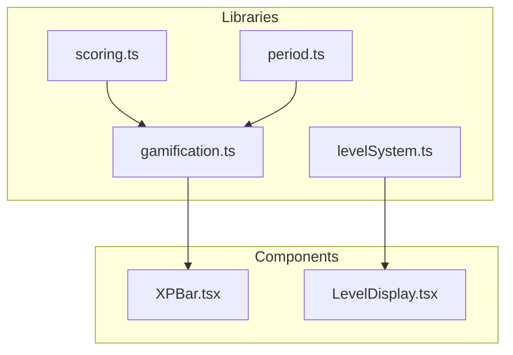
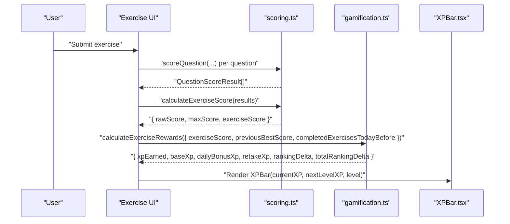
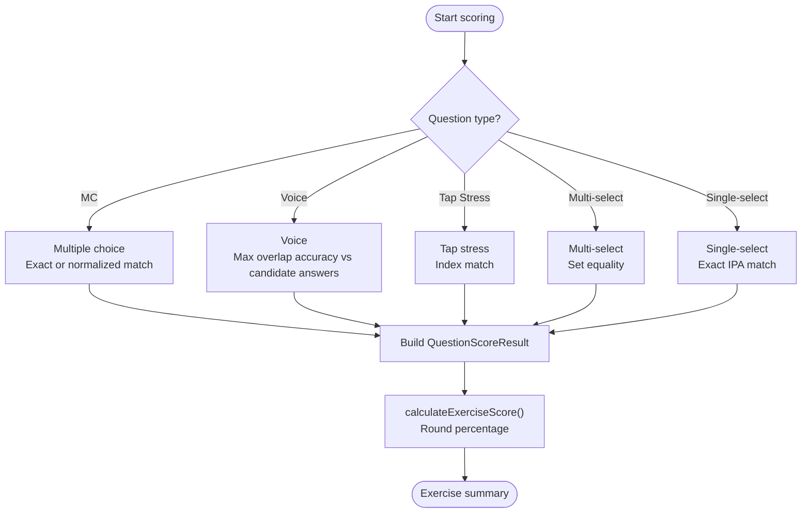
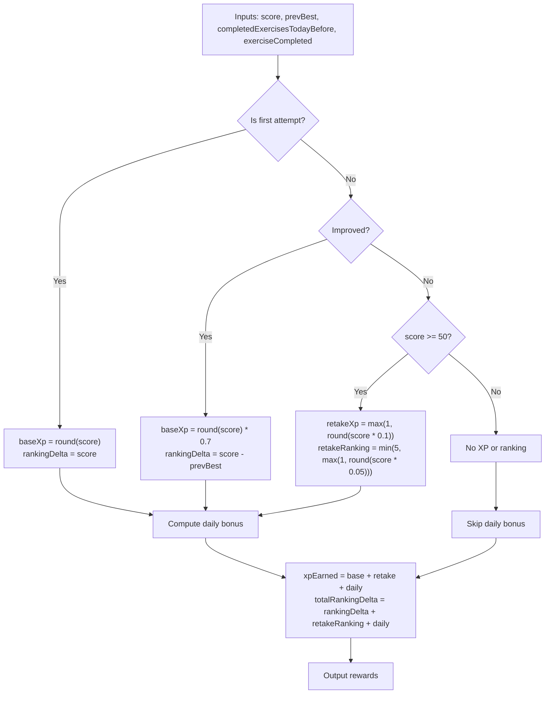
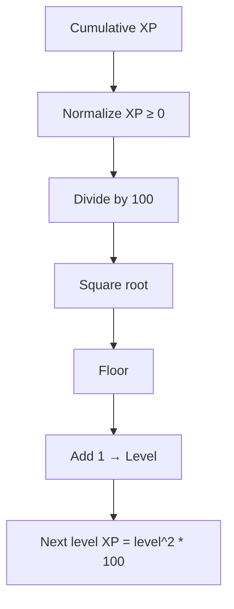
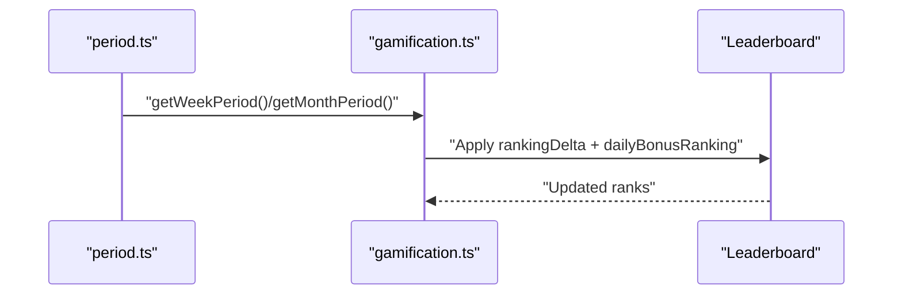
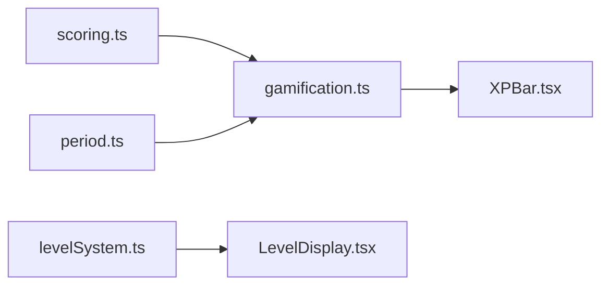

# XP and Scoring System

<cite>
**Referenced Files in This Document**
- [gamification.ts](file://english_pronunciation_app/frontend/src/lib/gamification.ts)
- [scoring.ts](file://english_pronunciation_app/frontend/src/lib/scoring.ts)
- [levelSystem.ts](file://english_pronunciation_app/frontend/src/lib/levelSystem.ts)
- [period.ts](file://english_pronunciation_app/frontend/src/lib/period.ts)
- [XPBar.tsx](file://english_pronunciation_app/frontend/src/components/gamification/XPBar.tsx)
- [gamification.test.ts](file://english_pronunciation_app/frontend/src/lib/__tests__/gamification.test.ts)
- [scoring.test.ts](file://english_pronunciation_app/frontend/src/lib/__tests__/scoring.test.ts)
</cite>

## Table of Contents
1. [Introduction](#introduction)
2. [Project Structure](#project-structure)
3. [Core Components](#core-components)
4. [Architecture Overview](#architecture-overview)
5. [Detailed Component Analysis](#detailed-component-analysis)
6. [Dependency Analysis](#dependency-analysis)
7. [Performance Considerations](#performance-considerations)
8. [Troubleshooting Guide](#troubleshooting-guide)
9. [Conclusion](#conclusion)

## Introduction
This document explains the XP calculation and scoring algorithms used in the English pronunciation training application. It covers:
- How exercise scores are converted to XP points
- First attempt bonuses, improvement multipliers, and retake penalties
- Daily completion bonuses and ranking deltas
- The XP-to-level progression system using a square root formula
- Practical examples showing how different outcomes affect XP accumulation
- How performance influences overall user progression and leaderboard impact

## Project Structure
The XP and scoring logic is implemented in the frontend library under the `/frontend/src/lib` directory, with presentation components in `/frontend/src/components/gamification`. Tests validate the behavior of the scoring and XP systems.

**Diagram sources**
- [scoring.ts:1-227](file://english_pronunciation_app/frontend/src/lib/scoring.ts#L1-L227)
- [gamification.ts:1-575](file://english_pronunciation_app/frontend/src/lib/gamification.ts#L1-L575)
- [levelSystem.ts:1-133](file://english_pronunciation_app/frontend/src/lib/levelSystem.ts#L1-L133)
- [period.ts:1-33](file://english_pronunciation_app/frontend/src/lib/period.ts#L1-L33)
- [XPBar.tsx:1-50](file://english_pronunciation_app/frontend/src/components/gamification/XPBar.tsx#L1-L50)

**Section sources**
- [scoring.ts:1-227](file://english_pronunciation_app/frontend/src/lib/scoring.ts#L1-L227)
- [gamification.ts:1-575](file://english_pronunciation_app/frontend/src/lib/gamification.ts#L1-L575)
- [levelSystem.ts:1-133](file://english_pronunciation_app/frontend/src/lib/levelSystem.ts#L1-L133)
- [period.ts:1-33](file://english_pronunciation_app/frontend/src/lib/period.ts#L1-L33)
- [XPBar.tsx:1-50](file://english_pronunciation_app/frontend/src/components/gamification/XPBar.tsx#L1-L50)

## Core Components
- Scoring module: Converts individual question responses into a normalized exercise score and rating.
- Gamification module: Computes XP rewards, daily bonuses, retake adjustments, and ranking deltas per exercise submission.
- Level system: Translates cumulative XP into levels using a square root progression.
- Period utilities: Determine weekly/monthly leaderboard periods.
- Presentation components: Visualize XP bars and level displays.

Key responsibilities:
- Scoring: Accurate scoring across question types, including voice transcription accuracy and normalized text matching.
- Rewards: Fair XP distribution based on attempt type, score thresholds, and daily milestones.
- Progression: Non-linear XP growth via square root to encourage long-term engagement.

**Section sources**
- [scoring.ts:203-227](file://english_pronunciation_app/frontend/src/lib/scoring.ts#L203-L227)
- [gamification.ts:195-234](file://english_pronunciation_app/frontend/src/lib/gamification.ts#L195-L234)
- [gamification.ts:178-184](file://english_pronunciation_app/frontend/src/lib/gamification.ts#L178-L184)
- [period.ts:19-32](file://english_pronunciation_app/frontend/src/lib/period.ts#L19-L32)
- [XPBar.tsx:15-49](file://english_pronunciation_app/frontend/src/components/gamification/XPBar.tsx#L15-L49)

## Architecture Overview
The system integrates scoring and gamification to produce XP and ranking updates after each exercise submission. The flow below maps to actual code paths.

**Diagram sources**
- [scoring.ts:191-215](file://english_pronunciation_app/frontend/src/lib/scoring.ts#L191-L215)
- [gamification.ts:195-234](file://english_pronunciation_app/frontend/src/lib/gamification.ts#L195-L234)
- [XPBar.tsx:15-49](file://english_pronunciation_app/frontend/src/components/gamification/XPBar.tsx#L15-L49)

## Detailed Component Analysis

### Scoring Module
The scoring module computes per-question correctness and transforms raw scores into an exercise percentage. It supports:
- Multiple choice with exact or normalized matching
- Voice questions scored by word-overlap accuracy
- Specialized question types (stress tapping, multi-select, single-select)
- Final exercise score and rating classification

Scoring highlights:
- Word overlap accuracy computed token-wise and rounded to nearest percent.
- Voice scoring uses max overlap against primary or accepted answers.
- Exercise score is rounded percentage of raw over max score.
- Ratings: Needs Practice (<70), Pass (70–79), Good (80–89), Excellent (≥90).
- Completion threshold: ≥70 required to count as completed.

**Diagram sources**
- [scoring.ts:74-201](file://english_pronunciation_app/frontend/src/lib/scoring.ts#L74-L201)
- [scoring.ts:203-215](file://english_pronunciation_app/frontend/src/lib/scoring.ts#L203-L215)

**Section sources**
- [scoring.ts:74-201](file://english_pronunciation_app/frontend/src/lib/scoring.ts#L74-L201)
- [scoring.ts:203-227](file://english_pronunciation_app/frontend/src/lib/scoring.ts#L203-L227)
- [scoring.test.ts:121-200](file://english_pronunciation_app/frontend/src/lib/__tests__/scoring.test.ts#L121-L200)
- [scoring.test.ts:202-292](file://english_pronunciation_app/frontend/src/lib/__tests__/scoring.test.ts#L202-L292)

### Gamification and XP Calculation
The gamification module calculates XP rewards and ranking deltas per exercise submission. Inputs include:
- exerciseScore: Derived from scoring
- previousBestScore: Best score on this exercise previously
- completedExercisesTodayBefore: Count before today’s submission
- exerciseCompleted: Whether the submission counts as a completed exercise

Rules:
- First attempt: Base XP equals the rounded exercise score; ranking delta equals the exercise score.
- Improved retake: Base XP is 70% of rounded score; ranking delta equals score improvement.
- Retake with score ≥50 but no improvement: Small practice XP (10%) and capped ranking reward (≤5).
- Low-score (<50) or non-completed submissions: No XP or ranking gains.
- Daily completion bonus: Applied when the submission completes the exercise, based on milestones reached after submission.

Daily bonus tiers:
- 2+ exercises: +5 XP, +2 ranking
- 3+ exercises: +10 XP, +4 ranking
- 5+ exercises: +20 XP, +8 ranking
- 8+ exercises: +30 XP, +12 ranking

**Diagram sources**
- [gamification.ts:195-234](file://english_pronunciation_app/frontend/src/lib/gamification.ts#L195-L234)
- [gamification.ts:186-193](file://english_pronunciation_app/frontend/src/lib/gamification.ts#L186-L193)

**Section sources**
- [gamification.ts:195-234](file://english_pronunciation_app/frontend/src/lib/gamification.ts#L195-L234)
- [gamification.test.ts:17-108](file://english_pronunciation_app/frontend/src/lib/__tests__/gamification.test.ts#L17-L108)

### XP-to-Level Progression
Levels are derived from cumulative XP using a square root progression:
- Level = floor(sqrt(max(0, XP) / 100)) + 1
- XP required for next level = level^2 × 100

This creates increasing XP costs to level up, encouraging sustained participation.

**Diagram sources**
- [gamification.ts:178-184](file://english_pronunciation_app/frontend/src/lib/gamification.ts#L178-L184)

**Section sources**
- [gamification.ts:178-184](file://english_pronunciation_app/frontend/src/lib/gamification.ts#L178-L184)
- [gamification.test.ts:110-118](file://english_pronunciation_app/frontend/src/lib/__tests__/gamification.test.ts#L110-L118)

### Ranking Deltas and Leaderboards
- Ranking deltas are computed per exercise and accumulate toward weekly and monthly leaderboard positions.
- Weekly and monthly periods are determined by ISO-like week numbering and calendar month formatting.
- Daily bonus contributes ranking points proportional to milestone reached.

**Diagram sources**
- [period.ts:19-32](file://english_pronunciation_app/frontend/src/lib/period.ts#L19-L32)
- [gamification.ts:236-244](file://english_pronunciation_app/frontend/src/lib/gamification.ts#L236-L244)

**Section sources**
- [period.ts:19-32](file://english_pronunciation_app/frontend/src/lib/period.ts#L19-L32)
- [gamification.ts:236-244](file://english_pronunciation_app/frontend/src/lib/gamification.ts#L236-L244)

### Presentation Components
- XPBar: Displays current XP, next level requirement, and remaining XP to level up.
- LevelDisplay: Shows level, title, icon, and progress toward next level (lesson-based system).

These components rely on the underlying XP and level computations to render accurate progress visuals.

**Section sources**
- [XPBar.tsx:15-49](file://english_pronunciation_app/frontend/src/components/gamification/XPBar.tsx#L15-L49)
- [levelSystem.ts:77-99](file://english_pronunciation_app/frontend/src/lib/levelSystem.ts#L77-L99)

## Dependency Analysis
The scoring and gamification modules are tightly coupled: scoring produces the exercise score used by gamification to compute XP and ranking deltas. Period utilities support leaderboard period computation. Presentation components consume XP and level data.

**Diagram sources**
- [scoring.ts:1-227](file://english_pronunciation_app/frontend/src/lib/scoring.ts#L1-L227)
- [gamification.ts:1-575](file://english_pronunciation_app/frontend/src/lib/gamification.ts#L1-L575)
- [period.ts:1-33](file://english_pronunciation_app/frontend/src/lib/period.ts#L1-L33)
- [XPBar.tsx:1-50](file://english_pronunciation_app/frontend/src/components/gamification/XPBar.tsx#L1-L50)
- [levelSystem.ts:1-133](file://english_pronunciation_app/frontend/src/lib/levelSystem.ts#L1-L133)

**Section sources**
- [scoring.ts:1-227](file://english_pronunciation_app/frontend/src/lib/scoring.ts#L1-L227)
- [gamification.ts:1-575](file://english_pronunciation_app/frontend/src/lib/gamification.ts#L1-L575)
- [period.ts:1-33](file://english_pronunciation_app/frontend/src/lib/period.ts#L1-L33)
- [XPBar.tsx:1-50](file://english_pronunciation_app/frontend/src/components/gamification/XPBar.tsx#L1-L50)
- [levelSystem.ts:1-133](file://english_pronunciation_app/frontend/src/lib/levelSystem.ts#L1-L133)

## Performance Considerations
- Scoring complexity is linear in the number of questions per exercise.
- XP reward computation is constant-time with minimal branching.
- Ranking delta aggregation is O(N) over attempts.
- Period calculations are constant-time date operations.

Recommendations:
- Keep question counts reasonable per exercise to maintain responsiveness.
- Cache leaderboard period strings when rendering multiple components.
- Avoid recalculating XP levels frequently; memoize results when appropriate.

## Troubleshooting Guide
Common issues and resolutions:
- No XP earned despite completing an exercise:
  - Verify the submission counted as completed and the score was ≥50.
  - Confirm the attempt was not a low-score retake without improvement.
  - Check daily bonus thresholds were met after submission.
- Unexpected ranking delta:
  - For improved retakes, ranking delta equals score improvement, not full score.
  - For retakes with score ≥50, ranking delta is capped and scaled.
- Level not increasing:
  - Ensure cumulative XP reflects recent rewards; remember XP-to-level uses square root progression.
- Leaderboard rank not updating:
  - Confirm the weekly/monthly period matches the expected ISO week or calendar month.

Validation references:
- Scoring thresholds and ratings
  - [scoring.test.ts:112-119](file://english_pronunciation_app/frontend/src/lib/__tests__/scoring.test.ts#L112-L119)
- XP reward scenarios
  - [gamification.test.ts:17-108](file://english_pronunciation_app/frontend/src/lib/__tests__/gamification.test.ts#L17-L108)
- Level progression thresholds
  - [gamification.test.ts:110-118](file://english_pronunciation_app/frontend/src/lib/__tests__/gamification.test.ts#L110-L118)

**Section sources**
- [scoring.test.ts:112-119](file://english_pronunciation_app/frontend/src/lib/__tests__/scoring.test.ts#L112-L119)
- [gamification.test.ts:17-108](file://english_pronunciation_app/frontend/src/lib/__tests__/gamification.test.ts#L17-L108)
- [gamification.test.ts:110-118](file://english_pronunciation_app/frontend/src/lib/__tests__/gamification.test.ts#L110-L118)

## Conclusion
The XP and scoring system balances immediate feedback with long-term progression:
- Scoring ensures fair credit for accuracy across question types.
- Rewards incentivize first attempts, improvements, and consistent daily practice.
- Square root XP progression encourages sustained effort over time.
- Clear ranking deltas and periodic leaderboards reinforce competitive engagement.

This design provides a robust foundation for learner motivation and measurable progress tracking.